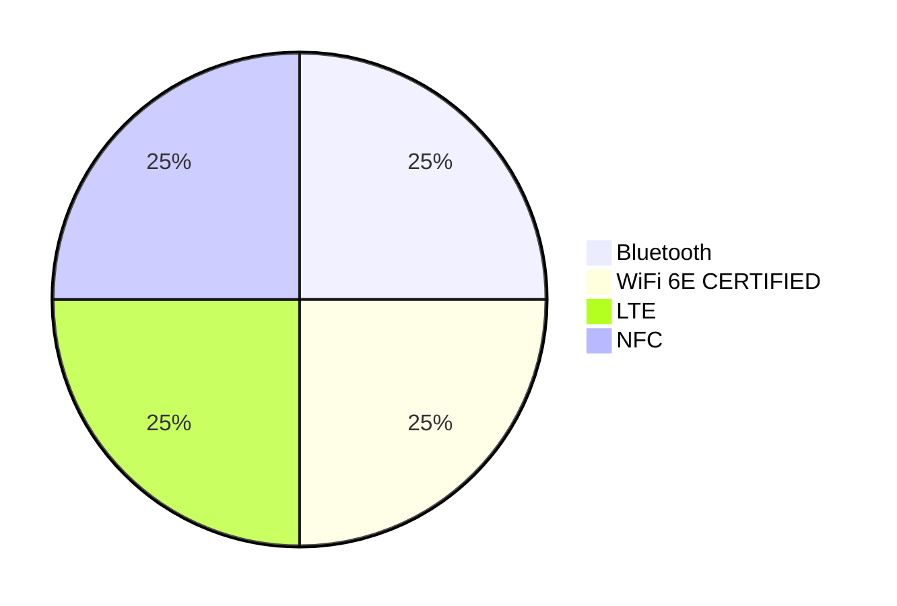
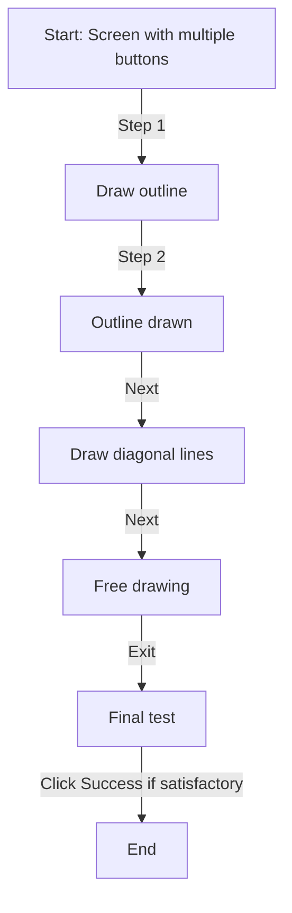
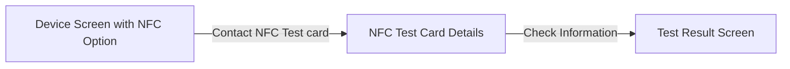
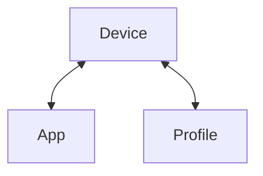
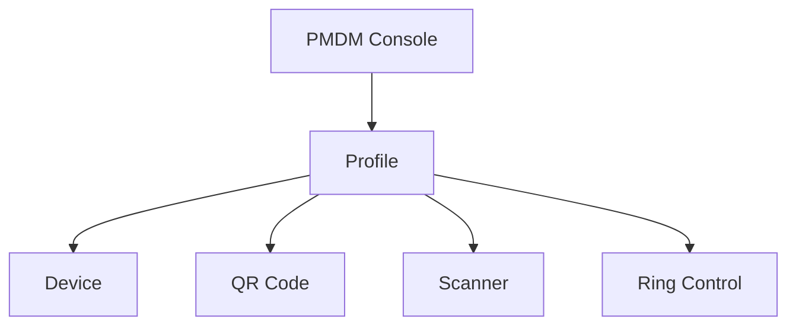
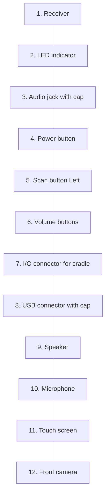
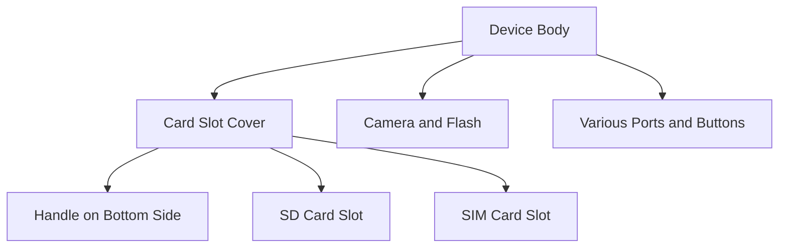
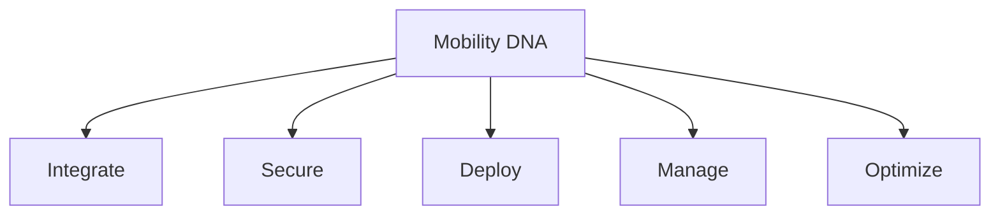

# Contents of 1)PM452.md
Point Mobile 2024
# PM452
PURPOSE-BUILT FOR DEMANDING OPERATIONS
[The image shows a rugged mobile device with a large touchscreen display. The screen shows the Android interface with various app icons including Google, AudioPlayer, EmKit, and Play Store. The device has a full QWERTY keyboard with additional function keys below the screen.]
---
# The Ultimate Solution for Data Capture in Any Environment
The PM452 brings you the latest in mobility features and options to maximize worker efficiency and boost the return on your device investment. Designed for logistics, warehousing, and retail, it thrives in the demanding conditions of 24/7 operations, ensuring your workforce stays connected and productive wherever they are.
---
# Future-Proof Operating System
Android 13 with GMS certification ensures modern app compatibility and smooth operations. PM452 is upgradeable to Android 18, offering unmatched longevity.
# Rugged Durability
MIL-STD-810H certification for military-grade durability. Ensures seamless operations, even in temperatures as low as -30°C.
# Hot-Swappable Battery
Choice of 4,000mAh or 5,700mAh batteries for uninterrupted operations in demanding environments. Hot-swappable capability eliminates downtime during battery changes.
# Compact and Lightweight
Weighs only 450g, making it lighter and more ergonomic than most competitors.
# Advanced Scanning
Multiple 1D/2D scanning engines, including long-range scanning up to 29 meters. Outperforms competitions in long-range barcode scanning.
# 3 Keypad Options
Offers Numeric, Function Numeric, and Alphanumeric keypads for diverse data entry requirements.
---
# Two Model Types
The PM452 is available in two versatile configurations to address varied operational demands
## Standard Form Factor
01. A compact, lightweight design optimized for mobility, making it suitable for applications requiring a balance of scanning, data entry, and portability.
02. Perfect for multi-functional workflows in field services, healthcare, and transportation, where users perform a combination of data capture and manual input tasks.
03. Its streamlined design supports easy integration into vehicle-mounted or handheld workflows.
## Gun-Trigger
01. Designed for intensive scanning operations, the pistol grip form factor enhances ergonomics and reduces operator fatigue during extended use.
02. Ideal for applications in industries such as warehousing, logistics, and retail inventory management, where workers require a scanning-focused workflow.
03. Provides a secure, natural grip, ensuring speed and accuracy during repetitive scanning tasks.
---
# Seamless Upgrade
## Protect Your Investments, Transition with Ease
The PM452 supports all existing PM451 accessories, offering a cost-effective and seamless upgrade path. Transitioning to the next generation of handheld terminals has never been easier.
### Accessory Compatibility
Leverage your current inventory of charging cradles, cables, batteries, and more without additional expenses.
### Reduced Deployment Costs
No need for extensive reconfiguration - simply integrate the PM452 into your existing workflows.
### Device Management Tools
Integrates with current device management solutions for centralized control over device fleets.
---
# Start Strong with the Best
Whether you're upgrading from the PM452 or adopting Point Mobile technology for the first time
CPU:
- Octa-core 2.2 GHz
OS:
- Android 13 (upgradable to Android 18)
Memory:
- 4GB / 64GB or 6GB / 128GB
Storage:
- 512GB micro SD 1 micro SIM
## Why it Matters
- **Application Efficiency**: A powerful CPU ensures faster data processing, enabling quick barcode scans, real-time analytics, and seamless application performance.
- **Energy Efficiency**: Modern processors optimize power consumption, extending battery life during intensive tasks.
- **Future-Ready**: A robust CPU supports evolving software and application needs, ensuring the device remains relevant for years.
- **Security Updates**: Regular updates protect against emerging cybersecurity threats, ensuring data safety.
- **User Experience**: Familiar and intuitive interfaces reduce training time and improve user efficiency.
- **App Compatibility**: Android's vast ecosystem ensures compatibility with the latest enterprise applications and tools.
- **Application Performance**: Ensures smooth multitasking and prevents lag when running complex applications, enabling seamless operation in demanding environments.
- **Data Handling**: Ample storage is vital for storing large datasets, including scanned barcode information, images, and logs, without requiring frequent data transfers to external systems.
- **Future-Proofing**: Expandable storage allows businesses to scale their operations without replacing devices, ensuring the device remains useful as data requirements grow.
- **Support for Modern Software**: Applications and updates often require substantial memory and storage space to function efficiently, ensuring the device can support future advancements and additional functionality.
---
# Powering the PM452
## Delivering High-Performance Solutions for AIDC at a Smarter Cost
For AIDC-specific needs, where efficiency, affordability, and scalability are critical, the MTK CPU is a highly competitive option. Qualcomm may excel in premium consumer devices, but MediaTek provides all the essential features needed for industrial environments at a fraction of the cost.
### AnTuTu Benchmark Results: +26% CPU
PM451:
- CPU: 93469
- GPU: 37639
- Memory: 58698
PM452:
- CPU: 127471
- GPU: 63361
- Memory: 98847
### High-Performance Architecture
Octa-core, perfect balance of speed and efficiency
The octa-core configuration strikes a balance between power and efficiency, making it ideal for devices that require multitasking capabilities.
### Energy Efficiency
Longer battery life and thermal stability
The 6nm process and efficient core architecture make MediaTek chips highly power-efficient, a critical feature for AIDC devices that must last long shifts.
### Seamless Connectivity
Offers reliable 4G LTE and Wi-Fi 5 support, with a focus on affordable and stable connectivity options ideal for industrial devices.
### Cost and Scalability
Known for cost-effective solutions that provide robust performance and scalability, enabling businesses to deploy devices across large fleets affordably.
---
# Cold Storage Ready
Frozen food safety standards under the EU regulations mandate maintaining at least -18°C to preserve product quality during storage and transport.
## PM452 is engineered to perform in sub-zero temperatures, reaching as low as -30°C
Forget your device working in the cold storage area? No worries—the PM452 stays fully operational and ready for use when you retrieve it.
---
# Scanning Options
Advanced scan engine options for every task
Rapid, first-time barcode capture for enhanced productivity and versatility for close, medium, and long-range scanning needs.
## 1D/2D N5703
- Compact and reliable for general-purpose barcode scanning.
- Reads standard and high-density barcodes quickly and accurately, ideal for scanning product labels in retail stores.
## EX30 (29m)
- Scans barcodes from short distances to 29 meters, making it perfect for logistics, warehousing, and pallet scanning.
- Enables both near and far barcode scanning in a single device, enhances job efficiency with fast, aim-and-scan capability.
## N6803 FR
- Excels in reading damaged, poorly printed, or low-contrast barcodes
- Suitable for applications requiring scanning at varying distances without compromising ergonomics or speed.
- Capturing barcodes on assembly lines, or operating in environments with poor lighting conditions.
The image on the right shows a handheld barcode scanner being used in a warehouse setting. The scanner is black with orange accents and is being held over boxes on a blue pallet. In the background, there are stacks of cardboard boxes on wooden pallets.
---
# Camera & NFC Integration
## High-Resolution Camera for Critical Documentation
- 13 Megapixel Rear Camera
- F. No. 2.0 Aperture
- Phase Detection Auto Focus (PDAF)
- LED Flash
## Comprehensive NFC Compatibility
- Supports NFC Forum Tag Types 1 to 5
- Standards Compliance:
- ISO/IEC 14443 A/B: Smart cards and secure access
- ISO/IEC 15693: Long-range identification and inventory
- Supports Popular NFC Formats:
- Mifare Classic (1K/4K): Public transportation and secure access
- Mifare DESFire: High-security applications
- Mifare UltraLight: Cost-effective disposable tags
- Sony FeliCa: Payment systems and transportation cards
The image on the right shows a hand holding a rugged handheld device with a large touchscreen display and a full QWERTY keyboard. The device appears to be designed for industrial or field use, consistent with the specifications listed for camera and NFC capabilities.
---
# Connectivity
Offering robust and reliable options without overcomplication.
Bluetooth 5.2:
- Enables efficient pairing with peripherals like printers, scanners, and headsets, enhancing operational flexibility.
WiFi 6 Certified:
- Ensures fast, reliable wireless performance in high-density environments such as warehouses and retail settings.
LTE Support:
- Provides seamless cellular connectivity for mobile workforces, enabling real-time data access in the field.
NFC Integration:
- Supports fast and secure data exchange for applications like access control, payment processing, and asset tracking.

---
# Keypad Options
Select the keypad that best matches your data capture requirements, guaranteeing smooth operations and outstanding efficiency.
Numeric
(31 Key)
Swift quantity entries
during stock takes.
Function Numeric
(53 Key)
Expedite service tasks requiring
frequent function key usage.
Alpha Numeric
(42 Key)
Detailed product descriptions and
customer information entries.
*The Function Numeric Keypad configuration on the PM452 is subject to potential updates or changes.
---
# Tailored for your Industry
Future-proof technology and rugged durability meet in the Point Mobile PM452, a versatile handheld terminal designed to handle the toughest business environments.
## LOGISTICS
- Pallet Tracking: Use the extra long-range scan engine to read barcodes on pallets from over 20 meters, improving efficiency in large distribution centers.
- Shipment Verification: Utilize PM452 for real-time tracking and verification of goods during transit.
## RETAIL/WAREHOUSING
- Inventory Management: Quick and accurate product labeling and restocking tasks.
- Checkout Assistance: Compact design and lightweight build make the PM452 ideal for streamlining checkout operations.
- Cold Storage: Rugged build and temperature tolerance enable efficient handling in frozen goods storage facilities.
## FIELD SERVICES
- On-Site Inspections/Repairs: Scan utility meters, access digital manuals and inventory information, ensuring accurate repairs with minimal downtime.
- Task and Route Optimization: GPS integration with the right applications enable field workers to efficiently plan routes and update job statuses directly from the device.
---
# Comparison Chart: PM452
PM452:
- Processor: MTK MT8781V/CA Octa-core 2.2 GHz
- RAM/ Storage: 4GB/64GB or 6GB/128GB
- Storage Expansion: MicroSD (up to 512GB)
- SIM/SAM Slots: 1 micro SIM slot
- Android OS: Android 13 GMS Upgradable to Android 18
- Display: 4.3 in. WVGA, IPS 500 nits (Gorilla Glass)
- Battery: 4,000mAh / 5,700mAh (+60mAh Back-up)
- Hot Swap: ✓
- Drop Resistance: 2m
- IP Rating: IP65
- Durability: MIL-STD-810H
- Connectivity: Wi-Fi 6, 4G LTE
- Scanning Options: 1D/2D N5703, EX30 (29m), N6803FR
- Camera: 13MP Top PDAF
- Weight: 450g
- Enterprise Solution: PMDM, EmKit, PULS
Zebra MC9400/MC9450:
- Processor: Qualcomm 4490 Octa-core 2.4 GHz
- RAM/ Storage: 6GB /128GB
- Storage Expansion: MicroSD (up to 256GB)
- SIM/SAM Slots: 1 Nano SIM, eSIM
- Android OS: Upgradable to Android 17
- Display: 4.3 in. WVGA (Gorilla Glass)
- Battery: 7,000mAh
- Hot Swap: ✓
- Drop Resistance: 3.65m
- IP Rating: IP65/IP68
- Durability: MIL-STD-810H
- Connectivity: Wi-Fi 6E, 5G
- Scanning Options: 1D/2D SE58 Extended Range (21m)
- Camera: 16MP Rear, 8MP Front
- Weight: 516g
- Enterprise Solution: Mobility DNA Suite
Honeywell CK67:
- Processor: Qualcomm 4490 Octa-core
- RAM/ Storage: 8GB/128GB
- Storage Expansion: MicroSD (up to 512GB)
- SIM/SAM Slots: Not Specified
- Android OS: Android 14-18 Supported
- Display: 4.3 in. WVGA
- Battery: 7,000mAh
- Hot Swap: ✓
- Drop Resistance: 2.4m
- IP Rating: IP68
- Durability: MIL-STD-810H
- Connectivity: Wi-Fi 6E, 5G
- Scanning Options: FlexRange™ (30m)
- Camera: 16MP Rear, 8MP Front
- Weight: 516g
- Enterprise Solution: Operational Intelligence Suite
Urovo RT40S:
- Processor: Qualcomm Octa-core 2.45GHz
- RAM/ Storage: 4GB/64GB
- Storage Expansion: MicroSD (up to 256GB)
- SIM/SAM Slots: Not Specified
- Android OS: Android 11 GMS
- Display: 4.0 in. WVGA (Gorilla Glass)
- Battery: 5,200mAh
- Hot Swap: 
- Drop Resistance: 1.8m
- IP Rating: IP68
- Durability: Not Specified
- Connectivity: Wi-Fi 5, 4G LTE
- Scanning Options: 1D/2D (8m)
- Camera: 13MP Rear
- Weight: 425g
- Enterprise Solution: Basic Suite
Bluebird EK430:
- Processor: Qualcomm SD660 Octa-core 2.2 GHz
- RAM/ Storage: 4GB/64GB
- Storage Expansion: MicroSD (up to 512GB)
- SIM/SAM Slots: Not Specified
- Android OS: Android 10 Upgradeable to Android 14
- Display: 4.3 in. WVGA
- Battery: 7,000mAh
- Hot Swap: ✓
- Drop Resistance: 1.8m
- IP Rating: IP65
- Durability: MIL-STD-810G
- Connectivity: Wi-Fi 6, LTE
- Scanning Options: 1D/2D (10m)
- Camera: 13MP Rear
- Weight: 450g
- Enterprise Solution: TE Powered by Wavelink
Unitech HT730:
- Processor: Qualcomm 720G
- RAM/ Storage: 4GB/64GB
- Storage Expansion: MicroSD (up to 256GB)
- SIM/SAM Slots: Not Specified
- Android OS: Android 10 GMS
- Display: 4.0 in. WVGA
- Battery: 6,700mAh
- Hot Swap: ✓
- Drop Resistance: 2.4m
- IP Rating: IP65/IP67
- Durability: MIL-STD-810H
- Connectivity: Wi-Fi 6, LTE
- Scanning Options: 1D/2D Megapixel (20m)
- Camera: 13MP Rear
- Weight: 410g
- Enterprise Solution: Standard Suite
---
POINT Mobile logo
# Thank You
Contact us to learn more
Point Mobile Europe GmbH
Am Seestern 8
40547 Düsseldorf
www.pointmobile.com
info.pmeg@pointmobile.com
+49 211 1588 5913
# Contents of 10)PM84-DS3.0-EN.md
POINT MOBILE DATA SHEET
PM84-DS3.0-EN
# PM84
## ELEVATE YOUR BUSINESS WITH A PRACTICAL AND HIGH-QUALITY MOBILE COMPUTER
### Enterprise Mobile Device for All Business Sizes
Meticulously designed, the PM84 stands out as a practical choice for businesses, yet delivers uncompromising performance. Powered by an octa-core processor and furnished with 4 GB RAM and 64 GB ROM standard storage, the device ensures a smooth user experience. A robust, easily replaceable 4,950 mAh (opt. 7,020 mAh) battery powers the device throughout the day. The back cover and the battery comprise one integrated part, contributing to increased safety and robustness, and offering a much easier on-the-spot battery replacement. PM84 features a 13 MP rear camera with Auto Focus for quick and clear on-site image capture, while 5 MP front camera facilitates video calls for clearer communication, especially when delivering real-time on-site information.
### Productivity-Enhancing Business Features
Enjoy optimal user experience for your business with the PM84, certified by Android Enterprise Recommended. AER certified devices meet Google's strict requirements, including regular and consistent software and security updates. The unique Enterprise Hot-Swap feature saves time and safeguards your ongoing tasks, by allowing uninterrupted screen operation during battery replacement and initiating a safe shutdown countdown timer. Managing your devices has never been easier with Point Mobile Device Management (PMDM). It enables a remarkably straightforward and centralized process for the initial setup and updating of hundreds of devices. Furthermore, Point Mobile's extensive partnerships with third-party solution providers offer a variety of advanced MDM solutions from which you can choose to meet your specific business needs. The scan engine is optimized for fast and accurate data capture reading all commonly used 1D/2D symbologies, expanding the applicability of PM84 to various industries including retail, e-commerce, delivery services, transportation, and warehouse management.
### Built for Durability and Longevity
Built to excel in demanding business environments, the PM84 boasts 1.8 m (6 ft.) drop resistance with the Rugged Boot and 1.5 m (5 ft.) without, onto granite and meets MIL-STD-810H drop standards. It passed a 500-cycle, 0.5 m (1.6 ft.) tumble test and operates within a temperature range of -20 °C to 60 °C (-4 °F to 140 °F), proving its suitability for even the harshest industrial settings. Equipped with Corning Gorilla Glass, the PM84 is designed for an extended lifecycle and exceptional durability.
### Industries and Accessories
Industries:
- Field Services
- Transport & Logistics
- Warehouse Management
- Retail
- Hospitality
Accessories:
- Standard:
  * AC/DC Power Adaptor
  * Country Plug
  * LCD Protection Film
  * Battery
    - Standard: 4,950 mAh
    - Extended: 7,020 mAh
  * Hand Strap
- Optional:
  * Single Slot Cradle (opt. Ethernet)
  * 4 Slot Battery Charger
  * Gun Handle
  * UHF RFID Reader
  * Rugged Boot
### Key Features
- 2.0 GHz Octa-core processor
- Android 13
- 4 GB RAM / 64 GB ROM
- 1 nano SIM
- 5.5" HD+ 720 x 1440 display
- Gorilla Glass
- 4,950 mAh / 7,020 mAh battery
- Enterprise Hot-Swap
- GNSS
- 4G LTE
- Wi-Fi
- Bluetooth Class I Ver. 5.1
- 2D Imager
- 13 MP Rear / 5 MP Front camera
- NFC
- 1.8 m (6 ft.) / 1.5 m (5 ft.) drop resistance
- IP65 / IP67 rated
- PULS Service
---
# PM84
## PERFORMANCE CHARACTERISTICS
### Main processor
Octa-core @ 2.0 GHz
### Operating system
Google Android: Android 13 (upgradable to Android 15*)
(GMS & AOSP): FOTA (Firmware Over The Air) update
### Memory and storage
- RAM/ROM: 4 GB / 64 GB
- micro SD: Supports up to 512 GB using ExFAT file system
- SIM: 1 nano SIM
### Sensor
Proximity sensor, Light ambient sensor, Accelerometer, Gyro sensor, Digital compass
## PHYSICAL CHARACTERISTICS
### Dimensions
164.8 x 78 x 17.6 mm
6.5 x 3.1 x 0.7 in.
### Weight
266 g / 9.4 oz.
### Display
- 5.5" IPS panel (720 x 1440 pixels), HD+
- LED backlight
- Daylight readable (440 nits, typical)
- Wideviewing angle
- Multi-touch capacitive
- Corning Gorilla Glass
### Power
- Standard battery: 4,950 mAh, 3.87 V, Li-ion rechargeable
- Extended battery: 7,020 mAh, 3.87 V, Li-ion rechargeable
- Back-up battery: 95 mAh, 3.7 V (10C), Enterprise Hot-Swap
### Key & Buttons
- Right: Scan
- Left: Scan, Volume
- Top: Power
### Voice & Audio
- Dual microphones
- Receiver
- Speaker on front side (93 ± 3 dB)
### Standard communications
- USB 2.0 Type-C/OTG
- POGO 2 pin
- POGO 5 pin in rear
### Notification
2 x Dual LEDs for power (R/G) and warning (R/B) indication
Vibration
## WIRELESS
### Wireless WAN
- EDGE/GPRS/GSM: 900/1800/850/1900
- WCDMA: B1/2/4/5/6/8/19
- LTE FDD: B1/2/3/4/5/7/8/12/13/17/19/20/25/26/28/66
- LTE TDD: B38/39/40/41
### Wireless LAN
- Radio: IEEE 802.11 a/b/g/n/ac/d/h/i/k/r/v, 1x1 MU-MIMO
- Data rates:
- 5 GHz: 802.11 a/n/ac: Up to 433 Mbps
- 2.4 GHz: 802.11 b/g/n: Up to 150 Mbps
- Operating channels:
- 1 to 13 (2412~2472 MHz)
- 36 to 165 (5180~5825 MHz)
- Channel bandwidth: 20, 40, 80 MHz
- Security and encryption: WEP / WPA / WPA2 / WEP, RC4 Algorithm / TKIP, RC4 Algorithm / AES, Rijndael Algorithm, EAP-TLS / EAP-TTLS / PEAP-GTC /PEAP-MSCHAPv2 /LEAP supported, WiFi Direct and Hot spot support, WPA3 Personal WPA3, Enterprise, Enhanced Open (OWE)
- Fast Roam: 802.11r
### Wireless PAN
Bluetooth: Class I, ver. 5.1, BLE support
## DATA CAPTURE
### Integrated scan engine
Supporting 1D/2D barcode symbologies
### Camera
- Rear: 13 MP, F. No. 1.8, Auto Focus
- Front: 5 MP
### NFC (Near Field Communication)
- NFC-Forum (NFC-IP Modes): Reader for NFC Forum (Tag Types 1 to 5)
- Reader (PCD – VCD): ISO/IEC 14443 A, ISO/IEC 14443 B, ISO/IEC 15693, Mifare Classic 1K/4K, Mifare DESFire, Mifare UltraLight©, Sony FeliCa
## USER ENVIRONMENT
- Operating temperature: -20 °C to 60 °C (-4 °F to 140 °F)
- Storage temperature: -25 °C to 70 °C (-13 °F to 158 °F)
- Humidity: 95% non-condensing
## GLOBAL NAVIGATION SATELLITE SYSTEM
- WLAN SKU: No GNSS
- WWAN SKU: GNSS receiver support for GPS (A-GPS), GLONASS, Galileo, and Beidou
## Drop
1.8 m (6 ft.) with Rugged Boot and 1.5 m (5 ft.) without, multiple drops to granite surface across the operating temperature range, MIL-STD-810H
## Tumble
500 cycles, 0.5 m (1.6 ft.) tumbles per IEC 60068-2-32 specification
## Rain/dust proof (Sealing)
IP65 / IP67
## Electrostatic discharge
- ± 15 kV air discharge
- ± 8 kV contact discharge
## REGULATORY APPROVALS AND COMPLIANCE
CB, CE, FCC, NRCan, RCM, KC, CU, FAC, FSS, CST, SASO IECEE (SIRC), BIS, WPC, IMDA, NBTC, MTC, RoHS, WEEE, REACH, ANATEL, NOM019, NOM208, NOM-211 Parts 1 & 2 (IFITEL), IFT012 SAR
## ENTERPRISE SOLUTION
### PMDM
Simple yet powerful management solution
PMDM is a mobile device management solution for managing and monitoring your Point Mobile Android devices. Centralized management of enterprise devices is vital for better productivity. You should provide a device configuration that the workers can concentrate on their work with the device, and also decrease the device downtime by predicting when to replace the battery, etc.
### EmKit
Enterprise Mobility Kit
The EmKit™ is Point Mobile's value-added service kit engineered for the pure benefit of system integrators. EmKit supports the utilization, solution development, and secure management of your business devices.
## PULS – ANDROID UPDATE & SECURITY
PULS is a Point Mobile's lifetime solution, which extends the life cycle of Android-based Point Mobile enterprise devices to up to seven years after a product launch.
### PULS
Patches, updates & Lifetime Support
- Stay up-to-date with the latest security updates for up to 7 year
- Conveniently update your devices in the field by FOTA
- Update Android Versions and use new features via PULS**
For further information, please visit www.pointmobile.com or contact your regional sales representative.
*Android version updates may come with restrictions and could incur charges.
## WARRANTY
Subject to the Terms and Conditions, PM84 carries 1 (one) year-warranty period from the date of purchase against the defective materials and manufacturing defects.
For the further inquiry, please leave your message here: https://www.pointmobile.com/en/contactus.
*The Android version may vary based on the mobile processor product roadmap. The upgradeable version is subject to change on the manufacturer's policy and condition.
**Android version updates may come with restrictions and could incur charges.
## Corporate Headquarters
Point Mobile Co., Ltd.
https://www.pointmobile.com/en/contactus
+82 2 3397 7870
## NA Headquarters
Point Mobile Americas LLC
info@pointmobileamericas.com
+1 202 798 0786
## Europe Headquarters
Point Mobile Europe GmbH
info.pmeg@pointmobile.com
+49 211 1588 5913
## China Headquarters
Point Mobile China
info@pointmobile.com.cn
+86 755 8869 1169
Google, Android, Google Play and other marks are trademarks of Google LLC.
Copyright © 2006-2024 Point Mobile Co., Ltd. All rights reserved. Point Mobile Co., Ltd. is the designer and manufacturer of handheld mobile computers.
The Point Mobile logo is a registered trademark and symbol of Point Mobile. Features and specifications are subject to change without prior notice.
# Contents of 11)UROVO CT48.md
# urovo
# UROVO CT48
## Specifications
[The image displays multiple views of the UROVO CT48 device from different angles: top, left side, front, right side, back, and bottom]
UROVO Technology Co., Ltd.
---
# Urovo
## Specifications
Performance:
- Model: UROVO CT48
- O.S.: Android 12.0
- Processor: Octa-core 2.0GHz
- Memory: RAM: 2GB , ROM: 32GB RAM: 4GB , ROM: 32GB (Optional)
- Extended memory: Micro SD card, Up to 256 GB SDXC
- Dimensions: 165.7\*66\*18 mm
- Weight: 8.82 oz./252 g with standard battery
- Display: 4.0 inch display, 480 x 800
- Touch Screen: Ultra sensitive capacitive touch panel, support multi-touch, works with gloves and wet fingers
- Main battery: Capacity: 3.85V 5000mAh
- Charging time: Less than 4 hours
Basic specifications:
- Buttons: Virtual keys: return key, home key, menu key Number keys: 0-9, "." 1Aa key: Number and Letter mode switching Fn key: Function Combination key Function keys: P1, P2 Side Scan Key \* 2, Front Scan Key \* 1, Side Power Key \* 1 Direction Key \* 4 (Up, Down, Left and Right) Delete Key \* 1, Enter Key \* 1, TAB Key \* 1
- Camera: Front default none, (2MP Optional); Rear 13MP Autofocus ; Flash LED
- Sensors: Light + Proximity + Accelerator(optional) + Gyro(optional)
- Scanning: Professional scan engine Support international standard 1D/2D barcode; Support barcode displayed on screen and colored barcode;
- Slots: Nano-SIM x 1 , Micro SD \*1 (up to 256GB), eSIM × 1(optional)
- Audio: Dual-Microphone with noise cancellation, 1.5W Speaker for loud noise , earpiece supports echo cancellation
- Interfaces: USB Type-C、pogo pin
- Positioning: GPS、A-GPS、BEIDOU、GLONASS、Galileo
Network Connections:
- WWAN: 4G/3G/2G
- Bluetooth: BT5.0 + BR/EDR + BLE
- Wi-Fi: 2.4G/5G，IEEE 802.11a/b/g/n/ac/d/e/h/i/k/r/v/w Roaming：802.11r /OKC/ PMKID caching
Environment:
- Operating Temp.: -10°C to 50°C
- Storage Temp.: -40°C to 70°C
- Humidity: 5%RH～95%RH (No condensation)
- Drop Specification: Multiple 1.5 m drops to concrete at room temperature
UROVO Technology Co., Ltd.
---
Tumbling:
- 400 1.0m tumbles
Sealing:
- IP65
ESD:
- +/-15kv Air; +/-8kv contact
## Data Capture Specifications
### 1) Camera
Front Camera (optional):
- Pixels: 2MP Fixed Focus
Rear Camera:
- functions: Flash light(700mA), Autofocus, 1080p video recording
- Pixels: 13MP Autofocus
### 2) Scan Engine
2D Imager Engine Specifications:
- Scan Angels Tilt: 360°
- Scan Angels Pitch: ±60°
- Scan Angels Skew: ±60°
- Barcodes support: Linear: Codabar, Code 11, Code 128, Code 2 of 5, Code 39, Code 93 and 93i, EAN/JAN-13, EAN/JAN 8, IATA Code 2 of 5, Interleaved 2 of 5, Matrix 2 of 5, MSI, GS1 Databar, UPC-A, UPC E, UPC-A/EAN-13 with Extended Coupon Code, Coupon GS1 Code 32(PARAF), EAN-UCC Emulation, GS1 Data Bar
- Barcodes support: 2D Stacked: Codablock A, Codablock F, PDF417, MicroPDF417
- Barcodes support: 2D Matrix: Aztec Code, Data Matrix, MaxiCode, QR Code, Chinese Sensible (Han Xin), Grid Matrix, Dot Code
- Barcodes support: Postal: Australian Post, British Post, Canadian Post, China Post, Japanese Post, Korea Post, Netherlands Post, Planet Code, Postnet
### 3) RFID(HF/NFC)
RFID:
- RFID: Read/Write(HF)
- Protocol: ISO15693、ISO14443 A/B 、Mifare、Felica
- Frequency: 13.56MHz
- Mode: Card Emulation、Peer-to-Peer、Reader via Host and UICC
- Reading Range: Read distance 0-6cm (ISO15693), 0-4cm(ISO14443A/B)
## Network Connections
### 1) Positioning
Positioning:
- Positioning: Specification
- Mode: GPS、A-GPS、BEIDOU、GLONASS、Galileo
- Frequency: GPS（ L1 1.575GHz C/A code）， BEIDOU（ B1 1.561GHz）， 
UROVO Technology Co., Ltd.
---
- GLONASS(L1 1.602GHz), Galileo (E1 1.589 GHz / E2 1.561 GHz)
- Cold start time: Less than 40s
- Max channel: 31 channel
- sensitivity: -130dB(SNR value 40 dBHz)
- Precision: 5-10 Meters (open space)
## 2) Wireless LAN
WLAN:
- Protocol: IEEE 802.11a/b/g/n/ac/d/e/h/i/k/r/v/w (2.4G/5G dual band Wi-Fi)
- Working Channels: CH1\~CH13, CH34-CH140, CH149\~CH165, depends on country (region)
- Security and Encryption: 802.1x,TKIP, AES, PEAPv1, EAP-TLS, EAP-TTLS, PEAP-MSCHAPv2, PEAP-TLS, PEAP-GTC, PWD,SIM, AKA, WEP, WPA/WPA2-PSK, WAPI, WAPI-PSK
- Fast roaming: PMIKD caching;Support 802.11r fast roaming(Over-the-Air), roaming threshold can be set
## 3) Wireless WAN
WAN:
- Frequency band: TD-LTE(B34/B38/B39/B40/B41)
- Frequency band: FDD-LTE(B1/B2/B3/B4/B5/B7/B8/B20/B28A/B28B)
- Frequency band: WCDMA(B1/B2/B4/B5/B8)
- Frequency band: CDMA\&EVDO:BC0
- Frequency band: GSM/EDGE/GPRS(850/900/1800/1900)
## 4) Wireless PAN
BT:
- Mode: BT5.0 + BR/EDR + BLE
- Range: More than 10 Meters
## Optional Accessories
Type:
- Standard Accessory
- Optional Accessory
Description:
- Adapter\*1, Type-C cable\*1, Battery\*1, Instructions & Security Information & Warranty Card\*1
- Single Slot Charging cradle, Screen protector, Hand Strap,Rugged Boots
UROVO Technology Co., Ltd.
# Contents of 12)Cover.md
# Cover
Competitive study Updates:
- B-9F, Kabul great valley, 32, Digital-ro, 9-gil, Geumcheon-gu, Seoul, Korea (P.C: 08512)
PROJECT:
- Competitive study updates
MODEL:
- PM84
REVISION HISTORY:
- 1.0: First release (Derek Lee, 12-Sep-23)
- 1.1: Added: Urovo DT50 (Derek Lee)
- 1.2: PM84 battery Spec and Drop Spec added (SC, 13-Oct-23)
- 1.3: PM84 Dimension and weight added (SC, 13-Oct-23)
Point Mobile - Confidential Document -
---
# V1.3
## Competitive Analysis by Brand and Model
### POINT MOBILE
- MODEL: PM84
- PERFORMANCE CHARACTERISTICS:
  * Micro Processor: Octa-core 2.0GHz
  * OS: Android 13 (upgradeable to Android 15)
  * Memory: 4 GB
  * Storage: 64 GB
  * SIM Card Slot: 1 nano SIM
  * SAM Slot: n/a
- PHYSICAL CHARACTERISTICS:
  * Weight: 266g
  * Dimension: 164.8 x 78 x 17.6 mm
  * DISPLAY: 5.45 HD+ (720 x 1440)
  * BATTERY: 4,830 mAh, 7,000 mAh / Enterprise Hot-Swap
  * Buttons: Power, Volumes, Scans
  * Audio: Dual microphones, receiver, speaker 93±3 dB, VoLTE, VoWiFi
  * Camera: 13 MP rear, Auto Focus, F. No. 1.8, LED flash; 5 MP front
  * Barcode Scanner: 1D/2D
- INTEGRATED RADIO:
  * WWAN RADIO: 4G LTE
  * WLAN: Wi-Fi 5, MU-MIMO 1x1
  * WPAN(bluetooth): V. 5.1, Class 1, BLE
  * NFC/RFID: NFC, RFID reader accessory
  * GPS: Wi-Fi SKU: No GPS; Phone SKU: GNSS receiver for GPS, GLONASS, Galileo, and BeiDou
- USER ENVIRONMENT:
  * OPERATING Temp.: -20 °C to 60 °C
  * STORAGE Temp.: -25 °C to 70 °C
  * DROP Specification: 1.5 m to granite, over operating temp., MIL-STD 810 H; 1.8 m with Rugged Boot
  * TUMBLE Specification: 500 cycles, 0.5 m per IEC 60068-2-32 specification
  * RAIN/DUST PROTECTION: IP65
### Zebra
- MODELS: TC15, TC22/27
- PERFORMANCE CHARACTERISTICS:
  * Micro Processor: Qulcomm Snapdragon™ SM6375 octa-core 2.2 GHz (2) & 1.8 GHz (6); Qualcomm® 5430 hex-core, 2.1 GHz
  * OS: Android 11 (upgradeable to Android 13); Android 13 (upgradeable to Android 16)
  * Memory: 4 GB; 6 GB or 8 GB
  * Storage: 64 GB; 64 GB or 128 GB
  * SIM Card Slot: Dual nano SIM or 1 nano SIM + (1 micro SD); TC27 only: 1 Nano SIM and 1 eSIM (except China)
  * SAM Slot: n/a
- PHYSICAL CHARACTERISTICS:
  * Weight: 266 g; 8.32 oz/236 g (TC22 3800mAh battery)
  * Dimension: 175.8 x 78. 6 x 14.2 mm; 165 mm L x 76.3 mm W x 12.5 mm D
  * DISPLAY: 6.5 HD+ (720 x 1600); 6.0 in. color FHD+ (1080 x 2160); LED backlight; 450 Nits
  * BATTERY: 5,000 mAh; 3,800 mAh or 5,200 mAh
  * Buttons: Power, Volumes, Scans, Programmable button; Scans (dual), PTT (programmable), Volumes, Power
  * Audio: Speaker, Dual microphones, Audio headset support from USB-C port or Bluetooth; Two microphones with noise cancellation; dual speakers for loudness; Bluetooth wireless headset support; high quality speaker phone; PTT headset (Zebra USB-C) support; HD Voice, including Super-wideband (SWB), Wideband (WB) and Fullband (FB)
  * Camera: 13 MP rear, Auto Focus, LED flash, 5 MP front; 16 MP rear, 5 MP front
  * Barcode Scanner: SE4100 1D/2D or SE4710 1D/2D; SE55 1D/2D Advanced Range or SE4710 1D/2D
- INTEGRATED RADIO:
  * WWAN RADIO: 5G, 4G LTE
  * WLAN: Wi-Fi 5; Wi-Fi 6
  * WPAN(bluetooth): V. 5.1, Class 2, BLE; Class 2, Bluetooth v5.2 and Secondary BLE for beaconing within BLE battery
  * NFC/RFID: NFC; ISO 14443 Type A and B; FeliCa and ISO 15693 cards; Card Emulation via Host; Contactless payment support; ECP1.0 and ECP2.0 polling support; Apple VAS certified
  * GPS: GPS with A-GPS; Glonass; BeiDou; Galileo; GPS, GLONASS, Galileo, Beidou, QZSS, Dual-Band GNSS — concurrent L1/G1/E1/B1 (GPS/QZSS, GLO, GAL, BeiDou) + L5/E5a/BDSB2a (GPS/QZSS, GAL, BeiDou); a-GPS; supports XTRA
- USER ENVIRONMENT:
  * OPERATING Temp.: -10 °C to 50 °C; 14°F to 122°F/-10°C to 50°C
  * STORAGE Temp.: -40 °C to 70 °C; -40°F to 158°F/-40°C to 70°C
  * DROP Specification: 1.2 m to concrete, over operating temp., MIL-STD 810G, 1.5 m with rugged boot; Multiple 5 ft./1.5 m drops to concrete over operating temp (-10° C to 50° C/14° F to 122° F) with protective boot per MIL-STD-810H, Multiple 4.5 ft/1.3 m drops to tile over concrete over operating temp (-10° C to 50° C/14° F to 122° F) per MIL-STD 810H
  * TUMBLE Specification: 1,000 cycles, 0.5 m; 500 tumbles, 1.6 ft./0.5 m; 500 tumbles, 3.3 ft./1.0 m with optional protective boot
  * RAIN/DUST PROTECTION: IP67 and IP65; IP68 and IP65
### Honeywell
- MODELS: EDA5S, EDA52
- PERFORMANCE CHARACTERISTICS:
  * Micro Processor: Qualcomm Snapdragon quad-core SM6115, 2.0 GHz+1.8 GHz; Qualcomm Snapdragon SM6115, quad-core 2.0 GHz + 1.8 GHz
  * OS: Android 11 (upgradeable to Android 13)
  * Memory: 3 GB or 4 GB or 6 GB
  * Storage: 32 GB or 64 GB or 128 GB
  * SIM Card Slot: 1 nano SIM + 1 eSIM
  * SAM Slot: n/a
- PHYSICAL CHARACTERISTICS:
  * Weight: 218 g; 258 g
  * Dimension: 159 x 75 x 11.2 mm; 159 x 75 x 14.4 mm
  * DISPLAY: 5.5 HD (720 x 1440)
  * BATTERY: 3,060 mAh; 4,500 mAh
  * Buttons: Power, Volumes, Scans
  * Audio: Multiple speakers, three microphones; Speaker, two microphones (noise cancellation)
  * Camera: 13 MP rear, Auto Focus, LED flash, 5 MP front; 13 MP rear, Auto Focus, 5 MP front
  * Barcode Scanner: S0703 1D/2D; S0703 1D/2D (optional)
- INTEGRATED RADIO:
  * WWAN RADIO: 4G LTE
  * WLAN: Wi-FI 5, MU-MIMO 1x1; Wi-Fi 5, MU-MIMO 1x1
  * WPAN(bluetooth): V. 5.1, BLE
  * NFC/RFID: NFC; NFC, RFID reader accessory
  * GPS: Wi-Fi SKU: No GPS, Phone SKU: GPS, GLONASS, and BeiDou; Wi-Fi SKU: No GPS, Phone SKU: GPS, GLONASS, and BeiDou
- USER ENVIRONMENT:
  * OPERATING Temp.: -10 °C to 50 °C; -20 °C to 50 °C
  * STORAGE Temp.: -20 °C to 70 °C; -30 °C to 70 °C
  * DROP Specification: 1.2 m to concrete, room temp., MIL-STD 810G; 1.3 m to concrete, room temp., MIL-STD 810G; 1.5 m with rugged boot, at room temp.; 1.2 m to tile, room temp.
  * TUMBLE Specification: 300 cycles, 0.5 m; 550 cycles, 0.5 m
  * RAIN/DUST PROTECTION: IP67
### BlueBird
- MODEL: CF550
- PERFORMANCE CHARACTERISTICS:
  * Micro Processor: 2.0 GHz octa-core
  * OS: Android 11 (Upgradeable to Android 13)
  * Memory: 3 GB
  * Storage: 32 GB
  * SIM Card Slot: Dual SIM (2 nano SIM)
  * SAM Slot: n/a
- PHYSICAL CHARACTERISTICS:
  * Weight: 251 g
  * Dimension: 158.3 x 75.8 x 14.9 mm
  * DISPLAY: 5.45 HD+ (720 x 1440)
  * BATTERY: 4,350 mAh
  * Buttons: Power, Volumes, Scans
  * Audio: Dual noise-cancelling microphones
  * Camera: 13 MP rear Auto Focus, LED flash, 5 MP front
  * Barcode Scanner: SE4710 1D/2D
- INTEGRATED RADIO:
  * WWAN RADIO: 4G LTE
  * WLAN: Wi-Fi 5
  * WPAN(bluetooth): V 5.0, Class 2, BLE
  * NFC/RFID: NFC, RFID reader accessory
  * GPS: Wi-Fi SKU: No GPS, Phone SKU: A-GPS, GLONASS, BeiDou, Galileo
- USER ENVIRONMENT:
  * OPERATING Temp.: -20 °C to 50 °C
  * STORAGE Temp.: -30 °C to 70 °C
  * DROP Specification: 1.5 m to concrete (with rubber boot), 1.2 m to concrete (without rubber boot)
  * TUMBLE Specification: 300 cycles, 0.5 m
  * RAIN/DUST PROTECTION: Wi-Fi SKU: IP54, LTE SKU: IP67
### Datalogic
- MODEL: Memor 11
- PERFORMANCE CHARACTERISTICS:
  * Micro Processor: 2 GHz octa-core
  * OS: Android 11 (upgradeable to Android 13+)
  * Memory: 4 GB
  * Storage: 32 GB
  * SIM Card Slot: micro SIM
  * SAM Slot: n/a
- PHYSICAL CHARACTERISTICS:
  * Weight: 285 g
  * Dimension: 155 x 78 x 18.7 mm
  * DISPLAY: 5 HD (720 x 1280)
  * BATTERY: 4,100 mAh
  * Buttons: Power, Volumes, Scans, Three programmable keys
  * Audio: Not disclosed
  * Camera: 13 MP rear, Auto Focus, LED flash, 5 MP front
  * Barcode Scanner: HalogenTM DE2102-HP: 1D/2D
- INTEGRATED RADIO:
  * WWAN RADIO: 4G LTE
  * WLAN: Wi-Fi 5
  * WPAN(bluetooth): V 5.0, Class 2, BLE
  * NFC/RFID: NFC, RFID reader accessory
  * GPS: GPS (A-GPS), GLONASS, BeiDou
- USER ENVIRONMENT:
  * OPERATING Temp.: -20 °C to 50 °C
  * STORAGE Temp.: -30 °C to 70 °C
  * DROP Specification: 1.5 m, 1.8 m (with rubber boot)
  * TUMBLE Specification: 1000 cycles 0.5 (with rubber boot), 600 cycles 0.5 (without rubber boot)
  * RAIN/DUST PROTECTION: IP65
### Newland
- MODELS: MT90 Orca III, Speedata SD55 Lynx II
- PERFORMANCE CHARACTERISTICS:
  * Micro Processor: 2 GHz octa-core; 2.0 GHz octa-core
  * OS: Android 11
  * Memory: 4 GB; 3 GB
  * Storage: 64 GB; 4 GB
  * SIM Card Slot: dual SIM (1 SIM, 1 micro SIM); Dual nano SIM
  * SAM Slot: n/a
- PHYSICAL CHARACTERISTICS:
  * Weight: 270 g (battery included); 240 g
  * Dimension: 155 x 78 x 20 mm; 150 x 72.5 x 15 mm
  * DISPLAY: 5 HD (720 x 1280); 5.5
  * BATTERY: 4,500 mAh
  * Buttons: Power, Volumes, Scans, Function, Keypad (4 keys); Power, Volumes, Functions
  * Audio: Microphone, Speaker; Dual microphones (nose-cancellation), Speaker, Receiver
  * Camera: 8 MP rear, Auto Focus, LED flash, 13 MP rear, 5 MP front; 13 MP rear, Auto Focus, LED flash, 5 MP front
  * Barcode Scanner: 1D/2D; 1D/2D
- INTEGRATED RADIO:
  * WWAN RADIO: 4G LTE
  * WLAN: Wi-FI 5; Wi-Fi 5
  * WPAN(bluetooth): V 5.0; V 4.1
  * NFC/RFID: NFC, RFID reader accessory; NFC / UHF version
  * GPS: GPS, BeiDOu, GLONASS; GPS, GLONASS, Galileo
- USER ENVIRONMENT:
  * OPERATING Temp.: -20℃ to 55℃; -20 °C to 55 °C
  * STORAGE Temp.: -40 °C to 70 °C; 30 °C to 70 °C
  * DROP Specification: 1.5 m to concrete; 1.5 m to concrete, 1.8 m to concrete (with rubber boot)
  * TUMBLE Specification: not disclosed; not disclosed
  * RAIN/DUST PROTECTION: IP65; IP65
### M3 Mobile
- MODEL: SL20
- PERFORMANCE CHARACTERISTICS:
  * Micro Processor: 2.3 GHz octa-core
  * OS: Android 11
  * Memory: 4 GB
  * Storage: 64 GB
  * SIM Card Slot: 1 nano SIM
  * SAM Slot: 1 PSAM
- PHYSICAL CHARACTERISTICS:
  * Weight: 236 g
  * Dimension: 156.8 x 72.7 x 17.55 mm
  * DISPLAY: 5.45 HD+ (720 x 1440)
  * BATTERY: 3,000 mAh or 5,000 mAh, Hot-Swap
  * Buttons: Power, 5 programmable side scan keys
  * Audio: Dual microphones (noise-cancellation), Speaker, PTT headset support, cellular circuit switch voice
  * Camera: 13 MP rear, LED flash, 2 MP front
  * Barcode Scanner: SE4710 1D/2D
- INTEGRATED RADIO:
  * WWAN RADIO: 4G Lte
  * WLAN: Wi-Fi 5, MU-MIMO 1x1
  * WPAN(bluetooth): V 5.0, Class 2, BLE
  * NFC/RFID: NFC
  * GPS: GPS, A-GPS, GLONASS, Galileo, BeiDou
- USER ENVIRONMENT:
  * OPERATING Temp.: -20 °C to 55 °C
  * STORAGE Temp.: -40 °C to 75 °C
  * DROP Specification: 1.5 m to concrete, room temp.
  * TUMBLE Specification: 1,000 cycles 1 m
  * RAIN/DUST PROTECTION: IP67 and IP65
### CipherLab
- MODEL: RS35
- PERFORMANCE CHARACTERISTICS:
  * Micro Processor: 1.8 GHz octa-core
  * OS: Android 10 or 11
  * Memory: 3 GB or 4 GB
  * Storage: 32 GB or 64 GB
  * SIM Card Slot: 2 SIM
  * SAM Slot: 1 SAM
- PHYSICAL CHARACTERISTICS:
  * Weight: 288 g
  * Dimension: 165 x 76.8 x 17.9 mm
  * DISPLAY: 5.5 HD+ (720 x 1440)
  * BATTERY: 4,000 mAh
  * Buttons: Power, Scans, Volumes, One programmable key
  * Audio: Microphone, Speaker, Receiver
  * Camera: 16 or 13MP rear Auto Focus, LED flash, 5MP front
  * Barcode Scanner: SE4770 1D/2D, SE4770 with tilting angle at 70 °
- INTEGRATED RADIO:
  * WWAN RADIO: 4G LTE
  * WLAN: Wi-FI 5
  * WPAN(bluetooth): V 4.2, Class 1
  * NFC/RFID: NFC, RFID reader accessory
  * GPS: GPS, A-GPS, BeiDou, GLONASS, Galileo
- USER ENVIRONMENT:
  * OPERATING Temp.: -20 °C to 50 °C
  * STORAGE Temp.: -30 °C to 70 °C (without battery)
  * DROP Specification: 1.5 m to concrete, over operating temp.
  * TUMBLE Specification: 500 cycles 0.5 m
  * RAIN/DUST PROTECTION: IP67
### Urovo
- MODELS: DT20 (i6320 new), Urovo DT50, Urovo RT40
- PERFORMANCE CHARACTERISTICS:
  * Micro Processor: 2.0 GHz octa-core; Qualcomm 2.45 GHz octa-core; Qualcomm Octa-core 1.8GHz
  * OS: Android 11; Android 11; Android 10
  * Memory: 4 GB; 4 GB or 8 GB; 3 GB or 4 GB
  * Storage: 64 GB; 64 GB or 128 GB; 32 GB or 64 GB
  * SIM Card Slot: Dual nano SIM; Dual nano SIM; SIM
  * SAM Slot: n/a; n/a; n/a
- PHYSICAL CHARACTERISTICS:
  * Weight: 239.5 g; 250 g; 425 g
  * Dimension: 157.8 x 77 x 14.5 mm; 162.6 x 76 x 13.6 mm; 199 x 58 x 29 mm
  * DISPLAY: 5 HD (720 x 1280); 5.7 HD+ (720 x1440, 1080 x 2160 opt.); 4 (480 x 800)
  * BATTERY: 4,200 mAh or 5,000 mAh; 4,300 mAh or 6,000 mAh; 5,200 mAh
  * Buttons: Power, Volumes, Scans, One programmable; Power, Volumes, Scans, One programmable; 38 keys keypad, power, volumes, scans
  * Audio: Dual speakers; Dual microphones (noise-cancelling), Speaker, Bluetooth headset, speaker phone; Microphones (eco/noise-cancellation), Speaker
  * Camera: 16MP+2MP rear Auto Focus, LED flash, 2MP/5MP front; 16 MP rear, Auto Focus, LED flash, 8 MP front; 13 MP rear, Auto Focus, LED flash
  * Barcode Scanner: 1D/2D; 1D/2D; 1D/2D SR or 1D/2D LR
- INTEGRATED RADIO:
  * WWAN RADIO: 4G LTE
  * WLAN: Wi-FI 5; Wi-Fi 5, MU-MIMO 2x2; Wi-Fi 5
  * WPAN(bluetooth): V 5.0, BLE; V5.0, BLE; V5.0, BLE
  * NFC/RFID: NFC; NFC; NFC
  * GPS: GPS, A-GPS, BeiDou, GLONASS, Galileo; GPS, A-GPS, GPS, GLONASS, BeiDou, Galileo; A-GPS
- USER ENVIRONMENT:
  * OPERATING Temp.: -20 °C to 60 °C; -20 °C to 60 °C; -30 °C to 50 °C
  * STORAGE Temp.: - 40 °C to 70 °C; -40 °C to 70 °C; -40 °C to 70 °C
  * DROP Specification: 1.5 m to concrete, at room temp.; 1.8 m (6 ft.) to concrete; 1.5 m drops to concrete, 2.0 m drops (with rugged boot)
  * TUMBLE Specification: Not disclosed; 400 cycles 1 m; 1,000 cycles at 1 m (3.3 ft.)
  * RAIN/DUST PROTECTION: IP67; IP67 and IP65; IP68
### Daishin
- MODEL: MobileBase DS70
- PERFORMANCE CHARACTERISTICS:
  * Micro Processor: Qualcomm QCM2290, quad-core 2.0 GHz
  * OS: Android 11 (upgradeable to Android 14)
  * Memory: 2GB or 3 GB
  * Storage: 32 GB
  * SIM Card Slot: Dual SIM
  * SAM Slot: SAM
- PHYSICAL CHARACTERISTICS:
  * Weight: 273 g
  * Dimension: 76 x 154 x 18.7 mm
  * DISPLAY: 5.5 HD+ (720 x 1440)
  * BATTERY: 4,000 mAh or 6,000 mAh
  * Buttons: Scans, Volumes, Function
  * Audio: Dual microphones (noise-cancelling), Speaker, Receiver
  * Camera: 13 MP rear, Auto Focus, LED flash
  * Barcode Scanner: 1D/2D
- INTEGRATED RADIO:
  * WWAN RADIO: 4G LTE
  * WLAN: Wi-FI 5
  * WPAN(bluetooth): V5.0 BLE
  * NFC/RFID: NFC
  * GPS: A-GPS, GPS, GLONASS, BeiDou, Galileo
- USER ENVIRONMENT:
  * OPERATING Temp.: -20 °C to 60 °C
  * STORAGE Temp.: -30 °C to 70 °C
  * DROP Specification: 1 m, 1.8 m (with boot case)
  * TUMBLE Specification: 300 cycles / 0.5 m (600 drops)
  * RAIN/DUST PROTECTION: IP67
### Unitech
- MODEL: EA520
- PERFORMANCE CHARACTERISTICS:
  * Micro Processor: Octa-core 2.0 GHz
  * OS: Android 11
  * Memory: 4 GB
  * Storage: 64 GB
  * SIM Card Slot: Not specified
  * SAM Slot: n/a
- PHYSICAL CHARACTERISTICS:
  * Weight: 246 g (with battery)
  * Dimension: 151.1 x 76.8 x 13.7 mm
  * DISPLAY: 5
  * BATTERY: 4,250 mAh
  * Buttons: Power, Volumes, Scans, Function
  * Audio: Not specified
  * Camera: 13 MP rear, Auto Focus, LED flash
  * Barcode Scanner: 1D/2D
- INTEGRATED RADIO:
  * WWAN RADIO: 4G LTE
  * WLAN: Wi-Fi 5
  * WPAN(bluetooth): V 5.0
  * NFC/RFID: NFC,UHF RFID pocket readder accessory
  * GPS: Not specified
- USER ENVIRONMENT:
  * OPERATING Temp.: -20 °C to 60 °C
  * STORAGE Temp.: -40 °C to 70 °C
  * DROP Specification: Not specified
  * TUMBLE Specification: Not specified
  * RAIN/DUST PROTECTION: IP67
---
# 목록 링크
경쟁사 제품 목록:
업체명:
- Zebra
- Honeywell
- BlueBird
- Datalogic
- Newland
- M3 Mobile
- CipherLab
- Urovo
- Daishin
- Unitech
모델명:
- TC15
- EDA5S
- CF550
- Memor 11
- MT90 Orca III
- SL20
- RS35
- DT20 (i6320 new)
- MobileBase DS70
- EA520
제품 정보 링크:
- https://www.zebra.com/gb/en/products/spec-sheets/mobile-computers/handheld/tc15.html
- https://prod-edam.honeywell.com/content/dam/honeywell-edam/sps/ppr/en-gb/public/products/mobile-computers/handheld-computers/eda5s/scanpal-eda5s-data-sheet-en.pdf?download=false
- https://www.bluebirdcorp.com/products/Mobile-Computers/Rugged-Mobile-Computer/CF550
- https://www.datalogic.com/eng/retail-manufacturing-transportation-logistics-healthcare-other-applications/mobile-computers/memor-11-pd-934.html
- https://www.newland-id.com/en/products/mobile-computers/mt90-orca-iii
- http://www.m3mobile.net/products/ultra-rugged-computer?tpf=product/view&category_code=10&code=201
- https://www.cipherlab.com/en/product-276281/Touch-Mobile-Computer-RS35-Series.html
- https://www.scopelink.com.au/urovo-dt20-rugged-phone-mobile-computer/
- http://www.mobilebase.co.kr/ENG/product/full_touch_handheld/DS70/
- https://www.ute.com/us/products/detail/EA520
# Contents of 13)TR54.md
# TR54
## PERFORMANCE CHARACTERISTICS
Component:
- Main processor: Octa-core @2.2 GHz
- Operating system: Google Android Android 15 (GMS) FOTA (Firmware Over The Air) update
- Memory and storage: RAM / FLASH: 4 GB / 64 GB (UFS) or 8 GB / 128 GB (UFS), micro SD: Supports up to 1 TB using ExFAT file system, SIM: 1 x nano SIM, 1 x eSIM
- Sensor: Proximity, light ambient, accelerometer, gyro, digital compass
## PHYSICAL CHARACTERISTICS
Feature:
- Dimensions: 272.9 x 175.2 x 11.7 mm * (10.7 x 6.9 x 0.5 in. *)
- Display: 10.95" (1920 x 1200 pixels), IPS, Daylight readable (typical 500 nits at max.), LED backlight, Wideviewing angle
- Power: Main battery: 8,000 mAh, removable, hard-pack, Back-up battery: 100 mAh, 3.7 V, 10C (Hot Swap), Adapter: PD 3.0, AC Input: 100~240 V, 50~60 Hz, DC Output: 20W
- Keys & Buttons: Volume ±, power, two scan buttons (scanner SKU)
- Voice & Audio: 2 x microphone, 2 x speaker (Smart PA, 1W)
- Connectors: Docking station: 6 pins, Rear POGO: 8 pins (on the battery compartment), USB type-C port: 1
- Notification: 2 x dual LED (Power: R/G, Warning: R/B)
## Wireless LAN
Feature:
- Radio: IEEE 802.11 a/b/g/n/ac/ax/d/h/i/k/r/v, Wi-Fi 6E, WiFi Direct and Hot spot support, 1x1 MU-MIMO
- Security and encryption: WPA3 personal / WPA3 enterprise / Enhanced open (OWE)
## Wireless PAN
Feature:
- Bluetooth: Bluetooth Class II, Ver. 5.x, BLE support
## DATA CAPTURE
Feature:
- Integrated scan engine (optional): Two scan engine options, both supporting 1D/2D symbologies, No-scanner option available
- Angle options: 0° or 45°
- Camera: Front: 8 MP, Rear: 13 MP PDAF, LED flash, F/no. 2.0 (max.)
- NFC: Reader (PCD): NFC Forum Tag Types 1 to 5, ISO/IEC 14443A / 14443 B / 15693, Mifare Classic 1K/4K DESFire, Mifare UltraLight, Sony FeliCa, Card emulation: ISO/IEC 14443 A / 14443 B, Mifare Classic 1K/4K (WWAN SKU only), Sony FeliCa (WWAN SKU only)
## USER ENVIRONMENT
Feature:
- Operating temperature: -20 °C to 50 °C or 55 °C ** (-4 °F to 122 °F or 131 °F **)
- Storage temperature: -40 °C to 70 °C (-40 °F to 158 °F)
- Humidity: 95% non-condensing
- Drop: MIL-STD-810H, 1.2 m (4 ft.) to concrete and 1.55 m (5.1 ft.) to concrete with Rugged Boot, across the temperature range from -20 °C to 50 °C (-4 °F to 122 °F)
- Mini drops: 1,000 times from 0.2 m to wooden floor,
- Rain/dust proof (sealing): IP65
- Electrostatic discharge: ± 15 kV air discharge, ± 8 kV contact discharge
## GLOBAL NAVIGATION SATELLITE SYSTEM
Supported on WWAN SKU
## WIRELESS
Feature:
- Wireless WAN (optional): LTE: B1/2/3/4/5/7/8/12/13/17/19/20/25/26/28/38/40/41, 3G: B1/2/4/5/6/8/19
## REGULATORY APPROVALS AND COMPLIANCE
RCM, CE, CB, UKCA, KC, FCC, NRCan, NBTC, WEEE, REACH, RoHS
## ENTERPRISE SOLUTION
### PMDM
Simple yet powerful management solution
PMDM (Point Mobile MDM) is a mobile device management solution for managing and monitoring your Point Mobile Android devices.
Centralized management of enterprise devices is vital for better productivity. You should provide a device configuration so that the workers can concentrate on their work with the device, and reduce device downtime by enabling predictive maintenance for battery replacement.
### EmKiosk
Enterprise Management Tool
Makes it easy to create single-purpose devices. You can improve workforce productivity and control user's access boundaries – Restricts device usage to authorized applications only, ensuring controlled access.
### PULS – ANDROID UPDATE & SECURITY
PULS is a Point Mobile's lifetime solution, which provides the Android-based Point Mobile enterprise devices with security patches for up to three years after a product launch.
#### PULS
Patches, Updates & Lifetime Support
Stay up-to-date with the latest security updates for up to 3 years. Conveniently update your devices in the field by FOTA.
For further information, please visit www.pointmobile.com or contact your regional sales representative.
## WARRANTY
Subject to the Terms and Conditions, TR54 carries 1 (one) year-warranty period from the date of purchase against the defective materials and manufacturing defects.
For further inquiries, please leave your message here: https://www.pointmobile.com/en/contactus.
## ACCESSORIES
Rugged Boot, Single Slot Cradle, 4-Slot Cradle, 4-Slot Battery Charger, Kensington Lock, 2 x Handle (scanner SKU only)
----
*Listed dimensions only apply to the no-scanner SKU configuration.
**The highest operating temperature varies by SKU.
Key Specifications:
- 2.2 GHZ
- ANDROID 15
- 4 GB/64 GB or 8 GB/128 GB
- microSD 1 TB
- 10.95" FHD+ 1920x1200
- 8,000 mAh removable
- Wi-Fi 6E
- 8 MP front 13 MP rear
- 1.55 m/5.1 ft. Rugged Boot
- IP65
## Corporate Headquarters
Point Mobile Co., Ltd.
https://www.pointmobile.com/en/contactus
+82 2 3397 7870
## NA Headquarters
Point Mobile Americas LLC
info@pointmobileamericas.com
+1 202 798 0786
## Europe Headquarters
Point Mobile Europe GmbH
info.pmeg@pointmobile.com
+49 211 1588 5913
## China Headquarters
Point Mobile China
info@pointmobile-cn.com
+86 755 8869 1169
Google, Android, Google Play and other marks are trademarks of Google LLC.
Copyright © 2006-2024 Point Mobile Co., Ltd. All rights reserved. Point Mobile Co., Ltd. is the designer and manufacturer of handheld mobile computers and tablet PCs. The Point Mobile logo is a registered trademark and symbol of Point Mobile. Features and specifications are subject to change without prior notice.
# Contents of 14)UROVO DT50P.md
# urovo
# UROVO DT50P
## Specifications
[An image of the UROVO DT50P handheld device is displayed here]
UROVO Technology Co., Ltd.
---
# Specifications
Performance:
- Model: UROVO DT50P
- O.S.: Android 13.0
- Processor: Octa-core 2.45 GHz
- Memory: RAM+ROM: 4GB+64GB
- Extended memory: Micro SD card, Up to 256 GB
- Dimensions: 143.3mm×169mm×90.5mm
- Weight: 678g
- Display: 5.7 inch display, 720\*1440
- Touch Screen: Ultra sensitive capacitive touch panel, support multi-touch, works with gloves and wet fingers
- Main battery: Capacity: 3.85V 9000mAh
Basic specifications:
- Audio: Microphone (noise cancellation), Speaker (1.5W), Receiver
- Buttons: PWR button, Vol+/- button, scan button\*2, custom button
- Camera: Front 5MP, Top 13MP with flash
- Sensors: Light + Accelerator+ Proximity + Geomagnetic + Gyro
- Scanning: Professional scan engine Support international standard 1D/2D barcode; Support barcode displayed on screen and colored barcode;
- Slots: Micro SD/TFx1 , Nano-SIMx2
- WWAN: 4G/ 3G/ 2G
- Bluetooth: BT5.0 + BLE
Network Connections:
- Wi-Fi: 2.4G/5G, IEEE 802.11a/b/g/n/ac/d/e/h/i/k/r/v/w Roaming: 802.11r /OKC/ PMKID caching, 802.11ax ready
- Positioning: GPS, A-GPS, BeiDou, GLONASS, Galileo
Environment:
- Operating Temp.: -20°C to 60°C
- Storage Temp.: -40°C to 70°C
- Humidity: 5%RH～95%RH (No condensation)
- Drop Specification: Multiple 1.2 m drops to concrete at room temperature
- Sealing: IP67
- ESD: +/-15kv Air; +/-8kv contact
## Data Capture Specifications
### 1) Camera
Front Camera:
- Pixels: 5MP, Fixed-focus
Top Camera:
- functions: Flash light, Auto-focus, Video
- Pixels: 13MP
UROVO Technology Co., Ltd.
---
## 2) Scan Engine
2D Imager Engine Specifications:
- Scan Angels Tilt: 360°
- Scan Angels Pitch: ±60°
- Scan Angels Skew: ±60°
- Barcodes support: Linear: Codabar, Code 11, Code 128, Code 2 of 5, Code 39, Code 93 and 93i, EAN/JAN-13, EAN/JAN 8, IATA Code 2 of 5, Interleaved 2 of 5, Matrix 2 of 5, MSI, GS1 Databar, UPC-A, UPC E, UPC-A/EAN-13 with Extended Coupon Code, Coupon GS1 Code 32(PARAF), EAN-UCC Emulation, GS1 Data Bar
- Barcodes support: 2D Stacked: Codablock A, Codablock F, PDF417, MicroPDF417
- Barcodes support: 2D Matrix: Aztec Code, Data Matrix, MaxiCode, QR Code, Chinese Sensible (Han Xin), Grid Matrix, Dot Code
- Barcodes support: Postal: Australian Post, British Post, Canadian Post, China Post, Japanese Post, Korea Post, Netherlands Post, Planet Code, Postnet
## 3) RFID (UHF)
RFID:
- RFID: R/W( UHF)
- RFID Chip: Impinj E710/E510
- Frequency Range: 865-868MHz,902-928MHz
- Standards supported: EPC Global Class1 Gen2/ISO 18000-6C
- Nominal read range: up to 20 m (depends on RFID tags, adjustable)
- RFID antenna gain: 5dBi
## Network Connections
### 1) Positioning
Positioning:
- Mode: GPS、A-GPS、BEIDOU、GLONASS、Galileo
- Frequency: GPS（L1）, BeiDou（B1 1.561GHz）, GLONASS(L1 1.602GHz), Galileo（E1 1.589 GHz / E2 1.561 GHz）
- Cold start time: Less than 40s
- Max channel: 31channel
- sensitivity: -130dB(SNR value 40dBHz)
- Precision: 5-10 Meters（open space）
### 2) Wireless LAN
WLAN:
- Protocol: IEEE 802.11a/b/g/n/ac/d/e/h/i/k/r/v/w （2.4G/5G dual band Wi-Fi）
- Protocol: IEEE 802.11ax ready
- Frequency: 2.4G、5G
UROVO Technology Co., Ltd.
---
<urovo_logo>
- Working Channels: CH1\~CH13, CH34-CH140, CH149\~CH165, depends on country (region)
- Security\&Encryption: WEP (40 or 104 bit); WPA/WPA2 Personal (TKIP, and AES); WPA3 Personal
- Security\&Encryption: (SAE); WPA/WPA2 Enterprise (TKIP and AES); WPA3 Enterprise 192-bit mode (GCMP-256) - EAP-TLS; Enhanced Open (OWE)
- Fast roaming: PMKID caching; Cisco CCKM; 802.11r(Over-the-Air); OKC, Wi-Fi roaming threshold could be set
### 3) Wireless WAN
WAN:
- Mode: Dual-SIM, Dual-Standby
- Frequency Band: TD-LTE(B34/B38/B39/B40/B41)
- Frequency Band: FDD-LTE(B1/B2/B3/B4/B5/ B7/B8/B12/B13/B17/B20/B28A/B28B)
- Frequency Band: WCDMA(B1/B2/B4/B5/B8)
- Frequency Band: TD-SCDMA(B34/B39)
- Frequency Band: CDMA2000 1x EV-DO Rev.A BC0 (800MHz)
- Frequency Band: CDMA1x
- Frequency Band: GSM/EDGE/GPRS(850/900/1800/1900)
### 4) Wireless PAN
BT:
- Mode: BT5.0 + BLE
### Accessories
Type:
- Standard accessories: Battery \*1, USB cable \*1, Charger \*1
- Optional accessories: Seat charge, protective film
UROVO Technology Co., Ltd.
# Contents of 15)RF900-DS02-EN.md
POINT MOBILE DATA SHEET
RF900-DS02-EN
# RF900
ARM YOUR PM90 WITH THE MOST PRODUCTIVE UHF RFID READER
[Image description: Two views of a handheld RFID reader device with labeled features: LED Indicator, Tap-to-Pair, Slim Antenna, and Replaceable battery]
Icons representing application areas:
- Retail
- Industrial Production Process Control
- Logistics / Warehouse Management
- Medical / Pharmacy
## Specifications
### PHYSICAL CHARACTERISTICS
Dimensions Standard:
- 84.3 mm W x 166.3 L x 140.6 mm H
Weight:
- 463.5g with standard battery (only RF900)
Power Battery:
- 3,250 mAh 3.6V Li-ion, removable
Buttons:
- Trigger, Power, Trigger Mode, Connection Mode
Standard Communications:
- USB interface
Power Supply:
- 5V/2A adaptor
Notification:
- Charging LED, Status LED, Connect-Mode, Trigger-Mode LED, Vibration
Nominal Read Range:
- 6m+ (19.69ft+)
Fastest Read Rate:
- up to 900 tags per second
Frequency / RF Output:
- EU: 865MHz \~ 868MHz = <30dBm (± 0.3dBm)
- US: 902MHz \~ 928MHz = <30dBm (± 0.3dBm)
Memory:
- RAM: 160KB
- ROM: 1MB
### USER ENVIRONMENT
Operating Temperature:
- -10°C to 50°C
Storage Temperature:
- -40°C to 70°C
Drop:
- 1.5m to concrete
Rain / Dust Proof (Sealing):
- IP54
### PERFORMANCE CHARACTERISTICS
Supported Protocol Standards
EPC Global UHF Class 1 Gen 2 V2 / ISO 18000-6C
RFID Engine: Impinj® Indy®R2000
### WIRELESS
Bluetooth:
- Bluetooth Ver. 4.2 BR/EDR/BLE
NFC:
- Tap-to-Pair
### ACCESSORIES
Standard Accessories:
- AC/DC Power Adapter
- Country Plug
- USB Type-C Cable
- Hand-Strap
- Battery
Optional Accessories:
- Single Slot Cradle (charging only)
- 4 Slot Battery Charger
## Corporate Headquarters
Point Mobile Co., Ltd.
pm_sales1@pointmobile.com
+82 2 3397 7870
## NA Headquarters
Point Mobile Americas LLC
info@pointmobileamericas.com
+1 425 780 4452
## Europe Headquarters
Point Mobile Europe GmbH
info.pmeg@pointmobile.com
+49 6196 777 3666
## China Headquarters
Point Mobile China
info@pointmobile.com.cn
+86 755 8869 1169
For more information, visit www.pointmobile.com
Google, Android, Google Play and other marks are trademarks of Google LLC.
The Android robot is reproduced or modified from work created and shared by Google and used according to terms described in the Creative Commons 3.0 Attribution License.
Copyright © 2006-2022 Point Mobile Co., Ltd. All rights reserved. Point Mobile is the designer and manufacturer of handheld mobile computers.
The Point Mobile logo is a registered trademark and symbol of Point Mobile Co., Ltd. Features and specifications are subject to change without prior notice.
# Contents of 16)PM3-DS11-EN.md
POINT MOBILE DATA SHEET
PM3-DS11-EN
# PM3
## SMART BLUETOOTH SCANNER
### Portability at its best
With the light weight of 65g (2.3oz) and small size fitting well in one hand, PM3 is one of the most comfortable scanning devices to carry around. It is built for industries like transport & logistics, warehouse management, and delivery where the workers are expected to change locations often. While you're busy with your tasks perhaps walking around, the reliable Bluetooth connection sends captured data to other smart devices in real-time.
### Connecting seamlessly to the variety of popular platforms
PM3 is compatible with products run by Android as well as Windows operating systems, making it easier to introduce a new data capture solution into the existing environment with low extra cost. PM3 lowers the barrier to digitalizing any workflow of warehouse management, inventory-taking, or delivery.
### A Powerful scan performance in disguise of the small form factor
PM3 offers three types of scan engines including two 1D and one 1D/2D imager. You might opt for a 1D scan engine if your work environment only uses 1D barcodes. But if your business can benefit from applying QR codes or needs more scanning power and speed in general, a 1D/2D engine can be a better fit which also supports omnidirectional scanning as an added benefit. While you use the scanner or change settings the bright OLED display shows you what's going on.
### A low-maintenance device withstanding a harsh environment
PM3 withstands multiple drops from 1.5m (5ft) to the concrete floor at room temperature (MIL-STD 810G) and has an IP54 water/dust resistance rating. The physical scan button has gone through 1,000,000 durability test cycles: The PM3 is a device built to last with minimum needs for repair even in a harsh working environment.
### Industries
- Transport & Logistics
- Delivery
- Warehouse Management
- Field Services
- Hospitality
### Accessories
Standard:
- AC/DC Power Adaptor
- USB Type-C Cable
Optional:
- Finger Glove
- Lanyard
- Silicone Case
### Features (represented by icons)
- ARM® 120MHz
- 128KB/1MB RAM/ROM
- Works with Android
- Works with Windows
- Bluetooth Class II Ver 4.2
- 900mAh battery
- Daylight readable
- Imager
- IP54 water/dust resistance
- 1.5m (5ft) drop resistance
---
# POINT MOBILE DATA SHEET
PM3-DS11-EN
## PM3
### PERFORMANCE CHARACTERISTICS
Main-Processor:
- 32-bit ARM® Cortex®–M4 RISC processor 120MHz
Firmware:
- Proprietary firmware
- Upgrade via USB
- English, Korean, Chinese support
- Software development tool support
Supported Host OS:
- Android, Windows
Memory and Storage:
- RAM: 128KB
- ROM (Flash): 1MB (PGM), 4MB storage
### PHYSICAL CHARACTERISTICS
Dimensions:
- 78.5mm L x 39.0mm W x 19.4mm D
- 3.1in L x 1.5in W x 1.1in D
Weight:
- 65g / 2.3oz
Integrated Battery:
- 3.7V, 900mAh Li-ion
Display:
- 64 x 128 pixels
- 1.0in OLED (Monochrome)
Keys:
- 1 Scan button, 2 Menu button
Standard Communications:
- Full Speed USB 2.0 (12Mbps)
Notification:
- LED: 2 Dual Color LEDs, 1 Single Color LED
- Buzzer: 80dB (from 10cm/3.9in)
- Vibration: Support
### BLUETOOTH
Version:
- Bluetooth Class II, Ver. 4.2
Supported Modes:
- Serial Port Profile (SPP)
- Human Interface Device Profile (HID)
- Service Discovery Application Profile (SDAP)
### DATA CAPTURE
Integrated Scan Engines:
- 1D laser: SE965
- 1D CCD: SE655
- 1D/2D: SE4710
### USER ENVIRONMENT
Operating Temperature:
- -10°C to 50°C / 14°F to 122°F
Drop:
- Multiple 1.5m/5ft drops to concrete at operating temperature range (MIL-STD 810G)
Rain/dust proof (Sealing):
- IP54
Electrostatic Discharge:
- ±15 kV air discharge
- ±8 k V direct discharge
### REGULATORY APPROVALS AND COMPLIANCE
Safety: IEC 62368-1, IEC 60825-1, IEC 62471
Radio: CE, KCC Marks
Environmental: RoHS & WEEE compliant
### WARRANTY
Subject to the Terms and Conditions, PM3 carries 1 (one) year-warranty period from the date of purchase against the defective materials and manufacturing defects. Point Special and Premium Care service is recommended.
For the further inquiry, please contact: service@pointmobile.com
```
19.4mm / 1.1in
|<->|
Scan engine
LED
notifications
OLED display
78.5mm / 3.1in
^
|
|
|
|
Scan button                                     |
|
|
Menu button                                     |
|
v
USB type-C port
```
### Corporate Headquarters
Point Mobile Co., Ltd.
pm_sales1@pointmobile.com
+82 2 3397 7870
### NA Headquarters
Point Mobile Americas LLC
info@pointmobileamericas.com
+1 425 780 4452
### Europe Headquarters
Point Mobile Europe GmbH
info.pmeg@pointmobile.com
+49 211 1588 5913
### China Headquarters
Point Mobile China
info@pointmobile.com.cn
+86 755 8869 1169
For more information, visit www.pointmobile.com
Google, Android, Google Play and other marks are trademarks of Google LLC.
Copyright © 2006-2023 Point Mobile Co., Ltd. All rights reserved. Point Mobile Co., Ltd. is the designer and manufacturer of handheld mobile computers.
The Point Mobile logo is a registered trademark and symbol of Point Mobile. Features and specifications are subject to change without prior notice.
# Contents of 17)Cradle Guide for PM958684.md
# Cradle Guide for PM95/86/84
point mobile
Copyright © 2024 Point Mobile Co., Ltd.
V1.0 All rights reserved.
---
# Single Slot Cradle & Cradle Cup
The image displays three components of a device cradle system, with labels and an illustration of the assembly process:
1. **Cradle Cup**: A small, black plastic component shown at the top of the image. It appears to be a bracket or adapter that fits into the main cradle.
2. **Single Slot Cradle**: The main cradle unit, shown on the left side of the image. It's a larger, black and gray docking station with a slot for inserting a device.
3. **Single Slot Cradle with Cup installed**: The final assembled product, shown on the right side of the image. This is identical to the Single Slot Cradle, but with the Cradle Cup inserted into the top portion.
Between the Single Slot Cradle and the assembled version, there's a circular inset image showing a hand inserting the Cradle Cup into the Single Slot Cradle, illustrating the assembly process.
The components are connected by gray arrows, indicating the progression from individual parts to the assembled unit.
At the top right corner of the image, there's a logo that reads "POINTMobile".
---
# PDA Device & Rugged Boot
The image illustrates the components and assembly of a rugged PDA (Personal Digital Assistant) device. It shows three stages:
1. Device
2. Rugged Boot
3. Device with Rugged Boot
The process is represented as follows:

Details of each component:
1. **Device**: A black smartphone-like device with a large touchscreen, visible speaker grille at the bottom, and an orange button on the side.
2. **Rugged Boot**: A separate protective frame or case, shown in the middle, designed to fit around the device.
3. **Device with Rugged Boot**: The final product, showing the device enclosed in the rugged boot, providing additional protection and durability.
Each stage is labeled with a yellow box below the corresponding image:
- Device
- Rugged Boot
- Device with Rugged Boot
The image demonstrates how the rugged boot is added to the basic device to create a more durable PDA suitable for harsh environments or rough handling.
The POINTmobile logo is visible in the top right corner of the image.
---
# Cradle Docking Compatibility Guide
Single Slot Cradle:
- Device with Rugged Boot
- Device with Gun Handle
- Device with RFID SLED
Single Slot Cradle with Cup installed:
- Device only
---
# Summary
Cradle type:
- Single Slot Cradle: Device + Rugged Boot, Device + Gun Handle, Device + RFID Sled
- Single Slot Cradle + Cradle Cup: Device only
# Contents of 18)PM75-DS13-EN.md
POINT MOBILE DATA SHEET
PM75-DS13-EN
# PM75
## RUGGED MOBILE COMPUTER STREAMLINED FOR ENTERPRISE MOBILITY
### An enterprise device built with and for efficiency
Fast, powerful, and rugged: PM75 is cut out for these three ideals, while maintaining a light and ergonomic body. The Android device provides a powerful scan engine, comfortable grip, long-lasting battery, and seven-long years of update support—all of which are the essential components for building a great and versatile rugged mobile computer.
### Fine-tuned hardware for the best operating system
Qualcomm's 2.0 GHz processor runs the device smoothly with the help of 3 GB RAM / 32 GB ROM (opt. 4 GB / 64 GB). PM75 comes with two scan engine options (N3601 or N6603) to match your business needs. The Android 11 operating system offers efficient battery management, easy navigation, and the best data security among any existing mobile operating system. Both the hard parts and software are carefully tuned for each other, enabling PM75 to run the latest powerful solutions effortlessly. EmKit™, Point Mobile's unique set of tools for businesses, is pre-installed for easy bulk deployment, management, and increasing productivity.
### Designed for tough handling and low maintenance
The bright 5.5" HD+ (720 x 1440 pixels) display helps users to see and control PM75's interface without difficulty even under the sunlight. The device withstands multiple drops to concrete from 1.5 m (5 ft.) height and has an IP65 water/dust resistance rating, in addition to the protection from scratches by adopting Gorilla Glass: ready to operate in one of the harshest working environments.
Industries:
- Field Services
- Transport & Logistics
- Warehouse Management
- Retail
- Hospitality
Accessories:
- Standard: AC/DC Power Adaptor, Country Plug, LCD Protection Film, USB-C cable, Standard Battery (2,900 mAh), Hand Strap
- Optional: Single Slot Cradle for Pistol Grip or RFID reader, Dual Slot Cradle \*Connect up to 3 Dual Slot Cradles to charge up to 6 devices at a time, 4 Slot Battery Charger, Pistol Grip, UHF RFID Reader RF750, Extended Battery (5,800 mAh)
[Icons representing various features of the PM75 device, including:]
- OCTA CORE
- QUALCOMM 2.0 GHz
- RAM/ROM: 3 GB/32 GB, 4 GB/64 GB
- ANDROID 11
- 5.5" HD+ 720x1440
- DAYLIGHT READABLE
- GORILLA GLASS
- 4G LTE WIFI
- FAST ROAMING
- BLUETOOTH CLASS I VER 5.1 BLE
- NFC
- IMAGER
- IP65
- 1.5 m (5 ft.)
- PULS SERVICE
- EMKIT SUPPORT
- AGPS GLONASS
- 2,900 mAh / 5,800 mAh battery
- 8 MP REAR camera
- Push-To-Talk
[Android Enterprise Recommended logo]
---
# POINT MOBILE DATA SHEET
## PM75-DS13-EN
### PM75
#### PERFORMANCE CHARACTERISTICS
Feature:
- Main-processor: Qualcomm® Octa-core @2.0 GHz
- Operating system: Google Android Android 11 (upgradeable to Android 14) (CTS & GMS certified) FOTA (Firmware Over The Air) update
- Memory and storage: RAM: 3 GB / 4 GB (optional), ROM (NAND Flash): 32 GB / 64 GB (optional), Micro-SD: Supports up to 512 GB using ExFAT file system, SIM: 1 nano SIM card slot
- Sensor: Proximity and Light Ambient sensor, Acceleration sensor and Gyro, Digital compass
#### PHYSICAL CHARACTERISTICS
Feature:
- Dimensions: With STD battery: 78.0 x 164.8 x 15.2 mm (3.0 x 6.5 x 0.6 in.), With EXT battery: 78.0 x 164.8 x 20.8 mm (3.0 x 6.5 x 0.8 in.)
- Weight: With STD battery: 246 g / 8.7 oz., With EXT battery: 299 g / 10.5 oz.
- Display: 5.5", IPS panel (720 x 1440 pixel) HD+, LED backlight, Daylight readable (500 nits typical), Wideviewing angle, Multi-touch capacitive, Corning Gorilla glass
- Power: STD battery: 3.85 V, 2,900 mAh Li-ion rechargeable, EXT battery: 3.85 V, 5,800 mAh Li-ion rechargeable
- Buttons: Right: Scan, Power (recessed), Left: Large PTT, Volume (up/down)
- Voice & Audio: Two built-in microphones, Speaker
- Standard communications: USB 2.0 Type C OTG, Pogo pin 8 and rear cover pogo pin 6
- Notification: Vibration: Yes, LED: Power Notification (R/G), Warning Notification (R/B)
#### WIRELESS
Feature:
- Wireless WAN: EDGE/GPRS/GSM: 900/1800/850/1900, WCDMA: B1/2/4/5/6/8/19, LTE FDD: B1/2/3/4/5/7/8/12/13/17/19/20/25/26/28/66, LTE TDD: B38/39/40/41
- Wireless LAN: Radio: IEEE 802.11 a/b/g/n/ac/ax (ready)/d/h/i/k/r/v, 1x1 MU-MIMO, Data Rates: 5 GHz: 802.11a/n/ac: Up to 433 Mbps, 2.4 GHz: 802.11b/g/n: Up to 150 Mbps, Operating Channels: 1 to 13 (2412~2472 MHz), 36 to 165 (5180~5825 MHz), Channel Bandwidth: 20, 40, 80 MHz, Security and Encryption: WEP (40 or 104bit), WPA/WPA2 Personal (TKIP, AES), WPA/WPA2 Enterprise (TKIP/AES), WPA3 Personal(SAE), WPA3 Enterprise(AES), WPA3 Enterprise 192-bit mode(GCMP 256), Enhanced Open(OWE), PEAP (MSCHAPv2, GTC), TLS, TTLS (PAP, MSCHAP, MSCHAPv2, GTC), PWD, SIM, AKA, AKA', LEAP, Fast Roam: 802.11r
- Wireless PAN: Bluetooth: Integrated Bluetooth Class I, Ver. 5.1, BLE support
#### DATA CAPTURE
Feature:
- Integrated Barcode Reader: N3601 or N6603 1D/2D barcode scan engine
- Camera: Rear: 8 MP with LED flash
- NFC (Near Field Communication): NFC-Forum (NFC-IP MODES): Reader For NFC Forum (Tag Types 1 to 5), P2P Active (106 to 424 kbps) Initiator and Target, P2P Passive (106 to 424 kbps) Initiator and Target, Reader (PCD – VCD): ISO/IEC 14443 A, ISO/IEC 14443 B, ISO/IEC 15693, Mifare Classic 1K/4K, Mifare DESFire, Mifare UltraLight, Sony FeliCa
#### USER ENVIRONMENT
Feature:
- Operating temperature: -20 °C to 60 °C / -4 °F to 140 °F
- Storage temperature: -25 °C to 70 °C / -13 °F to 158 °F
- Humidity: 95% Non-condensing
- Drop: MIL-STD-810G for multiple 1.5 m (5 ft.) drops on concrete over the operating temperature
- Rain / Dust Proof (Sealing): IP65
- Tumble: 300 cycles at 1 m / 3.3 ft.
- Electrostatic Discharge: ±15 kV air discharge, ±8 kV contact discharge
#### REGULATORY APPROVALS AND COMPLIANCE
Certified RCM, CE, CB, WPC, BIS, KC, IC, FCC, NRCan, IFITEL, NOM, NBTC, CU, FAC
Environmental: RoHS III & WEEE compliant
#### ENTERPRISE SOLUTION
SOTI, Airwatch, Teamviewer
- EmKit
- Scan2Stage: PC tool for provisioning Point Mobile Android devices. With Scan2Stage, IT administrator can prepare the settings of the device and make QR code for Scan2Set.
- EmKiosk: Kiosk application for Point Mobile devices. IT administrator can restrict the scope of the operator's system execution via EmKiosk to increase productivity and prevent distractions.
- Direct Clone: Solution for restoring the devices to the same settings with no internet connection. With Direct Clone, a Master PDA becomes a hotspot server and sends its backup file to nearby client devices to clone the settings.
#### PULS - ANDROID UPDATE & SECURITY
PULS is Point Mobile's lifetime solution, which extends the life cycle of Android-based Point Mobile enterprise devices to up to seven years after a product launch.
- PULS: Patches, Updates & Lifetime Support
- Stay up-to-date with the latest updates for 7 years
- PULS comes free of charge for security patches & updates
- Get the latest Android version and its newest features
- Conveniently update your devices in the field by FOTA
For further information, please visit www.pointmobile.com or contact your regional sales representative.
#### WARRANTY
Subject to the Terms and Conditions, PM75 carries 1 (one) year warranty period from the date of purchase against the defective materials and manufacturing defects.
#### GNSS
Qualcomm GPS, GNSS receiver support for A-GPS, GLONASS, and Beidou (Phone SKU)
----
Corporate Headquarters: Point Mobile Co., Ltd.
www.pointmobile.com/en/contactus
+82 2 3397 7870
NA Headquarters: Point Mobile Americas LLC
info@pointmobileamericas.com
+1 425 780 4452
Europe Headquarters: Point Mobile Europe GmbH
info.pmeg@pointmobile.com
+49 211 1588 5913
China Headquarters: Point Mobile China
info@pointmobile.com.cn
+86 755 8869 1169
For more information, visit www.pointmobile.com
Google, Android, Google Play and other marks are trademarks of Google LLC.
Copyright © 2006-2024 Point Mobile Co., Ltd. All rights reserved. Point Mobile Co., Ltd. is the designer and manufacturer of handheld mobile computers.
The Point Mobile logo is a registered trademark and symbol of Point Mobile. Features and specifications are subject to change without prior notice.
# Contents of 19)DT66.md
# urovo
Accessories Brochure
# DT66
Enterprise Mobile
Computer
---
# Accessories Overview-1
Adaptor:
- [Image of a black rectangular power adapter with a plug]
USB Cable:
- [Image of a black USB cable with a USB-A connector visible]
Battery:
- [Image of a rectangular battery with technical specifications printed on it]
The battery image contains the following information:
```
Rechargeable Li-ion Polymer Battery
Model #VE: HBS0DT66
Nominal Voltage IRHEE: 3.85V
Rated Capacity3028: 5000mAh
Rated Energy @ZEat#:: 19.25Wh
Limited Charge Voltage 3HJRIIJEEE: 4.4V
Implementation Standard #JIIXE: GB 31241-2022
1ICP9/52/66   Rev:1.0-V0
CAUTION: Do not incinerate, disassemble, short terminals
or expose to high temperature. Risk of fire and explosion: Use
specified charger only. Risk of explosion if the battery is replaced
by an incorrect type. Dispose of batteries as required by local
authorities
Li-ion 00
HBT1660240413001217
Made in China by Zhongshan Tianmao Battery Co.Ltd.
```
[UROVO logo at the bottom right corner of the image]
---
# Accessories Overview-2
Single Charging Cradle:
- [Image of Single Charging Cradle]
4-Slot Battery Charging Cradle:
- [Image of 4-Slot Battery Charging Cradle]
5-Slot Charging Cradle (4 devices, 4 batteries):
- [Image of 5-Slot Charging Cradle (4 devices, 4 batteries)]
5-Slot Charging Cradle (5 devices):
- [Image of 5-Slot Charging Cradle (5 devices)]
Trigger Handle:
- [Image of Trigger Handle]
*Urovo logo appears at the bottom right corner of the image*
---
# Accessories Overview-3
Hand Strap:
- [Image of a black hand strap]
Screen Protector:
- [Image of a white rectangular screen protector]
Rugged Boot:
- [Image of a dark gray protective case frame]
Dust Plugs:
- [Image of a small black dust plug with cord]
urovo
---
# Accessories List - 1
DT66 Accessories brochure
Adaptor:
- [Image of Adaptor]
- Input: 100-240V\~50/60Hz 0.6A MAX
- Output: 5V/2A
- Optional Output: QC3.0 adaptor (5V/3A, 9V/2A, 12V/1.5A) (Adaptor appearance varies by region)
USB Cable:
- [Image of USB Cable]
- Support Charging and Data Transferring
- Port: USB Type-C
Battery:
- [Image of Battery]
- Removable 3.85V 5000mAh
urovo
---
# Accessories List - 2
DT66 Accessories brochure
[Two images of black charging cradles are shown side by side. They appear to be single-device charging stations with a U-shaped design to hold a device vertically.]
## Single Charging Cradle
- Support host charging with or without rugged boot
- Support Charging One Device and One Battery
- Port: DC Jack*1, Type-C*1, RJ45*1(for network connection)
- LED Charging Status Indicator
- Charging Cradle Adapter Output: 12V/2A
[UROVO logo in blue at the bottom right corner of the image]
---
# Accessories List - 3
DT66 Accessories brochure
[Two images of battery charging cradles are shown. The left image shows a single-slot charger with a battery inserted. The right image shows a multi-slot charger.]
## 4-Slot Battery Charging Cradle
- Support Charging 4 Batteries
- LED Charging Status Indicator
- Port: DC Jack for Charging
- Charging Cradle Adapter Output: 12V/5A
---
# Accessories List - 4
DT66 Accessories brochure
[An image of a black 5-slot charging cradle is shown. The device has multiple slots for charging devices and has the "urovo" logo visible on the front.]
## 5-Slot Charging Cradle (5 devices)
- Support Charging 5 devices with or without rugged boot
- LED Charging Status Indicator
- Port: DC Jack for Charging
- Charging Cradle Adapter Output: 12V/5A
urovo
---
# Accessories List - 5
DT66 Accessories brochure
[An image of a black 5-slot charging cradle with the Urovo logo visible]
## 5-Slot Charging Cradle (4 devices, 4 batteries)
- Support Charging 4 devices(with or without rugged boot) and 4 batteries
- LED Charging Status Indicator
- Port: DC Jack for Charging
- Charging Cradle Adapter Output: 12V/10A
Urovo
---
# Accessories List - 6
DT66 Accessories brochure
![Two images of a black trigger handle accessory, one showing the side view and the other showing the back view with visible camera and buttons]
## Trigger Handle
- Efficient Scanning with Trigger Button
- Comfortable Grip
- Support Single Charging Cradle and 5-Slot Charging Cradle
[UROVO logo]
---
# Accessories List - 7
DT66 Accessories brochure
Hand Strap:
- [Image of Hand Strap]
- Convenient for mobile operation and carrying
- Material: microfiber leather + alloy
Screen Protector:
- [Image of Screen Protector]
- Improve protection performance
- Material: tempered glass
Dust Plugs:
- [Image of Dust Plugs]
- Prevents dust from clogging the Type-C port
- Easy to install/remove
- With anti-drop cord
Rugged Boot:
- [Image of Rugged Boot]
- Two-color injection molding
- support hand strap
urovo
---
# urovo
The Smarter The Better
# Contents of 2)PM67.md
# Battlecard PM67
Official Point Mobile Battlecard for PM67
Date: Apr 26, 2021
Last updated on: Mar 15, 2023
Contact: pm_mk@pointmobile.com
## FULL PHYSICAL KEYPAD FOR DASHING SPEED AND ACCURACY
### PM66+1
PM67 is a rugged Android mobile computer with a full numeric keypad that shares its form factor with PM66, the predecessor and inspiration. PM66 has proven its power and versatility around many applications, and we now upgraded the internals and improved performance, while leaving the outside intact.
### Keeping the good things
In many industrial applications, users prefer physical keys instead of a touch-based virtual keypad on screen when they need an absolutely accurate data input. The full numeric keypad comes in even more handy when working with gloves or outside in bad weather. Each key on PM67 is wide and big enough for solid and fast typing. LED back-lit keypad makes working easy even in dimly lit areas. As well as the keypad, the dimension and the shape of the device remains the same as its predecessor, making PM67 backward compatible with nearly all accessories of PM66 and keeping the cost per device on a low.
PM66:
- Android 6
- 1.2GHz Quad-core
- 2GB/16GB Memory
- Micro USB Type B
- Standard SIM
PM67:
- Android 11
- 2.0GHz Octa-core
- 3GB/32GB Memory
- USB Type C
- Micro SIM
### More power for advanced solutions
Despite the same external design, almost all performance aspects have gone through an upgrade. PM67 runs Android 11 OS, offering better security and more convenient yet intuitive interface. 2.0GHz Qualcomm Octa-core processor (1.8GHz optional) and 3GB RAM run even power-intensive business solutions smoothly. Bluetooth 5.1 with BLE support helps PM67 connect to multiple devices instantly and reliably, and Wi-Fi data transfer is about three times faster than PM66 (maximum speed comparison). LTE model is still optionally available.
Corporate Headquarters:
- Point Mobile Co., Ltd.
- pm\_sales1\@pointmobile.com
- +82 2 3397 7870
China Headquarters:
- Point Mobile China
- info\@pointmobile.com.cn
- +86 755 8869 1169
Europe Headquarters:
- Point Mobile Europe GmbH
- info.pmeg\@pointmobile.com
- +49 211 1588 5913
NA Headquarters:
- Point Mobile Americas LLC
- info\@pointmobileamericas.com
- +1 425 780 4452
Google, Android, Google Play and other marks are trademarks of Google LLC.
Copyright © 2006-2023 Point Mobile Co., Ltd. All rights reserved. Point Mobile Co., Ltd. is the designer and manufacturer of handheld mobiles.
Point Mobile Co., Ltd. Logo is a registered trademark and symbol of Point Mobile Co., Ltd. Features and specifications are subject to change without prior notice.
For more information, visit www.pointmobile.com
V1.3, Mar, 2023
---
# Battlecard PM67
## AT-A-GLANCE
DESIGN:
- Conventional brick-style mobile computer 166.01mm x 76.83mm x 29.27mm (6.53 in. x 3.02 in. x 1.15 in) 300g / 10.58oz
SCANNING AT ITS BEST:
- Reads full range of 1D/2D barcodes with quality-proven Honeywell's N3601 scan engine Great accuracy with the help of bright LED aimer
FULL NUMERIC KEYPAD:
- Full numeric keypad below the bright 4.3" touch screen Programmable function keys
BACKWARD COMPATIBILITY:
- Thanks to the identical form factor, nearly all PM66 accessories are compatible with PM67
USER ENVIRONMENT:
- Multiple drops from 1.5m/5ft (within the operating temperature range) IP67 water & dust resistance Operating temperature range from -20°C to 60°C (from -4°F to 140°F)
## WHY CHOOSE PM67?
### Full numeric keypad
The full numeric keypad comes in handy when working with gloves or outside in bad weather, as you can feel the buttons without looking. Each key on PM67 is wide and big enough for solid and fast typing. LED back-lit keypad makes working easy even in dimly lit areas.
Corporate Headquarters:
- Point Mobile Co., Ltd.
- pm_sales1@pointmobile.com
- +82 2 3397 7870
China Headquarters:
- Point Mobile China
- info@pointmobile.com.cn
- +86 755 8869 1169
Europe Headquarters:
- Point Mobile Europe GmbH
- info.pmeg@pointmobile.com
- +49 211 1588 5913
NA Headquarters:
- Point Mobile Americas LLC
- info@pointmobileamericas.com
- +1 425 780 4452
Google, Android, Google Play and other marks are trademarks of Google LLC.
Copyright © 2006-2023 Point Mobile Co., Ltd. All rights reserved. Point Mobile Co., Ltd. is the designer and manufacturer of handheld mobiles.
Point Mobile Co., Ltd. Logo is a registered trademark and symbol of Point Mobile Co., Ltd. Features and specifications are subject to change without prior notice.
For more information, visit www.pointmobile.com
Page 2
V1.3, Mar, 2023
---
# Battlecard PM67
## Android 11
Android 11 logo
The latest Android OS offers the best user interface and one of the highest levels of security in any mobile device. Compared to legacy Android of PM66, Android 11 offers more efficient battery management, multiple Bluetooth connections, and faster and smoother touch interface.
PM67 is GMS (Google Mobile Services) certified to support all official APIs and will be listed in Android Enterprise Recommended products.
Android enterprise recommended logo
*Certified devices that meet Google's strict enterprise requirements (Pending)*
## Wi-Fi 6 ready: speed without congestion
PM67 is among the first devices in our lineup supporting Wi-Fi 6 ready, the next generation Wi-Fi with incredible data transfer speed. The technology is still relatively hard to find in the enterprise mobility industry, but as the amount of data flow and the number of smart devices increase across industries, fast yet reliable connection is getting more important than ever. Wi-Fi 6 ready connects multiple devices without speed loss and is more secure compared to the previous generation of Wi-Fi.
PM67 device
Corporate Headquarters:
- Point Mobile Co., Ltd.
- pm\_sales1\@pointmobile.com
- +82 2 3397 7870
China Headquarters:
- Point Mobile China
- info\@pointmobile.com.cn
- +86 755 8869 1169
Europe Headquarters:
- Point Mobile Europe GmbH
- info.pmeg\@pointmobile.com
- +49 211 1588 5913
NA Headquarters:
- Point Mobile Americas LLC
- info\@pointmobileamericas.com
- +1 425 780 4452
Google, Android, Google Play and other marks are trademarks of Google LLC.
Copyright © 2006-2023 Point Mobile Co., Ltd. All rights reserved. Point Mobile Co., Ltd. is the designer and manufacturer of handheld mobiles.
Point Mobile Co., Ltd. Logo is a registered trademark and symbol of Point Mobile Co., Ltd. Features and specifications are subject to change without prior notice.
For more information, visit www.pointmobile.com
V1.3, Mar, 2023
---
# Battlecard
# PM67
![POINTMobile logo]
▲ Backward compatibility
By keeping the form factor for which PM66
has been praised, we made almost all the
existing PM66's accessories compatible with
PM67, including Single Slot Cradle, 4 Slot
Cradle, Battery Charger, Gun Handle, etc. USB
port is upgraded to type C, but the cable
comes in the box as standard accessory.
[Image of two puzzle pieces connecting]
[Image of hands holding a mobile device and a small box with a green light]
Corporate Headquarters:
- Point Mobile Co., Ltd.
- pm\_sales1\@pointmobile.com
- +82 2 3397 7870
China Headquarters:
- Point Mobile China
- info\@pointmobile.com.cn
- +86 755 8869 1169
Europe Headquarters:
- Point Mobile Europe GmbH
- info.pmeg\@pointmobile.com
- +49 211 1588 5913
NA Headquarters:
- Point Mobile Americas LLC
- info\@pointmobileamericas.com
- +1 425 780 4452
Google, Android, Google Play and other marks are trademarks of Google LLC.
Copyright © 2006-2023 Point Mobile Co., Ltd. All rights reserved. Point Mobile Co., Ltd. is the designer and manufacturer of handheld mobiles.
Point Mobile Co., Ltd. Logo is a registered trademark and symbol of Point Mobile Co., Ltd. Features and specifications are subject to change without prior notice.
For more information, visit www.pointmobile.com
Page 4
V1.3, Mar, 2023
---
# Battlecard PM67
## COMPARISON CHART
The comparison chart below shows the features and benefits of PM67 compared to other competitive devices in the market.
Point Mobile PM67:
- General:
  * Android Enterprise Recommended: Yes
  * Display size & resolution: 4.3" (480 x 800)
  * SIM slot: 1 Micro SIM card slot
  * Weight: 300g (10.85oz)
  * Dimensions: 166.0 x 76.8 x 29.3 mm (6.5 x 3.0 x 1.15 in)
  * Form-factor: Highly portable (fits easily in pocket)
  * Physical keypad: Numeric keypad with function keys (24 keys) with backlight
- Ruggedness:
  * Drop test: 1.5m (5ft)
  * Sealing: IP67
  * Operating temperature: -20°C to 60°C (-4°F to 140°F)
  * Display type: Corning Gorilla Glass
- Performance:
  * OS: Android 11 (upgradable to newer version)
  * CPU: Qualcomm® Octa-core 2.0GHz
  * Memory (RAM / ROM): Std: 3GB / 32GB Opt: -
  * Battery power: Std: 4,200mAh Opt: -
  * Expansion Slot: Micro SD card slot (up to 512GB)
Zebra MC2200/MC2700:
- General:
  * Android Enterprise Recommended: Yes
  * Display size & resolution: 4.0" (480 x 800)
  * SIM slot: 1 Nano SIM slot (Optional eSIM)
  * Weight: 296g (10.4oz) with STD batt. 316g (11.2oz) with EXT batt.
  * Dimensions: 200.5 x 70.0 x 38.5 mm (7.9 x 2.8 x 1.52 in)
  * Form-factor: Carrying case required
  * Physical keypad: Numeric keypad with function keys (34 keys)
- Ruggedness:
  * Drop test: 1.5m (5ft)
  * Sealing: IP65
  * Operating temperature: -20°C to 60°C (-4°F to 140°F)
  * Display type: Corning Gorilla Glass
- Performance:
  * OS: Android 10 (upgradable to newer version)
  * CPU: Qualcomm® Octa-core 1.8GHz
  * Memory (RAM / ROM): Std: 2GB/16GB Opt: 3GB/32GB
  * Battery power: Std: 3,500mAh Opt: 4,900mAh
  * Expansion Slot: Micro SD card slot (up to 128GB)
Datalogic Memor K:
- General:
  * Android Enterprise Recommended: No
  * Display size & resolution: 4.0" (480 x 800)
  * SIM slot: -
  * Weight: 268g (9.4oz)
  * Dimensions: 160.0 x 71.0 x 17.0 mm (6.2 x 2.7 x 0.66 in)
  * Form-factor: Highly portable (fits easily in pocket)
  * Physical keypad: 24 keys wit numeric keypad, backlight
- Ruggedness:
  * Drop test: 1.2m (4ft)
  * Sealing: IP54
  * Operating temperature: -20°C to 50°C (-4°F to 122°F)
  * Display type: No information
- Performance:
  * OS: Android 9
  * CPU: Octa-core processor 2.0GHz
  * Memory (RAM / ROM): 3GB/32GB
  * Battery power: 3,800mAh
  * Expansion Slot: Micro SD card slot (up to 64GB)
Corporate Headquarters:
- Point Mobile Co., Ltd.
- pm_sales1@pointmobile.com
- +82 2 3397 7870
China Headquarters:
- Point Mobile China
- info@pointmobile.com.cn
- +86 755 8869 1169
Europe Headquarters:
- Point Mobile Europe GmbH
- info.pmeg@pointmobile.com
- +49 211 1588 5913
NA Headquarters:
- Point Mobile Americas LLC
- info@pointmobileamericas.com
- +1 425 780 4452
Google, Android, Google Play and other marks are trademarks of Google LLC.
Copyright © 2006-2023 Point Mobile Co., Ltd. All rights reserved. Point Mobile Co., Ltd. is the designer and manufacturer of handheld mobiles.
Point Mobile Co., Ltd. Logo is a registered trademark and symbol of Point Mobile Co., Ltd. Features and specifications are subject to change without prior notice.
For more information, visit www.pointmobile.com
V1.3, Mar, 2023
---
# Battlecard PM67
Point Mobile PM67:
- Data Capture:
  * Camera: 8 MP (rear) With LED flash
  * NFC: Yes
  * Scan Engine: Honeywell N3601 1D/2D LED scan engine
- Connectivity:
  * Wi-Fi: IEEE 802.11 a/b/g/n/ac/ax(ready)/d/h/i/k/r/v
  * Wi-Fi Speed: 5GHz: up to 433 Mbps 2.4GHz: up to 150 Mbps
  * LTE: LTE-FDD: B1/2/3/5/7/8/17/20, LTE-TDD: B40/41
  * Bluetooth: Ver. 5.1, BLE
Zebra MC2200/MC2700:
- Data Capture:
  * Camera: 13MP (rear) With LED flash
  * NFC: Yes
  * Scan Engine: SE4100 1D/2D scan engine
- Connectivity:
  * Wi-Fi: IEEE 802.11 a/b/g/n/ac/d/h/i/r/k/v
  * Wi-Fi Speed: 5GHz: up to 433 Mbps 2.4GHz: up to 150 Mbps
  * LTE: LTE-FDD: B1/B2/B3/B4/B5/B7/B8/B19/B20/B28, LTE-TDD: B38/B40/B41
  * Bluetooth: Ver. 5.0, BLE
Datalogic Memor K:
- Data Capture:
  * Camera: 8MP (rear) With LED flash
  * NFC: Yes
  * Scan Engine: 2D Ultra slim area imager (1D/2D)
- Connectivity:
  * Wi-Fi: IEEE 802.11 a/b/g/n/ac/d/e/i/w
  * Wi-Fi Speed: 
  * LTE: -
  * Bluetooth: Ver. 5.0, BLE
## ACCESSORIES
All accessories from PM66 are compatible with PM67 except for the micro-USB type B cable
Standard:
- AC/DC Power Adaptor
- Country Plug
- Standard Battery
- USB-C Cable
- LCD Protection Film
- Hand Strap
- Stylus Pen
Optional:
- Single Slot Cradle (opt. Ethernet)
- 4 Slot Battery Charger
- 4 Slot Cradle
- Gun Handle (with USB-C port)
Corporate Headquarters:
- Point Mobile Co., Ltd.
- pm_sales1@pointmobile.com
- +82 2 3397 7870
China Headquarters:
- Point Mobile China
- info@pointmobile.com.cn
- +86 755 8869 1169
Europe Headquarters:
- Point Mobile Europe GmbH
- info.pmeg@pointmobile.com
- +49 211 1588 5913
NA Headquarters:
- Point Mobile Americas LLC
- info@pointmobileamericas.com
- +1 425 780 4452
Google, Android, Google Play and other marks are trademarks of Google LLC.
Copyright © 2006-2023 Point Mobile Co., Ltd. All rights reserved. Point Mobile Co., Ltd. is the designer and manufacturer of handheld mobiles.
Point Mobile Co., Ltd. Logo is a registered trademark and symbol of Point Mobile Co., Ltd. Features and specifications are subject to change without prior notice.
For more information, visit www.pointmobile.com
V1.3, Mar, 2023
---
# Battlecard
## PM67
### Enterprise Mobility Kit (EmKit™)
The Enterprise Mobility Kit (EmKit™) is Point Mobile's value-added service kit engineered for the pure benefit of system integrators. EmKit™ supports the utilization, solution development, and secure management of your business devices as shown in the chart below. It is pre-installed on PM67 and free of charge.
### Developmental Tools
Tool:
- SDK for Android
- Ivanti Velocity
Description:
- Take full advantage of Point Mobile devices' capabilities by effortless development with SDK.
- With Velocity powered by Wavelink, you can easily migrate and modernize existing applications at a pace you control.
### Management Tools
Tool:
- Direct Clone
- Scan2Set
- Scan2Stage
- EmKiosk
- EmSync
- EMM (AirWatch, MobiControl, TeamViewer)
Description:
- Master PDA will function as a local server for nearby devices to automatically communicate and "clone" the settings of Master PDA without any network connection.
- Setting up the device is not painful anymore. You can download the secure backup file and setup the device with a single scan of QR code.
- Scan2Stage is a solution that enables Point Mobile devices to stage easily, no matter how many devices you have to prepare for productive use.
- Makes it easy to create single-purpose devices. You can improve workforce productivity and control user's access boundaries – Only authorized applications are visible.
- Experience central management system. EmSync lets the manager monitor the status of deployed devices and sends a JSON file made by Scan2Stage for optimizing the devices with up-to-date configurations.
- EMM increases efficiency by assisting enterprise in monitoring and managing devices remotely.
----
Corporate Headquarters:
- Point Mobile Co., Ltd.
- pm\_sales1\@pointmobile.com
- +82 2 3397 7870
China Headquarters:
- Point Mobile China
- info\@pointmobile.com.cn
- +86 755 8869 1169
Europe Headquarters:
- Point Mobile Europe GmbH
- info.pmeg\@pointmobile.com
- +49 211 1588 5913
NA Headquarters:
- Point Mobile Americas LLC
- info\@pointmobileamericas.com
- +1 425 780 4452
Google, Android, Google Play and other marks are trademarks of Google LLC.
Copyright © 2006-2023 Point Mobile Co., Ltd. All rights reserved. Point Mobile Co., Ltd. is the designer and manufacturer of handheld mobiles.
Point Mobile Co., Ltd. Logo is a registered trademark and symbol of Point Mobile Co., Ltd. Features and specifications are subject to change without prior notice.
For more information, visit www.pointmobile.com
V1.3, Mar, 2023
---
# Battlecard PM67
## Productivity Tools
Feature:
- MultiScan
- Power Extended Wedge
- TouchScan
- EmHealthReport
- Program Buttons
Description:
- Increase efficiency by capturing multiple barcodes at once.
- Power Extended Wedge enables selective modification of decoded value. Save your resources for efficiency by capturing and sorting out only what you need.
- Place the virtual scan button on the screen wherever you want and tap the button to scan a barcode instead of a physical button.
- Keep your device's battery healthy and improve the performance of the device with EmHealthReport which helps you monitor and record the battery status to manage the battery's life cycle.
- Improve convenience by mapping frequently used functions to easily reachable hardware buttons.
## Business Tools
Feature:
- PTT (Zello, Initial T, Cybertelbridge)
Description:
- Connect all workers at the same time! PTT Solutions give you a truly unified enterprise device.
For more information about the EmKit™, please visit our website:
https://pointmobile.com/en/products-business-puls
Corporate Headquarters:
- Point Mobile Co., Ltd.
- pm_sales1@pointmobile.com
- +82 2 3397 7870
China Headquarters:
- Point Mobile China
- info@pointmobile.com.cn
- +86 755 8869 1169
Europe Headquarters:
- Point Mobile Europe GmbH
- info.pmeg@pointmobile.com
- +49 211 1588 5913
NA Headquarters:
- Point Mobile Americas LLC
- info@pointmobileamericas.com
- +1 425 780 4452
Google, Android, Google Play and other marks are trademarks of Google LLC.
Copyright © 2006-2023 Point Mobile Co., Ltd. All rights reserved. Point Mobile Co., Ltd. is the designer and manufacturer of handheld mobiles.
Point Mobile Co., Ltd. Logo is a registered trademark and symbol of Point Mobile Co., Ltd. Features and specifications are subject to change without prior notice.
For more information, visit www.pointmobile.com
V1.3, Mar, 2023
---
# Battlecard PM67
## POINT CARE SERVICE OPTIONS
Various Point Care options are available for PM67. It includes the following services*:
Point Basic:
- Term: Device & Battery: 1 year
- Term: Accessories: 6 months
- Repair by authorized technicians: O
- Device diagnostic service: O
- Turnaround time (In house): 15 days
- Coverage: Manufacturing defect: O
- Coverage: Normal wear and tear: X
- Coverage: OS installation: O
- Coverage: Accidental breakage: X
- Battery replacement: X
- Help desk: O
- Repair warranty: 90 days
Point Extended:
- Term: Device & Battery: 1 year
- Term: Accessories: 6 months
- Repair by authorized technicians: O
- Device diagnostic service: O
- Turnaround time (In house): 10 days
- Coverage: Manufacturing defect: O
- Coverage: Normal wear and tear: X
- Coverage: OS installation: O
- Coverage: Accidental breakage: X
- Battery replacement: X
- Help desk: O
- Repair warranty: 90 days
Point Special:
- Term: Device & Battery: 3 or 5 years
- Term: Accessories: 6 months
- Repair by authorized technicians: O
- Device diagnostic service: O
- Turnaround time (In house): 5 days
- Coverage: Manufacturing defect: O
- Coverage: Normal wear and tear: O
- Coverage: OS installation: O
- Coverage: Accidental breakage: O
- Battery replacement: X
- Help desk: O
- Repair warranty: 90 days
Point Premium:
- Term: Device & Battery: 3 or 5 years
- Term: Accessories: 6 months
- Repair by authorized technicians: O
- Device diagnostic service: O
- Turnaround time (In house): 3 days
- Coverage: Manufacturing defect: O
- Coverage: Normal wear and tear: O
- Coverage: OS installation: O
- Coverage: Accidental breakage: O
- Battery replacement: O
- Help desk: O
- Repair warranty: 90 days
\* Point Care must be purchased within 90 days of product shipment. Service options may vary by country. Please contact your local sales representative for further information.
AUTHORIZED SERVICE CENTER
Our Authorized Service Centers are located in Essen (Germany), Breda (The Netherlands), Poole (UK), and Chicago (USA). The technical teams undergo continuous trainings on-site and in our HQ in Seoul to ensure quality and to fulfil our strict requirements.
Corporate Headquarters:
- Point Mobile Co., Ltd.
- pm_sales1@pointmobile.com
- +82 2 3397 7870
China Headquarters:
- Point Mobile China
- info@pointmobile.com.cn
- +86 755 8869 1169
Europe Headquarters:
- Point Mobile Europe GmbH
- info.pmeg@pointmobile.com
- +49 211 1588 5913
NA Headquarters:
- Point Mobile Americas LLC
- info@pointmobileamericas.com
- +1 425 780 4452
Google, Android, Google Play and other marks are trademarks of Google LLC.
Copyright © 2006-2023 Point Mobile Co., Ltd. All rights reserved. Point Mobile Co., Ltd. is the designer and manufacturer of handheld mobiles.
Point Mobile Co., Ltd. Logo is a registered trademark and symbol of Point Mobile Co., Ltd. Features and specifications are subject to change without prior notice.
For more information, visit www.pointmobile.com
V1.3, Mar, 2023
# Contents of 20)PM452-DS1.1-EN.md
POINT MOBILE DATA SHEET
PM452-DS1.1-EN
# PM452
## NEXT GENERATION HANDHELD TERMINAL FOR THE STATE-OF-THE-ART SCANNING PERFORMANCE
### Fine-Tuned for Maximum Data Capture Efficiency
Introducing the PM452, a powerhouse in handheld terminal technology, meticulously engineered to deliver unparalleled scanning performance in any environment. With powerful scan engine options, including an extra-long-range and a flexible range scanner with dynamic reading capabilities, the PM452 provides fast and accurate reading of various symbologies. With a robust 2.2 GHz processor and ample 6 GB RAM / 128 GB flash memory, the device excels in processing data and decoding symbologies quickly, even in challenging conditions such as low lighting or damaged barcodes. The 13 MP camera on top of the device, equipped with PDAF (Phase Detection Auto Focus) technology, captures clear images in a split second.
### Enhanced Connectivity for Seamless Operations
The PM452 sets new standards in connectivity and efficiency with Wi-Fi 6E, enhancing data security, preserving battery life, and ensuring swift data transmission. Its advanced network capacity empowers businesses to effortlessly manage larger datasets, catalyzing productivity growth. With the LTE option, workers can utilize the device seamlessly throughout the entire supply chain, leading to uninterrupted operations. The optional 5,700 mAh extended battery gives users enough power to stay connected and productive all day, wherever they are.
### Choose Your Ideal Device
Choose from a standard range 1D/2D imager or opt for the extra-long-range one that boasts an incredible reading distance of up to 29 m when reading certain types of symbologies. Tailor your PM452 further with three keypad options: numeric, function numeric, or alphanumeric. To enhance efficiency further, consider the optional ergonomically designed, detachable Gun Handle which boosts productivity in your workforce.
### Pragmatic Device for Any Size of Business
PM452 is well-equipped with the latest technologies, including Android 13, advanced scan engines, and Wi-Fi 6E, while remaining as a pragmatic choice for businesses of all sizes. Its exceptional durability keeps maintenance simple and downtime low. With IP65 water/dust resistance, a 2.0 m (6.6 ft.) drop resistance to concrete at room temperature, and an operating temperature ranging from -20 °C to 60 °C (-4 °F to 140 °F), the PM452 is well protected and suitable for any type of work setting.
### Industries
- Transport & Logistics
- Manufacturing
- Warehouse Management
### Accessories
Standard:
- AC/DC Power Adaptor
- Country Plug
- LCD Protection Film
- USB-C Cable
- Battery - Standard: 4,000 mAh - Extended: 5,700 mAh
- Stylus
- Wristband
Optional:
- Single Slot Cradle (opt. Ethernet)
- 4 Slot Cradle
- 4 Slot Battery Charger
- Gun Trigger
### Key Features (represented by icons)
- 2.2 GHz processor
- Android 13
- 4 GB / 64 GB or 6 GB / 128 GB memory options
- 1 micro SIM
- 4.3" WVGA 480 x 800 display
- 4,000 mAh / 5,700 mAh battery options
- Hot-swap capability
- Three keypad options
- 4G LTE
- Wi-Fi 6E
- Fast roaming
- Bluetooth Class I Ver. 5.2
- Three imager options
- 13 MP top PDAF camera
- NFC
- 2.0 m (6.6 ft.) / 1.8 m (6 ft.) drop resistance
- IP65 rating
- Puls service
---
POINT MOBILE DATA SHEET
PM452-DS1.1-EN
# PM452
## PERFORMANCE CHARACTERISTICS
### Main processor
Octa-core @ 2.2 GHz
### Operating system
Google Android (GMS & AOSP): Android 13 (upgradable to Android 18)*
FOTA (Firmware Over The Air) update
### Memory and storage
- RAM / Flash: 4 GB / 64 GB or 6 GB / 128 GB
- micro SD: Supports up to 512 GB using ExFAT file system
- SIM: 1 micro SIM
### Sensor
Proximity sensor, Light ambient sensor, Accelerometer, Gyro sensor
## PHYSICAL CHARACTERISTICS
### Dimensions
214.9 x 77.3 x 39.3 mm
8.5 x 3.0 x 1.6 in.
### Weight
450 g / 15.9 oz.
### Display
- 4.3", IPS panel (480 x 800 pixel), WVGA
- LED backlight
- Daylight readable (max. 500+ nits)
- Wideviewing angle
- Multi-touch capacitive
- Corning Gorilla glass
### Power
- Standard battery: 4,000 mAh, 3.7 V, Li-ion rechargeable
- Extended battery: 5,700 mAh, 3.63 V, Li-ion rechargeable
- Back-up battery: 60 mAh, 3.7 V (10C), Hot-Swap
### Keypad
Three options: Numeric, Function Numeric, Alpha numeric
### Voice & Audio
- Built-in microphone
- Dual speakers
### Standard communications
- USB 2.0 Type-C/OTG
- POGO 7 pin
### Notification
- LED on top: power (R/G), warning (R/B)
- LED on side: scan status (R/B)
- Vibration
## GLOBAL NAVIGATION SATELLITE SYSTEM
- WLAN SKU: No GNSS
- WWAN SKU: GNSS receiver support for GPS (A-GPS), GLONASS, Galileo, and Beidou
## WIRELESS
### Wireless WAN
- EDGE/GPRS/GSM: 900/1800/850/1900
- WCDMA: B1/2/4/5/6/8/19
- LTE FDD: B1/2/3/4/5/7/8/12/13/17/19/20/25/26/28
- LTE TDD: B38/40/41
### Wireless LAN
- Radio: IEEE 802.11 a/b/g/n/ac/ax/d/h/i/k/r/v, Wi-Fi 6E, Wi-Fi Direct and Hot Spot support, 1x1 MU-MIMO
- Data rates:
- 6 GHz: 802.11 ax: Up to 867 Mbps
- 5 GHz: 802.11 a/n/ac/ax: Up to 867 Mbps
- 2.4 GHz: 802.11 b/g/n/ax: Up to 143 Mbps
- Operating channels:
- 1 to 13 (2412~2472 MHz)
- 36 to 165 (5180~5825 MHz)
- 1 to 233 (5955~7115 MHz)
- Channel bandwidth: 20, 40, 80, 160 MHz
- Security and encryption: WEP / WPA / WPA2 / WEP, RC4 Algorithm / TKIP, RC4 Algorithm / AES, Rijndael Algorithm, EAP-FAST / EAP-TLS / EAP-TTLS / PEAP-GTC / PEAP-MSCHAPv2 / WPA3 Personal / WPA3 Enterprise / Enhanced Open (OWE)
- Fast Roam: 802.11r
### Wireless PAN
Bluetooth: Class I, ver. 5.2, BLE support
## DATA CAPTURE
### Integrated scan engines
Three 1D/2D scan engine options including flexible range and extra-long range
### Camera
Top: 13 MP, F. No. 2.0, PDAF (Phase Detection Auto Focus), LED flash
### NFC (Near Field Communication)
- NFC-Forum (NFC-IP Modes): Reader for NFC Forum (Tag Types 1 to 5)
- Reader (PCD – VCD): ISO/IEC 14443 A, ISO/IEC 14443 B, ISO/IEC 15693, Mifare Classic 1K/4K, Mifare DESFire, Mifare UltraLight©, Sony FeliCa
## USER ENVIRONMENT
- Operating temperature: -20 °C to 60 °C (-4 °F to 140 °F)
- Storage temperature: -40 °C to 70 °C (-40 °F to 158 °F)
- Humidity: 95% non-condensing
- Drop: 2.0 m (6.6 ft.) multiple drops to concrete surface at room temperature, 1.8 m (6 ft.) across the operating temperature range, MIL-STD-810H
- Tumble: 1,000 cycles (2,000 hits), 1.0 m (3.3 ft.) per IEC 60068-2-31 specification
- Rain/dust proof (sealing): IP65
- Electrostatic discharge: ± 15 kV air discharge, ± 8 kV contact discharge
## REGULATORY APPROVALS AND COMPLIANCE
CB, CE, RoHS, WEEE, FCC, IC, RCM, KC, NRCan, BIS, WPC, IMDA, NBTC, CITC, SIG
## ENTERPRISE SOLUTION
### PMDM
Simple yet powerful management solution
PMDM is a mobile device management solution for managing and monitoring your Point Mobile Android devices. Centralized management of enterprise devices is vital for better productivity. You should provide a device configuration that the workers can concentrate on their work with the device, and also decrease the device downtime by predicting when to replace the battery, etc.
### EmKit
Enterprise Mobility Kit
The EmKit™ is Point Mobile's value-added service kit engineered for the pure benefit of system integrators. EmKit supports the utilization, solution development, and secure management of your business devices.
## PULS – ANDROID UPDATE & SECURITY
PULS is a Point Mobile's lifetime solution, which extends the life cycle of Android-based Point Mobile enterprise devices to up to seven years after a product launch.
### PULS
Patches, updates & Lifetime Support
- Stay up-to-date with the latest security updates for up to 7 year
- Conveniently update your devices in the field by FOTA
- Update Android Versions** and use new features via PULS
For further information, please visit www.pointmobile.com or contact your regional sales representative.
## WARRANTY
Subject to the Terms and Conditions, PM452 carries 1 (one) year-warranty period from the date of purchase against the defective materials and manufacturing defects.
For the further inquiry, please leave your message here: https://www.pointmobile.com/en/contactus.
----
\* The Android version may vary based on the mobile processor product roadmap. The upgradeable version is subject to change on the manufacturer's policy and condition.
\** Android version updates may come with restrictions and could incur charges.
----
Corporate Headquarters:
- Point Mobile Co., Ltd.
- https://www.pointmobile.com/en/contactus
- +82 2 3397 7870
NA Headquarters:
- Point Mobile Americas LLC
- info@pointmobileamericas.com
- +1 202 798 0786
Europe Headquarters:
- Point Mobile Europe GmbH
- info.pmeg@pointmobile.com
- +49 211 1588 5913
China Headquarters:
- Point Mobile China
- info@pointmobile-cn.com
- +86 755 8869 1169
Google, Android, Google Play and other marks are trademarks of Google LLC.
Copyright © 2006-2024 Point Mobile Co., Ltd. All rights reserved. Point Mobile Co., Ltd. is the designer and manufacturer of handheld mobile computers.
The Point Mobile logo is a registered trademark and symbol of Point Mobile. Features and specifications are subject to change without prior notice.
# Contents of 21)DT40.md
# urovo
## Enterprise Mobile Computer
# DT40
- 4" Touch Screen & Keypad Dual Input
Chic and compact
- Fast & Seamless Wi-Fi Roaming
Switching between multiple APs fast and stable
- Bold Sound Feedback
Enhanced speaker, clear at noisy environment
- Excellent Performance
Powered by Octa-core Processor
- Precise 1D/2D Decoding
Market-leading barcode scan engine, distortion barcodes in microseconds
Processor Icon:
- Octa-core High Performance Processor
Sealing Icon:
- IP67 Sealing
Drop Resistance Icon:
- 1.5M Drop Resistance
Enterprise Enabler Icon:
- UEE UROVO Enterprise Enabler
---
# DT40 Enterprise Mobile Computer
## Specifications
### CPU
Octa-core 1.8GHz
### O.S.
Android 9. (Upgradeable to Android 12)
### Memory
- 3GB RAM / 32GB ROM
- 2GB RAM / 16GB ROM (optional)
- Micro-SD card, Up to 128 GB
### Display
4 inch display, 480×800
### Touch panel
Ultra sensitive capacitive touch panel with Corning Gorilla Glass, support multi-touch, works with gloves and wet fingers
### Dimensions
164.5*68.6*17.5mm
6.48in×2.7in× 0.69in
Weight: 279g (include battery)
### Scanning
Support all international standards 1D/2D barcode
### Audio
- Microphone
- Speaker
- Receiver
### Main battery
Capacity: 3.85V 4500mAh
### Camera
- Front-2MP
- Rear 13MP with flash
### Notifications
- High Power Speakers
- Audio
- Vibration
- LED and so on
### Buttons
21 key numeric with FN keys, PWR key, Vol+/- key, PTT key, scan key*2
supports on-screen keypad
### Slots
2×Nano-SIM slots
### Network Connections
- 4G/ 3G/ 2G
- Bluetooth: 4.2+BR/EDR+BLE
- Wi-Fi: IEEE802.11a/b/g/n/ac/ d/e/h/i/k/r/v/w protocol (2.4G/5G dual band Wi-Fi)
### Positioning
GPS, BEIDOU, GLONASS, A-GPS, Galileo
### Protection
- IP67
- 1.5m drop resistance
### Environment
- Operating Temp.: -20 ～+60°C(-4°F to 140°F)
- Storage Temp.: -40 ～+70°C(-40°F to 158°F)
- Humidity: 5%RH～95%RH (No condensation)
### Accessories
Standard Accessories: adaptor, cable, battery, hand Strap
Optional Accessories: Single Charging Cradle, 4-Slot Charging Cradle, 4-Slot Battery Charging Cradle, gun grip, Screen Protector, holster, Boot Case
----
Urovo Technology Co., Ltd.
- Tel: 86 755-22673826
- Website: en.urovo.com
- E-mail: urovo@urovo.com
- Address: Room 813,6/F.,Asia Trade Centre,79 Lei Muk Road,Kwai Chung,N.T.,Hong Kong
*This page is subject to change without prior notice
# Contents of 22)AMCON_MOBILE.md
# AMCON.MOBILE
Handterminal für Prüfdienste und Zugbegleiter.
## Robust, ergonomisch, langlebig
![AMCON.MOBILE Terminal PM95 AE and AMCON.MOBILE Printer 3"]
AMCON.MOBILE Terminal PM95 AE                             AMCON.MOBILE Printer 3"
## KONTROLLE
- Prüfung aller maschinenlesbaren Tickets mit 2D-Barcode (z. B. UIC oder VDV-Barcode), Handytickets und Chipkarten nach VDV-KA
- Prüfung räumlicher und zeitlicher Gültigkeiten
- Ausführen von Aktions- und Sperrlisten
## EBE-ERFASSUNG
- Sehr umfangreich konfigurierbar
- Adressprüfung
- Berücksichtigung von Black- und Whitelists
- Mahnwesen
- Strafanträge
## MOBILER VERKAUF
- Verkauf von Fahrscheinen unterwegs
→ Festpreisverkauf
→ Relationsverkauf
→ Linienverkauf
→ Preisstufenverkauf
- Papierrollenverfolgung
- Einsatz von TSE möglich
[AMCON Logo] Software,die bewegt
www.amcon.de/amcon-mobile/
---
# AMCON.MOBILE
Das perfekte Duo für die Kontrolle, den Verkauf und der EBE-Erfassung.
Das AMCON.MOBILE-Terminal basiert auf dem PM95 des Herstellers Point Mobile. Für die Anforderungen des ÖPV verfügt es über marktspezifische Ergänzungen, die in enger Zusammenarbeit mit unserem Hardwarepartner entstanden sind. Ergänzt wird das Handgerät durch einen Bluetooth-Drucker des Herstellers Bixolon. Die Firmware und der Bluetooth-Standard sind aufeinander abgestimmt.
## AMCON.MOBILE Terminal PM95 AE
*powered by Point Mobile*
Betriebssystem:
- Android 13 (updatebar bis Android 18)
Prozessor:
- Octa-core mit 2,4GHz
Display:
- 6" 1.080 x 2.160 mit Multitouch
Speicher:
- 128 GB
Funk:
- 5G, WiFi 6E, Bluetooth 5.2
Kameras:
- 16MP mit LED Blitz hinten, 5MP vorne
Barcodeerfassung:
- 2D Imager
SIM Karten:
- 1 x nano SIM slot und eSIM
SAM Karten:
- 2 x standard SAM
Größe:
- ca. 164,8 x 78 x 17,6
Gewicht:
- ca 283g
Displayschutz:
- Gorilla Glass
Fallhöhe:
- 1,5 Meter, 1,8 Meter mit Schutz
Schutzklasse:
- IP 68
Betriebstemperatur:
- - 20°C bis +60°C
VDV-KA zertifiziert:
- 
(((etiCore Ready:
- 
## AMCON.MOBILE Printer 3"
*powered by BIXOLON*
Papierbreite:
- 80mm (Druckbreite 72mm)
Rollendurchmesser:
- bis zu 50mm
Druckverfahren:
- Thermodirekt
Gewicht:
- ca. 385g
Fallhöhe:
- 1,8 Meter
Schutzklasse:
- IP 54
Betriebstemperatur:
- - 15°C bis + 50°C
AMCON Software GmbH
Osterstraße 15
49661 Cloppenburg
# Contents of 23)Digital Health Care Solutions.md
# POINT Mobile
# Digital Health Care Solutions
PM30hc Mobile Computer - made for the convenience and safety of healthcare providers.
---
# 01 RELY ON STABLE COMMUNICATION WITH YOUR STAFF - VIA LTE OR WIFI
When a patient's life is at stake, direct and error-free communication is a crucial factor. With integrated LTE and Wi-Fi technology, PM30hc stays connected when you need it. Update patient records, track lab results, and discuss the next steps of treatment with your staff.
Breaks in connection can prove hugely costly and cause serious consequences. To avoid disruptions, PM30hc's Qualcomm® chipset contains a powerful Wi-Fi module, supporting both 2.4 and 5GHz frequencies. Additionally, thanks to Wi-Fi roaming, you can move freely within your premises, while PM30hc automatically connects to the nearest access point with the strongest signal. It prevents users from having to re-log back into a network with the same SSID when it associates with a new access point. It is possible to specifically set the values for roaming aggressiveness based on the network environment where PM30hc is being used.
A dedicated Push-to-talk (PTT) button lets you reach out to a single person or even a group of people at an instant. It works similar to a walkie-talkie: One person transmits, the others receive. This adds a significant advantage when handling time-critical information.
[Wi-Fi ALLIANCE logo]
---
# 02
722,000 infections are contracted every year in US hospitals - good hygiene helps against the spread of germs and reduces the risk of infections.
Mobile computers used in the medical field need to be protected against sanitizers. PM30hc's housing is made of a special material and is resistant to alcohol & ethanol.
According to CDC, healthcare providers clean their hands as many as 100 times during a 12-hour shift. Aiming to reduce the risk of infections for both patients and staff, good hand hygiene is extremely important. But also equipment and electronic devices used in the hospital environment are covered in germs which can cause serious infections. Cleaning those devices often result in deterioration, since materials are not designed to be exposed to the heavy usage of sanitizers. That's why healthcare facilities trust PM30hc: Its corrosion resistant housing is resistant to various types of disinfectant, including chlorine or 70% alcohol solutions.
¹According to CDC's Clean Hands Count Campaign
---
# 03
## EXCEPTIONAL COMPUTING POWER
Despite its small form factor, PM30hc comes with the latest Android™ 10 version, and the possibility to upgrade to newer versions. An incredibly fast clock speed of 2.2GHz and 4GB RAM / 64GB ROM run all of your apps seamlessly. The PTT button on the side of the device lets you communicate with your staff instantly. Of course, PM30hc can also be used for phone calls via the high-speed 4G LTE modem. Storage is extendable with SD card.
## WIRELESS CHARGING
PM30hc can be charged wirelessly with compatible chargers (sold separately). When charging by USB-C, Qualcomm® Quick Charge 3.0™ boosts PM30hc's battery level to over 50% in less than an hour.
![Qualcomm Quick Charge 3.0 logo]
## OPTICAL FINGERPRINT READER AND POGO PIN
When confidential patient data and lab results have to be protected, PM30hc's integrated optical fingerprint reader on the back of the housing adds a layer of security via user identification. Below the fingerprint reader is a pogo pin connector for additional accessory, such as a UHF reader extension or a gun handle.
---
# INTEGRATED BARCODE SCANNER
Utilizing barcode technology in the health care industry brings many advantages: Ensuring patient safety, reduced risk of false medication, improved efficiency for inventory tasks, and many more - from admission to discharge of a patient.
On a daily basis, healthcare facilities deal with patient admission, tracking assets and inventory, and validating information. In an environment where every second matters, practitioners rely on the right data at the right time. Using barcode technology helps to organize all processes around the patient: Once admitted, the patient receives a wristband with a barcode, containing all relevant information for doctors and nurses. That barcode is linked to the patient's Electronic Health Record, or EHR, which is constantly updated when a treatment is ordered or medication is changed.
## 04
Typically, barcode-enabled devices come in a much larger form factor when integrated into a mobile computer. If a smaller, more compact device is required, often times a separate barcode scanner will be used in addition to a smartphone. PM30hc combines both worlds: It is a compact, light weight rugged mobile computer (165g, 5.8oz) with an integrated super slim 2D barcode imager engine from Honeywell.
N6X03:
- PM30hc's scan engine has 64% less volume than the next smaller engine, and captures data at a high performance. Low power consumption extend the battery life, reducing the risk of downtime.
N2601:
- 
---
# VERSATILE ACCESSORIES
The functionality of PM30hc can be further expanded with a variety of accessories. From UHF RFID to an external battery case, PM30hc got it.
Gun Handle:
- Integrated scan button for fast and accurate scanning
RF300:
- UHF RFID extension for PM30hc
Wireless Charger:
- For convenient charging of PM30hc
Dual Slot Cradle:
- Up to 3 cradles can be connected to charge 6 PM30hc simultaneously
Single Slot Cradle:
- Works with PM30hc, PM30hc combined with PMBooster, and even PM30 with gun handle or RF300
PMBooster™:
- Adding another 3,250mAh of battery power to PM30hc
For the complete set of accessories, visit www.pointmobile.com
## 05
Tracking assets, materials, and inventory is a daily job in a hospital. Using barcode technology helps to improve accuracy and lowers the risk of human error.
---
# PM30hc - At a glance
Made for the convenience and safety of healthcare providers, PM30hc is a compact rugged mobile computer with a bright screen, integrated 2D scan engine, fingerprint reader, and wireless charging. For a more detailed technical overview, check out the chart below.
Main CPU:
- Qualcomm® Octa-core @2.2GHz
Operating System:
- Android 10, CTS & GMS certified, upgradable
Memory & Storage:
- 4GB RAM / 64GB RAM Support for Micro SD cards with up to 512GB
Dimensions:
- 142.5mm L x 70.8mm W x 10.85mm D 5.61in. L x 2.78in. W x 0.42in. D
Weight:
- 165g (5.8oz)
Display:
- 4.7", IPS panel, HD, LED backlight, 500nits typical, Corning Gorilla glass
Power:
- 3,250mAh Li-ion battery, non removable Wireless charging with Qi standard
GPS:
- Optional, support for GPS, GLONASS, Galileo and Beidou
Wireless:
- WWAN: EDGE/GPRS/GSM: 900/1800/850/1900 WCDMA/LTE
- WLAN: IEEE 802.11a/b/g/n/ac/d/h/i/k/r/v, 1x1 SISO Data Rates 2.4GHz & 5GHz, Fast Roam 802.11r
- WPAN: Bluetooth Class I, Ver 5.0, BLE support
Data Capture:
- Ultra slim 1D/2D barcode scan engine N2601
- NFC: ISO/IEC 14443 A, ISO/IEC 14443 B, ISO/IEC 15693, Mifare Classic 1K/4K, and more
Camera:
- Rear: 8MP with LED flash Front: 5MP
Biometrics:
- Optical fingerprint sensor integrated on the back side of the device
Ruggedness:
- 1.5m (5ft) to concrete (MIL-STD 810G) IP67
Hazard Prevention:
- Corrosion resistant to various types of disinfectant including chlorine or 70% alcohol
Certified CE, CB, RCM, KC, IC, FCC, CEC, CU, FAC
Environmental: RoHS III & WEEE compliant
PM30hc carries 1 (one) year-warranty period from the date of purchase against defective materials and manufacturing defects.
---
POINT Mobile
For more information, visit www.pointmobile.com or contact us at
pm_sales1@pointmobile.com
Copyright © 2021 Point Mobile Co., Ltd.
Android is a trademark of Google LLC.
The Android robot is reproduced or modified from work created and shared by Google
and used according to terms described in the Creative Commons 3.0 Attribution License.
The Wi-Fi Alliance Member Logo is a trademark of Wi-Fi Alliance®.
V1.1 Jul2021_RoW
# Contents of 24)PM95 Accessories.md
# PM95 Accessories
Battery:
- Battery: Standard: 4,950mAh Extended: 7,020mAh
- for Handy Use: Hand Strap or Wristband - Gun Handle (Sled bracket) - Rugged Boot
- Standard Supplement: Charger - AC Plug (US, UK, EU) - LCD Protection Film
- RFID Reader: RF88 (Sled bracket)
Charging Cradle:
- Single Slot Cradle (SSC): 1 device slot, 1 battery slot Communication Port: 1 USB Type C (Compatible with PM84)
- Single Slot Ethernet Cradle (SEC): 1 device slot, 1 battery slot Communication Port: 1 Ethernet (Compatible with PM84)
- 4 Slot Battery Cradle (4SBC): 4 battery slots (Compatible with PM84)
- Single Slot Cradle Light (SSCL): 1 device slot (Charging only) (Compatible with PM84)
- Single Slot Ethernet Cradle Light (SECL): 1 device slot Communication Port: 1 Ethernet (Compatible with PM84)
- Cradle Power Adapter & Cable: (US, EU, UK/HK, AUS, KR)
*The accessories' image may differ from the actual accessories.
Copyright © 2024 Point Mobile Co. Ltd. All rights reserved.
---
# PM95 Accessories
Cradle Insert Compatibility:
- Single Slot Cradle (PM95-SSC): PM95: O (with Cradle cup), PM95 + Gun handle: O (without Cradle cup), PM95 + RF88: O (without Cradle cup), PM95 + Rugged Boot: O (without Cradle cup), PM95 + Hand strap: O (without Cradle cup), PM95 Battery: O (without Cradle cup)
- Single Slot Ethernet Cradle (PM95-SEC): PM95: O (with Cradle cup), PM95 + Gun handle: O (without Cradle cup), PM95 + RF88: O (without Cradle cup), PM95 + Rugged Boot: O (without Cradle cup), PM95 + Hand strap: O (without Cradle cup), PM95 Battery: O (without Cradle cup)
- Single Slot Cradle Light (PM84-SSCL): PM95: O (with Cradle cup), PM95 + Gun handle: O (without Cradle cup), PM95 + RF88: Not compatible, PM95 + Rugged Boot: O (without Cradle cup), PM95 + Hand strap: O (without Cradle cup), PM95 Battery: No battery slot
- Single Slot Ethernet Cradle Light (PM84-SECL): PM95: O (with Cradle cup), PM95 + Gun handle: O (without Cradle cup), PM95 + RF88: Not compatible, PM95 + Rugged Boot: O (without Cradle cup), PM95 + Hand strap: O (without Cradle cup), PM95 Battery: No battery slot
- 4 Slot Battery Cradle (PM95-4SBC): PM95: No device slot, PM95 + Gun handle: No device slot, PM95 + RF88: No device slot, PM95 + Rugged Boot: No device slot, PM95 + Hand strap: No device slot, PM95 Battery: O
- Compatibility is same regardless of PM95 battery type (Standard, Extended)
- All charging cradles are compatible with PM84 and PM95.
# Contents of 25)Newland AIDC.md
# Newland AIDC
SCANNING MADE SIMPLE
1D & 2D:
- 1D & 2D
5G:
- 5G
Android 11:
- Android 11
Laser-Zielgerät:
- Laser-Zielgerät
Megapixel:
- Megapixel
10"-Bildschirm:
- 10"-Bildschirm
Touchscreen:
- Touchscreen
USB-C:
- USB-C
9000 mAh:
- 9000 mAh
SD:
- SD
Kamera:
- Kamera
IP65:
- IP65
Dual-Band-Wifi:
- Dual-Band-Wifi
Bluetooth 5.1:
- Bluetooth 5.1
NFC:
- NFC
GPRS:
- GPRS
Ort:
- Ort
Garantie: 2 Jahre:
- Garantie: 2 Jahre
Antibakterielle Beschichtung:
- Antibakterielle Beschichtung
[Image of a rugged tablet device with the Speedata logo on the screen]
SD100MD Orion Plus
Speedata
## Eigenschaften
### Unterstützt:
1D- und 2D-Barcodes.
### Software:
Basierend auf Android 11 GMS (AER).
### Touch-Screen:
10,0 Zoll (1920 x 1200) kapazitiver 5-Punkt-Touchscreen.
### Prozessor:
Octa-Core-CPU mit 2,2 GHz.
### Speicher:
4 GB RAM und 64 GB Flash-Speicher.
### Bietet:
WiFi 802.11 a/b/g/n/ac (2,4GHz & 5GHz), Bluetooth 5.1, GPS, Kamera, NFC, GSM, WCDMA.
### Zubehör:
Handschlaufe für einfache Handhabung. Optionale Ladestation und Fahrzeughalterung.
## Vorgeschlagene Branchen
Gastgewerbe:
- Gastgewerbe
Gesundheitswesen:
- Gesundheitswesen
Öffentlicher Sektor:
- Öffentlicher Sektor
[Images showing different views of the rugged tablet device]
---
# SD100MD Orion Plus Technische Spezifikationen
## Datenerfassung
1D:
- Alle wichtigen 1D-Symbologien
2D:
- Alle wichtigen 2D-Symbologien
## Performance
Betriebssystem:
- Android 11 GMS (AER)
Prozessor:
- Octa-core 2,2 GHz
Speicher-RAM:
- 4 GB
Speicher-Flash:
- 64 GB
## Physikalisch
Audio:
- Duale Stereolautsprecher auf der Vorderseite, Lautstärke 90 db ± 3 db (Testabstand 10 cm)
Audiobuchse:
- 3,5-mm-Kopfhöreranschluss
Batterietyp:
- 9000 mAh
Kamera:
- Rückkamera: 13MP Autofokus, LED-Blitz mit hoher Helligkeit; Frontkamera: 5MP
Abmessungen (mm):
- 254 x 176 x 17,4 mm
Anzeige:
- 10" (1200x1920) IPS-Highlight-Bildschirm
Erweiterungssteckplatz:
- 2 Micro-SIM-Kartensteckplätze, 1 SD-Kartensteckplatz
Erwartete Akkulaufzeit:
- Typische Arbeitszeit: nicht weniger als 10 Stunden
Erwartete Ladezeit:
- Schnellladung, vollständige Ladezeit <4 Stunden
Schnittstellen:
- USB Typ C
Tastenfeld:
- 12 Schaltflächen
Benachrichtigungen:
- Ton, Vibration, LED
Pogo Pin:
- 20 Pogo-Pin-Kontakte
Sensoren:
- G-Sensor, Umgebungslichtsensor, Näherungssensor
Touchpanel:
- Kapazitiver 5-Punkt-Touchscreen
Gewicht:
- 800 g (mit Akku)
## Kabellos
WWAN RADIO:
- FDD-LTE B1/B3/B5/B7/B8, TDD-LTE B38/B39/B40/B41, TDSCDMA B34/B39, WCDMA B1/B2/B5/B8, GSM B2/B3/B5/B8, CDMA 1 x/CDMA2000 BC0/BC1
WLAN RADIO:
- IEEE 802.11 a/b/g/n/ac 2.4G 5G Dualfrequenz
WPAN RADIO:
- Bluetooth 5.1 BLE
RFID:
- ISO14443A/B , ISO15693 , NFC-Leseabstand: 0 - 5cm; UHF ISO18000-6C, Euro-Frequenz (865 MHz - 867 MHz), Antenne: 1,5 dBi-Keramikantenne, Leistung: 5 dBm - 30 dBm einstellbar, 1 dbm-Schritt, Arbeitsbereich: Innen > 12 m, Außen > 6 m, Inventarisierungsgeschwindigkeit: >200 Tags/Sek.
GPS:
- GPS+BD+GLONASS
## Umwelt
Betriebstemperatur:
- -20 °C bis 55 °C
Lagertemperatur:
- -30 °C bis 70 °C
Feuchtigkeit:
- 5 % -95 %
----
Newland AIDC EMEA
Fühlen Sie sich frei, mit uns oder einen Partner in Ihrer Nähe zu kontaktieren
+31 (0) 345 87 00 33
Besuch newland-id.com/partners
info@newland-id.com
Die Angaben unterliegen Änderungen ohne vorherige Ankündigung.
© Newland AIDC EMEA 2025, alle Rechte vorbehalten.
---
# SD100MD Orion Plus Technische Spezifikationen
Elektrostatische Entladung (ESD):
- ± 15 kV Luftentladung; ± 8 kV Kontaktentladung
Senkung:
- Sturzfestigkeit auf Beton aus einer Höhe von 1 m
IP-Bewertung:
- IP65
## Zertifizierungen
Hardware:
- CCC, CE
## Garantie
Standard:
- 2 Jahre
----
Newland AIDC EMEA
Fühlen Sie sich frei, mit uns oder einen Partner in Ihrer Nähe zu kontaktieren
+31 (0) 345 87 00 33
Besuch newland-id.com/partners
info@newland-id.com
Die Angaben unterliegen Änderungen ohne vorherige Ankündigung.
newland-id.com
© Newland AIDC EMEA 2025, alle Rechte vorbehalten.
# Contents of 26)PM95-T DS3.0-EN.md
POINT MOBILE DATA SHEET
PM95-T DS3.0-EN
# PM95
## LEAD THE FUTURE OF ENTERPRISE MOBILITY: DISCOVER THE 5G DEVICE THAT MEETS ALL YOUR NEEDS
### Stay Connected With Lightning Speed
Introducing the PM95, your gateway to the lightning-fast world of 5G, offering a significant upgrade in data transmission speed for businesses. The 5G capability ensures instant transmission of large files such as high-resolution videos and AR content. Enhanced by Wi-Fi 6E, the PM95 improves data security and battery efficiency inside your facility while maintaining faster speed. Its advanced network capacity invites businesses to embrace digital transformation, such as the use of IoT devices, paving the way for exponential growth in productivity. PM95 also delivers great processing power. The 2.4 GHz octa-core processor, Android 13 operating system, 8 GB RAM, and 128 GB UFS Flash storage work together to boost performance and provide a seamless user experience.
### A Future-Defining Premium Device
The PM95 showcases thoughtful design choices, offering a high-end look and practical functionality at the same time. Its 6" FHD+ screen displays more information, while improving the device's aesthetic appeal. The device's ergonomic build provides comfortable grip and reduces slip risks. The 16 MP rear camera, reinforced with PDAF technology, captures clear images even when the object is moving. Another standout premium feature is the PM95's advanced BLE Beacon (optional), capable of transmitting location signals for up to 30 days even when main battery is detached. For extended use, an optional 7,020 mAh battery is available.
### Extra Powers for Wider Application
The PM95 excels in vocal communication with three microphones supporting noise-cancellation, two 3W 100±3 dB speakers, and 3.5 mm jack compatible with PTT headset. A dedicated physical button on the right side enables PTT (Push-To-Talk) for instant and clear communication among the workforce. An additional emergency button on top of the device meets the MCPTT (Mission-Critical Push-to-Talk) standard for highly specialized application. For added versatility, the PM95 offers an optional IC/MSR for physical payment solutions and NFC for fast, contactless payments. It comes with EMV contact and contactless L1 certification and support for Master and VISA cards.
### Exceptional Durability for Worry-Free Usage
Crafted to perfection by Point Mobile's experienced team, the PM95 is exceptionally durable and ready for harsh environments. With IP68 and IP65 ratings, it's highly resilient to dust and water. The PM95 can withstand multiple drops to concrete from 1.8 m (6 ft.) with the Rugged Boot and 1.5 m (5 ft.) without it, meeting MIL-STD-810H drop standards. The Corning Gorilla Glass protecting the screen adds an extra layer of durability, ensuring a worry-free user experience.
### Industries and Accessories
Industries:
- Field Services
- Transport & Logistics
- Warehouse Management
- Retail
- Hospitality
Accessories:
- Standard: AC/DC Power Adaptor, Country Plug, LCD Protection Film, Battery - Standard: 4,950 mAh - Extended: 7,020 mAh, Hand Strap
- Optional: Single Slot Cradle (opt. Ethernet), 4 Slot Battery Charger, Gun Handle, UHF RFID Reader, Rugged Boot
### Key Features
- 2.4 GHz Octa-core processor
- Android 13
- 8 GB RAM / 128 GB Storage
- 1 nano SIM/eSIM, 2 x SAM
- 6" FHD+ 1080 x 2160 display
- Gorilla Glass
- 4,950 mAh / 7,020 mAh battery
- Enterprise Hot-Swap
- 3 Microphones
- GNSS
- 5G
- Wi-Fi 6E
- 2D Imager
- 16 MP Rear / 5 MP Front camera
- Ticketing
- Drop resistant: 1.8 m (6 ft.) with Rugged Boot, 1.5 m (5 ft.) without
- IP68 & IP65 rated
- PULS Service
---
# PM95
## PERFORMANCE CHARACTERISTICS
### Main processor
Octa-core @ 2.4 GHz
### Operating system
Google Android: Android 13 (upgradable to Android 18)*
(GMS & AOSP): FOTA (Firmware Over The Air) update
### Memory and storage
- RAM/ROM: 8 GB / 128 GB (UFS)
- micro SD: Supports up to 512 GB using ExFAT file system
- SIM: 1 nano SIM slot and eSIM
- SAM: 2 SAM slots (optional)
### Sensor
Proximity sensor, Light ambient sensor, Accelerometer, Gyro sensor, Digital compass, SAR sensor, Barometer sensor (optional)
## PHYSICAL CHARACTERISTICS
### Dimensions
164.8 x 78 x 17.6 mm
3.7 x 2.7 x 0.4 in.
### Weight
283 g / 10 oz.
### Display
6" (1080 x 2160 pixels), FHD+
LED backlight
Daylight readable (500 nits, typical)
Multi-touch capacitive
Corning Gorilla Glass
### Power
- Standard battery: 4,950 mAh, 3.87 V, Li-ion rechargeable
- Extended battery: 7,020 mAh, 3.87 V Li-ion rechargeable
- Back-up battery: 95 mAh 3.7 V (10C), Enterprise Hot-Swap
### Key & Buttons
- Right: PTT, Scan
- Left: Power, Scan, Volume
- Top: Emergency
### Voice & Audio
- 3 microphones (noise-cancelling)
- Receiver (T3/M3 HAC-compliant)
- PTT, MCPTT support
- Headset jack (3.5 mm) -PTT compatible
- Bluetooth® wireless headset support
- 2 speakers (100±3 dB, Max. 3 W, SmartPA support)
### Standard communications
- 15 W USB 3.0 Type-C, QC3 support
- POGO 2 pin
- POGO 5 pin in rear
### Notification
- 2 x Dual LEDs for power (R/G) and warning (R/B) indication
- Vibration
- Beep
## WIRELESS
### Wireless WAN (5G/4G/3G/2G)
5G NR Sub6 (NSA and SA): n1/2/3/5/7/8/12/13/14/20/25/26/28/29/30/38/40/41/48/66/71/77/78/79
Sub-6 CA, FDD+FDD, FDD+TDD 2CA
DL 4x4 MIMO n1/2/3/7/25/30/38/40/41/48/66/77/78/79
UL 2x2 MIMO n77/78
4G LTE: B1/2/3/4/5/7/8/12/13/14/17/18/19/20/25/26/28/29/30/38/39/40/41/42/43/46(LAA)/48/66/71
DL 4x4 MIMO B1/2/3/4/7/25/30/38/40/41/42/43/48/66
3G: Support 4CA
2G: B1/2/4/5/6/8/19
GSM/GPRS/EDGE 850/900/1800/1900
### Wireless LAN
- Radio: IEEE 802.11 a/b/g/n/ac/ax/d/h/i/k/r/v
- CCX v4 supported
- WiFi Direct and Hot spot support
- 2x2 MU-MIMO
- Wi-Fi 6E, DBS
- Data rates:
- 6GHz: 802.11ax: up to 2402 Mbps
- 5 GHz: 802.11 a/n/ac/ax: up to 2402 Mbps
- 2.4 GHz: 802.11 b/g/n/ax up to 286.8 Mbps
- Operating channels:
- 1 to 13 (2412~2472 MHz)
- 36 to 165 (5180~5825 MHz)
- 1 to 233 (5955~7115 MHz)
- Channel bandwidth: 20, 40, 80, 160 MHz
- Security and encryption: WEP / WPA / WPA2 / WPA3 / WEP, RC4 Algorithm / TKIP, RC4 Algorithm / AES, Rijndael Algorithm, EAP-FAST / EAP-TLS / EAP-TTLS / PEAP-GTC /PEAP-MSCHAPv2 / PEAP-TLS / LEAP
- Fast Roam: CCKM, 802.11r
### Wireless PAN
Bluetooth: Class I (opt. Class 2), ver. 5.2, BLE support
Beacon (optional, transmits signals for up to 30 days, power-off and without the main battery)
## USER ENVIRONMENT
- Operating temperature: -20 °C to 60 °C (-4 °F to 140 °F)
- Storage temperature: -25 °C to 70 °C (-13 °F to 158 °F)
- Humidity: 95% non-condensing
- Drop: 1.8 m (6 ft.) with Rugged Boot and 1.5 m (5 ft.) without it, multiple drops to concrete across the operating temperature range, MIL-STD-810H
- Tumble: 500 cycles, 1 m (3.3 ft.) tumbles per IEC 60068-2-32 specification
- Rain/dust proof (Sealing): IP68 and IP65
- Electrostatic discharge: ± 15 kV air discharge, ± 8 kV contact discharge
## REGULATORY APPROVALS AND COMPLIANCE
RCM, CE/CB, KC, FCC, UKCA, NBTC, CITC, RoHS, WEEE, REACH
## ENTERPRISE SOLUTION
### PMDM
Simple yet powerful management solution
PMDM is a mobile device management solution for managing and monitoring your Point Mobile Android devices. Centralized management of enterprise devices is vital for better productivity. You should provide a device configuration that the workers can concentrate on their work with the device, and also decrease the device downtime by predicting when to replace the battery, etc.
### EmKit
Enterprise Mobility Kit
The EmKit™ is Point Mobile's value-added service kit engineered for the pure benefit of system integrators. EmKit supports the utilization, solution development, and secure management of your business devices.
## PULS – ANDROID UPDATE & SECURITY
PULS is a Point Mobile's lifetime solution, which extends the life cycle of Android-based Point Mobile enterprise devices to up to seven years after a product launch.
### PULS
Patches, updates & Lifetime Support
- Stay up-to-date with the latest security updates for up to 7 years
- Conveniently update your devices in the field by FOTA
- Update Android Versions and use new features via PULS***
## DATA CAPTURE
### Integrated scan engine
Supporting 1D/2D barcode symbologies
### Camera
- Rear: 16 MP, LED flash, F. No. 2.0, Phase Detection Auto Focus (PDAF)
- Front: 5 MP
### NFC (Near Field Communication)
- NFC-Forum (NFC-IP Modes): Reader for NFC Forum (Tag Types 1 to 5)
- Reader (PCD – VCD): ISO/IEC 14443 A, ISO/IEC 14443 B, ISO/IEC 15693, Mifare Classic 1K/4K, Mifare DESFire, Mifare UltraLight©, Sony FeliCa
## TICKETING
Method: NFC and dual SAM supports
EMV: Contact L1 and Contactless L1
## GLOBAL NAVIGATION SATELLITE SYSTEM
WLAN SKU: No GNSS
WWAN SKU: Qualcomm GNSS
A-GPS supports for XTRA (GPS, Galileo, GLONASS, BeiDou, QZSS)
Dual-Band GNSS: L1/G1/E1/B1 (GPS, GLONASS, Galileo BeiDou, QZSS) + L5/E5a/BDSB2a (GPS, Galileo, BeiDou, QZSS)
## WARRANTY
Subject to the Terms and Conditions, PM95 carries 1 (one) year-warranty period from the date of purchase against the defective materials and manufacturing defects.
For further inquiry, please leave your message here: https://www.pointmobile.com/en/contactus
*The Android version may vary based on the mobile processor product roadmap. The upgradeable version is subject to change on the manufacturer's policy and condition
**Android version updates may come with restrictions and could incur charges.
***For further information, please visit www.pointmobile.com or contact your regional sales representative.
## Corporate Headquarters
Point Mobile Co., Ltd.
https://www.pointmobile.com/en/contactus
+82 2 3397 7870
## Europe Headquarters
Point Mobile Europe GmbH
info.pmeg@pointmobile.com
+49 211 1588 5913
## NA Headquarters
Point Mobile Americas LLC
info@pointmobileamericas.com
+1 202 798 0786
## China Headquarters
Point Mobile China
info@pointmobile.com.cn
+86 755 8869 1169
Google, Android, Google Play and other marks are trademarks of Google LLC.
Copyright © 2006-2024 Point Mobile Co., Ltd. All rights reserved. Point Mobile Co., Ltd. is the designer and manufacturer of handheld mobile computers.
The Point Mobile logo is a registered trademark and symbol of Point Mobile. Features and specifications are subject to change without prior notice.
# Contents of 27)MEMOR™ 30-35 FAMILY.md
# MEMOR™ 30-35 FAMILY
Elevating performance, redefining value
## SUPERIOR FLEXIBLE DATA CAPTURE PERFORMANCE
Embedding new Datalogic Halogen™ DE2121-DL and DE2121-ER scan engines, the Memor 30-35 family delivers impressive versatility for any application in an extended range of working distances from 5 cm / 1.97 in up to 10 m / 32.8 ft.
State-of-the-art DeepSight™ integrated technology provides superior sensitivity and high visible illumination system, guaranteeing first-class reading performance even in extreme light and dark environments. Its outstanding motion tolerance allows to decode poorly printed barcodes as well as barcodes on mobile device screens.
Datalogic's Green Spot technology enhances productivity providing good-read feedback directly on the label. A powerful 13 MP rear camera helps to capture damaged goods and barcodes.
Memor 30-35 leverages more than half a century of decoding library know-how to deliver superior decoding performance on any application.
## STREAMLINED COMPUTING AND CONNECTIVITY
Based on the latest generation enterprise grade Octa-Core Qualcomm chipset, Memor 30-35 delivers unmatched processing power and industry-leading performance with future-proof connectivity technologies: Wi-Fi 6/6E, Bluetooth® 5.3; and on Memor 35 models: embeds 5G 2nd gen that allows 5G private networks and CBRS for US market.
## EASE OF USE AND VERSATILITY
With a full HD+ 6" bright touch screen display, users can operate in any kind of lighting and weather conditions using fingers, gloves, and a stylus. Multi-side NFC reading capability eases quick acceptance of contactless payments. Smart long-lasting battery, integrated Qi compatible wireless charging and SafeSwap™ technology optimize battery lifetime, controlling battery health and ensuring uninterrupted operations even for challenging use cases.
The 8 MP front camera and PTT key provide hi-definition video calls and instant communication. SoftSpot™ enhances the user experience providing a configurable scan trigger on the display for smoother operations.
Memor 30-35 enhances the customer investment by easily switching a mobile device to a desktop workstation thanks to the docking station/charger accessory.
## PROVEN RELIABILITY
An enterprise grade rugged industrial design with MIL-STD-810H, IP65/IP68 protection and a Gorilla® Glass touch panel provide reliable proven performances against dust (no ingress), water (resists under 1 m / 3.2 ft for more than 30 mins), and repeated drops/tumbles onto concrete.
## FUTURE PROOF: LOWER TCO AND SUSTAINABILITY
Powered by Datalogic Mobility Suite that offers a set of comprehensive software tools for effective deployment, enhanced lock-down security measures, and full Android™ Enterprise integration, Memor 30-35 elevates asset performance and ensures sensitive data protection.
A future proof device with longevity up to Android 18 ensures a lower total cost of ownership for the company.
EASEOFCARE services guarantee worldwide post sales assistance on hardware and software and include the Datalogic Shield™ security monthly updates.
## FEATURES
- Industry leading scan performance: reading up to 10 m / 32.8 ft with Green Spot
- Superior connectivity and processing power: Wi-Fi 6 / 6E + Bluetooth 5.3 + 5G, Qualcomm Octa-Core platform, 6 or 8 / 128 GB + 2 TB micro SD memory
- 6 inches capacitive multi-touch FHD+ display, 500 NITS
- Integrated contactless wireless charging system (device and charging docks) reduces maintenance costs and facilitates device charging
- Ultra-reliable swappable long lasting battery with SafeSwap™ capability and Smart Battery Management
- IP65/68 certified, passed 3,000 tumbles at 0.5 m and multiple 2.4 m / 8 ft drops with rubber boot across operating temperatures
- Android™ 13 with GMS (platform upgradeable to Android 18)
- Sustainability: plastic-free recycled paper and carton box packaging
## INDUSTRY - APPLICATIONS
- Retail: Assisted sales, Inventory Management, Markdowns / Markups, Shelf Replenishment, Access control / Ticketing, Hospitality: Order taking
- Warehouse & Manufacturing: Inbound / Outbound Logistics, Sort, Pick, and Pack, Shipping / Receiving, Production & Quality Control, Inventory Management, Track & Trace, Intralogistics
- Transportation and Logistics: Field Service / Maintenance, Deliveries / DSD, Route accounting / Order processing, Proof of Delivery / Damage, Workforce management
---
# MEMOR 30-35 FAMILY
## TECHNICAL SPECIFICATIONS
### WIRELESS COMMUNICATIONS
Local Area Network (WLAN):
- Wi-Fi 6/6E IEEE 802.11 a/b/g/n/ac/ax and 802.11 d/h/i/k/r/v/w/mc; Frequency range: Country dependent, typically 2.4 GHz,5 GHz and 6 GHz bands; 2 x 2 MU-MIMO; WPA3 Enterprise 192-bit mode supported
Personal Area Network (WPAN):
- Bluetooth wireless technology v5.3 (Classic Bluetooth wireless technology and BLE)
NFC Communication:
- Support for the following standards: Tag types 1/2/3/4/5 (ISO14443-4 A/B; ISO15693; Mifare; Felica) Card emulator. Contactless payments and Apple ECP protocol supported.
WWAN / Cellular (Memor 35/35X only):
- 5G NR FR1; LTE-Advanced / 4G+; 3GPP Rel.16;
• EMEA and ROW Configuration: GSM: Quad band; WCDMA: B1/2/4/5/8; FDD_LTE: B1/2/3/4/5/7/8/17/19/20/25/28/66; TDD_LTE: B38/40/41/42/43; 5G: n1/2/3/5/7/8/20/25/28/38/40/41/66/71/77/78;
• North America Configuration (AT&T and Verizon certified): GSM: 850/1900; WCDMA: B2/4/5; FDD_LTE: B2/4/5/7/12/13/14/17/19/25/26/29/30/66; TDD_LTE: B38/41/48; 5G: n2/5/7/12/13/14/25/26/29/30/38/41/48/66/77/78;
• VoLTE, VoNR and Wi-Fi calling enabled; CBRS (4G and 5G)
Global Positioning System (GPS):
- Integrated Assisted-GPS (A-GPS) on Memor 35/35X only; Supported Types: GPS, Galileo, GLONASS, BeiDou
### ELECTRICAL
Battery:
- 1-piece swappable battery pack with rechargeable Li-Ion batteries; 3.86 V; 4,680 mAh typical (18.0 Watt-hours); 'Safe Swap' for application data protection
Wireless Charging:
- WPC Qi EPP compatible; 7 W charging
### ENVIRONMENTAL
Drop Resistance:
- Multiple 2.4m/7.8ft drops to concrete at ambient temperature with rubber boot per MIL STD 810H; Multiple 1.8m/6ft drops to concrete over operating temp (-20°C to 50°C/-4°F to 122°F) with rubber boot per MIL STD 810H; Multiple 1.5m/4.9ft m drops to concrete at ambient temperature per MIL STD 810H; Multiple 1.2/4ft m drops to concrete over operating temp (-20°C to 50°C/-4°F to 122°F) per MIL STD 810H;
Tumbles:
- 3000 0.5 m / 1.6 ft tumbles with protective boot and 1500 1 m / 3.2 ft tumbles with protective boot at room temperature meets and exceeds 60068-2-32 Procedure 2 specification; 600 0.5 m / 1.6 ft tumbles at room temperature without protective boot, meets and exceeds IEC 60068-2-32 Procedure 2 specification.
Particulate and Water Sealing:
- IP65 and IP68 with battery, per IEC60529 specification
Chemical Resistance:
- General purpose chemical cleansers: Water solution of Sodium Hypochlorite 0,8%; Windex Multi-surface / Glassex with ammonia; Formula 409, Glass and Surface cleaner / Glassex with ammonia; Ethyl alcohol 70%; Isopropyl alcohol 70%; Hydrogen peroxide 3%
Temperature:
- Operating: -20 to 50 ºC / -4 to 122 ºF
- Storage/Transport: -30 to 70 ºC / -22 to 158 ºF
ESD:
- 15 kV air discharge / 8 kV contact discharge
### PHYSICAL CHARACTERISTICS
Dimensions:
- 167.6 x 78.6 x 17.7 mm / 6.61 x 3.09 x 0.70 in
Primary Display:
- 6 in LTPS in 18:9 format – FHD+ resolution 2160 x 1080; LED backlight; 500 NITS typical
Keys:
- Physical Keys: 2 side scan keys; PTT key; Power On/Off; Volume Up/ Down; 3 Android soft keys
Touch Panel:
- Touch Screen: 5 points multi-touch capacitive panel with hardened Gorilla Glass 5 and optical bonding; Support for gloves and stylus; water drops rejection and anti-fingerprint surface finishing
Weight:
- With battery: 314 gm / 11 oz
### READING PERFORMANCE
Camera:
- Rear Camera: Resolution: 13 megapixel; Auto focus Illumination: User controllable LED flash (torch mode); Front Camera: Resolution: 8 megapixel; Fixed focus
Scan Engine:
- Halogen™ DE2121-DL 1D/2D scan engine; Halogen™ DE2121-ER Extended Range 1D/2D scan engine; Datalogic's 'Green Spot' for good-read feedback;
### SENSORS
Vibration:
- Software programmable for duration and intensity
Accelerometer:
- 3-Axis accelerometer to detect orientation
Gyroscope:
- Senses angular velocity
Ambient Light:
- Auto adjusts display backlight
Proximity:
- Auto deactivates display when close to face
Magnetometer:
- e-compass for direction and orientation detection
Barometer:
- Atmospheric pressure / Z-location (Memor 35/35X only)
### INTERFACES
Interfaces:
- Super Speed USB 3.2 gen1 Host and Client (Type-C); High Speed USB 2.0 (Type-C, Bottom I/O)
### AUDIO
Microphones:
- 2 mics, with advanced AI noise cancellation
Loudspeaker:
- Speaker for handsfree calls and audio application
Receiver:
- Speaker for voice calls
### SAFETY & REGULATORY
Agency Approvals:
- The product meets necessary safety and regulatory approvals for its intended use.
Environmental Compliance:
- Complies to EU RoHS
### SOFTWARE
#### DATALOGIC MOBILITY SUITE
Protection:
- Shield - Android Security Updates; Launcher – to lockdown device to kiosk mode; Enterprise Browser - to web-browse only to a set of approved URLs; Integrity KIT - to safeguard HW interfaces
Configuration:
- Scan2Deploy Studio – to configure and stage devices, OEMConfig – for UEM/EMM Compatibility, AE QR Code Enrollment – for easy EMM/UEM enrollment
Development:
- SDKs (Java, Kotlin, Xamarin, .NET MAUI JavaScript), Visual Formatter – a no-code platform for barcode formatting, Wedge – a configurable bar code scanning input method
Optimization:
- QuickBoard - A customizable enterprise virtual keyboard to enhance productivity and adapt to specific application contexts; Snap OCR - Rear or scanner camera digitizes text, streamliningdata entry and label parsing
Additional Features:
- 
Provisioning:
- Android Zero-Touch, Android Enterprise QR Code, NFC Bump, EMM Token, DPC Identifier enrollment
UEM/EMM:
- SOTI MobiControl, VMWare Workspace One, Microsoft Intune, 42Gears SureMDM, Ivanti Neurons, Ivanti Avalanche, and any OEM Config compliant UEM/EMM
Terminal Emulator and PTT Compatibility Highlight:
- Ivanti Velocity, StayLinked Smart TE, Zello PTT
### SYSTEM
SIM Slots:
- 1 Nano SIM; 1 eSIM (Memor 35/35X only)
Expansion Slots:
- 1 Ultra High-Speed Micro SD card (up to 2 TB)
Memory:
- System RAM: 6 GB or 8GB on-chip, plus an optional 2 GB SWAP Memory (using Flash storage as extra RAM, activated through a setting); UFS Flash storage: 128 GB
Microprocessor:
- Qualcomm QCx4490 Octa-core 2.4 GHz
Operating System:
- Android v13 GMS (platform upgradeable to Android 18)
### WARRANTY
Warranty:
- 1-Year Factory Warranty
### ACCESSORIES
Base Stations/Chargers:
- Charging Dock (wired or wireless available)
- 4-Slot Charging Dock (wired or wireless available)
- Multi Battery Charger
- Vehicle Charger
- Belt Holster
- Hand Strap
- Trigger Handle
- Wearable Holder
# Contents of 28)Basic Package (additional 12 month).md
# Point Care
## Basic Package (additional 12 month)
Category:
- Term:
  - Device: 1 year
  - Accessory: x
- Repair by Authorized Technicians: ●
- Device Diagnostic Service: ●
- Turnaround Time (In House): 15 Days
- Repair Coverage:
  - Manufacturing Defect: ●
  - Normal Wear & Tear: x
  - Firmware Reload: ●
  - Accidental Breakage: x
- Shipping Charge:
  - In: x
  - Out: ●
- Help Desk: ●
- Repair Warranty: 90 Days
### Shipping Charge
**Inbound to Point Mobile**
All defective product(s) will be returned at customer's expense to the Point Mobile Service Center.
**Outbound to Customer**
Point Mobile will pay for return shipping to the customer once a repair has been completed.
### Staging Service
This plan is to let the profile settings be provisioned to your Point Mobile devices.
* Point Basic Warranty Plan is not applicable to this category.
---
# Point Care
## Premium Package
Category:
- Term:
  - Device: 3 or 5 years
  - Accessory: x
- Repair by Authorized Technicians: ●
- Device Diagnostic Service: ●
- Turnaround Time (In House): 3 Days
- Repair Coverage:
  - Manufacturing Defect: ●
  - Normal Wear & Tear: ●
  - Firmware Reload: ●
  - Accidental Breakage: ●
- Shipping Charge:
  - In: x
  - Out: ●
- Help Desk: ●
- Repair Warranty: 90 Days
### Shipping Charge
**Inbound to Point Mobile**
All defective product(s) will be returned at customer's expense to the Point Mobile Service Center.
**Outbound to Customer**
Point Mobile will pay for return shipping to the customer once a repair has been completed.
### Staging Service
If you want to purchase Staging(or Provisioning) service, you have to discuss with our sales manager.
---
# Point Care
## Repair Limitation
Coverage under any Point Care Service Plan shall not include the list below:
- Devices that have been damaged by external impact on purpose
- Devices in which the product serial number is missing or not legible
- Devices that have been crushed by misuse or abuse, or submerged in liquid
- Devices in which original factory labels affixed by Point Mobile have been removed or altered
- Devices modified, altered, repaired or serviced by anyone other than Point Mobile or its authorized service representatives
- Repair of issues caused by natural or manmade disasters, including power surges, fire, theft and floods
- Repair of issues caused by operator error, unauthorized alterations or attempted repair by an unauthorized third-party
- Repair of damage caused by unsolicited testing, application programming, or system integration that is not contracted by Point Mobile
# Contents of 29)S10.md
Datasheet
# Light & Comfortable Enterprise Mobile Computer for any sized business
## S10
[Image of a smartphone with a colorful hot air balloon scene on the screen]
Industry & Applications:
Retail – Store associates:
- Price checks
- Info/Item look up
- Put-away
- Inventory/cycle counts
Field Service Technicians:
- Parts inventory
- Route accounting & Invoicing
- Route optimization
Retail – Store managers:
- Task assignment/management
Manufacturing/Warehousing workers:
- Picking/collecting
- Shipping/receiving
- Asset management
Postal Carriers/Courier Drivers:
- Proof of delivery
- Proof of condition
- Route accounting
- Employee ID checks
- Asset management
Entertainment / Restaurant Workers:
- Price checks
- Info/Item look up
- Put-away
- Inventory/cycle counts
- Task assignment/management
### BOS™ Solutions & Software
- BOS™ Nest
- BOS™ Provisioning; Staging; Kiosk; Virtual Key
- BOS™ VoIP, PTT, PTT Essential
- BOS™ Wi-Fine™ (WiFi analyze application)
- BOS™ Keyboard
- BOS™ Secure ID (Security Management Solution)
### 3'rd Party Solutions Integration
- EMM : Airwatch, MobileIron, Mobicontrol, Mass360, XenMobile, Soti
- PTT : ESChat, Zello, IMPTT, EveryTalk, AirPTT
Bluebird introduces S10 to you, an enterprise mobile computer for every size of business. S10 is made for various kinds of users - it is including competitive cost-effectiveness for users who is worried about the high prices of mobile computer and ergonomic design for users with small hands. Also, since S10 is a light device, you can utilize it easily when you have to move around while you are working. Experience S10 which will become a perfect choice for your business.
## Key Features
### BEST-IN-CLASS FEATURES AND POWERFUL PERFORMANCE
#### Ultimate Performance
Adopting Qualcomm Octa-Core Up to 2.4GHz, and Android 14; upgradeable to Android 18 later. The S10 packs the processing power to optimize your workflow.
#### Enhanced Wi-Fi coverage and Speed - with reduced power consumption
The S10 supports WiFi 6 ready, enabling your business to work efficiently. Wifi 6 ready comes with added benefits such as, MU-MIMO with 8 x 8 sounding, target wake time and wpa3 wifi security.
#### Ultimate Rugged & Durability
Through Bluebird TankSmith® technology, S10 is designed for the enterprise with the highest-in-class drop spec of 5ft.(1.5m) and sealing up to IP68 to provide the ultimate durability and usability allowing use in environments exposed to water, humidity, or dust.
---
DATASHEET
Light & Comfortable Enterprise Mobile computer for any sized business S10
# Key Features
## BEST-IN-CLASS FEATURES AND POWERFUL PERFORMANCE
### Slick & Light design
The consumer smartphone design and Android UI are easy to use in customer contact environments, and the light design provides convenient portability to reduce user fatigue.
### Superior ergonomic design
The ergonomic grip reduces the burden on users and supports barcode scanning through dual-action side buttons while also supporting Push-To-Talk(PTT) functions, providing a convenient work environment for workers.
## CONVENIENT CONNECTION & COMMUNICATION
### Location-Free Two-Way Communication
If you use BOS™ PTT, a subscription-type Push-to-Talk (PTT) Essential service, you can communicate regardless of location. BOS™ PTT helps you send and receive calls and messages over a WiFi network.
### World Class RFID Reader Connection Available
The RFR Series, Bluebird's world-class handheld UHF RFID reader, enable fast and safe operation. They can read up to 1200 tags per second. If you connect Bluebird's adapter mount, you can reliably manage data on the reader connected to your mobile computer.
## MANAGE YOUR WORK EFFICIENCY BY BOS™ OF BLUEBIRD
### Easy initial device setup & security provisioning for hardware
Bluebird BOS™ Provisioning is designed to make the installation process faster and simpler, allowing customers to have all their devices ready for use as easy as possible. Once you create a staging file with all the required configurations, device settings and applications, devices will automatically configure themselves whether you connect devices to PC or simply scan a QR code without manual procedures.
### Reliable Security
BOS™ NEST delivers visibility and lets IT admin stay in control of multiple mobile devices in their system, regardless of type of devices or operating systems, all from a single dashboard—enabling access control for shared devices and managing user ID and device groups. From deployment to retirement, BOS™ NEST makes it easy to manage mobile devices and mobilize the workforce to gain competitive advantage, while maintaining corporate data security.
---
DATASHEET
Light & Comfortable Enterprise Mobile computer for any sized business S10
# Specifications
## PERFORMANCE CHARACTERISTICS
CPU:
- Qualcomm Octa-Core Up to 2.4GHz
Operating System:
- Android 14 Planned to be upgraded to Android 18
Memory:
- 6GB RAM / 64GB UFS Flash 6GB RAM / 128GB UFS Flash (optional)
## PHYSICAL CHARACTERISTICS
Dimensions (L x W x D):
- 161.26 x 75.8 x 14.9mm
Weight:
- Less than 257.5g
Display:
- 5.5" HD+ (1440 x 720)
Touchpanel:
- Corning® Gorilla® Glass
- Capacitive multi-touch (Stylus, Glove,Wet)
Backlight:
- LED backlight
Power:
- User replaceable battery Standard capacity 4500mAh / 15.4 Watt hours; Extended capacity 7000mAh / 23.1 Watt hours; BOS™ PowerManager for real-time battery management is supported in both Standard and Extended batteries.
Hot swap:
- Supported
Quick Charing:
- Fast charging
Expansion Slot:
- User accessible MicroSD supports up to 512GB
SIM / SAM:
- WWAN SKU Only : 1 Nano SIM, eSIM
Interface:
- Rear : 8-PIN communication connector Bottom : USB Type-C Connector 2-pin Charging Connector
Notification:
- Audible tone Vibration Scan LED Charging LED (multi-color LEDs)
Keypad & Button:
- On-screen keypad Power Button Volume Up/Down Button Programmable Button Dual-action side scan buttons
Voice and Audio:
- Dual noise-cancelling microphones; vibrate alert; High-quality Single speaker phone; PTT headset support; Bluetooth wireless headset support, 3.5mm headset jack
PTT Hot Key:
- Supported - available dual-action side scan triggers
## WIRELESS WAN DATA AND VOICE COMMUNICATIONS
Radio Frequency Band:
- Worldwide : -LTE-FDD: B1/B2/B3/B4/B5/B7/B8/B19/B20/B28 -LTE-TDD: B38/B40/B41 -UMTS: B1/B2/B3/B4/B5/B8/B9/B19 -GSM: 850/900/1800/1900
GPS:
- GPS/Glonass/BeiDou/Galileo/SBAS
## WIRELESS LAN
Radio:
- IEEE 802.11 a/b/g/n/ac/d/h/i/r/k/v1/w/ax(ready)
Data Rates:
- 2.4 GHz: 802.11b/g/n 20 MHz, 40 MHz — up to 150 Mbps 5 GHz: 802.11a/g/n/ac 20 MHz, 40 MHz, 80 MHz - up to 433 Mbp
Security and Encryption:
- WEP (40 or 104 bit); WPA/WPA2 Personal (TKIP, and AES); WPA3 Personal (SAE); WPA/WPA2 Enterprise (TKIP and AES); WPA3 Enterprise (AES) EAP-TTLS (PAP, MSCHAP, MSCHAPv2), EAP-TLS, PEAPv0-MSCHAPv2, PEAPv1-EAP-GTC, LEAP and EAP-PWD; WPA3 Enterprise 192-bit Mode (GCMP-256) EAP-TLS; Enhanced Open (OWE)
## WIRELESS PAN
Bluetooth:
- Bluetooth V5.0, BLE, Class 2
## DATA CAPTURE
Scanning:
- Default : SE4710 1D/2D Scan Engine Optional : SE4100 1D/2D Scan Engine SE4770 1D/2D Scan Engine
Camera:
- Rear : 13MP autofocus; flash LED Front : 5MP
NFC:
- ISO14443 Type A and B: FeliCa and ISO 15693 cards Card Emulation via Host (HCE) support
\* Android version is subject to change depending upon Qualcomm's roadmap.
\* Please be informed that Bluebird warranty program should be purchased to get Android upgrade service.
\* Specifications are subject to change without notice and some features may vary by region.
---
# DATASHEET
Light & Comfortable Enterprise Mobile computer for any sized business S10
## Specifications
### SENSOR
Light Sensor:
- Ambient Light Sensor Automatically adjusts display backlight brightness
Other Sensors:
- Proximity, Accelerometer, Gyroscope, Magnetometer
### ACCESSORIES
Accessories:
- 5V/3A Direct Charging Power adapter
- USB C to A data cable
- Single Slot Charging Cradle
- Four Slot Charging Cradle
- Four Slot Battery Charger
- Hand strap
- Rugged boots
- Trigger Handle
- RFID bracket/Sled
- Keypad Accessory (Numeric)
- Protective Film
- Fiber Tipped Stylus Pen
### USER ENVIRONMENT
Operating Temp:
- -20°C to 50°C / -4°F to 122°F
Storage Temp:
- -40°C to 70°C / -40°F to 158°F
Humidity:
- 5% to 95% non-condensing
Drop Spec:
- 5 ft./ 1.5 m drop to concrete per MIL-STD 810G across operating temperature 6 ft./ 1.8 m drop to concrete per MIL-STD 810G across operating temperature with rugged boot
Tumble Spec:
- 600 tumbles, 1.6 ft./0.5 m; 600 tumbles 3.3 ft./1.0 m tumbles with optional protective boot
Sealing:
- IP68
Vibration:
- Sine: 4 g's peak, 5 Hz to 2 kHz, 1 hour duration per axis Random: 0.04 g²/Hz or 6 g RMS, 20 Hz to 2 kHz
Thermal Shock:
- -40°C to 70°C / -40°F to 158°F rapid transition 10 cycles (1 cycle = 1.25 hours at -40°C and 1.25 hours at 70°C)
Electrostatic Discharge (ESD):
- +/- 15KV air discharge with charger +/- 8KV direct contact discharge with charger +/-8kVdc indirect discharge
*Specifications are subject to change without notice and some features may vary by region.
### SOFTWARE SOLUTIONS
BOS™:
- NEST
- Provisioning;
- Staging;
- Kiosk;
- Virtual Key;
- BOS™ Keyboard;
- VoIP; PTT; PTT Essential
- Wi-Fine™ (WIFI analyze application)
- Secure ID (Security Management Solution)
3'rd Party Solutions Integration:
- EMM : Airwatch, MobileIron, Mobicontrol, Mass360, XenMobile, Soti
- PTT : ESChat, Zello, IMPTT, EveryTalk, AirPTT
Bluebird Inc. (Corporate Headquarters)
3F, 115, Irwon ro, Gangnam gu, Seoul, Republic of Korea, Postal #06355 Phone. +82-1577-0778 Fax. +82.2.6499.2242 Copyright © Bluebird Inc. All rights reserved. Bluebird Inc. is the designer and manufacturer of Bluebird handheld mobiles. Bluebird logo is registered trademark of Bluebird Inc. All other trademarks are property of their respective owners.
# Contents of 3)UROVO P8100P 5G.md
# urovo
# UROVO P8100P 5G
## Specifications
![A rugged tablet device showing a clock display of 10:32 PM on its screen]
UROVO PTE. LIMITED
---
# Urovo
## Specifications
Performance:
- Model: UROVO P8100P 5G
- O.S.: Android 13
- Processor: Octa-core 2.4GHz
- Memory: RAM: 4GB, ROM: 64GB RAM: 8GB, ROM: 128GB(optional)
- Extended memory: Micro SD card, Up to 256 GB
- Dimensions: 255.4\*175\*18.5mm
- Weight: 826g
- Display: 10.1 inch display, 1200\*1920
- Touch Screen: Ultra sensitive capacitive touch panel , support multi-touch, works with gloves and wet fingers
- Main battery: 10000mAh
- Buttons: PWR key, Vol+/- key, scan key
Basic specifications:
- Camera: Front 5MP, Rear 13MP with flash
- Sensors: Light + Accelerator+ Geomagnetic + Gyro
- Scanning: Professional scan engine Support international standard 1D/2D barcode; Support barcode displayed on screen and colored barcode;
- Slots: Nano- SIM x 2 , PSAM x 1 (optional) , Micro SD/TF x 1 eSIM x1 (optional)
- Audio: Dual-microphone with noise cancellation Dual-Speaker, rated power 1.2W Support 3.5mm audio jack
- Interfaces: USB Type-C, 3.5mm ear phone jack, Pogopin
- Positioning: GPS, A-GPS, BEIDOU, GLONASS, Galileo
Network Connections:
- WAN: Dual-SIM, Dual-Standby 5G, 4G, 3G, 2G
- Bluetooth: BT 5.2 + BR/EDR + BLE
- Wi-Fi: IEEE 802.11a/b/g/n/ac/d/e/h/i/k/r/v/w/ax 2x2 MU-MIMO ; IPv4 , IPv6 (Wi-Fi 6E) Roaming: 802.11r (Over the Air);OKC/;PMKID caching
Environment:
- Temperature: -20°C to 60°C
- Storage: -40°C to 70°C
- Humidity: 5%RH～95%RH (No condensation)
- Drop Specification: Multiple 1.2 m drop to concrete at room temperature
- Sealing: IP67
## Data Capture Specifications
### 1) Camera
Rear Camera
UROVO PTE. LIMITED
---
Rear Camera:
- functions: Flash light, Auto-focus, Video
- Pixels: 13MP
Front Camera:
- Pixels: 5MP, Fix-focus,
## 2) Scanner Engine
2D Imager Engine Specifications:
- Scan Angels Tilt: 360°
- Scan Angels Pitch: ±60°
- Scan Angels Skew: ±60°
- Laser safety level: Class 2
- Barcodes support: Linear: UPC/EAN/JAN, GS1 DataBar, Code 39, Code 128, Code 32, Code 93, Codabar/NW7, Interleaved 2 of 5, Code 2 of 5, Matrix 2 of 5, MSI, Telepen, Trioptic, China Post 2D Stacked: PDF417, MicroPDF417, GS1 Composite 2D Matrix: Aztec Code, Data Matrix, QR Code, Micro QR Code, MaxiCode, Han Xin Postal: Intelligent Mail Barcode, Postal-4i, Australian Post, British Post, Canadian Post, Japanese Post, Netherlands (KIX) Post, Postnet, Planet Code
## 3) RFID(HF)
RFID HF:
- Protocol: ISO15693 ISO14443：ISO14443 Type A，ISO14443 Type B, Mifare , FeliCa etc.
- Frequency: 13.56MHz
- Reading Distance: Read distance 0-6cm (ISO15693),0-4cm(ISO14443A/B)
## Network Connections
### 1) Positioning
Positioning:
- Mode: GPS、A-GPS、BeiDou、GLONASS、Galileo
- Frequency: GPS（ L1 1.575GHz C/A code）， BeiDou（ B1 1.561GHz）， GLONASS(L1 1.602GHz)，Galileo（E1 1.589 GHz / E2 1.561 GHz）
- Cold start time: Less than 40s
- Max channel: 31 channel
- sensitivity: -130dB(SNR value 40dBHz)
- Precision: 5-10 Meters（open space）
### 2) Wireless LAN
WLAN:
- Protocol: IEEE 802.11a/b/g/n/ac/d/e/h/i/k/r/v/w/ax （2.4G/5G dual band WIFI）, Wi-Fi 6E , 2x2 MU-MIMO
UROVO PTE. LIMITED
---
- Frequency: 2.4G/5G
- Security and Encryption: WEP (40 or 104 bit); WPA/WPA2 Personal (TKIP,and AES); WPA3 Personal (SAE); WPA/WPA2 Enterprise (TKIP and AES); WPA3 Enterprise (AES)— EAP-TTLS (PAP, MSCHAP, MSCHAPv2); EAP-TLS,PEAPv0-MSCHAPv2, PEAPv1-EAP- GTC, LEAP, EAPPWD);WWAN device only — EAP-SIM, EAP-AKA;WPA3 Enterprise 192-bit mode (GCMP256) — EAPTLS;Enhanced Open (OWE)
- Fast roaming: Support 802.11r fast roaming
### 3) Wireless WAN
WAN:
- Mode: Dual SIM Dual Standby
- Worldwide Radio Frequency Band: 5G/4G/3G/2G： 5G: N1/N2/N3/N5/N7/N8/N12/N13/N20/N25/N26/N28/N38/N40/N41/N66/ N71/N77/N78/N79 LTE-TDD: B34/B38/B39/B40/B41/B42/B43; LTE-FDD: B1/B2/B3/B4/B5/B7/B8/B12/B13/B17/B18/B19/B20/B25/B26/B28A/B28B/B 66/B71; WCDMA(B1/B2/B4/B5/B8) CDMA2000 1x EV-DO Rev.A BC0 (800MHz) CDMA1x GSM/EDGE/GPRS(850/900/1800/1900）
### 4) Wireless PAN
BT:
- Mode: BT 5.2+BR/EDR+BLE
- Range: More than 10 Meters
### Optional Accessories
Accessory:
- Standard: Type-C cable，QC adaptor
- Optional: Multi-functional Cradle，Hand Strap , Scanning hand rests , Holster, LAN port dock , Multifunctional docking station , Forklift bracket， Stylus
UROVO PTE. LIMITED
# Contents of 30)MEMOR™ K.md
# MEMOR™ K
The pocketable and powerful Mobile Computer for any data capture application
Image of Memor K mobile computer
## MEMOR™ K - YOUR DAILY COMPANION FOR ALL DATA CAPTURE ACTIVITIES
Datalogic's Memor K mobile computer is the perfect pocketable business companion for any data capture application, from assisted sales to the shop floor, or back-end receiving to the warehouse. It might be small in size, but it's very large in technology!
The Memor K mobile computer includes a powerful 2 GHz octa-core processor with 3 GB of memory featuring Android™ 9. The backlit keyboard ensures very fast data input, while the 4 inch display provides the user with plenty of space for their applications.
## COMMUNICATION AND DESIGN
The powerful Wi-Fi connection which includes AC standard allows users to access very fast download and upload connections, while the USB-C ensures exceptional data exchange and charging speeds.
The Memor K mobile computers' light weight and thin design, along with 2 comfortably positioned side keys and SoftSpot™ technology for a variety of user-defined functions, make scanning processes both easy and fast. It is also very durable with an IP54 rating and 1.2 m / 4 feet drop spec. The 3,800 mAh battery ensures a very long operational scanning session.
## KEYBOARD AND SCAN ENGINE
The soft-touch, backlit keyboard allows users to quickly type in information such as quantity, description or location of any item scanned. The lightning fast 2D imager allows users to easily read any 1D or 2D barcode from any surface, including mobile screens.
## FEATURES
- Ultra-Ergonomic, compact and robust
- 4 inch capacitive multi-touch display with Dragontrail™ hardened glass
- Android 9
- 2 GHz, Quad/Octa CPU with 3 GB RAM / 32 GB Flash
- Backlit 24 key rubber keyboard, plus two side scan keys and two programmable side keys
- Replaceable 3,800 mAh Li-Ion Battery
- Ruggedized with drop resistance to 1.2 m / 4 ft to concrete (1.5 m / 5 ft with rubber boot) and IP54 sealing
- Powerful Wi-Fi including the latest 802.11ac standard
- Bluetooth® v5 short range wireless technology and BLE
- NFC for proximity communications
- Rear camera with auto focus, 8 MP with flash LED
- Advanced 2D ultra-slim VGA imager with Datalogic's distinctive 'Green Spot' technology for visual good-read feedback
- Datalogic's SoftSpot™ technology for innovative triggering through the touch display
- EASEOFCARE Service Plans offer a wide range of options to protect your investment, ensuring maximum productivity and ROI.
## INDUSTRY - APPLICATION
### Retail:
- Inventory
- Assisted sales
- Access control
- Price checking
- Shop floor applications
- Online order fulfilment
### T&L:
- Receiving
- Manual picking (PTG)
- Order verification
- Inventory
- Shipping
### Manufacturing:
- Production and quality control
- Inventory management
- Picking
### Healthcare:
- Pharmacy - In-store operations
- Pharmacy/Hospital pharmacy - Inventory management
- Pharmacy warehouse/Hospital pharmacy warehouse -
- Light warehousing
- Analysis Labs – specimen traceability
- Home healthcare
NOTE: The Android robot is reproduced or modified from work created and shared by Google and used according to terms described in the Creative Commons 3.0 Attribution License.
[Wi-Fi Certified] [Bluetooth] [SoftSpot] [IP54] [Barcode] [Green Spot]
---
# MEMOR™ K
## TECHNICAL SPECIFICATIONS
### WIRELESS COMMUNICATIONS
Local Area Network (WLAN):
- IEEE 802.11 a/b/g/n/ac/d/e/i/w; Frequency range: Country dependent, typically 2.4 GHz and 5 GHz bands
Personal Area Network (WPAN):
- Bluetooth wireless technology v5 (Classic Bluetooth wireless technology and BLE)
NFC Communication:
- Support for the following standards: ISO14443-4 (type-A, type-B); ISO15693; Mifare; Felica
### PHYSICAL CHARACTERISTICS
Dimensions:
- 16.0 x 7.1 x 1.7 cm / 6.2 x 2.7 x 0.66 in
Display:
- 4 inch WVGA resolution 800 x 480; LED backlight; Touch Screen: 5 points multi-touch capacitive panel with Dragontrail hardened glass
Keys:
- Backlighted 24 keys rubber keyboard, plus two side scan keys and two programmable side keys
Weight:
- With Battery: 268 g / 9.4 oz
### DECODING CAPABILITY
1D / Linear Codes:
- Auto discriminates all standard 1D codes including GS1 DataBar™ linear codes.
2D Codes:
- Aztec Code, Data Matrix, HanXin Code, MaxiCode, MicroQR Code, QR Code, EAN/JAN Composites, UPC A/E Composites
Postal Codes:
- Australian Post, Japan Post, British Post; China Post; IMB, Korea Post; KIX Code, PLANET, POSTNET, Royal Mail Code (RM4SCC)
Stacked Codes:
- Micro-PDF417, MacroPDF, PDF417, GS1 DataBar Composites, GS1 DataBar Expanded Stacked, GS1 DataBar Stacked, GS1 DataBar Stacked Omnidirectional
### READING PERFORMANCE
Camera:
- Resolution: 8 MP; Illumination: LED flash; Lens: Auto focus
Scan Engine:
- 2D Ultra slim area imager (supports 1D / 2D codes); Datalogic's 'Green Spot' for good-read feedback; Resolution: VGA (640 x 480 pixels)
Minimum Element Width:
- 1D Linear: 0.101 mm / 4 mils; PDF417: 0.167 mm / 6.6 mils; Data Matrix: 0.190 mm / 7.5 mils
### ELECTRICAL
Battery:
- Removable battery pack 3800 mAh with rechargeable Li-Ion batteries
### ENVIRONMENTAL
Drop Resistance:
- Withstands drops from 1.2 m / 4 ft to concrete according to IEC62-2-32 Method 1. Device with rubber boot: withstands drops from 1.5 m / 5 ft to concrete according to IEC62-2-32 Method 1 with rubber boot.
Tumbles:
- Device: exceeds 400 hits at 0.5 m (200 cycle) per IEC 60068-2-32 specification. Device with rubber boot: exceeds 600 hits at 0.5 m (300 cycle) per IEC 60068-2-32 specification.
Particulate and Water Sealing:
- IP54
Temperature:
- Operating: -20 to 50 ºC / -4 to 122 ºF Storage/Transport: -30 to 70 ºC / -22 to 158 ºF
### INTERFACES
Interfaces:
- USB-C: High Speed USB 2.0 OTG
### SENSORS
Accelerometer:
- 3-Axis accelerometer to detect orientation
Ambient Light:
- Auto adjusts display backlight
Proximity:
- Auto deactivates display when close to face
### SAFETY & REGULATORY
Agency Approvals:
- The product meets necessary safety and regulatory approvals for its intended use.
Environmental Compliance:
- Complies to EU RoHS
### SOFTWARE
Applications:
- Datalogic's SoftSpot technology for configurable soft triggers
Provisioning:
- QR Code enrollment
Configuration and Maintenance:
- Scan2Deploy Studio, DXU
Development:
- Java, Cordova and Xamarin SDK available
MDM:
- SOTI MobiControl, VMWare AirWatch, Ivanti Avalanche, 42Gears SureMDM
### SYSTEM
Expansion Slots:
- Micro-SD card slot: Compatible with Micro SD-HC cards, up to 64 GB; User-accessible
Memory:
- System RAM: 3 GB; eMMC Flash: 32 GB
Microprocessor:
- 2 GHz Octa-core
Operating System:
- Android 9
Real-Time Clock:
- Time and date stamping under software control
### WARRANTY
Warranty:
- 1-Year Factory Warranty
## ACCESSORIES
### Base Stations/Chargers
94A150111 Memor K Single Slot Dock
### Miscellaneous
94ACC0312 Memor K Belt Holster
94ACC0313 Memor K Rubber Boot
© 2020-2024 Datalogic S.p.A. and/or its affiliates. • All rights reserved. Without limiting the rights under copyright, no part of this documentation may be reproduced, stored in or introduced into a retrieval system, or transmitted in any form or by any means, or for any purpose, without the express written permission of Datalogic S.p.A. and/or its affiliates. • Datalogic and the Datalogic logo are registered trademarks of Datalogic S.p.A. in many countries, including the U.S. and the E.U. • Memor is a trademark of Datalogic S.p.A. and/or its affiliates, registered in many countries, including the U.S. and the E.U. • Android is a trademark of Google Inc. The Android robot is reproduced or modified from work created and shared by Google and used according to terms described in the Creative Commons 3.0 Attribution License. • The Bluetooth word mark and logos are owned by Bluetooth SIG, Inc. and any use of such marks by Datalogic Group companies is under license. • All other trademarks and brands are property of their respective owners • Product specifications are subject to change without notice. • DS-MEMOR-K-EN Rev D 20240516
# Contents of 31)CT37 Mobile Computer.md
# CT37 Mobile Computer
The Honeywell CT37 is a lightweight, durable, rugged, and all-purpose hand-held device, providing reliable performance, 5G data connectivity and communications for frontline mobile workers.
Reliable performance, data connectivity, and communications for frontline mobile workers, the CT37 is an all-purpose hand-held device tool to keep business workflows moving and operations flowing. Combined with powerful software including Operational Intelligence, Smart Talk communications, Smart Pay, and more, the CT37 is the ideal platform on which users in retail, healthcare and delivery can build effective solutions.
## HONEYWELL MOBILITY EDGE™, A DURABLE, STABLE, SECURE PLATFORM
Built on the Mobility Edge platform, the CT37 is designed for businesses that invest in powerful solutions. The platform supports a long productive life, enhanced security, powerful performance, and easy deployments. The CT37 harnesses the latest processor and memory technology for high performance with planned support through Android 18. Combined with the powerful, cloud-based, Operational Intelligence asset optimization solution add-on, IT leaders can empower operations with critical analytics to help enable higher productivity and lower TCO, all with a user experience that keeps frontline workers productive and engaged.
Users will appreciate the design of the CT37, which packs a 6.0-inch (15cm), full-high-definition (FHD) screen into a slim, lightweight, yet durable package.
Gentle curves meet the aesthetic demands of customer-facing, top tier retail and hospitality environments while making the device easy to hold and hard to drop.
## FEATURES AND BENEFITS
- Mobility Edge is a durable, stable, and secure platform foundation for mobility solutions, supporting longer lifecycles, enhanced security, optimized performance and accelerated deployments.
- The elegant design of the CT37 meets the aesthetic and user experience requirements of apparel retail users while delivering the durability and manageability serious business depend on.
- The CT37 comes with the latest 5G and Wi-Fi 6E technology to stay connected, including CBRS and private networks. 5G offers the highest bandwidth and lowest latency available, to provide a better experience on data intensive applications.
- Quick and accurate data capture up to 35 feet (11m) with Honeywell's innovative FlexRange scan engine. Bright green dot laser is more visible at long distance and under strong sunlight.
- The CT37 supports true hot swappable feature, no downtime for battery replacement and operations, which enables seamless battery changes, and supports extended hours in operations.
---
# MODERN PROCESSOR AND SOLID CONNECTIVITY
With the latest octa-core processor loaded for premium connectivity and next-gen processing for industrial handheld and computing devices, the CT37 has enough processing power to handle traditional applications and stands ready to handle new, demanding applications that our customers are developing to deploy for their workflows.
The CT37 also comes with the latest 5G and Wi-Fi 6E technology to stay connected in both indoor and outdoor environments. 5G offers the highest bandwidth and lowest latency available for frontline workers. Whether you are on a private 5G or CBRS network, or a Wi-Fi 6E environment, your networks can continue their workflows with reliable uptime.
The CT37: 5G mobile computer on the Mobility Edge™ platform, elegant, slim, powerful, durable, and easy to use.
# FLEXRANGE SCAN ENGINE
The CT37 is armed with the latest FlexRange FR bright green dot laser, which is more visible at long distance and under strong sunlight than devices configured with red dot laser. It brings long range scanning performance found in industrial devices to lightweight, pocketable devices like the CT37. The ultimate in flexibility, FlexRange enables virtually every scanning use case in a single, compact device without compromising range or speed, enabling businesses to focus on fewer device types to manage.
# HOT SWAPPABLE AND EXTENDED BATTERY
The CT37 supports true hot swappable feature, no downtime for battery replacement and operations, which enables seamless battery changes, and supports longer hours in operations.
The CT37 offers both standard and high-capacity extended battery with intelligent battery management for a full-shift and multi-shift operation.
The CT37 Wearable solution for a hand-free operation.
# SECURE ELEMENT
The secure element (SE) provides physical security on the CT37, protecting against cyber-attacks on your device. Applications that process the sensitive data on an SE are isolated and data access is protected.
# WEARABLE SOLUTION
The CT37 wearable solution is a purpose-built wearable accessory that provides highly efficient hands-free operations. The wearable solution is designed for maximum user comfort and easy swapping between workers. The CT37 device can also be easily removed from the wearable holder and used alone for in-store or other applications.
CT37 with Scan handle
# ACCESSORY ECOSYSTEM
The CT37 arrives with a complete set of accessories, including Universal Dock charger which can be field upgraded by the end user without tools to support multiple Honeywell field mobility computers now and in the future. Other accessories include standard and extended battery, scan handle, RFID reader handle for fast cycle counting and ruggedizing boot.
---
# CT37 Mobile Computer - Retail Technical Specifications
## MECHANICAL
- **Dimensions:** 167.4 mm x 76.0mm x 12.6mm (6.6 in x 3.0 in x 0.5 in)
- **Weight:**
- 8.5 oz (241.0 g) with standard battery pack
- 9.7 oz (275.0 g) with extended battery pack
- **Display Size:** 15.2 cm (6.0 in)
- **Resolution:** Full High-Definition (2280 x 1080)
- **Touch Panel:** Rugged multi-touch capacitive touch panel, Glove, stylus, and rain modes supported. Water droplet rejection with screen protector mode. Covered with Gorilla Glass™ Victus™ for increased resistance to drops and scratch.
- **Backlight and brightness:** LED; 600 nits
- **Hard keys:** Volume up/down key, left/right scan, power button, Push to Talk button.
- **Audio:** PTT, VoIP ready, speaker, HAC-compliant, three microphones with noise cancellation.
- **I/O Ports:** Durable, flat IO connector, USB type C connector. USB OTG supported via I/O ports. USB 3.1 is supported via USB type C.
- **Universal Dock Platform:** Compatible
## ENVIRONMENTAL
- **Operating Temperature:** -10° to 50°C (14°F to 122°F)
- **Storage Temperature:** -30° to 70°C (-22°F to 158°F)
- **Humidity:** 5% to 95% (non-condensing)
- **Drop (Multiple):** Multiple drops to concrete across -10° to 50°C (14°F to 122°F) per MIL-STD-810H
DROP HEIGHT:
- 1.8m (6ft) with boot: Operating temperature
- 1.5m (5ft): Operating temperature
- **Tumble:** 750, 0.5m (1.6 ft) tumbles and 750, 1.0m (3.3 ft) tumbles with protective boot per IEC 60068-2-32 specification
- **ESD:** ± 15KV Air and ± 8KV Contact
- **Environmental Sealing:** Independently certified to meet IP65 and IP68 standards for moisture and particle intrusion.
## SYSTEM ARCHITECTURE
- **Processor:** Qualcomm QCS4490 or QCM4490 octa-core, up to 2.4GHz
- **Operating System:** Each Android version guaranteed from Android 14 to 18, subject to technical feasibility confirmed by Qualcomm
- **Memory:** 8GB DDR5 RAM, 128GB UFS 3.1 Flash
## Camera and Sensors
- **Camera:** 13-megapixel rear camera, 8-megapixel front-facing camera
- **Sensors:** Ambient light sensor, Proximity sensor, Accelerometer, Gyroscope, Magnetometer, Barometer (SKU dependent), eCompass, Hall sensor
## Storage and Battery
- **Storage Expansion:** User-accessible microSD card up to 2 TB (SDXC/SDHC/SDIO-compliant)
- **SIM:** 1 eSIM and 1 nano SIM
- **Battery:**
- Li-Ion, 3846 mAh standard pack
- 5550 mAh extended pack, smart battery with integrated diagnostics tools
- **Battery Hot Swap:** Yes
- **Charging:** Quick charge 4.0 compliant; less than 3 hours to be fully charged
- **Hours of Operation:** 12+ hours (standard battery, varies based on use case)
## Decode Capabilities and Software
- **Decode Capabilities:** Honeywell FlexRange S0803, Honeywell S0703 (1D/2D barcode symbologies), Honeywell SDKs for Android.
- **Application Software:** Honeywell Mobility Edge Utilities and Demos
## WIRELESS CONNECTIVITY
- **WWAN:** Global bands support, device certified with GCF-PTCRB, ATT, TMO, VZW AT&T FirstNet Compliant
- **4G-LTE DL CAT-18:** ~800 Mbps
- **4G-LTE UL CAT-15:** ~200 Mbps
- **5G NSA-DL:** ~2500 Mbps, UL: ~1050 Mbps
- **5G SA-DL:** ~2300 Mbps, UL: ~1050 Mbps
- **5G FR1:** Bands 1, 2, 3, 5, 7, 8, 12, 13, 14, 20, 25, 26, 28, 29, 30, 38, 40, 41, 48, 66, 71, 77, 78, 79
- **LTE:** Bands 1, 2, 3, 4, 5, 7, 8, 12, 13, 14, 17, 18, 19, 20, 25, 26, 28, 29, 30, 38, 39, 40, 41, 42, 43, 48, 66, 71
- **UMTS/HSPA+(3G):** Bands 1, 2, 3, 4, 5, 6, 8, 19
- **GSM:** 900, 1800
- Dual SIM/Dual standby, VoLTE, 5G NR FR (NSA, SA), Private network support in LTE and 5G-NR
- 4x4 Downlink MIMO supported on bands below:
- 5G: n2, n7, n25, n30, n38, n41, n48, n66, n77, n78, n79
- 4G: B2, B4, B7, B25, B30, B38, B41, B42, B43, B48, B66
## WLAN and Security
- **WLAN:** Wi-Fi certified; Wi-Fi 6E certified. IEEE 802.11 a/b/g/n/ac/d/h/i/r/k/v/w/mc/ax, 2x2 MU-MIMO; Triband (2.4GHz, 5GHz, 6GHz); Wi-Fi 6E (801.11ax); Dual Band Simultaneous (DBS); IPv4, IPv6
- **Data rates:**
- 2.4GHz: 802.11b/g/ax – 20MHz up to 286.8Mbps
- 5GHz: 802.1/n/ac/ax -20MHz, 40MHz, 80MHz, 160MHz up to 2882Mbps
- 802.11ax- 20MHz, 40MHz, 80MHz, 160MHz up to 2882Mbps
- **WLAN Security:** Enhanced open (OWE), WEP, WPA/WPA2/WPA3 (Personal and Enterprise)
- **Supported EAP:** TLS, PEAP, TTLS, PWD, LEAP, CCX compatible.
- **Bluetooth:** V5.3 Bluetooth and BLE
- **2nd BLE:** Available on all SKUs. Bluetooth profiles includes HFP, PBAP, A2DP, AVRCP, OPP, SPP, RATT
- **NFC:** Integrated NFC reader, compliant with ISO/IEC 14443A, ISO/IEC 14443 B, ISO/IEC 15693 (ICode), MIFARE 1K/4K, MIFARE DESFire, Sony FeliCa, ISO/IEC 18092 (Type F), Contactless payment support, ECP 1.0 and ECP 2.0.
- **VPN:** IPSec V4/L2TP, PPTP
- **Push to Talk (PTT):** Supported
- **GPS Supported Protocols:** GPS, GLONASS, Galileo, Beidou, QZSS, NavIC, Dual band GNSS-Concurrent L1/G1/E1/B1 with L5/E5a/BDSB2a, a-GPS, Supports XTRA
## WARRANTY
One-year factory warranty
*Specifications are subject to change without notice*
*North America GSM bands are not supported*
For a complete listing of all compliance approvals and certifications, please visit www.honeywellaidc.com/compliance
For a complete listing of all supported barcode symbologies, please visit www.honeywellaidc.com/symbologies
Android is a trademark of registered trademark of Google LLC.
Bluetooth is a trademark of registered trademark of Bluetooth SG, Inc.
Corning and Gorilla Glass are trademarks or registered trademarks of Corning, Inc.
Qualcomm is a trademark or registered trademark of Qualcomm Incorporated.
All other trademarks are the property of their respective owners.
---
For more information
automation.honeywell.com
Honeywell Industrial Automation
855 S Mint Street,
Charlotte, NC 28202
800-582-4263
www.honeywell.com
CT37 Mobile Computer - Retail - Datasheet | Rev B | 11/24
© 2024 Honeywell International Inc.
# Contents of 32)PM95-DS3.0-EN.md
POINT MOBILE DATA SHEET
PM95-DS3.0-EN
# PM95
## LEAD THE FUTURE OF ENTERPRISE MOBILITY: DISCOVER THE 5G DEVICE THAT MEETS ALL YOUR NEEDS
### Stay Connected With Lightning Speed
Introducing the PM95, your gateway to the lightning-fast world of 5G, offering a significant upgrade in data transmission speed for businesses. The 5G capability ensures instant transmission of large files such as high-resolution videos and AR content. Also enhanced by Wi-Fi 6E, the PM95 improves data security and battery efficiency inside your facility while maintaining faster speed. Its advanced network capacity invites business to digital transformation such as the use of IoT devices, paving the way for exponential productivity growth. The PM95 also delivers great processing power with the 2.4 GHz octa-core processor and Android 13 operating system. Available storage options are 6 GB / 64 GB and 8 GB / 128 GB–both utilizing UFS technology to further boost performance.
### A Future-Defining Premium Device
The PM95 showcases thoughtful design choices, offering a high-end look and practical functionality at the same time. Its 6" FHD+ screen displays more information, while improving the device's aesthetic appeal. The device's ergonomic build provides comfortable grip and reduces slip risks. The 16 MP rear camera, reinforced with PDAF technology, captures clear images even when the object is moving. Another standout premium feature is the PM95's advanced BLE Beacon (optional), capable of transmitting location signals for up to 30 days even when main battery is detached. For extended use, an optional 7,020 mAh battery is available.
### Extra Powers for Wider Application
The PM95 excels in vocal communication with three microphones supporting noise-cancellation, two 3W 100±3 dB speakers, and 3.5 mm jack compatible with PTT headset. A dedicated physical button on the right side enables PTT (Push-To-Talk) for instant and clear communication among the workforce. An additional emergency button on top of the device meets the MCPTT (Mission-Critical Push-to-Talk) standard for highly specialized application. For added versatility, the PM95 offers an optional IC/MSR for physical payment solutions and NFC for fast, contactless payments. It comes with EMV contact and contactless L1 certification and support for Master and VISA cards.
### Exceptional Durability for Worry-Free Usage
Crafted to perfection by Point Mobile's experienced team, the PM95 is exceptionally durable and ready for harsh environments. With IP68 and IP65 ratings, it's highly resilient to dust and water. The PM95 can withstand multiple drops to concrete from 1.8 m (6 ft.) with the Rugged Boot and 1.5 m (5 ft.) without it, meeting MIL-STD-810H drop standards. The Corning Gorilla Glass protecting the screen adds an extra layer of durability, ensuring a worry-free user experience.
### Industries
- Field Services
- Transport & Logistics
- Warehouse Management
- Retail
- Hospitality
### Accessories
Standard:
- AC/DC Power Adaptor
- Country Plug
- LCD Protection Film
- Battery - Standard: 4,950 mAh - Extended: 7,020 mAh
- Hand Strap
Optional:
- Single Slot Cradle (opt. Ethernet)
- 4 Slot Cradle
- 4 Slot Battery Charger
- Gun Handle
- UHF RFID Reader
- Rugged Boot
### Key Features
- 2.4 GHz processor
- Android 13
- 6 GB/64 GB or 8 GB/128 GB storage
- 1 nano SIM, eSIM
- 6" FHD+ 1080 x 2160 display
- Corning Gorilla Glass
- 4,950 mAh / 7,020 mAh battery
- Enterprise Hot-Swap
- 3 Microphones
- GNSS
- 5G
- Wi-Fi 6E
- 2D Imager
- 16 MP Rear / 5 MP Front camera
- IC/MSR/NFC EMV L1
- Drop resistant: 1.8 m (6 ft.) with Rugged Boot, 1.5 m (5 ft.) without
- IP68 & IP65 rated
- PULS Service
---
# PM95
## PERFORMANCE CHARACTERISTICS
### Main processor
Octa-core @ 2.4 GHz
### Operating system
Google Android: Android 13 (upgradable to Android 18)*
(GMS & AOSP): FOTA (Firmware Over The Air) update
### Memory and storage
- RAM/ROM: 6 GB / 64 GB (UFS) or 8 GB / 128 GB (UFS)
- micro SD: Supports up to 512 GB using ExFAT file system
- SIM: 1 nano SIM and eSIM
### Sensor
Proximity sensor, Light ambient sensor, Accelerometer, Gyro sensor, Digital compass, SAR sensor, Barometer sensor (optional)
## PHYSICAL CHARACTERISTICS
### Dimensions
164.8 x 78 x 17.6 mm
3.7 x 2.7 x 0.4 in.
### Weight
283 g / 10 oz.
### Display
6" (1080 x 2160 pixels), FHD+
LED backlight
Daylight readable (500 nits, typical)
Multi-touch capacitive
Corning Gorilla Glass
### Power
- Standard battery: 4,950 mAh, 3.87 V, Li-ion rechargeable
- Extended battery: 7,020 mAh, 3.87 V Li-ion rechargeable
- Back-up battery: 95 mAh 3.7 V (10C), Enterprise Hot-Swap
### Key & Buttons
- Right: PTT, Scan
- Left: Power, Scan, Volume
- Top: Emergency
### Voice & Audio
- 3 microphones (noise-cancelling)
- Receiver (T3/M3 HAC-compliant)
- PTT, MCPTT support
- Headset jack (3.5 mm) - PTT compatible
- Bluetooth® wireless headset support
- 2 speakers (100±3 dB, Max. 3 W, SmartPA support)
### Standard communications
- 15 W USB 3.0 Type-C, QC3 support
- POGO 2 pin
- POGO 5 pin in rear
### Notification
- 2 x Dual LEDs for power (R/G) and warning (R/B) indication
- Vibration
- Beep
## WIRELESS
### Wireless WAN (5G/4G/3G/2G)
5G NR Sub6 NSA and SA:
- n1/2/3/5/7/8/12/13/14/20/25/26/28/29/30/38/40/41/48/66/71/77/78/79
- Sub-6 CA, FDD+FDD, FDD+TDD 2CA
- DL 4x4 MIMO n1/2/3/7/25/30/38/40/41/48/66/77/78/79
- UL 2x2 MIMO n77/78
4G LTE:
- B1/2/3/4/5/7/8/12/13/14/17/18/19/20/25/26/28/29/30/38/39/40/41/42/43/46(LAA)/48/66/71
- DL 4x4 MIMO B1/2/3/4/7/25/30/38/40/41/42/43/48/66
3G: Support 4CA
2G: B1/2/4/5/6/8/19
GSM/GPRS/EDGE 850/900/1800/1900
### Wireless LAN
Radio:
- IEEE 802.11 a/b/g/n/ac/ax/d/h/i/k/r/v
- CCX v4 supported
- WiFi Direct and Hot spot support
- 2x2 MU-MIMO
- Wi-Fi 6E, DBS
Data rates:
- 6GHz: 802.11ax: up to 2402 Mbps
- 5 GHz: 802.11 a/n/ac/ax: up to 2402 Mbps
- 2.4 GHz: 802.11 b/g/n/ax up to 286.8 Mbps
Operating channels:
- 1 to 13 (2412~2472 MHz)
- 36 to 165 (5180~5825 MHz)
- 1 to 233 (5955~7115 MHz)
Channel bandwidth: 20, 40, 80, 160 MHz
Security and encryption:
WEP / WPA / WPA2 / WPA3 / WEP, RC4 Algorithm / TKIP, RC4 Algorithm / AES, Rijndael Algorithm, EAP-FAST / EAP-TLS / EAP-TTLS / PEAP-GTC /PEAP-MSCHAPv2 / PEAP-TLS / LEAP
Fast Roam: CCKM, 802.11r
### Wireless PAN
Bluetooth: Class I (opt. Class 2), ver. 5.2, BLE support
Beacon (optional, transmits signals for up to 30 days, power-off and without the main battery)
## USER ENVIRONMENT
Operating temperature: -20 °C to 60 °C (-4 °F to 140 °F)
Storage temperature: -25 °C to 70 °C (-13 °F to 158 °F)
Humidity: 95% non-condensing
Drop: 1.8 m (6 ft.) with Rugged Boot and 1.5 m (5 ft.) without it, multiple drops to concrete across the operating temperature range, MIL-STD-810H
Tumble: 500 cycles, 1 m (3.3 ft.) tumbles per IEC 60068-2-32 specification
Rain/dust proof (Sealing): IP68 and IP65
Electrostatic discharge: ± 15 kV air discharge, ± 8 kV contact discharge
## REGULATORY APPROVALS AND COMPLIANCE
RCM, CE/CB, KC, FCC, UKCA, NBTC, CITC, RoHS, WEEE, REACH
## ENTERPRISE SOLUTION
### PMDM
Simple yet powerful management solution
PMDM is a mobile device management solution for managing and monitoring your Point Mobile Android devices. Centralized management of enterprise devices is vital for better productivity. You should provide a device configuration that the workers can concentrate on their work with the device, and also decrease the device downtime by predicting when to replace the battery, etc.
### EmKit
Enterprise Mobility Kit
The EmKit™ is Point Mobile's value-added service kit engineered for the pure benefit of system integrators. EmKit supports the utilization, solution development, and secure management of your business devices.
## PULS – ANDROID UPDATE & SECURITY
PULS is a Point Mobile's lifetime solution, which extends the life cycle of Android-based Point Mobile enterprise devices to up to seven years after a product launch.
### PULS
Patches, updates & Lifetime Support
- Stay up-to-date with the latest security updates for up to 7 years
- Conveniently update your devices in the field by FOTA
- Update Android Versions and use new features via PULS***
For further information, please visit www.pointmobile.com or contact your regional sales representative.
## DATA CAPTURE
### Integrated scan engine
Supporting 1D/2D barcode symbologies
### Camera
Rear: 16 MP, LED flash, F. No. 2.0, Phase Detection Auto Focus (PDAF)
Front: 5 MP
### NFC (Near Field Communication)
NFC-Forum (NFC-IP Modes): Reader for NFC Forum (Tag Types 1 to 5)
Reader (PCD – VCD): ISO/IEC 14443 A, ISO/IEC 14443 B, ISO/IEC 15693, Mifare Classic 1K/4K, Mifare DESFire, Mifare UltraLight©, Sony FeliCa
## PAYMENT
Payment method: NFC, IC/MSR (optional)
EMV: Contact L1/Contactless L1
Network**: Mastercard, Visa
## GLOBAL NAVIGATION SATELLITE SYSTEM
WLAN SKU: No GNSS
WWAN SKU: Qualcomm GNSS
A-GPS supports for XTRA (GPS, Galileo, GLONASS, BeiDou, QZSS)
Dual-Band GNSS: L1/G1/E1/B1 (GPS, GLONASS, Galileo BeiDou, QZSS) + L5/E5a/BDSB2a (GPS, Galileo, BeiDou, QZSS)
## WARRANTY
Subject to the Terms and Conditions, PM95 carries 1 (one) year-warranty period from the date of purchase against the defective materials and manufacturing defects.
For further inquiry, please leave your message here: https://www.pointmobile.com/en/contactus.
----
*The Android version may vary based on the mobile processor product roadmap. The upgradeable version is subject to change on the manufacturer's policy and condition.
**For additional information regarding compatibility with other payment networks, please reach out to us via contacts below.
***Android version updates may come with restrictions and could incur charges.
## Corporate Headquarters
Point Mobile Co., Ltd.
https://www.pointmobile.com/en/contactus
+82 2 3397 7870
## NA Headquarters
Point Mobile Americas LLC
info@pointmobileamericas.com
+1 202 798 0786
## Europe Headquarters
Point Mobile Europe GmbH
info.pmeg@pointmobile.com
+49 211 1588 5913
## China Headquarters
Point Mobile China
info@pointmobile-cn.com
+86 755 8869 1169
Google, Android, Google Play and other marks are trademarks of Google LLC.
Copyright © 2006-2024 Point Mobile Co., Ltd. All rights reserved. Point Mobile Co., Ltd. is the designer and manufacturer of handheld mobile computers.
The Point Mobile logo is a registered trademark and symbol of Point Mobile. Features and specifications are subject to change without prior notice.
# Contents of 33)PM5-DS13-EN.md
POINT MOBILE DATA SHEET
PM5-DS13-EN
# PM5
## FULL SCANNING CAPABILITY RIGHT ON YOUR FINGER
Our newest wearable scanner making heavy-duty light
Point Mobile's mobile computers are powerful, and capable of processing and transferring data fast. But sometimes your workforces need to be deployed in scanning-only tasks for hours, in which case using a heavy device can be exhausting. With the incredibly light and ambidextrous form factor that fits perfectly on your finger, the PM5 was built for heavy and long scanning tasks.
### Easy pair to use the full power of mobile computers
Equipped with power-efficient Bluetooth v4.2 supporting BLE, the PM5 can operate up to 8h with standard 510mAh battery. Optional extended battery with 700mAh pushes the uptime further to 11h. This also allows fast and no-delay data transfer to Point Mobile's rugged computing devices. All you have to do for paring is just one tap – and enjoy the lightweight and convenience of a ring scanner while using all the computing power and the enterprise mobility solutions that Point Mobile offers.
### Don't stop moving just to scan a barcode
Inside of PM5 lies an ultra-slim 2D imager which can tolerate motion speed of up to 6.0 m/s, easily capturing fast-moving objects with accuracy. You can also scan while moving your hands, making no interruption on your workflow. The scan engine has one of the lowest power demands in its class, increasing the battery life of the PM5 even further.
### Rugged for any industrial applications
The PM5 is a rugged scanner designed to withstand harsh working environments. It can survive multiple drops to concrete from 1.8m/6 ft. over the operating temperature range and is equipped with IP65 grade water/dust resistance. You can operate the device in temperatures from 0°C to 50°C. And the loud 85 dBA buzzer will make sure you'll notice when you've successfully scanned - even in noisy work environments. PM5 comes with programmable LEDs for perfect integration and customization.
### Industries
- Retail
- Warehouse Management
- Field Services
- Logistics
### Accessories
Standard:
- Standard Battery (510mAh)
- Ring Trigger or USB-C Sled
Optional:
- Extended Battery (700mAh)
- 4 Slot Ring Charger
- 8 Slot Battery Charger
- 20 Slot Ring Charger
- 40 Slot Battery Charger
Features:
- 1 tap (TAP TO PAIR)
- IMAGER
- LIGHT WEIGHT
- BLUETOOTH VER 4.2
- IP65
- 1.8M/6FT drop resistance
- BUZZER
- 510mAh/700mAh battery options
---
POINT MOBILE DATA SHEET
PM5-DS13-EN
PM5
## PERFORMANCE CHARACTERISTICS
Main-Processor:
- 32-bit ARM® Cortex® processor, up to 120MHz
Firmware:
- RTOS
- Upgradable via USB or Bluetooth
Supported Host OS:
- Android, Windows
Memory and Storage:
- RAM: 128KB
- ROM (Flash): 1MB (PGM), 16MB storage
## USER ENVIRONMENT
Operating Temperature:
- 0°C to 50°C / 32 °F to 122°F
Storage Temperature:
- -40°C to 70°C / -40°F to 158°F
Humidity:
- 95% Non-condensing
Drop:
- Multiple 1.8m/6ft. drops to concrete over operating temperature range
Rain / Dust Proof (Sealing):
- IP65
Tumble:
- 1,000 cycles at 0.5m / 1.64ft
Electrostatic Discharge:
- ±15 kV air discharge ±8 kV direct discharge
## PHYSICAL CHARACTERISTICS
Dimensions:
- With STD batt.: 61 mm L x 28 mm W x 21 mm D 2.4 in L x 1.1 in W x 0.8 in D
Weight:
- With ring trigger: STD batt. 49g (1.72oz) EXT batt. 52g (1.83oz)
- Without ring trigger: STD batt. 35g (1.23oz) EXT batt. 38g (1.34oz)
## REGULATORY APPROVALS AND COMPLIANCE
Certified CE, FCC, IC, NOM, IFETEL, WPC, BIS, KC
Environmental: RoHS III & WEEE compliant
## POWER
STD battery:
- 4.35V, 510mAh Li-ion (removable)
EXT battery:
- 4.35V, 700mAh Li-ion (removable)
## WARRANTY
Subject to the Terms and Conditions, PM5 carries 1 (one) year-warranty period from the date of purchase against the defective materials and manufacturing defects.
Point Special and Premium Care service is recommended.
For the further inquiry, please contact:
service@pointmobile.com
## KEYS
Reset Key:
- Device reboot or factory reset
## STANDARD COMMUNICATIONS
USB Type-C (ring trigger)
## NOTIFICATION
LED:
- 2 programmable LEDs (back side)
Buzzer:
- Up to 85dBA (back side)
## WIRELESS
Wireless PAN:
- Bluetooth: Integrated Bluetooth Class I+II, Ver. 4.2 BLE support Tap to Pair Supported Profiles: Serial Port Profile (SPP), Human Interface Profile (HID), Service Discovery Application Profile (SDAP)
## DATA CAPTURE
Integrated Barcode Reader:
- Honeywell N6703 Ultra slim 1D/2D barcode scan engine
AMBIDEXTROUS RING TRIGGER
IP65 WATER/DUST RESISTANCE
TAP-TO-PAIR
USB-C SLED (WITH LANYARD)
Corporate Headquarters
Point Mobile Co., Ltd.
pm_sales1@pointmobile.com
+82 2 3397 7870
NA Headquarters
Point Mobile Americas LLC
info@pointmobileamericas.com
+1 425 780 4452
Europe Headquarters
Point Mobile Europe GmbH
info.pmeg@pointmobile.com
+49 211 1588 5913
China Headquarters
Point Mobile China
info@pointmobile.com.cn
+86 755 8869 1169
For more information, visit www.pointmobile.com
Google, Android, Google Play and other marks are trademarks of Google LLC.
Copyright © 2006-2023 Point Mobile Co., Ltd. All rights reserved. Point Mobile Co., Ltd. is the designer and manufacturer of handheld mobile computers.
The Point Mobile logo is a registered trademark and symbol of Point Mobile. Features and specifications are subject to change without prior notice.
# Contents of 34)P8100P 5G.md
# UROVO
## P8100P 5G
### Enterprise Tablet
**Wi-Fi 6E and 5G**
Wi-Fi 6E and 5G delivers the super fast and reliable wireless connections.
**High Performance**
Equipped with an octa-core 2.4GHz high-performance processor and powered by Android 13.0.
**10.1-inch Display**
10.1"ultra-high definition screen shows giant display area and gives you all information at a glance
**Professional Scan Engine**
Built-in scan engine for easy reading of 1D/2D/stained/distorted/damaged barcodes
**High-capacity Battery**
Replaceable 10000mAh large capacity battery, supported QC charging and long battery life.
**Industrial-grade Protection**
IP67 sealing and 1.2meters drop resistance, industrial quality
Octa-core:
- 2.4 GHz
Android:
- 13 O.S.
IP67:
- Sealing
10.1 inch:
- Display
10000mAh:
- Battery
---
# P8100P 5G Enterprise Tablet
## Specification
Processor:
- Octa-core 2.4GHz
O.S.:
- Android 13
Memory:
- RAM: 4GB ROM: 64GB
- RAM: 8GB ROM: 128GB
- Micro SD card, up to 256GB
Display:
- 10.1 inch display 1200\*1920
Touch Screen:
- Ultra sensitive capacitive touch panel, support multi- touch, works with gloves and wet fingers
Dimensions:
- 255.4\*175\*18.5mm
Scanning:
- Professional scan engine
- Support international standard 1D/2D barcode
Audio:
- Dual-microphone with noise cancellation
- Dual-Speaker, rated power 1.2W
- Support 3.5mm audio jack
Battery:
- Removable 10000mAh battery supports QC charging
Camera:
- Front 5MP
- Rear 13MP with flash
Buttons:
- Power button
- Volume +/- button
- Scan button
Card slot:
- Nano- SIM x 2
- PSAM x 1 (optional)
- Micro SD/TF x 1
- eSIM x1 (optional)
Communication:
- 5G/4G/3G/2G
- BT 5.2+BR/EDR+BLE
- Wi-Fi: 2.4G/5G, IEEE 802.11a/b/g/n/ac/d/e/h/i/k/r/v/w/ax 2x2 MU-MIMO; (Wi-Fi 6E)
- Roaming: 802.11r (Over the Air); OKC/;PMKID caching
Positioning:
- GPS, A-GPS, BEIDOU, GLONASS, Galileo
Protection:
- IP67 dustproof and waterproof
- 1.2-meter drop resistance
Sensor:
- Light sensor
- Triaxial accelerometer sensor
- Geomagnetic sensor
- Gyro sensor
Environment:
- Temperature: -20°C\~60°C
- Storage: -40°C\~70°C
- Humidity: 5%RH\~95%RH(no condensation)
----
UROVO PTE. LIMITED
Website: en.urovo.com
Email: urovo@urovo.com
Address: 1 Raffles Place, #21-01 One Raffles Place Tower 1, Singapore 048616
Urovo Europe
Website: europe.urovo.com
Email: sales-europe@urovo-emea.com
Address: de Maas 9, 5684PL, Best, the Netherlands
Urovo North America
Website: us.urovo.com
Email: urovo@urovo.com
Address: 1990 Main Street, Suite 750, Sarasota, Florida 34236
*This page is subject to change without prior notice
# Contents of 35)RT40S.md
# urovo
Android Enterprise Recommended Google Mobile Service SOTI XSiGHT CERTIFIED CE FCC
# RT40S
## Industrial Mobile Computer
- Powered by Qualcomm octa-core 2.45 GHz processor and Android 13 system, delivering exceptional performance.
- A professional scan engine with a miximum scan range of 15 meters.
- Optional the version for cold chain, supports to work even at -30℃.
- Driven by Wi-Fi 6 and 2X2 MU-MIMO, network speed and throughput are nearly three times higher than previous generation.
- A 5200mAh removable smart battery with a management system that lowers power consumption, hot-swap battery design realizes battery replacement without reboot.
29 keys:
- 29 keys device
38 keys:
- 38 keys device
51 keys:
- 51 keys device
---
# RT40S Industrial Mobile Computer
## Specifications
### Processor
Octa-core 2.45GHz
### O.S.
Android 13.0, Upgradable to Android 17
### Memory
- RAM: 4GB ROM: 64GB
- RAM: 8GB ROM: 128GB (Optional)
- Micro SD card, up to 256GB
### Screen
4 inch, 480*800 pixel
### Touch Screen
Corning Gorilla Glass
### Dimensions
- Length: 199mm
- Width: 58mm (handheld part)
- Most Thin part: 29mm
- Weight: 425g
### Scanning
Standard range scanner and extended range scanner are optional
Support all industry-leading 1D/2D barcode on paper or screen
### Audio
- Receiver, speaker, microphone
- Support PTT (Push-to-Talk)
- Speaker loudness over 100dB at 10cm
### Battery
3.85V 5200mAh, Support hot swap
### Camera
Rear camera: 13M pixel with flashlight
### Buttons
- 38 keys
- 29 keys (optional)
- 51 keys (optional)
- Vol+/- button, Scan button*2, Custom button*1
### Card slot
- Nano-SIM*1
- PSAM/ SIM*1 (self-adaption)
### Communication
- 4G, 3G, 2G
- BT 5.0+BR/EDR+BLE
- IEEE 802.11 a/b/g/n/ac/d/h/i/k/r/v/w/mc/ax
- 2.4GHz/ 5GHz, Wi-Fi 6 (802.11ax)
- 2 x 2 MU-MIMO
### Positioning
GPS, Beidou, GLONASS, Galileo
### Protection
IP68 dustproof and waterproof, 1.8-meter resistance
### Pistol grip
Optional pistol grip with a scanning button
### Sensors
Light + Accelerator+ Proximity + Geomagn+ Gyro
### Environment
- Working temperature: -20°C ~ +50°C (cold chain version -30°C ~ +50°C)
- Storage temperature: -40°C ~ +70°C
- Humidity: 5%RH -95%RH
- ESD: ±15kV air, ±8kV direct
----
UROVO PTE. LIMITED
Website: en.urovo.com
Email: urovo@urovo.com
Address: 1 Raffles Place, #21-01 One Raffles Place Tower 1, Singapore 048616
Urovo Europe
Website: europe.urovo.com
Email: sales-europe@urovo-emea.com
Address: de Maas 9, 5684PL, Best, the Netherlands
Urovo North America
Website: us.urovo.com
Email: urovo@urovo.com
Address: 1990 Main Street, Suite 750, Sarasota, Florida 34236
*This page is subject to change without prior notice
# Contents of 36)UROVO DT66.md
# urovo
# UROVO DT66
## Specifications
[Image of two UROVO DT66 devices, one showing the front with a screen displaying the time 08:11 and app icons, and the other showing the back with camera and other features]
UROVO PTE. LIMITED
---
# UROVO
## Specifications
Performance:
- Model: UROVO DT66
- O.S.: Android 13.0, GMS/AER,Upgradable to Android 18
- Processor: Octa-core 2.4GHz
- Memory: RAM: 4GB, ROM: 64GB RAM: 8GB, ROM: 128GB (Optional)
- Extended memory: Micro-SD card, Up to 256 GB
- Dimensions: 175.8 mm L x 76.5 mm W x 14.5 mm D
- Weight: About 283g (battery included)
- Display: 6.5 inch display, 720\*1600
- Touch Screen: Ultra sensitive capacitive touch panel, support multi-touch, works with gloves and wet fingers
- Main battery: Capacity: 3.85V 5000mAh, support hot swap
- Charging time: 5V2A, Less than 4 hours (room temperature)(18W QC optional)
- Buttons: PWR button, Vol+/- button, scan button\*2, custom button
Basic Specifications:
- Camera: Front: 5MP FF, Rear: 13MP PDAF Optional iToF camera
- Sensors: Light + Accelerator+ Proximity + Geomagnetic + Gyro+Pressure(optional)
- Fingerprint: Capacitive Fingerprint to unlock the device (optional)
- Scanning: Professional scan engine: Standard / Advanced Range Support international standard 1D/2D barcode； Support barcode displayed on screen；
- Slots: Nano- SIM x 2, Micro SD x 1 (Reserved support eSIM )
- Audio: Dual-Microphone with noise cancellation, 1.5W Speaker for loud noise, receiver supports echo cancellation
- Interfaces: USB Type-C, Pogo-pin
- Positioning: GPS, BEIDOU, GLONASS, Galileo
- WWAN: 5G/4G/3G/2G
Network Connections:
- Bluetooth: BT5.2 + BR/EDR + BLE
- Wi-Fi: Wi-Fi 6E, 2.4G/5G， IEEE 802.11a/b/g/n/ac/d/h/i/k/r/v/w/mc/ax 2\*2 MU-MIMO Roaming：802.11r (Over the Air);OKC/;PMKID caching
Environment:
- Operating Temp.: -20°C to 60°C
- Storage Temp.: -40°C to 70°C
- Humidity: 5%RH～95%RH (No condensation)
- Drop Specification: Multiple 5 ft./1.5 m drop to concrete at room temperature
- Tumbling: 400 tumbles, 3.2 ft./1.0m
UROVO PTE. LIMITED
---
Sealing:
- IP68
ESD:
- +/-15kv Air; +/-8kv contact
## Data Capture Specifications
### 1) Camera
Rear Camera:
- functions: Flash light, Phase Detection Auto-focus, Video
- Pixels: 13MP PDAF
- Optional: Optional iToF camera
Front Camera:
- Pixels: 5MP FF, 1080p video recording
### 2) Scan Engine
2D Imager Engine Specifications:
- Scan Angle Tilt: 360°
- Scan Angle Pitch: ±60°
- Scan Angle Skew: ±60°
- Barcodes support: 
  - Linear: Codabar, Code 11, Code 128, Code 2 of 5, Code 39, Code 93 and 93i, EAN/JAN-13, EAN/JAN 8, IATA Code 2 of 5, Interleaved 2 of 5, Matrix 2 of 5, MSI, GS1 Databar, UPC-A, UPC E, UPC-A/EAN-13 with Extended Coupon Code, Coupon GS1 Code 32(PARAF), EAN-UCC Emulation, GS1 Data Bar
  - 2D Stacked: Codablock A, Codablock F, PDF417, MicroPDF417 
  - 2D Matrix: Aztec Code, Data Matrix, MaxiCode, QR Code, Chinese Sensible (Han Xin), Grid Matrix, Dot Code 
  - Postal: Australian Post, British Post, Canadian Post, China Post, Japanese Post, Korea Post, Netherlands Post, Planet Code, Postnet
### 3) RFID(HF)
RFID:
- HF
Protocol:
- ISO15693, ISO14443 A/B, Mifare, Felica
Frequency:
- 13.56MHz
Mode:
- Card Emulation, Peer-to-Peer, Reader
Reading Range:
- Read distance 0-6cm (ISO15693), 0-4cm(ISO14443A/B)
## Network Connections
### 1) Positioning
Positioning:
- Mode: GPS, BEIDOU, GLONASS, Galileo
- Frequency: GPS（ L1 1.575GHz C/A code）， BEIDOU（ B1 1.561GHz）， GLONASS(L1 1.602GHz)，Galileo（E1 1.589 GHz / E2 1.561 GHz）
- Cold start time: Less than 40s
UROVO PTE. LIMITED
---
Max channel:
- 31 channel
sensitivity:
- -130dB(SNR value 40dBHz)
Precision:
- 5-10 Meters (open space)
## 2) Wireless LAN
WLAN:
- Protocol: IEEE 802.11a/b/g/n/ac/d/h/i/k/r/v/w/mc/ax protocol (2.4G/5G dual band Wi-Fi) Wi-Fi 6E, 2x2 MU-MIMO
- Frequency: 2.4G/5G
- Working Channels: CH1\~CH13, CH34-CH140, CH149\~CH165, depends on country (region)
- Security and Encryption: WEP (40 or 104 bit); WPA/WPA2 Personal (TKIP,and AES); WPA3 Personal (SAE); WPA/WPA2 Enterprise (TKIP and AES); WPA3 Enterprise (AES)— EAP-TTLS (PAP, MSCHAP, MSCHAPv2); EAP-TLS,PEAPv0-MSCHAPv2, PEAPv1-EAP-GTC, LEAP, EAPPWD); WWAN device only — EAP-SIM, EAP-AKA; WPA3 Enterprise 192-bit mode (GCMP256) — EAPTLS;Enhanced Open (OWE)
- Fast roaming: PMKID caching;Cisco CCKM;Support 802.11r(Over-the-Air);OKC, support Fast Transition, roaming threshold can be set
## 3) Wireless WAN
WAN:
- Mode: Dual-SIM, Dual-Standby
- Frequency Band (Europe & Asia): 
  - 5G: N1/N3/N5/N7/N8/N20/N28/N38/N40/N41/N77/N78/N79
  - 4G: LTE-FDD: B1/B3/B5/B7/B8/B18/B19/B20/B26/B28A/B28B LTE-TDD: B34/B38/B39/B40/B41/B42/B43
  - 3G: WCDMA(B1/B5/B8)
  - 2G: GSM/EDGE/GPRS(850/900/1800)
- Frequency Band (NA): 
  - 5G: N2/N5/N7/N12/N13/N25/N26/N38/N41/N66/N71/N77/N78
  - 4G: LTE-FDD: B2/B4/B5/B7/B12/B13/B17/B25/B26/B66/B71 LTE-TDD: B38/B41/B42/B43
  - 3G: WCDMA(B2/B4/B5)
  - 2G: GSM/EDGE/GPRS(850/1900)
UROVO PTE. LIMITED
---
Urovo
## 4) Wireless PAN
BT:
- Mode: BT5.2 + BR/EDR + BLE
- Range: More than 10 Meters
## Accessories
Type:
- Standard Accessories: Power Adapter x1, Type-C cable x1, battery x1, Instructions & Safety information & Warranty card x1
- Optional Accessories: Single Slot Charging Cradle, 4-Slot Battery Charging Cradle, 5-Slot Charging Cradle (5 devices or 4 devices+4 batteries), Trigger Handle, Nylon Holster, Screen Protector, Hand Strap, Hand Rope, Rugged Boot, Shoulder Strap
UROVO PTE. LIMITED
# Contents of 37)Accessories Guide.md
# CT37 / CT37 HC MOBILE COMPUTER ACCESSORIES GUIDE
Accessories Guide
Honeywell
---
# TABLE OF CONTENTS
2 CHARGERS
2 Chargers for non-booted terminals
5 Chargers for booted terminals
8 Chargers for batteries
9 Healthcare chargers
10 POWER SUPPLIES
11 SCAN HANDLES
12 OTHER ACCESSORIES
13 SD CARDS
14 AC LINE CORDS
---
# CHARGERS
For non-booted terminals
CT37-CB-UVN-0:
- CT37/CT30 XP non-booted charging base, standard Kit includes 4 bay charging base, power supply, must order power cord separately. For recharging up to 4 computers, compatible with CT37(w/ standard and extended battery) and CT30 XP.
CT37-CB-UVN-1:
- CT37/CT30 XP non-booted charging base, for US Kit includes 4 bay charging base, power supply, US power cord. For recharging up to 4 computers, compatible with CT37 (w/standard and extended battery) and CT30 XP.
CT37-CB-UVN-2:
- CT37/CT30 XP non-booted charging base, for EU Kit includes 4 bay charging base, power supply, EU power cord. For recharging up to 4 computers, compatible with CT37 (w/standard and extended battery) and CT30 XP.
CT37-CB-UVN-3:
- CT37/CT30 XP non-booted charging base, for UK Kit includes 4 bay charging base, power supply, UK power cord. For recharging up to 4 computers, compatible with CT37 (w/standard and extended battery) and CT30 XP.
CT37-NB-UVN-0:
- CT37/CT30 XP non-booted net base, standard Kit includes net base and power supply, must order power cord separately. For Ethernet comms and recharging up to 4 computers, compatible with CT37(w/standard and extended battery) and CT30 XP.
CT37-NB-UVN-1:
- CT37/CT30 XP non-booted net base, for US Kit includes net base and power supply, US power cord. For Ethernet comms and recharging up to 4 computers, compatible with CT37(w/ standard and extended battery) and CT30 XP
CT37-NB-UVN-2:
- CT37/CT30 XP non-booted net base, for EU Kit includes net base and power supply, EU power cord. For Ethernet comms and recharging up to 4 computers, compatible with CT37(w/ standard and extended battery) and CT30 XP.
CT37-NB-UVN-3:
- CT37/CT30 XP non-booted net base, for UK Kit includes net base and power supply, UK power cord. For Ethernet comms and recharging up to 4 computers, compatible with CT37(w/ standard and extended battery) and CT30 XP.
CT37-HB-UVN-0:
- CT37 non-booted home base, standard Kit includes home base, power supply, must order power cord Separately. For recharging one computer (CT37 with standard and extended battery or CT30 XP) and a spare battery (CT37 only). Support USB client via USB Type B connector. Can not recharge CT30 XP spare battery.
CT37 / CT37 HC Mobile Computers Accessories Guide | www.honeywell.com | 2
---
# CHARGERS Continued
For non-booted terminals
CT37-HB-UVN-1:
- CT37 non-booted home base, for US Kit includes home base, power supply, US power cord. For recharging one computer (CT37 with standard and extended battery or CT30 XP) and a spare battery (CT37 only). Support USB client via USB Type B connector. Can not recharge CT30 XP spare battery.
CT37-HB-UVN-2:
- CT37 non-booted home base, for EU Kit includes home base, power supply, EU power cord. For recharging one computer (CT37 with standard and extended battery or CT30 XP) and a spare battery (CT37 only). Support USB client via USB Type B connector. Can not recharge CT30 XP spare battery.
CT37-HB-UVN-3:
- CT37 non-booted home base, for UK Kit includes home base, power supply, UK power cord. For recharging one computer (CT37 with standard and extended battery or CT30 XP) and a spare battery (CT37 only). Support USB client via USB Type B connector. Can not recharge CT30 XP spare battery.
CT37-EB-UVN-0:
- CT37 non-booted ethernet base, standard Kit includes ethernet home base, power supply, must order power cord separately. For recharging one computer (CT37 with standard and extended battery or CT30 XP) and one spare battery (CT37 only). Includes Ethernet communications. Supports USB client via USB Type B connector. Can not recharge CT30 XP spare battery.
CT37-EB-UVN-1:
- CT37 non-booted ethernet base, for US Kit includes ethernet home base, power supply, US power cord. For recharging one computer (CT37 with standard and extended battery or CT30 XP) and one spare battery (CT37 only). Includes Ethernet communications. Supports USB client via USB Type B connector. Can not recharge CT30 XP spare battery.
CT37-EB-UVN-2:
- CT37 non-booted ethernet base, for EU Kit includes ethernet home base, power supply, EU power cord. For recharging one computer (CT37 with standard and extended battery or CT30 XP) and one spare battery (CT37 only). Includes Ethernet communications. Supports USB client via USB Type B connector. Can not recharge CT30 XP spare battery.
CT37-EB-UVN-3:
- CT37 non-booted ethernet base, for UK Kit includes ethernet home base, power supply, UK power cord. For recharging one computer (CT37 with standard and extended battery or CT30 XP) and one spare battery (CT37 only). Includes Ethernet communications. Supports USB client via USB Type B connector. Can not recharge CT30 XP spare battery.
CT37-DB-UVN-0:
- CT37/CT30 XP non-booted display base, standard Kit includes display base, power supply, must order power cord separately. For Charging one computer, connection with an external display, and extending I/O for HDMI, Ethernet comm and 3 USB ports, compatible with CT37(w/ standard and extended battery) and CT30 XP.
CT37-DB-UVN-1:
- CT37/CT30 XP non-booted display base, for US Kit includes display base, power supply, US power cord. For Charging one computer, connection with an external display, and extending I/O for HDMI, Ethernet comm and 3 USB ports, compatible with CT37(w/standard and extended battery) and CT30 XP.
CT37 / CT37 HC Mobile Computers Accessories Guide | www.honeywell.com | 3
---
# CHARGERS Continued
For non-booted terminals
CT37-DB-UVN-2:
- CT37/CT30 XP non-booted display base, for EU Kit includes display base, power supply, EU power cord. For Charging one computer, connection with an external display, and extending I/O for HDMI, Ethernet comm and 3 USB ports, compatible with CT37(w/standard and extended battery) and CT30 XP.
CT37-DB-UVN-3:
- CT37/CT30 XP non-booted display base, for UK Kit includes display base, power supply, UK power cord. For Charging one computer, connection with an external display, and extending I/O for HDMI, Ethernet comm and 3 USB ports, compatible with CT37 (w/standard and extended battery) and CT30 XP.
CT37-5CB-UVN-BAT-0:
- CT37/CT30 XP 5-bay charging base, standard Kit includes 5-bay charging base, power supply, no power cord. Charge up to 4 pcs computers and 4 pcs batteries, compatible with CT37(w/ standard and extended battery) and CT30 XP.
CT37-5CB-UVN-BAT-1:
- CT37/CT30 XP 5-bay charging base, US power cord Kit includes 5-bay charging base, power supply, US power cord. Charge up to 4 pcs computers and 4 pcs batteries, compatible with CT37 (w/ standard and extended battery) and CT30 XP.
CT37-UCP-N:
- CT37/CT30 XP non-booted universal cup Kit includes a cup to be used for CT37(w/standard and extended battery) and CT30 XP. Charging docks, power supply and cables must be ordered separately.
CT37-5CB-UVN-0:
- CT37/CT30 XP non-booted charging base, standard Kit includes 5 bay charging base, power supply, must order power cord separately. For recharging up to 5 computers, compatible with CT37(w/ standard and extended battery) and CT30 XP.
CT37-5CB-UVN-1:
- CT37/CT30 XP non-booted charging base, for US Kit includes 5 bay charging base, power supply, US power cord. For recharging up to 5 computers, compatible with CT37(w/standard and extended battery) and CT30 XP.
CT37-5CB-UVN-2:
- CT37/CT30 XP non-booted charging base, for EU Kit includes 5 bay charging base, power supply, EU power cord. For recharging up to 5 computers, compatible with CT37 (w/standard and extended battery) and CT30 XP.
CT37-5CB-UVN-3:
- CT37/CT30 XP non-booted charging base, for UK Kit includes 5 bay charging base, power supply, UK power cord. For recharging up to 5 computers, compatible with CT37 (w/standard and extended battery) and CT30 XP.
CT37 / CT37 HC Mobile Computers Accessories Guide | www.honeywell.com | 4
---
# CHARGERS Continued
For booted terminals
CT30P-CB-UVB-0:
- CT37/CT30 XP booted charging base, standard
- Kit includes 4 bay charger, power supply, must order power cord separately. For recharging up to 4 computers, compatible with CT30 XP and CT37 (w/standard and extended battery) with protective boot attached.
CT30P-CB-UVB-1:
- CT37/CT30 XP booted charging base, for US
- Kit includes 4 bay charger, power supply, US power cord. For recharging up to 4 computers, compatible with CT30 XP and CT37(w/standard and extended battery) with protective boot attached.
CT30P-CB-UVB-2:
- CT37/CT30 XP booted charging base, for EU
- Kit includes 4 bay charger, power supply, EU power cord. For recharging up to 4 computers, compatible with CT30 XP and CT37 (w/standard and extended battery) with protective boot attached.
CT30P-CB-UVB-3:
- CT37/CT30 XP booted charging base, for UK
- Kit includes 4 bay charger, power supply, UK power cord. For recharging up to 4 computers, compatible with CT30 XP and CT37 (w/standard and extended battery) with protective boot attached.
CT30P-NB-UVB-0:
- CT37/CT30 XP booted net base, standard
- Kit includes net base, power supply, must order power cord separately. For Ethernet communications and recharging up to 4 computers, compatible with CT30 XP and CT37(w/standard and extended battery) with protective boot attached.
CT30P-NB-UVB-1:
- CT37/CT30 XP booted net base, for US
- Kit includes net base, power supply, US power cord. For Ethernet communications and recharging up to 4 computers, compatible with CT30 XP and CT37(w/standard and extended battery) with protective boot attached.
CT30P-NB-UVB-2:
- CT37/CT30 XP booted net base, for EU
- Kit includes net base, power supply, EU power cord. For Ethernet communications and recharging up to 4 computers, compatible with CT30 XP and CT37(w/standard and extended battery) with protective boot attached
CT30P-NB-UVB-3:
- CT37/CT30 XP booted net base, for UK
- Kit includes net base, power supply, UK power cord. For Ethernet communications and recharging up to 4 computers, compatible with CT30 XP and CT37 (w/standard and extended battery) with protective boot attached.
CT37-HB-UVB-0:
- CT37 booted home base, standard
- Kit includes home base, power supply, must order power cord separately. For recharging one computer, CT30 XP or CT37(w/standard and extended battery) with protective boot attached, and a spare battery (CT37 only). Support USB client via USB Type B connector. Can not recharge CT30 XP spare battery.
CT37 / CT37 HC Mobile Computers Accessories Guide | www.honeywell.com | 5
---
CHARGERS Continued
For booted terminals
CT37-HB-UVB-1:
- CT37 booted home base, for US
- Kit includes home base, power supply, US power cord. For recharging one computer, CT30 XP or CT37(w/standard and extended battery) with protective boot attached, and a spare battery (CT37 only). Support USB client via USB Type B connector. Can not recharge CT30 XP spare battery.
CT37-HB-UVB-2:
- CT37 booted home base, for EU
- Kit includes home base, power supply, EU power cord. For recharging one computer, CT30 XP or CT37(w/standard and extended battery) with protective boot attached, and a spare battery (CT37 only). Support USB client via USB Type B connector. Can not recharge CT30 XP spare battery.
CT37-HB-UVB-3:
- CT37 booted home base, for UK
- Kit includes home base, power supply, UK power cord. For recharging one computer, CT30 XP or CT37(w/standard and extended battery) with protective boot attached, and a spare battery (CT37 only). Support USB client via USB Type B connector. Can not recharge CT30 XP spare battery.
CT37-EB-UVB-0:
- CT37 booted ethernet base, standard
- Kit includes ethernet home base, power supply, must order power cord separately. For recharging one computer, CT30 XP or CT37(w/ standard and extended battery) with protective boot attached, and a spare battery (CT37 only). Support USB client via USB Type B connector. Can not recharge CT30 XP spare battery.
CT37-EB-UVB-1:
- CT37 booted ethernet base, for US
- Kit includes ethernet home base, US power cord. For recharging one computer, CT30 XP or CT37 (w/ standard and extended battery) with protective boot attached, and a spare battery (CT37 only). Support USB client via USB Type B connector. Can not recharge CT30 XP spare battery.
CT37-EB-UVB-2:
- CT37 booted ethernet base, for EU
- Kit includes ethernet home base, EU power cord. For recharging one computer, CT30 XP or CT37(w/ standard and extended battery) with protective boot attached, and a spare battery (CT37 only). Support USB client via USB Type B connector. Can not recharge CT30 XP spare battery.
CT37-EB-UVB-3:
- CT37 booted ethernet base, for UK
- Kit includes ethernet home base, UK power cord. For recharging one computer, CT30 XP or CT37(w/ standard and extended battery) with protective boot attached, and a spare battery (CT37 only). Support USB client via USB Type B connector. Can not recharge CT30 XP spare battery.
CT30P-DB-UVB-0:
- CT37/CT30 XP booted display base, standard
- Kit includes display base, power supply, must order power cord separately. For recharging one computer, CT30 XP or CT37(w/standard and extended battery) with protective boot attached, connection with an external display, extending I/O for HDMI, Ethernet comm and 3 USB ports.
CT30P-DB-UVB-1:
- CT37/CT30 XP booted display base, for US
- Kit includes display base, power supply, US power cord. For recharging one computer, CT30 XP or CT37(w/standard and extended battery) with protective boot attached, connection with an external display, extending I/O for HDMI, Ethernet comm and 3 USB ports.
CT37 / CT37 HC Mobile Computers Accessories Guide | www.honeywell.com | 6
---
# CHARGERS Continued
For booted terminals
## CT30P-DB-UVB-2
CT37/CT30 XP booted display base, for EU
Kit includes display base, power supply, EU power cord. For recharging one computer, CT30 XP or CT37(w/standard and extended battery) with protective boot attached, connection with an external display, extending I/O for HDMI, Ethernet comm and 3 USB ports.
## CT30P-DB-UVB-3
CT37/CT30 XP booted display base, for UK
Kit includes display base, power supply, UK power cord. For recharging one computer, CT30 XP or CT37(w/standard and extended battery) with protective boot attached, connection with an external display, extending I/O for HDMI, Ethernet comm and 3 USB ports.
## CT37-5CB-UVB-BAT-0
CT37/CT30 XP booted 5-bay charging base, standard
Kit includes 5-bay charging base, power supply, no power cord. Charge up to 4 pcs computers with protective boot and 4 pcs batteries, compatible with CT30 XP and CT37(w/standard and extended battery).
## CT37-5CB-UVB-BAT-1
CT37/CT30 XP booted 5-bay charging base, US
Kit includes 5-bay charging base, power supply, US power cord. Charge up to 4 pcs computers with protective boot and 4 pcs batteries, compatible with CT30 XP and CT37(w/standard and extended battery).
## CT30P-UCP-B
CT37/CT30 XP universal cup
Kit includes a cup to be used for CT37 (w/ standard and extended battery) and CT30 XP with protective boot. Charging docks, power supply and cables must be ordered separately.
## CT30P-5CB-UVB-0
CT37/CT30 XP booted charging base, standard
Kit includes 5 bay charging base, power supply, must order power cord separately. For recharging up to 5 computers with protective boot, compatible with CT30 XP and CT37(w/standard and extended battery).
## CT30P-5CB-UVB-1
CT37/CT30 XP booted charging base, for US
Kit includes 5 bay charging base, power supply, US power cord. For recharging up to 5 computers with protective boot, compatible with CT30 XP and CT37(w/standard and extended battery).
## CT30P-5CB-UVB-2
CT37/CT30 XP booted charging base, for EU
Kit includes 5 bay charging base, power supply, EU power cord. For recharging up to 5 computers with protective boot, compatible with CT30 XP and CT37(w/standard and extended battery).
## CT30P-5CB-UVB-3
CT37/CT30 XP booted charging base, for UK
Kit includes 5 bay charging base, power supply, UK power cord. For recharging up to 5 computers with protective boot, compatible with CT30 XP and CT37(w/standard and extended battery).
---
# CHARGERS Continued
For batteries
CT37-QBC-0:
- CT37/CT30 XP quad battery charger, Standard Kit includes quad battery charger, power supply, power cord must be ordered separately. For recharging up to four CT30 XP or CT37 both standard and extended batteries.
CT37-QBC-1:
- CT37/CT30 XP quad battery charger, for US Kit includes quad battery charger, power supply, US power cord. For recharging up to four CT30 XP or CT37 both standard and extended batteries.
CT37-QBC-2:
- CT37/CT30 XP quad battery charger, for EU Kit includes quad battery charger, power supply, EU power cord. For recharging up to four CT30 XP or CT37 both standard and extended batteries.
CT37-QBC-3:
- CT37/CT30 XP quad battery charger, for UK Kit includes quad battery charger, power supply, UK power cord. For recharging up to four CT30 XP or CT37 both standard and extended batteries.
CT37-UCP-HBEB-BAT:
- CT37 Battery Cup for HomeBase/EthernetBase CT37 battery cup for HomeBase and Ethernet Base, works with both CT37 standard and extended batteries. It can also be installed on the CT30 XP HomeBase (CT30P-HB) and Ethernet Base (CT30P-EB) to charge the CT37 standard battery. For charging the CT37 extended battery, the CT30 XP bases need to have serial numbers starting from 24305XXXXX. Can not charge CT30 XP battery.
CT37 / CT37 HC Mobile Computers Accessories Guide | www.honeywell.com | 8
---
# CHARGERS Continued
## Healthcare chargers
CT37-5CB-UVN-HC0:
- CT37/CT30 XP non-booted 5-bay charging base
- Kit includes 5-bay charging base and power supply. Must order power cord separately. Charge up to 4 pcs computers and 4 pcs batteries, compatible with CT30 XP and CT37 (w/standard and extended battery).
CT37-5CB-UVB-HC0:
- CT37/CT30 XP booted 5-bay charging base
- Kit includes 5-bay charging base and power supply. Must order power cord separately. Charge up to 4 pcs computers with protective boot and 4 pcs batteries, compatible with CT30 XP and CT37 (w/standard and extended battery).
CT37-DB-UVN-HC0:
- CT37/CT30 XP non-booted display base
- Kit includes display base, power supply, must order power cord separately. For charging one computer, connection with an external display, and extending I/O for HDMI, Ethernet comm and 3 USB ports, compatible with CT30 XP and CT37 (w/standard and extended battery).
CT30P-DB-UVB-HC0:
- CT37/CT30 XP booted display base
- Kit includes display base, power supply, must order power cord separately. For charging one computer with protective boot attached, connection with an external display, extending I/O for HDMI, Ethernet comm and 3 USB ports, compatible with CT30 XP and CT37 (w/standard and extended battery).
CT37-QBC-HC0:
- CT37/CT30 XP quad battery charger
- Kit includes healthcare quad battery charger and power supply. Must order power cord separately. For recharging up to four CT30 XP or CT37 both standard and extended batteries.
CT37-UCP-NHC:
- CT37/CT30 XP non-booted universal cup
- Kit includes a cup to be used for CT30 XP and CT37 (w/standard and extended battery). Charging docks, power supply and cables must be ordered separately.
CT30P-UCP-BHC:
- CT37/30 XP booted universal cup
- Kit includes a cup to be used for CT30 XP and CT37(w/standard and extended battery) with protective boot. Charging docks, power supply and cables must be ordered separately.
CT37 / CT37 HC Mobile Computers Accessories Guide | www.honeywell.com | 9
---
# POWER SUPPLIES
CT37-BTSC-001:
- Spare Battery Pack, Standard, DRH CT37 disinfectant ready battery pack, 3846mAh, for use with CT37 disinfectant-ready configurations (last two digits in part number begin with D: CT37- xxx-xxxxxDx). 1 piece per pack.
CT37-BTEC-001:
- Spare Battery Pack, Extended, DRH CT37 disinfectant ready battery pack, 5550mAh, for use with CT37 disinfectant-ready configurations (last two digits in part number begin with D: CT37- xxx-xxxxxDx). 1 piece per pack.
CT37-BTSC-002:
- Spare Battery Pack, Healthcare CT37 healthcare battery pack, 3846mAh, for use with CT37 healthcare and white color computer configurations (last two digits in part number begin with H and W: CT37-xxx-xxxxxHx and CT37-xxx-xxxxxWx). 1 piece per pack.
50121667-001:
- Quad Base Power Supply An 84 W power supply for use with four-bay charging base and four-bay net base. Requires country-specific line cord to be ordered separately.
50121666-001:
- Desktop Power Supply A 36 W power supply for use with Ethernet home base, charge-only home base, and quad battery charger. Requires country-specific line cord to be ordered separately.
50136024-001:
- Desktop Power Supply KIT, 5V/2A Power supply, Scanpal EDA50K/51/60/61K/70/71/52/5S. Mobility Edge CT40/CT60. Includes 5 PLUGS PACKED US, UK, AU, EU, IN adapters.
CT37 / CT37 HC Mobile Computers Accessories Guide | www.honeywell.com | 10
---
# SCAN HANDLES
CT37-SH-UVN:
- CT37 Scan Handle, non-booted CT37 scan handle, compatible with CT37(w/ standard and extended battery) without protective boot; compatible with non-booted chargers. Not compatible with healthcare model (CT37-xxx- xxxxxHx).
CT37-SH-UVB:
- CT37 Scan Handle, booted CT37 scan handle compatible with CT37 (w/ standard and extended battery) with protective boot; compatible with booted chargers. Not compatible with healthcare model (CT37-xxx- xxxxxHx).
CT37 / CT37 HC Mobile Computers Accessories Guide | www.honeywell.com | 11
---
# OTHER ACCESSORIES
Product Code:
- CT37-HS-3PK
Product Name:
- CT37 Hand Strap, Black
Description:
- CT37 hand strap, 3pcs
Product Code:
- CT37-HS-HC-3PK
Product Name:
- CT37 Hand Strap, Grey
Description:
- CT37 hand strap, 3pcs, healthcare
Product Code:
- CT37-PB-STD
Product Name:
- CT37 Protective Boot, Standard, Black
Description:
- CT37 protective boot. It is compatible with booted universal docks (CT30P-xx-UVB, CT37-xx-UVB). Recommended for CT37-xxx-xxxxxDx. Can not use on CT30 XP mobile computer
Product Code:
- CT37-PB-GRY
Product Name:
- CT37 Protective Boot, Grey
Description:
- CT37 protective boot, grey. It is compatible with booted universal docks (CT30P-xx-UVB, CT37-xx-UVB). Recommended for CT37-xxx-xxxxxWx and CT37-xxx-xxxxxHx (not disinfectant ready). Can not use on CT30 XP mobile computer
Product Code:
- CT37-CLIP-LAN-STD
Product Name:
- CT37 Carrying Clip, Black
Description:
- CT37 carrying clip. Snaps on top of CT37 terminal of WLAN configuration (CT37-X0N-xxxxxDx). 1 piece is included in the kit
Product Code:
- CT37-CLIP-LAN-HC
Product Name:
- CT37 Carrying Clip, white, Healthcare
Description:
- CT37 healthcare carrying clip. Snaps on top of CT37 terminal of WLAN configurations (CT37-X0N-xxxxxHx and CT37-X0N-xxxxxWx). 1 piece is included in the kit.
Product Code:
- CT37-WS-KIT
Product Name:
- CT37 Wearable Kit
Description:
- CT37 wearable Kit. Not compatible with CT37 protective boot. Not compatible with CT30 XP.
Product Code:
- CT37-WS-KIT-01
Product Name:
- CT37 Wearable Kit, Spare Armband
Description:
- CT37 wearable kit, spare armband. 3 pieces per pack.
Product Code:
- CT37-WS-KIT-02
Product Name:
- CT37 Wearable Kit, Spare Rubber Pad
Description:
- CT37 wearable kit, spare rubber pad. 2 pieces per pack
CT37 / CT37 HC Mobile Computers Accessories Guide | www.honeywell.com | 12
---
# OTHER ACCESSORIES, Continued
CT37-WS-KIT-03:
- CT37 Wearable Kit, Spare Sled CT37 wearable kit, spare sled. 2 pieces per pack.
CT37-USBC-PLUG-5PK:
- CT37 USB-C Plug, Healthcare CT37 USB-C Plug. Recommended for CT37-xxx-xxxxxHx 5 pieces per pack.
IH45-BK-37S:
- IH45 bracket for CT37, Non-booted IH45 bracket for non-booted CT37 (w/ standard and extended battery). Not compatible with protective boot. 4 screws are shipped with bracket as a kit.
MBL-HDST-USBC:
- Mobility USBC Headset Mobility headset with PTT, USB-C interface
CT37-SP-1PK:
- CT37 Screen Protector CT37 screen protector, 1 piece per pack. Can be used with stylus.
# SD CARDS
856-065-004:
- Industrial-Grade Micro-SD Card* Micro-SD card, 1 GB, AF1GUDI, RoHS
856-065-005:
- Industrial-Grade Micro-SD Card* Micro-SD card, 2 GB, AF1GUDI, RoHS
856-065-006:
- Industrial-Grade Micro-SD Card* Micro-SD card, 4 GB, AF1GUDI, RoHS
856-065-007:
- Industrial-Grade Micro-SD Card* Micro-SD card, 8 GB, AF1GUDI, RoHS
\* Micro-SD cards are required when databases are stored on the device. The database should be stored on the SD card.
CT37 / CT37 HC Mobile Computers Accessories Guide | www.honeywell.com | 13
---
# AC LINE CORDS
Part Number:
- 50127245-001
Description:
- Power Cord – India
Specifications:
- Power cord, India, 1.5 m (4.9 ft)
Part Number:
- 50117501-001
Description:
- Power Cord – Australia
Specifications:
- Power cord, Australia, 2.5 m (8.2 ft)
Part Number:
- 50117503-001
Description:
- Power Cord – CB
Specifications:
- Power cord, Argentina, Isled CB
Part Number:
-
# Contents of 38)POINT MOBILE CO LTD.md
POINT MOBILE CO., LTD.
26F, Building A, Gasan Publik, 178, Digital-ro,
Geumcheon-gu, Seoul, Korea
www.pointmobile.com
08513
Model:
- PM95
Phase:
- All
Originator:
- DQA Team
Dept:
- DQA
Date:
- May 14th, 2024
# Inspection Method
© 2006 – 2024 Point Mobile Co., Ltd. www.pointmobile.com All rights reserved
---
Inspection method
# Revision History
Version:
- 1.0
Date:
- May 14th, 2024
Change Description:
- Preliminary Version
Remark:
- 
2
©2006 – 2024 Point Mobile Co., Ltd. All rights reserved
---
Inspection method
# HARDWARE TEST / SETTING
## 1. General
In this chapter, how to check the hardware of PM95 is explained.
The general flow to start up the test program is as follows:
```mermaid
graph TD
A[Prepare equipment required.]
B[Insert a microSD, SIM card (WAN model) into the device.]
C[Start Test Program.]
D[Perform function tests.]
A --> B
B --> C
C --> D
```
©2006 – 2024 Point Mobile Co., Ltd. All rights reserved
---
Inspection method
## 2. Test Equipment
The following shows the major equipment used for function test.
NOTICE
For equipment used for the special test, see respective test items.
[A diagram showing various test equipment components connected to a smartphone]
- Headset (connected to the top of the smartphone)
- microSD Card, nano SIM Card (shown inserting into the side of the smartphone)
- Smartphone (central device, displaying a home screen with app icons)
- PC, USB Type-C Cable (connected to the bottom of the smartphone)
- AC adaptor (shown separately)
- USB Memory & Type-C Host cable (shown separately)
©2006 – 2024 Point Mobile Co., Ltd. All rights reserved
---
Inspection method
## 3. List of Tests
Test Items:
- micro SD card
  Description: You can check micro SD card.
- MIC/SP/Receiver
  Description: You can check "Main and Second MIC", "Speaker" and "Receiver" function by recoding your voice and then playing.
- LED/VIBRATOR
  Description: You can check notification LED and Vibrator function.
- VERSION CHECK
  Description: You can check Device Version information is recognized properly
- TOUCH
  Description: By drawing the lines, you can check the touch panel.
- LCD/BACKLIGHT
  Description: In this test, the device will display "Red", "Green", "Blue", "Black", "White" color to check dead pixel in the LCD and test the backlight by changing the brightness level from 0 to 10.
- SCANNER
  Description: You can check basic Scanner function.
- WLAN
  Description: In this test, by connecting to your Wi-Fi network, you can check Wi-Fi module function.
- KEY
  Description: By pressing the Keypad, you can check OS recognized correctly or not. Default color is Black and whenever you press specific keypad, its color.
- EARJACK
  Description: You can check "Ear Jack" function by recording your voice and then playing.
- Micro USB DETECT
  Description: You can check USB type-c of the device correctly communicate with your PC.
- Micro USB HOST
  Description: You can check type-C HOST function of the device correctly working with USB memory.
- CAMERA
  Description: You can check the device Camera module function.
- NFC
  Description: You can check the device NFC module function. The NFC antenna location is the top of the device LCD.
- SENSOR
  Description: You can check the device Accelerometer, Magnetic, Gyroscope, Light and Proximity sensors function.
- BLUETOOTH
  Description: You can check the device Bluetooth module function by scanning nearby devices.
- IMAGEDEMO
  Description: You can check 2D scanner's Image capturing function.
- MSR
  Description: You can check the device MSR module function.
- MIC Loop
  Description: You can check mic loop function. If there is no sound when no action, it is the correct.
- CHECK MAIN SPEAKER
  Description: You can check the main speaker function whether if noise or not.
- BATTERY TEMPERATURE
  Description: You can check the main battery status.
- BEACON
  Description: You can check the device Beacon module function.
- SIM
  Description: You can check the device SIM module function.
- REAR INTERFACE
  Description: You can check the device rear interface function.
- 2D AIMER
  Description: You can check 2D scanner's aimer function.
- eMMC HEALTH
  Description: You can check the device eMMC health status.
- GPS Demo
  Description: You can check the device GSP has fixed position correctly.
- USB type-C JACK
  Description: You can check USB type-C jack.
©2006 – 2024 Point Mobile Co., Ltd. All rights reserved
---
Inspection method
# 4. Preparation for inspection
## 4.1 Insert a microSD card, Nano SIM (WAN Model) card into the device.
## 4.1. Running the Diagnostic Program
<W-LAN Model>
[Series of smartphone screenshots showing the progression through settings]
Tap about 7 times
[More screenshots showing further progression through settings]
<WAN Model>
[Final set of screenshots showing developer options and home screen]
6
©2006 – 2024 Point Mobile Co., Ltd. All rights reserved
---
Inspection method
# 5. Test Procedures
## 5.1 Running the Diagnostic Program

Type `*#*#1277#*#*`
----
©2006 – 2024 Point Mobile Co., Ltd. All rights reserved
---
Inspection method
## 5.2 MIC/SP/Receiver Inspection
Function test of a microphone, a receiver and a speaker.
[A series of smartphone-like device screens showing the steps of the inspection process]
1. <1> Click [Record] button. Speak to the microphone
2. <2> Click [Stop] button.
3. <3> Click [Play] button.
Check the recorded voice.
Turn the volume up to the maximum.
Click [Play] button again.
Check whether the volume is louder than before or not.
4. Click [Third MIC]² radio button.
Please proceed test like <1>, <2>, <3>.
² There is the [Third MIC] in the top of device.
5. Click [Second MIC]¹ radio button.
Please proceed test like <1>, <2>, <3>.
¹ There is the [Second MIC] in the top-left of rear side device.
6. <1> Click [Play Receiver Sound] button.
<2> Check the receiver sound.
<3> Click [Stop Receiver Sound] button.
7. <1> Click [Play Speaker Sound] button.
<2> Check the speaker sound.
<3> Click [Stop Speaker Sound] button.
8. Click [Success] if the test result is Satisfactory.
©2006 – 2024 Point Mobile Co., Ltd. All rights reserved
---
Inspection method
## 5.3 LED/VIABRATOR
### Examination of LED.
* Run this test in the dark place.
* LED Color of the LCD top left-side change to red1, red2, blue and green for turn.
* Tap the "On" button to vibrator vibrates properly.
![Diagram showing sequence of screens for LED and vibrator test]
Auto
Auto
Vibrator | Green | Blue
---------|-------|-----
ON | OFF |
Next | Auto
Next
On
Vibrator
ON | OFF
Next
Off, Next
Success | Failed | Retest
--------|--------|-------
Click [Success] if the test result
is Satisfactory.
9
©2006 – 2024 Point Mobile Co., Ltd. All rights reserved
---
Inspection method
## 5.4 VERSION CHECK
Verify version information of device.
[Three images showing device screens with version information and instructions]
<1> Select [Version Check] on the diagnostic
<2> Check the version of device.
① Verify Build Number
② Verify H/W Rev, NAND Information
Click [Success] if the test result is satisfactory.
----
©2006 – 2024 Point Mobile Co., Ltd. All rights reserved
---
Inspection method
## 5.5 Examination of Touch
Conditioning test for touch of the screen.

1. Draw an outline with silver line on the screen. If line is broken, test is fail.
2. Draw a diagonal with silver line on the screen. If line is broken, test is fail.
3. Free to draw the line.
[Exit]
Click [Success] if the test result is Satisfactory.
----
©2006 – 2024 Point Mobile Co., Ltd. All rights reserved
---
Inspection method
## 5.6 Examination of LCD/Backlight
Examination of dead pixels or color shading.
* One color appears in full screen.
It turns red, green, blue, black and white when the screen is touched. And then brightness is
changed for 10 level from dark to bright, and it returns to default level.
* Check dead pixel or color shading of the screen by visual inspection and check brightness level.
[A series of smartphone screen images showing the examination process]
[Screen with menu options] → [Full red screen] → [Full green screen]
Touch
[Full blue screen] ← [Black screen] ← [White screen outline]
Touch                Touch                Touch
[Screen with slider at 7] → [Screen saying "Complete"] → [Screen with options]
Success Failed Retest
Touch
Auto                 Touch
Increase number from 0 to 10                            Click [Success] if the test result
level.                                                  is Satisfactory.
12
©2006 – 2024 Point Mobile Co., Ltd. All rights reserved
---
Inspection method
## 5.7 Scanner Inspection
Function test of scanner (barcode reader).

1. PDA Screen 1: Shows a menu interface with various options.
2. PDA Screen 2:
- Displays "Barcode Type" and "Scanned Result" fields
- Shows a "Trigger On" button
3. PDA Screen 3:
- Shows "QR CODE" at the top
- Displays "www.pointmobile.com"
- Has "Trigger On" button
- Shows "Success", "Failed", and "Retest" options at the bottom
<1> Turn scanner on PDA toward plain wall and then click [Trigger On] button to generate red laser beam. Press [Trigger On] or [SCAN] button on the keyboard to scan the sample barcode
<2> Click [Trigger On] button to check if the laser beam stops. Type and Value of the scanned barcode are indicated on the screen when scanning is successful. Check Type and Value on the screen with the sample. Click [Success] if the test result is satisfactory.
13
©2006 – 2024 Point Mobile Co., Ltd. All rights reserved
---
Inspection method
## 5.8 Wireless LAN
Check Wireless LAN function correctly.
[Image of smartphone screen with various options]
→
[Image of smartphone screen showing network scanning]
→
[Image of smartphone screen with Wi-Fi login]
<1> Wait for a second, [Network State] SCANNING and shows AP list.
<2> Tap the AP on the AP list.
<3> Input Password and tap the sign in.
↓
[Image of smartphone screen showing network details]
←
[Image of smartphone screen showing connected status]
<5> Check WLAN MAC, Network State and IP Address.
Tap the [Success] if the test result is satisfactory.
<4> [Network State] will be change to [CONNECTED], and mark in the [IP Address]
14
©2006 – 2024 Point Mobile Co., Ltd. All rights reserved
---
Inspection method
## 5.9 Key Test
Check all keys operate properly.
1) When keys are pressed, the color of keys indicated on the screen changes from blue to another color. (black → red → green → blue → red → ...)
2) When all keys are pressed more than once a confirmation window appears automatically.
Default Key
Pressed key
Click [Success] if the test result is satisfactory.
15
©2006 – 2024 Point Mobile Co., Ltd. All rights reserved
---
Inspection method
## 5.10 Earphones Inspection
Function test of an earphone.
[A series of smartphone screen images showing the steps of the earphone inspection process]
1. First screen shows a menu with various options.
2. Second screen shows a blank interface with a message:
<1> Insert 3.5Φ earphone jack to the device.
<2> Check earphone inserted.
3. Third screen shows a recording interface:
<3> Click [Record] button.
<4> Speak to mic of earphone.
4. Fourth screen displays an audio waveform in green:
<5> Click [Stop] button.
5. Fifth screen shows the audio waveform with playback controls:
<6> Click [Play] button.
Check the recorded voice.
6. Sixth screen displays the audio waveform with volume control:
<6> Turn the volume up to the maximum.
<7> Click [Play] button again.
<8> Check whether the volume is louder than before or not.
7. Final screen shows the audio waveform with additional controls:
Click [Success] if the test result is Satisfactory.
16
©2006 – 2024 Point Mobile Co., Ltd. All rights reserved
[Point Mobile logo]
---
Inspection method
## 5.11 Micro USB Detection
Check the USB Type-C cable is recognized properly.
1) Connection
PM95 -> USB Type-C Cable -> PC
2) Test
<1> Select Micro USB DETECT test
<2> Disconnect with PC
Not recognized on the PC.
<3> Connect with PC via upper side cable.
Recognized on the PC.
<4> Connect with PC via lower side cable.
Recognized on the PC.
Click [Success] if the test result is satisfactory.
17
©2006 – 2024 Point Mobile Co., Ltd. All rights reserved
---
Inspection method
## 5.12 Micro USB HOST Recognition
The USB Type-C HOST is recognized properly.
1) Connection
[An image showing a smartphone labeled "PM95" connected to a "Type-C to USB Female OTG Data cable with USB memory stick (FAT32)". The smartphone has a pink screen with app icons, and is connected via an arrow to the USB cable and memory stick.]
2) Test
[A series of three smartphone screenshots showing the test process:]
<1> Select Micro USB HOST test
[Screenshot of a smartphone interface with multiple buttons, one highlighted for "Micro USB HOST test"]
<2> Verify message that "USB HOST Non Active"
Connect the USB type-C host cable with USB memory.
[Screenshot showing a red bar at the top with the message "micro USB Host/Non Active"]
<3> Check USB host status.
Click [Success] if the test result is Satisfactory.
If fail, please try to remove/insert USB type-C host cable again.
[Screenshot showing a green bar at the top with "micro USB Host Is Active" and buttons for "Success", "Failed", and "Retest"]
18
©2006 – 2024 Point Mobile Co., Ltd. All rights reserved
---
Inspection method
## 5.13 Camera Test
### Check camera preview
[A series of images showing steps for camera testing on a mobile device]
1. First image shows a mobile screen with various buttons and options.
2. Second image shows a mobile device displaying a preview picture automatically.
- <1> Click [Focus] button.
- Check camera focus.
- <2> Click [Flash On] button.
- Check camera flash.
3. Third image shows the same mobile device.
- <3> Click [Capture] button.
- Wait until photo appears.
4. Fourth image shows a captured photo on the mobile device screen.
- Check photo.
- <4> Click [Back] key or [Back] arrow button.
5. Fifth image shows a different camera view (likely front camera).
- <5> Click [switch Camera] button.
- <6> Check preview of front camera
- <7> Click [Capture] button.
- Wait until photo appears.
6. Sixth image shows another captured photo.
- Check photo
- <8> Click [Back] key or [Back] arrow button.
7. Seventh image shows the camera interface again.
- Click [OK] button
8. Final image shows a result screen.
- Click [Success] if the test result is satisfactory
The screen displays three options: Success, Failed, Retest
----
POINT Mobile
©2006 – 2024 Point Mobile Co., Ltd. All rights reserved
[CONFIDENTIAL stamp]
---
Inspection method
## 5.14 NFC Check
NFC function correctly.

<1> Contact the "NFC Test card" on the device rear top side (NFC antenna)
<2> Check information of the "NFC test card".
Click [Success] if the test result is satisfactory.
20
©2006 – 2024 Point Mobile Co., Ltd. All rights reserved
---
Inspection method
## 5.15 Sensor Check
Check sensor.
[Three smartphone screen images showing different stages of a sensor check process]
<1> Follow table below procedure.
<2> Font turns the green. Click [Success] if the test result is satisfactory.
ACCEL (m/s²):
- 1. Lay the device face up on a flat surface.
- 2. Turn the device slowly to horizontal direction.
- 3. Turn the device slowly to vertical direction.
- 4. Check "X, Y, Z" color value.
MAGNETIC (uT):
- 1. Lay the device face up on a flat surface.
- 2. Check "X, Y, Z" color and value changes.
GYRO (rad/s):
- 1. Rotate in those three dimensions.
- 2. Check "X, Y, Z" color and value.
LIGHT (lx):
- 1. Hide sensor hole.
- 2. Move the device under the light.
- 3. Check "High, Low" color.
PRESS (hPa):
- 1. Lay the device face up on a flat surface.
- 2. Move the device slowly to up direction.
- 3. Move the device slowly to down direction.
- 4. Check "Up, Down" color value.
PROXI:
- 1. Lay the device face up on a flat surface.
- 2. Hide sensor hole.
- 3. Check "High, Low" color.
## 5.16 Bluetooth Check
Check Bluetooth connection is recognized properly.
[Three smartphone screen images showing different stages of a Bluetooth check process]
<1> Wait for some times.
<2> Check [Bluetooth MAC]. Click [Success] if the test result is satisfactory.
©2006 – 2024 Point Mobile Co., Ltd. All rights reserved
---
Inspection method
## 5.17 Image Demo Test
Check Bluetooth connection is recognized properly.

<1> Check the preview
<2> Click [Stop] button.
Click [Success] if the test result is satisfactory.
---
Inspection method
## 5.18 MSR(Magnetic Swipe Card Readers) Test (Only MSR device)
Check IC card and MSR function test.
1. Prepare magnetic card.
[Image of a smartphone screen with various buttons]
→
[Image of a smartphone screen with "Please swipe card" message]
→
[Image of a handheld device with card reader]
2. Swipe test magnetic card
↓
3. Check test result of magnetic card.
[Image of a smartphone screen showing test results for MSR and ICCR]
←
4. Prepare IC card.
[Image of a blank smartphone screen]
←
5. Insert and wait for some times the test magnetic card to IC card slot
[Image of the handheld device with card inserted]
↓
Click [Success] if the test result is satisfactory
[Image of a smartphone screen showing test results]
23
©2006 – 2024 Point Mobile Co., Ltd. All rights reserved
---
Inspection method
## 5.19 Mic Loop Test
Check Audio noise test.
[Image of a smartphone screen with various buttons and options]
→
Main MIC <-> Receiver
Loop Testing...
10
If there is no sound when no action,
this test is successful
→
Main MIC <-> Receiver
Loop Testing...
4
If there is no sound when no action,
this test is successful
<1> Place the device on the floor.
<2> Leave the device without any
actions.
<3> Start Mic Loop test
automatically.
<4> Wait for 10 seconds.
↓
Main MIC <-> Receiver
Loop Testing...
Touch screen
If there is no sound when no action,
this test is successful
←
If the test result is satisfactory,
click the button below to finish the test.
Success | Failed | Retest
Click [Success] if the test result is
satisfactory.
<5> No sound should be heard
during test.
<6 Tap the screen then finished
24
©2006 – 2024 Point Mobile Co., Ltd. All rights reserved
---
Inspection method
## 5.20 MAIN SPEAKER Test
Check Main Speaker noise test.
[Diagram showing a sequence of steps for testing the main speaker]
1. First screen shows a menu interface
2. Second screen: "Main speaker Noise Check" with "Dial tone play" button
3. Third screen: "Main speaker Noise Check" with "Dial tone play" button
<1> Click the dial tone play button.
Turn the volume up to the maximum.
Check whether the volume was louder than before or not.
4. Fourth screen: "Main speaker Noise Check" with "Dial tone play" button
5. Fifth screen: "Main speaker Noise Check" with "Dial tone stop" button
Click the dial tone stop.
Click [Success] if the test result is satisfactory.
Turn the volume down to the minimum.
Check whether the volume was smaller than before or not.
## 5.21 BATTERY TEMPERATURE Test
Check Main battery status.
[Diagram showing two screens]
1. First screen shows a menu interface
2. Second screen displays:
Battery Temperature
Temp: 33.9C
voltage: 4319mV
capacity: 99%
Click [Success] if the test result is satisfactory.
25
POINT Mobile                 ©2006 – 2024 Point Mobile Co., Ltd. All rights reserved                 CONFIDENTIAL
---
Inspection method
## 5.22 BEACON Test
Check Beacon is recognized properly.
[Three smartphone screen images showing the BEACON test process]
<1> Wait for some times.
<2> Check [Bluetooth MAC].
<3> Check RSSI level under -60dBm
Click [Success] if the test result is satisfactory.
## 5.23 SIM Test
SAM function correctly.
[Two smartphone screen images showing the SIM test process]
Dual SIM
SIM card1 is OK
SIM card2 is OK
Click [Success] if the test result is satisfactory.
26
©2006 – 2024 Point Mobile Co., Ltd. All rights reserved
---
Inspection method
## 5.24 REAR INTERFACE Test
Check rear interface (Gun-handle trigger) function test.
[Three smartphone-like device screens are shown in sequence with arrows indicating progression]
1. First screen: Shows a menu with multiple options. The "REAR INTERFACE" button is highlighted.
2. Second screen: Displays "Gun Handler" at the top.
<1> Prepare the Gun-handle and then push PM95 into to the Gun-handle.
Note: The Gun-handle is an accessory to make the scanning of the PM95 easier.
3. Third screen: Also displays "Gun Handler" at the top.
<2> Push the trigger button on the Gun-handle.
Click [Success] if the test result is satisfactory.
## 5.25 2D Aimer Test
Check 2D Scanner aimer is properly.
[Three smartphone-like device screens are shown in sequence with arrows indicating progression]
1. First screen: Shows a menu with multiple options. The "2D AIMER" button is highlighted.
2. Second screen: Displays a large "58" in the center with "Aimer OFF" below it.
<1> Wait for 60 seconds.
3. Third screen: Displays a large "00" in green in the center with "Aimer ON" below it.
<2> Aimer will be turned off after 60 seconds.
Click [Success] if the test result is satisfactory.
27
©2006 – 2024 Point Mobile Co., Ltd. All rights reserved
---
Inspection method
## 5.26 eMMC HEALTH Test
Check eMMC health of the device
[Two smartphone screen images side by side with an arrow pointing from left to right]
Left screen:
[Image of a smartphone interface with multiple buttons, with "eMMC HEALTH" highlighted]
Right screen:
[Image of a results screen with three green bars labeled "PASS"]
Click [Success] if the test result is satisfactory.
28
©2006 – 2024 Point Mobile Co., Ltd. All rights reserved
---
Inspection method
## 5.27 GPS Test
NOTICE: GPS test has recommended on outdoor (open sky) environment.
Run GPS Demo in the EmKit. -> <1> Verify GPS status on the main. GPS will start fixing position. <2> Select NMEA. -> <3> Verify the device GPS Demo shows NMEA data shows correctly. <4> Select main and wait about 1 minute. -> <5> Verify GPS Status on the Main. <6> GPS Status shows fixed position.
29
©2006 – 2024 Point Mobile Co., Ltd. All rights reserved
---
Inspection method
## 5.28 USB Type-C adaptor
AC adaptor connection check.
[Two smartphone images are shown side by side with an arrow pointing from the left to the right image. The left image shows a smartphone with a pink screen and various app icons. The right image is identical but has a red circle indicating an LED at the top of the device.]
Attach the adaptor.
If the LED lights up in red (if green, it's charging done), the inspection passes.
[Another image shows a smartphone screen displaying the time "10:57" with a zoomed-in portion highlighting a battery icon at 96% charge.]
Charging icon
If the charging icon appears on the screen, the inspection passes
----
©2006 – 2024 Point Mobile Co., Ltd. All rights reserved
# Contents of 39)UROVO K388S.md
# UROVO K388S
## Specifications
![An image of the UROVO K388S device, which appears to be a rugged handheld computer or scanner. It has a touchscreen display, a pistol grip, and various buttons and interfaces. The device is primarily dark gray with orange accents.]
UROVO Technology Co., Ltd.
---
# UROVO
## 1. Printing features
Print method:
- Thermal Direct
Print paper wide:
- Any print width between 30mm-80mm
Support paper coil diameter:
- ≤82mm
Paper thickness:
- 50～180μm
Code method of Chinese characters:
- GBK,BIG5,Unicode(UTF8)
Built-in vector word library:
- Terminus, Siyuan Song style, Siyuan boldface...
External NAND FLASH:
- 128MB
Built-in SPI RAM:
- 2MB
Printing speed (max.):
- Up to 126mm/s
Resolution:
- 203 dpi (8 pm / mm)
Printer life:
- 100km (12.5% print density or below) per point: 100 million pulses (25℃)
Characters sets:
- English, Russian, Arabic, Thai and other multinational languages, Sino-Japanese and Korean characters, numbers, various symbols, simplified Chinese characters, traditional Chinese characters,, graphics, curves, One-dimensional bar code: CodaBar, Code39, Code128, Code93, ITF, EAN-8, EAN-13, UPC-A, UPC-E 2 D barcode: QRCode, PDF417, and DataMatrix
Command set:
- CPCL, ZPL, EPL, TSPL, ESC-POS (optional)
Automatic paper stripping:
- support,
Barcode scan:
- Built-in Scan engine
Android (Mobile platform):
- Support, Google Standard version SDK development package, API interface call mode (currently support version 2.0 and above, The following version 2.0 is not supported)
charging interval:
- About 4.5 hours
Full power printing length:
- Above 200 m (12.5% print density)
stand-by time:
- 300\~360 hours
Power adapter:
- 5V-2A
## 2. Specifications of Android
Processor:
- Octa-core 2.45GHz
O.S.:
- Android 11
Memory:
- RAM: 4GB, ROM: 64GB
Display:
- 5.7 inch display, 720\*1440
UROVO Technology Co., Ltd.
---
<urovo>
Touch Screen:
- Ultra sensitive capacitive touch panel, support multi-touch, works with gloves and wet fingers
Audio:
- Speaker(1.5W)
Buttons:
- PWR button, Vol+/- button, Scan button\*2, Custom button
Scanning:
- Professional scan engine
- Support international standard 1D/2D barcode； Support barcode displayed on screen and colored barcode；
Bluetooth:
- BT5.0 + BR/EDR + BLE
Wi-Fi:
- 2.4G/5G, IEEE 802.11a/b/g/n/ac/d/e/h/i/k/r/v/w Roaming: 802.11r /OKC/ PMKID caching，802.11ax ready
Positioning:
- GPS、A-GPS、BeiDou、GLONASS 、Galileo
Power supply:
- 32.4Wh (3000mAh)/10.8V rechargeable lithium-ion battery
Label positioning:
- Penetrating
Paper removal detection:
- Proximity sensor (optional)
Error detection:
- Paper out, low battery, open cover, peeled paper not removed (optional proximity sensor)
## 3. Physical parameters
Dimensions (LxWxH):
- 198mm(L)\*105mm(W)\*170mm(H)
weight:
- (without battery and paper rolls): 772g/ with Battery: 946g
## 4. Environmental performance
Working temperature:
- Minimum: 5℃
- Maximum: +40℃
Storage temperature:
- Minimum: -20℃
- Maximum: +50℃
Operating humidity (relative humidity):
- Minimum: 5%
- Maximum: 90%
Fall:
- Minimum: Device 1.2m
- Maximum: Battery 1.2m
## 5.Accessories
Standard Accessory:
- Battery\*1, Type-C cable\*1, Adapter\*1, Instructions & Security Information\*1,
UROVO Technology Co., Ltd.
# Contents of 4)PM452_PM352.md
# Product Introduction
Two rugged handheld devices are shown side by side, featuring large touchscreens and full numeric keypads. The devices appear to be designed for industrial or warehouse use.
## PM452
## PM352
### PURPORSE-BUILT WAREHOUSE TERMINALS FOR DEMANDING OPERATIONS
The image showcases two models of mobile computers designed for warehouse operations:
- Both devices have large touchscreens displaying a user interface with app icons.
- They feature full numeric keypads with additional function keys.
- The devices have a rugged design, likely for durability in industrial environments.
- The model on the left appears to have a pistol grip attachment for easier handling.
The POINT Mobile logo is displayed in the top right corner of the image.
Copyright © 2024 Point Mobile Co., Ltd. All rights reserved.
Point Mobile Co., Ltd. is the designer and manufacturer of mobile computers.
---
# At-a-glance
!Octa Core icon MediaTek 2.2 GHz:
- !Octa Core icon MediaTek 2.2 GHz
!Android icon Android 13 (Upgradeable to 18):
- !Android icon Android 13 (Upgradeable to 18)
!Display icon 4.3" (PM452), 4" (PM352) Display with Corning Gorilla:
- !Display icon 4.3" (PM452), 4" (PM352) Display with Corning Gorilla
!Enterprise Hot-Swap icon Enterprise Hot-Swap:
- !Enterprise Hot-Swap icon Enterprise Hot-Swap
!Camera icon 13 MP Rear (PDAF):
- !Camera icon 13 MP Rear (PDAF)
!Keyboard icon Various Keyboard Options:
- !Keyboard icon Various Keyboard Options
!Ruggedness icon Extrem Ruggedness:
- !Ruggedness icon Extrem Ruggedness
!Compatibility icon Backward-compatible Accessories:
- !Compatibility icon Backward-compatible Accessories
---
# PM452: Specifications
Scanner
Scan Indicator                                          4.3" Display
Scan Button
Removable Pistol
Grip
Different Keyboard
Options
Wi-Fi 6E        LTE        Bluetooth
USB Type C
---
# PM352: Specifications
Wi-Fi 6E
LTE
Bluetooth
- Scanner
- 4.0" Display
- Slim Design
- Scan Button
- Removable Pistol Grip
- Different Keyboard Options
- USB Type C
---
# Advanced network performance
## LTE: Stay connected with 4G
✓ Ensuring seamless communication and uninterrupted workflow efficiency.
✓ PM352 and PM452 are built to be used outside, offering swift roaming capabilities.
## Wi-Fi 6E: The most advanced
✓ Wi-Fi 6E uses a 6 GHz bandwidth, expanding network capacity and reducing bottlenecks.
✓ Improves speed and supports more IoT devices and virtual reality applications.
The image on the right shows a hand holding a rugged mobile device with a full keyboard and a touchscreen displaying the Google search interface. This device appears to be designed for outdoor or industrial use, aligning with the text mentioning devices built for outside use.
---
# Accessories
Backward compatible Accessories from PM451 | PM351
## Standard
- AC/DC Adapter (USB-C)
- LCD Protection Film
- Battery
(PM452: 4,000 mAh,
PM352: 4,800 mAh)
- Hand Strap
- Country Plug
## Optional
- 4 Slot Battery Charger
- Dual Slot Cradle
- Gun Handle
- Single Slot Cradle
(opt. Ethernet)
- Extended Battery
(PM452)
---
# Android solution
EmKit logo
## EmKit™
Enterprise Mobility Kit
The Enterprise Mobility Kit (EmKit™) is Point Mobile's value-added service kit engineered for the pure benefit of system integrators. Experience software services as intelligent as the ruggedness of our industrial handhelds–fully compatible with all our Android GMS certified devices.
### Main features
Direct Clone:
- Solution for restoring the devices to the same settings with no internet connection. With Direct Clone, a Master PDA becomes a hotspot server and sends its backup file to nearby client devices to clone the settings.
Scan2Stage:
- PC tool for provisioning Point Mobile Android devices. With Scan2Stage, IT administrator can prepare the settings of the device and make QR code for Scan2Set.
---
# Android solution
PULS icon
## PULS
Patches, Updates & Lifetime Support
PULS is Point Mobile's lifetime solution, which extends the life cycle of Android-based Point Mobile enterprise devices up to seven years after a product launch.

- Stay up-to-date with the latest update for up to 7 years
- Security patches are provided regularly
- Conveniently update your devices in the field by FOTA
For more information about PULS, please visit: https://pointmobile.com/en/products-business-puls.
---
# Mobile Device Management
## PMDM
PMDM is a mobile device management solution for managing and monitoring your PM Android devices
### Key Features:
!Profile icon Make a Profile Easily as You Want:
- !Profile icon Make a Profile Easily as You Want
!Device Status icon Check Device Status At a Glance:
- !Device Status icon Check Device Status At a Glance
!Deployment icon Easy Deployment:
- !Deployment icon Easy Deployment
Centralized management of enterprise devices is vital for better productivity. You should provide a device configuration so that the workers can concentrate on their work with the device, and also decrease the device downtime by predicting when to replace the battery, etc.
PMDM brings to life the centralized management desired by IT administrators through its array of management features.
---
# Applications
## The Right Choice
-Change for the better, with Point Mobile.
The main image shows two rugged handheld devices with touchscreens and physical keypads. They appear to be industrial-grade mobile computers or scanners, suitable for use in various professional environments. The devices are displayed against a background that suggests a warehouse or industrial setting, with yellow equipment visible in the background.
To the right of the main image, there are six smaller images representing different application areas for Point Mobile devices:
Application Area:
- WAREHOUSE
- RETAIL
- LOGISTICS
- FIELD SERVICE
- PUBLIC SECTOR
- MANUFACTURING
Description:
- Image of a large warehouse interior with shelving and inventory
- Close-up of a hand holding a shopping basket in a store aisle
- Image of what appears to be logistics equipment or vehicles
- Image showing a person carrying equipment, suggesting on-site service work
- Image of a person in uniform standing next to a vehicle, indicating public service or law enforcement
- Image of robotic arms in a manufacturing facility
These images illustrate the diverse range of industries and applications where Point Mobile's devices can be utilized.
The Point Mobile logo is visible in the top right corner of the page.
# Contents of 40)CODEK K220.md
# CODEK K220
## Industrial Wired Barcode Scanner
### Product Specification
![An image of a black industrial barcode scanner sitting on a charging dock. The scanner has a sleek, ergonomic design with a handle and scanning window. The dock has blue and red indicator lights visible.]
UROVO Technology Co., Ltd.
---
# CODEK
## Scanning Performance
Performance:
- 1GHz Dual-Core Processor
Image sensor:
- 1280 (horizontal) × 1080 (vertical) CMOS, 60fps, 1.3MP, CMOS
Light Source:
- Warm white LED, Red LED
Illumination:
- 650nm laser, red crosshairs
Imager field of View:
- 38°H x 33°V nominal
Viewing angle:
- Roll 360°, Skew ±60°, Pitch ±60°
Reading accuracy:
- ≥3mil
Minimum Print Contrast:
- 15% minimum reflective difference
Reading feedback:
- LED, vibration motors, and buzzers
Decode Capabilities:
- 2D Matrix: QR Code, PDF417, DataMatrix (ECC200), Micro QR, Chinese sensible code, Micro PDF417, Maxi Code, Aztec .etc
- Linear: UPC-A, UPC-E, EAN-8, EAN-13, ISBN, Code 128, GS1 128, ISBT 128, Code 39, Code93, Code 11, Interleaved 2 of 5, Industrial 2 of 5, Matrix 25, Standard 25, Codabar, MSI/MSI PLESSEY, GS1 DataBar .etc
- Code39: 10\~110mm (5mil) EAN13: 15\~155mm (13mil) QR: 5\~175mm (20mil) DM: 15\~115mm (10mil)
## Physical parameters
Weight:
- Device 238g, Base slot 216g
External dimension:
- 98mm x 72mm x 186mm
Communication interface:
- USB-HID, USB-CDC, RS232
Prompt mode:
- Buzzer, LED indicator, vibrating motor
UROVO Technology Co., Ltd.
---
Input voltage and current:
- Maximum current < 450mA Standby current < 80mA
## Environmental parameters
Working temperature:
- -20°C \~ 50°C
Storage temperature:
- -40°C \~ 70°C
Humidity:
- 5% RH\~95% RH (non-condensing)
Ambient Light Immunity:
- 0\~100000 Lux
ESD:
- ESD per EN61000-4-2, +/-15 KV Air, +/-8 KV Direct, +/-8 KV Indirect
Drop Specification:
- 1.8m
Environmental Sealing:
- IP54
## Wireless performance
Bluetooth Spec:
- Dual-mode Bluetooth, BT5.0/BLE/BR/EDR
Bluetooth Frequency:
- 2.402GHz - 2.480GHz
Transmission distance:
- Up to 100m
Communication mode:
- Synchronous mode, Asynchronous mode, and batch mode
Storage capacity:
- 1MByte
Battery capacity:
- 3200mA
Charging Time:
- Less than 4 hours
Work Lasting Time:
- More than 25 hours or continuously scan 40,000 times
## Accessories Guide
UROVO Technology Co., Ltd.
---
# CODEK
Cable:
- RJ45-USB cable(Standard), RJ45-RJ232 cable(optional)
Charge Cradle:
- SBC220(Bluetooth Communication base)(Standard)
Power Adapter:
- 5V2A DC Adapter(optional)
Others:
- Intelligent sensor bracket(optional)
UROVO Technology Co., Ltd.
# Contents of 41)PM30-DS17-EN.md
POINT MOBILE DATA SHEET
PM30-DS17-EN
# PM30
## ENABLING RETAILERS TO ADDRESS THEIR BUSINESS NEEDS
### Our slimmest and lightest rugged device yet
With a thickness of 10mm and a light weight of 165g, the PM30 was made to support your staff at any front or back store task. Carefully tuned for the retail industry, the PM30 is packed with performance features - all in a sleek and ergonomic housing and so light, you will hardly feel it when you carry it around. Make it tougher with the optional protective case, mount it on your arm or wrist, and enjoy extended battery life with the optional extra battery case.
### Get inspired by PM30's design and features
The PM30 makes no compromise when it comes to technical specifications: The 2.2GHz Octa-core processor and 4GB RAM / 64GB ROM boost PM30's performance and runs on Android 10. With a brand new ultra-slim scan engine for easy data collection you will be able to precisely capture all standard 1D and 2D codes. The integrated 3,250mAh battery powers the 4.7in screen the entire day for absolute productivity. Integrated Wifi and LTE functionality lets you reach out to your staff in real-time which makes the PM30 ready for any retail application.
### Use it confidently even in harshest environments
Designed to master rough tasks, PM30 is water and dust proof (IP67) and withstands multiple drops from 1.5m to concrete at room temperature. The display is covered by Corning Gorilla Glass for optimal protection against impact and scratches.
Industries:
- Retail
- Hospitality
- Field Services
- Logistics
Accessories:
- Standard:
  - AC/DC Power Adaptor
  - Country Plug
  - LCD Protection Film
  - USB-C cable
- Optional:
  - Dual Slot Cradle \*Connect up to 3 Dual Slot Cradles to charge up to 6 devices at a time
  - UHF RFID Reader RF300
  - Pistol Grip
  - Single Slot Cradle
  - Wireless Charging Pad
  - Extra Battery Case PMBooster™(3,250mAh)
  - Protective Case
Features:
- OCTA CORE QUALCOMM 2.2GHZ
- RAM/ROM 4GB/64GB
- ANDROID 10
- 4.7" HD 720x1280
- DAYLIGHT READABLE
- GORILLA GLASS
- 4G LTE WIFI
- FAST ROAMING
- BLUETOOTH CLASS I VER 5 BLE
- NFC
- IMAGER
- IP67 1.5m (5ft)
- PULS SERVICE
- EMKIT SUPPORT
- AGPS GLONASS
- 3,250mAh
- 8MP REAR 5MP FRONT
- FINGER PRINT
The device is also labeled as "Safe to clean" and "Alcohol & ethanol resistant housing".
---
# POINT MOBILE DATA SHEET
## PM30-DS17-EN
### PM30
#### PERFORMANCE CHARACTERISTICS
**Main-Processor**
Qualcomm® Snapdragon, 660 Octa-core, 2.2GHz
**Operating System**
Google Android: Android 10 (upgradeable to Android 14)
(CTS & GMS certified) FOTA (Firmware Over The Air) update
**Memory and Storage**
- RAM: 4GB
- ROM (NAND Flash): 64GB
- Micro-SD: Supports up to 512GB using ExFAT file system
- SIM: 1 SIM card slot
**Sensor**
- Proximity sensor
- Light ambient sensor
- Acceleration sensor
- Gyro and Digital compass
#### PHYSICAL CHARACTERISTICS
**Dimensions**
With batt.: 142.5 mm L x 70.8 mm W x 10.85 mm D
(5.61 in. L x 2.78 in. W x 0.42 in D)
**Weight**
With batt.: 165g (5.8oz)
**Display**
- 4.7", IPS panel (720 x 1280 pixel) HD
- LED backlight
- Daylight readable (500 nits typical)
- Wideviewing angle
- Multi-touch capacitive
- Corning Gorilla glass
**Power**
4.4V, 3,250mAh Li-ion non-removable
**Wireless Charging**
Wireless charging pad (Optional)
Complying with WPC standard Qi
Using inductive charging technology
**Keypad**
- Front: Recent Apps, Home & Back
- Right: Function & Power
- Left: Function & Volume, Up/Down
**Voice and Audio**
- Two built-in microphones (noise-cancelling)
- Speaker, max 1W
- Receiver
- Bluetooth headset support
- PTT support
**Standard Communications**
USB2.0 OTG
#### WIRELESS
**Wireless WAN**
- EDGE/GPRS/GSM: 900/1800/850/1900
- WCDMA: B1/2/4/5/6/8/19
- LTE FDD: B1/2/3/4/5/7/8/12/13/17/19/20/25/26/28
- LTE TDD: B38/B39/B40/41
**Wireless LAN**
- Radio: IEEE 802.11a/b/g/n/ac/d/h/i/k/r/v
1x1 SISO(Phone SKU)
- Data Rates:
- 5GHz: 802.11a/n/ac: Up to 433 Mbps
- 2.4GHz: 802.11b/g/n: Up to 150 Mbps
- Operating Channels:
- 1 to 13 (2412~2472MHz)
- 36 to 165 (5180~5825MHz)
- Channel Bandwidth: 20, 40, 80 MHz
- Security and Encryption:
- WEP (40 or 104bit)
- WPA/WPA2 Personal (TKIP, AES)
- WPA/WPA2 Enterprise (TKIP/AES)
- WPA3 Personal(SAE)
- WPA3 Enterprise(AES)
- Enhanced Open(OWE)
- PEAP (MSCHAPv2, GTC)
- TLS, TTLS (PAP, MSCHAP, MSCHAPv2, GTC)
- PWD, SIM, AKA, AKA', LEAP
- Fast Roam: CCKM, 802.11r
**Wireless PAN**
Bluetooth: Integrated Bluetooth Class I, Ver. 5.0
BLE support
#### DATA CAPTURE
**Integrated Barcode Reader**
Ultra slim 1D/2D barcode scan engine
**Camera**
- Rear: 8MP with LED flash
- Front: 5MP
**NFC (Near Field Communication)**
NFC-Forum (NFC-IP MODES): Reader For NFC Forum (Tag Types 1 To 5),
P2P Active (106 To 424 kbps) Initiator and Target, P2P Passive (106 To 424 kbps)
Initiator and Target
**Reader (PCD – VCD)**
ISO/IEC 14443 A, ISO/IEC 14443 B
ISO/IEC 15693, Mifare Classic 1K/4K
Mifare DESFire, Mifare UltraLight©, Sony FeliCa
**Biometrics**
Optical Fingerprint sensor integrated on the back side of device
#### USER ENVIRONMENT
**Operating Temperature**
-10°C to 50°C / 14°F to 122°F
**Storage Temperature**
-25°C to 70°C / -13°F to 158°F
**Humidity**
95% Non-condensing
#### GLOBAL POSITIONING SYSTEM
**GPS**
WiFi SKU: No GPS
Phone SKU: Qualcomm GPS
GNSS Receiver Support for GPS, GLONASS, Galileo and Beidou
#### Additional Information
**Drop**
MIL-STD 810G for 1.5m (5ft) to concrete at room temperature
**Rain / Dust Proof (Sealing)**
IP67
**Hazard Prevention**
Corrosion resistant to various types of disinfectant including chlorine or 70% alcohol solutions
**Electrostatic Discharge**
±15 kV air discharge
±8 kV direct discharge
**REGULATORY APPROVALS AND COMPLIANCE**
Certified CE, CB, RCM, KC, IC, FCC, CEC, CU, FAC
Environmental: RoHS III & WEEE compliant
**ENTERPRISE SOLUTION**
SOTI, Airwatch, Teamviewer
EmKit
Scan2Stage: PC tool for provisioning Point Mobile Android devices. With Scan2Stage, IT administrator can prepare the settings of the device and make QR code for Scan2Set.
EmKiosk: Kiosk application for Point Mobile devices. IT administrator can restrict the scope of the operator's system execution via EmKiosk to increase productivity and prevent distractions.
Direct Clone: Solution for restoring the devices to the same settings with no internet connection. With Direct Clone, a Master PDA becomes a hotspot server and sends its backup file to nearby client devices to clone the settings.
**PULS - ANDROID UPDATE & SECURITY**
PULS is Point Mobile's lifetime solution, which extends the life cycle of Android-based Point Mobile enterprise devices to up to seven years after a product launch.
PULS:
- Patches, Updates & Lifetime Support
- Stay up-to-date with the latest updates for 7 years
- PULS comes free of charge for security patches & updates
- Get the latest Android version and its newest features
- Conveniently update your devices in the field by FOTA
For further information, please visit www.pointmobile.com or contact your regional sales representative.
**WARRANTY**
Subject to the Terms and Conditions, PM30 carries 1 (one) year-warranty period from the date of purchase against the defective materials and manufacturing defects. Point Special and Premium Care service is recommended.
For further inquiry, please contact: service@pointmobile.com
**Corporate Headquarters**
Point Mobile Co., Ltd.
pm_sales1@pointmobile.com
+82 2 3397 7870
**NA Headquarters**
Point Mobile Americas LLC
info@pointmobileamericas.com
+1 425 780 4452
**Europe Headquarters**
Point Mobile Europe GmbH
info.pmeg@pointmobile.com
+49 211 1588 5913
**China Headquarters**
Point Mobile China
info@pointmobile.com.cn
+86 755 8869 1169
For more information, visit www.pointmobile.com
Google, Android, Google Play and other marks are trademarks of Google LLC.
Copyright © 2006-2023 Point Mobile Co., Ltd. All rights reserved. Point Mobile Co., Ltd. is the designer and manufacturer of handheld mobile computers.
The Point Mobile logo is a registered trademark and symbol of Point Mobile. Features and specifications are subject to change without prior notice.
# Contents of 42)PM85-DS17-EN.md
POINT MOBILE DATA SHEET
PM85-DS17-EN
# PM85
## STAY ON TRACK WITH THE ALL-PURPOSE MOBILE COMPUTER
### Android zero-touch enrollment enabled by Google
Android zero-touch enrollment offers a seamless deployment method for corporate-owned Android devices making large scale roll-outs fast, easy and secure. Zero-touch makes it simple to configure devices online and have them shipped with enforced management so employees can open the box and get started. Enroll and deploy a wide variety of Android devices in bulk without any manual setup.
### Ready for Any Rugged Task
Qualcomm Snapdragon Octa-core processor runs at 1.8GHz for maximum computing. Memory options are available up to 4GB RAM and 64GB ROM, so there is plenty of space for programs, apps and personal data. It has an IP67 rating and is 1.8m drop proof to concrete (MIL-STD 810G), even the 5" IPS panel is equipped with shatter proof and scratch resistant capacitive Corning Gorilla glass.
### Brand New Scanner Brings Enhanced Performance
The new high-resolution scanner enhances reading performance, reading down to 3 mils resolution 1D barcodes with white LED illumination, which provides better readability of coloured barcodes and better imager capture results. It also supports OCR and EasyParse optional functions for driving licenses, boarding passes, and automotive part parsing for applications beyond barcodes.
### Fully Equipped for Reliability
Stay in touch with your workers with integrated LTE modem and Wifi support as well as dual speakers with 3W maximum output. PM85 supports band 28, the public protection and disaster recovery (PPDR) network frequency. The optional 4 Slot Battery Cradle provides ready-to-go devices across a variety of applications.
### Industries and Accessories
Industries:
- Retail
- Field Services
- Public Sector
- Transport & Logistics
- Hospitality
Accessories:
- Standard:
  - AC/DC Power Adaptor
  - Country Plug
  - USB Type-C Cable
  - Standard Battery
  - Handstrap
  - LCD Protection Film
- Optional:
  - Extended Battery
  - Single Slot Cradle (opt. Ethernet)
  - Dual Slot Cradle \*Connect up to 3 Dual Slot Cradles to charge 6 devices at a time
  - 4 Slot Battery Charger
  - 4 Slot Cradle (opt. Wall mount)
  - Gun Handle (opt. UHF RFID)
  - Stylus Pen
### Features
- OCTA CORE QUALCOMM 1.8GHZ
- RAM/ROM: 3GB/32GB, 4GB/64GB
- ANDROID 8.1, 9.0
- 5" FHD 1080x1920
- DAYLIGHT READABLE
- GORILLA GLASS
- 4G LTE WIFI
- FAST ROAMING
- BLUETOOTH VER 5 BLE
- NFC
- IMAGER
- 2xSAM, 2xSIM
- IP67/1.8m (6ft), 1.5m (5ft)
- PULS SERVICE
- EMKIT SUPPORT
- AGPS GLONASS
- 2,900mAh / 5,800mAh battery
- 13MP REAR, 5MP FRONT camera
---
POINT MOBILE DATA SHEET
PM85-DS17-EN
# PM85
## PERFORMANCE CHARACTERISTICS
### Main-Processor
Qualcomm Snapdragon @ 1.8GHz Octa-core
### Operating System
Google Android: Android 8.1 or 9.0
(CTS & GMS is certified) FOTA (Firmware Over The Air) update is available via MS Azure™ Cloud
### Memory and Storage
- RAM / ROM: 3GB / 32GB or 4GB / 64GB (Optional)
- Expansion Slot: User accessible MicroSD up to 32GB SDHC and up to 256 GB SDXC
- SAM: 2 Micro SAM slot
- SIM: Dual-SIM card slot
### Sensor
Gyroscope, Digital Compass, Accelerometer, Light Ambient Sensor, Proximity Sensor
## PHYSICAL CHARACTERISTICS
### Dimensions (LxWxD)
- STD batt.: 157.6mm x 78mm x 18.86mm (6.20in x 3.07in x 0.74in)
- EXT batt.: 157.6mm x 78mm x 23.26mm (6.20in x 3.07in x 0.92in)
### Weight
- STD batt.: 256g / 9.03oz
- EXT batt.: 315g / 11.11oz
### Display
5.0", IPS panel (1080 x 1920 pixel) FHD
LED backlight
Daylight readable (500 nits typical)
Wideviewing angle
Multi-touch capacitive
Corning Gorilla glass
### Power
- STD: 2,900mAh Li-ion rechargeable
- EXT: 5,800mAh Li-ion rechargeable
- Back-up Battery: 60mAh (10C) Li-ion rechargeable (Hot-Swap)
### Keypad
9 physical keys
(All keys are programmable excluding the Power key)
### Voice and Audio
Two built-in microphones (Noise-cancelling)
Dual speakers on front side (output max 3W)
Receiver and headset jack (3.5mm)
Bluetooth headset support
### Standard Communications
High speed USB 2.0
(supports battery charging PC, USB memory, digital headset)
### Notification
LED: Power (Charging, Battery Fault)
Notification (Message, Scan)
Vibration
## WIRELESS
### Wireless WAN
- EDGE/GPRS/GSM: 900/1800/850/1900
- WCDMA: B1/2/4/5/6/8/19
- LTE FDD: B1/2/3/4/5/7/8/12/13/14/17/19/20/28
- LTE TDD: B38/B39/B40/41
- 2xCA support: B1+B5/B7/B8/B19, B3+B5//B8/B19, B2+B5/B17, B4+B7/17, B5+B7
- Cat6. 300M DL/ 50M UL
### Wireless LAN
- Radio: IEEE 802.11a/b/g/n/ac/d/h/i/k/r/v,
- Data Rates: IEEE 802.11a/n/ac: Up to 433 Mbps; IEEE 802.11b/g/n: Up to 150 Mbps
- Operating Channels: 1 to 13 (2412~2472MHz), 36 to 165 (5180~5825MHz)
- Channel Bandwidth: 20, 40, 80 MHz
- Security and Encryption: WEP(40 or 104bit), WPA/WPA2 Personal(TKIP, AES); WPA/WPA2 Enterprise(TKIP/AES) - PEAP(MSCHAPv2, GTC), TLS, TTLS(PAP, MSCHAP, MSCHAPv2, GTC), PWD, SIM, AKA, AKA', LEAP
- Fast Roam: CCKM, 802.11r
### Wireless PAN
Bluetooth: Integrated Bluetooth Class I, Ver. 5.0, BLE support
## DATA CAPTURE
### NFC (Near Field Communication)
- NFC-Forum (NFC-IP MODES): Reader For NFC Forum (Tag Types 1 To 5), P2P Active (106 To 424 kbps) Initiator and Target, P2P Passive(106 To 424 kbps) Initiator and Target
- Reader (PCD – VCD): ISO/IEC 14443 A, ISO/IEC 14443 B, ISO/IEC 15693, Mifare Classic 1K/4K, Mifare DESFire, Mifare UltraLight©, Sony FeliCa
### Camera
- Rear: 13MP with LED flash
- Front: 5MP
### Integrated Barcode Reader
Honeywell N6603/3603 Slim Imager Engine (1D/2D barcode symbologies)
## USER ENVIRONMENT
- Operating Temperature: -20°C to 60°C / -4°F to 140°F
- Storage Temperature: -25°C to 70°C / -13°F to 158°F
- Humidity: 95% Non-condensing
- Drop: 1.8m (6ft) multiple drops to concrete, at room temp, based on MIL-STD 810G; 1.5m (5ft) multiple drops to concrete, across operating temperature range, based on MIL-STD 810G
- Water / Dust Proof (Sealing): IP67
## GLOBAL POSITIONING SYSTEM
GPS
WiFi SKU : No GPS
Phone SKU : Qualcomm GPS
GNSS Receiver Support for A-GPS, GLONASS, Galileo, Beidou
## Additional Information
- Tumble: 1,000 cycle (2,000hits) at 1m / 3.3ft
- Electrostatic Discharge: ±15 kV air discharge, ±8 kV contact discharge
### REGULATORY APPROVALS AND COMPLIANCE
Certified CE, CB, CU, FAC, GCF, CEC, FCC, IC, PTCRB, KC, RCM, cUL, OTA, CTIA
Environmental: RoHS III & WEEE compliant
*under development
### ENTERPRISE SOLUTION
SOTI, Airwatch, Teamviewer
- EmKit
- Scan2Stage: PC tool for provisioning Point Mobile Android devices. With Scan2Stage, IT administrator can prepare the settings of the device and make QR code for Scan2Set.
- EmKiosk: Kiosk application for Point Mobile devices. IT administrator can restrict the scope of the operator's system execution via EmKiosk to increase productivity and prevent distractions.
- Direct Clone: Solution for restoring the devices to the same settings with no internet connection. With Direct Clone, a Master PDA becomes a hotspot server and sends its backup file to nearby client devices to clone the settings.
### PULS - ANDROID UPDATE & SECURITY
PULS is Point Mobile's lifetime solution, which extends the life cycle of Android-based Point Mobile enterprise devices to up to seven years after a product launch.
- PULS: Patches, Updates & Lifetime Support
- Stay up-to-date with the latest updates for 7 years
- PULS comes free of charge for security patches & updates
- Get the latest Android version and its newest features
- Conveniently update your devices in the field by FOTA
For further information, please visit www.pointmobile.com or contact your regional sales representative.
### WARRANTY
Subject to the Terms and Conditions, PM85 carries 1 (one) year-warranty period from the date of purchase against the defective materials and manufacturing defects.
For further inquiry, please contact: service@pointmobile.com
## Corporate Headquarters
Point Mobile Co., Ltd.
pm_sales1@pointmobile.com
+82 2 3397 7870
## NA Headquarters
Point Mobile Americas LLC
info@pointmobileamericas.com
+1 425 780 4452
## Europe Headquarters
Point Mobile Europe GmbH
info.pmeg@pointmobile.com
+49 211 1588 5913
## China Headquarters
Point Mobile China
info@pointmobile.com.cn
+86 755 8869 1169
For more information, visit www.pointmobile.com
Google, Android, Google Play and other marks are trademarks of Google LLC.
Copyright © 2006-2023 Point Mobile Co., Ltd. All rights reserved. Point Mobile is the designer and manufacturer of handheld mobile computers.
The Point Mobile logo is a registered trademark and symbol of Point Mobile Co., Ltd. Features and specifications are subject to change without prior notice.
# Contents of 43)Point Mobile Produktübersicht.md
# Point Mobile Produktübersicht
Die Wahl des richtigen mobilen Geräts kann herausfordernd sein – aber wir machen es Ihnen leicht. In dieser Übersicht erhalten Sie einen klar strukturierten Einblick in unser Sortiment an mobilen Computern, robusten Smartphones und Handheld-Terminals von Point Mobile. Ergänzend finden Sie umfassende Informationen zu passendem Zubehör, um für jedes Produkt die optimale Lösung auszuwählen.
MODELLBEZEICHNUNG:
- PM5: 
  - AER: -
  - DISPLAY Größe: -
  - DISPLAY Auflösung: -
  - Gorilla Glass: -
  - AKKU Standard: 510mAh
  - AKKU Optional: 700mAh
  - GEWICHT: 35g1)
  - OS: RTOS
  - CPU: 120MHz
  - SD SLOT: ✓
  - DROP TEST: 1.8m
  - IP-SCHUTZ: IP65
  - SPEICHER RAM/ROM Standard: 128KB/16MB
  - SPEICHER RAM/ROM Optional: -
  - LADEN USB: ✓
  - LADEN Wireless: -
  - TASTATUR: -
  - KAMERA Front: -
  - KAMERA Rear: -
  - SCAN ENGINE 1D/2D: ✓
  - NFC: ✓
  - FINGERPRINT: -
  - WI-FI: -
  - WAN: -
  - SAM SLOT: -
  - BLUETOOTH: ✓
- PM30:
  - AER: ✓
  - DISPLAY Größe: 4.7"
  - DISPLAY Auflösung: 720x1280
  - Gorilla Glass: ✓
  - AKKU Standard: 3.250mAh
  - AKKU Optional: -
  - GEWICHT: 165g
  - OS: Android 102)
  - CPU: 2.2GHz
  - SD SLOT: ✓
  - DROP TEST: 1.5m
  - IP-SCHUTZ: IP67
  - SPEICHER RAM/ROM Standard: 4GB/64GB
  - SPEICHER RAM/ROM Optional: -
  - LADEN USB: ✓
  - LADEN Wireless: ✓
  - TASTATUR: -
  - KAMERA Front: 5MP
  - KAMERA Rear: 8MP
  - SCAN ENGINE 1D/2D: ✓
  - NFC: ✓
  - FINGERPRINT: ✓
  - WI-FI: ✓
  - WAN: LTE
  - SAM SLOT: -
  - BLUETOOTH: ✓
- PM68:
  - AER: -
  - DISPLAY Größe: 4.3"
  - DISPLAY Auflösung: 480x800
  - Gorilla Glass: ✓
  - AKKU Standard: 4.150mAh
  - AKKU Optional: -
  - GEWICHT: TBD
  - OS: Android 152)
  - CPU: 2.0GHz
  - SD SLOT: ✓
  - DROP TEST: 1.5m
  - IP-SCHUTZ: IP67
  - SPEICHER RAM/ROM Standard: 4GB/64GB
  - SPEICHER RAM/ROM Optional: 6GB/64GB
  - LADEN USB: ✓
  - LADEN Wireless: -
  - TASTATUR: ✓
  - KAMERA Front: -
  - KAMERA Rear: 13 MP
  - SCAN ENGINE 1D/2D: ✓
  - NFC: ✓
  - FINGERPRINT: -
  - WI-FI: ✓
  - WAN: LTE
  - SAM SLOT: -
  - BLUETOOTH: ✓
- PM75:
  - AER: ✓
  - DISPLAY Größe: 5.45"
  - DISPLAY Auflösung: 720x1440
  - Gorilla Glass: ✓
  - AKKU Standard: 2.900mAh
  - AKKU Optional: 5.800mAh
  - GEWICHT: 246g1)
  - OS: Android 112)
  - CPU: 2.0GHz
  - SD SLOT: ✓
  - DROP TEST: 1.5m
  - IP-SCHUTZ: IP65
  - SPEICHER RAM/ROM Standard: 3GB/32GB
  - SPEICHER RAM/ROM Optional: 4GB/64GB
  - LADEN USB: ✓
  - LADEN Wireless: -
  - TASTATUR: -
  - KAMERA Front: -
  - KAMERA Rear: 8MP
  - SCAN ENGINE 1D/2D: ✓
  - NFC: ✓
  - FINGERPRINT: -
  - WI-FI: ✓
  - WAN: LTE
  - SAM SLOT: -
  - BLUETOOTH: ✓
- PM85:
  - AER: ✓
  - DISPLAY Größe: 5.0"
  - DISPLAY Auflösung: 1080x1920
  - Gorilla Glass: ✓
  - AKKU Standard: 2.900mAh
  - AKKU Optional: 5.800mAh
  - GEWICHT: 256g1)
  - OS: Android 9
  - CPU: 1.8GHz
  - SD SLOT: ✓
  - DROP TEST: 1.8m4)
  - IP-SCHUTZ: IP67
  - SPEICHER RAM/ROM Standard: 3GB/32GB
  - SPEICHER RAM/ROM Optional: 4GB/64GB
  - LADEN USB: -
  - LADEN Wireless: -
  - TASTATUR: -
  - KAMERA Front: 5MP
  - KAMERA Rear: 13MP
  - SCAN ENGINE 1D/2D: ✓
  - NFC: ✓
  - FINGERPRINT: -
  - WI-FI: ✓
  - WAN: LTE
  - SAM SLOT: 2
  - BLUETOOTH: ✓
- PM90:
  - AER: ✓
  - DISPLAY Größe: 5.0"
  - DISPLAY Auflösung: 720x1280
  - Gorilla Glass: ✓
  - AKKU Standard: 2.900mAh
  - AKKU Optional: 5.800mAh
  - GEWICHT: 272g1)
  - OS: Android 112)
  - CPU: 2.2GHz
  - SD SLOT: ✓
  - DROP TEST: 1.5m
  - IP-SCHUTZ: IP67
  - SPEICHER RAM/ROM Standard: 4GB/64GB
  - SPEICHER RAM/ROM Optional: 3GB/32GB
  - LADEN USB: ✓
  - LADEN Wireless: -
  - TASTATUR: -
  - KAMERA Front: 5MP
  - KAMERA Rear: 13MP
  - SCAN ENGINE 1D/2D: ✓
  - NFC: ✓
  - FINGERPRINT: -
  - WI-FI: ✓
  - WAN: LTE
  - SAM SLOT: 2
  - BLUETOOTH: ✓
1)mit Standardakku    2)upgradebar auf neue Version per FOTA    3)per Kamera/nur Software
---
MODELLBEZEICHNUNG:
- PM84:
  - AER: ✓
  - DISPLAY Größe: 5.45"
  - DISPLAY Auflösung: 720x1440
  - Gorilla Glass: ✓
  - AKKU Standard: 4.950mAh
  - AKKU Optional: 7.020mAh
  - GEWICHT: 266g1)
  - OS: Android 132)
  - CPU: 2.0GHz
  - SD SLOT: ✓
  - DROP TEST: 1.8m/1.5m4)
  - IP-SCHUTZ: IP65/IP67
  - SPEICHER RAM/ROM Standard: 4GB/64GB
  - SPEICHER RAM/ROM Optional: -
  - LADEN USB: ✓
  - LADEN Wireless: -
  - TASTATUR: -
  - KAMERA Front: 5MP
  - KAMERA Rear: 13MP
  - SCAN ENGINE 1D: -
  - SCAN ENGINE 1D/2D: ✓
  - Long Range: -
  - NFC: ✓
  - FINGERPRINT: -
  - WI-FI: ✓
  - WAN: LTE
  - SAM SLOT: -
  - BLUETOOTH: ✓
- PM86:
  - AER: ✓
  - DISPLAY Größe: 5.0"
  - DISPLAY Auflösung: 1080x1920
  - Gorilla Glass: ✓
  - AKKU Standard: 4.080mAh
  - AKKU Optional: 5.800mAh
  - GEWICHT: 287.11)
  - OS: Android 112)
  - CPU: 2.0GHz
  - SD SLOT: ✓
  - DROP TEST: 2m/1.5m4)
  - IP-SCHUTZ: IP65/IP67
  - SPEICHER RAM/ROM Standard: 4GB/64GB
  - SPEICHER RAM/ROM Optional: -
  - LADEN USB: ✓
  - LADEN Wireless: -
  - TASTATUR: -
  - KAMERA Front: 5MP
  - KAMERA Rear: 13MP
  - SCAN ENGINE 1D: -
  - SCAN ENGINE 1D/2D: ✓
  - Long Range: -
  - NFC: ✓
  - FINGERPRINT: -
  - WI-FI: ✓
  - WAN: LTE
  - SAM SLOT: 2
  - BLUETOOTH: ✓
- PM95:
  - AER: ✓
  - DISPLAY Größe: 6"
  - DISPLAY Auflösung: 1080x2160
  - Gorilla Glass: ✓
  - AKKU Standard: 4.950mAh
  - AKKU Optional: 7.020mAh
  - GEWICHT: 283g1)
  - OS: Android 132)
  - CPU: 2.4GHz
  - SD SLOT: ✓
  - DROP TEST: 1.8m/1.5m4)
  - IP-SCHUTZ: IP65/IP68
  - SPEICHER RAM/ROM Standard: 6GB/64GB
  - SPEICHER RAM/ROM Optional: 8GB/128GB
  - LADEN USB: ✓
  - LADEN Wireless: -
  - TASTATUR: -
  - KAMERA Front: 5MP
  - KAMERA Rear: 16MP (PDAF)
  - SCAN ENGINE 1D: -
  - SCAN ENGINE 1D/2D: ✓
  - Long Range: -
  - NFC: ✓
  - FINGERPRINT: -
  - WI-FI: ✓8)
  - WAN: 5G
  - SAM SLOT: 29)
  - BLUETOOTH: ✓
- PM351:
  - AER: ✓
  - DISPLAY Größe: 4.0"
  - DISPLAY Auflösung: 480x800
  - Gorilla Glass: Dragontail™
  - AKKU Standard: 4.800mAh
  - AKKU Optional: -
  - GEWICHT: 320g
  - OS: Android 112)
  - CPU: 2.0GHz
  - SD SLOT: ✓
  - DROP TEST: 1.5m
  - IP-SCHUTZ: IP65
  - SPEICHER RAM/ROM Standard: 3GB/32GB
  - SPEICHER RAM/ROM Optional: 4GB/64GB
  - LADEN USB: ✓
  - LADEN Wireless: -
  - TASTATUR: ✓5)
  - KAMERA Front: -
  - KAMERA Rear: 8MP6)
  - SCAN ENGINE 1D: ✓
  - SCAN ENGINE 1D/2D: ✓
  - Long Range: -
  - NFC: ✓
  - FINGERPRINT: -
  - WI-FI: ✓
  - WAN: -
  - SAM SLOT: -
  - BLUETOOTH: ✓
- PM451:
  - AER: ✓
  - DISPLAY Größe: 4.3"
  - DISPLAY Auflösung: 480x800
  - Gorilla Glass: ✓
  - AKKU Standard: 5,700mAh
  - AKKU Optional: 4,000mAh
  - GEWICHT: 450g1)
  - OS: Android 112)
  - CPU: 2.2GHz
  - SD SLOT: -
  - DROP TEST: 2m4)
  - IP-SCHUTZ: IP65/IP67
  - SPEICHER RAM/ROM Standard: 4GB/64GB
  - SPEICHER RAM/ROM Optional: -
  - LADEN USB: ✓
  - LADEN Wireless: -
  - TASTATUR: ✓5)
  - KAMERA Front: -
  - KAMERA Rear: 13MP6)
  - SCAN ENGINE 1D: ✓
  - SCAN ENGINE 1D/2D: ✓
  - Long Range: ✓
  - NFC: ✓
  - FINGERPRINT: -
  - WI-FI: ✓
  - WAN: LTE
  - SAM SLOT: -
  - BLUETOOTH: ✓
- PM560:
  - AER: ✓7)
  - DISPLAY Größe: 4.3"
  - DISPLAY Auflösung: 480x800
  - Gorilla Glass: ✓
  - AKKU Standard: 6.300mAh
  - AKKU Optional: -
  - GEWICHT: 602g
  - OS: Android 112)
  - CPU: 2.0GHz
  - SD SLOT: -
  - DROP TEST: 1.8m/1.5m4)
  - IP-SCHUTZ: IP65
  - SPEICHER RAM/ROM Standard: 4GB/64GB
  - SPEICHER RAM/ROM Optional: -
  - LADEN USB: ✓
  - LADEN Wireless: -
  - TASTATUR: ✓5)
  - KAMERA Front: -
  - KAMERA Rear: -
  - SCAN ENGINE 1D: -
  - SCAN ENGINE 1D/2D: ✓
  - Long Range: -
  - NFC: ✓
  - FINGERPRINT: -
  - WI-FI: ✓
  - WAN: -
  - SAM SLOT: -
  - BLUETOOTH: ✓
1)mit/ohne Rugged Boot
2)verschiedene Versionen erhältlich
4)mit/ohne Rugged Boot
5)verschiedene Versionen erhältlich
6)Kamera integriert neben Scanner
7)Ausstehend
8)Wi-Fi 6E
9)Nur als PM95-T
---
MODELLBEZEICHNUNG:
- PM352:
  - AER: ✓
  - DISPLAY Größe: 4.0"
  - DISPLAY Auflösung: 480x800
  - Gorilla Glass: Dragontail™
  - AKKU Standard: 4.800mAh
  - AKKU Optional: -
  - GEWICHT: 320g1)
  - OS: Android 132)
  - CPU: 2.2GHz
  - SD SLOT: ✓
  - DROP TEST: 1.5m
  - IP-SCHUTZ: IP65
  - SPEICHER RAM/ROM Standard: 4GB/64GB
  - SPEICHER RAM/ROM Optional: -
  - LADEN USB: ✓
  - LADEN Wireless: -
  - TASTATUR: ✓5)
  - KAMERA Front: -
  - KAMERA Rear: 13MP (PDAF)6)
  - SCAN ENGINE 1D: -
  - SCAN ENGINE 1D/2D: ✓
  - Long Range: -
  - NFC: ✓
  - FINGERPRINT: -
  - WI-FI: ✓8)
  - WAN: LTE
  - SAM SLOT: -
  - BLUETOOTH: ✓
- PM452:
  - AER: ✓
  - DISPLAY Größe: 4.3"
  - DISPLAY Auflösung: 480x800
  - Gorilla Glass: ✓
  - AKKU Standard: 4,000mAh
  - AKKU Optional: 5,700mAh
  - GEWICHT: 450g1)
  - OS: Android 132)
  - CPU: 2.2GHz
  - SD SLOT: ✓
  - DROP TEST: 2m4)
  - IP-SCHUTZ: IP65
  - SPEICHER RAM/ROM Standard: 4GB/64GB
  - SPEICHER RAM/ROM Optional: -
  - LADEN USB: ✓
  - LADEN Wireless: -
  - TASTATUR: ✓5)
  - KAMERA Front: -
  - KAMERA Rear: 13MP (PDAF)6)
  - SCAN ENGINE 1D: ✓
  - SCAN ENGINE 1D/2D: ✓
  - Long Range: ✓
  - NFC: ✓
  - FINGERPRINT: -
  - WI-FI: ✓
  - WAN: LTE
  - SAM SLOT: -
  - BLUETOOTH: ✓
- TR54:
  - AER: ✓7)
  - DISPLAY Größe: 11"
  - DISPLAY Auflösung: 1920x1200
  - Gorilla Glass: -
  - AKKU Standard: 8.000mAh
  - AKKU Optional: -
  - GEWICHT: TBD
  - OS: Android 152)
  - CPU: 2.2GHz
  - SD SLOT: ✓
  - DROP TEST: 1.55m/1.2m4)
  - IP-SCHUTZ: IP65
  - SPEICHER RAM/ROM Standard: 4GB/64GB
  - SPEICHER RAM/ROM Optional: 8GB/128GB
  - LADEN USB: ✓
  - LADEN Wireless: -
  - TASTATUR: -
  - KAMERA Front: 8MP
  - KAMERA Rear: 13MP (PDAF)
  - SCAN ENGINE 1D: -
  - SCAN ENGINE 1D/2D: ✓
  - Long Range: -
  - NFC: ✓
  - FINGERPRINT: -
  - WI-FI: ✓8)
  - WAN: LTE
  - SAM SLOT: -
  - BLUETOOTH: ✓
1)mit/ohne Rugged Boot
2)verschiedene Versionen erhältlich
4)mit/ohne Rugged Boot
5)verschiedene Versionen erhältlich
6)Kamera integriert neben Scanner
7)Ausstehend
8)Wi-Fi 6E
---
Zubehör
Auf den folgenden Seiten finden Sie eine Übersicht über das verfügbare Zubehör – sowohl Standardzubehör als auch optionale Erweiterungen. Die Tabelle hilft Ihnen dabei, schnell das passende Zubehör für jedes Gerät zu finden.
MODELLBEZEICHNUNG:
- PM5:
  - SINGLE SLOT CRADLE: -
  - SINGLE SLOT CRADLE MIT ETHERNET: -
  - DUAL SLOT CRADLE: -
  - 4-FACH CRADLE: ✓
  - 6-FACH CRADLE: -
  - 20-FACH RING LADER: ✓
  - 4-FACH AKKU LADER: -
  - 6-FACH AKKU LADER: -
  - 8-FACH AKKU LADER: ✓
  - 40-FACH AKKU LADER: ✓
  - WIRELESS CHARGING PAD: -
  - STANDARDAKKU: ✓
  - ERWEITERUNGSAKKU: ✓
  - BATTERY BOOSTER: -
  - FAHRZEUGHALTER AKTIV/PASSIV: -
  - USB-C BRACKET: ✓
  - ADAPTER: ✓
  - USB-KABEL: ✓
  - HANDSCHLAUFE: -
  - LANYARD: -
  - STYLUS UND TETHER: -
  - LCD-SCHUTZFOLIE: -
  - SILICON CASE/RUGGED BOOT: -
  - PISTOLENGRIFF: -
  - PISTOLENGRIFF MIT UHF (RF88): -
  - FINGER TRIGGER: ✓
  - KENSINGTON LOCK: -
- PM30:
  - SINGLE SLOT CRADLE: ✓
  - SINGLE SLOT CRADLE MIT ETHERNET: -
  - DUAL SLOT CRADLE: ✓
  - 4-FACH CRADLE: ✓1)
  - 6-FACH CRADLE: ✓1)
  - 20-FACH RING LADER: -
  - 4-FACH AKKU LADER: -
  - 6-FACH AKKU LADER: -
  - 8-FACH AKKU LADER: -
  - 40-FACH AKKU LADER: -
  - WIRELESS CHARGING PAD: ✓
  - STANDARDAKKU: -
  - ERWEITERUNGSAKKU: -
  - BATTERY BOOSTER: ✓
  - FAHRZEUGHALTER AKTIV/PASSIV: ✓
  - USB-C BRACKET: -
  - ADAPTER: ✓
  - USB-KABEL: ✓
  - HANDSCHLAUFE: -
  - LANYARD: -
  - STYLUS UND TETHER: -
  - LCD-SCHUTZFOLIE: ✓
  - SILICON CASE/RUGGED BOOT: ✓
  - PISTOLENGRIFF: ✓
  - PISTOLENGRIFF MIT UHF (RF88): ✓
  - FINGER TRIGGER: -
  - KENSINGTON LOCK: -
- PM68:
  - SINGLE SLOT CRADLE: ✓
  - SINGLE SLOT CRADLE MIT ETHERNET: ✓
  - DUAL SLOT CRADLE: -
  - 4-FACH CRADLE: ✓
  - 6-FACH CRADLE: -
  - 20-FACH RING LADER: -
  - 4-FACH AKKU LADER: ✓
  - 6-FACH AKKU LADER: -
  - 8-FACH AKKU LADER: -
  - 40-FACH AKKU LADER: -
  - WIRELESS CHARGING PAD: -
  - STANDARDAKKU: ✓
  - ERWEITERUNGSAKKU: -
  - BATTERY BOOSTER: -
  - FAHRZEUGHALTER AKTIV/PASSIV: -
  - USB-C BRACKET: -
  - ADAPTER: ✓
  - USB-KABEL: ✓
  - HANDSCHLAUFE: ✓
  - LANYARD: -
  - STYLUS UND TETHER: ✓
  - LCD-SCHUTZFOLIE: ✓
  - SILICON CASE/RUGGED BOOT: -
  - PISTOLENGRIFF: ✓
  - PISTOLENGRIFF MIT UHF (RF88): -
  - FINGER TRIGGER: -
  - KENSINGTON LOCK: -
- PM75:
  - SINGLE SLOT CRADLE: ✓
  - SINGLE SLOT CRADLE MIT ETHERNET: -
  - DUAL SLOT CRADLE: ✓
  - 4-FACH CRADLE: ✓1)
  - 6-FACH CRADLE: ✓1)
  - 20-FACH RING LADER: -
  - 4-FACH AKKU LADER: -
  - 6-FACH AKKU LADER: -
  - 8-FACH AKKU LADER: -
  - 40-FACH AKKU LADER: -
  - WIRELESS CHARGING PAD: -
  - STANDARDAKKU: ✓
  - ERWEITERUNGSAKKU: ✓
  - BATTERY BOOSTER: -
  - FAHRZEUGHALTER AKTIV/PASSIV: -
  - USB-C BRACKET: -
  - ADAPTER: ✓
  - USB-KABEL: ✓
  - HANDSCHLAUFE: ✓
  - LANYARD: -
  - STYLUS UND TETHER: -
  - LCD-SCHUTZFOLIE: ✓
  - SILICON CASE/RUGGED BOOT: -
  - PISTOLENGRIFF: ✓
  - PISTOLENGRIFF MIT UHF (RF88): ✓2)
  - FINGER TRIGGER: -
  - KENSINGTON LOCK: -
- PM85:
  - SINGLE SLOT CRADLE: ✓
  - SINGLE SLOT CRADLE MIT ETHERNET: ✓
  - DUAL SLOT CRADLE: ✓
  - 4-FACH CRADLE: ✓1)
  - 6-FACH CRADLE: ✓1)
  - 20-FACH RING LADER: -
  - 4-FACH AKKU LADER: ✓
  - 6-FACH AKKU LADER: -
  - 8-FACH AKKU LADER: -
  - 40-FACH AKKU LADER: -
  - WIRELESS CHARGING PAD: -
  - STANDARDAKKU: ✓
  - ERWEITERUNGSAKKU: ✓
  - BATTERY BOOSTER: -
  - FAHRZEUGHALTER AKTIV/PASSIV: ✓
  - USB-C BRACKET: -
  - ADAPTER: ✓
  - USB-KABEL: ✓
  - HANDSCHLAUFE: ✓
  - LANYARD: -
  - STYLUS UND TETHER: ✓
  - LCD-SCHUTZFOLIE: ✓
  - SILICON CASE/RUGGED BOOT: -
  - PISTOLENGRIFF: ✓
  - PISTOLENGRIFF MIT UHF (RF88): ✓
  - FINGER TRIGGER: -
  - KENSINGTON LOCK: -
- PM90:
  - SINGLE SLOT CRADLE: ✓
  - SINGLE SLOT CRADLE MIT ETHERNET: ✓
  - DUAL SLOT CRADLE: -
  - 4-FACH CRADLE: -
  - 6-FACH CRADLE: -
  - 20-FACH RING LADER: -
  - 4-FACH AKKU LADER: ✓
  - 6-FACH AKKU LADER: -
  - 8-FACH AKKU LADER: -
  - 40-FACH AKKU LADER: -
  - WIRELESS CHARGING PAD: -
  - STANDARDAKKU: ✓
  - ERWEITERUNGSAKKU: ✓
  - BATTERY BOOSTER: -
  - FAHRZEUGHALTER AKTIV/PASSIV: ✓
  - USB-C BRACKET: -
  - ADAPTER: ✓
  - USB-KABEL: ✓
  - HANDSCHLAUFE: ✓
  - LANYARD: -
  - STYLUS UND TETHER: ✓
  - LCD-SCHUTZFOLIE: ✓
  - SILICON CASE/RUGGED BOOT: -
  - PISTOLENGRIFF: ✓
  - PISTOLENGRIFF MIT UHF (RF88): ✓
  - FINGER TRIGGER: -
  - KENSINGTON LOCK: -
1)durch Verbindung von 2 oder 3 Dual Slot Cradles
2)nur mit RF750
---
MODELLBEZEICHNUNG:
- PM84:
  - SINGLE SLOT CRADLE: ✓
  - SINGLE SLOT CRADLE MIT ETHERNET: ✓
  - DUAL SLOT CRADLE: -
  - 4-FACH CRADLE: -
  - 6-FACH CRADLE: -
  - 20-FACH RING LADER: -
  - 4-FACH AKKU LADER: ✓
  - 6-FACH AKKU LADER: -
  - 8-FACH AKKU LADER: -
  - 40-FACH AKKU LADER: -
  - WIRELESS CHARGING PAD: -
  - STANDARDAKKU: ✓
  - ERWEITERUNGSAKKU: ✓
  - BATTERY BOOSTER: -
  - FAHRZEUGHALTER AKTIV/PASSIV: -
  - USB-C BRACKET: -
  - ADAPTER: ✓
  - USB-KABEL: ✓
  - HANDSCHLAUFE: ✓
  - LANYARD: -
  - STYLUS UND TETHER: -
  - LCD-SCHUTZFOLIE: ✓
  - SILICON CASE/RUGGED BOOT: ✓
  - PISTOLENGRIFF: -
  - PISTOLENGRIFF MIT UHF: ✓
  - FINGER TRIGGER: -
  - KENSINGTON LOCK: -
- PM86:
  - SINGLE SLOT CRADLE: ✓
  - SINGLE SLOT CRADLE MIT ETHERNET: ✓
  - DUAL SLOT CRADLE: ✓
  - 4-FACH CRADLE: ✓1)
  - 6-FACH CRADLE: ✓1)
  - 20-FACH RING LADER: -
  - 4-FACH AKKU LADER: ✓
  - 6-FACH AKKU LADER: -
  - 8-FACH AKKU LADER: -
  - 40-FACH AKKU LADER: -
  - WIRELESS CHARGING PAD: -
  - STANDARDAKKU: ✓
  - ERWEITERUNGSAKKU: ✓
  - BATTERY BOOSTER: -
  - FAHRZEUGHALTER AKTIV/PASSIV: -
  - USB-C BRACKET: -
  - ADAPTER: ✓
  - USB-KABEL: ✓
  - HANDSCHLAUFE: ✓
  - LANYARD: -
  - STYLUS UND TETHER: -
  - LCD-SCHUTZFOLIE: ✓
  - SILICON CASE/RUGGED BOOT: ✓
  - PISTOLENGRIFF: ✓
  - PISTOLENGRIFF MIT UHF: ✓
  - FINGER TRIGGER: -
  - KENSINGTON LOCK: -
- PM95:
  - SINGLE SLOT CRADLE: ✓
  - SINGLE SLOT CRADLE MIT ETHERNET: ✓
  - DUAL SLOT CRADLE: -
  - 4-FACH CRADLE: -
  - 6-FACH CRADLE: -
  - 20-FACH RING LADER: -
  - 4-FACH AKKU LADER: ✓
  - 6-FACH AKKU LADER: -
  - 8-FACH AKKU LADER: -
  - 40-FACH AKKU LADER: -
  - WIRELESS CHARGING PAD: -
  - STANDARDAKKU: ✓
  - ERWEITERUNGSAKKU: ✓
  - BATTERY BOOSTER: -
  - FAHRZEUGHALTER AKTIV/PASSIV: -
  - USB-C BRACKET: -
  - ADAPTER: ✓
  - USB-KABEL: ✓
  - HANDSCHLAUFE: ✓
  - LANYARD: -
  - STYLUS UND TETHER: -
  - LCD-SCHUTZFOLIE: ✓
  - SILICON CASE/RUGGED BOOT: ✓
  - PISTOLENGRIFF: ✓
  - PISTOLENGRIFF MIT UHF: ✓
  - FINGER TRIGGER: -
  - KENSINGTON LOCK: -
- PM351:
  - SINGLE SLOT CRADLE: ✓
  - SINGLE SLOT CRADLE MIT ETHERNET: -
  - DUAL SLOT CRADLE: ✓
  - 4-FACH CRADLE: ✓1)
  - 6-FACH CRADLE: ✓1)
  - 20-FACH RING LADER: -
  - 4-FACH AKKU LADER: ✓
  - 6-FACH AKKU LADER: -
  - 8-FACH AKKU LADER: -
  - 40-FACH AKKU LADER: -
  - WIRELESS CHARGING PAD: -
  - STANDARDAKKU: ✓
  - ERWEITERUNGSAKKU: -
  - BATTERY BOOSTER: -
  - FAHRZEUGHALTER AKTIV/PASSIV: -
  - USB-C BRACKET: -
  - ADAPTER: ✓
  - USB-KABEL: ✓
  - HANDSCHLAUFE: ✓
  - LANYARD: -
  - STYLUS UND TETHER: ✓
  - LCD-SCHUTZFOLIE: ✓
  - SILICON CASE/RUGGED BOOT: -
  - PISTOLENGRIFF: ✓
  - PISTOLENGRIFF MIT UHF: -
  - FINGER TRIGGER: -
  - KENSINGTON LOCK: -
- PM451:
  - SINGLE SLOT CRADLE: ✓
  - SINGLE SLOT CRADLE MIT ETHERNET: ✓
  - DUAL SLOT CRADLE: -
  - 4-FACH CRADLE: ✓
  - 6-FACH CRADLE: -
  - 20-FACH RING LADER: -
  - 4-FACH AKKU LADER: ✓
  - 6-FACH AKKU LADER: -
  - 8-FACH AKKU LADER: -
  - 40-FACH AKKU LADER: -
  - WIRELESS CHARGING PAD: -
  - STANDARDAKKU: ✓
  - ERWEITERUNGSAKKU: ✓
  - BATTERY BOOSTER: -
  - FAHRZEUGHALTER AKTIV/PASSIV: ✓
  - USB-C BRACKET: -
  - ADAPTER: ✓
  - USB-KABEL: ✓
  - HANDSCHLAUFE: ✓
  - LANYARD: -
  - STYLUS UND TETHER: ✓
  - LCD-SCHUTZFOLIE: ✓
  - SILICON CASE/RUGGED BOOT: -
  - PISTOLENGRIFF: ✓
  - PISTOLENGRIFF MIT UHF: -
  - FINGER TRIGGER: -
  - KENSINGTON LOCK: -
- PM560:
  - SINGLE SLOT CRADLE: ✓
  - SINGLE SLOT CRADLE MIT ETHERNET: -
  - DUAL SLOT CRADLE: -
  - 4-FACH CRADLE: ✓
  - 6-FACH CRADLE: -
  - 20-FACH RING LADER: -
  - 4-FACH AKKU LADER: -
  - 6-FACH AKKU LADER: ✓
  - 8-FACH AKKU LADER: -
  - 40-FACH AKKU LADER: -
  - WIRELESS CHARGING PAD: -
  - STANDARDAKKU: ✓
  - ERWEITERUNGSAKKU: -
  - BATTERY BOOSTER: -
  - FAHRZEUGHALTER AKTIV/PASSIV: -
  - USB-C BRACKET: -
  - ADAPTER: ✓
  - USB-KABEL: ✓
  - HANDSCHLAUFE: ✓
  - LANYARD: -
  - STYLUS UND TETHER: -
  - LCD-SCHUTZFOLIE: ✓
  - SILICON CASE/RUGGED BOOT: -
  - PISTOLENGRIFF: ✓
  - PISTOLENGRIFF MIT UHF: -
  - FINGER TRIGGER: -
  - KENSINGTON LOCK: -
---
MODELLBEZEICHNUNG:
- PM352:
  - SINGLE SLOT CRADLE: ✓
  - SINGLE SLOT CRADLE MIT ETHERNET: -
  - DUAL SLOT CRADLE: ✓
  - 4-FACH CRADLE: ✓1)
  - 6-FACH CRADLE: ✓1)
  - 20-FACH RING LADER: -
  - 4-FACH AKKU LADER: ✓
  - 6-FACH AKKU LADER: -
  - 8-FACH AKKU LADER: -
  - 40-FACH AKKU LADER: -
  - WIRELESS CHARGING PAD: -
  - STANDARDAKKU: ✓
  - ERWEITERUNGSAKKU: -
  - BATTERY BOOSTER: -
  - FAHRZEUGHALTER AKTIV/PASSIV: -
  - USB-C BRACKET: -
  - ADAPTER: ✓
  - USB-KABEL: ✓
  - HANDSCHLAUFE: ✓
  - LANYARD: -
  - STYLUS UND TETHER: ✓
  - LCD-SCHUTZFOLIE: ✓
  - SILICON CASE/RUGGED BOOT: -
  - PISTOLENGRIFF: ✓
  - PISTOLENGRIFF MIT UHF: -
  - FINGER TRIGGER: -
  - KENSINGTON LOCK: -
- PM452:
  - SINGLE SLOT CRADLE: ✓
  - SINGLE SLOT CRADLE MIT ETHERNET: ✓
  - DUAL SLOT CRADLE: -
  - 4-FACH CRADLE: ✓
  - 6-FACH CRADLE: -
  - 20-FACH RING LADER: -
  - 4-FACH AKKU LADER: ✓
  - 6-FACH AKKU LADER: -
  - 8-FACH AKKU LADER: -
  - 40-FACH AKKU LADER: -
  - WIRELESS CHARGING PAD: -
  - STANDARDAKKU: ✓
  - ERWEITERUNGSAKKU: ✓
  - BATTERY BOOSTER: -
  - FAHRZEUGHALTER AKTIV/PASSIV: ✓
  - USB-C BRACKET: -
  - ADAPTER: ✓
  - USB-KABEL: ✓
  - HANDSCHLAUFE: ✓
  - LANYARD: -
  - STYLUS UND TETHER: ✓
  - LCD-SCHUTZFOLIE: ✓
  - SILICON CASE/RUGGED BOOT: -
  - PISTOLENGRIFF: ✓
  - PISTOLENGRIFF MIT UHF: -
  - FINGER TRIGGER: -
  - KENSINGTON LOCK: -
- TR54:
  - SINGLE SLOT CRADLE: ✓
  - SINGLE SLOT CRADLE MIT ETHERNET: -
  - DUAL SLOT CRADLE: -
  - 4-FACH CRADLE: ✓
  - 6-FACH CRADLE: -
  - 20-FACH RING LADER: -
  - 4-FACH AKKU LADER: ✓
  - 6-FACH AKKU LADER: -
  - 8-FACH AKKU LADER: -
  - 40-FACH AKKU LADER: -
  - WIRELESS CHARGING PAD: -
  - STANDARDAKKU: ✓
  - ERWEITERUNGSAKKU: -
  - BATTERY BOOSTER: -
  - FAHRZEUGHALTER AKTIV/PASSIV: -
  - USB-C BRACKET: -
  - ADAPTER: ✓
  - USB-KABEL: ✓
  - HANDSCHLAUFE: -
  - LANYARD: -
  - STYLUS UND TETHER: -
  - LCD-SCHUTZFOLIE: -
  - SILICON CASE/RUGGED BOOT: ✓
  - PISTOLENGRIFF: -
  - PISTOLENGRIFF MIT UHF: -
  - FINGER TRIGGER: -
  - KENSINGTON LOCK: ✓
Mehr Infos unter www.carema.de
Version V1.2 | Stand: März 2025
Alle Angaben ohne Gewähr
# Contents of 44)PM95 disassemble guide.md
POINTMobile logo
# PM95 disassemble guide
---
# Main feature
NO:
- 1: COVER FRONT
- 2: RTP LCD
- 3: COVER REAR
- 4: COVER BATTERY
- 5: BATTERY COVER
- 6: RECEIVER
- 7: FN BUTTON(PTT)
- 8: VOLUME BUTTON
- 9: POWER BUTTON
- 10: SCAN BUTTON
- 11: WINDOW SCAN
- 12: WINDOW CAMERA
- 13: WINDOW FLASH
- 14: SCREW CAP
- 15: EMERGENCY BUTTON
- 16: EAR JACK COVER
- 17: USB COVER
PART NAME:
- 1: COVER FRONT
- 2: RTP LCD
- 3: COVER REAR
- 4: COVER BATTERY
- 5: BATTERY COVER
- 6: RECEIVER
- 7: FN BUTTON(PTT)
- 8: VOLUME BUTTON
- 9: POWER BUTTON
- 10: SCAN BUTTON
- 11: WINDOW SCAN
- 12: WINDOW CAMERA
- 13: WINDOW FLASH
- 14: SCREW CAP
- 15: EMERGENCY BUTTON
- 16: EAR JACK COVER
- 17: USB COVER
MATERIAL:
- 1: PC
- 2: GLASS
- 3: PC
- 4: PC
- 5: PC
- 6: SUS304
- 7: PC
- 8: PC
- 9: PC
- 10: PC
- 11: PMSS
- 12: PMSS
- 13: ACRYL
- 14: RUBBER
- 15: PC
- 16: TPU
- 17: TPU
DESCRIPTION:
- 1: TEXTURE MT1010(HALF GLOSSY)
- 2: SILK(BLACK)
- 3: TEXTURE MT1010(HALF GLOSSY)
- 4: TEXTURE MT1010(HALF GLOSSY) / PATTERN / POLISH
- 5: TEXTURE MT1010(HALF GLOSSY)
- 6: SPRAY-UV(HALF GLOSSY)
- 7: HALF GLOSSY
- 8: HALF GLOSSY
- 9: HALF GLOSSY
- 10: HALF GLOSSY(ORANGE)
- 11: CLEAR SILK(BLACK)
- 12: SPIN HAIRLINE(BLACK)
- 13: 
- 14: 
- 15: HALF GLOSSY(RED)
- 16: HALF GLOSSY
- 17: HALF GLOSSY
COLOR:
- 1: Pantone Black
- 2: 
- 3: Pantone Black
- 4: Pantone Black
- 5: Pantone Black
- 6: Dark stainless silver
- 7: Pantone Black
- 8: Pantone Black
- 9: Pantone Black
- 10: Pantone 165C
- 11: Clear
- 12: Clear
- 13: Clear
- 14: Pantone Black
- 15: Pantone 185C
- 16: Pantone Black
- 17: Pantone Black
---
# 1. Removing battery cover
1.1 place the unit on the table
![Image shows the back of a Point Mobile device placed on a table. The device has a textured back cover with the Point Mobile logo visible.]
1.2 push the locker
![Image shows a hand pushing the locker mechanism on the side of the Point Mobile device.]
1.3 take out battery
![Image shows a hand removing the battery cover from the Point Mobile device, revealing part of the battery inside.]
---
## 2.Removing SIM frame and sim Screw pet
1.Pull the sim frame out 2.Pull the sim Screw pet out
[Two images side by side showing the process of removing the SIM frame and screw pet from a mobile device. The left image shows the SIM frame in place, and the right image shows the frame removed, revealing the SIM and possibly microSD card slots.]
---
# 3.Removing rubbers caps
Use tweezers to make rubber caps out of device slowly. Don't damage the housing and rubber caps itself.
[Three images are displayed side by side showing the process of removing rubber caps from a mobile device. The first image shows the back of the device with red circles indicating the location of the caps. The middle image shows tweezers being used to remove a cap. The third image shows the device with caps removed and the small rubber caps placed beside it.]
---
# 4.Removing rear housing
## 1. Removing screws
Type-1:
Screw PB2.0XL7.0,
Number:4 pcs ,
Screw torque: 2.5 kgf.mm ,
Screw type:十type
Type-2:
Screw PM2.0XL7.0,
Number:6pcs;
Screw torque: 2.5 kgf.mm ,
Screw type:十type
Type-3:
Screw PM1.4XL3.0,
Number:1pcs;
Screw torque: 0.8 kgf.mm ,
Screw type:十type
Tools: Phillips head screwd river
---
# 4. Removing rear housing
2. Use Pry pieces to insert into front-casing and rear-housing, to make it open
## 2.1 Removing LCD ZIF connector tape
Three images are shown demonstrating the process:
1. A hand using a tool to pry open the edge of a device
2. The inside of the device with a yellow tape visible
3. A hand removing the yellow tape from the device's interior
## 2.2 Remove the LCD zif
A larger image shows two parts of an opened mobile device:
- The left side displays the internal components, including a metallic square (likely the LCD) and circuit board
- The right side shows the empty rear housing
The POINT Mobile logo is visible in the top right corner of the document.
---
# 5.Removing the PCBA
1. Removing F cam rubber and Light sensor rubber
[Two images are displayed side by side. The left image shows the internal components of an electronic device. The right image shows two small black rubber components.]
---
# 5. Removing the PCBA
## 2. Removing ZIF connector tape
remove the ZIF connector tape
[Two images side by side. The left image shows the internal components of an electronic device with red arrows pointing to yellow connectors. The right image shows pieces of yellow and silver tape on a wooden surface.]
---
# 5. Removing the PCBA
3. Remove the RF cable B C D
[Three images are shown side by side. The first two images depict the interior of a mobile device with RF cables visible. The third image shows three disconnected RF cables of different colors laid out on a wooden surface.]
---
# 5. Removing the PCBA
4. Remove the REC zif and scanner zif
remove the zif
![An image of a circuit board with two components labeled: "REC FPC ZIF" and "Scanner FPC ZIF"]
---
# 5. Removing the PCBA
## 5. Removing screws
Internal components of a mobile device with TYPE1, TYPE2, and TYPE3 labeled
Close-up of a screwdriver removing a screw from internal components
Several small screws on a light-colored surface
Type1
screw PB1.6×L4.5,
Number:2pcs;
screw torque: 0.8 kgf.mm ,
screw type:十type
Type2
screw PB1.6×L6.5,
Number:4pcs;
screw torque: 0.8 kgf.mm ,
screw type:十type
---
# 5. Removing the PCBA
6. Remove the cam BTB and Battery
[Two images side by side showing close-up views of a mobile device's circuit board. The left image shows a camera module and part of a battery. The right image shows a tool removing or disconnecting a component, likely the battery.]
---
# 5. Removing the PCBA
7.Remove the cam BTB and reset key
1.1 remove the front cam
1.2 remove the reset key
[The content is followed by three images showing the process of removing the front camera and reset key from a device's circuit board.]
---
# 6. Removing the frame
1. Remove the rear cam foma and rear cam
1.1 remove the rear cam sponge    1.2 remove the Vibrator
[Three images showing the process of removing components from a mobile device, including the rear camera sponge and vibrator]
---
# 6. Removing the frame
1. Remove the Vibrator and Battery
## 1.1 remove the Vibrator
## 1.2 remove the Battery
[Three images showing the process of removing the vibrator and battery from a device frame. The first image shows the component intact, the second shows it partially disassembled, and the third shows the frame and battery fully separated.]
---
# 7. Removing the rear cover
1. Remove the SOS key
[Two images are shown side by side. The left image displays the internal components of a mobile device with the rear cover removed. The right image shows a small red plastic component, which appears to be the SOS key mentioned in the instruction.]
---
# 7. Removing the rear cover
## 2. Remove the ANT A
![Three images showing the process of removing the ANT A component from a mobile device]
---
# 7. Removing the rear cover
3. Remove the ANT B
[Two images side by side showing the process of removing the ANT B component from a mobile device. The left image shows a hand removing a part from the device's interior. The right image shows the removed ANT B component next to the partially disassembled device.]
---
# 7. Removing the rear cover
4. Remove the ANT C
[Two images side by side showing the process of removing the ANT C component from the rear cover of a mobile device. The left image shows a close-up of the removal process, while the right image shows the full rear cover with the component removed.]
---
# 7. Removing the rear cover
5. Remove the SPK BOX
[Two images side by side showing the interior of a mobile device and the process of removing the SPK BOX]
---
# 7. Removing the rear cover
6.Remove the main rubber
[Two images side by side showing the process of removing the rear cover and main rubber seal from a mobile device. The left image shows a tool removing the rubber seal. The right image shows the removed rear cover with the rubber seal beside it.]
---
# 8. Removing the ant a asm
1.Remove the scanner screw
screw PB1.4×L3.0,
Number:2pcs;
screw torque: 0.8 kgf.mm ,
screw type:十type
---
# 8. Removing the scanner module
2. Remove the scanner FPC
[Two images side by side showing the scanner module and its components]
---
# 8. Removing the ant a asm
3.Remove the REC FPC and MIC FPC
## 3.1 remove the Receiver FPC
## 3.2 remove the back mic FPC
[The content is presented with three images showing different stages of the component removal process on a circuit board. The images are arranged in a row, with two images under section 3.2 and one image under section 3.1.]
---
# 8. Removing the ant a asm
4. Remove the IO FPC and Flash LED fpc
## 4.1 remove the 5pin IO FPC
## 4.2 remove the Flash LED fpc
[The content includes three images showing different stages of removing components from a mobile device, but as per instructions, I'm not describing the images themselves.]
---
# 9. Removing the front cover
1. Remove the Receiver
[Two images side by side showing the internal components of a mobile device. The left image shows a tool being used to remove a component. The right image shows the device with the receiver removed, and the small removed component placed next to it. In the top right corner of the page is the "POINT Mobile" logo.]
---
# 9. Removing the front cover
## 2.Remove the MIC PCBA
remove the MIC PCBA
[Two images side by side showing the internal components of a mobile device. The left image shows a close-up of circuit elements with gold contacts. The right image shows the device with the front cover removed, revealing various internal components and small detached parts.]
---
# 9. Removing the front cover
3. Remove the Audio jack FPC
---
# 9. Removing the front cover
## 4.Remove the SIM PCBA
remove the sim PCBA
[Two images side by side showing the SIM PCBA in place and then removed]
---
# 9. Removing the front cover
5. Remove the LCD
1.1 heat touch panel       1.2 Use suction cup to lift
surface on 80°             TP/LCD module up
[Three images showing the process:
1. A smartphone with the touch panel outlined in red
2. A blue suction cup being used on the device
3. The separated LCD and front cover of the smartphone]
---
# Total overview
POINT Mobile logo
The image shows a disassembled mobile phone with its components laid out on a wooden surface. From left to right, the parts include:
- Phone's outer casing (black)
- Display screen
- Inner frame
- Various small electronic components and cables
- Main circuit board
# Contents of 45)PM95.md
POINTMobile
[Image of a smartphone displaying "5G" on its screen]
# Battle card
# PM95
---
# At-a-glance
Performance:
- Octa-core 2.4 GHz
- 6 GB / 64 GB (UFS) or 8 GB / 128 GB (UFS)
- Android 13 OS
5G / Wi-Fi 6E:
- 5G
- Wi-Fi 6E
- Bluetooth Class 1 or 2 Ver 5.2
Durability:
- 1.8 m (6 ft.) drops w/ Rugged Boot, 1.5 m (5 ft.) w/o Rugged Boot
- MIL-STD-810H
- 500-cycle tumble at 1 m (3.3 ft.)
Enterprise features:
- 4,950 mAh or 7,020 mAh replaceable battery
- Enterprise Hot-Swap BLE Beacon
- Scan engine reading 1D/2D symbologies
---
# Introduction
## High-end performance meets 5G
- 5G and Wi-Fi 6E
- Octa-core, 2.4 GHz processor
- 6 GB / 64 GB or 8 GB / 128 GB UFS memory
- Android 13
## Extra power for wider application
- Two speakers and three noise-canceling microphones for high-quality quality PTT
- Emergency button on top for more advanced MCPTT
- IC/MSR and NFC for contact & contactless payment (EMV L1)
## Premium design and features
- 6" screen adding a premium look
- Carefully designed to enhance the ergonomic grip
- PDAF 16 MP rear camera
- BLE Beacon for up to 30 days
## Exceptional durability
- Drop resistance:
1.8 m (6 ft.) with rugged boot and
1.5 m (5 ft.) without rugged boot,
to concrete, across the operating temperature range
- Operating temperature range:
-20 °C to 60 °C / -4 °F to 140 °F
---
# Competitive points 1: Unmatched battery capacity powering 5G connection
## Largest battery capacity
The 5G technology brings unparalleled speed but at a cost of higher power consumption to 4G LTE. The PM95's engineered to tackle this challenge with robust 4,950 mAh standard and 7,020 mAh extended batteries. Not only is the PM95's battery adequate for its speed and power, but it exceeds users' expectations by its astonishing endurance.
## Enterprise Hot-Swap
A low battery during critical operations can lead to significant disruption and data loss. The PM95 circumvents this issue with its state-of-the-art Hot-Swap feature, which ensures a continuous operation. Not only does it maintain active applications, but it also preserves the screen display and Wi-Fi connectivity intact.
## COMPARISON CHART
OS:
- PM95: Android 13 (upgradeable to 18)
- TC53/TC58 (Zebra): Android 11 or 13 (upgradeable to 16)
- CT37 (Honeywell): Android 14 (upgradeable to 18)
Processor:
- PM95: Octa-core 2.4 GHz
- TC53/TC58 (Zebra): Octa-core 2.7 GHz
- CT37 (Honeywell): Octa-core 2.4 GHz
Memory:
- PM95: 6 GB / 64 GB UFS, 8 GB / 128 GB UFS
- TC53/TC58 (Zebra): 4 GB / 64 GB UFS, 8 GB / 64 GB UFS, 8 GB / 128 GB UFS
- CT37 (Honeywell): 8 GB / 128 GB UFS
Battery Standard:
- PM95: 4,950 mAh
- TC53/TC58 (Zebra): 4,680 mAh
- CT37 (Honeywell): 3,846 mAh
Battery Extended:
- PM95: 7,020 mAh
- TC53/TC58 (Zebra): 7,000 mAh
- CT37 (Honeywell): 5,550 mAh
Hot Swap:
- PM95: Enterprise Hot-Swap
- TC53/TC58 (Zebra): Warm Swap, optional Hot Swap
- CT37 (Honeywell): Hot-Swap
---
# Competitive points 2: Find your device with the most advanced Beacon
## BLE Beacon
PM95 adopts the most advanced and smartest version of BLE Beacon so far – not only does it work when the power is off, but it also sends signals when the battery itself is detached from the device. Up to 30 days no less.
## 5G and Wi-Fi 6E
PM95 brings the latest 5G and Wi-Fi 6E network technology as other competitive devices do, opening up new opportunities to utilize future technologies such as AR contents.
## COMPARISON CHART
BLE Beacon:
- PM95: 30 days without the main battery
- TC53/TC58 (Zebra): Yes, only with the battery
- CT37 (Honeywell): -
Wireless PAN:
- PM95: Bluetooth V 5.2, Class 1 (optional Class 2), BLE
- TC53/TC58 (Zebra): Bluetooth V 5.2, Class 2, BLE
- CT37 (Honeywell): Bluetooth V 5.3, BLE
Wireless WAN:
- PM95: 5G
- TC53/TC58 (Zebra): 5G
- CT37 (Honeywell): 5G
Wireless LAN:
- PM95: Wi-Fi 6E
- TC53/TC58 (Zebra): Wi-Fi 6E
- CT37 (Honeywell): Wi-Fi 6E
---
# Competitive points 3: Suitable for any application
## A perfect hardware for PTT (Push to Talk)
PM95 features a dedicated physical button for Push-To-Talk (PTT). Additionally, an Emergency Button on the top of the device complies with Mission-Critical Push-to-Talk (MCPTT) standards, catering to specialized and critical applications. The three noise-cancelling mics and powerful dual speaker further ensures instant and clear communication via PTT/MCPTT.
## Support for Contact/Contactless payment
For added versatility, the PM95 offers an integrated IC/MSR module as an option for a physical payment solution as well as contactless payment via NFC.
## COMPARISON CHART
Camera:
- Rear:
  - PM95: 16 MP, PDAF, LED flash
  - TC53/TC58 (Zebra): 16 MP, OIS LED flash
  - CT37 (Honeywell): 13 MP
- Front:
  - PM95: 5 MP
  - TC53/TC58 (Zebra): 8 MP
  - CT37 (Honeywell): 8 MP
Scan engine:
- PM95: 1D/2D scan engine
- TC53/TC58 (Zebra): 1D/2D scan engine
- CT37 (Honeywell): 1D/2D scan engine
Display:
- PM95: 6", FHD+, 1080 x 2160 px
- TC53/TC58 (Zebra): 6", FHD+, 1080 x 2160 px
- CT37 (Honeywell): 6", FHD+ (1080 x 2280 px)
Audio:
- PM95: 3 mics (noise-canceling), dual speakers, PTT, MCPTT
- TC53/TC58 (Zebra): 3 mics (noise-canceling), dual speakers, PTT
- CT37 (Honeywell): 3 mics (noise-canceling), speaker PTT
Payment:
- PM95: IC/MSR module (optional), NFC
- TC53/TC58 (Zebra): NFC
- CT37 (Honeywell): NFC
Drop:
- PM95: 1.8 m (6 ft.) with the Rugged Boot, 1.5 m (5 ft.) without the Rugged Boot, on the concrete floor, over operating temp.
- TC53/TC58 (Zebra): 1.8 m (6 ft.) with Rugged Boot, 1.5 m (5 ft.) without the Rugged Boot, on the concrete floor, over operating temp.
- CT37 (Honeywell): 1.5 m (5 ft.) with the Rugged Boot, 1.2 m (4 ft.) without the Rugged Boot, on the concrete floor, over operating temp.
---
# Keyword
Features:
- !Battery icon Long-lasting battery
- !5G and Wi-Fi 6E icon 5G / Wi-Fi 6E
- !Smartphone icon MCPTT
- !PTT and Emergency button icon Physical PTT & Emergency Button
- !Payment card icon Payment
- !Premium design icon Premium design
# Contents of 46)PM95.md
# Product Introduction
[A smartphone displaying "5G" with colorful radiating lines]
# PM95
# LEAD THE FUTURE OF ENTERPRISE MOBILITY:
# DISCOVER THE 5G DEVICE THAT MEETS ALL YOUR NEEDS
Copyright © 2024 Point Mobile Co., Ltd. All rights reserved.
Point Mobile Co., Ltd. is the designer and manufacturer of mobile computers.
---
# At-a-glance
Features:
- !Octa Core icon Qualcomm 2.4 GHz
- !Android icon Android 13 (Upgradeable to 18)
- !Screen icon 6" FHD+ 1080 x 2160 Gorilla Glass
- !Wifi icon Enterprise Hot-Swap
- !Camera icon 16 MP Rear (PDAF) 5 MP Front
- !Phone icon Physical PTT & Emergency Button
- !Rugged icon 1.8 m (6 ft.) w/ Rugged Boot
- !Water resistant icon IP68 and IP65
---
# Specifications
Scan Window | Emergency Button
---|---
3.5 mm Earphone Jack & Lock | Front Camera
Scan Button | PTT Button
| Scan Button
| 6" FHD+ Display
USB Type C & Screw Lock |
![Central image of a smartphone with Android interface and labeled features]
## Dimension
![Side and back view of the device with dimensions labeled]
164.8 mm (6.5 in.)
17.6 mm (0.7 in.) | 78.0 mm (3.1 in.)
---
# Specifications
Processor & Storage:
- Qualcomm Octa-core 2.4 GHz
- 6 / 64 GB (UFS)
- 8 / 128 GB (UFS)
Android:
- Android 13 (upgradable to 18)
- GMS & AOSP
- FOTA (Firmware Over The Air)
- Android Enterprise Recommended
Network:
- WLAN: Wi-Fi 6E, 2x2 MU-MIMO
- WWAN: 5G, 4G
- BT Class 1 (opt. Class 2)/ Ver. 5.2 / BLE support
- BLE Beacon (up to 30 days, power-off)
Display:
- 6" FHD+ (1080 x 2160 px)
- Daylight Readable (500 nits, typical)
- Multi-touch Capacitive
- Corning Gorilla Glass
Data Capture:
- Supporting 1D/2D barcode symbologies
Camera:
- 16 MP Rear, PDAF, Flash
- 5 MP Front
Audio:
- 3 microphones (noise-canceling)
- 2 speakers (3W 100 ±3 dB, SmartPA)
- Receiver
Ruggedness:
- IP68 and IP65
- 1.8 m (6 ft.) with the Rugged Boot
- 1.5 m (5 ft.) without, multiple drops to the concrete floor (operating temp.)
- MIL-STD-810H
Sensors:
- Proximity sensor
- Light ambient sensor
- Accelerometer
- Gyro sensor / Digital compass
- Barometer / SAR sensor
Battery:
- Standard battery: 4,950 mAh
- Extended battery: 7,020 mAh
Dimensions:
- 78.0 x 164.8 x 17.6 mm (3.1 x 6.5 x 0.7 in.)
User Environment:
- Operating temperature -20 °C to 60 °C (-4 °F to 140 °F)
- Storage temperature -25 °C to 70 °C (-13 °F to 158 °F)
---
# Advanced network performance
## 5G: Stay connected with lightning speed
✓ 5G ensures a significant upgrade in data transmission, opening up new business opportunities.
✓ Now faster than ever, allowing instant sending of high-resolution video files or AR content.
## Wi-Fi 6E: The most advanced
✓ Wi-Fi 6E uses a 6 GHz bandwidth, expanding network capacity and reducing bottlenecks.
✓ Improves speed and supports more IoT devices and virtual reality applications.
---
# Supercharged performance for a pro
## Pro-level features
✓ PM95 features an octa-core 2.4 GHz processor, ensuring smooth performance.
✓ Comes with optional 8 GB RAM and 128 GB UFS storage for enhanced productivity.
✓ Highly durable, with 1.8 m drop resistance to concrete (with the Rugged Boot).
## BLE Beacon at its finest
✓ Advanced BLE Beacon can transmit location signals for up to 30 days, even when the main battery is detached.
---
# Accessories
## Standard
- AC/DC Adapter (USB-C)
- LCD Protection Film
- Battery (4,950 mAh or 7,020 mAh)
- Hand Strap
- Country Plug
## Optional
- 4 Slot Battery Charger
- Single Slot Cradle (opt. Ethernet)
- Gun Handle
- UHF RFID Reader
- Rugged Boot
---
# Android solution
EmKit logo
## EmKit™
Enterprise Mobility Kit
The Enterprise Mobility Kit (EmKit™) is Point Mobile's value-added service kit engineered for the pure benefit of system integrators. Experience software services as intelligent as the ruggedness of our industrial handhelds–fully compatible with all our Android GMS certified devices.
### Main features
Features:
- !Direct Clone icon **Direct Clone**: Solution for restoring the devices to the same settings with no internet connection. With Direct Clone, a Master PDA becomes a hotspot server and sends its backup file to nearby client devices to clone the settings.
- !Scan2Stage icon **Scan2Stage**: PC tool for provisioning Point Mobile Android devices. With Scan2Stage, IT administrator can prepare the settings of the device and make QR code for Scan2Set.
---
# Android solution
PULS icon
## PULS
Patches, Updates & Lifetime Support
PULS is Point Mobile's lifetime solution, which extends the life cycle of Android-based Point Mobile enterprise devices up to seven years after a product launch.

- Stay up-to-date with the latest update for up to 7 years
- Security patches are provided regularly
- Conveniently update your devices in the field by FOTA
For more information about PULS, please visit: https://pointmobile.com/en/products-business-puls.
---
# Mobile Device Management
## PMDM
PMDM is a mobile device management solution for managing and monitoring your PM Android devices
### Key Features:
Features:
- !Profile icon Make a Profile Easily as You Want
- !Device Status icon Check Device Status At a Glance
- !Deployment icon Easy Deployment
Centralized management of enterprise devices is vital for better productivity. You should provide a device configuration so that the workers can concentrate on their work with the device, and also decrease the device downtime by predicting when to replace the battery, etc.
PMDM brings to life the centralized management desired by IT administrators through its array of management features.
---
# Applications
## The Right Choice
-Change for the better, with Point Mobile.
The main image shows a hand wearing a blue glove holding a Point Mobile device. The device displays an app menu on its screen. Next to the device is a package with a barcode label.
To the right of the main image, there are six smaller images representing different application areas:
Application Areas:
- WAREHOUSE: Image of a large warehouse interior with shelves and aisles
- RETAIL: Close-up of a hand holding a shopping basket in a store aisle
- LOGISTICS: Image of logistics vehicles or equipment
- FIELD SERVICE: Image of a person in work attire in an office or service environment
- PUBLIC SECTOR: Image of a person in uniform standing next to a vehicle
- MANUFACTURING: Image of industrial robotic arms in a manufacturing setting
The layout suggests that Point Mobile offers solutions for these diverse sectors, emphasizing the versatility of their mobile technology across various industries.
# Contents of 47)Newland AIDC.md
# Newland AIDC
SCANNING MADE SIMPLE
## Features
Features:
- 1D & 2D
- Android 13
- AER
- GMS
- 4G
- WiFi 6E
- Bluetooth 5.2
- GPS
- Megapixel
- Acuscan
- NFC
- 5.5" Bildschirm
- Touchscreen
- IP67
- USB-C
- Ndevor
- GS1 Ready
- Garantie: 2 Jahre
## MT93 Megattera Pro
Mobilcomputer
### Eigenschaften
#### WiFi der 6. Generation
Dank der neuesten WiFi 6-Technologie bietet der MT93 Megattera Pro eine verbesserte Geschwindigkeit und Sicherheit bezüglich der Datenübertragung bei Anwendung in geschlossenen Räumen. Durch schnelles Roaming und die höhere Bandbreite des WiFi 6 liefert der MT93 auch in stark frequentierten WLAN-Umgebungen eine optimale Verbindungsqualität. Der MT93 ist abwärtskompatibel mit älteren WiFi-Infrastrukturen und damit ideal für die Gegenwart und die Zukunft gerüstet.
#### Kraftvolle Leistung
Angetrieben von einem 2,2 GHz-Octa-Core-Prozessor und robusten 4 GB RAM, kann der MT93 Megattera Pro mühelos mehrere Aufgaben gleichzeitig erledigen. Mit Android 13 und GMS erhöht dieses Gerät nicht nur die Sicherheitsvorkehrungen, sondern garantiert auch einen reibungsloseren und effizienteren Betrieb.
#### Intuitives und komfortables Design
Der MT93 Megattera Pro verbindet fortschrittliche Funktionalität mit einem benutzerfreundlichen Design. Der MT93 zeichnet sich durch eine Kombination aus geringem Gewicht und zuverlässiger Langlebigkeit aus. Er ist mit einem benutzerfreundlichen kapazitiven 5,5-Zoll-Touchscreen ausgestattet, genau wie ein handelsübliches Smartphone. Der MT93 Megattera Pro ist mit einem abgewinkelten Scanmodul ausgestattet, das Ihren Arbeitsablauf komfortabler macht und Ermüdungserscheinungen und körperliche Beschwerden, die durch längere Scanvorgänge verursacht werden können, effektiv minimiert.
#### Hochpräzises Barcode-Scannen
Erleben Sie unvergleichliche Präzision beim Scannen dank der hochauflösenden Megapixel-Scan-Engine. Sie ist praktischerweise an der Oberseite des Geräts angebracht und ermöglicht ein schnelles und äußerst genaues Scannen. Durch einfaches Tippen auf den Bildschirm oder durch Drücken einer seitlichen Taste aktivieren Sie den automatischen Scanvorgang. Mit Hilfe der Acuscan-Funktion, die sicherstellt, dass Sie die richtigen Barcodes scannen, auch wenn mehrere eng beieinander liegen, können Sie Fehler effektiv vermeiden.
#### Ununterbrochene Produktivität
Mit seinem leistungsstarken 5000-mAh-Akku versorgt Sie der MT93 Megattera Pro bis zu 10 Stunden lang ununterbrochen mit Strom – eine ganze Schicht lang! Benötigen Sie noch mehr Leistung? Wechseln Sie einfach den Akku, um einen unterbrechungsfreien Arbeitsablauf und weniger Ausfallzeiten zu gewährleisten.
#### Auf Langlebigkeit ausgelegt
Der MT93 Megattera Pro ist speziell für den Einsatz in anspruchsvollen Arbeitsumgebungen entwickelt worden. Dieses Gerät ist nach IP67 zertifiziert und hat Falltests aus einer Höhe von bis zu 1,5 Metern erfolgreich bestanden. Damit ist es für die Herausforderungen des täglichen Geschäftsbetriebs bestens gerüstet.
### Vorgeschlagene Branchen
Branchen:
- Einzelhandel
- Lagerhaltung
- Logistik
- Gastgewerbe
- Veranstaltungen
---
# MT93 Megattera Pro Technische Spezifikationen
## Datenerfassung
1D:
- Alle wichtigen 1D-Symbologien
2D:
- Alle wichtigen 2D-Symbologien
Bildsensor:
- 1280 x 800 CMOS
Zielen:
- Laser Diode
Beleuchtung:
- White LED (625±10nm)
Scan-Modi:
- Trigger Mode
Scanrate:
- 60 frames per second
Schärfentiefe EAN 13 (13 mil):
- 70 mm - 610 mm
Schärfentiefe Code 39 (5 mil):
- 110 mm - 290 mm
Schärfentiefe DPF417 (6,7 mil):
- 110 mm - 230 mm
Schärfentiefe Datenmatrix (10 mil):
- 110 mm - 260 mm
Schärfentiefe QR (15 mil):
- 55 mm - 410 mm
## Performance
Betriebssystem:
- Android 13 GMS
Prozessor:
- 2,2 GHz, Octa-Core 64-Bit-Prozessor (MT8781), 2 x A76 bei 2,2 GHz, 6 x A55 bei 2 GHz
Speicher-RAM:
- 4 GB
Speicher-Flash:
- 64 GB
## Physikalisch
Batterietyp:
- 3,85 V, 5000 mAh
Kamera:
- Frontkamera: 5 Megapixel; Rückkamera: 13 Megapixel, Autofokus, mit LED-Blitzlicht
Abmessungen (mm):
- 159 (L) x 74 (B) x 15,9 (H) mm
Anzeige:
- 5,5" (720x1440), kapazitiver Mehrpunkt-Touchscreen mit Gorilla-Glas; Helligkeit (max. 400 Nits)
Erweiterungssteckplatz:
- Micro SD-Karte (max. 256 GB), 2 PIN-Kontakte, Unterstützung für Pistolengriff
Schnittstellen:
- USB Typ-C, Ladekontakte an der Unterseite, unterstützt Kopfhörer
Tastenfeld:
- Virtuelle Bildschirmtasten: Menü, Startseite, Zurück; Physische Schaltflächen: Linke und rechte Scan-Taste, Lautstärke +/-, Power
Mikrofon:
- Zwei Mikrofone, unterstützt Rauschunterdrückung
Benachrichtigungen:
- Vibrator; Lautsprecher (8 Ω, 1W, 10 cm, 103 dB) und mehrfarbige LEDs
Netzteileingang:
- AC100-240V, 50\~60Hz, 18W-Schnellladung
Netzteilausgang:
- DC5V/7V/9V, 2A
Sensoren:
- Licht- und Näherungssensor; Schwerkraftsensor; Gyroskop, elektronischer Kompass
SIM:
- Nano+Nano oder Nano+TF
Gewicht:
- 277 g (einschließlich Akku)
## Kabellos
WWAN RADIO:
- 2G: 850/900/1800/1900 MHz; 3G: WCDMA (B1, B2, B5, B8), CDMA: 1X EVDO (BC0); 4G: TDD-LTE (B34, B38, B39, B40, B41), FDD-LTE (B1, B2, B3, B5, B7, B8, B20, B28 a\&b)
WLAN RADIO:
- WIFI 6 802.11 a/b/g/n/ac/ax/k/v/r; unterstützt 2,4G und 5G Dualfrequenz
----
Newland AIDC EMEA
Fühlen Sie sich frei, mit uns oder einen Partner in Ihrer Nähe zu kontaktieren
+31 (0) 345 87 00 33
Besuch newland-id.com/partners
info@newland-id.com
Die Angaben unterliegen Änderungen ohne vorherige Ankündigung.
© Newland AIDC EMEA 2025, alle Rechte vorbehalten.
---
# MT93 Megattera Pro Technische Spezifikationen
WPAN RADIO:
- Bluetooth 5.2 BLE, Kompatibilität mit den Vorgängerversionen
NFC:
- 13,56 MHz, RFID: ISO14443A/B, MIFARE, FeliCa, NFC-Forum-Tags, ISO15693
GPS:
- GPS (AGPS), GLONASS
## Umwelt
Betriebstemperatur:
- -20 °C bis 55 °C
Lagertemperatur:
- -40 °C bis 70 °C
Feuchtigkeit:
- 5 % bis 95 % (nicht kondensierend)
Elektrostatische Entladung (ESD):
- ± 15 kV (Luftentladung), ± 8 kV (Direktentladung)
Senkung:
- Stürze aus 1,5 m Höhe auf Beton (für sechs Seiten, ein Fall pro Seite)
IP-Bewertung:
- IP67
## Zubehör
Standard:
- Schutzhülle, USB-C-Kabel, Akku, Displayschutz, Handschlaufe und Mehrfachsteckeradapter
Sonderzubehör:
- Akku, Netzteil, Kabel, Handschlaufe, Schutzhülle, Displayschutz, Ladeschale, 4-fach Akku-Ladestation
## Garantie
Garantieverlängerung:
- +1 or 3 Years
Umfassender Service:
- 3 or 5 Years
----
Newland AIDC EMEA
Fühlen Sie sich frei, mit uns oder einen Partner in Ihrer Nähe zu kontaktieren
+31 (0) 345 87 00 33
Besuch newland-id.com/partners
info@newland-id.com
Die Angaben unterliegen Änderungen ohne vorherige Ankündigung.
newland-id.com
© Newland AIDC EMEA 2025, alle Rechte vorbehalten.
# Contents of 48)RIDA™ DBT6400.md
# RIDA™ DBT6400
A POCKET-SIZED SCANNER FOR TABLETS AND OTHER MOBILE DEVICES
Datalogic's RIDA™ DBT6400 cordless area imager with Bluetooth® wireless technology is the ideal workmate in a pocket-sized form factor to be used in connection with mobile devices, mainly tablets. The RIDA DBT6400 area imager is a small, ergonomic, perfectly hand-fitted wireless device with a modern and elegant design that will complement the trendy look of popular tablet vendors.
The RIDA DBT6400 imager pairs easily with Android™, Apple® iOS and Windows Mobile® devices as well as standard laptops equipped with Bluetooth® wireless technology.
## READING CAPABILITIES OF A TOP PERFORMING 2D HANDHELD IMAGER
This compact area imager is capable of reading 1D and 2D bar codes as well as low contrasted, damaged or poorly printed codes or bar codes with low back lighting from mobile phone screens. Its main features include image capture capability, white illumination and the most efficient aiming system in the market place.
## VERSATILE MODELS AVAILABLE FOR RETAIL OR HEALTHCARE
The RIDA DBT6400 area imager is available in 2 different models:
- The Standard version is suitable for retail applications such as traditional or mobile POS, assisted sales, shelf replenishment, price verification, inventory management and more.
- A Healthcare version is equipped with disinfectant ready and anti-microbial enclosures which make the RIDA DBT6400 imager ideal for bedside point-of-care applications. The compact size and light weight form factor of this mobile imager offers freedom of movement while scanning, with the added benefit of preventing cross-contamination in the hospital.
## FEATURES
- Outstanding reading performance on 1D/2D printed codes or on mobile phone screens
- Innovative, unique and compact design for a new and modern operator's experience
- Bluetooth® wireless technology for simple linking with tablets, smartphones, laptops, notebooks, etc.
- Compatible with Android, Apple iOS and Windows Mobile devices
- Vibration for sensitive, polyphonic speaker for audio and Datalogic's distinctive 'Green Spot' technology for visual good-read feedback
- Highly visible 4-Dot aimer with center cross for targeted scanning with efficient white illumination
- Batch Mode capability: 2,000 linear codes stored in memory
- Disinfectant Ready enclosures treated with anti-microbial additives (ISO22196 compliant)
- EASEOFCARE Service Plans offer a wide range of service options to protect your investment, ensuring maximum productivity and ROI
## INDUSTRY - APPLICATION
- Retail:
- Traditional or Mobile POS
- Assisted Sales
- Shelf Replenishment
- Price Verification
- Inventory Management
- Healthcare:
- Bedside Point-of-Care
- Asset Management
---
# RIDA™ DBT6400 TECHNICAL SPECIFICATIONS
## WIRELESS COMMUNICATION
### Bluetooth® Wireless Technology
- Protocol: Bluetooth® 4.0 Certified Class 2
- Radio Frequency: 2.4 GHz
- Radio Range (Open Air): 25.0 m / 82.0 ft
- Range distances are measured using the base station. Range with connection to other Bluetooth peripherals may show different results.
- Security: Data Encryption; Scanner Authentication
## PHYSICAL CHARACTERISTICS
- Colors Available: Light Green/White; Black; Black/Silver
- Dimensions: 11.25 x 4.23 x 2.75 cm / 4.4 x 1.6 x 1.0 in
- Enclosure: Healthcare model only: Disinfectant-ready enclosure treated with anti-microbial additives (ISO22196 compliant)
- Weight: With batteries: 85.0 g / 3.0 oz
## DECODING CAPABILITY
### 1D / Linear Codes
Auto discriminates all standard 1D codes including GS1 DataBar™ linear codes
### 2D Codes
Aztec Code, Aztec Mesas, Data Matrix, MaxiCode, QR Code, Micro QR Code, China Han Xin Code
### Postal Codes
Australian Post, British Post, Canadian Post, China Post, Japanese Post, KIX Post, Korea Post, Planet Code, Postnet, Royal Mail Code (RM4SCC)
### Stacked Codes
EAN/JAN Composites, GS1 DataBar Composites, GS1 DataBar Expanded Stacked, GS1 DataBar Stacked, GS1 DataBar Stacked Omnidirectional, MacroPDF, MicroPDF417, PDF417, UPC A/E Composites
## ELECTRICAL
### Battery
- Battery Type: Lithium-Ion 700 mAh
- Charge Time: 2.5 hours when placed in the Base Station or when the Host is powered through the micro USB cable connection
- Reads per Charge: 3,000 + readings or 5 hours (1 read every 6 seconds)
### Input Voltage
5 VDC +/- 5%
## ENVIRONMENTAL
- Ambient Light: 0 - 100,000 lux
- Drop Resistance: Withstands repeated drops from 1.5 m / 5.0 ft onto a concrete surface
- ESD Protection (Air Discharge): 16 kV
- Humidity (Non Condensing): 5 - 95%
- Particulate and Water Sealing: IP50
- Temperature:
- Operating: 0 to 50 °C / 32 to 122 °F
- Storage/Transport: -20 to 70 °C / -4 to 158 °F
## INTERFACES
Interface: USB COM, USB-OEM, USB Keyboard (with BC6020 only)
## READING PERFORMANCES
- Image Capture: Graphic Formats: BMP, JPEG, TIFF; Greyscale: 256, 16, 2; JPEG; JPEG, TIFF
- Image Sensor: Wide VGA: 752 x 480 pixels
- Light Source: Aiming: 650 nm VLD, Illumination: White
- Motion Tolerance: 25 IPS
- Print Contrast Ratio (Minimum): 15%
- Reading Angle: Pitch: +/- 65º; Roll (Tilt): up to 360º; Skew (Yaw): +/- 60º
- Reading Indicators: Vibration; Beepers, Polyphonic; Datalogic 'Green Spot' Good Read Feedback; Product side and upper illumination; Good Read LED
- Resolution (Maximum): 4 mil
## READING RANGES
Typical Depth of Field:
- 5.0 mil: 6.5 to 21.0 cm / 2.6 to 8.2 in
- 13.0 mil: 5.5 to 39.0 cm / 2.2 to 15.2 in
- Data Matrix 15.0 mil: 4.0 to 25.0 cm / 1.6 to 9.8 in
## SAFETY & REGULATORY
- Agency Approvals: The product meets necessary safety and regulatory approvals for its intended use. The Quick Reference Guide for this product can be referred to for a complete list of certifications.
- Environmental Compliance: Complies to China RoHS; Complies to EU RoHS
- Laser Classification: Caution Laser Radiation - Do not stare into beam; IEC 64871 Exempt Class
## UTILITIES
- Datalogic Aladdin™: Datalogic Aladdin configuration program is available for download at no charge.
- OPOS / JavaPOS: OPOS and JavaPOS utilities are available for download at no charge.
- Remote Host Download: Lowers service costs and improves operations.
## WARRANTY
Warranty: 3-Year Factory Warranty
## ACCESSORIES
### Base Stations/Chargers
Base Stations/Chargers:
- CHR-DBT60-BK C-6000 Charger only Base, Black
- CHR-DBT60-HC C-6000 Charger only Base, Healthcare
- BC6020-BK BC6020 Base Charger, Black
- BC6020-HC BC6020 Base Charger, Healthcare
### Miscellaneous
RBP-DBT6X RBP-6400 Removable Battery Pack
# Contents of 49)MEMOR™ 12-17 FAMILY.md
# MEMOR™ 12-17 FAMILY
Enterprise-Grade Power in a Pocket-Sized Design
## SLIM AND ROBUST
The Memor 12-17 is our thinnest ever device, ergonomically designed to be comfortable in the hands of front-line workers for full-time daily use, thanks to its firm grip and light weight. Built for durability, it withstands everyday wear, meeting MIL-STD 810H standards for drop and tumbles. Additionally, a Corning™ Gorilla™ Glass 7 display provides enhanced protection against scratches and drops.
## FAST AND EASY SCANNING FOR EVERY TYPE OF ENVIRONMENT
Featuring the latest Datalogic Halogen 2121DL scan engine with our Green Spot and advanced DeepSight™ decoding technology, the Memor 12-17 simplifies scanning barcodes at high speeds and variable lighting conditions, even when they are damaged or dirty. With GS1 Digital Link–readiness, it is also the perfectly equipped solution for the latest retail revolution in barcode innovation.
## PRODUCTIVITY AND CONNECTIVITY REDEFINED
The Memor 12-17 has been designed to support workers throughout their busy day, enabling seamless multitasking on a device they need to continuously rely on. Our unique Swap memory implementation enables customers to run multiple applications faster thanks to additional virtual RAM. Powered by the latest Qualcomm QC4490 platform, users can enjoy the best connectivity indoors and outdoors with WiFi6E and 5G, as well as the fastest GPS locking system.
## CHARGING AND PAYING HAS NEVER BEEN SO EASY
Customize your charging experience to suit your working day – with Memor 12-17. Customers can choose how they charge their devices, from a fast USB-C cable for quick top-ups to a stable wired charging cradles for enterprise grade charging and data communication, or the convenience of Wireless charging cradles for contactless, carefree and frictionless operations. If your business requires an easy payment acceptance solution then Memor 12-17 is the perfect choice thanks to Multi-Side NFC reading technology.
## MAXIMIZE YOUR INVESTMENT WITH MEMOR 12-17
With support up to Android 18, customer will enjoy an industry-leading 4+4 years of comprehensive hardware and software support, with continuous updates and access to cutting-edge tools from our Datalogic Mobility Suite. Additionally, the Memor 12-17 demonstrates a commitment to sustainability through eco-friendly accessories and packaging.
Models:
- Memor 12: !Memor 12 Device Memor 12™ Wi-fi 6/6E Standard Range
- Memor 17: !Memor 17 Device Memor 17™ Wi-fi 6/6E Cellular 5G Standard Range
## FEATURES
- Fast and easy scanning for every type of environment: Datalogic Halogen™ DE2121-DL scan engine + Green Spot
- Superior connectivity and processing power: Wi-Fi 6/6E, Bluetooth 5.3, 5G + Qualcomm 4490 platform
- Rugged and high-quality display: 6" inch capacitive multi-touch, FHD+ display, GG7
- Integrated wireless charging system: dedicated wireless charging docks to facilitate daily device charging
- Highest longevity in the entry-level tier: Android™ 13 with GMS (platform upgradeable to Android 18)
- High reliability and water protection: IP 65 & 67 certified, multiple 1.5/6ft drops to concrete over operating temperature with rubber boot, 1m/3.2 ft tumbles at room temperature with rubber boot.
## INDUSTRY - APPLICATIONS
- Retail: In-store operations, POS&Queue-Busting, Price checks, Assisted sales, Product Information, Gift registry, Loyalty Lookup, Shelf replenishment.
- T&L: Access Control Ticketing, Last mile delivery, Proof of delivery, Baggage reconciliation, Postal services
- Healthcare: Patient admittance, patient bed care, electronic Medical Records, Laboratory management
---
# MEMOR 12-17 FAMILY
## TECHNICAL SPECIFICATIONS
### WIRELESS COMMUNICATIONS
#### Local Area Network (WLAN)
- Wi-Fi 6e IEEE 802.11 a/b/g/n/ac/ax and 802.11 d/e/h/i/k/r/v/w/mc
- Frequency range: Country dependent, typically 2.4 GHz, 5 GHz and 6 GHz bands
- 2x2 MIMO; WPA3 Enterprise 192-bit mode supported
#### Personal Area Network (WPAN)
- Bluetooth wireless technology v5.3 (Classic Bluetooth wireless technology and BLE)
#### NFC Communication
- Support for the following standards: Tag types 1/2/3/4/5 (ISO14443-4 A/B; ISO15693; Mifare; Felica)
- Card emulator. Contactless payments and Apple ECP protocol supported
#### WWAN / Cellular
- Memor 17
- LTE-Advanced / 4G+; NR 5G FR1; 3GPP Rel.16
- EMEA and ROW Configuration: GSM: Quad band; WCDMA: B1/2/4/5/8; FDD_LTE: B1/2/3/4/5/7/8/17/19/20/25/28/66; B34/38/39/40/41/42/43; 5G: n1/2/3/5/7/8/20/25/28/38/40/41/66/77/78/79
- North America Configuration (AT&T and Verizon certified): GSM: 850/1900; WCDMA: B2/4/5; FDD_LTE: B2/4/5/7/12/13/17/19/25/26/29/30/66; TDD_LTE: B38/41/48; 5G: N2/5/7/12/13/25/26/29/30/38/41/66/71/77
- VoLTE, VoNR and Wi-Fi calling enabled
#### Global Positioning System (GPS)
- Integrated Assisted-GPS (A-GPS)
- Supported Types: GPS Dual Band, Galileo Dual Band, BeiDou Dual Band
### ELECTRICAL
#### Battery
- 1-piece swappable battery pack with rechargeable Li-Ion batteries
- 3.87V; 4,000 mAh typical (14.98 Watt-hours)
#### Wireless Charging
- WPC Qi EPP compliant; 7W charging
### ENVIRONMENTAL
#### Drop Resistance
- Multiple 1.3/4ft drops to concrete across operative temperature without rubber boot per enterprise standard according to MIL STD 810H
- Multiple 1.5m/6ft drops to concrete over operating temp (-10°C to 50°C/14°F to 122°F) with rubber boot according to MIL STD 810H
#### Tumbles
- 500 0.5m/1.6 ft tumbles at room temperature without protective boot, meets and exceed IEC 60068-2-32 Procedure 2 specification
- 500 1m/3.2 ft tumbles at room temperature with rubber boot, meets and exceed IEC 60068-2-32 Procedure 2 specification
#### Sealing
- IP65 and IP67
#### Chemical Resistance
General purpose chemical cleansers:
- "Water solution of Sodium Hypochlorite"
- "Windex Multisurface / Glassex with ammonia"
- "Formula 409, Glass and Surface cleaner / Glassex with ammonia"
- "Ethyl alcohol" "Isopropyl alcohol" "Hydrogen peroxide"
#### Temperature
- Operating: -10 to 50 ºC / 14 to 122 ºF
- Storage/Transport: -40 to 70 ºC / -40 to 158 ºF
#### ESD
- 15kV air discharge / 8kV contact discharge
### PHYSICAL CHARACTERISTICS
#### Dimensions
- 165 x 76.7 x 13.5 mm / 6.49 x 3.0 x 0.53 in
#### Primary Display
- 6.0 inch LTPS in 18:9 format - FHD+ resolution 1080x2160
- LED backlight; 450 NITS
#### Keys
- Physical Keys: 2 side scan keys; PTT; Power On/Off; Volume Up/ Down; 3 Android soft keys
#### Touch Panel
- Touch Screen: 5 points multi-touch capacitive panel with hardened Gorilla Glass 7 and optical bonding
- Support for gloves and stylus; water drops rejection and anti-fingerprint surface finishing
#### Weight
- With Battery: 245 g/8.6 oz
### READING PERFORMANCE
#### Camera
- Rear Camera: Resolution: 13 megapixel; Auto focus
- Illumination: User controllable LED flash (torch mode)
- Front Camera: Resolution: 8 megapixel; Fixed focus
#### Scan Engine
- Halogen™ DE2121-DL 1D/2D scan engine
- Datalogic's 'Green Spot' for good-read feedback
### SENSORS
- Vibration: Software programmable for duration and intensity
- Accelerometer: 3-Axis accelerometer to detect orientation
- Gyroscope: Senses angular velocity
- Ambient Light: Auto adjusts display backlight
- Proximity: Auto deactivates display when close to face
- Magnetometer: e-compass for direction and orientation detection
- Barometer: Atmospheric pressure / Z-location (Memor 17 only)
### INTERFACES
- High Speed USB 3.2 gen1 Host and Client (Type-C)
- Super Speed USB 2.0 (Type-C, Bottom I/O)
### AUDIO
- Microphones: 2 mics, with noise cancellation
- Loudspeaker: Speaker for handsfree calls and audio application
- Receiver: Speaker for voice calls
### SAFETY & REGULATORY
- Agency Approvals: The product meets necessary safety and regulatory approvals for its intended use
- Environmental Compliance: Complies to EU RoHS
### SOFTWARE
- DATALOGIC MOBILITY SUITE - Discover more on: datalogic.github.io
#### Protection
- Shield - Android Security Updates
- Launcher - to lockdown device to kiosk mode
- Enterprise Browser - to web-browse only to a set of approved URLs
- Integrity KIT - to safeguard HW interfaces
#### Configuration
- Scan2Deploy Studio - to configure and stage device
- OEMConfig - for UEM/EMM Compatibility
- AE QR Code Enrollment - for easy EMM/UEM enrollment
#### Development
- SDKs (Java, Kotlin, Xamarin, .NET MAUI JavaScript)
- Visual Formatter - a no-code platform for barcode formatting
- Wedge - a configurable barcode scanning input method
#### Optimization
- SoftSpot - a draggable touch scanner trigger
- Logger - to collect advanced device events log
- Wi-Fi Guard - to collect Wi-Fi data and statistics
- Battery Manager to select from different charging policies
- QuickBoard - A customizable enterprise virtual keyboard to enhance productivity and adapt to specific application contexts
- Snap OCR - Rear or scanner camera digitizes text, streamlining data entry and label parsing
#### Additional Features
- Provisioning: Android Zero-Touch, Android Enterprise QR Code, NFC Bump, EMM Token, DPC Identifier enrollment
- UEM/EMM: SOTI MobiControl, VMWare Workspace One, Microsoft Intune, 42Gears Sure MDM, Ivanti Neurons, Ivanti Avalanche, and any OEM Config compliant UEM/EMM
- Terminal Emulator and PTT Compatibility Highlight: Ivanti Velocity, StayLinked Smart TE, Zello PTT
### SYSTEM
- SIM Slots: 1 Nano SIM; 1 eSIM
- Expansion Slots: 1 Micro SD card (up to 2TB)
- Memory: RAM Model 6GB: 6 GB on-chip RAM, plus an optional 2 GB SWAP Memory (using flash storage as extra RAM, activated through a setting)
- UFS Flash Storage: 64 GB (both models)
- Microprocessor: Qualcomm QCx4490 Octa-core 2.4 GHz
- Operating System: Android 13, upgradeable to Android 18
- Real-Time Clock: Time and date stamping under software control
### WARRANTY
- Warranty: 1-Year Factory Warranty
## ACCESSORIES
### Base Stations/Chargers
- Charging Dock (wired or wireless available)
- 4-Slot Charging Dock (wired or wireless available)
- Multi Battery Charger
- Vehicle Charger
- Belt Holster
- Hand Strap
- Trigger Handle
- Wearable Holder
# Contents of 5)CT48.md
# Urovo
## CT48
Enterprise Mobile Computer
- **High Performance**
Equipped with octa-core 2.0 GHz high-performance processor and
powered by Android 12.0.
- **Professional Scan Engine**
Built-in professional scan engine for easy reading of 1D/2D/DPM
codes, together with the specially designed 25° scanning angle allows
operators to easily complete scanning tasks.
- **Comfortable and Flexible Operation**
Measuring 66mm in width and 252g in weight. The adjusted key height
and large keypad prevent accidental touches.
- **Fast Autofocus**
The rear 13MP camera ensures fast autofocus, allowing you to capture
clear images.
- **Loud and Clear Speaker**
With a high performance speaker, it delivers a volume of 100dB+ for clear
feedback even in noisy environments.
!IP65 icon:
- IP65
!Battery icon:
- 5000mAh Battery
!Bluetooth icon:
- BT5.0
Optional Accessories:
4 Batteries Charge Cradle:
- 4 Batteries Charge Cradle
Glass Screen Protector:
- Glass Screen Protector
Charging Cradle:
- Charging Cradle
Hand Strap:
- Hand Strap
Protective Cover:
- Protective Cover
---
# Technical Specifications
## Processor
Octa-core 2.0 GHz
## Operating System
Android 12.0
## Memory
- RAM: 2GB ROM: 32 GB
- RAM: 4GB ROM: 64GB(optional)
- Micro SD card, Up to 256 GB
## Display
4.0 inch touch screen (480x800)
## Scanning
- Professional scan engine
- Supports standard 1D/2D barcodes
## Card Slots
- Nano-SIM x 1
- Micro SD *1 (up to 256GB)
- eSIM x 1(optional)
## Battery
Removable 5000mAh battery
## Sealing
- IP65
- 1.5m drop resistance
## Positioning
GPS, A-GPS, BEIDOU, GLONASS, Galileo
## Voice
- 1.5W speaker
- Microphone(noise cancellation)
- Receiver(optional)
## Camera
- Front default none; (2MP Optional)
- Rear 13MP Autofocus
- Flash LED
## NFC(optional)
Support ISO15693, ISO14443A/B, Mifare, Felica
## Communication
- 4G, 3G, 2G
- BT5.0 + BR/EDR + BLE
- 2.4G/5G dual band
- IEEE 802.11a/b/g/n/ac/d/h/i/k/r/v/w
- Fast roaming: PMKID caching
- Cisco CCKM 802.11r (Over-The-Air), OKC
## Dimensions
165.7*66*18mm
Weight: 252 g
## Buttons
- Power button
- Scan button * 3
- Fn key
- Direction key * 4
- Function key * 2
## Environmental
- Operating temperature: -10 ~ +50°C
- Storage temperature: -40 ~ +70°C
- Humidity: 5%RH~95%RH (non-condensing)
## Touch Screen
Ultra sensitive capacitive touch panel, support multi-touch, works with gloves and wet fingers
----
Urovo Technology Co., Ltd.
- Tel: 86 755-22673926
- Website: en.urovo.com
- E-mail: urovo@urovo.com
- Address: Room 613,6/F.,Asia Trade Centre,79 Lei Muk Road,Kwai Chung,N.T.,Hong Kong
*Information is subject to change without prior notice
# Contents of 50)RFR901.md
# Data Sheet
## Handheld UHF RFID Reader RFR901
# RFR901
## Globally Proven Bluebird's Next-Gen RFID Solutions
## New Industry-Leading Handheld RFID Reader
Introducing the next generation of our World-Class handheld UHF RFID reader RFR900, which has been much loved by global retailers - INDITEX, H&M, UNIQLO and more. The RFR901 is packed with more advanced features to bring unparalleled value to our customers. Thanks to its lightweight and ergonomically shaped pistol grip, you can get higher comfort while using it. With the longest read range and the fastest read rate of the RFR901, make your worker's life easier by improving their efficiency and productivity. And achieve the maximum flexibility you need and reduce the adoption costs with our Universal Mount that is designed to be attached to a wide range of consumer devices.
### The Best Lightweight, Ergonomic Design for Everyone
The RFR901 weighs only 353g, which is suitable for everyone whether you are a male or a female. Lightweight design does not strain your wrists during prolonged use and ergonomically shaped pistol grip of the RFR901 assists in correct finger placement and adaptation. These benefits will make you more comfortable and increase productivity in your everyday work life.
### Unmatched RFID Reading Performance
The RFR901 outperforms the competition with the longest read range of 10 meters and the fastest read rate of 1,300+ tags per second (40% longer read range and 30% faster read rate than the major competitors). This allows workers to detect RFID tag information much faster over greater distances without the use of ladders and other lift equipment, thus saving them a great deal of time and preventing safety incidents. Moreover, RFR901 is able to store over 60,000 RFID tags in batch mode.
### User-Friendly Programmable Trigger
It is surprisingly easy to change the trigger mode. Just click twice on the trigger button, then you could enjoy all three different modes of the reader - RFID tag reading, 1D/2D barcode scanning, and both at the same time. With extremely convenient one trigger button operation, users will have way more high flexibility and productivity than they used to be when it comes to handling their work performance. Plus, the trigger also has a programmable key that allows quick access to the functions that you want, such as Push-To-Talk (PTT).
### Flexible Mount Options for Your Convenience
The RFR901 supports Universal Mount that is designed to be attached to various types of consumer smartphones that are already used by your workers. Also, you can choose the mount of each and every Bluebird mobile computer, including future EF/VX/HF Series and current models. If you are desire to adopt RFID systems at reasonable cost, the RFR901 is the smart choice.
### Electrical and Bluetooth 5.0 Host Connection
The RFR901 is both electrical connection-enabled and Bluetooth®-enabled RFID reader. It supports 10-pin electrical connector, which allows Bluebird EF Series/VX500/HF550 to be mounted on top of the RFR901 Sled and read data immediately. In addition to physical connection, it supports Bluetooth 5.0, which makes it easy to pair it with all mobile devices, including Bluebird current and future models and consumer smartphones via a real-time wireless connection. Furthermore, the RFR901 offers NFC OOB Pairing that allows you to achieve a quick connection to Bluetooth-enabled mobile devices with a split-second tap. So, you could keep downtime levels as low as possible and have lower adoption costs.
---
Data Sheet
Handheld UHF RFID Reader RFR901
## Proven Durability in Harsh Environments
The RFR901 has been tested with strict standards to withstand harsh conditions common with industrial sites. It features a 1.5 meter (5ft.) drop specification and a 1,000 cycle 0.5 meter/1.6ft. tumble specification. Additionally, it has a IP54 sealing that protects itself against dust and water, and a wide operating temperature range from -20°C to 60°C/-4°F to 140°F. The most robust design features of RFR901 offer maximum reliability and substantial efficiency.
## Maximum-Efficiency in the Charging Process
The RFR901 comes with 1-slot cradle and 4-slot cradle which enable you to charge the RFR901 by itself, the mobile computer by itself, and both simultaneously. Its charging cradles also support connection to a host PC and a corporate network as they have a USB port and an Ethernet port. Therefore, you can easily manage your RFR901 in terms of firmware upgrades, configuration changes, and device control while charging.
## Ultimate Benefits of SDKs
Shorten your developer's working hours with our well-built SDKs (Software Development Kits). Bluebird offers a lot of pre-built functionality for Android, Microsoft, and Xamarin developers to enable them to easily build applications and integrate with their services. You do not need to rewrite applications to use our latest model RFR901 because it's SDKs are based off the current Bluebird RFID handheld reader RFR900's SDKs. The only thing you need to do is recompiling the current application with our new SDK to get ready to meet the RFR901.
## Long-Lasting Battery Power with Hotswap Support
The battery performance is the most significant practical feature for those working in the field. With a 4,900mAh battery (*7,000mAh - optional), RFR901 provides plenty of time for the daily operation so that you can work over a long time without recharging. Also, a hot-swappable battery minimizes power-related downtime and interruptions.
## Extra Battery Lock (Acc)
The RFR901 has an optional Extra Battery Lock that provides double protection from product damage and battery loss.
Industry & Applications:
- Retail:
  - Cycle Counting
  - Item Finding
  - Planogram Compliance
  - Returns
  - Inventory Management
  - Warehouse Management
  - Backroom Management
  - BOPIS/BOPAC
  - Direct Store Delivery
  - Route Accounting
- Hospitality:
  - Check-in and Administration
  - Ticketing: Concerts, sporting events and more
  - Loyalty Cards
  - Food Safety and Traceability
  - Inventory Management
  - Field Service
- Healthcare:
  - Patient Identification and Monitoring
  - Medication Administration
  - Specimen Collection
  - Hospital Asset Management and Tracking
  - RTLS (Real-Time Locating System)
  - Pharmacy Management
  - Medical Data Management
- Data Centers:
  - Asset management and tracking
- Warehousing:
  - Inventory cycle counting
  - Automatic replenishment
  - Receiving/shrink control
  - Item tracking/locationing
  - Omni-channel order fulfillment
---
Data Sheet
Handheld UHF RFID Reader RFR901
# RFR901 Specifications
PHYSICAL CHARACTERISTICS:
- Dimensions (L x W x D): 133.6 x 85.4 x 144.5 mm
- Weight: 353g
- Power: User replaceable Battery Standard : 3.63V, 4,900 mAh Extended : 7,000 mAh (Optional) BOS™ PowerManager
- Notification: Buzzer 5 LED
- User Input: Trigger, 3 push button - Mode Change, Batchmode - Power - BT
- Standards Supported: EPC Class 1 Gen 2 EPC GEN2 V2
- Fastest Read Rate: 1,300+ Tags/sec
RFID PERFORMANCE:
- Nominal Read Range: 32.8+ ft./ 10+ m
- Frequency Range / RF Output: US: 902-928MHz; 0 — 30 dBm EU: 865-868MHz; 0 — 30 dBm EU: 915-921MHz; 0 — 30 dBm Japan: 916-921MHz; 0 — 30 dBm Japan: 916-923 MHz; 0 — 24 dBm
- RFID Chipset: Impinj E710
USER ENVIRONMENT:
- Operating Temp.: -20°C to 60°C / -4°F to 140°F
- Storage Temp.: -40°C to 70°C / -40°F to 158°F
- Humidity: 5% to 95% RH (non-condensing)
- Drop Spec.: Multiple 5ft./1.5 m drops to concrete at room temperature
- Tumble Spec.: 1000 drops (500 tumbles, 1.6 ft./0.5 m) at room temperature
- Sealing: IP54
- Electrostatic Discharge (ESD): +/-15kVdc air discharge +/-8kVdc direct discharge +/-8kVdc indirect discharge
REGULATORY:
- EMI/EMC: FCC Part 15 Subpart B Class B; ICES 003 Class B; EN 301 489-1; EN 301 489-3; EN 55024; EN 55032 Class B
- Electrical Safety: UL 60950-1, CAN/CSA C22.2 No. 60950-1, IEC 60950-1, EN 60950-1
- RF Exposure: EU: EN 50364, EN 62369-1, EN 50566, EN 62311; USA: FCC Part 2. 1093 OET Bulletin 65 Supplement 'C'; Canada: RSS-102
- RFID /Bluetooth: EU: EN 300 328, FCC Part 15 Subpart C; Canada: RSS-247
---
Data Sheet
Handheld UHF RFID Reader RFR901
## RFR901 Specifications (Continued)
ACCESSORIES:
- In-box: Battery, WristStrap Adapter Mount - EF40x, EF50x, EF50xR Mount - HF550 Mount - Universal Mount (for Consumer Devices) - Standalone Mount Power Adapter, Adapter Plug / Cord, USB Cable
- Charging: 1 Slot Charging Cradle - Universal & Standalone Cradle - EF40x, EF50x, EF50xR, HF550 Cradle 4-Slot Charging Cradle - Universal & Standalone Cradle - EF40x, EF50x, EF50xR, HF550 Cradle 4-Slot Battery Charger
※ Specifications are subject to change without notice.
Bluebird Inc.
(Corporate Headquarters)
3F, 115, Irwon-ro, Gangnam-gu, Seoul, Korea. Postal#06355 / Phone. +82.1577.0778 Fax. +82.2.6499.2242
Copyright © Bluebird Inc. All rights reserved. Bluebird Inc. is the designer and manufacturer of Bluebird handheld mobiles.
Bluebird logo is registered trademark of Bluebird Inc. All other trademarks are property of their respective owners.
www.bluebirdcorp.com
# Contents of 51)N7 Cachalot Pro II.md
# Newland AIDC
SCANNING MADE SIMPLE
Features:
- 1D & 2D
- Android 11
- AER
- Duo Near & Far
- IP65
- Megapixel
- GMS
- Laser-Zielgerät
- 4,0"-Bildschirm
- Touchscreen
- USB-C
- 5100 mAh
- Micro SD
- Kamera
- Sturzfestigkeit aus einer Höhe von 1,8 m
- 4G
- Bluetooth 5.0
- Dual-Band-Wifi
- NFC
- GPS
- GPRS
- Ndevor
- Acuscan (SR)
- Garantie: 2 Jahre
## N7 Cachalot Pro II
Mobilcomputer
### Eigenschaften
#### Erstklassige Robustheit
Der N7 Cachalot Pro II wurde entwickelt, um staubigen Umgebungen und unvermeidlichen Stößen und Stürzen standzuhalten, bietet eine IP65-Schutzart und wurde mit Falltests aus bis zu 1,8 m Höhe getestet, um eine lange Lebensdauer in rauen Umgebungen zu gewährleisten.
#### Der Schlüssel zur Anwendung
Der N7 Cachalot Pro II ist so konzipiert, dass er sich an viele verschiedene Anwendungen anpassen lässt, für die Tastatur noch immer eine physische bevorzugt wird. Es bietet die Flexibilität, zwischen einer 29er, 38er und 47er Tastatur zu wählen (ohne Seitenscan-Tasten). Jede der drei Konfigurationen kommt für gute Sichtbarkeit in dunklen Arbeitsumgebungen mit einer Hintergrundbeleuchtung.
#### Megapixel-Barcode-Scannen - Duo Near & Far*
Der N7 Cachalot Pro II ist mit fortschrittlicher Duo Near & Far-Scanning-Technologie erhältlich. Duo Near & Far von Newland kombiniert zwei 2D Scan-Engines, die Seite an Seite arbeiten, um Barcodes sowohl in der Nähe als auch in der Ferne auszuwählen und zu decodieren. Durch die Verwendung von zwei separaten Scan-Engines kann der N7 Cachalot Pro II basierend auf der Entfernung des Barcodes nahtlos zwischen ihnen wechseln, was zu einem schnelleren Scannen und einer verbesserten Produktivität führt.
*auch als Modell nur mit Standardreichweite erhältlich
#### Robuster mobiler Computer mit Touchscreen
Der 4-Zoll-HD-Bildschirm besitzt eine hohe Transparenz und einen niedrigen Reflexionsgrad und liefert somit sogar bei Sonnenlicht lupenreine Bilder. Der Touchscreen reagiert, wenn er mit Handschuhen berührt wird. Gorilla Glass 3 sorgt für einen zusätzlichen Schutz des N7 Cachalot Pro und macht ihn widerstandsfähiger und schadensresistenter, was das Gerät zum perfekten Begleiter in rauen Umgebungen macht.
#### Zuverlässiger ganztägiger Einsatz mit Hot-Swap-fähigem Akku
Der N7 Cachalot Pro II unterstützt schnelles Aufladen mit seinem Hot-Swap-fähigen Akku mit 5100 mAh. So läuft Ihr Programm weiter und die Wifi-Verbindung bleibt erhalten, auch wenn Sie den Akku vollständig herausnehmen, um ihn durch einen neuen zu ersetzen. Die einzelne Ladestation ist so konzipiert, dass sie mit bis zu 3 weiteren Ladestationen (insgesamt 4) verbunden werden kann, um die Anzahl der zum Laden der Geräte benötigten Steckdosen zu begrenzen.
#### Android Enterprise Recommended
Der N7 Cachalot Pro wurde mit dem AER-Gütesiegel von Google ausgezeichnet, was besagt, dass er durch Aktualisierungen seines Betriebssystems und seiner wichtigsten Funktionen hinsichtlich Leistung und Sicherheit immer auf dem neuesten Stand ist. In Kombination mit dem kostenlosen MDM Ndevor von Newland ermöglicht diese Auszeichnung den Kunden, die Sicherheit, Sichtbarkeit und Kontrolle über ihre Geräte unabhängig vom Standort aufrechtzuerhalten.
### Vorgeschlagene Branchen
- Lagerhaltung
- Logistik
- Produktion
- Industriell
- Transport
---
# N7 Cachalot Pro II Technische Spezifikationen
## Datenerfassung
Eigenschaft:
- 1D: Alle wichtigen 1D-Symbologien
- 2D: Alle wichtigen 2D-Symbologien
- Bildsensor: 1.280 x 800 CMOS
- Zielen: Laserdiode
- Beleuchtung: Weiße LED (625 ±10 nm)
- Scan-Modi: Trigger Mode, Sense Mode
- Scanrate: 60 Bilder pro Sekunde
- Schärfentiefe EAN 13 (13 mil): SR: 40-480 mm; Duo Near & Far: 20-180 cm
- Schärfentiefe Code 39 (5 mil): SR: 80-350 mm
- Schärfentiefe Code 39 (10 mil): SR: 50-575 mm; Duo Near & Far: 20-140 cm
- Schärfentiefe Code 39 (55 mil): Duo Near & Far: 40-430 mm
- Schärfentiefe Code 39 (100mil): Duo Near & Far: 50-600 mm
- Schärfentiefe Code 128 (3 mil): SR: 100-180 mm
- Schärfentiefe Code 128 (10mil): SR: 60-480 mm
- Schärfentiefe Code128 (15 mil): Duo Near & Far: 75-2600 mm
- Schärfentiefe Code128 (100 mil): Duo Near & Far: 440-9800 mm
- Schärfentiefe DPF417 (10 mil): SR: 60-480 mm
- Schärfentiefe Datenmatrix (10 mil): Duo Near & Far: 105-310 mm
- Schärfentiefe Datenmatrix (15 mil): HR: 55-355 mm
- Schärfentiefe Datenmatrix (55 mil): Duo Near & Far: 190-3900 mm
- Schärfentiefe QR (10 mil): Duo Near & Far: 110-250 mm
- Schärfentiefe QR (15 mil): SR: 50-400 mm
- Schärfentiefe QR (55 mil): Duo Near & Far: 195-3700 mm
## Performance
Eigenschaft:
- Betriebssystem: Android 11 - GMS, Android Enterprise Recommended (AER)
- Prozessor: 2 GHz Octa-Core-Prozessor
- Speicher-RAM: 4 GB
- Speicher-Flash: 64 GB
- Speichererweiterung (max.): Micro SD/TF-Karte (max. 128 GB)
## Physikalisch
Eigenschaft:
- Batterietyp: 3,8 V, 5100 mAh, austauschbar
- Tasten: Zwei Scan-Schaltflächen (links/rechts), drei Touch-Navigations-Schaltflächen
- Kamera: 13 Megapixel, PDAF, mit LED-Blitzlicht ??
- Abmessungen (mm): 200 (H) x 70 (B) x 29 (T) mm (Pistolengriff: 58 mm)
- Anzeige: 4,0" WVGA \| PS Bildschirm mit Gorilla Glass, Auflösung: 480 x 800, kann auch mit Handschuhen bedient werden
- Erweiterungssteckplatz: Micro SD-Karte (max. 128 GB)
----
Newland AIDC EMEA
Fühlen Sie sich frei, mit uns oder einen Partner in Ihrer Nähe zu kontaktieren
+31 (0) 345 87 00 33
Besuch newland-id.com/partners
info@newland-id.com
Die Angaben unterliegen Änderungen ohne vorherige Ankündigung.
© Newland AIDC EMEA 2025, alle Rechte vorbehalten.
---
# N7 Cachalot Pro II Technische Spezifikationen
Spezifikationen:
- Erwartete Akkulaufzeit: Scannen: > 15 Stunden Dauerbetrieb; Standby: 500 Stunden
- Schnittstellen: Schnellladung (QC) 3.0, Typ-C-Anschluss, 9V/2A
- Tastenfeld: 29, 38 oder 47 physikalische Schaltflächen, weiße Hintergrundbeleuchtung
- Benachrichtigungen: Vibrator, Lautsprecher und mehrfarbige LED
- Netzteileingang: 100 – 240 V AC, 50 – 60 Hz
- Netzteilausgang: Typ C 5 V/3 A, 9 V/2 A, 12 V/1,5 A
- Sensoren: Schwerkraft-Sensor, Hall-Schalter
- SIM (nur 4G-Konfigurationen): Nano+Nano oder Nano+TF
- Gewicht: 360 g (einschließlich Akku)
## Kabellos
Spezifikationen:
- WWAN-Radio (nur 4G-Konfigurationen): 2G: GSM: 850/900/1800/1900MHz; 3G: WCDMA: B1/B2/B5/B7/B8/ B20/B28a\&b, CDMA 1x/EVDO: BC0; 4G: FDD-LTE: B1/B2/B3/B5/B7/B8/B20/B28a\&b, TDD-LTE: B38/B39/B40/B41 (100M)
- WLAN RADIO: 802.11 a/b/g/n/ac, kompatibel mit 11 d/h/i/k/r/v, unterstützt 2.4G und 5G Dualfrequenz; Roaming: Super Fast Roaming
- WPAN RADIO: Dualmodus, Bluetooth 5.0 + LE (abwärtskompatibel)
- RFID (nicht unterstützt bei Pistolengriffkonfiguration): NFC: 13,56MHz ISO14443A/B, MI FARE, Felica, NFC-Forum-Tags
- GPS (nur 4G-Konfigurationen): Beidou, Galileo, GLONASS, GPS (AGPS)
## Umwelt
Spezifikationen:
- Betriebstemperatur: -20 °C bis 55 °C
- Lagertemperatur: -40 °C bis 70 °C
- Feuchtigkeit: 5 % bis 95 % (nicht kondensierend)
- Elektrostatische Entladung (ESD): ±8 kV (Direktentladung); ± 15 KV (Luftentladung)
- Senkung: 1,8 m
- IP-Bewertung: IP65
## Zubehör
Spezifikationen:
- Standard: Handschlaufe, USB-Kabel, Akku und Multistecker-Adapter (unterstützt Schnellladung), Displayschutz
- Sonderzubehör: Einzel-Ladestation, Pistolengriff, 4-Fach-Akkuladegerät, Displayschutz
## Software
Spezifikationen:
- MDM: Ndevor, SOTI, Airwatch
- Terminal-Emulation: StayLinked, Ivanti Velocity
- Konfigurationstools: Ndevor
## Zertifizierungen
Spezifikationen:
- Hardware: CE-RED, FCC, BIS, RoHS2.0, REACH, AER, SOTI, UN38.3, IEC62471; Lasersicherheit: IEC60825
## Garantie
Spezifikationen:
- Standard: 2 Jahre
- Garantieverlängerung: +1 or 3 Years
- Umfassender Service: 3 or 5 Years
Newland AIDC EMEA
Fühlen Sie sich frei, mit uns oder einen Partner in Ihrer Nähe zu kontaktieren
+31 (0) 345 87 00 33
Besuch newland-id.com/partners
info@newland-id.com
Die Angaben unterliegen Änderungen ohne vorherige Ankündigung.
newland-id.com
© Newland AIDC EMEA 2025, alle Rechte vorbehalten.
# Contents of 52)PMDM.md
POINT Mobile logo
Introducing
# PMDM
PMDM Device Console logo
2024. 09
---
"Unlock Efficiency and Empower Productivity:
The Ultimate Solution for Point Mobile Device Management"
PMDM | Intro
---
# What is PMDM?
PMDM (Point Mobile MDM) is a mobile device management solution for managing and monitoring your Point Mobile Android devices.
Centralized management of enterprise devices is vital for better productivity.
You should provide a device configuration so that the workers can concentrate on their work with the device, and also decrease the device downtime by predicting when to replace the battery, etc.
PMDM make the centralized management that IT administrators want real with various management feature.
```
PMDM
DEVICE CONSOLE
enter the password
LOGIN
```
[The bottom of the image contains illustrations of various mobile devices and handheld scanners]
---
# Why PMDM?
"Mobile device management is now more convenient than ever"
Key Features:
- No Factory Reset Required
- You Can Start with Free*
- Optimized for Point Mobile Devices
\* The Standard Plan is available for free, while the Enterprise+ Plan incurs charges based on usage.
---
# Why PMDM?
"Enroll devices directly on the console without the need for factory reset"
No Factory Reset Required:
- Once you have created your account, you can proceed to organize Smart Groups and generate a QR code for enrollment.
- You can enroll your device on the console without needing a factory reset by scanning the QR code once.
- You can immediately manage the device from the console upon registration.
- Profiles is compatible with Scan2stage, allowing for seamless integration.
---
# Why PMDM?
"Experience the convenience of device management without any additional costs"
You Can
Start with
Free*
- PMDM offers distinct policies and features between the Standard and Enterprise+ Plan.
- The Standard Plan is free and includes essential management features that are intuitive and easy to use.
- The Enterprise+ Plan is a paid version, and offers a range of powerful convenience features, including Remote Control, Expanded Grouping and Permission management functionality.
\* Please get in touch with our sales team for detailed pricing information regarding the Enterprise+ Plan.
---
# Why PMDM?
"The tool created by the manufacturer stands out as an optimal solution"
Optimized for Point Mobile Devices:
- In addition to mobile device management, you can also control system settings.
- You can customize device settings and utilize the Kiosk Mode to optimize it for your specific needs and enhance usability.
- It works with all Point Mobile devices. (Android 7 and above only)
---
"Upgrade your mobile device management process
to the next level by leveraging PMDM"
PMDM | Features
---
# Service Plan
Standard Server Plan:
- AWS Server Region: Germany in Europe
- Update & Maintenance: Point Mobile shall provide updates regularly including bug fixes. Note that no new request is applied to the regular update package.
- Price Policy: Free of Charge
Enterprise+ Server Plan:
- AWS Server Region: Germany in Europe
- Update & Maintenance: Point Mobile shall provide updates every quarter including bug fixes, extensions, enhancement, modifications, and other changes Point Mobile makes or adds to the PMDM software.
- Price Policy: Paid server
Device Management:
- Fast Enrollment & Easy Provisioning: Standard Server Plan
- Remote Control: Enterprise+ Server Plan
- Logging(Log Trace): Enterprise+ Server Plan
- Custom Notifications: Enterprise+ Server Plan
- OS Update: Enterprise+ Server Plan
Asset Management:
- Smart Group: Standard Server Plan
- Extended Grouping with Multiple Criteria: Enterprise+ Server Plan
- Device Status Visibility: Enterprise+ Server Plan
- Device Info Synchronization: Enterprise+ Server Plan
- Asset Library: Enterprise+ Server Plan
- Reporting: Enterprise+ Server Plan
Profile Management:
- Configure Profile with Ease: Enterprise+ Server Plan
Permission Management:
- Member Permission: Enterprise+ Server Plan
\* Please get in touch with our sales team for detailed pricing information regarding the Enterprise+ Plan.
---
# Features
## Device Management
- Users can easily enroll devices using QR codes and use remote management features.
Enrollment
Provisioning
OS Update
Custom Notification
Log Trace
Remote Control
*Available only in the Enterprise+ plan*
Device Info:
- Battery Age: DISMISSION
- Group: [17185009] Store B
- Model: PM451
- Battery Manufacture Date: Not Supported
- Last Synced Status: 2024-09-20 13:46
- DevInfo: Download
- Android Version: Android 13
- IP: 192.168.122.219
- Device Reboot: Device Reboot
- eMMC Status: Normal
- Alias: PM4S_2010510343 Modify
- Device S/N: 2010510343
- Battery S/N: Not Supported
- Last Applied Json Status: 
- Enroll Date: 2024-09-03 14:55
- SSID: "pointmobile_a"
- Factory Reset: Factory Reset
Click device S/N to see the device's information in more detail
You can remotely collect logs from devices and collaborate with the Point Mobile team for issue diagnosis and resolution
LogTrace: START
Enroll Date: File
0 of 0 items | 1 page
---
# Features - Enterprise+ exclusive
Navigation:
- Device Management
- Asset Management
- Profile Management
- Permission Management
## Remote Control
### Concept
- Control devices remotely, no matter where it's located.
- Offer support and troubleshoot issues anytime, from anywhere.
### Detail
- Remote Control allows you to access and control the device screen remotely through a network connection.
- This feature is enabled via the PMDM Remote Control app, which will be automatically installed when the device is enrolled in the PMDM server.
[A smartphone screen showing the PMDM Remote Control interface]
Users can verify that PMDM Remote Control is active through the status message displayed on the screen.
---
# Features
Navigation:
- Device Management
- Asset Management
- Profile Management
- Permission Management
- Users can manage the assets (devices, apps, files) and monitor their status.
Device Status
Device Info Sync.
Smart Group
Asset Library
Reporting
*Available only in the Enterprise+ plan*
![Dashboard image showing various device management metrics and statuses]
Total number of enrolled devices
The number of devices in each battery age status
The number of devices in each memory status
Showing the distribution of OS versions by model
---
# Features - Enterprise+ exclusive
Navigation:
- Device Management
- Asset Management
- Profile Management
- Permission Management
## Group Hierarchy
```
Smart Group
├── Enrolled Device Group
│   └── Default Group
├── Enrolled1
│   ├── sub Enrolled1
│   └── sub Enrolled2
├── Enrolled2
│   └── sub1
│       ├── store A
│       └── store B
└── Managed Device Group
└── ManagedGroup1
└── sub Managed1
```
### Concept
- The expanded form of grouping offers two types of Smart Groups, allowing for flexible organization.
- It enables a hierarchical classification of groups based on multiple criteria, structured like a tree.
### Detail
- Smart Group Types
Smart Group Types:
- Enrolled Type:
  - Criteria: Related to the physical level management ex) location, device owner, etc.
  - Usage: Device enrollment Asset assignment
- Managed Type:
  - Criteria: Related to the managing process ex) repair required, ready for shipment
  - Usage: Listing devices in the enrolled group by corresponding criteria
- You can organize tree structure based on the classification criteria, and enroll or list devices in leaf group (groups without child groups)
- Devices can be enrolled only in an Enrolled type group
- Managed type groups are only for listing (A device can be listed in multiple Managed type groups)
---
# Features - Enterprise+ exclusive
Navigation:
- Device Management
- Asset Management
- Profile Management
- Permission Management
## Asset Library
Asset Library Icon
### Concept
- Store apps and files in the PMDM asset library.
- These assets can then be used in profiles for device management.
### Detail
- You can install the uploaded app to the devices by assigning the app to a Smart Group or including a task related to the app management of profiles.
- You can download the file to the devices by including a task related to the file management of profiles.
---
# Features - Enterprise+ exclusive
Navigation:
- Device Management
- Asset Management
- Profile Management
- Permission Management
## Reporting

### Concept
- Allowing members to check a report listing the assignment between the assets (device / profile / app)
### Detail
- Generates the current assign relationships for each asset as a file
- Sends email with the generated report file to specified members
- Available reports
- List of the devices assigned to each profile
- List of the devices with each app installed
- List of the profiles assigned to each device
- List of installed apps on each device
---
# Features
Navigation:
- Device Management
- Asset Management
- Profile Management
- Permission Management
- User can manage (create, edit, delete) a profile and apply the profile to the devices or to the group in the Profile menu.
## Profile Configuration
Profile Configuration Options:
- Device Enroll Information
- General Operation Tasks
- Kiosk Mode Configuration
- Device Settings
- Scanner Settings
- RingControl App Configuration
- WedgeProfile Configuration
- GMS Packaging Settings
- Battery Monitoring

---
- Configurable Profiles
Device Profile:
- Android system setting: Control Android-based system settings.
- Network & Certifications: Add and manage Wi-Fi to use. Able to set whitelist Wi-Fi or manage even hidden network. Also, install certifications easily.
- System restriction: Secure devices with comprehensive restrictions even without kiosk mode.
- Long Time Disconnect lock: Lock the device's screen if it remains disconnected from the PMDM server for an extended period to block unauthorized usage and enhance security.
- Device settings: Manage device settings. Security feature such as screen lock is also configurable.
- Scanner settings: Manage scanner settings to optimize scanning action.
- OS update: Update OS version using OS image file.
- Scheduled deployment: Run the tasks based on a schedule when devices are not in use, to avoid the distraction of work.
Apps:
- Automated distribution: Install, update, and remove apps on the device. If you want, you can make an app be installed with no confirmation of users (silent install).
- Play Store Security: Restrict app installation or update through Google Play Store.
- App Permission: Grant or deny the app permissions and special app access.
- App Blocklist: Block specific apps.
Kiosk Mode:
- Enable Kiosk Mode with Password: Make devices one-purpose devices by enabling kiosk mode and restricting app or webpage access, etc. Admin password is required to escape the mode.
- Accessible settings & features: Allow some device settings (display, Wi-Fi, etc.) or system features (screenshot, etc.) if they are necessary to use device.
- Custom Home Screen: For consistent user experience, set the home screen layout and locate allowed apps.
- Background apps: Some apps can be executed without locating on the home screen.
Files:
- Managing file: Download, copy, and remove files on the device. You can deploy the configuration file from 3rd party app and save a file to the Enterprise folder that retains the contents even after a factory reset.
---
# Features - Enterprise+ exclusive
Navigation:
- Device Management
- Asset Management
- Profile Management
- Permission Management
## Member Permission
```mermaid
graph TD
A[Administrator
ex) admin] --> B[Moderator
ex) modA]
B --> C[Contributor
ex) cont1@modA]
B --> D[Viewer
ex) view1@modA]
subgraph Community
B
C
D
end
```
### Concept
- Organizing a community by creating members
- Limiting the member's access permission for the assets (device / profile / app / file)
### Detail
- Members are subordinated to a moderator (Member IDs are suffixed with '@' + moderator's ID)
- Community (a moderator and members) shares all data
- The moderator can create members as a Contributor or Viewer according to the allowed permission (manage or view)
Permission Levels:
- Administrator:
  - Create Users*: O
  - Create Members: O
  - Manage assets**: O
  - View assets: O
- Moderator:
  - Create Users*: 
  - Create Members: O
  - Manage assets**: O
  - View assets: O
- Contributor:
  - Create Users*: 
  - Create Members: 
  - Manage assets**: O
  - View assets: O
- Viewer:
  - Create Users*: 
  - Create Members: 
  - Manage assets**: 
  - View assets: O
\* Users: Moderator, Contributor, Viewer
** Manage assets: creating profile, assigning assets to smart group, etc.
---
"Harness the power of PMDM to create
a secure and seamless work environment"
PMDM | Value
---
# Benefits
"Deliver a smoother work environment, ensuring enhanced efficiency and productivity"
1. Centralized Control
- IT managers can monitor all devices scattered across various locations from a centralized system.
- IT managers can consistently control devices within different groups as needed and manage group-specific profiles.
2. Efficiency & Productivity
- By restricting device usage according to the work environment and specific purposes, you can enhance work productivity and focus.
- Minimize business trips and enable problem-solving through remote control and messaging features, facilitating communication with on-site personnel.
3. Better Device Security
- You can restrict features such as screen capture and file system access, which have the potential for corporate data leakage, beyond work-related functions.
- By utilizing the sound alert feature, you can track the location of the device and prevent loss or theft.
---
POINT Mobile logo
# Thank You
PMDM Device Console logo
If you need more information,
please visit Point Mobile Knowledge Base
or contact our TA team pm_ta@pointmobile.com
Copyright © 2024 Point Mobile Co., Ltd. All rights reserved.
Point Mobile Co., Ltd. is the designer and manufacturer of mobile computers.
# Contents of 53)Enterprise Touch Mobile Computer EF551 Series.md
# Enterprise Touch Mobile Computer EF551 Series
# Accessories Guide
Not all the features discussed in this document will apply to every unit, as some of the features are offered as options.
The information contained herein is proprietary and is provided solely for the purpose of allowing customers to operate and/or service Bluebird manufactured equipment and is not to be released, reproduced, or used for any other purpose without written permission of Bluebird.
Copyright © Bluebird Inc. All Rights Reserved.
---
# EF551 Series Accessory Ecosystem
Just like EF551 series support various fields, they are supported by multiple accessories.
All of the accessories of EF551 are for both of EF551 & EF551 Rugged SKU. Improve your work effectiveness
by using the various accessories of EF551 series.
## Power/Cradle System:
Reduces unexpected downtime
- 1 Slot Cradle with extra battery charger (Ethernet Option)
- 4-Slot Cradle with extra battery charger (Ethernet Option)
- 4-Slot Battery Toaster
- Removable Battery
- Vehicle Charger
## Lifespan System:
Protects the device for flexible use as long as possible
- Holster
- Handstrap
- Shoulder Strap
- Wearable Wrist Mount
- Protective Film
## Add-on System:
Expands functionality and enables more efficient operations with easy to use add-ons
- RFID Reader
- Trigger Handle
Please contact Bluebird sales rep for more information.
© 2022
---
# Power/Cradle System - Cradle
## Single Slot Cradles
![Image of a single slot cradle, which is a black rectangular device with a slot on top for inserting a device]
### 1 Slot Charging Share Cradle (CRD-EF55-RB-1SC-T1)
- Supports charging, Includes a bay for spare battery charging
- Requires 1 Slot Cradle Power Adapter and AC Power Cord
### 1 Slot Charging & USB/Ethernet Share Cradle (CRD-EF55-RB-1SCE-T1)
- Supports charging, USB OTG (Type C) 1ea, Ethernet 1ea, USB OTG <-> Ethernet Switch 1ea
- Includes a bay for spare battery charging
- Requires Power Adapter and AC Power Cord
- Requires USB Type C to USB Type A Cable for single slot cradle communication
**Size:** 113.5 x 168.5 x 86.3 mm
**Temperature:** 0 ~ 45°C (Operating), -30 ~ 70°C (Storage)
## Power Adapter
![Image of a power adapter with cord]
- Power Adapter (9V/3A)
- Requires Country Specific AC Power Cord
## Additional Accessories for Single Slot Cradle
![Image of an AC power cord]
- AC Power Cord (By Countries)
![Image of a USB Type C to Type A cable]
- USB Type C to Type A Cable
- USB Type C to USB Type A Cable for cradle communication
## Note:
1. All Cradles can be used for both EF551 and EF551R.
2. Each SHIM has an insert that must be removed prior to inserting the EF551R.
© 2022
---
# Power/Cradle System - Cradle
## 4 Slot Cradle
4 Slot Charging Share Cradle (CRD-EF55-RB-4SC-T1):
- Supports charging, Includes 4 bay for spare battery charging
- Requires 4 Slot Cradle Power Adapter and AC Power Cord
4 Slot Charging & USB/Ethernet Share Cradle (CRD-EF55-RB-4SCE-T1):
- Supports charging, USB OTG (Type C) 4ea, Ethernet 2ea USB OTG <-> Ethernet Switch 1ea, Includes 4 bay for spare battery charging
- Requires Power Adapter and AC Power Cord
- Requires USB Type C to USB Type A Cable for 4 slot cradle communication.
Size: 459.3 x 171.8 x 86.3 mm
Temperature: 0 ~ 45°C (Operating), -30 ~ 70°C (Storage)
## Power Adapter
Power Adapter:
- Power Adapter (9V/10A)
- Requires Country Specific AC Power Cord
## Additional Accessories for 4 Slot Cradle
AC Power Cord:
- AC Power Cord(By Countries)
USB Type C to Type A Cable:
- USB Type C to USB Type A Cable
- USB Type C to USB Type A Cable for cradle communication.
### Note:
1. All Cradles can be used for both EF551 and EF551R.
2. Each SHIM has an insert that must be removed prior to inserting the EF551R.
© 2022
---
# Power/Cradle System - Cradle
## 4 Slot Battery Toaster
[Image of a black 4-slot battery charging device]
4 Slot Battery Charging Toaster
(BTYC-EF55-4SC-T1)
- Supports a bay for spare battery charging up to 4 batteries
- Requires 4 Slot Cradle Power Adapter and AC Power Cord
Size: 113.5 x 168.5 x 82.3 mm
Temperature: 0 ~ 45°C (Operating), -30 ~ 70°C (Storage)
## Power Adapter
[Image of a power adapter with cord]
- Power Adapter (12V/5A)
- Requires Country Specific AC Power Cord
## Additional Accessories for 4 Slot Battery Toaster
[Image of an AC power cord]
- AC Power Cord(By Countries)
## Spare Li-ion Battery
[Images of two different sized black battery packs]
- Li-Ion 3.85V/4350mAh
Support by BOS™ PowerManager
- Li-Ion 3.85V/6160mAh
Support by BOS™ PowerManager
With BOS™ PowerManager™ Station, you can prevent sudden downtimes and manage battery status of all devices for your business.
---
# Power/Cradle System - Battery
## Battery
![Battery image showing a device and its removable battery components]
Li-Ion 3.85V/4350mAh
Support by BOS™ PowerManager
Li-Ion 3.85V/6160mAh
Support by BOS™ PowerManager
With BOS™ PowerManager™ Station, you can prevent sudden downtimes and manage battery status of all devices for your business.
## Hot Swap
Replaceable battery helps you protect the device from being chemically aged by battery. It enables to extend the product life cycle with just changing battery, making you reduce the maintenance cost.
Supporting Hot swap
Enable to replace battery without turning off, hot swap support guarantees seamless working.
Possible to go back on where it was if you put battery back within 1-2 mins when unexpectedly detached
![Image showing two devices with removable batteries, demonstrating the hot swap feature]
© 2022
---
# Power/Cradle System – Cable/Adapter
## Wall Charger / Adapter Plug
- Power Adapter for Direct Charging (5V/2A)
- Support 1 slot USB port
- Requires Country Specific Adapter Plug
- Requires USB Type C to USB Type A Cable for charging.
- Adapter Plug
- Please use the adapter plug suitable for the country of use.
Adapter Plug Options:
- Korea
- Euro
- Brazil
- UK
- Australia
## USB Cable
- USB Type C to Type A Cable
- USB Type C to USB Type A Cable for charging and communication.
---
# Power/Cradle System – Vehicle Accessories
## Vehicle Magnetic Holder
[Image of a black vehicle cradle with BLUEBIRD logo]
• Vehicle Cradle
- Compatible with handstrap
- Supports AMPS hole for mounting
- Support Qualcomm Quick Charging 3.0
- Requires USB Type C to USB Type A Cable and Cigarette Light Adapter
- Optional Molex Connector and Hardwire Charging
Developed to ensure that the device is kept in place but easy to remove. Special fixtures keep the device firmly while driving on bumpy road.
## CLA / USB Cable
[Image of CLA adapter and CLA with cable]
• CLA (Cigarette Light Adapter)
- One USB port to plug in the cable
- Supports Qualcomm Quick Charging 3.0
- Requires USB Type C to USB Type A Cable for charging.
• CLA w/ Cable
- Adapter without cable available
- Only adapter working with USB cable
© 2022
---
# Lifespan System – Holster/Usability/Accessories
## Holster
![Holster image showing front, side, and back views of a black device holster]
EF551/EF551R Holster
- Compatible with EF550/EF550R
- Size: 95 x 175 x 30 mm
## Handstrap
![Handstrap image showing front and back views of a black device handstrap]
EF551/EF551R Handstrap
- Flexible and comfortable design
## Stylus / String
• Stylus Pen
- Conductive plastic for enterprise durability
- Stylus Pen could be used with case
- Length: 10.5cm
• Stylus String
- Achievable length is 70cm
## Protection Film
• Protection Film
- High Glossy
- Anti-Fingerprint
- IK06 certified
---
# Lifespan System – Usability Accessories
## Wearable Trigger Ring
- **Trigger Ring**
- Requires Standard / Extended Battery Cover (with 10-pin connector)
- Includes Wearable Wristband, Trigger Ring, Data Cable
- **Wearable Wrist Mount**
- Includes comport pad / 260mm Strap for Wearable Wristband
*Wearable Trigger Ring for both Standard / Extended Battery available*
## Replacement Options
Replacement Options:
- Trigger Ring for Wearable Trigger Ring: Includes Strap & Finger Guide, Comport pad for Trigger Ring
- Strap & Finger Guide for Wearable Trigger Ring
- Comport pad for Wearable Trigger Ring
- Data Cable for Wearable Trigger Ring
- Comport pad for Wearable Wristband
- Strap(260mm) for Wearable Wristband
- Strap(330mm) for Wearable Wristband
---
# Additional Peripherals
## RFID Reader (RFR900/RFR901)
It provides faster and more accurate workflow with zero error occurrence. Bluebird RFID reader solutions allow you to obtain knowledge on tracking inventory of supplies, customer engagement both online and in-store and monitoring enterprise assets.
## Trigger Handle
Ergonomically designed for ease of use, the extremely lightweight Bluebird Trigger Handle can be easily attached to Bluebird's EF550/EF550R mobile computer, making it ideal for high volume scanning applications.
© 2022
---
# Thank You
Not all the features discussed in this document will apply to every unit, as some of the features are offered as options. The information contained herein is proprietary and is provided solely for the purpose of allowing customers to operate and/or service Bluebird manufactured equipment and is not to be released, reproduced, or used for any other purpose without written permission of Bluebird.
Copyright © Bluebird Inc. All Rights Reserved.
# Contents of 54)PM95.md
POINTMobile logo
For Android™ 13
# Enterprise Mobility
## PM95
### User Manual
Copyright © 2024.
Point Mobile Co., Ltd. All rights reserved
Google, Android, Google Play and other marks are
trademarks of Google LLC.
---
PM95 Android 13 User Manual
# Instruction
This manual provides information about basic features and using the PM95. Please read this manual carefully before using your device and peripherals to ensure safe and proper use.
> Note: Screenshots in this manual may differ from actual screens.
## Revision History
Revision History:
- v1.0 (17 Jan 2024): Initial release
- v2.0 (21 Feb 2024): Added Smart Charging description Updated SKU list and Check Device Health (EmHealthReport) items
- v3.0 (12 Mar 2024): Updated Accessories chapter
- v4.0 (21 Mar 2024): Updated Smart Charging description Changed back cover (Updated company address)
- v5.0 (27 May 2024): Updated SKU list and BLE beacon-related chapter Updated scanner default status Updated recovery mode entering button combination and description
- v6.0 (14 Oct 2024): Added PM95 Dual SAM SKU related descriptions and chapters Added PM95 Rugged Boot chapter in Accessories chapter Updated SKU list Updated Hand strap figures and descriptions
© 2024 Point Mobile Co., Ltd. All rights reserved
---
PM95 Android 13 User Manual
# Introduction
## PM95 SKUs
The contents of this manual can cover the following SKUs.
PM95 SKUs:
- Type: Scanner SKU
  - Part Number: PM95E31031NE06
  - Scanner: 
  - Payment: 
  - Wireless: WiFi/BT
  - RAM/Flash: 6G/64G
  - Battery: STD
  - BLE Beacon: O
  - Common: 
- Type: Scanner SKU
  - Part Number: PM95E31041NE06
  - Scanner: 
  - Payment: 
  - Wireless: WiFi/BT
  - RAM/Flash: 6G/64G
  - Battery: EXT
  - BLE Beacon: O
  - Common: 
- Type: Scanner SKU
  - Part Number: PM95EL1031NE06
  - Scanner: -
  - Payment: 
  - Wireless: WiFi/BT
  - RAM/Flash: 6G/64G
  - Battery: STD
  - BLE Beacon: O
  - Common: 
- Type: Scanner SKU
  - Part Number: PM95EL1041NE06
  - Scanner: 
  - Payment: 
  - Wireless: WiFi/BT
  - RAM/Flash: 6G/64G
  - Battery: EXT
  - BLE Beacon: O
  - Common: 
- Type: Scanner SKU
  - Part Number: PM95EL103FNE06
  - Scanner: N5703
  - Payment: 
  - Wireless: WiFi/BT
  - RAM/Flash: 8G/128G
  - Battery: STD
  - BLE Beacon: O
  - Common: 
- Type: Scanner SKU
  - Part Number: PM95EL104FNE06
  - Scanner: 
  - Payment: 
  - Wireless: WiFi/BT
  - RAM/Flash: 8G/128G
  - Battery: EXT
  - BLE Beacon: O
  - Common: 
- Type: MSR/ICCR SKU
  - Part Number: PM95EQ1031NE0C
  - Scanner: 
  - Payment: MSR/ICCR
  - Wireless: 5G NR, GPS, WiFi/BT
  - RAM/Flash: 6G/64G
  - Battery: STD
  - BLE Beacon: -
  - Common: Android GMS 13
- Type: MSR/ICCR SKU
  - Part Number: PM95EQ1041NE0C
  - Scanner: 
  - Payment: MSR/ICCR
  - Wireless: 5G NR, GPS, WiFi/BT
  - RAM/Flash: 6G/64G
  - Battery: EXT
  - BLE Beacon: -
  - Common: Android GMS 13
- Type: Dual SAM SKU
  - Part Number: PM95EN103FNE0C
  - Scanner: 
  - Payment: Dual SAM
  - Wireless: 5G NR, GPS, WiFi/BT
  - RAM/Flash: 8G/128G
  - Battery: STD
  - BLE Beacon: -
  - Common: Android GMS 13
- Type: Dual SAM SKU
  - Part Number: PM95EN104FNE0C
  - Scanner: 
  - Payment: Dual SAM
  - Wireless: 5G NR, GPS, WiFi/BT
  - RAM/Flash: 8G/128G
  - Battery: EXT
  - BLE Beacon: -
  - Common: Android GMS 13
- Type: Non-Scanner SKU
  - Part Number: PM95EL003FNE06
  - Scanner: -
  - Payment: -
  - Wireless: 5G NR, GPS, WiFi/BT
  - RAM/Flash: 8G/128G
  - Battery: STD
  - BLE Beacon: O
  - Common: Android GMS 13
- Type: Non-Scanner SKU
  - Part Number: PM95EL004FNE06
  - Scanner: 
  - Payment: 
  - Wireless: 5G NR, GPS, WiFi/BT
  - RAM/Flash: 8G/128G
  - Battery: EXT
  - BLE Beacon: O
  - Common: Android GMS 13
2
© 2024 Point Mobile Co., Ltd. All rights reserved
---
PM95 Android 13 User Manual
# Table of Contents
## INSTRUCTION............................................................................................................ 1
Revision History .......................................................................................................................... 1
PM95 SKUs ................................................................................................................................ 2
## GETTING STARTED.................................................................................................... 6
Device Parts................................................................................................................................ 6
Product Standard Accessories.................................................................................................. 14
Install SD & SIM cards .............................................................................................................. 15
Install SAM card........................................................................................................................ 20
Install & Remove Battery........................................................................................................... 21
Charge the Device .................................................................................................................... 24
LED Indicator ............................................................................................................................ 28
Turn On / Off the Device ........................................................................................................... 29
Use a Touch Screen ................................................................................................................. 30
## LEARNING THE BASICS .......................................................................................... 33
Setup Wizard ............................................................................................................................ 33
Home Screen ............................................................................................................................ 34
Call............................................................................................................................................ 43
Contacts.................................................................................................................................... 46
Message ................................................................................................................................... 48
MTP Connection with PC .......................................................................................................... 49
Manage the Files....................................................................................................................... 50
Lock the Screen ........................................................................................................................ 52
Settings..................................................................................................................................... 53
## USING THE BUTTONS.............................................................................................. 55
Screenshot................................................................................................................................ 55
3
© 2024 Point Mobile Co., Ltd. All rights reserved
---
# Table of Contents
Program Buttons...................................................................................................................55
## CAMERA..................................................................................................................56
## SCANNER................................................................................................................57
Turn on / off the Scanner........................................................................................................57
ScanSettings...........................................................................................................................58
Scan a Barcode.......................................................................................................................67
ScanDemo...............................................................................................................................68
## WIRELESS...............................................................................................................69
Mobile Network........................................................................................................................69
Wi-Fi........................................................................................................................................70
Bluetooth.................................................................................................................................71
BLE Beacon.............................................................................................................................73
NFC.........................................................................................................................................74
RFID........................................................................................................................................75
## PAYMENT................................................................................................................76
Magnetic Stripe Card...............................................................................................................76
IC Card (Smart Card)...............................................................................................................77
Contactless Payment...............................................................................................................78
## SYSTEM MAINTENANCE.........................................................................................81
System Information..................................................................................................................81
Check Device Health...............................................................................................................82
OS Update...............................................................................................................................83
Factory Data Reset..................................................................................................................86
## ACCESSORIES........................................................................................................88
Hand Strap & Wrist band.........................................................................................................88
4
© 2024 Point Mobile Co., Ltd. All rights reserved
---
# Table of Contents
Rugged boot............................................................................................................................92
Gun Handle..............................................................................................................................93
RF88 (RFID Reader)................................................................................................................95
Charging cradle........................................................................................................................96
## SAFETY INFORMATION........................................................................................98
Battery Safety Information........................................................................................................98
----
5
© 2024 Point Mobile Co., Ltd. All rights reserved
---
PM95 Android 13 User Manual
# Getting Started
## Device Parts
### Scanner SKU
Figure 1 PM95 Scanner SKU: front + left view
```
1             12
2
3
11
4
5
6
10
7      8         9
```
Device Parts (Scanner SKU front + left view):
- 1. Receiver: Use with making a phone call
- 2. LED indicator: Indicate the power status and notification. Refer to LED indicator.
- 3. Audio jack with cap: Connect headset and the jack is protected by the cap
- 4. Power button: Turn on/off the device
- 5. Scan button (Left): Scan a barcode by pressing (Programmable button)
- 6. Volume buttons: Control the volume (Programmable button)
- 7. I/O connector for cradle: Connector for charging and communication with cradle
- 8. USB connector: USB Type C connector for charging and data communication
- 9. Speaker: Ring system sound
- 10. Microphone: Use for collecting sound
- 11. Touch screen: Displays all operating screen
- 12. Front camera: Take a picture
6
© 2024 Point Mobile Co., Ltd. All rights reserved
---
# Getting Started
Figure 2 PM95 Scanner SKU: rear + right view
[A technical diagram of a handheld device is shown, with numbered parts from 13 to 21. The device appears to be a rugged scanner or mobile computer with various buttons and features labeled.]
Device Parts (Scanner SKU rear + right view):
- 13. Hand strap hole (top / bottom): Mount a hand strap
- 14. Rear I/O connector: Connector for sled type accessories' sled bracket
- 15. Scanner: Scan a barcode
- 16. Emergency button: Perform emergency process
- 17. Rear camera & Flashlight: Take a picture & Use flashlight in camera or torch mode
- 18. Push-To-Talk button: Use PTT function by pressing (Programmable button)
- 19. Battery release button: Press the buttons in to release the battery
- 20. Scan button (Right): Scan a barcode by pressing (Programmable button)
- 21. Battery: Provide power (battery and battery cover are combined)
7
© 2024 Point Mobile Co., Ltd. All rights reserved
---
# Getting Started
## Non-Scanner SKU
Figure 3 PM95 Non-Scanner SKU: front + left view

Device Parts (Non-Scanner SKU front + left view):
- 1. Receiver: Use with making a phone call
- 2. LED indicator: Indicate the power status and notification. Refer to LED indicator.
- 3. Audio jack with cap: Connect headset and the jack is protected by the cap
- 4. Power button: Turn on/off the device
- 5. Scan button (Left): Scan a barcode by pressing (Programmable button)
- 6. Volume buttons: Control the volume (Programmable button)
- 7. I/O connector for cradle: Connector for charging and communication with cradle
- 8. USB connector with cap: USB Type C connector for charging and data communication and the connector is protected by the cap
- 9. Speaker: Ring system sound
- 10. Microphone: Use for collecting sound
- 11. Touch screen: Displays all operating screen
- 12. Front camera: Take a picture
8
© 2024 Point Mobile Co., Ltd. All rights reserved
---
# Getting Started
Figure 4 PM95 Non-Scanner SKU: rear + right view
[A diagram showing the rear and right view of a PM95 device with numbered parts from 13 to 20]
Device Parts (Non-Scanner SKU rear + right view):
- 13. Hand strap hole (top / bottom): Mount a hand strap
- 14. Rear I/O connector: Connector for sled type accessories' sled bracket
- 15. Emergency button: Perform emergency process
- 16. Rear camera & Flashlight: Take a picture & Use flashlight in camera or torch mode
- 17. Push-To-Talk button: Use PTT function by pressing (Programmable button)
- 18. Battery release button: Press the buttons in to release the battery
- 19. Scan button (Right): Scan a barcode by pressing (Programmable button)
- 20. Battery: Provide power (battery and battery cover are combined)
© 2024 Point Mobile Co., Ltd. All rights reserved
---
# Getting Started
## MSR/ICCR SKU
Figure 5 PM95 MSR/ICCR SKU: front + left view
```
2      1           12
3
4                                     11
5
6
10
7     8        9
```
Device Parts (MSR/ICCR SKU front + left view):
- 1. Receiver: Use with making a phone call
- 2. LED indicator: Indicate the power status and notification. Refer to LED indicator.
- 3. Audio jack with cap: Connect headset and the jack is protected by the cap
- 4. Power button: Turn on/off the device
- 5. Scan button (Left): Scan a barcode by pressing (Programmable button)
- 6. Volume buttons: Control the volume (Programmable button)
- 7. I/O connector for cradle: Connector for charging and communication with cradle
- 8. USB connector: USB Type C connector for charging and data communication
- 9. Speaker: Ring system sound
- 10. Microphone: Use for collecting sound
- 11. Touch screen: Displays all operating screen
- 12. Front camera: Take a picture
10
© 2024 Point Mobile Co., Ltd. All rights reserved
---
# Getting Started
Figure 6 PM95 MSR/ICCR SKU: rear + right view
[Diagram of the PM95 device with numbered components from 13 to 21]
Device Parts (MSR/ICCR SKU rear + right view):
- 13. Rear camera & Flashlight: Take a picture & Use flashlight in camera or torch mode
- 14. Wrist band hole: Mount a wrist band
- 15. MSR / ICCR: Slide or Insert a card to perform a payment (Refer to Payment chapter)
- 16. Scanner: Scan a barcode
- 17. Emergency button: Perform emergency process
- 18. Push-To-Talk button: Use PTT function by pressing (Programmable button)
- 19. Battery release button: Press the buttons in to release the battery
- 20. Scan button (Right): Scan a barcode by pressing (Programmable button)
- 21. Battery: Provide power (battery and battery cover are combined)
11
© 2024 Point Mobile Co., Ltd. All rights reserved
---
# Getting Started
## Dual SAM SKU
Figure 7 PM95 Dual SAM SKU: front + left view
```
2       1             12
3
4                                     11
5
6
10
7      8        9
```
Device Parts (Dual SAM SKU front + left view):
- 1. Receiver: Use with making a phone call
- 2. LED indicator: Indicate the power status and notification. Refer to LED indicator.
- 3. Audio jack with cap: Connect headset and the jack is protected by the cap
- 4. Power button: Turn on/off the device
- 5. Scan button (Left): Scan a barcode by pressing (Programmable button)
- 6. Volume buttons: Control the volume (Programmable button)
- 7. I/O connector for cradle: Connector for charging and communication with cradle
- 8. USB connector: USB Type C connector for charging and data communication
- 9. Speaker: Ring system sound
- 10. Microphone: Use for collecting sound
- 11. Touch screen: Displays all operating screen
- 12. Front camera: Take a picture
12
© 2024 Point Mobile Co., Ltd. All rights reserved
---
# Getting Started
Figure 8 PM95 Dual SAM SKU: rear + right view
[A technical diagram of the PM95 device showing numbered components from 13 to 21]
Device Parts (Dual SAM SKU rear + right view):
- 13. Rear camera & Flashlight: Take a picture & Use flashlight in camera or torch mode
- 14. Wrist band hole: Mount a wrist band
- 15. Dual SAM slot: Open and insert the SAM card(s) (Refer to Install SAM card)
- 16. Scanner: Scan a barcode
- 17. Emergency button: Perform emergency process
- 18. Push-To-Talk button: Use PTT function by pressing (Programmable button)
- 19. Battery release button: Press the buttons in to release the battery
- 20. Scan button (Right): Scan a barcode by pressing (Programmable button)
- 21. Battery: Provide power (battery and battery cover are combined)
13
© 2024 Point Mobile Co., Ltd. All rights reserved
---
PM95 Android 13 User Manual
# Getting Started
## Product Standard Accessories
The following items are in the product box.
Product Standard Accessories:
- Battery pack: !Battery pack
- Charger: !Charger
- AC plug: !AC plug
- LCD protection film: !LCD protection film
- Hand strap or Wrist band: !Hand strap or !Wrist band
Note: The images may differ from the actual accessory.
© 2024 Point Mobile Co., Ltd. All rights reserved
---
PM95 Android 13 User Manual
# Getting Started
## Install SD & SIM cards
PM95 supports:
- 1 microSD card
- 1 nano-SIM card – only on SKU supporting WWAN
You can find the SD card or SIM card slots when removing the battery. Depending on SKU, the equipped card slots are different. Refer to the following table.
Figure 9 PM95 SD & SIM card slots
Card Slots:
- SKU supporting WLAN only:
  ```
  microSD
  PULL
  ▼▼
  ```
- SKU supporting WWAN:
  ```
  microSD
  SIM
  PULL
  ▼▼
  ```
15
© 2024 Point Mobile Co., Ltd. All rights reserved
---
PM95 Android 13 User Manual
# Getting Started
## Card slot cover (SD & SIM cards)
You must open the card slot cover to install or remove the SD or SIM card. The slot cover protects the device from water, dust, etc.
To open the cover, pull it out using the handle on the bottom side.
After installing or removing cards, place the cover on the card slot(s) and push the edge to close firmly.
> **Notice:** Do not throw away the cover. It affects device sealing performance against water, dust, etc.
Figure 10 Card slot cover

© 2024 Point Mobile Co., Ltd. All rights reserved
---
PM95 Android 13 User Manual
# Getting Started
## Install SD card
1. Remove the battery and open the card slot cover.
2. Gently slide the cardholder left, and swing upwards to open the holder.
Figure 11 Open SD cardholder
```
[Diagram showing two views of the SD card slot:
Left view - Cardholder in closed position
Right view - Cardholder swung upwards to open position
Red arrows indicate the movement direction]
```
3. Put the SD card you prepared with the contacts facing down.
Figure 12 Place SD card
```
[Diagram showing the SD card slot with cardholder open and
an SD card (represented by a gray rectangle) being inserted]
```
4. Close the holder down and gently slide it right to lock the holder.
Figure 13 Close SD cardholder
```
[Diagram showing the SD card slot with cardholder closed
A red arrow indicates the direction to slide and lock the cardholder]
```
5. Close the card slot cover firmly.
17
© 2024 Point Mobile Co., Ltd. All rights reserved
---
PM95 Android 13 User Manual
# Getting Started
## Install nano-SIM card
1. Remove the battery and open the card slot cover.
2. Gently slide the cardholder left, and swing upwards to open the holder.
Figure 14 Open SIM cardholder
![Figure 14 Open SIM cardholder]
3. Put a nano-SIM card you prepared with the contacts facing down.
Figure 15 Place SIM card
![Figure 15 Place SIM card]
4. Close the holder down and gently slide it right to lock the holder.
Figure 16 Closed SIM cardholder
![Figure 16 Closed SIM cardholder]
5. Close the card slot cover firmly.
18
© 2024 Point Mobile Co., Ltd. All rights reserved
---
PM95 Android 13 User Manual
# Getting Started
## Install eSIM
1. Connect a Wi-Fi network.
2. Go to Settings  > Network & internet, and tap SIMs or +.
3. Tap Download a new eSIM.
4. Download an eSIM by following the instructions. If you get a QR code from a network provider, scan the QR code.
5. From the SIMs screen, select the downloaded SIM and turn on the Use SIM switch.
> **Notice:** Depending on the network provider, eSIM or the network service may not be supported.
19
© 2024 Point Mobile Co., Ltd. All rights reserved
---
# Getting Started
## Install SAM card
In case of the SAM card slot, it can only be found on the Dual SAM SKU. You need a screwdriver to find the SAM card slot.
> **Caution**: There is a connector between the device and the card slot. Be careful not to damage the connector while installing the SAM cards.
1. Loosen the two screws on the both sides of the SAM card slot.
Figure 17 Install SAM card - 1
[A diagram showing a device with screws on both sides of the SAM card slot]
2. Open the SAM card slot by flipping it upward.
Figure 18 Install SAM card - 2
[A diagram showing the SAM card slot being flipped upward, indicated by a red arrow]
3. Slide the card into the slot with the contacts facing down.
To remove the card, gently slide the card out from the slot.
Figure 19 Install SAM card - 3
[A diagram showing the SAM card being inserted into the slot, with SAM1 and SAM2 labeled]
4. After installing or removing the cards, closed the slot and tighten the screws again.
----
© 2024 Point Mobile Co., Ltd. All rights reserved
---
# Getting Started
## Install & Remove Battery
### Install the battery
⚠️ **Caution:** Make sure the cardholders are completely closed before installing the battery.
It may damage the device if you force to install the battery while the cardholders are not closed.
1. Insert the battery from the bottom side.
Figure 20 Installing battery – 1
![Figure 20 Installing battery – 1]
2. Push the battery down until it clicks.
Confirm that the battery release buttons are completely outward and the bottom side is fully engaged.
Figure 21 Installing battery – 2
![Figure 21 Installing battery – 2]
© 2024 Point Mobile Co., Ltd. All rights reserved
---
# Getting Started
## Remove the battery
1. Hold the battery release buttons and press in.
Figure 22 Removing battery – 1
[A diagram showing a handheld device with the back panel visible. Two small buttons on either side of the battery compartment are highlighted, indicating the battery release buttons.]
2. While pressing the battery release buttons in, pull the battery up.
Figure 23 Removing battery – 2
[A diagram showing the same handheld device with the battery being lifted out of the compartment while the release buttons are still pressed.]
© 2024 Point Mobile Co., Ltd. All rights reserved
---
PM95 Android 13 User Manual
# Getting Started
## Battery hot swap
Battery hot swap is a feature that allows users to replace the battery without powering off. PM95 supports two types of hot swap mode, Enterprise Hot Swap, and Legacy hot swap. Basically, the device enters Enterprise Hot Swap mode. You can change the preferred hot swap mode in EmSettings.
### Enterprise Hot Swap
Enterprise hot swap allows the device to maintain Wi-Fi/Bluetooth connectivity and memory persistence even when detaching the battery. Users can earn time to replace the battery without stopping the ongoing task or disconnecting the Bluetooth devices.
But, as the backup battery with a smaller capacity than the main battery takes over to maintain the system, users are highly recommended to replace the battery within 30 seconds (30 seconds countdown displays). And some mitigations are activated to conserve power consumption.
- Reducing display brightness to about 10%
- Disabling NFC, Scanner
- Lowering sound volume
Once the user replaces the battery with a charged one, the device will come back to normal operation mode without booting process.
> Notice: Do not change any settings or perform actions that may increase power consumption for device stability.
### Legacy hot swap
When the battery is removed from the device, the display turns off, the device enters Hot swap mode and waits for battery replacement.
Once you replace the battery to a new one, the device will come back to normal operation mode without booting process.
---
# Getting Started
## Charge the Device
Before using PM95, charge the device enough to use. PM95 can be charged with power adapter or charging cradle. For best charging performance and safety, follow the normal charging temperature.
> **Caution:** Always use an original charger and cable from Point Mobile. Other chargers and cables may damage PM95. Also, make sure the charger and cables are not wet.
>
> Follow the Battery Safety Information for safety of using the battery.
## Battery specification
- Typical capacity:
- Standard battery: 4,950mAh
- Extended battery: 7,020mAh
- Rechargeable & Removable battery
## Charging temperature
Charge devices and batteries in temperatures from 0 ℃ to 45 ℃. At out-of-normal range temperatures, the PM95 may stop charging for safety, and the power LED blinks red.
----
© 2024 Point Mobile Co., Ltd. All rights reserved
---
PM95 Android 13 User Manual
# Getting Started
## Smart Charging
PM95 supports three charging modes to provide optimal battery performance for your work.
* Life-X mode (Default)
- An optimized charging mode that improves the battery's lifespan and stability.
* Normal mode
- A typical charging mode.
* Fast charging mode
- A charging mode that charges the battery faster than the other modes.
To change the smart charging mode, go to Settings > Battery or EmKit > EmSettings, and select Smart Charging.
Figure 24 Smart Charging
Smart Charging Options:
- Life-X mode: Prolong battery lifetime by limiting maximum charge (Detail)
- Normal mode: Provide standard charging by balancing current efficiently (Detail)
- Fast charging mode: Provide fast charging by maximizing current safely (Detail)
© 2024 Point Mobile Co., Ltd. All rights reserved
---
PM95 Android 13 User Manual
# Getting Started
## Charge with power adapter
1. Assemble the proper country plug and charger, and rotate the plug clockwise to engage firmly.
2. (Non-scanner SKU only) Open the USB connector's cover cap on the PM95.
Figure 25 (Non-scanner SKU) Open USB connector cap
```
[Diagram of PM95 device with an arrow pointing to the USB connector cover cap]
```
3. Connect the cable to the USB connector on the right side of PM95.
4. Provide power by plugging the power adapter to the wall socket.
Figure 26 PM95 charging with power adapter
```
[Diagram of PM95 device connected to a power adapter plugged into a wall socket]
```
26
© 2024 Point Mobile Co., Ltd. All rights reserved
---
PM95 Android 13 User Manual
# Getting Started
## Charging Cradle
There are two types of charging cradle for PM95. Single slot (ethernet) cradle (SSC / SEC), 4 slot battery cradle (4SBC). The cradles are sold separately.
### Single Slot Cradle (SSC) / Single Slot Ethernet Cradle (SEC)
SSC and SEC provide one PM95 charging slot and one PM95 battery charging slot.
### 4 Slot Battery Cradle (4SBC)
4SBC can charge up to 4 pieces of PM95 batteries at the same time.
> Note: SSC/SEC and 4SBC are compatible with PM84.
27
© 2024 Point Mobile Co., Ltd. All rights reserved
---
PM95 Android 13 User Manual
# Getting Started
## LED Indicator
PM95 has 2 LED indicators above the screen.
Figure 27 PM95 LED indicators
```
1
2
```
LED Indicators:
- 1. Power LED:
  - Solid green: Device is completely charged
  - Solid red: Device is charging / Battery is low
  - Blinking red: Charging temperature is out-of-normal range (Refer to Charging temperature) / Battery is very low
  - Alternately blinking red & green: Cannot recognize the battery
- 2. Notification LED:
  - Blinking blue: Notification existing
  - Red flash: Barcode reading failed
  - Blue flash: Barcode reading success
28
© 2024 Point Mobile Co., Ltd. All rights reserved
---
PM95 Android 13 User Manual
# Getting Started
## Turn On / Off the Device
To turn on the device,
- Press and hold the power button on the left side of the device until SMART BEYOND RUGGED logo displays on the screen.
Figure 28 PM95 power button
To turn off the device,
- Press and hold the power button when the display is on until the power menu is shown. Then, tap Power off.
Figure 29 Power menu - Power off
Power Menu Options:
- Emergency
- Restart
- Power off
- Screenshot
29
© 2024 Point Mobile Co., Ltd. All rights reserved
---
PM95 Android 13 User Manual
# Getting Started
## Use a Touch Screen
### Controlling the touch screen
Touch Screen Gestures:
- Tap (One-finger press): [Phone icon with dot]
- Long-press (One-finger press, wait, lift for select action): [Phone icon with dot]
- Drag, Swipe, or Fling (One-finger press, move, lift for scroll or tilt action): [Phone icon with dot and line]
- Long-press drag (One-finger press, wait, move, lift for pick up and move, or select multiple items action): [Phone icon with dot]
- Pinch Open & Close (Two-finger press, move outwards and inwards, lift for zoom in / out action): [Two phone icons with dots and arrows]
- Rotate (When PM95 is turning sideways, screen orientation is changing): [Phone icon with rotation arrow]
30
© 2024 Point Mobile Co., Ltd. All rights reserved
---
# Getting Started
## System navigation
### Navigation bar (Software button)
The navigation bar is enabled as a default, and it is located at the bottom of the screen. The app overview button, home button, and back button are placed on the bar in order.
Figure 30 Navigation bar
[A simple illustration of a smartphone's bottom edge with a navigation bar showing
# Contents of 55)DT50.md
# urovo
Enterprise Mobile Computer
# DT50
- Octa-core 2.45GHz processor and Android 13 operating system, enable seamless operation of multiple applications.
- Wi-Fi 6 ready(802.11ax ready), offers faster transmission speed, lower latency, and enhanced security.
- Advanced Scan Engine, features dual lens architecture and fast, near and far switching mechanism, with a read range from 6 cm to 10 m.
- 13 MP rear camera with PDAF technology, captures clear images within milliseconds.
- Large 5.7-inch full display, high sensitivity and ultra-brightness.
- With a high-capacity 5000mAh battery, this device offers long-lasting endurance.
Accessories:
- Charging Cradle
- Scanning Pistol Grip
- Hand Strap
- Protective Cover
- Glass Screen Protector
- RFID Sled
- 4 Batteries Charge Cradle
- Multi-Charge Cradle
---
# DT50 Enterprise Mobile Computer
## Specifications
### Processor
Octa-core 2.45GHz
### O.S.
Android 13
### Memory
- RAM: 4GB ROM: 64GB
- RAM: 6GB ROM: 64GB (optional)
- Micro-SD card, Up to 256 GB
### Display
5.7 inch display, 720*1440
### Touch Screen
- Ultra sensitive capacitive touch panel
- Support multi-touch
- Works with gloves and wet fingers
### Dimensions
- Dimensions: 162.6*76*13.6mm
- Weight: 265g
### Scanning
- Professional scan engine
- Support international standard 1D/2D barcode
- Support barcode displayed on screen and colored barcode
### Audio
- Dual-Microphone (noise cancellation)
- Speaker(1.5W)
- Receiver, 3.5mm audio jack
### Main battery
Capacity: 3.85V 5000mAh
### Camera
Front 5MP, Rear 13MP with flash
### Buttons
- PWR button
- Vol+/- button
- Scan button*2
- Custom button
### Slots
- Micro SD/TFx1
- Nano- SIMx2
### Connections
- 4G, 3G, 2G
- Bluetooth: BT 5.0+BR/EDR+BLE
- Wi-Fi: 2.4G/5G, IEEE 802.11a/b/g/n/ac/d/e/h/i/k/r/v/w
- Support 802.11ax ready
### Positioning
- GPS
- A-GPS
- BeiDou
- GLONASS
- Galileo
### Protection
- IP67
- 1.5m drop resistance
### Environment
- Operating Temp.: -20 ~ +60°C
- Storage Temp.: -40 ~ +70°C
- Humidity: 5%RH ~ 95%RH(No condensation)
- ESD: +/-15kv Air; +/-8kv contact
----
Urovo Technology Co., Ltd.
- Tel: 86 755-22673928
- Website: en.urovo.com
- E-mail: urovo@urovo.com
- Address: Room 613,6/F.,Asia Trade Centre,79 Lei Muk Road,Kwai Chung,N.T.,Hong Kong
*This page is subject to change without prior notice
# Contents of 56)RF88-DS01-EN-draft.md
POINT MOBILE DATA SHEET // For pre-sales only
RF88-DS0.1-EN-draft
# RF88
## STREAMLINE YOUR WORKFLOW AND MAXIMIZE EFFICIENCY WITH UHF TECHNOLOGY
[Image of RF88 device with labeled features: Tap-to-Pair, Slim Antenna, Replaceable battery]
Industry Applications:
- Retail
- Industrial Production Process Control
- Logistics / Warehouse Management
- Medical / Pharmacy
## Specifications
### PHYSICAL CHARACTERISTICS
Physical Characteristics:
- Dimensions: TBD
- Weight: ≤ 430 g (TBD)
- Power Battery: 7,000 mAh 4.2 V Li-ion, removable
- Buttons: Two triggers, power, P1, reset
- Standard Communications: Serial (UART TTL), 921 Kbps USB to serial communication
- Power Supply: 5 V/2 A adaptor, USB-C
- Notification: Three LEDs: Battery status, Bluetooth, Batch mode Beep, Vibration
- Fastest Read Rate: up to 900 tags per second
- Frequency RF Output: 900 MHz Max 30 dBm (1 Watt)
- Processor: 32-bit ARM® Cortex®-M4 RISC 120Mhz
- Memory RAM ROM: 128 KB 16 MB storage, 1 MB (PGM)
### USER ENVIRONMENT
User Environment:
- Operating temperature: -20 °C to 50 °C / -4 °F to 122 °F
- Storage temperature: -40 °C to 70 °C / -40 °F to 158 °F
- Drop: 1.5 m multiple drops to concrete
- Rain / Dust Proof (Sealing): IP54
### PERFORMANCE CHARACTERISTICS
Supported Protocol Standards
EPC Global Gen 2 / ISO 18000-6C
Performance Characteristics:
- RFID Engine: Impinj E710
- Nominal Read Range: 10 m+ (32.8 ft+)
### WIRELESS
Wireless:
- Bluetooth: Bluetooth Class 1 & 2, Ver. 4.2, BLE Supporting SPP, HDI, SDAP profiles
- NFC: Tap-to-Pair
### ACCESSORIES
Standard Accessories:
- AC/DC Power Adapter
- Country Plug
- USB Type-C Cable
- Hand-Strap
- Battery
Optional Accessories:
- 4 Slot Battery Charger
### Corporate Headquarters
Point Mobile Co., Ltd.
pm_sales1@pointmobile.com
+82 2 3397 7870
### NA Headquarters
Point Mobile Americas LLC
info@pointmobileamericas.com
+1 425 780 4452
### Europe Headquarters
Point Mobile Europe GmbH
info.pmeg@pointmobile.com
+49 211 1588 5913
### China Headquarters
Point Mobile China
info@pointmobile.com.cn
+86 755 8869 1169
For more information, visit www.pointmobile.com
Google, Android, Google Play and other marks are trademarks of Google LLC.
Copyright © 2006-2023 Point Mobile Co., Ltd. All rights reserved. Point Mobile is the designer and manufacturer of handheld mobile computers.
The Point Mobile logo is a registered trademark and symbol of Point Mobile Co., Ltd. Features and specifications are subject to change without prior notice.
# Contents of 57)DT50D.md
# urovo
## Enterprise Mobile Computer
# DT50D
• High performance UHF antenna design, get bunch of tag in a glance.
• Perfectly merged RFID module into sexy design. As elegant as your phone.
• Embedded leading 1D/2D scan engine, adapt to poorly printed, distorted and damaged barcodes.
• Applicable to retail shops, jewelry houses, bank vaults, ticket gates, hospitals...etc.
Key Features:
- IP67 sealing
- 1.5M UHF RFID
- 5.7"Giant touch screen
- Octa-core high processor
- 1.5m drop resistance
- UEE UROVO Enterprise Enabler
---
# DT50D Enterprise Mobile Computer
## Specifications
### Processor
Octa-core 2.45GHz
### O.S.
Android 13.0
### Memory
RAM: 4GB ROM: 64GB
Micro-SD card, Up to 256 GB
### Display
5.7 inch display
720*1440
### Touch Screen
Ultra sensitive capacitive touch panel
Support multi-touch
Works with gloves and wet fingers
### Dimensions
Dimensions: 162.6*76*13.6mm
Weight: 307g
### Scanning
Professional scan engine;
Support international standard 1D/2D barcode;
Support barcode displayed on screen and colored barcode;
### RFID(UHF)
RFID tags reading,
up to 1.5m
### Audio
Microphone (noise cancellation),
Speaker (1.5W),
Receiver
### Main battery
Capacity: 3.85V 5000mAh
### Buttons
PWR button
Vol+/- button
scan button*2
custom button
### Slots
Micro SD/TFx1
Nano-SIMx2
### WWAN
4G, 3G, 2G
Bluetooth: BT 5.0+BR/EDR+BLE
Wi-Fi: 2.4G/5G, IEEE 802.11a/b/g/n/ac/d/e/h/i/k/r/v/w/ax ready
### Positioning
GPS
A-GPS
BeiDou
GLONASS
Galileo
### Camera
Front 5MP
Rear 13MP with flash
### Protection
IP67
1.5m drop resistance
### Environment
Operating Temp.: -20 ～ +60℃
Storage Temp.: -40 ～ +70℃
Humidity: 5%RH～95%RH (No condensation)
ESD: +/-15kv Air; +/-8kv contact
----
Urovo Technology Co., Ltd.
- Tel: 86 755-22873929
- Website: en.urovo.com
- E-mail: urovo@urovo.com
- Address: Room 813,8/F, Asia Trade Centre,79 Lei Muk Road,Kwai Chung,N.T.,Hong Kong
*This page is subject to change without prior notice
# Contents of 58)UROVO DT50D.md
# urovo
# UROVO DT50D
## Specifications
UROVO Technology Co., Ltd.
---
# Specifications
Performance:
- Model: UROVO DT50D
- O.S.: Android 13.0
- Processor: Octa-core 2.45 GHz
- Memory: RAM+ROM: 4GB+64GB
- Extended memory: Micro SD card, Up to 256 GB
- Dimensions: 162.8mmx76mm×13.6mm (thickest :21.9mm)
- Weight: 307g
- Display: 5.7 inch display, 720*1440
- Touch Screen: Ultra sensitive capacitive touch panel, support multi-touch, works with gloves and wet fingers
- Main battery: Capacity: 3.85V 5000mAh
Basic specifications:
- Audio: Microphone (noise cancellation), Speaker (1.5W), Receiver
- Buttons: PWR button, Vol+/- button, scan button*2, custom button
- Camera: Front 5MP, Rear 13MP with flash
- Sensors: Light + Accelerator+ Proximity + Geomagnetic + Gyro
- Scanning: Professional scan engine Support international standard 1D/2D barcode; Support barcode displayed on screen and colored barcode;
- Slots: Micro SD/TFx1 , Nano-SIMx2
- WWAN: 4G/ 3G/ 2G
- Bluetooth: BT5.0 + BLE
Network Connections:
- Wi-Fi: 2.4G/5G, IEEE 802.11a/b/g/n/ac/d/e/h/i/k/r/v/w Roaming: 802.11r /OKC/ PMKID caching, 802.11ax ready
- Positioning: GPS, A-GPS, BeiDou, GLONASS, Galileo
Environment:
- Operating Temp.: -20°C to 60°C
- Storage Temp.: -40°C to 70°C
- Humidity: 5%RH～95%RH (No condensation)
- Drop Specification: Multiple 1.5 m drops to concrete at room temperature
- Sealing: IP67
- ESD: +/-15kv Air; +/-8kv contact
## Data Capture Specifications
### 1) Camera
Front Camera:
- Pixels: 5MP, Fixed-focus,
Rear Camera:
- Functions: Flash light, Auto-focus, Video
- Pixels: 13MP
UROVO Technology Co., Ltd.
---
## 2) Scan Engine
2D Imager Engine Specifications:
- Scan Angels Tilt: 360°
- Scan Angels Pitch: ±60°
- Scan Angels Skew: ±60°
- Barcodes support: 
  - Linear: Codabar, Code 11, Code 128, Code 2 of 5, Code 39, Code 93 and 93i, EAN/JAN-13, EAN/JAN 8, IATA Code 2 of 5, Interleaved 2 of 5, Matrix 2 of 5, MSI, GS1 Databar, UPC-A, UPC E, UPC-A/EAN-13 with Extended Coupon Code, Coupon GS1 Code 32(PARAF), EAN-UCC Emulation, GS1 Data Bar
  - 2D Stacked: Codablock A, Codablock F, PDF417, MicroPDF417
  - 2D Matrix: Aztec Code, Data Matrix, MaxiCode, QR Code, Chinese Sensible (Han Xin), Grid Matrix, Dot Code
  - Postal: Australian Post, British Post, Canadian Post, China Post, Japanese Post, Korea Post, Netherlands Post, Planet Code, Postnet
## 3) RFID (UHF)
RFID:
- RFID: R/W( UHF)
- Frequency Range: 865-868MHz,902-928MHz
- Standards supported: EPC Global Class1 Gen2/ISO 18000-6C, ISO18000-6B
- Nominal read range: up to 1.5 m (depends on RFID tags, adjustable)
## Network Connections
### 1) Positioning
Positioning:
- Mode: GPS、A-GPS、BEIDOU、GLONASS、Galileo
- Frequency: GPS（L1）, BeiDou（B1 1.561GHz）, GLONASS(L1 1.602GHz), Galileo（E1 1.589 GHz / E2 1.561 GHz）
- Cold start time: Less than 40s
- Max channel: 31channel
- sensitivity: -130dB(SNR value 40dBHz)
- Precision: 5-10 Meters（open space）
### 2) Wireless LAN
WLAN:
- Protocol: IEEE 802.11a/b/g/n/ac/d/e/h/i/k/r/v/w （2.4G/5G dual band Wi-Fi）, IEEE 802.11ax ready
- Frequency: 2.4G、5G
- Working Channels: CH1~CH13，CH34-CH140，CH149~CH165, depends on country (region)
- Security&Encryption: WEP (40 or 104 bit); WPA/WPA2 Personal (TKIP, and AES); WPA3 Personal (SAE); WPA/WPA2 Enterprise (TKIP and AES); WPA3 Enterprise 192-bit mode (GCMP-256) - EAP-TLS; Enhanced Open (OWE)
- Fast roaming: PMKID caching; Cisco CCKM; 802.11r(Over-the-Air); OKC, Wi-Fi roaming threshold could be set
UROVO Technology Co., Ltd.
---
### 3) Wireless WAN
WAN:
- Mode: Dual-SIM, Dual-Standby
- Frequency Band: 
  - TD-LTE(B34/B38/B39/B40/B41)
  - FDD-LTE(B1/B2/B3/B4/B5/ B7/B8/B12/B13/B17/B20/B28A/B28B)
  - WCDMA(B1/B2/B4/B5/B8)
  - TD-SCDMA(B34/B39)
  - CDMA2000 1x EV-DO Rev.A BC0 (800MHz)
  - CDMA1x
  - GSM/EDGE/GPRS(850/900/1800/1900)
### 4) Wireless PAN
BT:
- Mode: BT5.0 + BLE
### Accessories
Accessories:
- Standard accessories: Battery *1 , USB cable *1 , Charger *1
- Optional accessories: Charging cradle, Multi-slot cradle, 4-lot battery charging cradle, Hand strap, Screen Protector
UROVO Technology Co., Ltd.
# Contents of 59)UROVO RT40S.md
# UROVO RT40S
## Specifications
![An image of a rugged handheld device with a touchscreen display and physical keypad. The device screen shows the time as 08:11 and has various app icons visible. The device appears to be designed for industrial or enterprise use.]
UROVO PTE. LIMITED
---
# Specifications
Performance:
- Model: UROVO RT40S
- O.S.: Android T (13), GMS/AER, Upgradable to Android 17
- Processor: Qualcomm Octa-core 2.45 GHz
- Memory: 4GB RAM, 64GB ROM; 8GB RAM,128GB ROM(Optional)
- Extended memory: Micro SD card, Up to 256 GB
Physical:
- Dimension: 199 x 58 x 29(thinnest) mm (7.834 x 2.283 x 1.14 inch)
- Weight: 425g
- Display: 4 inch 480*800 pixel
- Cover glass: Corning Gorilla Glass
- Main battery: 3.85V 5,200mAh Support Hot Swap
Basic specification:
- Charging time: Less than 3 hours
- Audio: Earpiece, speaker, microphone Support PTT (Push-to-Talk), speaker loudness over 110dB at 10cm
- Buttons: Front 38 keys keyboard, 29 keys/51 keys optional Vol+/- button, Scan button*2, Custom button*1
- Camera: Rear camera: 13M pixel with flashlight
- Sensors: Light + Accelerator+ Proximity + Geomagnetic+Gyro
Communication:
- Scanning: Standard range scanner and extended range scanner are optional Support all industry-leading 1D/2D barcode on paper or screen
- Slots: Nano-SIM*1, PSAM/ SIM*1 (self-adaption)
- WWAN: 2G/3G/4G
- Bluetooth: BT 5.0 + BR/EDR + BLE
- Wi-Fi: IEEE 802.11 a/b/g/n/ac/d/h/i/k/r/v/w/mc/ax, 2.4GHz/ 5GHz Wi-Fi 6 (802.11ax); 2 x 2 MU-MIMO
Environment:
- GNSS: GPS, BeiDou, GLONASS, Galileo
- Working temperature: Cold chain version: -30° C ~ +50° C (Equipped with heater of screen & imager window) Regular version: -20° C ~ +50° C
- Storage temperature: -40° C ~ +70° C
- Humidity: 5% ~ 95% RH (non-condensing)
- Drop Specification: 1.8m (5.9 ft.) flat concrete
- Tumble Specification: 1000 times 1m (3.3 ft.)
- Sealing: IP68
Other:
- ESD: ±15kV air, ±8kV direct
UROVO PTE. LIMITED
---
# Data capture parameter
## 1) Camera
Camera:
- Rear camera: 13M pixel
- Focus: Auto-Focus
- Video recording: Max. resolution and frame rate: 1920 x 1080(1080p), 30fps
## 2) Scan engine
Optional #1 (Standard range 2D high performance):
- Roll: 360°
- Skew: ±60°
- Pitch: ±60°
- Support symbology: UPC/EAN, Bookland EAN, UCC Coupon Code, ISSN EAN, Code 128, GS1-128, ISBT 128, Code 39, Trioptic Code 39, Code 32, Code 93, Code 11, Interleaved 2 of 5, Discrete 2 of 5, Codabar, MSI, Chinese 2 of 5, Korean 3 of 5, Matrix 2 of 5, Inverse 1D, GS1 DataBar, Composite Codes, PDF417, MicroPDF417, Data Matrix, Data Matrix Inverse, Maxicode, QR Code, MicroQR, QR Inverse, Aztec, Aztec Inverse, Han Xin, Han Xin Inverse, Postal Codes, US Postnet, US Planet, UK Postal, Japan Postal, Australian Postal, Netherlands KIX Code, USPS 4CB/One Code/Intelligent Mail, UPU FICS Postal
Optional #2 (Extended range 2D high performance):
- Roll: 360°
- Skew: ±60°
- Pitch: ±60°
- Support symbology: UPC/EAN, Bookland EAN, UCC Coupon Code, ISSN EAN, Code 128, GS1-128, ISBT 128, Code 39, Trioptic Code 39, Code 32, Code 93, Code 11, Interleaved 2 of 5, Discrete 2 of 5, Codabar, MSI, Chinese 2 of 5, Korean 3 of 5, Matrix 2 of 5, Inverse 1D, GS1 DataBar, Composite Codes, PDF417, MicroPDF417, Data Matrix, Data Matrix Inverse, Maxicode, QR Code, MicroQR, QR Inverse, Aztec, Aztec Inverse, Han Xin, Han Xin Inverse, Postal Codes, US Postnet, US Planet, UK Postal, Japan Postal, Australian Postal, Netherlands KIX Code, USPS 4CB/One Code/Intelligent Mail, UPU FICS Postal
## 3) RFID(HF)
RFID:
- RFID: Read/Write( HF)
- Tag type: 
  - ISO15693
  - ISO14443: ISO14443 Type A, ISO14443 Type B MIFARE: Mifare S50, Mifare S70, Mifare UltraLight, Mifare Pro, Mifare Desfire etc., FeliCa
- Frequency: 13.56MHz
UROVO PTE. LIMITED
---
# Data transfer parameter
## 1) GNSS
GNSS:
- Mode: GPS (L1), BeiDou (B1 1.561GHz), GLONASS(L1 1.602GHz), Galileo (E1 1.589 GHz / E2 1.561 GHz)
- Cold start time: Less than 40s
- Max channel: 31 channel
- Sensitivity: -130dB (SNR 40dBHz)
- Accuracy: 5-10m (open space)
## 2) WLAN
Wi-Fi:
- Protocol: IEEE 802.11 a/b/g/n/ac/d/h/i/k/r/v/w/mc/ax; (2.4G/5G dual band Wi-Fi) 2 x 2 MU-MIMO; Wi-Fi 6(802.11ax);
- Frequency: 2.4 GHz: 802.11b/g/n/ax — up to 286.8 Mbps 5 GHz: 802.11a/n/ac/ax – up to 1201 Mbps
- Working Channels: CH1-CH13, CH34-CH140, CH149-CH165
- Security and Encryption: WEP (40 or 104 bit); WPA/WPA2 Personal (TKIP, and AES); WPA3 Personal (SAE); WPA/WPA2 Enterprise (TKIP and AES); WPA3 Enterprise (AES), EAP-TTLS (PAP, MSCHAP, MSCHAPv2), EAP-TLS, PEAPv0-MSCHAPv2, PEAPv1-EAP-GTC, LEAP and EAP-PWD; WPA3 Enterprise 192-bit mode (GCMP-256) - EAP-TLS; Enhanced Open (OWE); WPA3-FT, SCV (Server Certificates Validation)
- Fast roaming: Support 802.11r fast/seamless roaming
## 3) WWAN
WWAN:
- WWAN: 
  - 4G TD-LTE (B34/B38/B39/B40/B41) FDD-LTE (B1/B2/B3/B4/B5/B7/B8/B12/B13/B14/B17/B19/B20/B25/B26/B28A/B28B/B66)
  - 3G WCDMA(B1/B2/B4/B5/B8) TD-SCDMA(B34/B39) CDMA2000 1x EV-DO Rev.A BC0 (800MHz)
  - 2G CDMA1x GSM/EDGE/GPRS(850/900/1800/1900)
UROVO PTE. LIMITED
---
# UROVO
## 4) PAN
Standard:
- Support mode: BT 5.0 + BR/EDR + BLE
- Connect range: Over 10m
## Accessories
Accessories:
- Standard Accessories: Screen Protector*1, Adapter*1, Type-C cable*1, Battery*1, Hand Strap*1, Instructions & Security Information & Warranty Card*1
- Optional Accessories: Gun Grip, Single Slot Charging Cradle, 5-Slot Charging Cradle, 4-Slot battery charging Cradle, Holster, Boot Case, Shoulder Strap
UROVO PTE. LIMITED
# Contents of 6)UROVO CT58S.md
urovo
# UROVO CT58S
Specifications
The image displays multiple views of the UROVO CT58S device, showcasing its design from different angles:
1. Front view: Shows a smartphone-like device with a large touchscreen display. The screen shows the time as 08:11 and the date as Friday, April 10.
2. Side views: Two side profiles of the device, revealing its thickness and side buttons.
3. Back view: Displays the rear of the device with a camera, flash, and the UROVO branding.
4. Top and bottom views: Showing the device's ports and additional features.
The device appears to be a rugged smartphone or handheld computer, with a durable design featuring reinforced corners and a robust build.
The home screen visible on the device shows several app icons, including:
- Enterprise Lau...
- Gallery
- U-Setting
- Phone
- Scanwedge
- WIFI Diag
- BatteryMan...
At the bottom of the image, it states:
UROVO Technology Co., Ltd.
---
# Urovo
## Specifications
Performance:
- Model: UROVO CT58S
- O.S.: Android 12.0
- Processor: Octa-core 2.0GHz
- Memory: RAM: 4GB , ROM: 64GB
- Extended memory: Micro SD card, Up to 256 GB SDXC
- Dimensions: 156.9\*72.3\*16.9mm
- Weight: 9.38 oz./266 g with standard battery
- Display: 5.5 inch display, 720\*1440
- Touch Screen: Ultra sensitive capacitive touch panel, support multi-touch, works with gloves and wet fingers
- Main battery: Capacity: 3.85V 5000mAh
- Charging time: Less than 4 hours
- Buttons: PWR button, Vol+/- button, Scan button\*2
Basic specifications:
- Camera: Front 5MP, Fixed Focus Rear 13MP with flash, Auto Focus
- Sensors: Light + Accelerator+ Proximity
- Scanning: Professional scan engine Support international standard 1D/2D barcode; Support barcode displayed on screen and colored barcode;
- Slots: One slot, Nano-SIM x 1(Either Micro SD x 1 up to 256GB), eSIM x 1(optional)
- Audio: Single-Microphone with noise cancellation, 1.5W Speaker for loud noise , earpiece supports echo cancellation
- Interfaces: USB Type-C, pogo pin
- Positioning: GPS, A-GPS, BEIDOU, GLONASS, Galileo
Network Connections:
- WWAN: 4G/3G/2G
- Bluetooth: BT5.0 + BR/EDR + BLE
- Wi-Fi: 2.4G/5G, IEEE 802.11a/b/g/n/ac/d/e/h/i/k/r/v/w Roaming: 802.11r /OKC/ PMKID caching
Environment:
- Operating Temp.: -20°C to 60°C
- Storage Temp.: -40°C to 70°C
- Humidity: 5%RH～95%RH (No condensation)
- Drop Specification: Multiple 1.5 m drops to concrete at room temperature
- Tumbling: 400 1.0m tumbles
- Sealing: IP67
- ESD: +/-15kv Air; +/-8kv contact
UROVO Technology Co., Ltd.
---
# Data Capture Specifications
## 1) Camera
Front Camera:
- Pixels: 5MP
Rear Camera:
- Functions: Flash light(700mA), Auto-focus, 1080p video recording
- Pixels: 13MP, Auto-focus, 1080p video recording
## 2) Scan Engine
2D Imager Engine Specifications:
- Scan Angle Tilt: 360°
- Scan Angle Pitch: ±60°
- Scan Angle Skew: ±60°
- Barcodes Support: Linear: Codabar, Code 11, Code 128, Code 2 of 5, Code 39, Code 93 and 93i, EAN/JAN-13, EAN/JAN 8, IATA Code 2 of 5, Interleaved 2 of 5, Matrix 2 of 5, MSI, GS1 Databar, UPC-A, UPC E, UPC-A/EAN-13 with Extended Coupon Code, Coupon GS1 Code 32(PARAF), EAN-UCC Emulation, GS1 Data Bar
- Barcodes Support: 2D Stacked: Codablock A, Codablock F, PDF417, MicroPDF417
- Barcodes Support: 2D Matrix: Aztec Code, Data Matrix, MaxiCode, QR Code, Chinese Sensible (Han Xin), Grid Matrix, Dot Code
- Barcodes Support: Postal: Australian Post, British Post, Canadian Post, China Post, Japanese Post, Korea Post, Netherlands Post, Planet Code, Postnet
## 3) RFID(HF/NFC)
RFID:
- RFID: HF
- Protocol: ISO15693、ISO14443 A/B 、Mifare、Felica
- Frequency: 13.56MHz
- Mode: Card Emulation、Peer-to-Peer、Reader via Host and UICC
- Reading Range: Read distance 0-6cm (ISO15693), 0-4cm(ISO14443A/B)
# Network Connections
## 1) Positioning
Positioning:
- Positioning: Specification
- Mode: GPS、A-GPS、BEIDOU、GLONASS、Galileo
- Frequency: GPS（ L1 1.575GHz C/A code）， BEIDOU（ B1 1.561GHz）， GLONASS(L1 1.602GHz)，Galileo（E1 1.589 GHz / E2 1.561 GHz）
- Cold start time: Less than 40s
- Max channel: 31 channel
- sensitivity: -130dB(SNR value 40 dBHz)
- Precision: 5-10 Meters（open space）
UROVO Technology Co., Ltd.
---
## 2) Wireless LAN
WLAN:
- Protocol: IEEE 802.11a/b/g/n/ac/d/e/h/i/k/r/v/w （2.4G/5G dual band Wi-Fi）
- Working Channels: CH1\~CH13，CH34-CH140，CH149\~CH165, depends on country (region)
- Security and Encryption: 802.1x,TKIP, AES, PEAPv1, EAP-TLS, EAP-TTLS, PEAP-MSCHAPv2, PEAP-TLS, PEAP-GTC, PWD,SIM, AKA, WEP, WPA/WPA2-PSK
- Fast roaming: PMIKD caching;Support 802.11r fast roaming(Over the-Air), roaming threshold can be set
## 3) Wireless WAN
WWAN:
- Default frequency band: TD-LTE(B34/B38/B39/B40/B41)
- Default frequency band: FDD-LTE(B1/B2/B3/B4/B5/B7/B8/B20/B28A/B28B)
- Default frequency band: WCDMA(B1/B2/B4/B5/B8)
- Default frequency band: TD-SCDMA(B34/B39)
- Default frequency band: CDMA\&EVDO:BC0
- Default frequency band: GSM/EDGE/GPRS(850/900/1800/1900）
## 4) Wireless PAN
BT:
- Mode: BT5.0 + BR/EDR + BLE
- Range: More than 10 Meters
## Accessories
Type:
- Standard Accessory
- Optional Accessory
Description:
- Adapter\*1, Type-C cable\*1, Battery\*1, Instructions & Security Information & Warranty Card\*1
- Single Slot Charging Cradle, Screen Protector, Hand Strap, Hand Rope, Rugged Boot
UROVO Technology Co., Ltd.
# Contents of 60)SR5600.md
# urovo
## Wearable 2D Scanning Ring
# SR5600
- Megapixel laser sight scanning engine can decode 1D or 2D barcodes quickly with the performance the same as professional PDA device
- It supports finger wearing and glove wearing and provides the whole set of industrial wearable solution
- Dual-mode Bluetooth supports BLE low-consumption Bluetooth and classic Bluetooth
- 800 mAh large-capacity removable battery is built in to ensure endurance
- It supports diverse kinds of quick pairing modes (Bluetooth listing mode by default), including pairing by code scanning and NFC touch connection mode
- Several kinds of accessories are available. It supports four-slot charging cradle, six-slot battery charging cradle and multi-slot battery charging cradle
Key Features:
- High-performance scanning
- Dual-mode Bluetooth
- 800 mAh Large battery
- Quick pairing mode
- Several kinds of accessories available
---
# SR5600 Wearable 2D Scanning Ring
## Parameters
### Processor
- High performance
- 1.2 GHz processor
### Overall dimensions
- 62.9 x 31 x 18.2mm
### Material
- Alloy and PC
### Waterproof grade
- IP65
### Battery
- Polymer lithium battery
- 3.8V/800mAh/Dismountable
- Continuous working duration: 4 h
- Standby time: More than 24 h
- Charging time: Less than 3 h
### Communication mode
- Dual-mode bluetooth
- NFC quick pairing (ISO15693)
### Interface
- Pogo pin (4pin)
### Prompt
- Vibration
- Buzzer
- 3-color indicator LED
### Buttons
- Scanning key x 1
- Power key (reset key) x 1
### Scanning
- SE2030/2D/White fill-in light/
- Aiming by cross laser
- Decoding range: 5~40 cm (subject to actual scenario)
- Decoding speed: Within 100 ms
### Storage
- Nor Flash 8MB
### Environmental illumination
- 0-100000 LUX
### ESD
- Air ±15K
- Contact ±8K
### Environment
- Working temperature: -20℃~50℃
- 5%-95%RH (non-condensation status)
- Storage temperature: -30℃~70℃
- 5%-95%RH (non-condensation status)
### Setting tools
- Applet
- Local webpage
- Android APK
- The contents are the same as PDA scanning setting
## Accessories
1. Hand rope
2. Finger bracket
3. Glove
4. Ring charger
5. Four-slot charger
----
Urovo Technology Co., Ltd.
- Tel: 86 755-22673926
- Website: cn.urovo.com
- E-mail: urovo@urovo.com
- Address: Room 613,6/F.,Asia Trade Centre,79 Lei Muk Road,Kwai Chung,N.T.,Hong Kong
*This page is subject to change without prior notice
# Contents of 61)CODEK K220.md
# CODEK K220
## Industrial Wireless Barcode Scanner
### Superior Scanning Performance for DPM and normal 1D/2D barcodes
Featuring a professional scan engine, get easy acquisition of DPM codes on any surfaces with the marking methods like laser engraving, dot peening, chemical etching, and ink marking, plus any 1D/2D barcodes.
### Dual-Color Variable Illumination
Switchable lighting system in red and white. Automatically adjust it based on barcode types and surface including low-contrast, reflective, curves and different backgrounds.
### Outstanding Wireless Connectivity
Featuring Bluetooth 5.0, it gives users complete freedom of movement up to 100 meters (line of sight) from the cradle, significantly improving the convenience and flexibility of its use.
### Large Capacity Battery for Extended Use
Equipped with a 3200mAh large capacity battery, it can work continuously for 25 hours and support more than 40,000 scans on a full charge.
### Ultra-Rugged
Built with durable ABS and TPU cases for shock resistance, withstands drops of up to 1.8 meters; IP54 sealing; designed to thrive in any harsh environments.
---
# K220 Industrial Wireless Barcode Scanner
## Specifications
### Image Sensor
- 1280*1080, 1.3MP, CMOS
- 60 frames per second
### Illumination
- Warm white LED & red LED
### Aimer
- 650 nm laser
### Dimensions
- 98mm*72mm *186mm
- Scanner Weight: 238g
- Cradle Weight: 216g
### Decode Capabilities
- 1D: UPC-A, UPC-E, EAN-8, EAN-13, ISBN, Code 128, GS1-128, ISBT 128, Code 39, Code93, Code 11, Interleaved 2 of 5, Industrial 2 of 5, Matrix 25, Standard 25, Codabar, MSI/MSI PLESSEY, GS1 DataBar etc.
- 2D: QR Code, Data Matrix, PDF417 etc.
### Resolution
- ≥3mil
### Scanning Feedback
- Vibration motor, buzzer, and LED reminder
### Scan Angle
- Roll angle 360°, pitch angle ±60°, skew angle ± 60°
### Sealing
- IP54
- 1.8m drop resistance
### Wireless Connectivity
- Bluetooth 5.0
- Radio range: 100m (direct line of sight in open air)
### Environmental
- Operating temperature: -20~50°C
- Storage temperature: -40~70°C
- Humidity: 5%~95% (non-condensing)
- Ambient light immunity: 0~100000 LUX
- ESD: ±16kV air discharge, ±8kV direct discharge
### Communication Modes
- Synchronous mode/
- Asynchronous mode/
- Batch mode
*Information is subject to change without prior notice
# Contents of 62)After Android Upgrade.md
# After Android Upgrade
---
# Revision
Revision History:
- Version: V1.0
  Date: 2021-04-23
  Note: Initial release
- Version: V2.0
  Date: 2021-07-26
  Note: Added Upgrade method and process description Revised term (permission -> certification)
- Version: V3.0
  Date: 2021-12-24
  Note: Modified screenshot in Android Upgrade page
---
# Android Upgrade
You can perform the upgrade of Android version same method as OS update. Select a comfortable way among the follows.
- via PFU File (Storage or OTG)
Download the PFU file from Service Portal and upgrade.
- via FOTA
Download the PFU file from FOTA server over the network and upgrade.
- via Fastboot
Request the fastboot package to Point Mobile and upgrade.
The device user data will be reset.
System Updates:
- STORAGE / FOTA
- INSTALLED VERSION
- Current version: 30.00 NB135 (Jan 26 2021)
- AVAILABLE VERSIONS
- STORAGE / UPDATE
- 30.0083_20210126.PFU
System Updates:
- STORAGE / FOTA
- AVAILABLE VERSIONS
- 30.00 B3 (Jan 26 2021)
- New OS Image is ready
Fastboot Files:
- dtbo.img
- fastboot
- flash.bat
- flash.sh
- gpt_backup0.bin
---
# Upgrade Process
The certification step had been added to upgrade process. You can use device after certificating the upgrade when upgrade.

## What is Upgrade Certification?
- Activate when the higher Android version is installed than the version specified on the device P/N. It verifies whether the device has been upgraded by proper procedure.
- Verify whether the device had been registered in the upgrade certification database of Point Mobile.
## How to Register the Device?
**REGISTER THE DEVICE BEFORE UPGRADE** for pass the certification step fast.
- Send the S/N (Serial Number) of devices to upgrade to Point Mobile.
- Wait for registering. It takes less than 2 workdays.
---
# Upgrade Certification – Connect Network
After Android upgrade, the device will display a screen as below and no button operates.
Connect the device to an network to proceed the certification.
If the device is already connected to the network, the process is automatically performed.
PULS Program Activation:
- Device has been upgraded. To check if your upgrade was permitted, please connect to Wi-Fi network. [Wi-Fi Setting >]
Connect to mobile network or Wi-Fi for certification:
- Mobile Network (Only available when upgraded via PFU file or FOTA)
  * Insert USIM card into the device.
- Wi-Fi
  * Tab Wi-Fi Settings > Turn the Use Wi-Fi switch on > Choose a SSID among the list.
Available Wi-Fi list:
- PM_HW_Lab 🔒
- DIRECT_DESKTOP-ABCDOEFCHIJ 🔒
- PM_HW_Lab_SG 🔒
- UAT 🔒
- XYZ-111A-222B 🔒
---
# Upgrade Certification – Check Result
When the device is connected to the network, the system automatically check the certification.
It will take a few seconds (Depends on network).
According to the result, the screen changes as follows.
- Pass Certification: Changes to setup wizard or home screen, and available to use device normally.
- Fail Certification: Changes to fail screen, and device's all functions will be blocked.
Certification Results:
- Checking: PULS Program Activation Checking...
- Pass: [Image of a smartphone home screen with various app icons and a "Hi there" greeting] START
- Fail: PULS Program Activation Upgrade was not permitted. You cannot use device. Please Contact to IT manager for permission.
※ Once the device passed, the certification never activates even the device is rebooted or reset.
---
# FAQ
1. Certification activates even when performing OS update.
- Certification will also activate if the device was upgraded before.
2. Can I use the device without passing the certification?
- If the device does not pass the certification, you cannot use the device even if you reboot or reset it. Request the upgrade license to Point Mobile sales team to use the device.
3. I registered the device after failed certification.
- Reboot the device by removing the battery or pressing the power button more than 10 seconds. The certification step will be proceeded again.
4. Not intended upgrade. How to back to previous Android version?
- You can back to previous version by fastboot package. Contact to Point Mobile sales team.
- In this case, the user data of the device will be erased.
5. I cannot certificate with the described method. Any other methods?
- In this case, contact to Point Mobile sales team.
---
POINT Mobile logo
Point Mobile Co., Ltd.
Tel: +82-2-3397-7870~1
ARS: 1800-3010
Fax: +82-2-3397-7872
Address: 9F Kabul Great Valley,
32, Digital-ro 9-gil, Geumcheon-gu,
Seoul, Korea 08512
Website: www.pointmobile.com
E-mail: pm_support@pointmobile.com
Copyright © 2021 Point Mobile Co., Ltd. All rights reserved. Point Mobile Co., Ltd. is the designer and manufacturer of handheld mobiles.
Point Mobile Co., Ltd. Logo are registered trademarks and symbols of Point Mobile Co., Ltd. Features and specifications are subject to change
without prior notice.
# Contents of 63)CT58S.md
urovo
# CT58S
Enterprise Mobile Computer
- 5.5-inch Display
Featuring a 5.5-inch display with high brightness and refresh rate.
- Professional Scan Engine
Built-in scan engine for easy reading of 1D/2D/stained/distorted/damaged barcodes.
- High Performance
Powered by octa-core 2.0GHz high-performance processor and running on Android 12.0 operating system.
- High-capacity Battery
With a removable 5000mAh high-capacity battery, an optional charging cradle supports simultaneous charging of the device and battery, ensurings all-day operation.
- Industrial-grade Protection
IP67 sealing and 1.5 meters drop resistance, industrial quality.
Key Features:
- Octa-core: 2.0GHz
- Android 12
- 5.5 inch
- 5000mAh Battery
- IP67
---
# Technical Specifications
## Processor
Octa-core 2.0 GHz
## Operating System
Android 12.0
## Memory
RAM: 4GB ROM: 64GB
Micro SD card, Up to 256 GB
## Display
5.5-inch touch screen (720x1440)
## Scanning
Professional scan engine
Supports standard 1D/2D barcodes
## Card Slots
Single slot; Nano-SIM x 1
(Either Micro SD x 1 up to 256GB),
eSIM x 1(optional)
## Battery
Removable 5000mAh battery
## Buttons
Power button
Volume +/- button
Scan button*2
## Positioning
GPS, A-GPS, BEIDOU
GLONASS, Galileo
## Voice
1.5W speaker;
Microphone (noise cancellation);
Receiver
## Camera
Front: 5MP
Rear: 13MP Autofocus
Flash LED
## NFC
Support ISO15693,
ISO14443A/B, Mifare,
Felica
## Communication
4G, 3G, 2G
BT5.0 + BR/EDR + BLE
2.4G/5G dual band,
IEEE 802.11a/b/g/n/ac/d/h/i/k/r/v/w
## Dimensions
156.9*72.3*16.9mm
Weight: 266 g
## Sealing
IP67
1.5m drop resistance
## Environmental
Operating temperature:
-20 ~ +60°C
Storage temperature:
-40 ~ +70°C
Humidity:
5%RH~95%RH (non-condensing)
## Touch Screen
Ultra sensitive capacitive touch panel;
support multi-touch; works with gloves
and wet fingers
----
Urovo Technology Co., Ltd.    Website: en.urovo.com
Corporate Headquaters
Tel: 86 755-22673926
Email: urovo@urovo.com
Address: Room 613,6/F, Asia Trade Centre,79 Lei Muk Road,Kwai Chung,N.T.,Hong Kong
Europe Headquaters
Tel: +31499215523
Email: sales-europe@urovo-emea.com
Address: de Maas 9, 5684PL, Best, the Netherlands
*Information is subject to change without prior notice
# Contents of 64)03 Point Care.md
# 03 Point Care
## Introduction
Point Mobile devices are built to last and excel in even the harshest conditions. But even the toughest device could break at some point and will be in need of a good service. For cases like that, Point Mobile offers an extensive service package called "Point Care", which includes various different options such as a simple warranty extension or a 5 year all-in package which also includes user-caused damages.
Device Components:
- Rubber bottom
- Battery cover
- Sealing
- Camera
- Dual SIM slots
- Battery connector
- Mainboard
- Imager
- Rubber top
---
# 03 Point Care
## Introduction
### 01 Authorized Technicians
Point Mobile is committed to providing a level of service excellence that exceeds the highest expectations.
As a result of our commitment, we are providing a full service support and an expertise to guarantee customer satisfaction.
You can rely on authorized technicians who provide expert service repair for your Point Mobile devices.
### 02 Flexible Options
Providing flexible service options that meet the needs of our customers
- Four coverage options
Basic, Extended, Special, and Premium
- Spare in the air
Replacement unit shipped as soon as return authorization is granted
- Firmware Reload : ¹⁾Firmware updated to the latest version.
¹⁾ Note : Not applicable to OS upgrade. If needed, you are responsible for additional consultation with your sales manager at Point Mobile.
### 03 Technical Support
Point Mobile's service depot technicians often catch and fix an issue during the initial communication via a phone call or an email, before the unit is returned. It helps to offer the quick response and feedback on customer's requests or general inquiries.
### 04 Repair Warranty
Point Mobile warrants for a period of ninety (90) days from the date of service completed.
---
# 03 Point Care
## Introduction
The following table explains all available repair categories and which services are included. Point Mobile's service partners and service centers are constantly trained to meet our high quality standards.
Service Comparison:
Term:
- Device: 
  - Point Basic: 1 year
  - Point Extended: 3 or 5 years
  - Point Special: 3 or 5 years
  - Point Premium: 3 or 5 years
- Accessories:
  - Point Basic: 6 months
  - Point Extended: 6 months
  - Point Special: 6 months
  - Point Premium: 6 months
Repair by authorised technicians:
- Point Basic: O
- Point Extended: O
- Point Special: O
- Point Premium: O
Device Diagnostic Service:
- Point Basic: O
- Point Extended: O
- Point Special: O
- Point Premium: O
Turnaround time (In House):
- Point Basic: 15 days
- Point Extended: 10 days
- Point Special: 5 days
- Point Premium: 3 days
Coverage:
- Manufacturing defect:
  - Point Basic: O
  - Point Extended: O
  - Point Special: O
  - Point Premium: O
- Normal wear and tear:
  - Point Basic: X
  - Point Extended: X
  - Point Special: O
  - Point Premium: O
- OS installation:
  - Point Basic: O
  - Point Extended: O
  - Point Special: O
  - Point Premium: O
- Accidental breakage:
  - Point Basic: X
  - Point Extended: X
  - Point Special: O
  - Point Premium: O
Battery replacement:
- Point Basic: X
- Point Extended: X
- Point Special: Optional
- Point Premium: O
Helpdesk:
- Point Basic: O
- Point Extended: O
- Point Special: O
- Point Premium: O
Repair warranty:
- Point Basic: 90 days
- Point Extended: 90 days
- Point Special: 90 days
- Point Premium: 90 days
* Point Care must be purchased within 90 days of product shipment.
* If you want to purchase Staging(or Provisioning) service, you have to discuss with our sales manager.
---
# 03 Point Care
## Basic Package
Point Basic Package:
- Term:
  - Device: 1 year
  - Accessory: 6 months
- Repair by Authorized Technicians: ●
- Device Diagnostic Service: ●
- Turnaround Time (In House): 15 Days
- Repair Coverage:
  - Manufacturing Defect: ●
  - Normal Wear & Tear: X
  - Firmware Reload: ●
  - Accidental Breakage: X
- Shipping Charge:
  - In: X
  - Out: ●
- Battery Replacement: X
- Help Desk: ●
- Repair Warranty: 90 Days
### Shipping Charge
**Inbound to Point Mobile**
All defective product(s) will be returned at customer's expense to the Point Mobile Service Center.
**Outbound to Customer**
Point Mobile will pay for return shipping to the customer once a repair has been completed.
### Battery Replacement
This plan is to replace the old battery with new one after a specific time period.
- Point Basic Warranty Plan is **not** applicable to this category.
### Staging Service
This plan is to let the profile settings be provisioned to your Point Mobile devices.
- Point Basic Warranty Plan is **not** applicable to this category.
---
# 03 Point Care
## Extended Package
Point Extended Package:
- Term:
  - Device: 3 or 5 years
  - Accessory: 6 months
- Repair by Authorized Technicians: ●
- Device Diagnostic Service: ●
- Turnaround Time (In House): 10 Days
- Repair Coverage:
  - Manufacturing Defect: ●
  - Normal Wear & Tear: X
  - Firmware Reload: ●
  - Accidental Breakage: X
- Shipping Charge:
  - In: X
  - Out: ●
- Battery Replacement: X
- Help Desk: ●
- Repair Warranty: 90 Days
### Shipping Charge
#### Inbound to Point Mobile
All defective product(s) will be returned at customer's expense to the Point Mobile Service Center.
#### Outbound to Customer
Point Mobile will pay for return shipping to the customer once a repair has been completed.
### Battery Replacement
This plan is to replace the old battery with new one after a specific time period.
- Point Extended Warranty Plan is **not** applicable to this category.
### Staging Service
This plan is to let the profile settings be provisioned to your Point Mobile devices.
- Point Extended Warranty Plan is **not** applicable to this category.
---
# 03 Point Care
## Special Package
Point Special Package:
- Term:
  - Device: 3 or 5 years
  - Accessory: 6 months
- Repair by Authorized Technicians: ●
- Device Diagnostic Service: ●
- Turnaround Time (In House): 5 Days
- Repair Coverage:
  - Manufacturing Defect: ●
  - Normal Wear & Tear: ●
  - Firmware Reload: ●
  - Accidental Breakage: ●
- Shipping Charge:
  - In: X
  - Out: ●
- Battery Replacement: Optional
- Help Desk: ●
- Repair Warranty: 90 Days
### Shipping Charge
#### Inbound to Point Mobile
All defective product(s) will be returned at customer's expense to the Point Mobile Service Center.
#### Outbound to Customer
Point Mobile will pay for return shipping to the customer once a repair has been completed.
### Battery Replacement
This plan is to replace the old battery with new one after a specific time period.
- Point Special Warranty provides optional coverage.
### Staging Service
If you want to purchase Staging(or Provisioning) service, you have to discuss with our sales manager.
---
# 03 Point Care
## Premium Package
Point Premium Package:
- Term:
  - Device: 3 or 5 years
  - Accessory: 6 months
- Repair by Authorized Technicians: ●
- Device Diagnostic Service: ●
- Turnaround Time (In House): 3 Days
- Repair Coverage:
  - Manufacturing Defect: ●
  - Normal Wear & Tear: ●
  - Firmware Reload: ●
  - Accidental Breakage: ●
- Shipping Charge:
  - In: ●
  - Out: ●
- Battery Replacement: ●
- Help Desk: ●
- Repair Warranty: 90 Days
### Shipping Charge
#### Inbound to Point Mobile
All defective product(s) will be returned at Point Mobile's expense to the Point Mobile Service Center.
#### Outbound to Customer
Point Mobile will pay for return shipping to the customer once a repair has been completed.
### Battery Replacement
All customers are allowed to replace the battery with new only in the following cases:
- After 2 years of purchasing devices
- When proceeded in accordance with IATA(International Air Transport Association) regulations.
The appropriate time and occasion can be negotiable.
### Staging Service
If you want to purchase Staging(or Provisioning) service, you have to discuss with our sales manager.
---
# 03 Point Care
## Repair Limitation
Coverage under any Point Care Service Plan shall not include the list below:
- Devices that have been damaged by external impact on purpose
- Devices in which the product serial number is missing or not legible
- Devices that have been crushed by misuse or abuse, or submerged in liquid
- Devices in which original factory labels affixed by Point Mobile have been removed or altered
- Devices modified, altered, repaired or serviced by anyone other than Point Mobile or its authorized service representatives
- Repair of issues caused by natural or manmade disasters, including power surges, fire, theft and floods
- Repair of issues caused by operator error, unauthorized alterations or attempted repair by an unauthorized third-party
- Repair of damage caused by unsolicited testing, application programming, or system integration that is not contracted by Point Mobile
# Contents of 65)Smart Beyond Rugged®.md
POINTMobile logo
Smart Beyond Rugged®
# Product Catalogue
## 2025-1Q
## Digitizing Workflows for Businesses like Yours
Founded in August of 2006 and headquartered in the bustling metropolis of Seoul, we have become one of the leading manufacturers of rugged mobile computers for digitizing and managing workflows in various industries across the globe, such as retail, transport & logistics, enterprise services, hospitality, and more. Every product is designed and made in-house, which guarantees high quality standards and long product lifetime.
[Image of three rugged mobile devices]
---
# Point Mobile Product Line-up
## Features
### Mobile Computer
Mobile Computer Features:
OS:
- PM95: Android 13 (upgradable to Android 18)
- PM84: Android 13 (upgradable to Android 18)
- PM86: Android 11 / 13 (upgradable to Android 14)
Display:
- PM95: 6.0" FHD+ capacitive Gorilla Glass
- PM84: 5.5" HD+ capacitive Gorilla Glass
- PM86: 5.0" FHD capacitive Gorilla Glass
Processor:
- PM95: 2.4 GHz octa-core
- PM84: 2.0 GHz octa-core
- PM86: 2.0 GHz octa-core
RAM/Flash:
- PM95: 6 GB / 64 GB (UFS) 8 GB / 128 GB (UFS) (optional)
- PM84: 4 GB / 64 GB
- PM86: 4 GB / 64 GB (UFS)
Network:
- PM95: 802.11 a/b/g/n/ac/ax/d/h/i/k/r/v GSM/GPRS/EDGE/3G/LTE/5G
- PM84: 802.11 a/b/g/n/ac/d/h/i/k/r/v GSM/GPRS/EDGE/3G/LTE
- PM86: 802.11 a/b/g/n/ac/ax/d/h/i/k/r/v GSM/GPRS/EDGE/3G/LTE
Scanner:
- PM95: 1D/2D Imager
- PM84: 1D/2D Imager
- PM86: 1D/2D Imager
Battery:
- PM95: STD: 4,950 mAh EXT: 7,020 mAh
- PM84: STD: 4,950 mAh EXT: 7,020 mAh
- PM86: STD: 4,080 mAh (Hard pack) EXT: 5,800 mAh (Hard pack)
Keypad:
- PM95: -
- PM84: -
- PM86: -
Features / Options:
- PM95: GNSS / NFC / Gun-handle (UHF opt.) 16MP, 5MP (front) camera / Rugged Boot BLE Beacon / PTT / IC/MSR
- PM84: GNSS / NFC / Gun-handle (UHF opt.) Rugged Boot / 13 MP, 5 MP (front) camera
- PM86: GNSS / NFC / Gun-handle (UHF opt.) 13 MP, 5 MP (front) camera BLE Beacon
Drop / IP Tumble:
- PM95: *1.8 m (6 ft.) / IP68 & IP65 500 cycles @ 1.0 m (3.3 ft.)
- PM84: *1.8 m (6 ft.) / IP65 & IP67 500cycles @ 0.5 m (1.6 ft.)
- PM86: *2.0 m (6.6 ft.) / IP65 & IP67 1,000 cycles @ 1.0m (3.3 ft.)
Product Catalogue | 2
*With Rugged Boot
---
# Point Mobile Product Line-up
## Mobile Computer
Mobile Computer Features:
Image:
- PM75: !PM75 device
- PM68: !PM68 device NEW
- PM67: !PM67 device
- PM90: !PM90 device
Operating System:
- PM75: Android 11 (upgradable to Android 14)
- PM68: Android 15 (upgradable to Android 18)
- PM67: Android 11 (upgradable to Android 14)
- PM90: Android 9 / 11 / 13 (upgradable to Android 14)
Display:
- PM75: 5.5" HD+ capacitive Gorilla Glass
- PM68: 4.0" WVGA capacitive
- PM67: 4.3" WVGA capacitive Gorilla Glass
- PM90: 5.0" HD capacitive Gorilla Glass
Processor:
- PM75: 2.0 GHz octa-core
- PM68: 2.0 GHz octa-core
- PM67: 2.0 GHz octa-core
- PM90: 2.2 GHz octa-core
Memory:
- PM75: 3 GB / 32 GB 4 GB / 64 GB (optional)
- PM68: 4 GB / 64 GB or 6 GB / 64 GB (optional)
- PM67: 3 GB / 32 GB
- PM90: 4 GB / 64 GB 3 GB / 32 GB (optional)
Wireless:
- PM75: 802.11 a/b/g/n/ac/ax-ready/d/h/i/k/r/v GSM/GPRS/EDGE/3G/LTE
Scanning:
- PM75: 1D/2D Imager
Battery:
- PM75: STD: 2,900 mAh EXT: 5,800 mAh
- PM68: 4,150 mAh (typical)
- PM67: 4,200 mAh
- PM90: STD: 2,900 mAh EXT: 5,800 mAh
Keypad:
- PM75: -
- PM68: Numeric keypad
- PM67: Numeric keypad (24 keys)
- PM90: 4 front keys
Additional Features:
- PM75: GNSS / NFC / Gun-handle 8 MP (rear) camera
- PM68: GNSS / NFC / Dual MICs 13 MP (rear) camera
- PM67: GNSS / NFC / Gun-handle 8 MP camera
- PM90: GNSS / NFC / IC/MSR / Gun-handle 13 MP, 5 MP (front) camera
Durability:
- PM75: 1.5 m (5 ft.) / IP65 300 cycles @ 1.0 m (3.3 ft.)
- PM68: 1.5 m (5 ft.) / IP67 500 cycles @ 1.0 m (3.3 ft.)
- PM67: 1.5 m (5 ft.) / IP67 500 cycles @ 1.0 m (3.3 ft.)
- PM90: 1.5 m (5 ft.) / IP67 1,000 cycles @ 1.0 m (3.3 ft.)
Product Catalogue | 3
---
# Point Mobile Product Line-up
## Handheld Terminal
Handheld Terminal Features:
Operating System:
- PM352: Android 13 (upgradable to Android 14)
- PM452: Android 13 (upgradable to Android 14)
- PM560: Android 11 (upgradable to Android 14)
Display:
- PM352: 4.0" WVGA capacitive
- PM452: 4.3" WVGA capacitive Gorilla Glass
- PM560: 4.3" WVGA capacitive Gorilla Glass
Processor:
- PM352: 2.2 GHz octa-core
- PM452: 2.2 GHz octa-core
- PM560: 2.0 GHz octa-core
Memory / Storage:
- PM352: 4 GB / 64 GB
- PM452: 4 GB / 64 GB 6 GB / 128 GB (optional)
- PM560: 4 GB / 64 GB
Wireless Connectivity:
- PM352: 802.11 a/b/g/n/ac/ax/d/h/i/k/r/v GSM/GPRS/EDGE/3G/LTE
- PM452: 802.11 a/b/g/n/ac/ax/d/h/i/k/r/v GSM/GPRS/EDGE/3G/LTE
- PM560: 802.11 a/b/g/n/ac /ax/d/h/i/k/r/v
Imager:
- PM352: 1D/2D Imager options
- PM452: 1D/2D Imager options incl. Flexible / Extra Long Range
- PM560: 1D/2D Imager
Battery:
- PM352: 4,800 mAh (typical 5,200 mAh)
- PM452: STD: 5,700 mAh OPT: 4,000 mAh
- PM560: 6,300 mAh
Keypad:
- PM352: Numeric (29 keys) Alpha numeric (38 keys)
- PM452: Numeric (29 keys), Function numeric (38 keys), Alpha numeric (52 keys, Optional)
- PM560: Numeric (24 keys) Alpha numeric (47 keys)
Additional Features:
- PM352: GNSS / NFC / Gun-handle 13 MP camera
- PM452: GNSS / NFC / Gun-handle 13 MP camera
- PM560: NFC / BLE Beacon
Durability:
- PM352: 1.5m (5 ft.) / IP65 500 cycles @ 1.0 m (3.3 ft)
- PM452: *2.0 m (6.6 ft.) / IP65 1,000 cycles @ 1.0 m (3.3 ft)
- PM560: *1.8 m (6 ft.) / IP65 500 cycles @ 1.0 m (3.3 ft)
*Test at room temperature
Product Catalogue | 4
---
# Point Mobile Product Line-up
Product Line-up:
Tablet (NEW):
- Model: TR54
- Operating System: Android 15
- Display: 10.95" capacitive
- Processor: 2.2 GHz octa-core
- Memory: 4 GB / 64 GB (UFS) 8 GB / 128 GB (UFS)
- Wireless: 802.11 a/b/g/n/ac/ax/d/h/i/k/r/v 3G/LTE
- Scanning: 1D/2D image (optional)
- Battery: 8,000 mAh
- Additional Features: GNSS / NFC 8 MP (front), 13 MP (rear) camera
- Durability: *1.55 m (5.1 ft.) / IP65
RFID Solution (NEW):
- Model: RF88
- Processor: 120 MHz
- Memory: 128 KB / 16 MB, 1MB (PGM)
- Battery: 6,800mAh
- Additional Features: NFC (Tap-to-Pair) / Two triggers buttons (programmable) / Read range: 10 m+ / Read rate: 1300+ per sec.
- Durability: 1.5 m (5 ft.) / IP54
Bluetooth Scanner:
- Model: PM5
- Operating System: Proprietary firmware (not OS: Android and Windows)
- Processor: 120 MHz
- Memory: 128 KB / 16 MB, 1MB (PGM)
- Scanning: Ultra slim 1D/2D barcode scan engine
- Battery: STD: 510 mAh EXT: 700 mAh
- Additional Features: NFC (Tap-to-Pair) / Ring / Sled
- Durability: 1.8 m (6 ft.) / IP65 1,000 cycle @ 0.5 m (1.6 ft.)
POS (NEW):
- Model: PS72
- Operating System: Android 13
- Display: 15.6" FHD, capacitive (main monitor)
- Processor: Octa-core
- Memory: 8 GB / 64 GB
- Wireless: (opt.) 802.11 a/b/g/n/ac, Ethernet
- Additional Features: Dual monitors (optional) / Two speakers BT v5.0
*With Rugged Boot
Product Catalogue | 5
---
# MDM solution
## Point Mobile Device Management
MDM Features:
Device Management:
- Fast Enrollment & Easy Provisioning:
  - Easy Provisioning + Basic Management (Standard Server Plan): O
  - Advanced & Organical Management (Enterprise+ Server Plan): O
- Remote Control:
  - Easy Provisioning + Basic Management (Standard Server Plan): -
  - Advanced & Organical Management (Enterprise+ Server Plan): O
- Logging (Log Trace):
  - Easy Provisioning + Basic Management (Standard Server Plan): -
  - Advanced & Organical Management (Enterprise+ Server Plan): O
- Custom Notifications:
  - Easy Provisioning + Basic Management (Standard Server Plan): O
  - Advanced & Organical Management (Enterprise+ Server Plan): O
- OS Update:
  - Easy Provisioning + Basic Management (Standard Server Plan): O
  - Advanced & Organical Management (Enterprise+ Server Plan): O
Asset Management:
- Smart Group:
  - Easy Provisioning + Basic Management (Standard Server Plan): Simple Grouping with Single Criterion
  - Advanced & Organical Management (Enterprise+ Server Plan): Extended Grouping with Multiple Criteria
- Device Status Visibility:
  - Easy Provisioning + Basic Management (Standard Server Plan): O
  - Advanced & Organical Management (Enterprise+ Server Plan): O
- Device Info Synchronization:
  - Easy Provisioning + Basic Management (Standard Server Plan): O
  - Advanced & Organical Management (Enterprise+ Server Plan): O
- Asset Library:
  - Easy Provisioning + Basic Management (Standard Server Plan): -
  - Advanced & Organical Management (Enterprise+ Server Plan): O
- Reporting:
  - Easy Provisioning + Basic Management (Standard Server Plan): -
  - Advanced & Organical Management (Enterprise+ Server Plan): O
Profile Management:
- Configure Profile with Ease:
  - Easy Provisioning + Basic Management (Standard Server Plan): O
  - Advanced & Organical Management (Enterprise+ Server Plan): O
Permission Management:
- Member Permission:
  - Easy Provisioning + Basic Management (Standard Server Plan): -
  - Advanced & Organical Management (Enterprise+ Server Plan): O
# Lifetime solution
## Patches, Updates & Lifetime Support
- Stay up-to-date with the latest updates for up to 7 years
- Get the "latest Android version and its newest features
- PULS comes free of charge for security patches & updates
- Conveniently update your devices in the field by FOTA
### *PULS Timeline
PULS Timeline:
- Year 1: PULS program available from the initial product launch until end of sales (up to 5 years)
- Year 2: PULS program available from the initial product launch until end of sales (up to 5 years)
- Year 3: PULS program available from the initial product launch until end of sales (up to 5 years)
- Year 4: PULS program available from the initial product launch until end of sales (up to 5 years)
- Year 5: PULS program available from the initial product launch until end of sales (up to 5 years)
- Year 6: Additional years of PULS after end of sales (2 years)
- Year 7: Additional years of PULS after end of sales (2 years)
*Upgrades to a newer Android version require additional cost.
*The support period extends up to 7 years after the product release, while it varies according to each product's EOL plan. (Point Mobile will provide support for two more years after the date of EOL announcement)
pointmobile.com
Point Mobile Co., Ltd.
# Contents of 66)POINT MOBILE COLTD.md
POINT MOBILE CO., LTD.
26F, Building A, Gasan Publik, 178, Digital-ro,
Geumcheon-gu, Seoul, Korea
www.pointmobile.com
08513
Model:
- PM95
Phase:
- All
Originator:
- DQA Team
Dept:
- DQA
Date:
- May 17ˢᵗ, 2024
# Factory Reset & Kernel Upgrade Instruction
© 2006 – 2024 Point Mobile Co., Ltd. www.pointmobile.com All rights reserved
---
Factory Reset & Kernel upgrade Instruction
# Revision History
Version:
- 1.0
Date:
- May 17st, 2024
Change Description:
- Initial Draft
Remark:
- 
©2006 – 2024 Point Mobile Co., Ltd. All rights reserved
---
Factory Reset & Kernel upgrade Instruction
# Table of Contents
- Device Factory reset
- Update from SD card
- Update from Internal Storage
- Update via FOTA client
----
©2006 – 2024 Point Mobile Co., Ltd. All rights reserved
---
Factory Reset & Kernel upgrade Instruction
# Device Factory Reset
POINT Mobile
©2006 – 2024 Point Mobile Co., Ltd. All rights reserved
CONFIDENTIAL
---
Factory Reset & Kernel upgrade Instruction
## Update from SD card
1. Copy PFU file into the root directory of a SD card.
2. Remove the main battery from the terminal and then open the card slot cover.
[Three diagrams of a mobile device showing the process of removing the battery and accessing the SD card slot]
3. Insert the SD card to the PM95 as figure below.
① Gently slide the cardholder left.
② Swing upwards to open the holder.
③ Put the SD card you prepared with the contacts facing down.
④ Close the holder down and gently slide it right to lock the holder
[Four diagrams showing the steps of inserting an SD card into the device]
----
POINT Mobile
©2006 – 2024 Point Mobile Co., Ltd. All rights reserved
[CONFIDENTIAL stamp]
---
Factory Reset & Kernel upgrade Instruction
4. Close the card slot cover and then attached the main battery.
Diagram showing how to close card slot cover and attach battery
5. Plug adaptor in to terminal to prevent lack of battery power.
6. Press POWER key for 3 seconds to turn the device on.
7. Go to Settings 🔧 → System → System Update
Screenshots showing navigation to System Update
<1>
<2>
<3>
<4>
<5>
<6>
6
©2006 – 2024 Point Mobile Co., Ltd. All rights reserved
---
Factory Reset & Kernel upgrade Instruction
8. Click UPDATE button of the wanted PFU file, and click OK button. Then system will start update on the background.
<1>
System Update screen showing:
INSTALLED VERSION: 2024|
AVAILABLE VERSIONS:
'05 /1B4 70240509 PFU  UPDATE
<2>
Pop-up message:
OS Update
Device will apply update firmware from the OS
During this update process, please do not use
your device. Please wait to backup your data.
[OK button]
<3>
System Update screen (after update initiated)
<4>
System Update screen with arrow pointing to:
'05 0I04 20240509 PFU
<5>
Pop-up message:
Restart required
To complete the update process, restart is
required.
Restart your device now?
[OK button]
<6>
Screen showing:
Restarting
9. After installation finish on the background, device will Notice through pop up message. Click OK button, system restarting and then update will be completed.
[Table of Contents]
7
©2006 – 2024 Point Mobile Co., Ltd. All rights reserved
---
Factory Reset & Kernel upgrade Instruction
# Update from Internal Storage
1. Copy PFU file into the root folder of the internal storage.
![Image showing file structure with PFU file highlighted]
Note: Please make sure your SD card is unmounted when you update the OS image from the internal storage.
2. Plug AC adaptor in to terminal to prevent lack of battery power.
3. Go to Settings → System → System Update
[The instructions are followed by a series of 6 smartphone screenshots showing the steps to navigate to System Update]
<1> Shows the home screen with an arrow pointing to the top right corner.
<2> Displays the app drawer with various app icons.
<3> Shows more app icons with the Settings icon highlighted.
<4> The Settings menu is shown with options like Network & Internet, Connected devices, Apps, etc.
<5> Further down the Settings menu with options like Digital Wellbeing & parental controls, Google, System, etc. The System option is highlighted.
<6> The System submenu is displayed with options including Languages & input, Gestures, Date & time, Backup, System update (highlighted), and Reset options.
8
©2006 – 2024 Point Mobile Co., Ltd. All rights reserved
[Point Mobile logo]
---
Factory Reset & Kernel upgrade Instruction
4. Click UPDATE button of the wanted PFU file, and click OK button. Then system will start update on the background.
<1>System Update screen showing:
- INSTALLED VERSION
- AVAILABLE VERSIONS
- '05/184_20240509.PFU' with 'UPDATE' button highlighted
<2>Confirmation dialog:
"OS Update Device will apply updated firmware from the OS During this update process, please do not use your device. Please wait to reboot your device automatically."
'OK' button highlighted
<3>System Update screen showing update in progress
<4>Settings screen with 'System update' option highlighted and arrow pointing to it
<5>Confirmation dialog:
"Restart required To complete the OS update process, restart is required. Do you want to restart now?"
'OK' button highlighted
<6>Black screen with "Restarting..." message and loading indicator
5. After installation finish on the background, device will Notice through pop up message. Click OK button, system restarting and then update will be completed.
Table of Contents
©2006 – 2024 Point Mobile Co., Ltd. All rights reserved
---
Factory Reset & Kernel upgrade Instruction
# Update via FOTA client
PM95 model support Firmware Over the Air (FOTA) from OS image 95.00 version.
Please check your device OS image version first. To check this information, please follow
the step.
- Go to 'EmKit Tools' of 'EmKit' in home screen
- Go to 'System information' and then tap 'Version information'
- You can check OS image version.
Version information:
- Hardware revision: 
- Android version: 
- Kernel version: 5.10.35-android12-9-a2R20
- Build number: AZU
- SDK version: 32.7.00
- OS image version: 95.00 (Mar 10 2024)
Kernel updates using FOTA, you must be connected wireless LAN or 3G/4G data
communication.
1. Go to 'Settings' and then tap 'System'
System Update:
- Updated to Android 95.00
10
©2006 – 2024 Point Mobile Co., Ltd. All rights reserved
---
Factory Reset & Kernel upgrade Instruction
2. Tap 'System update'
System:
- Languages & input
- Gestures
- Date & time: GMT+09:00 Korean Standard Time
- Backup
- System Update: Updated to Android 95.00
- Multiple users: Signed in as Owner
- Reset options
3. Tap 'FOTA' menu.
System Updates:
- STORAGE: FOTA
- INSTALLED VERSION: 
- Current version: 95.00 (Mar 10,2024)
---
Factory Reset & Kernel upgrade Instruction
4. FOTA Client will check your current OS image version and inform you available upgradable version in the server.
```
4:53 ᕒ                             100%
System Updates               ↺  ⚙  ⓘ
STORAGE                FOTA
AVAILABLE VERSIONS
95.01 B4 (May 09 2024)
⚠ New OS Image is ready
ⓘ Release Note
New Image Release!!
Download size: 113 MB            DOWNLOAD
```
By taping 'DOWNLOAD' button, your device starts downloading OS image from the server. If you tap 'CANCEL' button, FOTA update process will be on hold.
You can see the overall OS image download process and cancel it.
```
4:54 ᕒ                             100%
System Updates               ↺  ⚙  ⓘ
STORAGE                FOTA
AVAILABLE VERSIONS
95.01 B4 (May 09 2024)
Download in progress (93%)
ⓘ Release Note
New Image Release!!
Download size: 113 MB             CANCEL
```
12
©2006 – 2024 Point Mobile Co., Ltd. All rights reserved
---
# Factory Reset & Kernel upgrade Instruction
After OS image download, system will ask you image update.
By tapping, 'OK' system starts updating on the background.
System Updates screenshots
After installation finish on the background, device will Notice through pop up message.
Click OK button, system restarting and then update will be completed.
Restart and restarting screenshots
----
POINT Mobile
13
©2006 – 2024 Point Mobile Co., Ltd. All rights reserved
CONFIDENTIAL
---
Factory Reset & Kernel upgrade Instruction
Note: In the FOTA client setting menu, you can change OS download setting and delete image files which saved to internal storage of your device.
OS image file is over 1.7GB. So default setting of image downloading is set to download in 'Wi-Fi network'. If you cannot download the image file from the server, please check the Wi-Fi settings or change the FOTA Client download setting.
System Updates:
- STORAGE: FOTA
- INSTALLED VERSION: Current version 95.01 84 (May 09 2024) ✓ Your device is up to date.
Settings:
- Download over the Wi-Fi and Ethernet: Download OS image over the Wi-Fi or Ethernet network environment only
- Delete all OS image files: Delete all OS image files in the internal memory.
Table of Contents
©2006 – 2024 Point Mobile Co., Ltd. All rights reserved
# Contents of 67)The sixth masterpiece of over 10 years' endeavor.md
# The sixth masterpiece of over 10 years' endeavor
Awards:
- iF DESIGN AWARD 2016
- reddot award 2016 winner
Bluebird is the first provider of industrial touch mobile computers in the world. For over 10 years, we have presented these masterpieces, and the latest models are the sixth output of intensive R&D endeavor.
Touch Mobile Computers
EF500 | EF500R | EF400 | SF550 | BM180 | BP30
These mission critical Bluebird touch mobile computers bring true mobility in enterprise class, which has enterprise-class durability and vital functionality for everyday business use that leads to reliable and fast performance. Bluebird delivers comprehensive mobile device hardware solutions and software support by understanding the bigger picture of client's business. They allow you to fulfil your mission with numerous key features such as multi OS support, true mobility - lightweight, small, long lasting battery and ergonomic design for harsh industrial condition, verified ruggedness by numerous authorized tests, rapid computing technology, secured indoor / outdoor network connectivity for various environment of many countries, various comprehensively extended functionalities and etc.
---
# The masterpieces of over 10 years' endeavor
Bluebird is the first provider of industrial touch mobile computers in the world. After an intensive 10 year long R&D endeavor, Bluebird presents our proud touch mobile computers. As a demonstrated market leader, Bluebird is known for innovating ahead of the consumer market and has introduced the advanced technology before consumer smartphones took advantage of the advancement.
---
# TankSmith™ ruggedness
Bluebird's products guarantee top-notch quality by incorporating the proprietary TankSmith™ technology. All components are designed with industrial use in mind and have been tested in the field to eliminate any possible operational failures. Along with solid particle and liquid ingress protection, all Bluebird products are purpose-built to withstand rigors of harsh industrial environments.
---
# Understanding our clients
Educated consumers choose industry leaders, and Bluebird has a proven platform of industrial devices that are serving in more than 10,000 work environments today. As one of the only manufacturer to have approved mobile computer technology, Bluebird is the right choice where a rugged mobile device is needed to enhance daily operations.
04
---
The image contains wine bottles in a display, with a prominent bottle labeled "MOUNTAIN" in the foreground. The bottle's label features a green leaf and grape design.
A hand holds a smartphone, which is capturing data from the wine bottle. The phone's screen shows a form or data entry interface.
At the bottom of the focused wine bottle, text reads:
```
lightning fast
data capture
```
The background shows multiple other wine bottles nestled in straw-like packaging material.
---
[III] EXTREME
POWER SAVING
extended battery,
longer battery cycle
06
---
The image contains a scene of a delivery driver in a vehicle, with the following text overlay in the bottom left corner:
```
Lte
excellent
communication and
network connectivity
```
07
---
# Challenges. Solutions. Benefits.
Bluebird delivers the comprehensive hardware technology of mobile device and the dedicated software support by understanding the bigger picture of client's business.
## Challenges
In modern days, most businesses face many of the same challenges every day. If they don't consider the risks ahead carefully, they could go into an unhealthy business practices. One of important steps in overcoming the challenge is finding out the right enterprise mobile handheld devices for effective productivity improvement. Bluebird has been helping make these challenges easier. Equip your staff with complete and effective Bluebird touch mobile computers and let them fulfill their job where they are needed most. You will appreciate after recognizing every challenge represents another opportunity to compete.
## Solutions
After an intensive 10 year long R&D endeavor, Bluebird is present you our proud touch mobile computers. As a demonstrated market leader, Bluebird is known for innovating ahead of the consumer market and has introduced the touch mobile computer technology before consumer smartphones took advantage of the advancement. Educated consumers choose industry leaders, and Bluebird has a proven platform of industrial devices that are serving in more than 10,000 work environments today. As one of the only manufacturer to have approved the advanced touch mobile computer technology, Bluebird products are the right choice where a rugged mobile device is needed to enhance daily operations.
## Benefits
Enterprise class reliability, real-time access to information and fewer operational failures has resulted in a more productive workforce. The incorporation of these multiple technological advancements have established Bluebird touch mobile computers as indispensable tools in the industrial world. Secure your business by bringing this ultimate mobile computer into your growing industry.
08
---
# Key features
We have been through an in-depth process of developing a meaningful technology with countless evaluations and improvements in several predecessors, perfecting the enterprise touch mobile computer technology.
Feature 1:
- multi OS support
- Make sure your enterprise application is up and running the latest Android 4.4 or 5.1 and above or Embedded 8.1 Handheld or Windows 10 IoT Mobile Enterprise. No need to worry about updates and hacking. From developing and utilizing enterprise level operating systems and secured network, stability and safety is ensured.
Feature 2:
- simple and easy PTT (Push-To-Talk) communication
- Make One-to-One or One-to-Multiple communication possible with the simply designed PTT button. Make use of the Real-Time voice transmission using the IP net. Our mobile handheld computers are also equipped with well-defined sound and technical noise canceling which provides crystal clear audio.
Feature 3:
- excellent communication and network connectivity
- Whether indoor or outdoor, you can use it anywhere. Our products provide exceptional processing speed and WWAN communications including LTE or WLAN supporting 802.11 a/b/g/n/ac/vi and Bluetooth 4.0 LE.
Feature 4:
- TankSmith™ ruggedness
- Whether you are staying in a wet and cold storage house or you are located in the hot and dry desert, Bluebird enterprise mobile computer is built to withstand the wear and tear from tough industrial environments. Confidently use them in harsh conditions, knowing that it is IP sealed, MIL-STD and has been tested to withstand at least 1.2m / 4ft resistant.
Feature 5:
- lightning fast data capture
- The built-in 1D/2D barcode scanner allows fast, one-time data scanning and processing, increasing productivity of workers. Integrated scanning module provides faster work flow and various options of reading to keep track of anything.
Feature 6:
- optimized camera for industrial demands
- Cameras with autofocus optimizes industrial imaging solution and performance speed. We provide just what our customers need.
Feature 7:
- slim form factor
- We have highlighted the ergonomic design of slim form factors for easy grip and portability, formulating sleek and lightweight characteristics with standard battery.
Feature 8:
- large display, equipped for industrial purposes
- Bluebird touch mobile computers have a dual mode touch panel and Corning Gorilla Glass 3 with NDR (native damage resistance). A large size display is devised for convenient use. It works with a stylus pen or industrial gloves and can be read under the sunlight. Wet touch is available.
Feature 9:
- comprehensively extended functionality
- Bluebird has considered extended functionality with respect to meeting various accessory requirements from the beginning of product planning. At the very outset, it is originally meant to be a whole system including other peripherals for use in a variety of environment.
Feature 10:
- extended battery, longer battery cycle
- Bluebird mobile computers provide extreme power saving design with low power consumption processor. Enjoy extended battery cycle for daily requirements and Hot Swap never stop on your operations.
Feature 11:
- fingerprint verification (optional)
- Expand your operation security by adding the biometric scanning capability, determining whether your employees are logged in when they need to be. With the highest level of security for public safety and finance business, utilize the biometric feature for law enforcing public sectors or military access control environments.
---
# Enterprise touch mobile computer
## EF500 | EF500R
![Design Award 2016 and Red Dot Award 2016 Winner logos]
After an intensive 10 year long R&D endeavor, Bluebird is proud to present you the EF500: the pinnacle of a rugged handheld computer. As a demonstrated market leader, Bluebird is known for innovating ahead of the consumer market and has introduced the touch mobile computer technology before consumer smartphones took advantage of the advancement.
Educated consumers choose industry leaders, and Bluebird has a proven platform of industrial devices that are serving in more than 10,000 work environments today. As one of the only manufacturer to have approved the advanced technology, the EF500 is the right choice where a rugged mobile device is needed to empower daily operations.
Enterprise class reliability, real-time access to data and fewer operational failures has resulted in a more productive workforce and incorporation of these multiple technological advancements have established the EF500 as an indispensable tool in the industrial world.
Secure your business by bringing this ultimate mobile computer into your growing industry.
[Images of two Bluebird EF500 devices, one with Android OS and one with Windows OS]
Features:
- multi OS support
- TankSmith™ ruggedness
- slim form factor
- extended battery, longer battery cycle
- simple and easy PTT (Push-To-Talk) communication
- lightning fast data capture
- large display, equipped for industrial purposes
- excellent communication and network connectivity
- optimized camera for industrial demands
- fingerprint verification (optional)
[Three small images showing device features:]
1. light, slim
2. 1D/2D scanner
3. IP67 sealed
---
# Enterprise touch mobile computer
## EF400
After an intensive 10 years' R&D endeavor, Bluebird is proud to present you the EF400: the pinnacle of a rugged handheld computer. As a demonstrated market leader, Bluebird is known for innovating ahead of the consumer market and have introduced the touch mobile computer technology before consumer smartphones took advantage of the advancement.
The 4-inch EF400 fits comfortably in your pocket, proving extreme mobility. The ergonomic, compact design allows easy grip and handling, removing pressure on hand. It is certainly more mobile-friendly than the other heavy and bulky devices.
The EF400 provides practical benefits per your investment. With the latest technological advancements, the EF400 is built to withstand the wear and tear of industrial environments, contributing to fewer failures and low downtime in the field. The EF400 has enterprise-class durability and functionality necessary for everyday use that leads to reliable and fast performance.
When it comes to touch mobile computer that fits in your pocket, the EF400 is the best. Standing alone as industrial leader to have been validated and accepted on mobile computers, the EF400 is crafted to be the ultimate touch mobile computer for your successful business.
### Features:
- slim form factor
- pocket sized
- TankSmith™ ruggedness
- multi OS support
- lightning fast data capture
- extended battery, longer battery cycle
- simple and easy PTT (Push-To-Talk) communication
- excellent industrial communication network
- optimized camera for industrial demands
### Additional Features:
- 4 inch touch screen
- 1D/2D scanner
- IP67 sealed
---
# Smart touch mobile computer
## SF550
The SF550 is the perfect combination of the convenience and usability of consumer smartphone and the forte of industrial touch mobile computers. It improves work efficiency with the complete balance of durability and ergonomics for industrial environments. Featuring a 6.9mm sleek design, the SF550 enables a variety of industrial purpose to reach their full workflow performance. The SF550 is small and lightweight, yet it provides high-end functionality and benefits of consumer smartphones. It comes pre-loaded with Android 5.1, meaning it has the latest update to Google's operating system. Operating on the latest Android 5.1, the SF550 is a host for many essential business applications. Bluebird gives dedicated support in equipping you with the right tools and guides you from installation to bring applications at maximum working capacity.
It is designed with a large 5.5" FHD display and a Bezel-less front panel. The life cycle for the SF550 components is long - they will not be discontinued for the next three to four years. Bluebird devices are warranted to be free from defects for one year and a 3 year comprehensive warranty (4-5 years optional). Maximize associates productivity with the SF550 that has enterprise apps only. They cannot download movies, games or music on app gallery for personal use.
The benefits outweigh the costs of the SF550. It delivers optimal work productivity with crystal clear voice communication and data transmission and real time access to information.
- sleek and portable
- excellent communication and network connectivity
- efficient processor, longer battery cycle
- industrial OS optimization
- large display, equipped for industrial purposes
- enterprise class warranty
- optimized camera for industrial demands
Feature 1:
- consumer like
Feature 2:
- slim, lightweight, sleek
Feature 3:
- industrial SW support
---
Enterprise touch mobile computer
# BM180
The BM180 is a Red Dot Design and IDEA award winning touch mobile computer that is made to fulfill your industrial demands. It shares the mold of a consumer phone while being filled with indispensable technology to aid you in your day-to-day operation.
To cater to various usage styles and to fully utilize application features, the device has gotten rid of the analog keypads for touch screen controls, allowing a bigger display, glove touch and stylus pen operation. May it be used for managing schedules, overseeing the stock exchange and handling all manner of purchases, The BM180 is ready and able to perform diverse functions with ease and efficiency.
Even though the BM180 is sleek and compact, it's also semi-rugged. With its special method of TankSmith™ Technology, the device is completely dust proof, resistant to water to the extent of immersion and can withstand impact damage from multiple sides.
Confidently use this device in a department store, healthcare facility and in ticketing venues, knowing that all aspects from data capturing to payment options are well provided with the BM180.
Key features:
- multi OS support
- TankSmith™ ruggedness
- light yet strong
- excellent communication and network connectivity
- card swipe
- efficient processor, longer battery cycle
- simple and easy PTT (Push-To-Talk) communication
- lightning fast data capture
- large display, equipped for industrial purposes
- optimized camera for industrial demands
- comprehensively extended functionality
Additional features (shown in images):
- 1D/2D scanner
- IP67 sealed
- card swipe functionality
---
Enterprise touch mobile computer
# BP30
Two rugged mobile devices, one larger and one smaller, both with touchscreens and protective casings
The BP30 is a Red Dot Design and IDEA award winning hand-held computer. It's the perfect result of combining a simple design and the rugged edge a high paced industry needs. It has a clear cut mission and that is to give you tools to help you in all manner of business and field operations.
The BP30 incorporates touch screen controls that allow handling with a glove or a stylus. Its usage should be familiar to anyone who has used a consumer smartphone and its ergonomic design is made for extra comfort for the long operating hours.
Along with many helpful business applications, its sleek and light-weight body is well suited for mobile operations. May it be used in a courier delivery service, mobile ticketing and for officials on their duty, the BP30's wide range of communication options make it easy for you and your crew to stay on the same page.
With its special method of TankSmith™ Technology, it's ready to take on the wear and tear of the harsh industrial environments. In compliance to the MIL STD 810G standards, the device has IP67 sealing for protection against dust and water, can withstand direct impact damage and even the display is fitted in Corning® Gorilla Glass® to eliminate all possible weak points. Take this true industrial mobile computer out in the field and experience reliability only Bluebird can provide.
- multi OS support
- TankSmith™ ruggedness
- light yet strong
- excellent communication and network connectivity
- card swipe
- efficient processor, longer battery cycle
- simple and easy PTT (Push-To-Talk) communication
- lightning fast data capture
- large display, equipped for industrial purposes
- optimized camera for industrial demands
- comprehensively extended functionality
1D/2D scanner TankSmith™ ruggedness card swipe
---
# TOUCH MOBILE COMPUTER
Device:
- EF500: 
  - multi OS support: Android 5.1 & Windows 10 IoT Mobile Enterprise
  - TankSmith™ ruggedness: full ruggedness
  - large display, equipped for industrial purposes: 5" Gorilla Glass 3 wet touch
  - light yet strong: IP67
  - slim form factor & ergonomic: O
  - extended battery, longer battery cycle: standard/extended hot swappable
  - excellent communication and network connectivity: O
  - lightning fast data capture: 1D/2D imager
  - simple and easy PTT (Push-To-Talk) communication: O
  - optimized camera for industrial demands: front/rear with LED flash
  - comprehensively extended functionality: O
- EF500R:
  - multi OS support: Android 5.1 & Windows 10 IoT Mobile Enterprise
  - TankSmith™ ruggedness: full ruggedness
  - large display, equipped for industrial purposes: 5" Gorilla Glass 3 wet touch
  - light yet strong: IP67
  - slim form factor & ergonomic: O
  - extended battery, longer battery cycle: standard/extended hot swappable
  - excellent communication and network connectivity: O
  - lightning fast data capture: 1D/2D imager
  - simple and easy PTT (Push-To-Talk) communication: O
  - optimized camera for industrial demands: front/rear with LED flash
  - comprehensively extended functionality: O
- EF400:
  - multi OS support: Android 5.1 & Windows 10 IoT Mobile Enterprise
  - TankSmith™ ruggedness: full ruggedness
  - large display, equipped for industrial purposes: 4" Gorilla Glass 3 wet touch
  - light yet strong: IP67
  - slim form factor & ergonomic: O
  - extended battery, longer battery cycle: standard/extended
  - excellent communication and network connectivity: O
  - lightning fast data capture: 1D/2D Imager
  - simple and easy PTT (Push-To-Talk) communication: O
  - optimized camera for industrial demands: front/rear with LED flash
  - comprehensively extended functionality: O
- SF550:
  - multi OS support: Android 5.1
  - TankSmith™ ruggedness: semi ruggedness
  - large display, equipped for industrial purposes: 5.5" Gorilla Glass 3
  - light yet strong: common waterproof
  - slim form factor & ergonomic: O
  - extended battery, longer battery cycle: standard
  - excellent communication and network connectivity: O
  - lightning fast data capture: -
  - simple and easy PTT (Push-To-Talk) communication: O
  - optimized camera for industrial demands: front/rear with LED flash
  - comprehensively extended functionality: -
- BM180:
  - multi OS support: Android 4.4.2 & Windows Embedded 8.1 handheld, Windows 10 IoT Mobile Enterprise
  - TankSmith™ ruggedness: full ruggedness
  - large display, equipped for industrial purposes: 5" Gorilla Glass 3 wet touch
  - light yet strong: IP67
  - slim form factor & ergonomic: O
  - extended battery, longer battery cycle: standard hot swappable
  - excellent communication and network connectivity: O
  - lightning fast data capture: 1D/2D imager
  - simple and easy PTT (Push-To-Talk) communication: O
  - optimized camera for industrial demands: front/rear with LED flash
  - comprehensively extended functionality: O
- BP30:
  - multi OS support: Android 4.4.2 & Windows Embedded 8.1 handheld, Windows 10 IoT Mobile Enterprise
  - TankSmith™ ruggedness: full ruggedness
  - large display, equipped for industrial purposes: 5" Gorilla Glass 3 wet touch
  - light yet strong: IP67
  - slim form factor & ergonomic: O
  - extended battery, longer battery cycle: standard hot swappable
  - excellent communication and network connectivity: O
  - lightning fast data capture: 1D/2D Imager
  - simple and easy PTT (Push-To-Talk) communication: O
  - optimized camera for industrial demands: front/rear with LED flash
  - comprehensively extended functionality: O
---
Bluebird loves green
Bluebird designs and manufactures eco friendly products by global environmental regulation.
BLUEBIRD
Spread your wings
Bluebird Inc. (Corporate Headquarters)
SEI Tower 12-14F, 39 Eonju-ro 30-gil, Gangnam-gu, Seoul, Korea, Postal#06292     Phone. +82-1577-0778     Fax. +82.2.6499.2242     www.mypidion.com
Copyright © 1995-2016 Bluebird Inc. All rights reserved. Bluebird Inc. is the designer and manufacturer of Bluebird handheld mobiles.
Bluebird logo is registered trademark of Bluebird Inc. Features and specifications are subject to change without prior notice.
BV-20160428
Products guide notice This Bluebird product guide provides an overview of Bluebird product coverage with industrial mobile devices, hardware packages and software support. It doesn't include any other company terminals, solutions and service. Bluebird may update the content of the guide from time to time. The new version of this guide and policy will automatically apply once partners renew their technical support and Bluebird support package, etc.
Modifications to this guide and policy Bluebird reserves the legal right to interpret every material made by Bluebird for Bluebird's own profit and modify this guide and policy by posting a revised policy on and/or through the services and providing notice to you. This guide and policy has changed, generally via email (including old email address not changed without any notice to Bluebird) where practicable, and otherwise through the services (such as through a notification on Bluebird online sites or in our mobile applications). Modifications will not apply retroactively. Partners are responsible for reviewing and becoming familiar with any modifications to this policy.
# Contents of 68)PM95.md
# PM95
## Troubleshooting Guide
[POINTMobile logo]
COMPANY CONFIDENTIAL
DO NOT MAKE COPIES
V2.0
---
# Revision History
Revision:
- v1.0: 2024.04.09
- v2.0: 2024.05.27
Date:
- v1.0: 2024.04.09
- v2.0: 2024.05.27
Description:
- v1.0: Initial release
- v2.0: Updated button combination for recovery mode and description
Author:
- v1.0: Emma Jung
- v2.0: Emma Jung
© 2024 Point Mobile Co., Ltd. All rights reserved
---
# Table of Content
## GENERAL TROUBLESHOOTING............................................................................... 5
Check Operating Temperature ...................................................................................................5
Charge Before Use .....................................................................................................................5
Latest OS Version .......................................................................................................................6
## POWER & BATTERY..................................................................................................7
Device does not turn on ..............................................................................................................7
Device reboots continuously (or cannot complete booting).........................................................8
Device won't charge (using power adapter) ................................................................................9
Device won't charge (using cradle) ...........................................................................................10
Device won't charge to 100% ...................................................................................................11
Battery drains rapidly ................................................................................................................12
LED indicator does not turn on during charging ........................................................................13
No sound when a charger is connected....................................................................................14
## DISPLAY & TOUCH.................................................................................................. 15
Stripes or flickering is observed on the screen ......................................................................... 15
Screen not displayed clearly .....................................................................................................16
Screen color is abnormal ..........................................................................................................17
Touch is not responsive ............................................................................................................ 18
Abnormal touch occurs .............................................................................................................19
Home button (Navigation bar) is not displayed ......................................................................... 20
Screen does not rotate automatically........................................................................................21
## BUTTON ................................................................................................................... 22
Button is not responsive............................................................................................................ 22
## COMMUNICATION PORT ........................................................................................ 23
2
©2024 Point Mobile Co., Ltd. All rights reserved
---
# Table of Content
USB-C connector is not responsive ..........................................................................................23
## SD CARD................................................................................................................... 24
Device cannot recognize microSD card ....................................................................................24
## MIC / SPEAKER.......................................................................................................... 25
Microphone cannot record sound ............................................................................................. 25
Speaker does not emit sound ...................................................................................................26
Sound is not played through external headset (earphone) ........................................................27
## WIRELESS................................................................................................................ 28
Device cannot connect Wi-Fi (WLAN)........................................................................................ 28
Device cannot connect mobile network (4G/LTE) .....................................................................30
Wi-Fi disconnects frequently or Wi-Fi signal is weak ................................................................ 32
Device cannot search nearby Bluetooth devices ......................................................................33
Device cannot connect Bluetooth devices ................................................................................35
Bluetooth disconnects frequently ..............................................................................................37
Inaccurate location....................................................................................................................39
NFC is not responsive............................................................................................................... 40
Device cannot read an NFC tag intermittently ..........................................................................41
## CAMERA................................................................................................................... 42
Device cannot take photo or video ............................................................................................42
The quality of the taken photo/video is poor .............................................................................43
Flashlight is not responsive....................................................................................................... 45
Auto-focus feature is not responsive.........................................................................................46
## SCANNER................................................................................................................. 47
Scanner is not responsive......................................................................................................... 47
Scanner cannot read barcode...................................................................................................49
3
©2024 Point Mobile Co., Ltd. All rights reserved
---
# Table of Content
## PAYMENT.................................................................................................................. 51
Device cannot read payment card ............................................................................................51
## CRADLE / ACCESSORIES......................................................................................... 52
Device cannot connect ethernet using ethernet cradle ............................................................. 52
## FACTORY DATA RESET ........................................................................................... 53
Reset via Settings app ..............................................................................................................53
Reset via Recovery Mode ......................................................................................................... 53
## TAKE LOGS.............................................................................................................. 54
Take Bug Report....................................................................................................................... 54
Take Logs ................................................................................................................................. 56
4
©2024 Point Mobile Co., Ltd. All rights reserved
---
# General Troubleshooting
Before start troubleshooting, we recommend checking the following items. If the items don't meet the normal operation range, they can cause the bad performance of the device. If the conditions are in the normal range but the problem still occurs, move on to troubleshooting.
## Check Operating Temperature
Check if your device is used out of operation temperature. In an extremely cold or hot place, PM95 may not perform the best of it. Also, the device might not boot up to protect itself from extreme temperature.
* PM95 Operating temperature: -20°C ~ 60°C
If the device temperature is under 0°C, the device will display a warning notification. When the low temperature warning notification is displayed, connect the power adapter or bring the device over 0°C.
## Charge Before Use
Make sure the PM95 has enough battery for work. When the battery is low while not charging, the device emits a status indication and displays a warning notification.
< PM95 Status indication >
LED indicator:
- Power LED: Solid red
Status:
- Power LED: Battery is low (Without charger)
Indication:
- Power LED: Blinking red
- Status: Battery is critical low (Without charger)
< Notification >
```
System UI
Turn on Battery Saver?
You have 19% battery left. Battery Saver turns on
Dark theme, restricts background activity, and delays
notifications.
No thanks    Turn on
```
If battery is low, charge it using a power adapter or charging cradle before use. When the battery is fully charged, the power LED lights steady green.
5
©2024 Point Mobile Co., Ltd. All rights reserved
---
# General Troubleshooting
## Latest OS Version
When the OS version is too old, some functions might not operate as expected. Update the OS via storage or FOTA.
You can download the OS file (PFU file format) from Service Portal (login required).
In order to update the OS, go to Settings ![settings icon] > System > System Update. For more detail, see the PM95 User Manual.
6
© 2024 Point Mobile Co., Ltd. All rights reserved
---
# Power & Battery
## Device does not turn on
When you cannot turn on the device even though pressed the power button, follow the troubleshooting steps in order.
Cause:
- 1: Low battery
- 2: Battery is not installed properly
- 3: Device freezes temporarily
- 4: System issue
- 5: Repair or analysis required
Solution:
- 1: **Charge device** Check if the LED blinks five times in red when you tried to turn on the device, it indicates the battery is too low to turn on the device. Charge the device using the power adapter or charging cradle first.
- 2: **Reinstall the battery** Remove and install the battery again referring to the user manual.
- 3: **Reset power** Press and hold the device power button for about 12 seconds. When the device vibrates, release the button. The device will boot automatically.
- 4: **Perform factory reset** Referring to Reset via Recovery Mode, perform a factory reset.
- 5: **Contact local reseller** If you cannot solve the problem with above steps, contact your local reseller to proceed repair or analyze the issue.
©2024 Point Mobile Co., Ltd. All rights reserved
---
# Power & Battery
## Device reboots continuously (or cannot complete booting)
When the device reboots continuously or the device stuck during booting process, follow the troubleshooting steps in order.
Cause:
- 1: Device freezes temporarily
- 2: System issue
- 3: Repair or analysis required
Solution:
- 1: **Reset power** Press and hold the device power button for about 12 seconds. When the device vibrates, release the button. The device will boot automatically.
- 2: **Perform factory reset** Referring to Reset via Recovery Mode, perform a factory reset.
- 3: **Contact local reseller** If you cannot solve the problem with above steps, contact your local reseller to proceed repair or analyze the issue.
8
©2024 Point Mobile Co., Ltd. All rights reserved
---
# Power & Battery
## Device won't charge (using power adapter)
When you cannot charge the device using power adapter, follow the troubleshooting steps in order.
Cause:
- Extreme charging temperature
- The charger is not connected properly
- Charger issue
- System issue
- Battery is end-of-life
- Repair or analysis required
Solution:
- **Keep device in normal temperature** Check if the LED blinks in red when you connect charger to the device, it indicates the charging temperature is out of normal. Charge the device in 0 \~ 45℃ temperature.
- **Reconnect the charger** If the connection between the device and power adapter charger is not proper, the device may not be charged. Reconnect the charger to device USB-C connector properly.
- **Try with another charger** Try to charge the device using another charger. If the device is charged properly with new one, the previous charger may have a problem. Replace the charger.
- **Perform factory reset** Referring to Reset via Recovery Mode, perform a factory reset.
- **Replace the battery** Check the battery age from EmKit > EmHealthReport. If the battery age indicates Warning or Bad, the battery should be replaced. Install a new battery and try to charge it again.
- **Contact local reseller** If you cannot solve the problem with above steps, contact your local reseller to proceed repair or analyze the issue.
9
© 2024 Point Mobile Co., Ltd. All rights reserved
---
# Power & Battery
## Device won't charge (using cradle)
When you cannot charge the device using charging cradle, follow the troubleshooting steps in order.
Cause:
- Extreme charging temperature
- The device is not installed on the cradle properly
- Cradle issue
- System issue
- Battery is end-of-life
- Repair or analysis required
Solution:
- **Keep device in normal temperature** Check if the LED blinks in red when you connect charger to the device, it indicates the charging temperature is out of normal. Charge the device in 0 \~ 45°C temperature.
- **Reinstall the device** If the connection between the device and the cradle is not proper, the device may not be charged. Reinstall the device on the cradle device slot properly.
- **Try with another cradle** Try to charge the device using another cradle. If the device is charged properly with new one, the previous cradle may have a problem. Replace the cradle.
- **Perform factory reset** Referring to Reset via Recovery Mode, perform a factory reset.
- **Replace the battery** Check the battery age from EmKit > EmHealthReport. If the battery age indicates Warning or Bad, the battery should be replaced. Install the new battery and try to charge it again.
- **Contact local reseller** If you cannot solve the problem with above steps, contact your local reseller to proceed repair or analyze the issue.
10
© 2024 Point Mobile Co., Ltd. All rights reserved
---
# Power & Battery
## Device won't charge to 100%
When the device won't charge to 100% even keeping connecting the charger, follow the troubleshooting steps in order.
Cause:
- Extreme charging temperature
- Used unapproved charger
- Battery is end-of-life
- Repair or analysis required
Solution:
- **Keep device in normal temperature** Check if the LED blinks in red when you connect charger to the device, it indicates the charging temperature is out of normal. Charge the device in 0 \~ 45℃ temperature.
- **Change to approved charger** An unapproved charger may cause damage to the device. Replace the charger to approved one (enveloped in the standard package) and try to charge again.
- **Replace the battery** Check the battery age from EmKit > EmHealthReport. If the battery age indicates Warning or Bad, the battery should be replaced. Install the new battery and try to charge it again.
- **Contact local reseller** If you cannot solve the problem with above steps, contact your local reseller to proceed repair or analyze the issue.
11
© 2024 Point Mobile Co., Ltd. All rights reserved
---
# Power & Battery
## Battery drains rapidly
When the battery level drains rapidly compared to the device used time, follow the troubleshooting steps in order.
Cause:
- 1: High power consumption of specific apps
- 2: Temporary system issue
- 3: Battery is end-of-life
- 4: Repair or analysis required
Solution:
- 1: **Close all apps** Some apps consume power during background running. To close all apps, 1) Tap recent app button on the navigation bar. 2) Swipe the screen from left to right all the way. 3) Tap Clear all.
- 2: **Perform factory reset** Referring to Factory Data Reset, perform a factory reset.
- 3: **Replace the battery** Check the battery age from EmKit > EmHealthReport. If the battery age indicates Warning or Bad, the battery should be replaced. Install the new battery and check if the battery drains rapidly again.
- 4: **Contact local reseller** If you cannot solve the problem with above steps, contact your local reseller to proceed repair or analyze the issue.
12
©2024 Point Mobile Co., Ltd. All rights reserved
---
# Power & Battery
## LED indicator does not turn on during charging
If the LED indicator don't light on even when the device is charging, follow the troubleshooting steps in order.
Cause:
- 1: Repair or analysis required
Solution:
- 1: **Contact local reseller** Contact your local reseller to proceed repair or analyze the issue.
13
©2024 Point Mobile Co., Ltd. All rights reserved
---
# Power & Battery
## No sound when a charger is connected
If no sound for identifying that a charger is connected emits, follow the troubleshooting steps in order.
Cause:
- 1: Low volume
- 2: Disabled charging sounds and vibration
- 3: The charger is not connected properly
- 4: Repair or analysis required
Solution:
- 1: **Increase sound volume** At low volume, you might not hear the sound clearly. Increase the volume using volume button on the left side of the device.
- 2: **Enable charging sounds and vibration** To notify that the charger is connected, turn on the Charging sounds and vibration setting. 1) Go to Settings > Sound & vibration. 2) Turn on the Charging sounds and vibration switch.
- 3: **Reconnect the charger** If the connection between the device and charger is not proper, the device may not be charged. Reconnect the charger to the device's USB-C connector properly.
- 4: **Contact local reseller** Contact your local reseller to proceed repair or analyze the issue.
14
© 2024 Point Mobile Co., Ltd. All rights reserved
---
# Display & Touch
## Stripes or flickering is observed on the screen
If you suspect LCD display anomalies, such as lines or flickers, follow the troubleshooting steps in order.
Cause:
- 1: Temporary system issue
- 2: Repair or analysis required
Solution:
- 1: **Perform factory reset** Referring to Factory Data Reset, perform a factory reset.
- 2: **Contact local reseller** If you cannot solve the problem with above steps, contact your local reseller to proceed repair or analyze the issue.
15
© 2024 Point Mobile Co., Ltd. All rights reserved
---
# Display & Touch
## Screen not displayed clearly
If the LCD display is not shown clearly, follow the troubleshooting steps in order.
Cause:
- 1: Low display brightness
- 2: Interference by display attachments
- 3: Repair or analysis required
Solution:
- 1: **Adjust display brightness** At low brightness, you might not see the screen clearly. It is much harder under the strong sunlight. To adjust the display brightness, 1) Swipe down the screen to open the notification panel. 2) Drag down the notification panel to expand the quick setting panel. 3) Adjust the brightness bar.
- 2: **Remove display attachments** With display attachments, such as LCD protection film, you might not see the screen clearly. Detach the attachments and check again.
- 3: **Contact local reseller** If you cannot solve the problem with above steps, contact your local reseller to proceed repair or analyze the issue.
16
©2024 Point Mobile Co., Ltd. All rights reserved
---
# Display & Touch
## Screen color is abnormal
If the LCD display color is abnormal, follow the troubleshooting steps in order.
Cause:
- Turned on color correction
- Turned on Night Light
- Repair or analysis required
Solution:
- **Turn off Color correction** Color correction allows you to adjust how colors are displayed on your device. If you don't want to use this feature, turn it off with the following steps. 1) Go to Settings > Accessibility > Color and motion. 2) Select Color correction. 3) Turn off the Use color correction switch.
- **Turn off Night Light** Night Light tints your screen amber. This makes it easier to look at your screen or read in dim light, and may help you fall asleep more easily. If you don't want to use this feature, turn it off with the following steps. 1) Go to Settings > Display. 2) Turn off the Night Light switch.
- **Contact local reseller** If you cannot solve the problem with above steps, contact your local reseller to proceed repair or analyze the issue.
17
© 2024 Point Mobile Co., Ltd. All rights reserved
---
# Display & Touch
## Touch is not responsive
If the touch recognition is abnormal, follow the troubleshooting steps in order.
Cause:
- 1: Turned on TalkBack
- 2: Interference by attachments
- 3: Improper touch sensitivity
- 4: Repair or analysis required
Solution:
- 1: **Turn off TalkBack** TalkBack is a screen reader intended for situations or people who have difficulty seeing the screen. While the TalkBack is activated, the touch operation will be changed. If you don't want to use this feature, turn it off with the following steps. 1) Go to Settings > Accessibility. 2) Select TalkBack. 3) Turn off the Use TalkBack switch.
- 2: **Remove display attachments** With display attachments, such as LCD protection film, you might not see the screen clearly. Detach the attachments and check again.
- 3: **Change Touch Sensitivity setting** While working with gloves on or the device with the screen protector, increase the sensitivity to detect the dull touch. Or for the wet or rainy conditions, decrease the sensitivity for too sensitive touch screen responses. To change the sensitivity setting, 1) Go to EmKit > Touch Sensitivity. 2) Change the setting according to the environment using the device. **Touch Sensitivity Options:** - Finger Only: Work with finger and when wet on screen - Finger, Glove, Stylus: Work with finger, gloved finger or stylus pen on screen
- 4: **Contact local reseller** If you cannot solve the problem with above steps, contact your local reseller to proceed repair or analyze the issue.
18
©2024 Point Mobile Co., Ltd. All rights reserved
---
# Display & Touch
## Abnormal touch occurs
If the unintended touch occurs, follow the troubleshooting steps in order.
Cause:
- 1: Interference by wet
- 2: Temporary system issue
- 3: Repair or analysis required
Solution:
- 1: **Wipe the screen dry** When the screen is wet, it may cause the unintended touch. Clean the screen using a soft tissue or towel.
- 2: **Reboot the device** Press and hold the power button, and tap Restart to reboot the device.
- 3: **Contact local reseller** If you cannot solve the problem with above steps, contact your local reseller to proceed repair or analyze the issue.
© 2024 Point Mobile Co., Ltd. All rights reserved
---
# Display & Touch
## Home button (Navigation bar) is not displayed
If the home button (navigation bar) is not displayed on the screen, follow the troubleshooting steps in order.
Cause:
- 1: Hidden by the app you use
- 2: Using the gesture navigation
- 3: Temporary system issue
- 4: Temporary system issue
- 5: Repair or analysis required
Solution:
- 1: **Swipe up the bottom of the screen** The navigation bar could be hidden by the currently running app. Swipe up the bottom of the screen and check if the navigation bar is shown.
- 2: **Change the system navigation to 3-button navigation** The gesture navigation mode uses the swipe gestures instead of the navigation bar. If you cannot find the navigation bar, you may use the gesture navigation mode. If you want to use the navigation bar, 1) Go to Settings > System > Gestures. 2) Tap System navigation. 3) Select 3-button navigation.
- 3: **Reboot the device** Press and hold the power button, and tap Restart to reboot the device.
- 4: **Perform factory reset** Referring to Factory Data Reset, perform a factory reset.
- 5: **Contact local reseller** If you cannot solve the problem with above steps, contact your local reseller to proceed repair or analyze the issue.
---
# Display & Touch
## Screen does not rotate automatically
If the screen does not rotate automatically even when you rotate the device, follow the troubleshooting steps in order.
Cause:
- 1. Disabled Auto-rotate screen setting
- 2. Temporary system issue
- 3. Repair or analysis required
Solution:
- 1: **Enable Auto-rotate screen setting** 1) Go to Settings > Display. 2) Turn on the Auto-rotate screen switch.
- 2: **Perform factory reset** Referring to Factory Data Reset, perform a factory reset.
- 3: **Contact local reseller** If you cannot solve the problem with above steps, contact your local reseller to proceed repair or analyze the issue.
21
© 2024 Point Mobile Co., Ltd. All rights reserved
---
# Button
## Button is not responsive
If the button is not responsive even though pressing, follow the troubleshooting steps in order.
Cause:
- 1: Improper mapped function
- 2: Temporary system issue
- 3: Repair or analysis required
Solution:
- 1: **Change mapped function of the button** The button may be mapped to a wrong function. If you want to use the button as default function, reset the button configuration using Program Buttons. 1) Go to EmKit > Program Buttons. 2) Tap DEFAULT in the PROPERTIES tab. 3) Tap OK to reset the mapped function. 4) If you want to change the button function to a specific function, tap SMART REMAP and press the button to be changed and select the function you want.
- 2: **Perform factory reset** Referring to Factory Data Reset, perform a factory reset.
- 3: **Contact local reseller** If you cannot solve the problem with above steps, contact your local reseller to proceed repair or analyze the issue.
22
©2024 Point Mobile Co., Ltd. All rights reserved
---
# Communication Port
## USB-C connector is not responsive
If the device cannot recognize the connection through USB-C connector, follow the troubleshooting steps in order.
Cause:
- 1: Improper connection
- 2: Cable or device issue
- 3: Temporary system issue
- 4: Repair or analysis required
Solution:
- 1: **Reconnect the USB-C cable or device** Disconnect the cable (device) from USB-C connector, and reconnect.
- 2: **Replace the cable or device** Replace the cable or device to another one and check if it can be recognized. If the replaced device is recognized properly, the previous cable or device may have a problem.
- 3: **Reboot the device** Press and hold the power button, and tap Restart to reboot the device.
- 4: **Contact local reseller** If you cannot solve the problem with above steps, contact your local reseller to proceed repair or analyze the issue.
23
© 2024 Point Mobile Co., Ltd. All rights reserved
---
# SD Card
## Device cannot recognize microSD card
If the device cannot recognize the SD card inserted, follow the troubleshooting steps in order.
Cause:
- 1. SD card is not installed properly
- 2. Temporary system issue
- 3. SD card issue
- 4. Repair or analysis required
Solution:
- 1: **Insert SD card again** Remove and reinstall the SD card properly referring to the user manual.
- 2: **Reboot the device** Press and hold the power button, and tap Restart to reboot the device.
- 3: **Replace the SD card** Try to install another SD card and check if it can be recognized. If the new SD card is recognized properly, the previous card may have a problem.
- 4: **Contact local reseller** If you cannot solve the problem with above steps, contact your local reseller to proceed repair or analyze the issue.
24
© 2024 Point Mobile Co., Ltd. All rights reserved
---
# MIC / Speaker
## Microphone cannot record sound
If the microphone does not record the sound properly, follow the troubleshooting steps in order.
Cause:
- 1: Interference by attachments
- 2: Temporary system issue
- 3: Repair or analysis required
Solution:
- 1: **Remove attachments around the microphone** If some attachments are attached around the microphone, the microphone cannot collect the sound properly. Detach the attachments and check again.
- 2: **Reboot the device** Press and hold the power button, and tap Restart to reboot the device.
- 3: **Contact local reseller** If you cannot solve the problem with above steps, contact your local reseller to proceed repair or analyze the issue.
25
© 2024 Point Mobile Co., Ltd. All rights reserved
---
# MIC / Speaker
## Speaker does not emit sound
If the speaker does not work, follow the troubleshooting steps in order.
Cause:
- 1. Low volume
- 2. Interference by attachments
- 3. Turned on Do Not Disturb
- 4. Temporary system issue
- 5. Repair or analysis required
Solution:
- 1: **Increase sound volume** At low volume, you might not hear the sound clearly. Increase the volume using volume button on the left side of the device.
- 2: **Remove attachments around the speaker** If some attachments are attached around the speaker, the sound may not be played clearly. Detach the attachments and check again.
- 3: **Turn off Do Not Disturb (DND)** While the Do Not Disturb feature is on, only the notification by important people and apps can be get. If you don't want to use this feature, turn it off with the following steps. 1) Go to Settings > Sound & vibration. 2) Select Do Not Disturb. 3) Tap Turn off now to turn it off.
- 4: **Reboot the device** Press and hold the power button, and tap Restart to reboot the device.
- 5: **Contact local reseller** If you cannot solve the problem with above steps, contact your local reseller to proceed repair or analyze the issue.
26
© 2024 Point Mobile Co., Ltd. All rights reserved
---
# MIC / Speaker
## Sound is not played through external headset (earphone)
If no sound is played through the external headset, follow the troubleshooting steps in order.
Cause:
- 1. Low volume
- 2. Improper connection
- 3. Headset issue
- 4. Temporary system issue
- 5. Repair or analysis required
Solution:
- 1: **Increase sound volume** At low volume, you might think there is no sound. Increase the volume using volume button on the left side of the device.
- 2: **Reconnect the external headset** Disconnect the headset, and reconnect (using cable or Bluetooth).
- 3: **Replace the headset** Replace the headset with another one and check if it sounds properly. If the replaced headset works properly, the previous one may have a problem.
- 4: **Perform factory reset** Referring to Factory Data Reset, perform a factory reset.
- 5: **Contact local reseller** If you cannot solve the problem with above steps, contact your local reseller to proceed repair or analyze the issue.
27
© 2024 Point Mobile Co., Ltd. All rights reserved
---
# Wireless
## Device cannot connect Wi-Fi (WLAN)
If the device cannot connect Wi-Fi network, follow the troubleshooting steps in order.
Cause:
- 1: Temporary Wi-Fi issue
- 2: Temporary system issue
- 3: Connection issue with the SSID (Wi-Fi)
- 4: Network issue
- 5: Repair or analysis required
Solution:
- 1: **Turn off and on the Wi-Fi** 1) Swipe down the screen to open the notification panel. 2) Tap Internet from the Quick setting panel. 3) Turn the Wi-Fi switch off, and turn it on again.
- 1: **Reboot the device** Press and hold the power button, and tap Restart to reboot the device.
- 1: **Forget the SSID and Reconnect** The previous connection between the device and the SSID may affect the next connection. To forget the SSID, 1) Go to Settings > Network & internet > Internet. 2) Tap ⚙️ of the SSID to be forgot among the list. 3) Tap Forget. 4) Find the SSID among the list, and connect again.
- 4: **Reset Network Settings** 1) Go to Settings > System. 2) Tap Reset options. 3) Select Reset Wi-Fi, mobile & Bluetooth. 4) Tap Reset settings, and tap the button again.
- 5: **Contact local reseller** If you cannot solve the problem with above steps, contact your local reseller to proceed repair or analyze the issue.
28
©2024 Point Mobile Co., Ltd. All rights reserved
---
# Wireless
## Device cannot connect mobile network (4G/LTE)
If the device cannot connect mobile network, follow the troubleshooting steps in order.
Cause:
- 1. No SIM card inserted or improper card placement
- 2. SIM card registration issue
- 3. Improper APN setting
- 4. Weak network signal field area
- 5. Temporary network connection issue
- 6. Repair or analysis required
Solution:
- 1: **Insert SIM card again** Remove and reinstall the SD card properly referring to the user manual.
- 2: **Reboot the device** Press and hold the power button, and tap Restart to reboot the device.
- 3: **Check APN setting** 1) Go to Settings > Network & internet. 2) Tap SIMs. 3) Select Access Point Names from the menu list. 4) Check if the APN information is correct as the info provided by the carrier. If not, add the APN.
- 4: **Check signal strength** Check if you are in weak network signal field area. To check the signal strength, 1) Launch Phone app. 2) Open dialer. 3) Enter \*#\*#1234#\*#\* 4) Check the RSRP, RSRQ value. If the RSRP is under -100dBm and RSRQ is under -13dBm, you can tell that you are in weak signal area. Move to other space with good signal.
- 5: **Turn off and on the mobile network** 1) Swipe down the screen to open the notification panel. 2) Tap Internet from the Quick setting panel. 3) Turn the mobile network switch off, and turn it on again.
- 6: **Contact local reseller** If you cannot solve the problem with above steps, contact your local reseller to proceed repair or analyze the issue.
30
©2024 Point Mobile Co., Ltd. All rights reserved
---
# Wireless
## Wi-Fi disconnects frequently or Wi-Fi signal is weak
If the Wi-Fi network disconnects frequently or the Wi-Fi signal is too weak, follow the troubleshooting steps in order.
Cause:
- 1: AP (Access Point) is too far
- 2: Connection issue with the SSID (Wi-Fi)
- 3: Issue on certification exchange with AP
- 4: Network issue
- 5: Repair or analysis required
Solution:
- 1: **Move to place with strong signal or Change the AP** If the AP you want to connect may be too far to connect, move to a place closer to the AP or change to another nearby AP.
- 2: **Forget the SSID and Reconnect** The previous connection between the device and the SSID may affect the next connection. To forget the SSID, 1) Go to Settings > Network & internet > Internet. 2) Tap ⚙️ of the SSID to be forgot among the list. 3) Tap Forget. 4) Find the SSID among the list, and connect again.
- 3: **Set up the Date & Time same as the current time** Set the date and time to same as the current time from Settings > System > Date & time.
- 4: **Reset Network Settings** 1) Go to Settings > System. 2) Tap Reset options. 3) Select Reset Wi-Fi, mobile & Bluetooth. 4) Tap Reset settings, and tap the button again.
- 5: **Contact local reseller** If you cannot solve the problem with above steps, contact your local reseller to proceed repair or analyze the issue.
32
# Contents of 69)Battle card PM84.md
# Battle card PM84
Point Mobile logo
[Image of a rugged smartphone displaying its screen with various app icons and a Google search bar]
PM84 Battlecard
V2.0_ENG_Jun_2024
---
# Contents
1. AT-A-GLANCE
2. INTRODUCTION
3. WHY UPGRADE
4. COMPETITIVE POINTS
5. KEYWORD
6. ACCESSORIES
6. PMDM
7. EmKIT™
8. POINT CARE SERVICE OPTIONS
---
# At-a-glance
Performance:
- Octa-core 2.0 GHz
- 4 GB / 64 GB memory standard
- Android 13 OS
Communication:
- 4G LTE
- Wi-Fi
- Bluetooth Class 1 Ver 5.1
Durability:
- 1.8 m (6 ft). drops w/ Rugged Boot, 1.5 m (5 ft.) w/o Rugged Boot
- MIL-STD-810H
- 500-cycle tumble at 0.5 m (1.6 ft.)
Enterprise features:
- 4,950 mAh or 7,020 mAh replaceable battery
- Enterprise Hot-Swap
- Scan engine reading 1D/2D symbologies
---
# Introduction
## Practical and high-quality mobile computer
- Built with practicality, while maintaining high-quality
- Octa-core, 2.0 GHz processor
- 4 GB / 64 GB memory
- Android 13
## Essential business features
- Enterprise Hot-Swap for uninterrupted workflow
- Extended 7,020 mAh battery ensuring day-long usage.
- Scan engine reading all widely-used 1D/2D symbologies
## Accessible, intuitive, efficient OS
- Android 13: Enhanced battery efficiency, faster processing, and more intuitive user interface than ever
- Android Enterprise Recommended: A Google-led program assuring high standards for enterprise Android devices.
## Long-lasting durability
- Drop resistance:
1.8 m (6 ft.) with rugged boot and
1.5 m (5 ft.) without rugged boot, to granite, across the operating temperature range
- Operating temperature range:
-20 °C to 60 °C / -4 °F to 140 °F
---
# Why Upgrade
Two smartphone models shown side by side with upgrade information between them
## New Android OS
Android 11 to Android 13 (upgradable to 15)
## 70% increased standard battery capacity
Standard battery capacity increase from 2,900 mAh to 4,950 mAh
Extended battery capacity increase from 5,800 mAh to 7,020 mAh
## New robust battery design and Enterprise Hot-Swap
The back cover and the battery comprise one integrated part.
Not only it's much easier to replace the battery, but it's also more resistant to exterior shocks.
## Upgraded RFID Reader (accessory)
The new UHF RFID Reader accessory, RF88, has a longer read range of 10 m+ (32.8 ft+) and a faster read rate of
1,300+ tags/s, compared to the last generation RFID reader for PM75
## Camera improvement
Upgrade to PM84's 13 Megapixel rear camera with Auto Focus.
PM84 also offers a 5 MP front camera capable of video calls, which was unavailable in PM75.
PM75 | PM84
-----|-----
[Image of a smartphone with a black and white interface showing date, time, and temperature, along with app icons] | [Image of a smartphone with a colorful interface showing various app icons]
---
# Competitive points 1: A well-rounded mobile computer that gets things done.
## All-rounder
The PM84 excels in versatility. Its acute data-capture capabilities read all widely-used 1D/2D symbologies. The advanced Class 1 Bluetooth ensures enhanced connectivity, and the 13 MP rear camera with Auto Focus delivers clear data capture even in busy and hectic settings
## Balance between performance and cost
Though 5G and Wi-Fi 6 offer impressive speeds, businesses must weigh their actual necessity against the potential costs. Beyond device expenses, these technologies might necessitate a complete overhaul of your networking infrastructure for maximum benefit. If the data used in the business is not too big, 4G and Wi-Fi 5 might be a better choice.
## COMPARISON CHART
Scan engine:
- PM84: 1D/2D scan engine
- TC22/TC27 (Zebra): 1D/2D scan engine
- EDA52 (Honeywell): 1D/2D scan engine
- CF550 (Bluebird): 1D/2D scan engine
- Orca III (Newland): 1D/2D scan engine
- DT50 (Urovo): 1D/2D scan engine
- CT58 (Urovo): 1D/2D scan engine
Camera:
- PM84: 
  - Rear: 13 MP, Auto Focus, LED flash
  - Front: 5 MP
- TC22/TC27 (Zebra): 
  - Rear: 16 MP, Auto Focus, LED flash
  - Front: 5 MP
- EDA52 (Honeywell): 
  - Rear: 13 MP, Auto Focus, LED flash
  - Front: 5 MP
- CF550 (Bluebird): 
  - Rear: 13 MP, Auto Focus, LED flash
  - Front: -
- Orca III (Newland): 
  - Rear: 8 MP, Auto Focus, LED flash
  - Front: -
- DT50 (Urovo): 
  - Rear: 16 MP or 13 MP, Auto Focus, LED flash
  - Front: 5 MP
- CT58 (Urovo): 
  - Rear: 13 MP, Auto Focus, LED flash
  - Front: 5 MP
Bluetooth:
- PM84: V 5.1, Class 1, BLE
- TC22/TC27 (Zebra): V 5.2, Class 2, BLE
- EDA52 (Honeywell): V 5.1
- CF550 (Bluebird): V 5.0, Class 2
- Orca III (Newland): V 5.0
- DT50 (Urovo): V 5.0, BLE
- CT58 (Urovo): V 5.0, BLE
Wireless WAN & LAN:
- PM84: 4G, Wi-Fi
- TC22/TC27 (Zebra): 5G, 4G, Wi-Fi 6
- EDA52 (Honeywell): 4G, Wi-Fi
- CF550 (Bluebird): 4G, Wi-Fi
- Orca III (Newland): 4G, Wi-Fi
- DT50 (Urovo): 4G, Wi-Fi
- CT58 (Urovo): 4G, Wi-Fi
NFC:
- PM84: Yes
- TC22/TC27 (Zebra): Yes
- EDA52 (Honeywell): Yes
- CF550 (Bluebird): Yes
- Orca III (Newland): Yes
- DT50 (Urovo): Yes
- CT58 (Urovo): Yes
---
# Competitive points 2: Exceptional battery life, powering PM84 for heavy-duty tasks.
## Battery Capacity
PM84 stands out with superior battery capacity compared to other competitive devices. Even when using demanding business applications that require peak performance, the extended 7,020 mAh battery powers PM84 for more than a day. The standard 4,950 mAh battery likewise ensures impressive longevity.
## Enterprise Hot Swap
The Enterprise Hot-Swap goes beyond standard hot-swap features. While it continuously keeps the screen active, it also triggers an automatic shutdown countdown to secure your current tasks. To prevent any data disruption while changing the battery, it ensures the Wi-Fi connection remains uninterrupted.
## Optimal display size
The 5.5" HD+ display of PM84 provides precise touch responsiveness, whether it's a glove, wet touch, or bare hand. While it might not be the largest screen compared to competitors, its optimal size contributes to the device's extended battery life.
## COMPARISON CHART
Battery:
- PM84: 
  - STD. 4,950 mAh
  - EXT. 7,020 mAh
  - Hot-Swap 95 mAh, Enterprise Hot-Swap
- TC22/TC27 (Zebra): 
  - 3,800 mAh
  - 5,200 mAh
  - -
- EDA52 (Honeywell): 
  - 4,500 mAh
  - -
  - -
- CF550 (Bluebird): 
  - 4,350 mAh
  - -
  - -
- Orca III (Newland): 
  - 4,500 mAh
  - -
  - -
- DT50 (Urovo): 
  - 4,300 mAh
  - 6,000 mAh
  - -
- CT58 (Urovo): 
  - 5,000 mAh
  - -
  - -
Display size & Resolution:
- PM84: 5.5", 720 x 1440 px
- TC22/TC27 (Zebra): 6.0", 1080 x 2160 px
- EDA52 (Honeywell): 5.5", 720 x 1440 px
- CF550 (Bluebird): 5.45", 720 x 1440 px
- Orca III (Newland): 5.0", 720 x 1280 px
- DT50 (Urovo): 5.7", 720 x 1440 px or 1,080 x 2160 px
- CT58 (Urovo): 5.5", 720 x 1440 px
---
# Competitive points 3: Experience the Android 13 at its finest within your budget.
## Cost-effective choice with advanced features
PM84 offers a cost-effective opportunity to enhance your business operations with high-end features. PM84's durability further enhances its cost-efficiency by minimizing TCO (Total Cost of Ownership), decreasing service center visits, and extending the device's lifespan.
## Android 13 with Android Enterprise Recommended
Harness the advanced features of Android 13 such as more battery efficiency. PM84 offers businesses an optimized Android experience through the prompt software and security updates required by the Android Enterprise Recommended program for all its certified devices.
## COMPARISON CHART
Drop test:
- PM84: 1.8 m / 6 ft. with rugged boot. 1.5 m / 5 ft. without on granite (operating temp.)
- TC22/TC27 (Zebra): 1.5 m / 5 ft. with rugged boot 1.3 m / 4.5 ft. without on concrete
- EDA52 (Honeywell): 1.5 m / 5 ft. with rugged boot 1.3 m / 4.3 ft. without on concrete (room temp.)
- CF550 (Bluebird): 1.2 m / 4 ft. to tile over concrete (room temp.)
- Orca III (Newland): 1.8 m / 6 ft. with rubber boot 1.5 m / 5 ft. without
- DT50 (Urovo): 1.5 m / 5 ft. on concrete (room temp.)
- CT58 (Urovo): 1.5 m / 5 ft. on concrete (room temp.)
Sealing:
- PM84: IP65 / IP67
- TC22/TC27 (Zebra): IP68 and IP65
- EDA52 (Honeywell): IP67
- CF550 (Bluebird): IP54 (Wi-Fi) / IP67 (LTE)
- Orca III (Newland): IP65
- DT50 (Urovo): IP67
- CT58 (Urovo): IP65
Operating temperature:
- PM84: -20°C to 60°C /-4°F to 140°F
- TC22/TC27 (Zebra): -10°C to 50°C / 14°F to 122°F
- EDA52 (Honeywell): -20°C to 50°C /-4°F to 122°F
- CF550 (Bluebird): -20°C to 50°C /-4°F to 122°F
- Orca III (Newland): -20°C to 50°C /-4°F to 122°F
- DT50 (Urovo): -20°C to 60°C /-4°F to 140°F
- CT58 (Urovo): -10°C to 50°C / 14°F to 122°F
Tumble test:
- PM84: 500 cycles at 0.5 m
- TC22/TC27 (Zebra): 500 cycles at 0.5 m
- EDA52 (Honeywell): 500 cycles at 0.5 m
- CF550 (Bluebird): 600 cycles at 0.5 m
- Orca III (Newland): -
- DT50 (Urovo): 400 cycles at 1.0 m
- CT58 (Urovo): 400 cycles at 1.0 m
Processor & Memory:
- PM84: Octa-core 2.0 GHz 4/64 GB
- TC22/TC27 (Zebra): Hex-core 2.1 GHz 6/64 GB or 8/128 GB
- EDA52 (Honeywell): Quad-core 2.0 GHz 3/32GB or 4/64GB or 6/128GB
- CF550 (Bluebird): Octa-core 2.0 GHz 3/32 GB
- Orca III (Newland): Octa-core 2.0 GHz 4/64GB
- DT50 (Urovo): Octa-core 2.45 GHz 4/64GB or 8/128GB
- CT58 (Urovo): Octa-core 2.0 GHz 4/64GB or 4/32GB
OS:
- PM84: Android 13
- TC22/TC27 (Zebra): Android 13
- EDA52 (Honeywell): Android 11
- CF550 (Bluebird): Android 11
- Orca III (Newland): Android 11
- DT50 (Urovo): Android 11
- CT58 (Urovo): Android 12
Android Enterprise Recommended:
- PM84: Yes
- TC22/TC27 (Zebra): Yes
- EDA52 (Honeywell): Yes
- CF550 (Bluebird): Yes
- Orca III (Newland): No
- DT50 (Urovo): Yes
- CT58 (Urovo): -
---
# Keyword
Practical:
- !Practical icon
Accessible:
- !Accessible icon
All-rounder:
- !All-rounder icon
Enterprise Hot-Swap:
- !Enterprise Hot-Swap icon
Long-lasting battery:
- !Long-lasting battery icon
Android 13:
- !Android icon
---
# Accessories
## Standard
Standard Accessories:
- AC/DC Adapter
- Battery (4,950 mAh or 7,020 mAh)
- Country Plug
- Hand Strap
- LCD Protection Film
## Optional
Optional Accessories:
- Single Slot Cradle (opt. Ethernet)
- UHF RFID Reader
- 4 Slot Battery Charger
- Rugged Boot
- Gun Handle
*PRE-SALES USE ONLY VERSION – Accessories appearance is subject to change*
---
# PMDM
Centralized management of enterprise devices is vital for better productivity. You should provide a device configuration so that the workers can concentrate on their work with the device, and also decrease the device downtime by predicting when to replace the battery, etc. PMDM make the centralized management that IT administrators want real with various management feature
## PMDM DEVICE CONSOLE
### Device Management
Easy Grouping & Easy Deployment
### Asset Management
Check Device Status At a Glance
### Profile Management
Make a Profile Easily as You Want
- Make a Profile Easily as You want
- Check Device Status At a Glance
- Easy Deployment
Features:
- Fast Enrollment & Easy Provisioning:
  - Standard (Free): ✓
  - Enterprise (Paid): ✓
- Smart Group:
  - Standard (Free): ✓
  - Enterprise (Paid): ✓
- Device Status Visibility:
  - Standard (Free): ✓
  - Enterprise (Paid): ✓
- Custom Notifications:
  - Standard (Free): ✓
  - Enterprise (Paid): ✓
- OS Update:
  - Standard (Free): ✓
  - Enterprise (Paid): ✓
- Device Info Synchronization:
  - Standard (Free): ✓
  - Enterprise (Paid): ✓
- Remote Control:
  - Standard (Free): 
  - Enterprise (Paid): ✓
- App & File Store:
  - Standard (Free): 
  - Enterprise (Paid): ✓
- Configure Profile with Ease:
  - Standard (Free): ✓
  - Enterprise (Paid): ✓
---
# EmKit™
The Enterprise Mobility Kit (EmKit™) is Point Mobile's value-added service kit engineered for the pure benefit of system integrators. EmKit™ supports the utilization, solution development, and secure management of your business devices as shown in the chart below. It is pre-installed on PM84 and free of charge.
## Development Tools
Tool:
- SDK for Android: Take full advantage of Point Mobile devices' capabilities by effortless development with SDK.
- Ivanti Velocity: With Velocity powered by Wavelink, you can easily migrate and modernize existing applications at a pace you control.
## Management Tools
Tool:
- Direct clone: Master PDA will function as a local server for nearby devices to automatically communicate and "clone" the settings of Master PDA without any network connection.
- Scan2Set: Setting up the device is not painful anymore. You can download the secure backup file and setup the device with a single scan of QR code.
- Scan2Stage: Scan2Stage is a solution that enables Point Mobile devices to stage easily, no matter how many devices you have to prepare for productive use.
- EmKiosk: Makes it easy to create single-purpose devices. You can improve workforce productivity and control user's access boundaries - Only authorized applications are visible.
- EmSync: Experience central management system. EmSync lets the manager monitor the status of deployed devices and sends a JSON file made by Scan2Stage for optimizing the devices with up-to-date configurations.
- EMM (AirWatch, MobiControl, TeamViewer): EMM increases efficiency by assisting enterprise in monitoring and managing devices remotely.
## Productivity Tools
Tool:
- SDK for Android: Increase efficiency by capturing multiple barcodes at once.
- Power Extended Wedge: Power Extended Wedge enables selective modification of decoded value. Save your resources for efficiency by capturing and sorting out only what you need.
- TouchScan: Place the virtual scan button on the screen wherever you want and tap the button to scan a barcode instead of a physical button.
- EmHealthReport: Keep your device's battery healthy and improve the performance of the device with EmHealthReport which helps you monitor and record the battery status to manage the battery's life cycle.
- Program Buttons: Improve convenience by mapping frequently used functions to easily reachable hardware buttons.
## Business Tools
Tool:
- PTT (Zello, Initial T, Cybertelbridge): Connect all workers at the same time! PTT solutions give you a truly unified enterprise device.
For more information about the EmKit, please visit our website:
https://pointmobile.com/en/products-business-solutions
---
# Point care service options
Various Point Care options are available for PM84. It includes the following services*:
Category:
- Term:
  - Device & Battery:
    - Point Basic: 1 year
    - Point Extended: 
    - Point Special: 
    - Point Premium: 
  - Accessories:
    - Point Basic: 6 months
    - Point Extended: 
    - Point Special: 
    - Point Premium: 
- Repair by authorized technicians:
  - Point Basic: O
  - Point Extended: O
  - Point Special: O
  - Point Premium: O
- Device diagnostic service:
  - Point Basic: O
  - Point Extended: O
  - Point Special: O
  - Point Premium: O
- Turnaround time (In house):
  - Point Basic: 15 days
  - Point Extended: 10 days
  - Point Special: 5 days
  - Point Premium: 3 days
- Coverage:
  - Manufacturing defect:
    - Point Basic: O
    - Point Extended: O
    - Point Special: O
    - Point Premium: O
  - OS installation:
    - Point Basic: O
    - Point Extended: O
    - Point Special: O
    - Point Premium: O
  - Normal wear and tear:
    - Point Basic: X
    - Point Extended: X
    - Point Special: O
    - Point Premium: O
  - Accidental breakage:
    - Point Basic: X
    - Point Extended: X
    - Point Special: O
    - Point Premium: O
- Battery replacement:
  - Point Basic: X
  - Point Extended: X
  - Point Special: X
  - Point Premium: O
- Help desk:
  - Point Basic: O
  - Point Extended: O
  - Point Special: O
  - Point Premium: O
- Repair warranty:
  - Point Basic: 90 days
  - Point Extended: 90 days
  - Point Special: 90 days
  - Point Premium: 90 days
Our Authorized Service Centers are located in Essen (Germany), Breda (The Netherlands), Poole (UK), and Chicago (USA).
The technical teams undergo continuous trainings on-site and in our HQ in Seoul to ensure quality and to fulfil our strict requirements.
*Point Care must be purchased within 90 days of product shipment. Service options may vary by country.
Please contact your local sales representative for further information.
# Contents of 7)POINT MOBILE.md
# POINT MOBILE
The image displays three smartphone devices showcasing the Point Mobile brand. The devices are arranged in a row, with the largest one in the center, flanked by two smaller devices on either side.
Each phone shows a different home screen:
1. The left device has a pink background with some app icons visible.
2. The center device, which is the largest, displays a red-orange gradient background with a Google search bar at the top and two app icons labeled "AudioPlayer" and "M3PTXR4..." at the bottom.
3. The right device shows a similar red-orange background with the Google search bar and more visible app icons, including "Google", "Files", and "Play Store".
All devices appear to be running a version of the Android operating system, as evidenced by the Google search bar and typical Android UI elements.
At the top of the image, there's a URL: https://pointmobile.com/en/main
This image seems to be a promotional display for Point Mobile's range of smartphone products, showcasing their design and user interface.
---
# EMPOWERING MOBILITY IN CHALLENGING ENVIRONMENTS
Founded in 2006, Point Mobile is one of the fastest growing enterprise handheld manufacturers in the world
Point Mobile is a South Korean technology company at the forefront of rugged mobile solutions. It operates globally, serving customers across industries such as retail, logistics, healthcare, and government. The company's commitment to Android Enterprise compliance ensures its devices meet the highest security and reliability standards, making it a trusted partner for enterprise-level mobility. Point Mobile offers a diverse range of solutions, from handheld computers and RFID scanners to POS terminals, tailored for demanding environments.
## Trusted Partner for Rugged Mobile Computing Solutions
---
# KEY PRODUCTS & SERVICES
Innovative Solutions for Enterprise Mobility
MOBILE COMPUTERS:
- !Mobile computer icon
- Built for durability and longevity, tailored to excel in rigorous business settings.
HANDHELD TERMINAL:
- !Handheld terminal icon
- Fine-tuned for maximum data capture efficiency, enhanced connectivity for seamless operations.
RFID READER:
- !RFID reader icon
- Future-proof, compatible with a wide range of existing mobile computers.
POS:
- !POS device icon
- All common payment standards in only one device, safe and secure with Android.
TABLET:
- !Tablet icon
- Presentations are tools that can be used as lectures, reports, and more.
---
# 5G MOBILE COMPUTER
## PM95
Introducing the PM95, your gateway to the lightning-fast world of 5G, offering a significant upgrade in data transmission speed for businesses.
Octa-core:
- 2.4 GHz
Android:
- 13
[Image of a smartphone with a black frame and rounded corners. The screen displays a red-orange gradient background with various app icons including Google, EmKit, Play Store, and others. The status bar shows the time as 11:31 and battery at 93%.]
Specification:
- Weight
- Power
- Hotswap
- Drop
Details:
- 283 g
- 4,950 mAh 7,020 mAh
- Yes
- 1.8 m with Rugged Boot 1.5 m without
---
# NEXT GENERATION HANDHELD TERMINAL
## PM452
A powerhouse in handheld terminal technology, with one of the most powerful scan engine options, a powerful processor, and excellent durability.
Octa-core:
- 2.2 GHz
Android:
- 13
Feature:
- Weight
- Power
- Hotswap
- Drop
Specification:
- 450 g
- 4,000 mAh 5,700 mAh
- Yes
- 2.0 m room temperature 1.8 m operating temperature
---
# KEY SOLUTIONS & SERVICES
Pioneering Connectivity and Management Tools
!Android Enterprise Recommended logo **ANDROID ENTERPRISE RECOMMENDED** Google's standard for best rugged devices. Devices must meet specific set of elevated requirements.:
- !Android Enterprise Recommended logo **ANDROID ENTERPRISE RECOMMENDED** Google's standard for best rugged devices. Devices must meet specific set of elevated requirements.
!EmKIT logo **EmKIT** Value-added service kit engineered for the pure benefit of system integrators.:
- !EmKIT logo **EmKIT** Value-added service kit engineered for the pure benefit of system integrators.
!PMDM logo **PMDM** A mobile device management solution for managing and monitoring your Point Mobile Android devices.:
- !PMDM logo **PMDM** A mobile device management solution for managing and monitoring your Point Mobile Android devices.
!PULS logo **PULS** Lifetime solution extends the life cycle of Android-based enterprise devices to up to seven years after launch.:
- !PULS logo **PULS** Lifetime solution extends the life cycle of Android-based enterprise devices to up to seven years after launch.
---
# INDUSTRY APPLICATIONS
Tailored solutions that enhance operational efficiency
!Retail icon RetailReal-time visibility of your assets for increase in efficiency and productivity.:
- !Retail icon RetailReal-time visibility of your assets for increase in efficiency and productivity.
!Transportation icon Transportation & LogisticsStay in total control over the process of transportation and logistics.:
- !Transportation icon Transportation & LogisticsStay in total control over the process of transportation and logistics.
!Manufacturing icon Manufacturing & WMSEliminate human error in stock-taking, stock ordering and pricing as well as forecasting.:
- !Manufacturing icon Manufacturing & WMSEliminate human error in stock-taking, stock ordering and pricing as well as forecasting.
!Healthcare icon HealthcareImprove the quality of patient care and boost productivity of your medical personnel.:
- !Healthcare icon HealthcareImprove the quality of patient care and boost productivity of your medical personnel.
!Government icon GovernmentAccurately identify, track and monitor personnel and assets for any kind of governmental operation.:
- !Government icon GovernmentAccurately identify, track and monitor personnel and assets for any kind of governmental operation.
!Enterprise Services icon Enterprise ServicesEnable your staff to access the right data at any time. Improve the performance of your workforce and keep track of your business.:
- !Enterprise Services icon Enterprise ServicesEnable your staff to access the right data at any time. Improve the performance of your workforce and keep track of your business.
---
# GLOBAL PRESENCE & PARTNERSHIPS
64:
- **Global Service Provider Network**
- Worldwide network of authorized service providers meet strict criteria set for their facilities to ensure quick reaction and turnaround times.
NO.1:
- **A Key Player Leading the Domestic Market**
- Strong relationships with partners such as Google, Qualcomm, SOTI and Teamviewer create a powerful foundation for successful projects.
100%:
- **Seamless Customer Support**
- Top to bottom in-house operation guarantees high product quality and provides maintenance and warranty services across continents.
---
# OUR MISSION
01. Quality is not just a goal - it's a promise. Point Mobile integrates user feedback to continually enhance product design and usability, ensuring devices remain dependable.
02. Committed to delivering reliable, durable, and high-performing devices to empower businesses in demanding environments.
03. Trusted by Leading Enterprises
With global distribution and a strong service network, we stand by our commitment to innovation and excellence.
[The content is accompanied by four black and white images showing various technology devices and work environments, including a laptop on a desk, a smartphone, and other electronic devices. These images visually support the mission statements by depicting the types of products and scenarios relevant to Point Mobile's business.]
---
# Thank You
https://pointmobile.com/en/main
26F, Building A, Gasan Publik, 178,
Digital-ro, Geumcheon-gu, Seoul, Korea, 08513
TEL: +82 2 3397 7870
Point Mobile Europe GmbH:
- Am Seestern 8 40547 Düsseldorf TEL: +49 211 1588 5913 Email: info.pmeg\@pointmobile.com
Point Mobile Americas:
- LLC21609 43rd Drive SE Bothell, WA 98021, USA TEL: +1 202 798 0786 Email: info\@pointmobileamericas.com
Point Mobile Hong Kong:
- Unit A\&B, 14/F., Ever Gain Centre, 28 On Muk Street, Shatin, N.T. TEL: +852 3482 1036 / +852 2482 0321
Point Mobile China:
- Room 301,302, Building 1, Yanxiang Technology Industrial Park, No. 1801, Jufeng Road, Dongzhou Community, Guangming Street, Guangming District, Shenzhen City, Guangdong Province China, 518057 TEL: +86 755 8869 1169
# Contents of 70)Newland AIDC.md
# Newland AIDC
SCANNING MADE SIMPLE
Features:
- 1D & 2D
- Android 11
- Ndevor
- Megapixel
- GMS
- Laser-Zielgerät
- 5,0" Bildschirm
- Touchscreen
- USB-C
- 4500 mAh
- Micro SD
- Kamera
- 1,5 Fallschutz
- IP65
- 4G
- Bluetooth 5.0
- NFC
- Dual-Band-Wifi
- GPS
- Acuscan
- Garantie: 2 Jahre
## MT90 Orca III
Mobilcomputer
### Eigenschaften
**Mobilcomputer mit Full-Touch-Display:**
Der MT90 Orca III ist ein Mobilcomputer mit Android-Betriebssystem, der die neueste Hardware in einem modernen und benutzerfreundlichen Design vereint. Es ist ein leichtes und robustes Gerät mit einem kapazitiven 5-Zoll-Touchscreen. Er ist mit einer vertrauten Benutzeroberfläche ausgestattet und besitzt das Äußere eines persönlichen Mobiltelefons, wodurch der MT90 Orca III direkt nach dem Auspacken einfach einzurichten und zu benutzen ist.
**Megapixel-Barcodescannen:**
Der MT90 Orca III wurde für ein schnelles und effizientes Scannen von Barcodes entwickelt und stellt eine maximale Produktivität sicher. Seine Megapixel-Scan-Engine ist auf der Oberseite des Geräts eingebaut und kann über eine virtuelle Taste auf dem Bildschirm oder eine physische Taste an der Seite des Geräts für einfaches Autofokus-Scannen ausgelöst werden.
**Zuverlässige ganztägige Nutzung dank auswechselbarem Akku:**
Der MT90 Orca III kann dank eines 3,8-V-Akkus mit 4.500 mAh den ganzen Tag lang problemlos verwendet werden. Zudem ist der Akku austauschbar, wodurch Sie – wenn nötig – einen Ersatzakku benutzen können.
**Erstklassige Robustheit:**
Der MT90 Orca III wurde konzipiert, um staubigen Umgebungen und unausweichlichen Stößen und Stürzen standzuhalten. Er hat die Schutzart IP65 und überstand Falltests aus einer Höhe von bis zu 1,5 m oder - mit einer Gummi-Schutzhülle ausgestattet - von bis zu 1,8 m, was eine längere und zuverlässigere Benutzung sicherstellt.
**GMS:**
Der MT90 Orca III bietet Google Mobile Services (GMS) mit integrierten Google-Anwendungen wie Gmail, Google Maps und Google Play Store.
**Passendes Zubehör für Ihre Arbeitsabläufe:**
Das Paket für den MT90 Orca III enthält eine breite Palette an Zubehör: eine Lade- und Kommunikationsstation (USB) mit Einzelsteckplatz, ein Gummi-Schutzgehäuse, eine Handschlaufe und ein Handgelenkband. Pistolengriff, UHF-Pistolengriff, Pistolengriff mit langer Reichweite und Holster sind optional erhältlich.
### Vorgeschlagene Branchen
Branchen:
- Einzelhandel
- Logistik
- Gastgewerbe
- Veranstaltungen
- Gesundheitswesen
---
# MT90 Orca III Technische Spezifikationen
## Datenerfassung
1D:
- Alle wichtigen 1D-Symbologien
2D:
- Alle wichtigen 2D-Symbologien
Bildsensor:
- 1.280 x 800 CMOS
Zielen:
- Laserdiode
Beleuchtung:
- Weiße LED (625 ±10 nm)
Scan-Modi:
- Trigger Mode, Sense Mode
Scanrate:
- 60 Bilder pro Sekunde
## Performance
Betriebssystem:
- Android 11 - GMS
Prozessor:
- 2,0 GHz Octa-Core 64 Bit
Speicher-RAM:
- 4 GB
Speicher-Flash:
- 64 GB
Speichererweiterung (max.):
- Micro SD-Karte (max. 128 GB)
## Physikalisch
Audio:
- Mikrofon/Lautsprecher
Audiobuchse:
- 3,5 mm Kopfhörer
Batterietyp:
- 3,8 V, 4500 mAh
Tasten:
- Seitentasten Lautstärke +, Lautstärke -, Scan-Taste links, Scan-Taste rechts, Ein/Aus-Taste, Funktionstaste, Tastenfeld (4 Tasten)
Kamera:
- 8 Megapixel, Autofokus, mit LED-Blitz
Abmessungen (mm):
- 155 (L) x 78 (B) x 20 (H) mm
Anzeige:
- 5" Vollfarb-Display (1280 x 720)
Erweiterungssteckplatz:
- Micro SD-Karte (max. 128 GB)
Erwartete Akkulaufzeit:
- 10 Stunden
Erwartete Ladezeit:
- 5 Stunden (Aufladen über AC-Adapter)
Schnittstellen:
- USB-C
Tastenfeld:
- 10 Tasten (inkl. seitliche Tasten)
Benachrichtigungen:
- Vibrator, Lautsprecher und mehrfarbige LED
Pogo Pin:
- ✓
Netzteileingang:
- DC 5 V, 2 A
Netzteilausgang:
- 110 - 240 V AC, 50 - 60 Hz
SIM:
- Duales SIM-Fach: 1 SIM-Karte, 1 Micro SIM-Karte
Touchpanel:
- Kapazitiver Touchscreen
Gewicht:
- 270 g (einschließlich Akku)
## Kabellos
WWAN RADIO:
- 2G: GSM:850/900/1800/1900MHz; 3G: WCDMA: B1/B2/B5/B8; TD-SCDMA: B34/B39; CDMA 1x/EVDO:BC0; 4G: FDD-LTE: B1/B2/B3/B5/B7/B8/B20/B28; TDD-LTE: B34/B38/B39/B40/B41
----
Newland AIDC EMEA
Fühlen Sie sich frei, mit uns oder einen Partner in Ihrer Nähe zu kontaktieren
+31 (0) 345 87 00 33
Besuch newland-id.com/partners
info@newland-id.com
Die Angaben unterliegen Änderungen ohne vorherige Ankündigung.
© Newland AIDC EMEA 2025, alle Rechte vorbehalten.
---
# MT90 Orca III Technische Spezifikationen
WLAN RADIO:
- 802.11 a/b/g/n/ac, kompatibel mit 11 d/h/i/k/r/v/w, Unterstützung für 2,4 GHz und 5 GHz
WPAN RADIO:
- Bluetooth 5.0 (Abwärtskompatibilität)
RFID:
- 13,56 MHz, RFID ISO 14443 Typ A/B, MIFARE, FeliCa, NFC-Forum-Tags, ISO 15693
GPS:
- GPS (AGPS), GLONASS
## Umwelt
Betriebstemperatur:
- -20 °C bis 55 °C
Lagertemperatur:
- -40 °C bis 70 °C
Feuchtigkeit:
- 5 % bis 95 % (nicht kondensierend)
Elektrostatische Entladung (ESD):
- ±15 kV (Luftentladung), ±8 kV (Direktentladung)
Senkung:
- 1,5 m, 1,8 m mit Gummi-Schutzhülle
IP-Bewertung:
- IP65
## Zubehör
Standard:
- Akku, Netzteil, USB-Kabel, Gummi-Schutzhülle, Displayschutz
Sonderzubehör:
- Ladestation, Pistolengriff, Pistolengriff mit großer Reichweite, UHF-Pistolengriff, Handschlaufe, Handtrageriemen, Station mit 3 Steckplätzen, Ladegerät mit 4 Steckplätzen, wiederaufladbarer Akku mit hoher Kapazität, Displayschutz
## Software
MDM:
- Ndevor, SOTI, Airwatch
Terminal-Emulation:
- StayLinked, Ivanti Velocity
Konfigurationstools:
- Ndevor
## Zertifizierungen
Hardware:
- CE RED, FCCID, RoHS, IEC62471, Lasersicherheit (Klasse II)
## Garantie
Standard:
- 2 Jahre
Garantieverlängerung:
- +1 or 3 Years
Umfassender Service:
- 3 or 5 Years
----
Newland AIDC EMEA
Fühlen Sie sich frei, mit uns oder einen Partner in Ihrer Nähe zu kontaktieren
+31 (0) 345 87 00 33
Besuch newland-id.com/partners
info@newland-id.com
Die Angaben unterliegen Änderungen ohne vorherige Ankündigung.
newland-id.com
© Newland AIDC EMEA 2025, alle Rechte vorbehalten.
# Contents of 71)MEMOR 11-FAMILIE MOBILER COMPUTER.md
# MEMOR 11-FAMILIE MOBILER COMPUTER
Optimierte Leistung und Flexibilität in einem markterprobten Design
## MASSGESCHNEIDERTE FLEXIBILITÄT
Die Memor 11-Familie ist als vielseitige Lösung für die mobile Belegschaft von heute konzipiert. Mit einem aktuellen Betriebssystem und verbesserter Rechenleistung bietet diese Produktreihe eine überragende Scanleistung und umfassende Effizienz. Ganz gleich, ob Sie bei Anwendungen im Einzelhandel, im Lager, in der Fertigung oder in der Transport- und Logistikbranche Flexibilität benötigen - die Memor 11-Familie ist auf Ihre Bedürfnisse zugeschnitten. Wählen Sie zwischen reinen Wi-Fi- oder Wi-Fi-/Mobilfunkmodellen, um immer und überall verbunden zu sein.
## ROBUSTES UND KOMPAKTES DESIGN IN EINEM UNTERNEHMENSTAUGLICHEN FORMFAKTOR
Das markterprobte, semi-robuste und kompakte Design des Memor 11 orientiert sich am erfolgreichen Memor 10 und hält mehr Stürzen stand als die meisten vergleichbaren Geräte auf dem Markt.
## FORTSCHRITTLICHES AKKUMANAGEMENT UND KABELLOSES LADEN
Dank des langlebigen austauschbaren Akkus und der eingebetteten SafeSwap™-Technologie, die eine ununterbrochene Kontinuität gewährleistet, bietet Memor 11 eine agile Leistung. Das effektive kabellose Ladesystem ermöglicht ein äußerst zuverlässiges, kontaktloses Laden, das den Wartungsaufwand reduziert und effizientes Laden fördert.
## VERBESSERTE SCANLEISTUNG
Verbessern Sie die Scanleistung in dunklen Lagerumgebungen mit der High-End 2D-Scan-Engine und erhöhen Sie die Genauigkeit und Effizienz in Verbindung mit Datalogic's exklusiver 'Green Spot'-Technologie in scanintensiven Umgebungen.
## UNTERNEHMENSTAUGLICHE LÖSUNG UND EINE SICHERE INVESTITION
Zertifiziert als Android™ Enterprise Recommended-Gerät mit den erweiterten Sicherheits- und Datenschutzeinstellungen von Android 13 sowie den Vorteilen der Google Mobile Services.
## EIGENSCHAFTEN
- Dedizierte Nur-Wi-Fi und Wi-Fi/Mobilfunk-Modelle
- Markterprobtes Design, kompakt und robust
- Überragende Verarbeitungsfunktionen + 4 GB RAM
- Kapazitives 5-Zoll-Multitouch-HD-Display
- Android 13 mit Google Mobile Services (aktualisierbar auf Android 15)
- Ultraschlanker 2D-Imager mit verbesserter Leistung in dunklen Umgebungen + Datalogic's exklusive ‚Green Spot'-Technologie für visuelle Lesebestätigung
- Äußerst zuverlässiger austauschbarer Akku mit SafeSwap™-Funktion und Smart Battery Management
- Kontaktloses, kabelloses Aufladen trägt zur Reduzierung der Wartungskosten bei und fördert das ordnungsgemäße Aufladen des Geräts
- Chemikalienbeständiges Gehäuse, das der täglichen Reinigung mit scharfen Desinfektionsmitteln standhält
- Abwärtskompatibel mit allem vorhandenen Memor 10-Zubehör
- Zugriff auf die vollständige Palette der Datalogic Software Applications Tools
- EASEOFCARE Service-Pläne und Datalogic Shield schützen Ihre Investition und sichern gleichzeitig maximale Produktivität und ROI.
## ANWENDUNGSBEREICHE
- Einzelhandel:
- Assisted Sales
- Bestandsverwaltung
- Regalauffüllung
- Online-Auftragsabwicklung
- BOPIS/BORIS
- Zugangskontrolle/Ticketing
- Gastgewerbe: Bestellannahme
- Lager & Produktion:
- Inbound-/Outbound-Logistik
- Sortieren, Kommissionieren und Verpacken
- Versand/Empfang
- Produktion & Qualitätskontrolle
- Bestandsverwaltung
- Verfolgung & Rückverfolgung
- Intralogistik
- T&L:
- Außendienst/Wartung
- Lieferungen
- Tourenabrechnung/Auftragsabwicklung
- Liefer-/Schadensnachweis
- Verwaltung der Arbeitskräfte
---
# MEMOR 11-FAMILIE MOBILER COMPUTER
## TECHNISCHE DATEN
### FUNKKOMMUNIKATION
- **Local Area Network (WLAN)**: IEEE 802.11 a/b/g/n/ac und 802.11 d/h/i/k/r/v/w; Zertifizierung der Wi-Fi-Allianz; WPA3 (Personal und Enterprise)
- **Personal Area Network (WPAN)**: Klasse 2, Bluetooth® V5.0, Low Energy (BLE) Support
- **NFC-Kommunikation**: Unterstützt folgende Standards: ISO14443-4 (Typ-A, Typ-B); ISO15693; Mifare; Felica
- **WWAN/Mobilfun***:
- LTE-Advanced / 4G+; Cat 6
- EMEA und ROW Konfiguration: GSM: Quadband; WCDMA: B1/5/8; FDD_LTE: B1/3/5/7/8/20/28; TDD_LTE: B38/39/40/41
- Nordamerika Konfiguration (PTCRB zertifiziert): GSM: Quad band; WCDMA: B1/2/4/5/8; FDD_LTE: B2/4/5/7/12/13/17/25/26/28
- **Global Positioning System (GPS)**: Integriertes Assisted-GPS (A-GPS); Unterstützte Typen: GPS, GLONASS, BeiDou
*Gilt nur für das Wi-Fi/Mobilfunk-Modell
### DEKODIERFÄHIGKEIT
- **1D-/Linearcodes**: Automatische Identifizierung aller Standard 1D-Codes einschließlich GS1 DataBar™ Linearcodes.
- **Digitale Wasserzeichen-Codes**: Digimarc® Barcode
- **2D-Codes**: Aztec Code, Data Matrix, HanXin Code, MaxiCode, MicroQR Code, QR Code, Dotcode
- **Post Codes**: Australian Post, Japan Post, KIX Code, PLANET, POSTNET, Royal Mail Code (RM4SCC), USPS Intelligent Mail
- **Stapel-Codes**: Mikro-PDF417, PDF417, GS1 Composite, GS1 DataBar Expanded Stacked, GS1 DataBar Stacked, GS1 DataBar Stacked Omnidirectional, OCR (ID-Karten, Reisepass)
### ELEKTRIK
- **Akku**: Austauschbarer Akku-Satz mit wiederaufladbaren Li-Ion-Batterien; 3,8 V; 4.100 mAh (15,6 Wattstunden)
- **Kontaktloses Laden**: 10 Watt-Schnellladung
### UMGEBUNG
- **Fallschutz**:
- Hält Stürzen aus 1,50 m auf Beton stand (mit Gummihülle)
- Hält Stürzen aus 1,20 m auf Beton stand (ohne Gummihülle)
- Getestet auf Stahl/Beton gemäß IEC 68-2-32 Methode 2 und MIL STD 810G Transit-Falltest
- **Aufprall**:
- Hält 1000 Stürzen aus 0,5 m Höhe und 250 Stürzen aus 1,0 m Höhe mit Gummihülle stand gemäß IEC 600-2-32
- Hält 600 Stürzen aus 0,5 m Höhe ohne Gummihülle stand gemäß IEC 600-2-32
- **Schutzklasse**: IP65
- **Chemische Resistenz**: Resistent gegenüber chemischen Reinigungsmitteln und Industrieölen
- **Medizinische Reinigung**: Isopropylalkohol, Wasserstoffperoxid, Clorox® Bleichmittel; einsetzbar sowohl für das Gerät als auch für die Ladestationen
- **Temperatur**: In Betrieb: -20 bis 50 ºC; Lagerung/Transport: -30 bis 70 ºC
### SCHNITTSTELLEN
- USB-C: Hochgeschwindigkeits-USB 2.0 Host und Client
### SENSOREN
- **Vibration**: Software programmierbar für Dauer und Intensität
- **Magnetometer**: Sensorische Orientierung (eCompass)
- **Accelerometer**: 3-Achsen-Accelerometer zur automatischen Displaydrehung
- **Gyroscope***: Erkennt Winkelfrequenz; nur bei WWAN-Modellen
- **Umgebungslicht**: Automatische Anpassung der Displaybeleuchtung
- **Naherkennung**: Deaktiviert Display automatisch bei zu geringem Abstand zu einem Gesicht
### PHYSISCHE DATEN
- **Abmessungen**: 15,5 x 7,8 x 1,87 cm
- **Display**: 5 Zoll IPS HD-Auflösung 720 x 1280; LED-Hintergrundbeleuchtung; Touchscreen: 5-Punkt-Multitouch kapazitives Panel mit Dragontrail gehärtetem Glas
- **Tasten**: Physische Tasten: 2 Scantasten an der Seite; Power On/Off; Volume Up/Down; 3 programmierbare Tasten
- **Gewicht**: Mit Akku: 285 g
### LESELEISTUNG
- **Kamera**: Auflösung: 13 Megapixel; Beleuchtung: Benutzergesteuerter LED-Blitz; Objektiv: Autofokus
- **Scan Engine**:
- 2D Ultra Slim Area Imager (unterstützt 1D- und 2D-Codes); Datalogic's 'Green Spot' für Lesebestätigung
- Halogen™ DE2102-HP:
- Schärfentiefe: 4 bis 90 cm, je nach Barcodedichte und -typ
- Auflösung: Megapixel (1280 x 800 Pixel)
- Beleuchtung: Weiße und rote LEDs (für Digimarc)
- Zieleinrichtung: 650nm VLD; Sichtfeld: 42°H x 26°V
- **Druckkontrast (Minimum)**: 25%
- **Minimale Elementbreite**:
- Halogen™ DE2102-HP:
- 1D Linear: 0.0635 mm / 2.5 mils
- PDF: 0.0762 mm / 3 mils
- Data Matrix: 0.152 mm / 6 mils
### SICHERHEIT & ZULASSUNGEN
- **Zulassungen**: Das Produkt erfüllt die erforderlichen Sicherheits- und Zulassungsvorschriften für seinen vorgesehenen Einsatzbereich.
- **Umweltauflagen**: Entspricht EU RoHS
### SOFTWARE
#### DATALOGIC MOBILITY SUITE - Mehr erfahren auf: datalogic.github.io
- **Sicherheit**: Shield für Android Sicherheits-Updates, Launcher um Gerät im Kioskmodus zu verschließen, Enterprise Browser um nur zugelassene URL's zu öffnen, Integrity KIT um HW Schnittstellen zu sichern
- **Konfiguration**: Scan2Deploy Studio zur Gerätekonfiguration und Staging, OEMConfig für UEM/EMM Kompatibilität, AE QR Code Enrollment für einfache EMM/UEM Enrollment
- **Programmierung**: SDK's (Java, Kotlin, Samarin, .NET MAUI JavaScript), Visual Formatter eine no-code Plattform zur Barcodeformatierung, Wedge eine konfigurierbare Barcode-Scanning Eingabemethode
- **Optimierung**: SoftSpot ein verschiebbarer Touch-Scanner-Trigger, Logger zur Protokollierung von Geräteereignissen, Wi-Fi Guard um Wi-Fi Daten und Statistiken zu sammeln, Akku-Manager für die Auswahl verschiedener Ladeprofile
- **Zusätzliche Features**
- **Provisioning**: Android Zero Touch, Android Enterprise QR code Enrolment, NFC Bump, EMM Token Enrollment, DPC Identifier Enrollment
- **UEM/EMM Kompatibilität**: SOTI Mobicontrol VMWare Workspace One, Microsoft Intune, 42Gears SureMDM, Ivanti Neurons, Ivanti Avalanche, und jedes andere OEM Config kompatibel mit UEM/EMM
- **Terminal Emulator und PTT Kompatibilität**: Ivanti Velocity, StayLinked Smart TE, Zello PTT
### SYSTEM
- **Erweiterungssteckplätze**: Micro-SD-Kartensteckplatz: Kompatibel mit Micro SD-HC-Karten; Datenübertragung bis zu 48 Mbps; Benutzerzugriff
- **SIM-Karten-Slots**: MicroSIM-Standardgröße
- **Speicher**: System RAM: 4 GB; eMMC Flash: 32 GB
- **Mikroprozessor**: 2 GHz Octa-core
- **Betriebssystem**: Android v13 mit GMS / AER ( Upgradefähig auf Android 15)
- **Echtzeituhr**: Zeit- und Datumsangabe softwaregesteuert
### GEWÄHRLEISTUNG & EASEOFCARE
- **Gewährleistung**: 1 Jahr Herstellergarantie
- **EASEOFCARE**: Post-Sales Serviceverträge mit 3-5 Jahren Abdeckung für Gerät und Ladestation
### ZUBEHÖR
Zubehör:
- 94A150095 Einfach-Ladestation
- 94A150096 3-fach Ladestation
- 94ACC0192 Akku-Ladestation mit 4 Steckplätzen
- Ethernet-Adapter (Einfach: 94ACC0297/Dreifach: 94ACC0288)
- 94A150097 Fahrzeugdock
- 94ACC0201 Montierbarer Pistolengriff
- 94ACC0193 Gummimantel
- DLR-SLED01-EU RFID-Griff
# Contents of 72)T30.md
Datasheet
# 5G Android Enterprise tablet with total business optimized solution
## T30
Industry & Applications:
- Retail – Store associates:
  - Inventory management
  - Item locator
  - Line busting
  - Voice Communication
- Retail – Store managers:
  - Back of store management
- Manufacturing:
  - Order/returns processing
  - Inventory Management
  - Customer service
  - Work order management
- Postal Carriers/Courier Drivers:
  - Scheduling
  - Proof of Pick-up/Delivery
  - Route optimization
- Warehouse/Distribution:
  - Picking
  - Voice communications
- Government/Public Safety:
  - eCitation
  - Situational awareness
  - Communication and Collaboration
  - Asset management
## BOS™ Solutions & Software
- BOS™ Provisioning; Staging; Kiosk;
- BOS™ NEST
- BOS™ Wi-Fine™ (WiFi analyze application)
- BOS™ VoIP
- BOS™ PTT, PTT Essential
## 3'rd Party Solutions Integration
- NEST: Airwatch, MobileIron, Mobicontrol, Mass360, XenMobile
Bluebird introduces T30, which is the cutting-edge tablet with stable network and long lifecycle. The OS of T30 is Android 13 - it is upgradeable to Android 17, which is the latest Android version ever before. You can replace the battery on-site without visiting the service center when its life is almost depleted, and Bluebird's BOS™ PowerManager manage the battery to reduce your work hours. Enjoy the improved work efficiency, various features and customer-style design of T30.
# Key Features
## BEST-IN-CLASS FEATURES AND POWERFUL PERFORMANCE
### Big & Robust Display
10.1-inch multi-touch display of T30 is using Corning® Gorilla® Glass. It applied Bluebird's Multi-touch technology which supports glove/stylus touch.
### Long-lasting Battery
T30 features a 3.89V battery with a capacity of 30.34 Watt Hours or 8,000mAh. It is possible to replace the battery of the T30 on-site when its life is nearly depleted. Furthermore, Bluebird's BoS™ Power manager Station manages battery life and it helps users can utilize battery longer.
### Enterprise Performance
With Android 13 which is upgradeable to Android 17, T30 makes your work faster and save your working hours. Also, it can enhance your work efficiency by the brand new CPU Qualcomm Snapdragon®.
---
DATASHEET
5G Android Enterprise tablet with total business optimized solution T30
# Key Features
## BEST-IN-CLASS FEATURES AND POWERFUL PERFORMANCE
### Rugged device for everyday work
T30 has wide operating temperature, and can be used in environments where it is exposed to water, moisture, and dust. If you put rugged case on T30, you can still use it after dropping it from 1.6m (5.24ft).
### Good readability for work purpose
T30 features a display designed to offer wide and clear visibility in various work environments. You can see the display of T30 and even under bright indoor lighting.
### Slim & Refined Design
T30 is for the customers who wants consumer-style design tablets with enterprise specifications. There is no worries about Customers who were using consumer tablets can reduce their worries about high TCO by T30.
## CONVENIENT CONNECTION & COMMUNICATION
### NFC Supporting Device
Compared to other tablets which doesn't have NFC, T30 offers Contactless Payment. It makes convenient customer experiences by reducing payment time.
### Globally Proven Network Quality
Bluebird's stable technology of network is installed In T30. T30 has 1 Band WWAN SKU, and it has already been proven by long operation of Bluebird.
### Device with Stable Connectivity
T30 has the cutting-edge Bluebird technology that helps networks to be flawlessly tunned. You don't have to worry about the disruption of your work flow due to the network connection.
## MANAGE YOUR WORK EFFICIENCY BY BOS™ OF BLUEBIRD
### Manage your device easily
BOS™ Wi-Fine manage Wi-Fi connection stable. Also, With BOS™ Kiosk, you can restrain apps and device features.
### Reliable Security
BOS™ NEST delivers visibility and lets IT admin stay in control of multiple mobile devices in their system, regardless of type of devices or operating systems, all from a single dashboard–enabling access control for shared devices and managing user ID and device groups. From deployment to retirement, BOS™ NEST makes it easy to manage mobile devices and mobilize the workforce to gain competitive advantage, while maintaining corporate data security.
### Easy initial device setup & security provisioning for hardware
Bluebird BOS™ Provisioning is designed to make the installation process faster and simpler, allowing customers to have all their devices ready for use as easy as possible. Once you create a staging file with all the required configurations, device settings and applications, devices will automatically configure themselves whether you connect devices to PC or simply scan a QR code without manual procedures.
---
DATASHEET
5G Android Enterprise tablet with total business optimized solution T30
# Specifications
## PERFORMANCE CHARACTERISTICS
CPU:
- Qualcomm QC4490 octa-core, 2.4 GHz
Operating System:
- Android 13 (Upgradeable to Android 17)
Memory:
- 6GB RAM / 64GB UFS 3.1 Flash
- 6GB RAM / 128GB UFS 3.1 Flash (optional)
## PHYSICAL CHARACTERISTICS
Dimensions (L x W x D):
- 256.6 x 165 x 11.4 mm
Weight:
- 690 g
Display:
- 10.1 Inch WUXGA (1920x1200), LED back-light, TFT-IPS
Imager Window:
- Corning® Gorilla® Glass
Touchpanel:
- Multi-mode capacitive touch with bare or gloved fingertip input or conductive stylus (sold separately)
- Corning Gorilla Glass; water droplet rejection fingerprint resistant anti-smudge coating
Power:
- 8,000mAh
- BOS™ PowerManager for realtime battery management
Expansion Slot:
- User accessible MicroSD supports up to 2TB
SIM / SAM:
- (Only WWAN SKU)
- 1 Nano SIM
- 1 eSIM
Interface:
- USB-C 3.1 OTG
- Buttom 10-pin Communication & Charging Connector I/O
- Rear Side: 10-pin Communication & Charging I/O
Notification:
- Audible tone
- Multi-color LEDs; (charging)
- Vibration
Keypad:
- Virtual, Bluetooth, USB
Voice and Audio:
- Two microphones with noise cancellation
- Vibrate alert
- Dual speakers; (1W 2x Speakers)
- 3.5mm audio jack
- PTT headset support
- Bluetooth wireless headset support, SWB & FB audio
## WIRELESS WAN DATA AND VOICE COMMUNICATIONS
Radio Frequency Band:
- (Only WWAN SKU)
- Worldwide
- 5G FR1 : n1/2/3/5/7/8/12/13/14/20/25/26/28/29/38/39/40/41/48/66/71/77/78/79
- 4G : B1/2/3/4/5/7/8/12/13/14/17/18/19/20/25/26/28/34/38/39/40/41/42/43/48/66/71
- 3G : B1/B2/B4/B5/B8/B19
- 2G : 900/1800/850/1900
- Dual SIM/Dual Standby, VoLTE, Gigabit LTE-A,
- 5G NR Sub-6 (NSA, SA), LTE/NR Carrier Aggregation
- Supports private networking (LTE/5G)
- 5G 2Tx support (n48/77/78/79)
GPS:
- (Only WWAN SKU)
- GPS, GLONASS, Galileo, Beidou, QZSS, Dual-Band
- GNSS — concurrent L1/G1/E1/B1 (GPS/QZSS, GLO, GAL, BeiDou) + L5/E5a/BDSB2a (GPS/QZSS, GAL, BeiDou); a-GPS; supports XTRA
## WIRELESS LAN
Radio:
- IEEE 802.11 a/b/g/n/ac/d/h/i/r/k/v/w/mc/ax
- 2x2 MU-MIMO; Wi-Fi™ 6E (801.11ax)
- Wi-Fi certified
- Wi-Fi™ 6E Certified
- Dual Band Simultaneous
- IPv4, IPv6
Data Rates:
- 6 GHz: 802.11ax — 20 MHz, 40 MHz, 80 MHz, 160 MHz — up to 2402 Mbps
- 5 GHz: 802.11a/n/ac/ax — 20 MHz, 40 MHz, 80 MHz, 160 MHz — up to 2402 Mbps
- 2.4 GHz: 802.11b/g/n/ax — 20 MHz up to 286.8 Mbps
Security and Encryption:
- WEP (40 or 104 bit)
- WPA/WPA2 Personal (TKIP, and AES)
- WPA3 Personal (SAE)
- WPA/WPA2 Enterprise (TKIP and AES)
- WPA3 Enterprise (AES) — EAP-TTLS (PAP, MSCHAP, MSCHAPv2), EAP-TLS, PEAPv0-MSCHAPv2, PEAPv1-EAP-GTC, LEAP, EAP-PWD
- TC78 WWAN models only — EAP-SIM, EAP-AKA
- WPA3 Enterprise 192-bit mode (GCMP256) - EAP-TLS
- Enhanced Open (OWE)
## WIRELESS PAN
Bluetooth:
- Class 2, Bluetooth v5.2
## WIRED LAN
Ethernet:
- Support (w/ Ethernet Cradle - 1Gbps)
*Android version is subject to change depending upon Qualcomm's roadmap.
*Please be informed that Bluebird warranty program should be purchased to get Android upgrade service.
---
# DATASHEET
5G Android Enterprise tablet with total business optimized solution T30
## Specifications
### DATA CAPTURE
Camera:
- Rear : 13 MP autofocus; flash LED, PDAF; Torch mode+HDR; better low light performance
- Front : 8MP FF
NFC:
- ISO 14443 Type A and B
- FeliCa and ISO 15693 cards
- P2P mode and Card Emulation via Host
- Card Emulation via Host
- Contactless payment support, ECP1.0 and ECP2.0 polling support
- Apple VAS certified
### SOFTWARE SOLUTIONS
BOS™:
- Provisioning
- Staging
- Kiosk
- NEST
- Wi-Fine (WIFI analyze application)
- VoIP
- PTT
- PTT Essential
3rd Party Solutions Integration:
- NEST : Airwatch, MobileIron, Mobicontrol, Mass360, XenMobile
*Specifications are subject to change upon manufacturer's condition.
### SENSOR
Light Sensor:
- Ambient Light
Other Sensors:
- 3-axis accelerometer with MEMS Gyro
- eCompass
- Proximity Sensor
### USER ENVIRONMENT
Operating Temp:
- -4°F to 122°F / -20°C to 50°C
Storage Temp:
- -40°F to 158°F / -40°C to 70°C
Humidity:
- 95% non-condensing
Drop Spec:
- 5.24 ft. / 1.6m per MIL-STD-810H with Rugged case
Tumble Spec:
- 300 tumbles 3.3 ft. / 0.5 m tumbles with Rugged case
Sealing:
- IP65
Vibration:
- 4G Peak Sine (5 Hz to 2 kHz)
- 0.04g²/Hz Random (20 Hz to 2 kHz)
- 60 minute duration per axis, 3 axis
Thermal Shock:
- 40° C to 70° C / -40° F to 158° F rapid transition
- 10 cycles (1 cycle = 1.25 hours at -40°C and 1.25 hours at 70°C)
Electrostatic Discharge (ESD):
- +/- 15 kV air discharge
- +/- 8 kV contact
- +/- 8 kV indirect
Bluebird Inc. (Corporate Headquarters)
3F, 115, Irwon ro, Gangnam gu, Seoul, Republic of Korea, Postal #06355 Phone. +82-1577-0778 Fax. +82.2.6499.2242 Copyright © Bluebird Inc. All rights reserved. Bluebird Inc. is the designer and manufacturer of Bluebird handheld mobiles. Bluebird logo is registered trademark of Bluebird Inc. All other trademarks are property of their respective owners.
# Contents of 73)Zebra logo.md
# SOLUTION FLYER
## WORKCLOUD SYNC FORUMS
Zebra logo
# Workcloud Sync Forums
Workcloud Sync Forums enhances how your organization collaborates by creating a space to post broad communication to keep employees informed. Whether it's a policy update, a change to store opening and closing procedures, or a celebration of top employees, Workcloud Sync Forums ensures that your employees are informed about the priority information that matters most.
## Empower Your Workforce with Real-Time Communication
With Workcloud Sync Forums, provide your frontline employees with important information in real time, and improve how your organization collaborates.
Features:
- Communication icon: Communicate broadly by creating forum posts with text, attachments, images, video, and audio files.
- Security icon: Manage permissions to ensure that forum posts are directed towards the right employees.
- Megaphone icon: Send out forums in real time, ensuring that critical communications are immediately visible to the relevant employees.
## Transform How Your Employees Collaborate
Use Workcloud Sync Forums to connect your workforce and empower a more effective frontline.
### Create an Interactive Space
Employees can react and comment on forum posts based on permissions, helping improve collaboration and employee morale.
### Designate Forum Type
Subscribe specific users for private forums or create public forums visible to everyone on the All Forums page.
### Easily Locate Relevant Forums
Find forums at the push of a button by filtering based on name or keyword.
### Assess Forum Performance
View statistics such as total users opened, read, viewed, and reacted in order to analyze how well forums are performing.
Workcloud Sync Forums interface on a mobile device
Transform your frontline with Workcloud Sync!
----
Zebra logo
Region:
- NA and Corporate Headquarters: +1 800 423 0442, inquiry4@zebra.com
- Asia-Pacific Headquarters: +65 6858 0722, contact.apac@zebra.com
- EMEA Headquarters: zebra.com/locations, contact.emea@zebra.com
- Latin America Headquarters: zebra.com/locations, la.contactme@zebra.com
ZEBRA and the stylized Zebra head are trademarks of Zebra Technologies Corp., registered in many jurisdictions worldwide.
All other trademarks are the property of their respective owners. ©2024 Zebra Technologies Corp. and/or its affiliates. 12/2024.
# Contents of 74)MC9400MC9450 Mobile Computer.md
# MC9400/MC9450 Mobile Computer
The next evolution in the ultra-rugged MC9000 Series — now with more power, advanced scanning and the fastest cellular and Wi-Fi connections — Wi-Fi 6E and 5G
Nearly five million MC9000 Series ultra-rugged mobile computers have helped streamline and error-proof processes in the toughest environments — from manufacturing and warehousing to ports, yards and retail stores. Introducing the next evolution in this highly successful handheld mobile computer family, the MC9400/MC9450. The standard, freezer and non-incendive models are loaded with all the latest mobile technologies. These devices are faster, ready to power the new generation of industrial applications. Scanning is easier with the world's greatest scanning range — from in-hand to over 100 ft./30.5 m away. And with Wi-Fi 6E and private and public 5G, you get the fastest wireless connections available today — plus the ability to easily and cost-effectively extend your wireless networks to the most expansive indoor and outdoor facilities.
The bandwidth and capacity, triple the speed and up to triple the available spectrum, your workers get dependable and instant application response times, increasing productivity and workflow efficiency.¹
## Advanced Bluetooth connectivity
Compared to Bluetooth 5.2, Bluetooth 5.3 increases energy efficiency for improved battery life; minimizes device interference for more reliable and higher quality connections, and enables more secure connections through enhanced security features.
## Best-in-class data capture and communication options
### The latest in advanced scanning technology
Give your workers an unmatched scanning range with the new SE58 Extended Range Scan Engine with IntelliFocus™ technology. Scan barcodes in hand to over 100 ft./30.5 m away² — substantially farther than any scanner on the market. And the innovative green laser aimer is up to seven times more visible than the typical red aimer dot, making it easy to scan items on top warehouse racks.
## The latest in wireless connectivity
### Private and public 5G — new cost-effective wireless options
These are the first gun-style devices to offer private and public 5G wireless data connectivity, bringing new affordable wireless networking options to expansive outdoor and indoor environments. And with two SIM card options — nano SIM and eSim — you can support private and public 5G connections simultaneously for network redundancy or deploy different wireless networks in different areas of the business.
### Wi-Fi 6E – maximum speed and performance, indoors and outside
Get the fastest Wi-Fi connections available, Wi-Fi 6E. With quadruple
### Biometric facial recognition
Workers get easy device access, while you get the peace of mind that device access is restricted to pre-authorized users only, eliminating the risk of shared or compromised passwords.
### Unmatched camera technology
The high-resolution front-facing camera is ideal for video-based collaboration. And the highest resolution rear camera in the class
The MC9400/MC9450 — the next evolution of ultra-rugged industrial mobile computers for the new generation of industrial mobility.
For more information, please visit www.zebra.com/mc9400-mc9450
---
# PRODUCT SPEC SHEET
## MC9400/MC9450 MOBILE COMPUTER
with HDR provides highly detailed photos, ideal for documenting incoming damaged shipments, quality checks and more.
Process automation made easy with OCR Wedge
Capture shipping container identification numbers, tire identification numbers (TINs), vehicle identification numbers (VINs) and more with the press of one button — ideal in manufacturing plants, yards, ports and depots.³
Choose from seven keypads to best match your data types
Select the keypad that will make data entry as easy as possible for your workers. And swap keypads on site to accommodate new data types or re-purpose devices in different areas of the business — without a trip to the service depot.
Enable push-to-talk and secure text messaging
Connect your workforce with push-to-talk and text to enable instant collaboration and communications. The speaker, microphone, PTT voice internal speaker and Bluetooth wireless headset deliver quality audio on every PTT call.⁴ And you can share files and images on an individual or group chat.
Faster, more rugged and more flexible
The power to handle all your applications — simultaneously
Voice and line of business apps, simple 'green screen' legacy apps, apps powered by augmented reality and artificial intelligence — no matter how many applications workers need to use, the MC9400/MC9450 can power them, all at once. Take application performance to the next level. Compared to the MC9300, the new Qualcomm® platform delivers 2.5x more processing power, 50 percent more RAM, four times the Flash and eight times micro SD storage.
No more lost devices
With the new BLE battery and Mobility DNA's Device Tracker, you can easily find devices — even if they are turned off or low in power.⁵
Three models for the most challenging environments
There's a model for every environment — standard, freezer and non-incendive. The freezer model includes a heated touch panel and scanner exit window, plus a freezer-rated battery. And the Class 1 Div 2 non-incendive model⁶ enables mobile computing in areas where hazardous materials are present — such as flammable gases and materials.
Full backwards accessory compatibility for cost-effective upgrades
Upgrade to MC9400/MC9450 to put the advantages of the latest mobile features to work in your enterprise, while preserving your entire investment in MC9300 accessories. And you can also utilize MC9200 and older charging accessories with an adapter.
Advanced display technology for industrial environments
The large 4.3 in. display is easy to see indoors and outside, works when wet and is easy to use — even with thick gloves.
Rugged and ready for just about anything
The MC9400 and MC9450 are designed for your toughest environments. Muddy? Just hose it off. Submerged in water? No worries, it's waterproof. With Zebra's toughest drop and tumble testing, these devices have what it takes to handle the inevitable everyday drops on concrete in ports, yards, manufacturing plants and more. And two of the most vulnerable features are protected with Corning Gorilla Glass for maximum scratch- and shatter-resistance — the display and scanner window.
Android enhanced for the enterprise
Over 100 features can be added to improve security, data capture support, wireless connectivity and device manageability with Mobility Extensions (Mx). Easily deploy 'zero touch' updates on your schedule, automatically, with Zebra Zero Touch.⁷ And control which GMS services are available on your devices to increase security and privacy with Stage Now.⁸
PowerPrecision+ advanced battery technology
PowerPrecision+ batteries are designed and manufactured to deliver superior performance, reliability and safety. Visibility into real-time battery statistics makes it easy to spot and replace batteries that can no longer hold a full charge, protecting productivity. Batteries are always ready to go with fast charging. Change batteries on the fly without losing any data with hot swap support. And drop and tumble testing is performed with the battery inserted, ensuring that your batteries are as rugged as your devices.
Get your legacy apps up and running instantly
Run 'green screen' apps right out of the box with pre-loaded and pre-licensed Ivanti All-Touch TE — no licenses to purchase, backend system changes or user training required.
Mobility DNA
Simplify every aspect of owning Zebra mobile devices with Mobility DNA, a comprehensive collection of applications that contain many no-cost tools. Make device management easier for IT personnel. Give workers time-saving features that improve productivity and workflow efficiency by making Zebra devices even easier to use.
---
# PRODUCT SPEC SHEET
## MC9400/MC9450 MOBILE COMPUTER
### Specifications
#### Physical Characteristics
Dimensions:
- 9.4 in. L x 3.5 in. W x 7.4 in. H
- 240 mm L x 88 mm W x 189 mm H
Weight:
- 26.2 oz./743 g with battery
Display:
- 4.3 in. WVGA (800 x 480), color display, 600 NITS (typical)
Imager Window:
- Corning® Gorilla® Glass
Touch Panel:
- Dual mode capacitive touch with finger, gloved finger or stylus input (conductive stylus sold separately)
- Screen protector (sold separately)
- Corning Gorilla Glass with air gap (standard model) or optically bonded (freezer model)
Power:
- Rechargeable Li-Ion: 3.6V, 7000mAh (25.20 Wh)
- Optional BLE Battery Li-Ion 3.6V, 7000mAh (25.20 Wh)
- Optional Freezer Capacity battery — 5000mAh (18.80 Wh)
- Optional 7000mAh (25.20 Wh) Non-Incendive battery
- Hot swap battery backup with temporary session persistence
Expansion Slot:
- MicroSD supports up to 2 TB
SIM:
- MC9450 only: 1 nano SIM; 1 eSIM
Network Connections:
- MC9400/MC9450: WLAN, WPAN (Bluetooth), USB 2.0, High Speed (host and client)
- MC9450 only: WWAN 5G; data only
Notifications:
- Audible tone; multi-color LED; haptic feedback
Keypad:
- Backlit, field replaceable keypads
- 58 Key AlphaNumeric, 53 Key AlphaNumeric STD, 53 Key Terminal Emulation (5250 and VT), 43 Key/34 Key Numeric/Function, 29 Key Numeric/Calculation
Voice and Audio:
- Speaker, microphone, PTT voice (internal speaker and Bluetooth wireless headset support)
Buttons:
- Trigger scan button; keypad scan button
Interface Ports:
- USB 2.0 (bottom pogo connector) — high speed (host and client)
#### Performance Characteristics
CPU:
- Qualcomm® 4490 octa-core; 2.4 GHz
Operating System:
- Android; for supported Android versions, visit: www\.zebra.com/android-versions
Memory:
- 6 GB RAM/128 GB Flash
Security:
- FIPS 140-2 Validated; supports Secure Boot and Verified Boot
#### User Environment
Operating Temperature:
- Standard: -4°F to 122°F/-20°C to +50°C
- Freezer: -22°F to 122°F/-30°C to +50°C
Storage Temperature:
- -40°F to 158°F/-40°C to 70°C
Humidity:
- Standard: 5%-95% non-condensing
- Freezer: 5%-95% condensing (condensation resistant model with heaters for scanner exit window and touch panel glass)
Drop Specification:
- Exceeds per MIL-STD-810H: 12 ft./3.65 m to concrete
- Enterprise drop standard 8 ft. (2.4 m) to concrete across temperature (-20°C to 50°C) exceeding MIL-STD-810H
- Freezer version: 7 ft. (2.1 m) to concrete (-30°C to 50°C) exceeding MIL-STD810H
Tumble Specification:
- 6,000 3.3 ft. (1m) tumbles; meets or exceeds IEC tumble specification
Sealing:
- IP65 and IP68 with battery per applicable IEC sealing specifications
Vibration:
- 4 g's PK Sine (5 Hz to 2 kHz)
- 0.04 g 2/Hz Random (20 Hz to 2 kHz)
- 60 minute duration per axis, 3 axis
Electrostatic Discharge (ESD):
- +/- 15 kV air discharge
- +/- 8 kV direct discharge
- +/- 8 kV indirect discharge
#### Interactive Sensor Technology (IST)
Light Sensor:
- Automatically adjusts display backlight brightness
Magnetometer:
- eCompass automatically detects direction and orientation
Motion Sensor:
- 3-axis accelerometer with MEMS Gyro
#### Device Approvals, Certifications and Compliance
TAA compliant; ARCore Google; Android Enterprise Recommended (AER)
TAA (optional on select configurations):
- Trade Agreement Act compliance optional on select configurations
Non-Incendive (NI); optional on select configurations:
- Class I,II, III Div 2
- Gases: Class I, Groups A/B/C/D
- Dusts: Class II, Groups F/G
- Fibers/ Flyings: Class III
- -20° C ≤ Ta ≥ 50° C T6
#### Data Capture
Scanning:
- SE58 1D/2D Extended Range Scan Engine with IntelliFocus™ technology with green laser aimer
- SE4770 1D/2D Scan Engine with red laser aimer
Camera:
- Front: 8 MP
- Rear: 16 MP autofocus; flash LED generates balanced white light; supports Torch mode + HDR (standard)
NFC:
- ISO 14443 Type A and B; FeliCa and ISO 15693 cards
#### Wireless WAN Data Communications (MC9450 only)
Radio Frequency Band:
- 3G NA: B2/4/5; RoW: 1/2/4/5/8
- 4G NA: B2/4/5/7/8/12/13/14/17/25/26/29/30/38/41/ 48/66/71; RoW: B1/2/3/4/5/6/7/9/10/14/17/18/20/26/28/38/39/40/41/42/43/66/71
- 5G FR1 NA: n2/5/7/8/12/13/14/25/26/30/38/41/48/66/71/77/78; RoW: n1/2/3/5/7/8/12/18/20/26/28/38/40/41/66/71/77/78
- Gigabit LTE-A: 5G NR Sub-6 (NSA, SA); LTE/NR Carrier Aggregation; supports private networking (LTE/5G)
- Note: Actual band support may vary by country or carrier, contact Zebra Tech Support for more details.
GPS:
- MC9450 only: GPS, GLONASS, Galileo, QZSS
- Dual-Band GNSS — Concurrent L1/G1/E1 (GPS/QZSS, GLO, GAL) + L5/E5a/BDSB2a (GPS/QZSS, GAL)
- a-GPS
- Supports XTRA
#### Multimedia
Wi-Fi Multimedia™ (WMM) and WMM-PS; Including TSPEC
#### VOIP Communications
Supports Workcloud Communication™ PTT Express and Workcloud Communication PTT Pro
#### Wireless LAN
Radio:
- IEEE 802.11 a/b/g/n/ac/ax/d/h/i/r/k/v/w/mc
- 2x2 MU-MIMO
- Tri-band (2.4 GHz, 5 GHz, 6 GHz)
- Wi-Fi CERTIFIED 6™ (Wi-Fi 6E)
- Dual Band Simultaneous
- IPv4, IPv6
### Markets and Applications
#### Warehousing/Distribution
- Picking
- Put-away
- Cross-docking
- Shipping
- Receiving
- Inventory control
- Reverse logistics
- Cold storage
- Non-incendive
#### Manufacturing
- Inventory management
- Put-away
- Line-side replenishment
- Work-in-Process (WIP)
- Material track and trace
- Quality control
- Safety testing
#### Retail
- Reverse logistics
- Price verification/updates,
- Store receiving
- Online order fulfillment
- Backroom inventory management
#### Ports and Yards
- Asset management (rail cars, containers and cargo)
- Shipment tracking
- Yard management
---
# PRODUCT SPEC SHEET
## MC9400/MC9450 MOBILE COMPUTER
### Data Rates
- 2.4 GHz: 802.11b/g/n/ax — 20 MHz — up to 286.8 Mbps
- 5 GHz: 802.11a/n/ac/ax — 20 MHz, 40 MHz, 80 MHz, 160 MHz — up to 2402 Mbps
- 6 GHz: 802.11ax — 20 MHz, 40 MHz, 80 MHz, 160 MHz — up to 2402 Mbps
### Mobility DNA
Mobility DNA solutions add functionality and simplify deployment and management of our mobile devices. Features may vary by model and a support contract may be required. More information: www.zebra.com/mobilitydna
### Fast Roam
802.11r Fast BSS Transition; PMK Caching; Cisco CCKM; OKC
### Operating Channels
- Channel 1-13 (2401-2483 MHz): 1, 2, 3, 4, 5, 6, 7, 8, 9, 10, 11, 12, 13
- Channel 36-165 (5150-5850 MHz): 36, 40, 44, 48, 50, 52, 56, 60, 64, 100, 104, 108, 112, 114, 116, 120, 124, 128, 132, 136, 140, 144, 149, 153, 157, 161, 165
- Channel 1-233 (5925-7125 MHz)
- Channel Bandwidth: 20, 40, 80, 160 MHz
- Actual operating channels/frequencies and bandwidths depend on regulatory rules and certification agency.
### Security and Encryption
WEP (40 or 104 bit); Enhanced Open (OWE); WPA/WPA2 Personal (TKIP and AES); WPA3 Personal (SAE); WPA/WPA2 Enterprise (TKIP and AES); WPA3 Enterprise (AES); EAP-TTLS (PAP, MSCHAP, MSCHAPv2), EAP-TLS, PEAPv0-MSCHAPv2, PEAPv1-EAP-GTC, LEAP, EAP-PWD; WPA3 Enterprise 192-bit mode (GCMP256) - EAP-TLS; MC9450 only: EAP-SIM, EAP-AKA, EAP-AKA Prime
### Certifications
Wi-Fi Alliance Certifications: Wi-Fi CERTIFIED n; Wi-Fi CERTIFIED ac; Wi-Fi CERTIFIED 6 (Wi-Fi 6E); WPA2-Personal; WPA2-Enterprise; WPA3-Personal WPA3-Enterprise (includes 192-bit mode); Protected Management Frames: Wi-Fi Enhanced Open; WMM (Wi-Fi Multimedia); WMM-Power Save WMM-Admission Control; Voice-Enterprise: Wi-Fi Direct; Wi-Fi Agile Multiband; Wi-Fi QoS Management; Wi-Fi Optimized Connectivity; Passpoint
### Wireless PAN
#### Bluetooth
Class 2, Bluetooth v5.3 and Secondary BLE for beaconing within BLE battery
### Warranty
Subject to terms of Zebra's hardware warranty statement, the MC9400/MC9450 is warranted against defects in workmanship and materials for a period of 1 (one) year from the date of shipment. For complete warranty statement, please visit: www.zebra.com/warranty
### Environmental Compliance
RoHS Directive 2011/65/EU RoHS Amendment (EU) 2015/863 (EN IEC 63000:2018 Standard); For a complete list of product and materials compliance, please visit www.zebra.com/environment
### Recommended Services
Zebra OneCare™ Essential and Select support services; Zebra Visibility Services — VisibilityIQ™ Foresight; for information, www.zebra.com/services
### Footnotes
1. 5G vs. Wi-Fi 6: a Powerful Combination for Wireless; Intel; https://www.intel.com/content/www/us/en/wireless-network/5g-technology/5g-vs-wifi.html
2. Printing resolution, contrast and ambient light dependent
3. Requires the one-time purchase of a license for each OCR Wedge data type
4. Requires a Workcloud Communication license
5. Requires the purchase of the optional BLE battery and Device Tracker licenses
6. Available in North America
7. Requires one-time purchase of device licenses
8. GMS (Google Mobile Services) are not available on all models in all regions
Region:
- NA and Corporate Headquarters: +1 800 423 0442, inquiry4\@zebra.com
- Asia-Pacific Headquarters: +65 6858 0722, contact.apac\@zebra.com
- EMEA Headquarters: zebra.com/locations, contact.emea\@zebra.com
- Latin America Headquarters: zebra.com/locations, la.contactme\@zebra.com
ZEBRA and the stylized Zebra head are trademarks of Zebra Technologies Corp., registered in many jurisdictions worldwide. Android is a trademark of Google LLC. All other trademarks are the property of their respective owners. ©2025 Zebra Technologies Corp. and/or its affiliates. 03/19/2025.
# Contents of 75) TC52TC57 Series Touch Computer.md
# BATTLECARD
## TC52/TC57 Series Touch Computer
### OVERVIEW
## TC52/TC57 Series Touch Computers
The next evolution in Zebra's mid-tier EDA line builds on the highly successful TC51/TC56 platform and makes it even better — adding technology advancements, innovative software solutions and the latest mobility platform that enable your customers to maximize the benefits of mobility today, with the future proofing they need to serve their business tomorrow.
### Features & Benefits
#### TOP 3 CUSTOMER MESSAGES
**1. The ultimate user experience**:
- Familiarity of Android reduces training time and speeds adoption
- 5 in. color display is easy to read indoors and outdoors
- Touch screen works when wet, with a gloved finger or a stylus
- ActiveEdge easy one-touch access to the most commonly used features and apps
- Lightning-fast and intuitive capture of barcodes (including mobile barcodes and Digimarc®), labels and documents
**2. The most advanced mobile computing platform offered by Zebra**:
- Built on one of today's most powerful processors for superior performance
- Premium voice and audio
- Greater WiFi performance and coverage with Worry-Free WiFi integration and 2x2 MU-MIMO
- Fast charging battery (90% in 2 hrs), 14-hour run time and easy one-handed removal
- Sensor suite and front facing camera for accurate indoor locationing applications
**3. Expanded application support with Mobility DNA — only from Zebra Four powerful new solutions**:
- WorryFree WiFi for superior WiFi performance
- PowerPrecision Console to easily identify and remove aging batteries from your mobile devices and battery pool
- End-to-end control over the update process with LifeGuard Analytics
- StageNow's new Restricted Mode for control over access to Google Mobile Services (GMS)
#### ADDITIONAL DIFFERENTIATING NEW FEATURES
**Backward compatible with TC51/TC56**:
- Business continuity and seamless transition to the newest platform; accessories are backward compatible
**Sleek design and rugged proven construction**:
- Designed for daily abuse: handles multiple 6 ft./1.8 m drops to concrete (at room temp with boot) and 500 0.5 m tumbles; IP65/67 sealing
**Long device lifecycle**:
- You get built-in support for future versions of Android (Q and R)
- LifeGuard provides security updates for up to eight years (an industry-best)
- *LifeGuard requires active Zebra OneCare contract
**Ultimate in device management**:
- Optional Visibility Services provide the device management data needed to take device uptime, operational efficiency and return on device investment to the next level
### What's New
- Latest enterprise-class platform
- Qualcomm SD660 architecture
- Latest Android OS
- Support for future versions of Android (Q and R)
- The latest WiFi enhancement for greater range and speed
- 2x2 MU-MIMO improves WiFi performance and uses less power
- Enhanced data capture and locationing support
- New 5 MP front-facing camera for video calls and support for Visible Light Communication (VLC), the latest locationing technology; improved camera performance under flash conditions; Digimarc® barcodes
- Improved audio
- Third digital microphone to improve voice clarity and quality
- Bluetooth 5.0
- Delivers twice the speed and four times the range — with less power
- New sensors
- eCompass/magnetometer for heading and locationing; pressure sensor
- New Mobility DNA solutions
- Four powerful new solutions: PowerPrecision Console; StageNow's Restricted Mode; WorryFree WiFi and LifeGuard Analytics
### Industry Applications
#### TC52 (WLAN)
- Retail (associates)
- Retail (managers)
#### TC57 (WLAN/WWAN)
- Retail (managers)
- Direct Store Delivery (DSD)
- Field service technicians
- Field sales
- Light courier
---
# BATTLECARD
TC52/TC57 Series Touch Computer
## Competitive Highlights
Following are the top competitive selling points for the four major competitive products.
Note that the complete detailed and most current competitive information is located in the Competitive Portal.
**Honeywell CT60**:
- Less experience in Android. Honeywell has been a long holdout for Microsoft Windows and just committed to Android as their OS in 2017. By contrast, Zebra began investing in Android for the enterprise as early as 2011. We are the undisputed leader in enterprise Android, with a 64% marketshare and 21 Android products compared with just 6% and 12 Android products for Honeywell.
- Light in software. Imitation is the sincerest form of flattery. Honeywell just announced Mobility Edge. They are seven years and $300m in investment behind us — that's light years in terms of technology lifecycles. It will take them years to catch up to where Mobility DNA is today — in the meantime, we'll continue to add new capabilities and tools.
- Light in features. The CT60 lacks many of the key device features including: no front facing camera; a smaller display; less standard memory; smaller standard battery (and battery is harder to swap); heavier and bulkier.
- No platform approach. Honeywell is developing both Mobility Edge and their new CT40/CT60 EDA products in piecemeal fashion. CT50 customers cannot easily migrate to the CT60. Mobility Edge features are only released on certain products.
**Honeywell CT40**:
- Less experience in Android. Honeywell has been a long holdout for Microsoft Windows and just committed to Android as their OS in 2017. By contrast, Zebra began investing in Android for the enterprise as early as 2011. We are the undisputed leader in enterprise Android, with a 64% marketshare and 21 Android products compared with just 6% and 12 Android products for Honeywell.
- Light in software. Imitation is the sincerest form of flattery. Honeywell just announced Mobility Edge. They are seven years and $300m in investment behind us — that's light years in terms of technology lifecycle. It will take them years to catch up to where Mobility DNA is today — in the meantime, we'll continue to add new capabilities and tools.
- Light in device features. The CT40 lacks many key device features including: no front-facing camera; less standard memory; smaller standard battery (and battery is harder to swap); and no MU-MIMO.
- No platform approach. Honeywell is developing both Mobility Edge and their new CT40/CT60 EDA products in piecemeal fashion. Mobility Edge features are only released on certain products.
**Panasonic FZ-N2**:
- No answer to Mobility DNA. While Honeywell recently announced Mobility Edge, Panasonic has not announced any kind of software ecosystem for their Android products. They simply have no answer to Mobility DNA's suite of productivity, developer and management tools. When you purchase the FZ-N2, you are buying a product — period. There's little value-add beyond the hardware.
- Less experience in Android. Zebra is the undisputed leader in Android for the enterprise. We committed to Android back in 2011 with a $300 million investment. We have 64% marketshare in Android mobile computers. With Zebra, your customers get a trusted advisor to streamline the deployment of Android and help them get maximum long-term value from their Android investment.
- Light in device features. The FZ-N2 lacks many key device features including: smaller display, smaller standard battery, lower resolution rear camera and lower performing scanner.
**Panasonic FZ-T1**:
- No answer to Mobility DNA. While Honeywell recently announced Mobility Edge, Panasonic has not announced any kind of software ecosystem for their Android products. They simply have no answer to Mobility DNA's suite of productivity, developer and management tools. When you purchase the FZ-T1, you are buying a product — period. There's little value-add beyond the hardware.
- Less experience in Android. Zebra is the undisputed leader in Android for the enterprise. We committed to Android back in 2011 with a $300 million investment. We have 64% marketshare in Android mobile computers. With Zebra, your customers get a trusted advisor to streamline the deployment of Android and help them get maximum long-term value from their Android investment.
- Light in device features. The FZ-T1 lacks many key device features including: smaller display, smaller standard battery, lower resolution rear camera and lower performing scanner.
NOTE: The information in this chart is obtained from publicly available information.
2    ZEBRA TECHNOLOGIES
---
BATTLECARD
TC52/TC57 Series Touch Computer
# Qualifying Questions
## Q Are you considering modernizing your workforce's mobile computer solution as a means of improving productivity?
A The TC52 (WLAN) and TC57 (WWAN) offer workers a business tough device that will last for years in a contemporary design that looks and feels like a consumer smartphone. Based on Zebra's award-winning and widely accepted rugged form factor, both models deliver enterprise-class scanning and data capture features to boost productivity; superior wireless connectivity for demanding uses like push-to-talk voice; and best-in-class power with a 14-hour battery life, fast recharge, easy, one-handed replacement and superior battery manageability. IT administrators are assured of a device that will support multiple future versions of Android and the industry's best OS security solution with LifeGuard for Android.
## Q When considering a mobile computer investment, do you need a solution, rather than a product, that will grow as your business needs expand?
A The TC52/TC57 offers an advanced computing platform that is capable of handling today and tomorrow's processor-intensive applications with ease. Enterprise-class data capture technology can support a wide range of applications, including reading Digimarc symbologies in retail and locationing applications. The TC52 and TC57 also offer a long Android roadmap with built-in support for future versions of Android (Q and R), along with LifeGuard, an industry-first security solution that extends the lifecycle of Zebra Android devices well beyond any consumer offering. The result is a mobile computing solution you can build on — one that will last many years into the future, delivering an extraordinary return on investment.
## Q Does your IT organization spend significant time supporting your current mobile computers?
A Unique Zebra-only features and device management options bring a new level of simplicity and cost-efficiency to mobile computer management. Our powerful Mobility DNA software tools and large community of third-party applications differentiate Zebra mobile computing devices from any in the industry. Your customers get the most mature and broadest set of solutions for unmatched productivity, simpler management and easier integration.
# Sales/Reference Materials
The Source (for internal Zebra only): zebra.gosavo.com
TC52 Product Home: www\.zebra.com/tc52
TC57 Product Home: www\.zebra.com/tc57
Partner Gateway: https\://partnerportal.zebra.com
Services: www\.zebra.com/services
Support Pages: www\.zebra.com/support
Mobility DNA: www\.zebra.com/mobilitydna
# Accessories
In order to make mobile devices as easy to use as possible, workers need the right accessories for their specific tasks. That's why the TC52/TC57 offers one of the most robust accessory families in its class. Your customers can customize their solution to meet their application and backroom needs, while you increase revenue and margins. The TC52/TC57 is backwards compatible with TC51/TC56 accessories for a cost-effective upgrade. Key accessories include:
- Snap-on/snap-off trigger handle for easy and more comfortable intensive scanning
- Variety of holsters and carrying options
- Rugged protective case to add 6 ft./1.8 m drop spec
- ShareCradle and multi-slot battery chargers that simplify and save space in the backroom
- Bluetooth DEX accessory for DSD applications
---
# Objection Handling
## OPERATIONS MANAGER
**Objection**: "Integrating a new mobile computer is disruptive to my operations. My round-the-clock operations need a seasonable workforce that I can train quickly, and a solution that will last for years."
**RESPONSE**:
With Zebra, you get software solutions to make migration more predictable, and the service and partner ecosystem to simplify your transition.
- Android is used in over 80% of the world's consumer smartphones, making navigation intuitive and familiar
- TC52/TC57 is designed for maximum ease of use and ease of adoption, including a large 5 in. display that's easy to read indoors and outdoors; capacitive touch panel that can be used with gloves and when wet; and fast one-press access to most used features
- Support for multiple future Android OS updates and Zebra's LifeGuard extends the Android lifecycle
- Backward-compatibility with TC51/TC56 accessories means current customers won't need to buy new accessories or rebuild their backroom
## OPERATIONS MANAGER
**Objection**: "I need a mobile computer solution that won't stop or slow my operations with constant service and maintenance."
**RESPONSE**:
Productivity is key in any industry, and you can count on the TC52/TC57 to operate at the speed of your business.
- Round-the-clock operations are no issue with the TC52/TC57: the battery can last up to 14 hours on a single charge, is easily removed with one hand and can be recharged up to 90% in two hours
- 2x2 MU-MIMO WiFi radio and 4G LTE/ NFC connectivity for fast exchange of business-critical data
- Premium voice and audio performance lets you consolidate multiple devices and boost staff collaboration and productivity
- Rugged proven construction is designed for daily abuse, able to handle multiple 6 ft./1.8 m drops to concrete (at room temp with boot) and 500 1.64 ft./0.5 m tumbles, as well as dust and moisture with IP65/67 sealing
## TECHNOLOGY DECISION MAKER: PURCHASING
**Objection**: "I want to invest in a solution — not just a device."
**RESPONSE**:
Class-leading TC52/TC57 are the ultimate future-ready investment. You get unmatched value today, and the peace of mind that your mobile computer will grow with your business for years to come.
- Mobility DNA offers the industry's most mature and broadest set of solutions for unmatched productivity, simpler management and easier integration — competitive offerings are at least seven years behind the development of MDNA
- Our large community of partner applications ensures rapid and risk-free application deployment
- Since we continually invest in enhancing current Mobility DNA solutions and developing new ones, your customers can count on continued innovation for the lifespan of the device
- With Zebra's platform approach, software investments can be shared across different devices
## What's in the Box?
In addition to the mobile computer, also included are: battery, hand strap and Regulatory Guide.
## Services
Keep your customers' mobile computers operating at peak performance and enable their critical business operations with Zebra OneCare Support Services, which help eliminate unexpected repair costs, maximize device uptime, and generate more revenue and margin on your mobile computer sales.
Help your customers get unparalleled insight into the health, usage and performance of their devices with OVS and AVS Visibility Services. As their trusted advisor, you can white label Zebra's service to add to your portfolio of services and increase your revenue and margins, while proving real value: you can help your customers instantly obtain the answer to critical device questions such as: Where are my devices? Are they ready to use? How many devices are in the repair depot? Which devices are being under-utilized? How many devices are out of contact? And more...
NA and Corporate Headquarters: +1 800 423 0442, inquiry4@zebra.com
Asia-Pacific Headquarters: +65 6858 0722, contact.apac@zebra.com
EMEA Headquarters: zebra.com/locations, contact.emea@zebra.com
Latin America Headquarters: +1 786 245 3934, la.contactme@zebra.com
ZEBRA and the stylized Zebra head are trademarks of Zebra Technologies Corporation, registered in many jurisdictions worldwide. All other trademarks are the property of their respective owners. ©2019 Zebra Technologies Corporation and/or its affiliates. All rights reserved.
Part number: BC-TC52-TC57 06/20/2019
# Contents of 76)Portfolio At-A-Glance.md
# ZEBRA
## Portfolio At-A-Glance
Q1 2021
The image displays a cover page for Zebra's "Portfolio At-A-Glance" for Q1 2021. It features the Zebra logo and title text on a black background, along with three photographs showcasing different applications of Zebra technologies:
1. A warehouse worker using a handheld device to scan inventory on shelves.
2. A person operating a Zebra label printer in a warehouse setting.
3. A worker wearing a yellow hard hat and safety vest using a tablet-like device in an industrial environment.
These images are arranged in a dynamic layout with white and blue geometric shapes separating them, creating a modern and professional design that highlights Zebra's diverse product applications in various industries.
---
HOME
INDUSTRY
PRODUCTS
SOFTWARE/SERVICES
# Welcome
This guide is intended to be a digital replication of the Zebra-at-a-Glance brochure.
Below are a few tips to guide you through the best way to use this document. Products can be found two ways:
1. Industry/Vertical
2. Product Category
Additional information such as Solutions, Zebra DNA, Zebra One Care, Visibility Services and Signature Services can be found under 'Software and Services'.
Rollover the top navigation buttons to reveal the sub-navigation. Click on the top navigation to hide the sub-navigation.
Each Industry has an Introduction page with a subset of navigation buttons featuring product categories within that industry.
Once within the industry section, a breadcrumb navigation is up top as well as a side navigation to help guide you to any product category within the industry as you explore.
Product pages feature a portfolio of products rated as 'good', 'better' or 'best' as well as icons for each industry the product is applicable for. Clicking on the industry icon will send you to the industry page that features multiple products available.
MOBILE COMPUTERS
BARCODE SCANNERS
DESKTOP PRINTERS
MOBILE PRINTERS
CARD PRINTERS
INDUSTRIAL PRINTERS
RUGGED TABLETS
WEARABLES
VEHICLE MOUNT
KIOSKS
RFID READERS
SUPPLIES
---
HOME
INDUSTRY
PRODUCTS
SOFTWARE/SERVICES
MOBILE COMPUTERS
BARCODE SCANNERS
DESKTOP PRINTERS
MOBILE PRINTERS
CARD PRINTERS
INDUSTRIAL PRINTERS
RUGGED TABLETS
WEARABLES
VEHICLE MOUNT
KIOSKS
RFID READERS
SUPPLIES
Zebra logo
# Field Mobility
## Mobile Technology for Energy and Utilities
Field workers for utilities, oil and gas, and telecommunications need the right tools to capture, assess and share critical data in the harshest of conditions. Zebra provides field workers with an ecosystem of ruggedized, purpose-driven mobility solutions to give them access to current data with real-time guidance through collaborative mobile workflows. Our industry-leading mobility solutions are compliant with the highest levels of security and available in options built for use in explosive environments to help field workers meet heightened service demands and gain a performance edge at the front line of service.
MOBILE COMPUTERS
SCANNERS
PRINTERS
TABLETS
WEARABLES
RFID
---
# FIELD MOBILITY • MOBILE COMPUTERS
## Mobile Computers
Versatility and velocity go hand in hand
So smart, these multi-taskers speed up work. And a familiar interface is one you'll immediately recognize and know how to use. But unlike consumer devices, they won't fail you. They are made for work—tough-as-nails and ultra-secure.
### BEST
TC77 Series
### BETTER
TC52
TC52x
### GOOD
MC2200/MC2700
TC25
TC26
---
HOME | INDUSTRY | PRODUCTS | SOFTWARE/SERVICES
- MOBILE COMPUTERS
- BARCODE SCANNERS
- DESKTOP PRINTERS
- MOBILE PRINTERS
- CARD PRINTERS
- INDUSTRIAL PRINTERS
- RUGGED TABLETS
- WEARABLES
- VEHICLE MOUNT
- KIOSKS
- RFID READERS
- SUPPLIES
## FIELD MOBILITY > SCAN
### General Purpose Scanners
Data capture for every worker and environment
Jobs may differ, but workers' needs remain the same: split-second, fail-proof, error-proof scanning. Give them the scanners made to increase productivity, no matter what their environment or challenge.
CS60 Series
### Cordless Ring Scanners
Mobility you can comfortably wear... anywhere
The rush is on. Free up workers to handle more. Watch how productivity skyrockets and accuracy surges. Hands down, these are the best hands-free solutions.
RS5100 RS6000
---
HOME | INDUSTRY | PRODUCTS | SOFTWARE/SERVICES
## FIELD MOBILITY • PRINT
DESKTOP | MOBILE
### Print Confident. Print Secure. Print Zebra.
You don't have time for printer failure. Printers should perform flawlessly, almost invisibly. But when they're down, so are your operations. Remove the hassle with Zebra.
From simplified set-up to quality construction to performance-enhancing Print DNA software toolset – our printers are designed to be self-reliant, durable, and endlessly eager to work. Going beyond just hardware, they deliver the autonomy, intelligence – and unlike other brands, security – that give you peace of mind and a genuine sense of protection.
Print with confidence knowing you have a partner with 50 years of thermal printing innovation by your side.
> Don't compromise.
> Get it all with Zebra.
PRODUCTS:
- MOBILE COMPUTERS
- BARCODE SCANNERS
- DESKTOP PRINTERS
- MOBILE PRINTERS
- CARD PRINTERS
- INDUSTRIAL PRINTERS
- RUGGED TABLETS
- WEARABLES
- VEHICLE MOUNT
- KIOSKS
- RFID READERS
- SUPPLIES
---
# FIELD MOBILITY • PRINT
DESKTOP | MOBILE
# Desktop Printers
Made to fit your needs, space and budget
Zebra desktop printers are compact, simple to operate and offer the durability your business demands for low- to mid-volume printing. Don't sacrifice performance for savings, Zebra has a desktop printer at every price point for all your barcode label, receipt, wristband and RFID applications.
## BEST
ZD620
ZD500R
## BETTER
ZD420
ZD410
## GOOD
ZD220/230
---
# FIELD MOBILITY > PRINT
DESKTOP | MOBILE
## Mobile Printers
On the go. On time. On demand.
Zebra mobile printers increase employee productivity and accuracy by enabling portable printing of barcode labels, receipts and RFID tags at the point of application. We offer a handheld mobile printer at every price point for every industry, and accessories for a complete portable solution.
### BEST
- ZQ600 Series
- ZQ500 Series
### BETTER
- ZQ300 Series
### GOOD
- ZQ200 Series
| HOME | INDUSTRY | PRODUCTS | SOFTWARE/SERVICES |
| ---- | -------- | -------- | ----------------- |
MOBILE COMPUTERS
BARCODE SCANNERS
DESKTOP PRINTERS
MOBILE PRINTERS
CARD PRINTERS
INDUSTRIAL PRINTERS
RUGGED TABLETS
WEARABLES
VEHICLE MOUNT
KIOSKS
RFID READERS
SUPPLIES
---
# FIELD MOBILITY > TABLETS
## Rugged Enterprise Tablets
Extremely tough, exceptionally tailored
When you're committed to a higher standard, you need a tablet that's not only rugged, but also smart and tailored to your way of working—a purpose-built tablet perfectly matched and personally customized. The features and form factors of Zebra tablets are designed to expedite your everyday tasks your way, inside the four walls and outside in the harshest environments.
ET51/ET56
L10 XBOOK
L10 XSLATE
L10 XPAD
R12 XSLATE
---
| HOME | INDUSTRY | PRODUCTS | SOFTWARE/SERVICES |
| ---- | -------- | -------- | ----------------- |
# FIELD MOBILITY • RFID
FIXED READER | SOFTWARE | ANTENNA
## Full potential. As promised.
While the promise of RAIN RFID has been enticing, it wasn't always practical. Now, the long-awaited potential of consistent and reliable RFID is here and within reach. Get robust gains without the pains.
Leverage Zebra's decades of expertise, design thinking, and software development to achieve maximum RAIN RFID efficiency, while minimizing the pains of multi-vendor solutions. Unlike other players, Zebra gives you the industry's broadest, field-proven RAIN RFID portfolio for unmatched accuracy and interoperability. Connect it all and create a platform that elevates every system, device, tag, and worker.
Now you're in command, but not on your own. With an ecosystem of support and partners to guide you, the way forward is clear.
![RAIN RFID logo]
PRODUCTS:
- MOBILE COMPUTERS
- BARCODE SCANNERS
- DESKTOP PRINTERS
- MOBILE PRINTERS
- CARD PRINTERS
- INDUSTRIAL PRINTERS
- RUGGED TABLETS
- WEARABLES
- VEHICLE MOUNT
- KIOSKS
- RFID READERS
- RFID ANTENNAS
---
# FIELD MOBILITY • RFID
FIXED READER | SOFTWARE | ANTENNA
## Fixed Readers, Setup Wizard and Software
Next level inventory visibility
Make sure the right asset is in the right place at the right time with Zebra's complete RAIN RFID portfolio— the deepest and widest in the industry.
### RAIN RFID Fixed Readers
FX9600
### RFID Reader Software
You don't have to be an expert to set up and optimize Zebra RAIN RFID readers. Our tools help you every step of the way—easily configure and deploy your RFID readers with no need for complication or delays.
#### 123RFID Desktop
*Make RFID deployments as easy as 1, 2, 3*
Our free, intuitive wizard presents easy-to-understand options in drop-down menus, radio buttons and sliders. Use built in help and how-to-videos to find answers to your questions.
#### FX Connect
*Lower IT burden, faster RFID implementation*
Quickly and easily configure and deploy FX Series fixed RFID readers without the need for API's or application development.
#### Network Connect
*Seamless, secure connections to programmable logic controllers (PLC's)*
Connect Zebra FX9600 Fixed RFID Readers to the most widely used Industrial Ethernet protocols and other standard networks without additional conversion hardware.
#### Cloud Connect™ for RFID
*Enjoy a lower TCO*
Cloud connectivity built directly into RFID readers to enable streamlined workflows and advanced analytics with a lower TCO.
---
# FIELD MOBILITY • RFID
FIXED READER | SOFTWARE | ANTENNA
## RAIN RFID Antennas
Quickly and accurately track inventory and assets.
Our robust antennas offer the high performance and
range needed for high traffic and precision.
AN510
AN520
AN720
---
# FIELD MOBILITY • RFID
FIXED READER | SOFTWARE | ANTENNA
## Handheld RAIN RFID Readers and RFID-enabled Barcode Scanners
Out of sight is now never out of reach
Track, trace and inventory assets in real time. Choose from sleek handhelds, hands-free devices, rugged form factors and RAIN RFID sleds. Below are just a few ways to easily and accurately handle RAIN RFID.
### 123RFID Mobile
Get RFID deployment mobility
Leverage 123RFID mobility for more flexible deployment and easier access to our free, intuitive wizard.
RFD8500
| HOME | INDUSTRY | PRODUCTS | SOFTWARE/SERVICES |
| ---- | -------- | -------- | ----------------- |
PRODUCTS:
- MOBILE COMPUTERS
- BARCODE SCANNERS
- DESKTOP PRINTERS
- MOBILE PRINTERS
- CARD PRINTERS
- INDUSTRIAL PRINTERS
- RUGGED TABLETS
- WEARABLES
- VEHICLE MOUNT
- KIOSKS
- RFID READERS
- SUPPLIES
---
# FIELD MOBILITY • RFID
FIXED READER | SOFTWARE | ANTENNA
## RAIN RFID Printer Encoders
Accurate and scalable RFID encoding
Your solution depends on reliable data. Zebra offers the industry's widest range of printers that accurately encode RAIN RFID labels, tags and cards where and when you need them. Build your solution on RFID data you can trust.
### BEST
ZQ630
ZQ500 Series
----
Navigation:
| HOME | INDUSTRY | PRODUCTS | SOFTWARE/SERVICES |
| ---- | -------- | -------- | ----------------- |
Product Categories:
- MOBILE COMPUTERS
- BARCODE SCANNERS
- DESKTOP PRINTERS
- MOBILE PRINTERS
- CARD PRINTERS
- INDUSTRIAL PRINTERS
- RUGGED TABLETS
- WEARABLES
- VEHICLE MOUNT
- KIOSKS
- RFID READERS
- SUPPLIES
---
|      |          |          |                   |
| ---- | -------- | -------- | ----------------- |
| HOME | INDUSTRY | PRODUCTS | SOFTWARE/SERVICES |
* MOBILE COMPUTERS
* BARCODE SCANNERS
* DESKTOP PRINTERS
* MOBILE PRINTERS
* CARD PRINTERS
* INDUSTRIAL PRINTERS
* RUGGED TABLETS
* WEARABLES
* VEHICLE MOUNT
* KIOSKS
* RFID READERS
* SUPPLIES
Zebra logo
# Healthcare
## Data Connectivity and Communication Matter
Provide patient-centric care with purpose-built healthcare technology. Ensuring the right patient receives the right care at the right time is critical. Zebra's healthcare technology solutions help your care team provide a higher level of patient care by connecting them to the patient data, clinicians and providers they need, in real time.
Zebra is at the forefront of innovating the latest technology solutions in healthcare—from patient identity to mobile healthcare and real-time intelligence—empowering front line staff with a performance edge to deliver the best patient care.
MOBILE COMPUTERS
SCANNERS
PRINTERS
TABLETS
RFID
---
| HOME | INDUSTRY | PRODUCTS | SOFTWARE/SERVICES |
| ---- | -------- | -------- | ----------------- |
HEALTHCARE
MOBILE
# Mobile Computers
The ultimate touch computing for clinical mobility
Zebra delivers the ultimate in touch computing for today's healthcare workers. You get the mobile computing, clinical collaboration and data capture features you need to provide every patient with the highest quality care.
### BETTER
TC52/TC57 Series
TC52x/TC57x Series
### GOOD
TC51/TC56 Series
TC21-HC/TC26-HC
PRODUCTS:
- MOBILE COMPUTERS
- BARCODE SCANNERS
- DESKTOP PRINTERS
- MOBILE PRINTERS
- CARD PRINTERS
- INDUSTRIAL PRINTERS
- RUGGED TABLETS
- WEARABLES
- VEHICLE MOUNT
- KIOSKS
- RFID READERS
- SUPPLIES
---
# HEALTHCARE > SCANNERS
## Scanners
Zebra's advanced healthcare scanners help redefine patient care
In healthcare, there's no room for error. Zebra's scanners simplify caregivers' interactions with their patients. Scanning applications, though routine in nature to the caregivers, help prevent medical errors, improve patient safety and increase productivity. With imaging technology automating many of the caregivers' administrative requirements, caregivers can focus on the needs of the patient.
### BEST
DS9900-HC Series
DS8100-HC Series
### BETTER
DS4600-HC Series
CS60-HC Series
The page also includes a navigation menu and images showing the scanners in use in a healthcare setting, but these are not transcribed as per the instructions.
---
| HOME | INDUSTRY | PRODUCTS | SOFTWARE/SERVICES |
| ---- | -------- | -------- | ----------------- |
PRODUCTS:
- MOBILE COMPUTERS
- BARCODE SCANNERS
- DESKTOP PRINTERS
- MOBILE PRINTERS
- CARD PRINTERS
- INDUSTRIAL PRINTERS
- RUGGED TABLETS
- WEARABLES
- VEHICLE MOUNT
- KIOSKS
- RFID READERS
- SUPPLIES
# HEALTHCARE • PRINTER
DESKTOP | MOBILE | CARD | INDUSTRIAL
## Print Confident. Print Secure. Print Zebra.
You don't have time for printer failure. Printers should perform flawlessly, almost invisibly. But when they're down, so are your operations. Remove the hassle with Zebra.
From simplified set-up to quality construction to performance-enhancing Print DNA software toolset – our printers are designed to be self-reliant, durable, and endlessly eager to work. Going beyond just hardware, they deliver the autonomy, intelligence – and unlike other brands, security – that give you peace of mind and a genuine sense of protection.
Print with confidence knowing you have a partner with 50 years of thermal printing innovation by your side.
> Don't compromise.
> Get it all with Zebra.
---
HOME | INDUSTRY | PRODUCTS | SOFTWARE/SERVICES
- MOBILE COMPUTERS
- BARCODE SCANNERS
- DESKTOP PRINTERS
- MOBILE PRINTERS
- CARD PRINTERS
- INDUSTRIAL PRINTERS
- RUGGED TABLETS
- WEARABLES
- VEHICLE MOUNT
- KIOSKS
- RFID READERS
- SUPPLIES
HEALTHCARE • PRINTERS
DESKTOP | MOBILE | CARD | INDUSTRIAL
# Desktop Printers
Made to fit your needs, space and budget
Zebra desktop printers are compact, simple to operate and offer the durability your business demands for low- to mid-volume printing. Don't sacrifice performance for savings, Zebra has a desktop printer at every price point for all your barcode label, receipt, wristband and RFID applications.
## BEST
ZD620-HC
ZD500R
ZD510-HC
## BETTER
ZD420-HC
ZD410-HC
## GOOD
ZD200
---
HOME | INDUSTRY | PRODUCTS | SOFTWARE/SERVICES
HEALTHCARE • PRINTERS
DESKTOP | MOBILE | CARD | INDUSTRIAL
# Mobile Printers
On the go. On time. On demand.
Zebra mobile printers increase employee productivity and accuracy by enabling portable printing of barcode labels, receipts and RFID tags at the point of application. We offer a handheld mobile printer at every price point for every industry, and accessories for a complete portable solution.
ZQ600-HC Series
[The image shows two mobile printers: a desktop model labeled "ZQ600-HC Series" with a touchscreen display, and a handheld model being used in what appears to be a healthcare setting, printing a label.]
---
# HEALTHCARE • PRINTERS
DESKTOP | MOBILE | CARD | INDUSTRIAL
# Card Printers
Capabilities with credentials
Zebra card and badge printers make it easy to connect, create and print high quality, durable cards for a variety of applications. Whether you're printing ID cards, hospitality badges or financial cards, Zebra printers offer the security, supplies and software you need for a full solution.
## BEST
ZXP Series 9
ZXP Series 7
## BETTER
ZC300 Series
## GOOD
ZC100 Series
---
# HEALTHCARE • PRINTER
DESKTOP | MOBILE | CARD | INDUSTRIAL
## Industrial Printer
Industrial strength for industrious workers
Zebra industrial printers are designed for harsh and demanding environments. With rugged durability and future-proof adaptability, our user-friendly barcode label and RFID printers are designed to provide 24/7 reliability. Don't compromise, choose Zebra for your high- to mid-volume applications.
### BETTER
ZT400 Series
### GOOD
ZT200 Series
---
| HOME | INDUSTRY | PRODUCTS | SOFTWARE/SERVICES |
| ---- | -------- | -------- | ----------------- |
HEALTHCARE • TABLET:
## Rugged Enterprise Tablets
### Tailored for healthcare
Zebra rugged tablets are so light and thin, they're like carrying a paper chart. From admission to discharge, wards to labs, surgery to pharmacy, Zebra offers tablets purpose-built for healthcare, and tailored to the ways clinicians work. Rugged enough for fast-paced environments, adaptive enough for patients to stay in touch with loved ones remotely. With Wi-Fi only or 4G cellular for home health, daylight viewable screens, disinfectant-ready cases and more, Zebra tablets help you provide superior patient care in every facility.
ET51/56
L10 XPAD
PRODUCTS:
* MOBILE COMPUTERS
* BARCODE SCANNERS
* DESKTOP PRINTERS
* MOBILE PRINTERS
* CARD PRINTERS
* INDUSTRIAL PRINTERS
* RUGGED TABLETS
* WEARABLES
* VEHICLE MOUNT
* KIOSKS
* RFID READERS
* SUPPLIES
---
# HEALTHCARE • RFID
FIXED READER | SOFTWARE | ANTENNA
## Full potential. As promised.
While the promise of RAIN RFID has been enticing, it wasn't always practical. Now, the long-awaited potential of consistent and reliable RFID is here and within reach. Get robust gains without the pains.
Leverage Zebra's decades of expertise, design thinking, and software development to achieve maximum RAIN RFID efficiency, while minimizing the pains of multi-vendor solutions. Unlike other players, Zebra gives you the industry's broadest, field-proven RAIN RFID portfolio for unmatched accuracy and interoperability. Connect it all and create a platform that elevates every system, device, tag, and worker.
Now you're in command, but not on your own. With an ecosystem of support and partners to guide you, the way forward is clear.
![RAIN RFID logo]
| HOME | INDUSTRY | PRODUCTS | SOFTWARE/SERVICES |
| ---- | -------- | -------- | ----------------- |
PRODUCTS:
- MOBILE COMPUTERS
- BARCODE SCANNERS
- DESKTOP PRINTERS
- MOBILE PRINTERS
- CARD PRINTERS
- INDUSTRIAL PRINTERS
- RUGGED TABLETS
- WEARABLES
- VEHICLE MOUNT
- KIOSKS
- RFID READERS
- RFID ANTENNAS
---
# Healthcare • RFID
FIXED READER | SOFTWARE | ANTENNA
## Fixed Readers, Setup Wizard and Software
Next level inventory visibility
Make sure the right asset is in the right place at the right time with Zebra's complete RAIN RFID portfolio— the deepest and widest in the industry.
### RAIN RFID Fixed Readers
BEST: FX9600
BETTER: FX7500
### RFID Reader Software
You don't have to be an expert to set up and optimize Zebra RAIN RFID readers. Our tools help you every step of the way—easily configure and deploy your RFID readers with no need for complication or delays.
#### 123RFID Desktop
*Make RFID deployments as easy as 1, 2, 3*
Our free, intuitive wizard presents easy-to-understand options in drop-down menus, radio buttons and sliders. Use built in help and how-to-videos to find answers to your questions.
#### FX Connect
*Lower IT burden, faster RFID implementation*
Quickly and easily configure and deploy FX Series fixed RFID readers without the need for API's or application development.
#### Cloud Connect™ for RFID
*Enjoy a lower TCO*
Cloud connectivity built directly into RFID readers to enable streamlined workflows and advanced analytics with a lower TCO.
---
# HEALTHCARE • RFID
FIXED READER | SOFTWARE | ANTENNA
## RAIN RFID Antennas
Quickly and accurately track inventory and assets.
Our robust antennas offer the high performance and
range needed for high traffic and precision.
AN440
AN480
AN610
AN620
---
# HEALTHCARE • RFID
FIXED READER | SOFTWARE | ANTENNA
## Handheld RAIN RFID Readers and RFID-enabled Barcode Scanners
Out of sight is now never out of reach
Track, trace and inventory assets in real time. Choose from sleek handhelds, hands-free devices, rugged form factors and RAIN RFID sleds. Below are just a few ways to easily and accurately handle RAIN RFID.
### BEST
RFD8500
### BETTER
DS9908R-HC
| HOME | INDUSTRY | PRODUCTS | SOFTWARE/SERVICES |
| ---- | -------- | -------- | ----------------- |
PRODUCTS:
- MOBILE COMPUTERS
- BARCODE SCANNERS
- DESKTOP PRINTERS
- MOBILE PRINTERS
- CARD PRINTERS
- INDUSTRIAL PRINTERS
- RUGGED TABLETS
- WEARABLES
- VEHICLE MOUNT
- KIOSKS
- RFID READERS
- SUPPLIES
---
# HOME INDUSTRY PRODUCTS SOFTWARE/SERVICES
- MOBILE COMPUTERS
- BARCODE SCANNERS
- DESKTOP PRINTERS
- MOBILE PRINTERS
- CARD PRINTERS
- INDUSTRIAL PRINTERS
- RUGGED TABLETS
- WEARABLES
- VEHICLE MOUNT
- KIOSKS
- RFID READERS
- SUPPLIES
# HEALTHCARE • RFID
FIXED READER | SOFTWARE | ANTENNA
## RAIN RFID Printer Encoders
Accurate and scalable RFID encoding
Your solution depends on reliable data. Zebra offers the industry's widest range of printers that accurately encode RAIN RFID labels, tags and cards where and when you need them. Build your solution on RFID data you can trust.
### BEST
ZD500R
ZQ630R
ZT400 Series
ZXP Series 7
### BETTER
ZC300 Series
---
HOME
INDUSTRY
PRODUCTS
SOFTWARE/SERVICES
ZEBRA CAPTU YOUR
# Manufacturing
## Solutions Purpose-Built for Success
To meet customer demand and stay ahead of
the competition, Zebra's purpose-built solutions
span every aspect of your operation: plant floor,
field operations and warehouse environments.
Whether a customer needs fundamental mobility
solutions—or is ready for a fully integrated "Factory
of the Future" solution—Zebra helps future-proof
manufacturers with unparalleled visibility into
goods, assets, people and transactions.
MOBILE COMPUTERS
SCANNERS
PRINTERS
TABLETS
WEARABLES
VEHICLE MOUNT COMPUTERS
RFID
PRODUCTS:
- MOBILE COMPUTERS
- BARCODE SCANNERS
- DESKTOP PRINTERS
- MOBILE PRINTERS
- CARD PRINTERS
- INDUSTRIAL PRINTERS
- RUGGED TABLETS
- WEARABLES
- VEHICLE MOUNT
- KIOSKS
- RFID READERS
- ANTENNAS
---
## MANUFACTURING | MOBILE COMPUTERS
### Mobile Computers
Versatility and velocity go hand in hand
So smart, these multi-taskers speed up work. And with a familiar interface that you'll immediately recognize and know how to use. But unlike consumer devices, they won't fail you. They are made for work—tough-as-nails and ultra-secure.
### BEST
MC9300
TC8300
TC70x
TC72
### BETTER
MC3330x
TC51
TC52
TC52x
### GOOD
MC2200/MC2700
TC21
---
# MANUFACTURING
## Scan Past Any Challenge with Unstoppable Barcode Scanners
Zebra scanners are built for the unique challenges of manufacturing and warehouse tasks. These scanners stand up to harsh conditions, read at astonishing lengths and speeds, and give workers nonstop, full-shift power. Designed to capture data despite obstacles, including labels that are far away, damaged or even covered by shrink-wrap, Zebra scanners read quickly and easily to help meet tight deadlines.
Powered by DataCapture DNA, Zebra scanners arrive prepared for duty—ready to deploy, easy to manage and made to scale to keep your operations going. So you can just scan.
### BEST
3600 Series
### BETTER
DS4600 Series
CS60 Series
DS457
| HOME | INDUSTRY | PRODUCTS | SOFTWARE/SERVICES |
| ---- | -------- | -------- | ----------------- |
PRODUCTS:
• MOBILE COMPUTERS
• BARCODE SCANNERS
• DESKTOP PRINTERS
• MOBILE PRINTERS
• CARD PRINTERS
• INDUSTRIAL PRINTERS
• RUGGED TABLETS
• WEARABLES
• VEHICLE MOUNT
• KIOSKS
• RFID READERS
---
# MANUFACTURING
DESKTOP | MOBILE | INDUSTRIAL
## Print Confident. Print Secure. Print Zebra.
You don't have time for printer failure. Printers should perform flawlessly, almost invisibly. But when they're down, so are your operations. Remove the hassle with Zebra.
From simplified set-up to quality construction to performance-enhancing Print DNA software toolset – our printers are designed to be self-reliant, durable, and endlessly eager to work. Going beyond just hardware, they deliver the autonomy, intelligence – and unlike other brands, security – that give you peace of mind and a genuine sense of protection.
Print with confidence knowing you have a partner with 50 years of thermal printing innovation by your side.
> Don't compromise.
> Get it all with Zebra.
[Image of a person using a handheld device in a warehouse setting with blue storage bins]
HOME |
INDUSTRY |
PRODUCTS |
SOFTWARE/SERVICES
PRODUCTS:
- MOBILE COMPUTERS
- BARCODE SCANNERS
- DESKTOP PRINTERS
- MOBILE PRINTERS
- CARD PRINTERS
- INDUSTRIAL PRINTERS
- RUGGED TABLETS
- WEARABLES
- VEHICLE MOUNT
- KIOSKS
- RFID READERS
- SUPPLIES
---
# MANUFACTURING
DESKTOP | MOBILE | INDUSTRIAL
## Desktop Printers
Made to fit your needs, space and budget
Zebra desktop printers are compact, simple to operate and offer the durability your business demands for low- to mid-volume printing. Don't sacrifice performance for savings, Zebra has a desktop printer at every price point for all your barcode label, receipt, wristband and RFID applications.
### BEST
ZD620
ZD500R
### BETTER
ZD420
ZD410
### GOOD
ZD220/230
---
## MANUFACTURING
DESKTOP | MOBILE | INDUSTRIAL
## Mobile Printers
On the go. On time. On demand.
Zebra mobile printers increase employee productivity and accuracy by enabling portable printing of barcode labels, receipts and RFID tags at the point of application. We offer a handheld mobile printer at every price point for every industry, and accessories for a complete portable solution.
### BEST
ZQ600 Series
ZQ500 Series
### BETTER
ZQ300 Series
### GOOD
ZQ200 Series
---
# MANUFACTURING
DESKTOP | MOBILE | INDUSTRIAL
## Industrial Printer
Industrial strength for industrious workers
Zebra industrial printers are designed for harsh and demanding environments. With rugged durability and future-proof adaptability, our user-friendly barcode label and RFID printers are designed to provide 24/7 reliability. Don't compromise, choose Zebra for your high- to mid-volume applications.
### BEST
ZT600 Series
ZT510
ZE500
### BETTER
ZT400 Series
### GOOD
ZT200 Series
---
# MANUFACTURING
## Rugged Enterprise Tablets
Optimizing manufacturing
Stay ahead with Zebra's innovative tablets—not only rugged, but also fully configurable, simple to deploy, highly secure and quick to contribute. With numerous features and form factors including RFID enablement capabilities, forklift mounting options and more, Zebra tablets help manufacturers improve traceability, quality assurance, asset and facility management, plant floor maintenance and overall operational speed and efficiencies.
ET5/ET56
L10 XBOOK
L10 XSLATE
L10 XPAD
R12 XSLATE
---
# MANUFACTURING
## Wearable Computers
Mobility you can comfortably wear... anywhere
The rush is on. Free up workers to handle more. Watch how productivity skyrockets and accuracy surges. Hands down, these are the best hands-free solutions.
Products:
- WT6300
- HD4000
- HS3100/HS2100
- RS6000
- RS5100
- RS5000
- RS4000
| HOME | INDUSTRY | PRODUCTS | SOFTWARE/SERVICES |
| ---- | -------- | -------- | ----------------- |
PRODUCTS:
- MOBILE COMPUTERS
- BARCODE SCANNERS
- DESKTOP PRINTERS
- MOBILE PRINTERS
- CARD PRINTERS
- INDUSTRIAL PRINTERS
- RUGGED TABLETS
- WEARABLES
- VEHICLE MOUNT
- KIOSKS
- RFID READERS
- SUPPLIES
---
# MANUFACTURING > VEHICLE MOUNT COMPUTERS
## Vehicle Mount Computers
Propel the pace from dock to stock
A spiraling quantity of orders. Complex item-level picking. Shorter delivery times. You don't have weeks to fulfill orders. Only hours. Give drivers unstoppable access to Win10 or Android applications, so their results are fast and flawless.
VC80 Series
VC8300
---
# MANUFACTURING
FIXED READER | SOFTWARE | ANTENNA
## Full potential. As promised.
While the promise of RAIN RFID has been enticing, it wasn't always practical.
# Contents of 77)TC53TC58 Mobile Computers.md
# TC53/TC58 Mobile Computers
Powering a new generation of data collection
Introducing the TC53 and TC58, the first members of a new generation of Zebra mobile computers designed to do more. What makes these devices so different? New hardware redefines mobile computing performance. New solutions and sensor technologies redefine the world of possibilities—from mobile payment to parcel dimensioning. All the latest wireless technologies give workers faster and more reliable access to information they need to get the job done—including 5G, Wi-Fi™ 6E and CBRS (US only). A class-leading 6-inch screen lets workers see more, do more—and scroll less. Zebra-only Mobility DNA™ tools deliver built-in advantage, maximizing user productivity while minimizing IT complexities throughout the entire device lifecycle. New manufacturing technologies make the TC53 and TC58 thinner—yet even more rugged. The result? A new generation of data collection. A new level of operational efficiency. And a new level of workforce productivity. The TC53/TC58—driving new possibilities into the world of mobility.
## Industry-Leading 6-Inch Advanced Display
Get the largest, highest resolution and brightest display in this product class. Screens are easy to read indoors and outside. Edge-to-edge technology means more information and less scrolling. It works when wet. And workers can use a stylus or finger, with or without a glove—no need to change modes.
## Thinner and Tougher
An ergonomic design and advanced manufacturing and materials technology make the TC53 and TC58 thinner, yet rugged.
## Unmatched Battery Technology
Get full shift power and the intelligence to better manage batteries with Zebra's PowerPrecision+ standard 4680 mAh and extended 7000 mAh batteries.
## Industry-Best Innovations From the Casing to the Processor
### Blazing Speed
Get virtually instant response times in the most demanding applications with class-leading processing power, memory and storage—the next-generation Qualcomm® 6490 octa-core processor, up to 8 GB of RAM and 128 GB of Flash, plus a 2 TB MicroSD card slot.
### All the Latest Wireless Connections
Give your workers the fastest speeds with Wi-Fi 6E and 5G. And support for CBRS private LTE networks enables cost-effective wireless connectivity in the largest indoor and outdoor facilities.
## Hear Every Word on Every Call
With three integrated microphones, two speakers and support for wireless and wired headsets, collaboration is easy.
## Capture Ultra-High Resolution Photos and Video Intelligence
The 16 MP integrated camera offers the highest resolution in its class. And with optional Optical Image Stabilization (OIS), it's easy to capture sharp, detailed photographs to document proof of condition, proof of delivery and more.
## Choose Standard or Advanced Range Scanning
Choose the SE4720 1D/2D scan engine for standard scanning ranges or the SE55 1D/2D Advanced Range scan engine with
Empower a new generation of data collection possibilities in your organization with the extraordinarily innovative TC53/TC58.
For more information, please visit www.zebra.com/tc53-tc58
---
# PRODUCT SPEC SHEET
## TC53/TC58 MOBILE COMPUTERS
Intellifocus™ technology to scan items in hand or over 40 ft./12 m away (distance dependent on symbology type and size). Both options deliver split-second first time capture of virtually every barcode, regardless of condition.
### Comprehensive Accessories for Every Job
This accessory family offers it all—charging and Ethernet cradles for the desktop and backroom, accessories for in-vehicle use, a trigger handle for intensive scanning tasks, an RFID adapter and an adapter cup for backwards compatibility with existing TC5x multi-slot ShareCradles and more.
### Solutions That Define a New Age of Mobility
#### Calculate Accurate Parcel Dimensions—and Shipping Charges
Zebra Dimensioning™ Certified Mobile Parcel¹ is an industry-first solution that utilizes the integrated Time of Flight sensor to collect accurate 'legal for trade' parcel dimensions in just seconds, with the simple press of a button. Pricing is accurate and workers are more productive—no need to manually measure boxes.
#### Create a Mobile-Driven Workstation
Just drop the TC53/TC58 into a Workstation cradle¹ to connect to a monitor, keyboard, mouse, printer and more, eliminating the need to purchase and manage separate fixed workstations.
#### Create a Complete Hybrid Point-of-Sale (POS)
Drop the TC53/TC58 into the Workstation Point-of-Sale cradle¹ to connect to everything needed to create a complete POS—such as a large display, scanner, receipt printer, payment terminal, keyboard and mouse.
#### Add Lightning-Fast RFID
Take inventory in record time with the standard range RFD40 and standard or extended range RFD90 Ultra-Rugged UHF RFID sleds. These sleds read an impressive 1,300 tags per second. Connect the sleds via a Bluetooth®, NFC or Zebra's eConnex™ adapter. And Wi-Fi 6E enables easy over-the-air management of the mobile computers and their attached sleds.
#### Add Two-Way Radio Capabilities
Keep workers everywhere connected with the press of a button. Inside your facility, optional Push-to-Talk (PTT) Express enables instant PTT walkie-talkie style calls over the Wi-Fi network, right out of the box. Out in the field, optional PTT Pro enables PTT calling and secure messaging over the cellular network through an easy-to-deploy cost-effective subscription service.
#### Add PBX Handset Functionality
Add fully-featured PBX handset functionality with Zebra's Workforce Connect Voice. The need to purchase and manage additional voice-enabled devices is eliminated. And a custom interface makes it easy to execute even the most complex telephony features.
### Drive Workforce Productivity and Device Value to a New Level With Mobility DNA
#### Simplify Device Integration
Create rich apps that take full advantage of your device's capabilities with Enterprise Mobility Management Tool Kit. Build feature-rich web applications with Enterprise Browser. And easily capture and integrate barcode data into your apps without writing any code with DataWedge API.
#### Increase Device Security
Keep your devices secure every day they are in service with LifeGuard™ for Android™². And restrict apps and device features with Enterprise Home Screen.
#### Deploy Devices Quickly and Easily
Let your devices provision themselves right out of the box with Zebra Zero-Touch. Stage a handful or thousands of devices with a scan of a barcode or tap on an NFC tag with StageNow.
#### Make Device Management Simple and Easy
Locate missing devices quickly and easily with Device Tracker—and with the BLE battery, you can find devices even if they are turned off or the battery is dead. Get dependably superior Wi-Fi connections with Wireless Fusion. Control which Google Mobile Services are active on your devices with GMS Restricted Mode. Test major device systems to eliminate unnecessary trips to the repair depot with Device Diagnostics.
#### Increase On-the-Job Productivity
Easily manage Bluetooth accessories with Device Central. Convert 'green' screens to intuitive all-touch modern screens with All-touch Terminal Emulation. Give workers a keyboard designed for your data with Enterprise Keyboard. Capture only the barcodes you want with Simulscan. Capture standardized data such as drivers licenses, license plates with OCR Wedge. And more.
---
# Specifications
## Physical Characteristics
Dimensions:
- 6.48 in. L x 3.04 in. W x 0.66 in. H
- 164.8 mm L x 77.35 mm W x 16.75 mm H
Weight:
- 10.3 oz./293 g with standard battery
Display:
- 6.0 in. Full High Definition; 1080x 2160; LED backlight; 600 NITS; optically bonded to touch panel
Imager Window:
- Corning® Gorilla® Glass
Touch Panel:
- Multi-mode capacitive touch with bare or gloved fingertip input or conductive stylus (sold separately)
- Corning Gorilla Glass
- Water droplet rejection
- Fingerprint resistant anti-smudge coating
Power:
- Rechargeable Li-Ion, PowerPrecision+ for real-time battery metrics
- Standard capacity: 4680 mAh (18.01 Watt hours)
- Extended capacity: 7000 mAh (26.95 Watt hours)
- BLE battery: 4680 mAh
- Qi compatible Wireless charge battery: 4680 mAh
- Fast charging Warm Swap battery mode (standard SKUs)
- Hot Swap battery mode (premium SKUs)
Expansion Slot:
- User accessible MicroSD card supports up to 2 TB
SIM:
- TC58 only: 1 nano SIM; 1 eSIM
Network Connections:
- TC53: WLAN, WPAN (Bluetooth)
- TC58 only: WWAN 5G
Notifications:
- Audible tone; multi-color LEDs; haptic feedback
Keypad:
- On-screen keypad and enterprise keyboard
Voice and Audio:
- Three microphones with noise cancellation
- Vibrate alert
- Dual speakers for loudness
- Bluetooth wireless headset support
- High quality speaker phone
- PTT headset (3.5 mm and Zebra USB-C) support
- Cellular circuit switch voice
- HD voice
- Super-wideband (SWB) and Fullband (FB) audio
- 3.5 mm audio jack only on WLAN SKUs
Buttons:
- Programmable buttons for maximum flexibility: dual dedicated scan buttons, dedicated push-to-talk button, volume up/down buttons and trigger button of trigger handle via Back I/O.
Interface Ports:
- USB 2.0 (Back I/O - Host Only)
- USB 3.0 (Bottom Type C) - Super Speed (Host and Client)
## Performance Characteristics
CPU:
- Qualcomm 6490 octa-core, 2.7 GHz
Operating System:
- Upgradeable to Android 16
Memory:
- 4GB RAM/64GB UFS Flash
- 8GB RAM/64GB UFS Flash
- 8GB RAM/128GB UFS Flash
Security:
- FIPS 140-2 cryptography can be enabled on select configurations through a custom SKU request
- Supports Secure Boot and Verified Boot
## User Environment
Operating Temp.:
- -4°F to 122°F/-20°C to 50°C
Storage Temp.:
- -40°F to 158°F/-40°C to 70°C
Humidity:
- 5% to 95% non-condensing
Sealing:
- IP68 and IP65 with battery per applicable IEC sealing specifications
Drop Specifications:
- Multiple 6 ft./1.8 m drops to concrete over operating temp (-20°C to 50°C/-4°F to 122°F) with protective boot per MIL STD 810H
- Multiple 5 ft./1.5 m drops to tile over concrete (-10°C to 50°C/14°F to 122°F) per MIL STD 810H
Tumble Specification:
- 1000 1.6 ft./0.5 m tumbles at room temperature without protective boot, meets or exceeds IEC tumble specification
- 1000 3.2 ft./1.0 m tumbles at room temperature with protective boot, meets or exceeds IEC tumble specification
Electrostatic Discharge (ESD):
- +/- 15 kV air discharge
- +/- 8 kV direct discharge
- +/- 8 kV indirect discharge
General Certifications:
- TAA compliant
- ARCore Google certification sustained
## Automated Interactive Sensor Technology (IST)
Light Sensor:
- Adjusts display backlight brightness
Magnetometer:
- eCompass to detect direction and orientation (not available in the base LAN model)
Motion Sensor:
- 3-axis accelerometer with MEMS Gyro
Pressure Sensor:
- Detects altitude information for locating
Proximity Sensor:
- Disables display output and touch input when placed against head during a call
Gyro:
- Senses linear orientation
## Data Capture
Scanning:
- SE55 1D/2D Advanced Range Scan Engine with IntelliFocus technology
- SE4720 1D/2D Scan Engine
Camera:
- Front—8 MP
- Rear—16 MP autofocus; flash LED generates balanced white light; supports Torch mode + HDR (standard)
- Optical Image Stabilization (OIS) (premium SKUs only)
- Time of Flight (ToF) Sensor (premium SKUs only)
NFC:
- ISO 14443 Type A and B
- FeliCa and ISO 15693 cards
- Card Emulation via Host
- Contactless payment support
- ECP1.0 and ECP2.0 polling support
- Apple VAS certified
- NFC Forum Certified
- Google Smart Tap Ready
## Wireless WAN, Data and Voice Communications (TC58)
GPS:
- GPS, GLONASS, Galileo, Beidou, QZSS
- Dual-Band GNSS—concurrent L1/G1/E1/B1 (GPS/QZSS, GLO, GAL, BeiDou) + L5/E5a/BDSB2a (GPS/QZSS, GAL, BeiDou)
- a-GPS
- Supports XTRA
Multimedia:
- Wi-Fi Multimedia™ (WMM) and WMM-PS
- TSPEC
Radio Frequency Band:
- North America: 5G FR1: n2/5/7/12/13/14/25/26/29/38/41/48/66/71/77/78; 4G: B2/4/5/7/12/13/14/17/25/26/29/38/41/48/66/71; 3G: B2/4/5; 2G: 850/1900
- Rest of World: 5G FR1: n1/2/3/5/7/8/20/28/38/40/41/66/71/77/78; 4G: B1/2/3/4/5/7/8/17/20/28/38/39/40/41/42/43/66/71; 3G: 1/2/3/4/5/8; 2G: 850/900/1800/1900
- China/Japan: 5G FR1: n1/3/5/8/38/40/41/77/78/79; 4G: B1/3/5/7/8/19/34/38/39/40/41/42; 3G: B1/5/8/19; 2G: 850/900/1800
- Supports private networking (LTE/5G)
## Wireless LAN
Radio:
- IEEE 802.11 a/b/g/n/ac/d/h/i/r/k/v/w/mc/ax
- 2x2 MU-MIMO
- Wi-Fi 6E (801.11ax)
- Wi-Fi certified
- Wi-Fi 6E Certified
- Dual Band Simultaneous
- IPv4, IPv6
## Markets and Applications
Retail:
- Price/inventory checks
- Item locator
- Line busting/Mobile Point of Sale
- Assisted selling
- Task management
- Front of store replenishment
- Price management
- Inventory/cycle counts
- Workforce mgmt
- Planogram mgmt
- Promotion compliance
- Merchandising
- Back of store management
Field Service:
- Asset mgmt
- Parts inventory
- Invoicing/Mobile Point of Sale
- Scheduling
Transportation and Logistics:
- Proof of delivery/condition
- Asset mgmt
- Invoicing/Mobile Point of Sale
- Location services
---
# PRODUCT SPEC SHEET
## TC53/TC58 MOBILE COMPUTERS
### Data Rates
- 5GHz: 802.11a/n/ac/ax—20MHz, 40MHz, 80MHz, 160MHz-up to 2402 Mbps
- 2.4GHz: 802.11b/g/n/ax—20MHz up to 286.8 Mbps
- 6GHz: 802.11ax - 20MHz, 40MHz, 80MHz, 160MHz -up to 2402 Mbps
### Operating Channels
- Channel 1-13 (2401-2483 MHz): 1, 2, 3, 4, 5, 6, 7, 8, 9, 10, 11, 12, 13
- Channel 36-165 (5150-5850 MHz): 36, 40, 44, 48, 52, 56, 60, 64, 100, 104, 108, 112, 116, 120, 124, 128, 132, 136, 140, 144, 149, 153, 157, 161, 165
- Channel 1-233 (5925-7125 MHz)
- Channel Bandwidth: 20/40/80/160 MHz
- Actual operating channels/frequencies and bandwidths depend on regulatory rules and certification agency.
### Security and Encryption
- WEP (40 or 104 bit)
- WPA/WPA2 Personal (TKIP, and AES)
- WPA3 Personal (SAE)
- WPA/WPA2 Enterprise (TKIP and AES)
- WPA3 Enterprise (AES)—EAP-TTLS (PAP, MSCHAP, MSCHAPv2)
- EAP-TLS, PEAPv0-MSCHAPv2, PEAPv1-EAP-GTC, LEAP, EAP-PWD)
- WWAN device only—EAP-SIM, EAP-AKA
- WPA3 Enterprise 192-bit mode (GCMP256)—EAP-TLS
- Enhanced Open (OWE)
### Certifications
Wi-Fi Alliance Certifications:
- Wi-Fi CERTIFIED n
- Wi-Fi CERTIFIED ac
- Wi-Fi CERTIFIED 6
- Wi-Fi Enhanced Open
- WPA2-Personal
- WPA2-Enterprise
- WPA3-Personal
- WPA3-Enterprise (includes 192-bit mode)
- Protected Management Frames
- Wi-Fi Agile Multiband
- WMM
- WMM-Power Save
- WMM-Admission Control
- Voice-Enterprise
- Wi-Fi Direct
- QoS Management
- OCE
### Fast Roam
- PMKID caching
- Cisco CCKM
- 802.11r
- OKC
### Wireless PAN
### Bluetooth
- Class 2, Bluetooth v5.2
- Secondary Bluetooth Low Energy (BLE) for beaconing within BLE battery
### Environmental Compliance
- RoHS Directive 2011/65/EU
- RoHS Amendment (EU) 2015/863
- (EN IEC 63000:2018 Standard)
- For a complete list of product and materials compliance, please visit www.zebra.com/environment
### Warranty
Subject to the terms of Zebra's hardware warranty statement, the TC53/TC58 is warranted against defects in workmanship and materials for a period of 1 (one) year from the date of shipment. For complete warranty statement, please visit: www.zebra.com/warranty
### Recommended Services
Zebra OneCare™ Essential and Select support services; Zebra Visibility Services—VisibilityIQ™ Foresight; For information on Zebra services, please visit www.zebra.com/services
### Footnotes
1. Workstation cradles and Certified Mobile Parcel available in 2H 2022
2. LifeGuard for Android is included with every Zebra OneCare Support agreement. Some features are available through a supported EMM. Specifications subject to change without notice.
### Mobility DNA
For information on Mobility DNA, visit www.zebra.com/mobilitydna. Mobility DNA features vary by model; a support contract may be required. To learn what solutions are supported, visit: https://developer.zebra.com/mobilitydna
Contact Information:
- NA and Corporate Headquarters: +1 800 423 0442, inquiry4\@zebra.com
- Asia-Pacific Headquarters: +65 6858 0722, contact.apac\@zebra.com
- EMEA Headquarters: zebra.com/locations, contact.emea\@zebra.com
- Latin America Headquarters: zebra.com/locations, la.contactme\@zebra.com
ZEBRA and the stylized Zebra head are trademarks of Zebra Technologies Corp., registered in many jurisdictions worldwide. Android is a trademark of Google LLC. All other trademarks are the property of their respective owners. ©2023 Zebra Technologies Corp. and/or its affiliates. 05/18/2023.
# Contents of 78)Launch Bulletin – PMB-11200.md
# Launch Bulletin – PMB-11200
Date: October 18, 2023
Contact: Lee Gamble
Email: lee.gamble\@zebra.com
Bulletin Type: ☐ Distributor Notice ☒ Product Marketing Bulletin
Business Segment: ☒ EMC ☐ DCS ☐ Printers ☐ Supplies ☐ SWS ☐ Solutions ☐ Service
Portfolio: Mobile Computer
Applicable Region(s): ☒ NA ☒ EMEA ☒ LA ☒ APAC
Description: Launch Announcement – MC9400 / MC9450 - Introducing Zebra's Next Generation of the Industry's Leading Ultra-Rugged Key Based Handheld Enterprise Mobile Computer
Reason for Change: PMB-11200: Announcing the Launch of MC9400 and MC9450 – Ultra-Rugged Key Based Handheld Mobile Computer
## 1. Introduction
[5G and Wi-Fi 6E logos]
### 1A. Overview
Zebra is announcing the MC9400 / MC9450, the ultimate ultra-rugged enterprise handheld computers.
The MC9400 / MC9450 are the evolution of the industry's leading MC9000 series mobile computers designed to be a drop-in upgrade for the MC9300.
The MC9450 is ready for the needs of today, and for the digitization of the future. With both private and public data-only 5G cellular, the MC9450 can cover all traditional WiFi environments, while also being ready to head out into the field, or service pop-up sites during periods of peak or seasonal activities. The MC9450 is also perfect for facilities with less-than-ideal, or no WiFi coverage due to deployment and maintenance costs – such as yards, ports, and other expansive areas. With 5G, Wi-Fi 6E, a keyboard and a touchscreen all in one device, you can meet the needs of practically any worker, any app, anywhere - inside the facility or out in the field.
The MC9400 is an ideal fit for environments where cellular data is not required, building on the legacy of the industry leading ultra-rugged MC9000 family. The MC9400 guarantees an ultra-durable and reliable device for any environment, even if that takes you into challenging conditions, such as near hazardous materials (Class 1 Div 2) or into sub-freezing temperatures.
[An image of the MC9400/MC9450 device is shown, depicting a rugged handheld computer with a touchscreen and physical keyboard.]
---
The MC9400 / MC9450 is fully backward compatible with MC9300 accessories and batteries. All existing accessories can be used on the MC9400 / MC9450 without the need for adapters or replacement parts!
With a broad range of new and enhanced features that will further extend its value and use case applications, the MC9400 / MC9450 has more features and more performance all within the same rugged, reliable form factor.
Features include:
- Platform: Qualcomm 4490 2.4GHz Octa-core processor with 6GB/128GB Memory to enable today's and tomorrow's applications.
- Operating System: Releasing on Android 13, upgradable to Android 17 – get the latest features and security benefits with LifeGuard™ for Android™
- Data Capture: The next generation SE58 scan engine makes its debut in the MC9400 / MC9450 with best-in-class extended range imager capable of unprecedented long range and enhanced standard range scanning. A revolutionary small footprint accompanied with dual imager functionality to empower use cases across verticals. More than just extended range, IntelliFocus drives unparalleled performance to take advantage of variable focus offering improvements on maximum decode range, as well as significant improvements on fixed focus decoding at nearer distances. The SE58 also comes standard with a high visibility green laser aimer, up to 7x brighter than a red aimer dot, and providing 10ft of visibility in direct sunlight.
## IntelliFocus™
Instant, intelligent barcode capture, near and far
Equip workers with intelligent mobile computers and handheld scanners that streamline workflows.
### User Benefits
- Broaden your reach: Capture barcodes in your hand or at an extended distance.
- Fast, efficient data capture: Quickly determine barcode distance and capture it with PRZM Intelligent Imaging.
- Adapt to multiple workflows: Use one device for your scanning needs.
### User Pain Points
- Improve safety and productivity: Less climbing or crouching to scan hard-to-reach barcodes.
- Improve accuracy: See the targeting pattern across the working range, indoors and out.
- Improve results: Capture damaged, shrink-wrapped and hard-to-read barcodes.
---
• Cellular Option: Introducing the first ever 5G (Private + Public) data-only cellular connection to our key-based handheld mobile computer lineup. All new on MC9450 SKUs to open new use cases and modernize traditional workflows. The MC9450 brings yet another new and highly anticipated feature to the MC9X line of mobile computers. The MC9450 is ready for the future today, capable of connecting to both private (CBRS and Private 5G LTE) and public networks*. Whether your operations bring you outdoors, or you are ready to venture into the growing world of private 5G, the MC9450 will take you there. All MC9450 models come standard with eSIM, as well as a nano SIM card slot.
*See Section 3 for details regarding specific release schedule
• WLAN: Now with Wi-Fi 6E** capability to improve efficiency, reduce network congestion, and increase throughput with the latest in Wi-Fi technology allowing more devices to share each Wi-Fi channel more effectively thereby increasing channel throughput, reducing latency, and increasing overall system performance. This means more responsive applications in congested areas. Better security with WPA3, which uses the latest security protocols, enabling stronger authentication and increased cryptographic strength.
**See Section 3 for details regarding specific release schedule
• Bluetooth Beacon PowerPrecision+ Battery. Available with Device Tracker which continues to locate lost devices even when the battery is low, or the device has powered down.
• Color camera: 8 MP front facing camera enabling Biometric Authentication and Facial Recognition
• Cold Storage: Heated touch panel and scanner exit window on optional Freezer SKUs – mitigating frosting of the glass and reducing downtime.
• Application enablement: All Touch Terminal Emulation, powered by Ivanti, is pre-licensed and pre-loaded on the MC9400 / MC9450.
• Enterprise Browser is a powerful, next generation industrial browser that enables developers to build feature-rich web applications that integrate seamlessly with the features in Zebra mobile computers and peripherals. Enterprise Browser's feature-rich mobile application development tool allows users to seamlessly integrate the browser into the native peripherals of a device, while enabling barcode scanning, signature capture and much more.
• Zebra Device Tracker eliminate the hassle of time-consuming searches for lost devices. A cloud-based solution that gives frontline workers, managers, and administrators near-instant visibility into the location and status of their devices. When mobile devices go missing, there's more at stake than misplaced equipment. Companies risk productivity loss, decreased efficiency, increased labor, and ineffective customer service. Easily find misplaced devices even if the device is turned off or the battery is depleted when using the optional BLE enabled battery.
---
## 1B. Accessories
The MC9400 / MC9450 lineup is completely backward compatible with the MC9300 accessory eco-system – take full advantage of existing accessories without the need for any type of adapters or replacement parts. This includes all batteries and field replaceable keypads! If you use the MC9300 today, you will be able to drop in the brand new MC9400 / MC9450 series without any need to change your current infrastructure.
```
Dual-Slot Charger                                USB Charge cable
(Share Cradle w/ Battery)    7500 mAh STD & NI
5000 mAh Cold Storage
7000 mAh BLE
Hand Strap
Multi-Slot Ethernet
Share Cradle (w/ Battery Charger)
Protective boot
16-slot Battery Charger
Soft Holster
[Handheld Device]
Rack/wall mounting bracket
4-Slot Battery charger
Forklift mount   Screen Protector
```
Zebra Confidential. For recipient's internal use only. Page 4 of 39
[PMB-11200 REV A AGLEC-13618]. Template #:TMP-12400-01 Rev A
---
## 1C. Configuration Strategy
The MC9400 / MC9450 have simplified the tiering strategy to offer enhanced baseline features and improve the ease of selecting and ordering the correct SKU for each application.
* MC9400 – WLAN only (Wi-Fi 6E, Bluetooth BLE V5.3)
- Standard option – all standard features and equipment
- Cold Storage (CS) option –freezer rated battery, heated touch panel and scanner window.
- Non-Incendive (NI) option – Class 1 Div 2 rated device + battery
* MC9450 – WWAN (5G SA + NSA, Wi-Fi 6E, Bluetooth BLE V5.3)
- Standard option – all standard features and equipment
All SKUs come well equipped with powerful essential features that are ready for any environment.
* QCM 4490
* Android 13, upgradeable to Android 17
* 4.3" WVGA
* 7000mAh (Std, NI, or BLE) / 5000Mah (CS) high-capacity battery with Hot Swap
* IP65/68 per applicable IEC sealing specifications.
* NFC
* Haptic / Vibration feedback
Also available are optional camera enabled SKUs
* 16MP Rear Facing Camera + 8MP Front Facing Camera
Along with the standard features and equipment, the MC9400 / MC9450 continue the tradition of a wide selection of customizable options to suit each specific use case and requirement.
* 8 Keypads (same as the MC9300)
- 53 Key
- 53 Key Virtual Terminal
- 53 Key 5250 TE
- 53 Key 3270 TE
- 58 Key
- 43 Key
- 34 Key
- 29 Key
* 2 Scan Engines
- SE58 - All new 2D imager for extreme performance from up close to ultra-long range (new)
- SE4770 - Standard Range 2D imager (same as the MC9300)
* 4 Batteries
- 7000mAh BLE enabled battery – BLE beacon for device tracking to locate lost devices (new)
- 7000mAh high-capacity standard battery (same as the MC9300)
- 7000mAh high-capacity non-incendive battery (same as the MC9300)
- 5000mAh high-capacity cold storage / freezer battery (same as the MC9300)
---
## 2. Configurations Available for Booking
Regional Configuration Page Index:
Region: NA
- MC9400: Page 7-9
- MC9450: Page 10-11
Region: EMEA
- MC9400: Page 12-14
- MC9450: Page 14-16
Region: LATAM
- MC9400: Page 17-21
- MC9450: Page 21-25
Region: APAC
- MC9400: Page 25-27
- MC9450: Page 27-29
Please note that all pricing is subject to change at the discretion of Zebra. For all current pricing, please consult Zebra Solutions Pathway, or contact your account representative.
---
North America (US, Canada, Puerto Rico)
MC9400
Configuration: MC9400 + Standard Range Imager
- Terminal Part Number: MC9401-0G1J6CSS-NA
  - Description: MC94, LAN, WIFI 6E, Gun, Bluetooth, NFC, 4.3" Display, Vibrator, Android GMS, SE4770 Imager, 6GB RAM / 128GB UFS, 43 Key, 7000mAh Standard Battery, North America Only (US, CA, PR)
  - Discount Group: A8-2
  - Terminal List Price: $3,195
  - Planned First Book Date: October 18, 2023
- Terminal Part Number: MC9401-0G1J6DSS-NA
  - Description: MC94, LAN, WIFI 6E, Gun, Bluetooth, NFC, 4.3" Display, Vibrator, Android GMS, SE4770 Imager, 6GB RAM / 128GB UFS, 53 Key Standard, 7000mAh Standard Battery, North America Only (US, CA, PR)
- Terminal Part Number: MC9401-0G1J6ESS-NA
  - Description: MC94, LAN, WIFI 6E, Gun, Bluetooth, NFC, 4.3" Display, Vibrator, Android GMS, SE4770 Imager, 6GB RAM / 128GB UFS, 53 Key VT, 7000mAh Standard Battery, North America Only (US, CA, PR)
- Terminal Part Number: MC9401-0G1J6GSS-NA
  - Description: MC94, LAN, WIFI 6E, Gun, Bluetooth, NFC, 4.3" Display, Vibrator, Android GMS, SE4770 Imager, 6GB RAM / 128GB UFS, 53 Key 5250 Emulation, 7000mAh Standard Battery, North America Only (US, CA, PR)
- Terminal Part Number: MC9401-0G1J6HSS-NA
  - Description: MC94, LAN, WIFI 6E, Gun, Bluetooth, NFC, 4.3" Display, Vibrator, Android GMS, SE4770 Imager, 6GB RAM / 128GB UFS, 58 Key, 7000mAh Standard Battery, North America Only (US, CA, PR)
Configuration: MC9400 + Standard Range Imager + Front and Rear Facing Cameras
- Terminal Part Number: MC9401-0G1P6DSS-NA
  - Description: MC94, LAN, WIFI 6E, Gun, Bluetooth, NFC, 4.3" Display, Vibrator, Android GMS, SE4770 Imager, 8MP FF + 16MP RF Camera, 6GB RAM / 128GB UFS, 53 Key Standard, 7000mAh Standard Battery, North America Only (US, CA, PR)
  - Discount Group: A8-2
  - Terminal List Price: $3,270
  - Planned First Book Date: October 18, 2023
Configuration: MC9400 + Standard Range Imager + Front and Rear Facing Cameras + BLE Enabled Battery
- Terminal Part Number: MC9401-0G1P6DSB-NA
  - Description: MC94, LAN, WIFI 6E, Gun, Bluetooth, NFC, 4.3" Display, Vibrator, Android GMS, SE4770 Imager, 8MP FF + 16MP RF Camera, 6GB RAM / 128GB UFS, 53 Key Standard, 7000mAh BLE Enabled Battery, North America Only (US, CA, PR)
  - Discount Group: A8-2
  - Terminal List Price: $3,310
  - Planned First Book Date: March 04, 2024
Configuration: MC9400 + Extended Range Imager
- Terminal Part Number: MC9401-0G1M6CSS-NA
  - Description: MC94, LAN, WIFI 6E, Gun, Bluetooth, NFC, 4.3" Display, Vibrator, Android GMS, SE58 Imager, 6GB RAM / 128GB UFS, 43 Key, 7000mAh Standard Battery, North America Only (US, CA, PR)
  - Discount Group: A8-2
  - Terminal List Price: $3,395
  - Planned First Book Date: October 18, 2023
- Terminal Part Number: MC9401-0G1M6DSS-NA
  - Description: MC94, LAN, WIFI 6E, Gun, Bluetooth, NFC, 4.3" Display, Vibrator, Android GMS, SE58 Imager, 6GB RAM / 128GB UFS, 53 Key Standard, 7000mAh Standard Battery, North America Only (US, CA, PR)
- Terminal Part Number: MC9401-0G1M6ESS-NA
  - Description: MC94, LAN, WIFI 6E, Gun, Bluetooth, NFC, 4.3" Display, Vibrator, Android GMS, SE58 Imager, 6GB RAM / 128GB UFS, 53 Key VT, 7000mAh Standard Battery, North America Only (US, CA, PR)
- Terminal Part Number: MC9401-0G1M6GSS-NA
  - Description: MC94, LAN, WIFI 6E, Gun, Bluetooth, NFC, 4.3" Display, Vibrator, Android GMS, SE58 Imager, 6GB RAM / 128GB UFS, 53 Key 5250 Emulation, 7000mAh Standard Battery, North America Only (US, CA, PR)
(Continued on next page...)
Zebra Confidential. For recipient's internal use only.  Page 7 of 39
[PMB-11200 REV A AGLEC-13618].    Template #:TMP-12400-01 Rev A
---
Configuration: MC9400 + Extended Range Imager
- Terminal Part Number: MC9401-0G1M6HSS-NA
  - Description: MC94, LAN, WIFI 6E, Gun, Bluetooth, NFC, 4.3" Display, Vibrator, Android GMS, SE58 Imager, 6GB RAM / 128GB UFS, 58 Key, 7000mAh Standard Battery, North America Only (US, CA, PR)
  - Discount Group: A8-2
  - Terminal List Price: $3,395
  - Planned First Book Date: October 18, 2023
- Terminal Part Number: MC9401-0G1M6DSB-NA
  - Description: MC94, LAN, WIFI 6E, Gun, Bluetooth, NFC, 4.3" Display, Vibrator, Android GMS, SE58 Imager, 6GB RAM / 128GB UFS, 53 Key Standard, 7000mAh BLE Enabled Battery, North America Only (US, CA, PR)
Configuration: MC9400 + Extended Range Imager + BLE Enabled Battery
- Terminal Part Number: MC9401-0G1M6GSB-NA
  - Description: MC94, LAN, WIFI 6E, Gun, Bluetooth, NFC, 4.3" Display, Vibrator, Android GMS, SE58 Imager, 6GB RAM / 128GB UFS, 53 Key 5250 Emulation, 7000mAh BLE Enabled Battery, North America Only (US, CA, PR)
  - Discount Group: A8-2
  - Terminal List Price: $3,435
  - Planned First Book Date: March 04, 2024
- Terminal Part Number: MC9401-0G1M6ESB-NA
  - Description: MC94, LAN, WIFI 6E, Gun, Bluetooth, NFC, 4.3" Display, Vibrator, Android GMS, SE58 Imager, 6GB RAM / 128GB UFS, 53 Key VT, 7000mAh BLE Enabled Battery, North America Only (US, CA, PR)
Configuration: MC9400 + Extended Range Imager + Front and Rear Facing Cameras
- Terminal Part Number: MC9401-0G1R6BSS-NA
  - Description: MC94, LAN, WIFI 6E, Gun, Bluetooth, NFC, 4.3" Display, Vibrator, Android GMS, SE58 Imager, 8MP FF + 16MP RF Camera, 6GB RAM / 128GB UFS, 34 Key, 7000mAh Standard Battery, North America Only (US, CA, PR)
- Terminal Part Number: MC9401-0G1R6DSS-NA
  - Description: MC94, LAN, WIFI 6E, Gun, Bluetooth, NFC, 4.3" Display, Vibrator, Android GMS, SE58 Imager, 8MP FF + 16MP RF Camera, 6GB RAM / 128GB UFS, 53 Key Standard, 7000mAh Standard Battery, North America Only (US, CA, PR)
- Terminal Part Number: MC9401-0G1R6ESS-NA
  - Description: MC94, LAN, WIFI 6E, Gun, Bluetooth, NFC, 4.3" Display, Vibrator, Android GMS, SE58 Imager, 8MP FF + 16MP RF Camera, 6GB RAM / 128GB UFS, 53 Key VT, 7000mAh Standard Battery, North America Only (US, CA, PR)
  - Discount Group: A8-2
  - Terminal List Price: $3,470
  - Planned First Book Date: October 18, 2023
- Terminal Part Number: MC9401-0G1R6GSS-NA
  - Description: MC94, LAN, WIFI 6E, Gun, Bluetooth, NFC, 4.3" Display, Vibrator, Android GMS, SE58 Imager, 8MP FF + 16MP RF Camera, 6GB RAM / 128GB UFS, 53 Key 5250 Emulation, 7000mAh Standard Battery, North America Only (US, CA, PR)
- Terminal Part Number: MC9401-0G1R6HSS-NA
  - Description: MC94, LAN, WIFI 6E, Gun, Bluetooth, NFC, 4.3" Display, Vibrator, Android GMS, SE58 Imager, 8MP FF + 16MP RF Camera, 6GB RAM / 128GB UFS, 58 Key, 7000mAh Standard Battery, North America Only (US, CA, PR)
Configuration: MC9400 + Extended Range Imager + Front and Rear Facing Cameras + BLE Enabled Battery
- Terminal Part Number: MC9401-0G1R6DSB-NA
  - Description: MC94, LAN, WIFI 6E, Gun, Bluetooth, NFC, 4.3" Display, Vibrator, Android GMS, SE58 Imager, 8MP FF + 16MP RF Camera, 6GB RAM / 128GB UFS, 53 Key Standard, 7000mAh BLE Enabled Battery, North America Only (US, CA, PR)
  - Discount Group: A8-2
  - Terminal List Price: $3,510
  - Planned First Book Date: March 04, 2024
Configuration: MC9400 Cold Storage / Freezer
- Terminal Part Number: MC9401-0G1J6DCS-NA
  - Description: MC94, LAN, WIFI 6E, Gun, Bluetooth, NFC, 4.3" Display, Vibrator, Android GMS, SE4770 Imager, 6GB RAM / 128GB UFS, 53 Key Standard, Cold Storage, 5000mAh Battery, North America Only (US, CA, PR)
  - Discount Group: A8-2
  - Terminal List Price: $3,595
  - Planned First Book Date: March 04, 2024
- Terminal Part Number: MC9401-0G1M6CCS-NA
  - Description: MC94, LAN, WIFI 6E, Gun, Bluetooth, NFC, 4.3" Display, Vibrator, Android GMS, SE58 Imager, 6GB RAM / 128GB UFS, 43 Key, Cold Storage, 5000mAh Battery, North America Only (US, CA, PR)
  - Discount Group: A8-2
  - Terminal List Price: $3,795
  - Planned First Book Date: March 04, 2024
(Continued on next page...)
Zebra Confidential. For recipient's internal use only.  Page 8 of 39
[PMB-11200 REV A AGLEC-13618]. Template #:TMP-12400-01 Rev A
---
Configuration: MC9400 Cold Storage / Freezer
- Terminal Part Number: MC9401-0G1M6DCS-NA
  - Description: MC94, LAN, WIFI 6E, Gun, Bluetooth, NFC, 4.3" Display, Vibrator, Android GMS, SE58 Imager, 6GB RAM / 128GB UFS, 53 Key Standard, Cold Storage, 5000mAh Battery, North America Only (US, CA, PR)
  - Discount Group: A8-2
  - Terminal List Price: $3,795
  - Planned First Book Date: March 04, 2024
- Terminal Part Number: MC9401-0G1M6HCS-NA
  - Description: MC94, LAN, WIFI 6E, Gun, Bluetooth, NFC, 4.3" Display, Vibrator, Android GMS, SE58 Imager, 6GB RAM / 128GB UFS, 58 Key, Cold Storage, 5000mAh Battery, North America Only (US, CA, PR)
- Terminal Part Number: MC9401-0G1J6DNS-NA
  - Description: MC94, LAN, WIFI 6E, Gun, Bluetooth, NFC, 4.3" Display, Vibrator, Android GMS, SE4770 Imager, 6GB RAM / 128GB UFS, 53 Key Standard, Non-Incendive, 7000mAh Battery, North America Only (US, CA, PR)
  - Discount Group: A8-2
  - Terminal List Price: $3,395
  - Planned First Book Date: October 18, 2023
- Terminal Part Number: MC9401-0G1J6ENS-NA
  - Description: MC94, LAN, WIFI 6E, Gun, Bluetooth, NFC, 4.3" Display, Vibrator, Android GMS, SE4770 Imager, 6GB RAM / 128GB UFS, 53 Key VT, Non-Incendive, 7000mAh Battery, North America Only (US, CA, PR)
- Terminal Part Number: MC9401-0G1J6FNS-NA
  - Description: MC94, LAN, WIFI 6E, Gun, Bluetooth, NFC, 4.3" Display, Vibrator, Android GMS, SE4770 Imager, 6GB RAM / 128GB UFS, 53 Key 3270 Emuation, Non-Incendive, 7000mAh Battery, North America Only (US, CA, PR)
  - Discount Group: A8-2
  - Terminal List Price: $3,595
  - Planned First Book Date: October 18, 2023
- Terminal Part Number: MC9401-0G1M6CNS-NA
  - Description: MC94, LAN, WIFI 6E, Gun, Bluetooth, NFC, 4.3" Display, Vibrator, Android GMS, SE58 Imager, 6GB RAM / 128GB UFS, 43 Key, Non-Incendive, 7000mAh Battery, North America Only (US, CA, PR)
- Terminal Part Number: MC9401-0G1M6DNS-NA
  - Description: MC94, LAN, WIFI 6E, Gun, Bluetooth, NFC, 4.3" Display, Vibrator, Android GMS, SE58 Imager, 6GB RAM / 128GB UFS, 53 Key Standard, Non-Incendive, 7000mAh Battery, North America Only (US, CA, PR)
- Terminal Part Number: MC9401-0G1M6ENS-NA
  - Description: MC94, LAN, WIFI 6E, Gun, Bluetooth, NFC, 4.3" Display, Vibrator, Android GMS, SE58 Imager, 6GB RAM / 128GB UFS, 53 Key VT, Non-Incendive, 7000mAh Battery, North America Only (US, CA, PR)
- Terminal Part Number: MC9401-0G1M6GNS-NA
  - Description: MC94, LAN, WIFI 6E, Gun, Bluetooth, NFC, 4.3" Display, Vibrator, Android GMS, SE58 Imager, 6GB RAM / 128GB UFS, 53 Key 5250 Emulation, Non-Incendive, 7000mAh Battery, North America Only (US, CA, PR)
  - Discount Group: A8-2
  - Terminal List Price: $3,670
  - Planned First Book Date: October 18, 2023
- Terminal Part Number: MC9401-0G1R6CNS-NA
  - Description: MC94, LAN, WIFI 6E, Gun, Bluetooth, NFC, 4.3" Display, Vibrator, Android GMS, SE58 Imager, 8MP FF + 16MP RF Camera, 6GB RAM / 128GB UFS, 43 Key, Non-Incendive, 7000mAh Battery, North America Only (US, CA, PR)
- Terminal Part Number: MC9401-0G1R6ENS-NA
  - Description: MC94, LAN, WIFI 6E, Gun, Bluetooth, NFC, 4.3" Display, Vibrator, Android GMS, SE58 Imager, 8MP FF + 16MP RF Camera, 6GB RAM / 128GB UFS, 53 Key VT, Non-Incendive, 7000mAh Battery, North America Only (US, CA, PR)
  - Discount Group: A8-2
  - Terminal List Price: $3,470
  - Planned First Book Date: October 18, 2023
- Terminal Part Number: MC9401-0G1J6FNS-FT
  - Description: MC94, LAN, WIFI 6E, Gun, Bluetooth, NFC, 4.3" Display, Vibrator, Android GMS, SE4770 Imager, 6GB RAM / 128GB UFS, 53 Key 3270 Emuation, Non-Incendive, 7000mAh Battery, TAA
  - Discount Group: A8-2
  - Terminal List Price: $3,470
  - Planned First Book Date: October 18, 2023
- Terminal Part Number: MC9401-0G1P6ENS-FT
  - Description: MC94, LAN, WIFI 6E, Gun, Bluetooth, NFC, 4.3" Display, Vibrator, Android GMS, SE4770 Imager, 8MP FF + 16MP RF Camera, 6GB RAM / 128GB UFS, 53 Key VT, Non-Incendive, 7000mAh Battery, TAA
  - Terminal List Price: $3,545
Zebra Confidential. For recipient's internal use only.  Page 9 of 39
[PMB-11200 REV A AGLEC-13618]. Template #:TMP-12400-01 Rev A
---
MC9450
Configuration: MC9450 + Standard Range Imager
- Terminal Part Number: MC945A-3G1J6CSS-NA
  - Description: MC94, LAN, WIFI 6E, WAN - Data Only, 5G / LTE, GPS, One SIM, One eSIM, Gun, Bluetooth, NFC, 4.3" Display, Vibrator, Android GMS, SE4770 Imager, 6GB RAM / 128GB UFS, 43 Key, 7000mAh Standard Battery, North America Only (US, CA, PR)
- Terminal Part Number: MC945A-3G1J6DSS-NA
  - Description: MC94, LAN, WIFI 6E, WAN - Data Only, 5G / LTE, GPS, One SIM, One eSIM, Gun, Bluetooth, NFC, 4.3" Display, Vibrator, Android GMS, SE4770 Imager, 6GB RAM / 128GB UFS, 53 Key Standard,
# Contents of 79)Launch Bulletin – PMB-11114.md
# Launch Bulletin – PMB-11114
Date: May 29, 2023
Contact: Gerald Niemi Alice Liang (Accessories)
Email: Kxp876\@zebra.com AL3943\@zebra.com
Bulletin Type: ☐ Distributor Notice ☒ Product Marketing Bulletin
Business Segment: ☒ EMC ☐ DCS ☐ Printers ☐ Supplies ☐ SWS ☐ Solutions ☐ Service
Portfolio: Mobile Computer
Applicable Region(s): ☐ NA ☒ EMEA ☐ LA ☐ APAC
Description: TC22 & TC27: Launch Announcement for EMEA
Reason for Change: PMB-11114: Announcing the EMEA Launch of TC22 and TC27
## 1. Introduction
This is to announce the initial release of the next generation TC2x product family the TC22 and TC27 Series. The TC22 and the TC27 devices are ideal for customers who need price checking, inventory lookup, proof of delivery, voice communications, navigating and messaging.
The TC22 and TC27 product are positioned as the durable everyday business tool with a differentiated and comprehensive set of new features, including:
- Ergonomic smartphone-like form factor that is small enough to fit in your pocket, yet powerful enough to multi-task in many use cases across a variety of verticals, including Retail, Field Mobility, Field Services and Hospitality.
- 6" FHD display
- High performance communication interfaces:
- 5G Cellular
- Wi-Fi 6E with 2 x 2 MIMO antenna
- Bluetooth 5.2
- USB 3.0
- 2 Scanning Configurations:
- SE4710 1D/2D standard scan engine
- SE55 1D/2D Advanced Range scan engine with Intellifocus™
- High capacity 3800 mAh and 5200 mAh removable and rechargeable batteries designed to support both full shift and multi-shift operation.
Zebra Confidential. For recipient's internal use only.  Page 1 of 20
[PMB-11114 REV A AGLEC-12718].  Template #:TMP-12400-01 Rev A
---
• Integrated NFC with tap to pay, Apple VAS and Google Smart Tap
• Android 13.0 OS at launch, upgradeable to Android 16
• Extensive accessory eco-system, including Single-Slot cradles for charging and data communication, 5-slot cradles for large charging deployments, a field detachable trigger handle, holster, hand strap and arm mount for warehouse use cases. As there is a device form factor change, all accessories are new and TC22 and TC27 are not compatible with existing TC21/TC26 accessories.
• Compatible with RFD40 UHF RFID sleds or the RFD90 Ultra-Rugged UHF RFID sleds – just add the eConnex™ adapter (RFD40 only) or connect via Bluetooth with NFC-based tap-to-pair — and easily manage sleds over-the-air via Wi-Fi connectivity.
• Create a mobile-driven workstation or hybrid Point-of-Sale (POS) via Workstation Connect solution and corresponding cradles.
• With the TC22 and TC27, Zebra continues with the concept of Mobility DNA Software Tiering, The TC22 and TC27 are powered by Mobility DNA™ and its unique ecosystem. Mobility DNA Professional™ solution is available out of the box on every TC22 and TC27 device, which helps to streamline deployment, management and troubleshooting. While the Mobility DNA Enterprise™ solution is available, at an extra charge for customers requiring the complete Zebra Value added capabilities.
For Mobility DNA Professional:
• StageNow
• Management & Security – MX Extensions
• Enterprise Home Screen
• DataWedge
• EMDK
• Device Diagnostics
• RXlogger
• OEM Config
• GMS Restricted
For Mobility DNA Enterprise
• MDNA Wireless & Wi-Fi 6E
• Enterprise Keyboard
• Device Central
• Multi-Bar Code Scanning
• Wireless Insights
• WorkStation Connect
Mobility DNA Enterprise + Enterprise Browser:
• Enterprise Browser
• MDNA Wireless & Wi-Fi 6E
• Enterprise Keyboard
• Device Central
• Multi-Bar Code Scanning
• Wireless Insights
• WorkStation Connect
---
Configuration details are listed in Section 2 and the country-specific release dates are provided in Section 3 of this PMB.
To support these new solutions, the Zebra OneCare™ SV support service provides a special value level of service - at the right price. This service offers customers unmatched support, right from the manufacturer with normal wear and tear and device failure coverage, repair and support services. [Provide brief overview of product line/family history and introduction to launch activities and product offerings. Provide introduction to new product family, features/functionality, product positioning, and value proposition to customer, etc.]
## 2. Configurations Available for Booking
Part Number: WLMT0-T22B6ABC2-A6
Description: TC22; WLAN, Wifi 6, SE4710, 6" Display, 6GB/64GB, 16MP RFC, 5MP FFC, 2-Pin Back I/O, Standard Battery, NFC, BT, USB-C, GMS, ROW
Discount Group: A7
List Price: € 564.20
Planned First Book Date: Available
Comments: TC22 6GB/64GB - SE710
Part Number: WLMT0-T22B8ABC8-A6
Description: TC22; WLAN, Wifi 6, SE4710, 6" Display, 8GB/128GB, 16MP RFC, 5MP FFC, 8-Pin Back I/O, Standard Battery, NFC, BT, USB-C, GMS, ROW
Discount Group: A7
List Price: € 687.05
Planned First Book Date: 15-June
Comments: TC22 8GB/128GB - SE4710. Stnd Battery
Part Number: WLMT0-T22B6CBC2-A6
Description: TC22; WLAN, Wifi 6, SE55, 6" Display, 6GB/64GB, 16MP RFC, 5MP FFC, 2-Pin Back I/O, Standard Battery, NFC, BT, USB-C, GMS, ROW
Discount Group: A7
List Price: € 691.60
Planned First Book Date: Available
Comments: TC22 6GB/64GB - SE55
Part Number: WLMT0-T22B8ABD8-A6
Description: TC22; WLAN, Wifi 6, SE4710, 6" Display, 8GB/128GB, 16MP RFC, 5MP FFC, 8-Pin Back I/O, Standard Battery w/BLE, NFC, BT, USB-C, GMS, ROW
Discount Group: A7
List Price: € 714.35
Planned First Book Date: Available
Comments: TC22 8GB/128GB - SE4710, BLE Battery
Part Number: WLMT0-T22B8CBD8-A6
Description: TC22; WLAN, Wifi 6, SE55, 6" Display, 8GB/128GB, 16MP RFC, 5MP FFC, 8-Pin Back I/O, Standard w/BLE Battery, NFC, BT, USB-C, GMS, ROW
Discount Group: A7
List Price: € 841.75
Planned First Book Date: Available
Comments: TC22 8GB/128GB - SE55
Part Number: WLMT0-T22B6ABE2-A6
Description: TC22; WLAN, Wifi 6, SE4710, 6" Display, 6GB/64GB, 16MP RFC, 5MP FFC, 2-Pin Back I/O, Extended Battery, NFC, BT, USB-C, GMS, ROW
Discount Group: A7
List Price: € 596.05
Planned First Book Date: Available
Comments: TC22 6GB/64GB SE4710, Extended Battery
Part Number: WCMTB-T27B6ABC2-A6
Description: TC27; WWAN, 5G, Wifi 6, SE4710, 6" Display, 6GB/64GB, 16MP RFC, 5MP FFC,
Discount Group: A7
List Price: € 627.90
Planned First Book Date: Available
Comments: TC27 6GB/64GB SE4710
Zebra Confidential. For recipient's internal use only.  Page 3 of 20
[PMB-11114 REV A AGLEC-12718].  Template #:TMP-12400-01 Rev A
---
Part Number: WCMTB-T27B8ABC8-A6
Description: TC27; WWAN, 5G, Wifi 6, SE4710, 6" Display, 8GB/128GB, 16MP RFC, 5MP FFC, 8-Pin Back I/O, Standard Battery, NFC, BT, USB-C, SIM & ESIM, GMS, ROW
Discount Group: A7
List Price: € 750.75
Planned First Book Date: 15-June
Comments: TC27 8GB/128GB SE4710; Standard Battery
Part Number: WCMTB-T27B6CBC2-A6
Description: TC27; WWAN, 5G, Wifi 6, SE55, 6" Display, 6GB/64GB, 16MP RFC, 5MP FFC, 2-Pin Back I/O, Standard Battery, NFC, BT, USB-C, SIM & ESIM, GMS, ROW
Discount Group: A7
List Price: € 755.30
Planned First Book Date: Available
Comments: TC27 6GB/64GB SE55
Part Number: WCMTB-T27B8ABD8-A6
Description: TC27; WWAN, 5G, Wifi 6, SE4710, 6" Display, 8GB/128GB, 16MP RFC, 5MP FFC, 8-Pin Back I/O, Standard Battery w/BLE, NFC, BT, USB-C, SIM & ESIM, GMS, ROW
Discount Group: A7
List Price: € 778.05
Planned First Book Date: Available
Comments: TC27 8GB/128GB SE4710; BLE Battery
Part Number: WCMTB-T27B8CBD8-A6
Description: TC27; WWAN, 5G, Wifi 6, SE55, 6" Display, 8GB/128GB, 16MP RFC, 5MP FFC, 8-Pin Back I/O, Standard w/BLE Battery, NFC, BT, USB-C, SIM & ESIM, GMS, ROW
Discount Group: A7
List Price: € 905.45
Planned First Book Date: Available
Comments: TC27 8GB/128GB SE55
Part Number: WCMTB-T27B6ABE2-A6
Description: TC27; WWAN, 5G, Wifi 6, SE4710, 6" Display, 6GB/64GB, 16MP RFC, 5MP FFC, 2-Pin Back I/O, Extended Battery, NFC, BT, USB-C, SIM & ESIM, GMS, ROW
Discount Group: A7
List Price: € 659.75
Planned First Book Date: Available
Comments: TC27 6GB/64GB - SE4710 Extended Battery
Part Number: WLMT0-T22B6ABC2-TR
Description: TC22; WLAN, Wifi 6, SE4710, 6" Display, 6GB/64GB, 16MP RFC, 5MP FFC, 2-Pin Back I/O, Standard Battery, NFC, BT, USB-C, GMS, Türkiye
Discount Group: A7
List Price: € 564.20
Planned First Book Date: Available
Comments: TC22 - 6GB/64GB SE4710 Turkey
Part Number: WCMTD-T27B6ABC2-TR
Description: TC27; WWAN, 5G, Wifi 6, SE4710, 6" Display, 6GB/64GB, 16MP RFC, 5MP FFC, 2-Pin Back I/O, Standard Battery, NFC, BT, USB-C, SIM & ESIM, GMS, Türkiye
Discount Group: A7
List Price: € 627.90
Planned First Book Date: Available
Comments: TC27 6GB/64GB SE4710 Turkey
Part Number: SW-MDNA-BUNDLE-UPGRD
Description: MDNA Enterprise Bundle
Discount Group: A7
List Price: € 89.70
Planned First Book Date: Available
Comments: License
Part Number: SW-MDNA-BUNDLE-EVAL
Description: MDNA Enterprise Bundle Trial software license
Discount Group: A7
List Price: € 0
Planned First Book Date: Available
Comments: License
Part Number: SW-MDNA-ENT-EB-UPGRD
Description: MDNA Enterprise Bundle with Enterprise Browser
Discount Group: A7
List Price: € 112.11
Planned First Book Date: Available
Comments: License
Part Number: SW-MDNA-ENT-EB-EVAL
Description: MDNA Enterprise Bundle with Enterprise Browser Trial software license
Discount Group: A7
List Price: € 0
Planned First Book Date: Available
Comments: License
Zebra Confidential. For recipient's internal use only.  Page 4 of 20
[PMB-11114 REV A AGLEC-12718].  Template #:TMP-12400-01 Rev A
---
Part Number: SG-TC2L-SCRNPT1-01
Description: TC22/TC27 Tempered Glass Screen Protector
Discount Group: A1
List Price: € 19.11
Planned First Book Date: Available
Part Number: SG-TC2L-HSTRP1-01
Description: TC22/TC27 Handstrap
Discount Group: A1
List Price: € 30.03
Planned First Book Date: Available
Part Number: SG-TC2L-HLSTR1-01
Description: TC22/TC27 Holster, supports device with boot and trigger handle
Discount Group: A1
List Price: € 67.34
Planned First Book Date: Available
Part Number: TRG-TC2L-SNP1-01
Description: TC22/TC27 Trigger Handle, supports device with either basic or extended battery (requires Protective Boot, sold separately)
Discount Group: A1
List Price: € 254.80
Planned First Book Date: Available
Part Number: SG-TC2L-BOOT-01
Description: TC22/TC27 Protective Boot
Discount Group: A1
List Price: € 54.60
Planned First Book Date: Available
Part Number: CRD-TC2L-BS1CO-01
Description: TC22/TC27 Single Slot Charge Only Cradle; Removable shim pre-installed for device without boot, compatible for device with boot/trigger handle without shim. Power supply and USB cable sold separately (PWR-WUA5V12W0US, CBL-TC5X-USBC2A-01)
Discount Group: A1
List Price: € 125.58
Planned First Book Date: Available
Part Number: CRD-TC2L-BS11B-01
Description: TC22/TC27 Single Slot Charge Only Cradle for 1 device & 1 battery (shim included). Supports device with boot/trigger handle after shim is removed. Power supply, DC cable, country specific AC Line Cord sold separately.
Discount Group: A1
List Price: € 386.75
Planned First Book Date: Available
Part Number: CRD-TC2L-BS5CO-01
Description: TC22/TC27 5-Slot Charge Only Cradle (shims included). Supports device with boot/trigger handle after shim is removed. Power supply, DC cable, and country specific AC line cord sold separately (PWR-BGA12V108W0WW, CBL-DC-381A1-01)
Discount Group: A1
List Price: € 728.00
Planned First Book Date: Available
Part Number: CRD-TC2L-SE1ET-01
Description: TC22/TC27 Single Slot Charge & Communication Cradle (shim included). Supports device with boot/trigger handle after shim is removed. Power supply, DC cable, and AC line cord sold separately (PWR-BGA12V50W0WW, CBL-DC-388A1-01)
Discount Group: A1
List Price: € 354.90
Planned First Book Date: Available
Part Number: CRD-TC2L-SE5ET-01
Description: TC22/TC27 5-Slot Charge & Communication Cradle (shims included). Supports device with boot/trigger handle after shim is removed. Power supply, DC cable, and AC line cord sold separately (PWR-BGA12V108W0WW, CBL-DC-381A1-01)
Discount Group: A1
List Price: € 1,092.00
Planned First Book Date: Available
Zebra Confidential. For recipient's internal use only.  Page 5 of 20
[PMB-11114 REV A AGLEC-12718].  Template #:TMP-12400-01 Rev A
---
Part Number: SAC-TC2L-4SCHG-01
Description: TC22/TC27 4-Slot Battery Charger; Charges up to four Li-ion batteries. Power Supply, DC cable and country specific AC line cord sold separately (PWR-BGA12V50W0WW, CBL-DC-388A1-01)
Discount Group: A1
List Price: € 423.15
Planned First Book Date: Available
Part Number: SG-TC2L-WMADP1-02
Description: TC22/TC27 BOA rotatable wrist mount adapter, black, dial strap length 265mm, supports device with either basic or extended battery (works without the boot)
Discount Group: A1
List Price: € 182.00
Planned First Book Date: Available
Part Number: BTRY-TC2L-2XMAXX-01
Description: TC22/TC27 Standard PowerPrecision LI-ON Battery - 3800 mAh - Single
Discount Group: A1
List Price: € 80.99
Planned First Book Date: Available
Part Number: BTRY-TC2L-3XMAXX-01
Description: TC22/TC27 Extended PowerPrecision LI-ON Battery - 5200 mAh - Single
Discount Group: A1
List Price: € 120.12
Planned First Book Date: Available
Part Number: BTRY-TC2L-2XMAXB-01
Description: TC22/TC27 Standard PowerPrecision LI-ON Battery with BLE Beacon - 3800 mAh - Single
Discount Group: A1
List Price: € 108.29
Planned First Book Date: Available
Part Number: CRDCUP-TC2L5C-01
Description: TC22/TC27 Charge Only Cradle Cup, 5 user swappable cups with shims pre-installed.
Discount Group: A1
List Price: € 341.25
Planned First Book Date: Available
Part Number: CRDCUP-TC2L5E-01
Description: TC22/TC27 Charge and Communications (Ethernet) Cradle Cups. Includes 5 user swappable cups with shims pre-installed.
Discount Group: A1
List Price: € 477.75
Planned First Book Date: Available
Part Number: CRDCUP-TC2L4B-01
Description: TC22/TC27 User swappable spare battery cup to charge 4 TC22/TC27 Li-ion batteries. This cup must be placed in the same slot as previous TC2X spare battery charging cup.
Discount Group: A1
List Price: € 153.79
Planned First Book Date: Available
Part Number: SG-TC2L-ARMSTRAP-01
Description: Replacement Velcro wrist strap for TC22/TC27 arm mount, size medium (300mm)
Discount Group: A1
List Price: € 27.30
Planned First Book Date: 27-Jun
Part Number: SG-TC2L-ARMSTRAP-02
Description: Replacement Velcro wrist strap for TC22/TC27 arm mount, size large (330mm)
Discount Group: A1
List Price: € 27.30
Planned First Book Date: 27-Jun
Part Number: SG-TC2L-CMPD-01
Description: Replacement Comfort Pad for TC22/TC27 Arm Mount
Discount Group: A1
List Price: € 27.30
Planned First Book Date: 27-Jun
Part Number: SG-TC2L-ARMNT-01
Description: TC22/TC27 Rotatable Arm Mount with velcro straps (size medium), supports device with either basic or extended battery (works without the boot).
Discount Group: A1
List Price: € 125.58
Planned First Book Date: Available
Part Number: SG-TC2L-ARMNT-02
Description: TC22/TC27 Rotatable Arm Mount with velcro straps (size large), supports device with either basic or extended battery (works without the boot).
Discount Group: A1
List Price: € 125.58
Planned First Book Date: Available
Part Number: MOD-MT2-EU1-01
Description: USB-ETHERNET Adapter for Single Slot communication Cradle
Discount Group: A1
List Price: € 109.20
Planned First Book Date: Available
Part Number: CBL-TC2Y-USBC90A-01
Description: USB-C cable with 90 degree bend in USB-C adapter
Discount Group: A1
List Price: € 17.31
Planned First Book Date: Available
Zebra Confidential. For recipient's internal use only.  Page 6 of 20
[PMB-11114 REV A AGLEC-12718].  Template #:TMP-12400-01 Rev A
---
Part Number: PWR-WUA5V12W0US
Description: POWER SUPPLY-100-240 VAC, 5 V, 2.5 A WITH US PLUG
Discount Group: A1
List Price: € 29.52
Planned First Book Date: Available
Part Number: 25-124330-01R
Description: MICRO-USB to USB Cable for Single Slot communication Cradle
Discount Group: A1
List Price: € 12.42
Planned First Book Date: Available
Part Number: PWR-BGA12V50W0WW
Description: Level VI AC/DC Power Supply Brick. AC Input: 100-240V, 2.4A. DC Output: 12V, 4.16A, 50W. Requires: DC line cord and Country specific AC grounded Line Cord
Discount Group: A1
List Price: € 56.98
Planned First Book Date: Available
Part Number: CBL-DC-388A1-01
Description: DC Line Cord for running the single slot cradles or battery chargers from a single Level VI power supply PWR-BGA12V50W0WW, Level VI replacement for PWRS-14000-148R
Discount Group: A1
List Price: € 11.29
Planned First Book Date: Available
Part Number: PWR-BGA12V108W0WW
Description: Level VI AC/DC Power Supply Brick. AC Input: 100-240V, 2.8A. DC Output: 12V, 9A, 108W. Requires: DC line cord and Country specific grounded AC line cord.
Discount Group: A1
List Price: € 121.10
Planned First Book Date: Available
Part Number: CBL-DC-381A1-01
Description: DC line cord for running multi-slot cradles from a single LEVEL VI PWR-BGA12V108W0WW
Discount Group: A1
List Price: € 30.53
Planned First Book Date: Available
Part Number: CBL-TC5X-USBC2A-01
Description: USB-C Cable to charge TC22/TC27 Devices
Discount Group: A1
List Price: € 12.42
Planned First Book Date: Available
## 3rd Party Vehicle Cradle Accessories
Part Number: 3PTY-RAM-HOL-ZE24-1U
Description: RAM NON-POWERED NON-LOCKING CRADLE FOR ZEBRA TC22/27 WITHOUT BOOT
Discount Group: T1
List Price: € 81.90
Planned First Book Date: July 30
Part Number: 3PTY-RAM-HOL-ZE24L-1U
Description: RAM NON-POWERED LOCKING CRADLE FOR ZEBRA TC22/27 WITHOUT BOOT
Discount Group: T1
List Price: € 113.75
Planned First Book Date: July 30
Part Number: 3PTY-RAM-HOL-ZE24LU
Description: RAM NON-POWERED LOCKING CRADLE FOR ZEBRA TC22/27 WITH BOOT
Discount Group: T1
List Price: € 105.56
Planned First Book Date: July 30
Part Number: 3PTY-RAM-HOL-ZE24P-1U
Description: RAM POWERED NON-LOCKING CRADLE FOR ZEBRA TC22/27 WITHOUT BOOT
Discount Group: T1
List Price: € 106.47
Planned First Book Date: July 30
Part Number: 3PTY-RAM-HOL-ZE24PL-1U
Description: RAM POWERED LOCKING CRADLE FOR ZEBRA TC22/27 WITHOUT BOOT
Discount Group: T1
List Price: € 140.14
Planned First Book Date: July 30
Part Number: 3PTY-RAM-HOL-ZE24PLU
Description: RAM POWERED LOCKING CRADLE FOR ZEBRA TC22/27 WITH BOOT
Discount Group: T1
List Price: € 131.95
Planned First Book Date: July 30
Zebra Confidential. For recipient's internal use only.  Page 7 of 20
[PMB-11114 REV A AGLEC-12718].  Template #:TMP-12400-01 Rev A
---
Part Number: 3PTY-RAM-HOL-ZE24PU
Description: RAM POWERED NON-LOCKING CRADLE FOR ZEBRA TC22/27 WITH BOOT
Discount Group: T1
List Price: € 98.28
Planned First Book Date: July 30
Part Number: 3PTY-RAM-HOL-ZE24U
Description: RAM NON-POWERED NON-LOCKING CRADLE FOR ZEBRA TC22/27 WITH BOOT
Discount Group: T1
List Price: € 73.71
Planned First Book Date: July 30
Part Number: 3PTY-PCLIP-711347
Description: ProClip Passive Holder for TC22 / TC27 without Rugged Boot
Discount Group: T1
List Price: € 51.87
Planned First Book Date: July 30
Part Number: 3PTY-PCLIP-712347
Description: ProClip Active Holder for TC22 / TC27 without Rugged Boot, Cig light Adapter
Discount Group: T1
List Price: € 145.60
Planned First Book Date: July 30
Part Number: 3PTY-PCLIP-713347
Description: ProClip Active Holder for TC22 / TC27 without Rugged Boot, Hardwire Install
Discount Group: T1
List Price: € 145.60
Planned First Book Date: July 30
Part Number: 3PTY-PCLIP-711348
Description: ProClip Passive Holder for TC22 / TC27 with Rugged Boot
Discount Group: T1
List Price: € 51.87
Planned First Book Date: July 30
Part Number: 3PTY-PCLIP-712348
Description: ProClip Active Holder for TC22 / TC27 with Rugged Boot, Cig light Adapter
Discount Group: T1
List Price: € 145.60
Planned First Book Date: July 30
Part Number: 3PTY-PCLIP-713348
Description: ProClip Active Holder for TC22 / TC27 with Rugged Boot, Hardwire Install
Discount Group: T1
List Price: € 145.60
Planned First Book Date: July 30
Zebra Confidential. For recipient's internal use only.  Page 8 of 20
[PMB-11114 REV A AGLEC-12718].  Template #:TMP-12400-01 Rev A
---
## 3. Country Release Schedule
### TC22 Release Schedule
Country Name: AE - United Arab Emirates
Planned First Book Date: Available
Planned First Ship Date: Available
Comment: 
Country Name: AT - Austria
Planned First Book Date: Available
Planned First Ship Date: Available
Comment: 
Country Name: BA - Bosnia and Herzegovina
Planned First Book Date: Available
Planned First Ship Date: Available
Comment: 
Country Name: BE - Belgium
Planned First Book Date: Available
Planned First Ship Date: Available
Comment: 
Country Name: BG - Bulgaria
Planned First Book Date: Available
Planned First Ship Date: Available
Comment: 
Country Name: CH - Switzerland
Planned First Book Date: Available
Planned First Ship Date: Available
Comment: 
Country Name: CY - Cyprus
Planned First Book Date: Available
Planned First Ship Date: Available
Comment: 
Country Name: CZ - Czech Republic
Planned First Book Date: Available
Planned First Ship Date: Available
Comment: 
Country Name: DE - Germany
Planned First Book Date: Available
Planned First Ship Date: Available
Comment: 
Country Name: DK - Denmark
Planned First Book Date: Available
Planned First Ship Date: Available
Comment: 
Country Name: EE - Estonia
Planned First Book Date: Available
Planned First Ship Date: Available
Comment: 
Country Name: EG - Egypt
Planned First Book Date: Available
Planned First Ship Date: Available
Comment: 
Country Name: ES - Spain
Planned First Book Date: Available
Planned First Ship Date: Available
Comment: 
Country Name: FI - Finland
Planned First Book Date: Available
Planned First Ship Date: Available
Comment: 
Country Name: FR - France
Planned First Book Date: Available
Planned First Ship Date: Available
Comment: 
Country Name: GB - United Kingdom
Planned First Book Date: Available
Planned First Ship Date: Available
Comment: 
Country Name: GH - Ghana
Planned First Book Date: Available
Planned First Ship Date: 15-Feb-24
Comment: 
Country Name: GR - Greece
Planned First Book Date: Available
Planned First Ship Date: Available
Comment: 
Country Name: HR - Croatia
Planned First Book Date: Available
Planned First Ship Date: Available
Comment: 
Country Name: HU - Hungary
Planned First Book Date: Available
Planned First Ship Date: Available
Comment: 
Country Name: IE - Ireland
Planned First Book Date: Available
Planned First Ship Date: Available
Comment: 
Country Name: IL - Israel
Planned First Book Date: Available
Planned First Ship Date: 12-June-23
Comment: 
Country Name: IS - Iceland
Planned First Book Date: Available
Planned First Ship Date: Available
Comment: 
Country Name: IT - Italy
Planned First Book Date: Available
Planned First Ship Date: Available
Comment: 
Country Name: CI – Ivory Coast
Planned First Book Date: Available
Planned First Ship Date: 3-July-23
Comment: 
Country Name: KE – Kenya
Planned First Book Date: Available
Planned First Ship Date: Available
Comment: 
Country Name: KZ – Kazakhstan
Planned First Book Date: Available
Planned First Ship Date: 7-Aug-23
Comment: 
Country Name: KW – Kuwait
Planned First Book Date: Available
Planned First Ship Date: 3-July
# Contents of 8)PM45-DS17-EN.md
POINT MOBILE DATA SHEET
PM45-DS17-EN
# PM45
## ULTRA RUGGED SMARTPHONE IN YOUR HAND
PM45 is validated by Android Enterprise Recommended, a Google- led initiative that helps businesses confidently select, deploy, and manage the Android devices and services best suited to their enterprise needs.
For more information, visit: https://www.android.com/AER
### Ultra-durable smartphone with Qualcomm Snapdragon Octa-core
As one of the market leaders for rugged enterprise mobility, we build devices to meet the US Military Standard 810G rating that ensures protection against fall, drop, shock, vibration, dust, water immersion, extreme temperatures, high altitude, and a wide variety of extreme conditions. The brain of PM45, Qualcomm Snapdragon, has an Octa-core 1.8GHz processor and provides unbeatable performance for any enterprise application in the field. Its X9 LTE modem will give you up to 300Mbps downlink and 150Mpbs uplink speed.
### Experience the truly-Enterprise-tuned Smartphone
Consumer smartphones may be easy to use, but their frailness and lack of security makes them unsuitable for the enterprise environment. Your business needs a smartphone that is fine-tuned for the accomplishments, job satisfaction and productivity of your workers, and that's where PM45 comes in. PM45 features fast roaming Wi-Fi, full SDK & API for enterprise-level customization, replaceable batteries and Push-to-Talk function over loudspeaker. Both USB-C and Pogo-pin connector provide multiple expansion options widely required in the enterprise environment, like a dual-slot charging cradle, multi-slot battery charger, and more.
### Industries
- Retail
- Field Services
- Public Sector
- Hospitality
### Accessories
Standard:
- AC/DC Power Adapter
- Country Plug
- USB Type-C Cable
- Standard Battery
- LCD Protection Film
- SIM Tray Eject Pin
Optional:
- Extended Battery
- Dual Slot Cradle \*Connect up to 3 Dual Slot Cradles to charge up to 6 devices at a time
### Features
- OCTA CORE: QUALCOMM 1.8GHZ
- RAM/ROM: 3GB/32GB, 4GB/32GB
- ANDROID: 8.1, 9
- 5" FHD: 1080x1920
- DAYLIGHT READABLE
- GORILLA GLASS
- 4G LTE WIFI
- FAST ROAMING
- BLUETOOTH VER 4.2 BLE
- NFC
- Push-to-talk
- 2xSIM
- IP67 1.2m (4ft)
- PULS SERVICE
- EMKIT SUPPORT
- AGPS GLONASS
- 2,900mAh / 5,800mAh battery
- 13MP REAR / 5MP FRONT camera
---
POINT MOBILE DATA SHEET
PM45-DS17-EN
PM45
## PERFORMANCE CHARACTERISTICS
### Main-Processor
Qualcomm® Snapdragon, Octa-core, 1.8GHz
### Operating System
Google Android 8.1 or 9.0
(CTS & GMS certified) FOTA (Firmware Over The Air) update is available via MS Azure™ Cloud
### Memory and Storage
- RAM: 3GB / 4GB (Optional)
- ROM (NAND Flash): 32GB
- Micro-SD: Micro-SD card slot supports up to 32GB SDHC
### Sensor
- Gyroscope
- Accelerometer
- Light sensor
- Proximity sensor
- E-compass
## PHYSICAL CHARACTERISTICS
### Dimensions
- With standard batt.: 154.8mm L x 77.7mm W x 13mm D (6.1 in. L x 3.05 in. W x 0.5 in D)
- With extended batt.: 154.8mm L x 77.7mm W x 19.4mm D (6.1 in. L x 3.05 in. W x 0.76 in D)
### Weight
- With standard batt.: 190g / 6.7oz
- With extended batt.: 250g / 8.3oz
### Display
5.0", IPS panel (1080 x 1920 pixel) FHD
Daylight readable (500 nits typical)
Wide viewing angle
### Touch Panel
Multi-touch capacitive Corning Gorilla glass
Smooth operation using finger or capacitive stylus pen
Glove touch
### Power
- Standard Battery: 2,900mAh Li-ion removable
- Extended Battery: 5,800mAh Li-ion removable
### Keypad
- Front: Recent Apps, Home & Back
- Right: Volume, Up/Down, Power
- Left: Push-to-Talk ready
- All hard keys (except power key and home key) are user-assignable using EmKit
### Audio Support
- Supports VoIP
- Built-in two microphone (Noise cancelling)
- Loud speaker (Push to talk ready)
- Receiver and headset jack (3.5mm)
- Wireless bluetooth headset support
- HAC (T3 & M3)
### Standard Communications
USB2.0 OTG
## WIRELESS
### Wireless WAN
- EDGE/GPRS/GSM: 850/900/1800/1900
- WCDMA: B1/2/4/5/6/8/19
- LTE FDD: B1/2/3/4/5/7/8/17/19/20
- X9 LTE Cat7
- Dual-SIM card slot
### Wireless LAN
- Radio: 802.11 a/b/g/n/ac., 802.11d, 802.11r/k/i/h, IPv4, IPv6, 1X1 SISO
- Data Rates:
- IEEE 802.11b/g/n: Up to 150 Mbps
- IEEE 802.11a/n/ac: Up to 433 Mbps
- Operating Channels: 1 to 13 (2412~2472MHz), 36 to 165 (5180~5825MHz)
- Channel Bandwidth: 20, 40, 80 MHz
- Security and Encryption: WEP(40 or 104bit), WPA/WPA2 Personal(TKIP, AES); WPA/WPA2 Enterprise(TKIP/AES) - PEAP(MSCHAPv2, GTC), TLS, TTLS(PAP, MSCHAP, MSCHAPv2, GTC), PWD, SIM, AKA, AKA', LEAP
- Fast Roam: PMKID Caching, Cisco CCKM, 802.11r
### Wireless PAN
Bluetooth Class I, Ver. 5.0 Low Energy
## DATA CAPTURE
### Camera
- Rear: 13MP Aperture f/2.0 wide-angle AF with LED flash
- Front: 5.0MP
### NFC (Near Field Communication)
- P2P NFC(13.56MHz HF RFID)
- Supported TAG-ICs:
MIFARE®1k/4k/Plus, MIFARE UltraLight
MIFARE UltraLight C, MIFARE DESFire
MIFARE DESFire EV1, ISO 14443 A & B
## USER ENVIRONMENT
- Operating Temperature: -20°C to 60°C / -4°F to 140°F
- Storage Temperature: -25°C to 70°C / -13°F to 158°F
- Humidity: 95% Non-condensing
- Drop: MIL-STD 810G for 1.2m on concrete (26 drops) at room temperature only
- Water / Dust Proof (Sealing): IP67
- Electrostatic Discharge: ±15 kV air discharge, ±8 kV contact discharge
## GLOBAL POSITIONING SYSTEM
### GPS
12 channel integrated GPS: assisted via WAN carrier: accuracy within 3m, Stand-alone GPS available, support GLONASS
## REGULATORY APPROVALS AND COMPLIANCE
Certified CE, CB, KC, RCM
Environmental: RoHS II, WEEE & REACH compliant
## ENTERPRISE SOLUTION
- SOTI, Airwatch, Teamviewer
- EmKit
- Scan2Stage: PC tool for provisioning Point Mobile Android devices. With Scan2Stage, IT administrator can prepare the settings of the device and make QR code for Scan2Set.
- EmKiosk: Kiosk application for Point Mobile devices. IT administrator can restrict the scope of the operator's system execution via EmKiosk to increase productivity and prevent distractions.
- Direct Clone: Solution for restoring the devices to the same settings with no internet connection. With Direct Clone, a Master PDA becomes a hotspot server and sends its backup file to nearby client devices to clone the settings.
## PULS - ANDROID UPDATE & SECURITY
PULS is Point Mobile's lifetime solution, which extends the life cycle of Android-based Point Mobile enterprise devices to up to seven years after a product launch.
- PULS: Patches, Updates & Lifetime Support
- Stay up-to-date with the latest updates for 7 years
- PULS comes free of charge for security patches & updates
- Get the latest Android version and its newest features
- Conveniently update your devices in the field by FOTA
For further information, please visit www.pointmobile.com or contact your regional sales representative.
## WARRANTY
Subject to the Terms and Conditions, PM45 carries 1 (one) year-warranty period from the date of purchase against the defective materials and manufacturing defects.
Point Special and Premium Care service is recommended.
For further inquiries, please contact: service@pointmobile.com
## Corporate Headquarters
Point Mobile Co., Ltd.
pm_sales1@pointmobile.com
+82 2 3397 7870
## NA Headquarters
Point Mobile Americas LLC
info@pointmobileamericas.com
+1 425 780 4452
## Europe Headquarters
Point Mobile Europe GmbH
info.pmeg@pointmobile.com
+49 211 1588 5913
## China Headquarters
Point Mobile China
info@pointmobile.com.cn
+86 755 8869 1169
For more information, visit www.pointmobile.com
Google, Android, Google Play and other marks are trademarks of Google LLC.
Copyright © 2006-2023 Point Mobile Co., Ltd. All rights reserved. Point Mobile Co., Ltd. is the designer and manufacturer of handheld mobile computers.
The Point Mobile logo is a registered trademark and symbol of Point Mobile. Features and specifications are subject to change without prior notice.
# Contents of 80)M3 SL20K XW.md
# M3 SL20K X/W
Lightweight and rugged ergonomic design for a mobile computer.
- Android 13 to 15GMS/AER
- Octa core CPU
- 4GB RAM / 64GB ROM
- 30 Keys keypad
- 2D Imager
- 5,200mAh Large Battery
- 2 nano SIM
M3 Mobile's SL20K is the keypad version of the successful SL20, built on the proven success of its predecessor. This comprehensive terminal is designed to cater to a wide range of applications, from retail stores to small and large-scale warehouse operations. With its ergonomic design and 30 front keys, including 8 function and a star key for user convenience, the SL20K offers infinite customization possibilities to adapt to the user's specific environment. Additionally, users can benefit from convenient support from deployment to on-site operations through the SPEEDPACK application.
## 2.0 GHz CPU and the Android 13 to 15
Capable of fast performance and robust security simultaneously, with a 2.0 GHz processor and support for the latest Android 13 to 15.
## Ergonomic design and practical keypad
The user-friendly design includes a rear grip for comfortable support while using the keypad. With 8 programmable function and a star key that can be utilized in various environments, users can access desired and convenient functions. Additionally, custom settings for the side keys are also available.
## High-capacity battery & lightweight & Fast charging
SL20K is an innovative product that combines long battery life, excellent portability, and fast charging capabilities. Equipped with a high-capacity 5,200mAh battery, it allows for continuous use during work hours, and compared to similar products, it is approximately 50g lighter, enhancing its portability. Additionally, with its 20W fast charging feature, users can rest assured that they won't need to worry much about charging time.
## Backlit keypad
The backlit keypad allows clear visibility of keys even in dark or dim working environments. The illumination enables precise keypad identification, reducing errors during tasks and facilitating rapid data input.
## Ultimate solution, M3 SPEEDPACK
Manage your devices effortlessly with M3 SPEEDPACK, M3's proprietary application solution. Easily configure thousands of devices at once with just a few barcode scans, and enhance productivity and efficiency with various application tools.
## Support for Android security and updates
Continuously providing security updates from the operating system to ensure the device is securely protected, and offering future Android versions.
*Speed is Power*
**M3 MOBILE**
---
# Specification
## Physical Characteristics
Dimensions: 162.3 x 17.2 x 66mm
Weight: 266.5g
Display: 4in. color WVGA (480 x 800)
Touchpanel: Corning® Gorilla® Glass supports dual input mode with finger, gloved finger
Backlight: LED backlight display - 450cd/m2
Expansion Slot: User accessible MicroSD up to 256GB SDXC
SIM Slots (X model only): 2 nano SIM
Network Connections: USB 2.0 High Speed OTG (host/client), WLAN, Bluetooth and WWAN(X model only)
Notification: Audible tone, multi-color LEDs, vibration
Keypad: 30keys Keypad, On-screen keypad
Buttons: 5 programmable side scan keys
Voice: Internal speaker, Two microphone with noise cancellation; vibrate alert and Bluetooth wireless headset support; High quality speaker phone
Audio: 1 Watt Built-in speaker and microphone
## Interactive Sensor Technology (IST)
Light Sensor: Automatically adjusts the brightness of the display
Magnetometer sensor: eCompass automatically detects direction and orientation
Motion Sensors: Gyro Sensor, Accelerometers: for X,Y, and Z movement, and gyroscopes for measuring the extent and rate of rotation in space
Proximity Sensor: Detect the presence of nearby objects without any physical contact, during a telephone call, proximity sensors play a role in detecting accidental touchscreen taps
## Data Capture
Scanning: 2D Imager
Camera: Rear camera 13 MP; front camera 5 MP
NFC: ISO 14443 A/B, ISO 15693, Mifare
## Wireless WAN Data AND VOICE COMMUNICATIONS (X model only)
Radio Frequency Band: Support VoLTE
- LTE FDD: 700/800/850/900/1700/1800/1900/2100/2600 (1/2/3/4/5/7/8/19/20/28)
- LTE TDD: 1600/2300/2500 (38/40/41)
- UMTS/HSDPA/HSPA+: 850/900/1800/1900/2100(1/2/3/4/5/8)
- GSM/GPRS/EDGE: 850/900/1800/1900 (2/3/5/8)
GNSS: GPS, A-GPS, GLONASS, GALLIEO, BEIDOU
## Wireless LAN
Radio: IEEE 802.11 802.11 a/b/g/n/ac/d/e/h/i/j/k/r/v, IPv4, IPv6, 1X1 MU-MIMO
Operating Channels (depending on Regulatory): 56,60,64,100,104,108,112,116,120,124,128,132,136,140,144,149,153,157,161,165
Channel Bandwidth: 20, 40, 80 MHz
Actual operating channels/ frequencies and bandwidths depend on regulatory rules and certification agency.
Security and Encryption: WEP (40 or 104 bit); WPA/WPA2 Personal (TKIP, and AES); WPA/WPA2 Enterprise (TKIP and AES) — EAP-TTLS (PAP, MSCHAP, MSCHAPv2), EAP-TLS, PEAPv0-MSCHAPv2, PEAPv1-EAP-GTC and LEAP.EAP-PWD
Fast Roam: PMKID caching; Cisco CCKM; 802.11r; OKC
## Performance Characteristics
CPU: 4 X 2.0GHz Cortex-A53 + 4 X 1.5GHz Cortex-A53
Operating System: Android 13 to 15 with M3 Mobile's StartUp for control over GMS and other services; will support future Android releases.
* Subject to technical feasibility
Memory: 4 GB/64 GB Flash
Power: 
- 5200mAh
- Hot swap support with temporary
- Fast Charging PD (20W) Supports
- WWAN/WLAN/Bluetooth session persistence
## User Environment
Operating Temp.: -20°C to 50°C (-4°F to 131°F)
Storage Temp.: -30°C to 80°C (-22°F to 176°F)
Humidity: 5% to 95% (Non-condensing)
Drop Specifications: Multiple 6 ft./1.5 m drops to concrete across the operating temperature range per MIL-STD-810G
Tumble Specification: 1,000 3.3 ft./0.5 m tumbles (2,000 times); meets and exceeds IEC tumble specification
Sealing: IP65
Vibration: 
- Sine: 4g's peak, 5hz to 2khz
- Random: .04g²/hz, 20hz to 2khz
- 60 minute duration per axis, 3 axis
Thermal Shock: -40°F to 176°F/-40°C to 80°C rapid transition
Electrostatic Discharge (ESD): 
- +/- 15kv air
- +/-8kv contact discharge
- +/-8kv indirect contact discharge
## Wireless PAN
Bluetooth: Bluetooth 5.0 BLE, Class 2
## Regulatory
EMI/EMC: EN 301 489-1; EN 301 489-3; EN 301 489-19; EN 301 489-52; EN 50332-2; EN IEC 61000-3-2; EN 61000-3-3; EN 55032; EN 55035 Class B
Electrical Safety: EN 62368-1
RF Exposure: EN 50360; EN 50566; EN62209-1; EN 62209-2; EN IEC/IEEE 62209-1528, 1999/519/EC; EN 50665; EN 62311
## Environmental Compliance
Directive 2011/65/EU, Directive(EU)2015/863
## Warranty
Subject to the terms of M3Mobile's hardware warranty statement, the SL20K series are warranted against defects in workmanship and materials for a period of 1 (one) year from the date of shipment. For complete warranty statement.
---
Recommended Services
M3Mobile speed care Essential and Select: Maximize M3Mobile device availability, device value and operational efficiency with these fully-featured support services that set the industry bar for support.
M3 Speedpack
M3 Speedpack solutions help you get more value out of our mobile computers by adding functionality as well as simplifying deployment and management of our mobile devices. For more information on these M3Mobile-only feature.
M3 Speedpack is available on Android only. Features may vary by model and a Support Contract may be required.
Service Center
M3mobile Korea
Chun-ui Techno Park 201-610, 202, Chunui-dong, Wonmi-gu, Bucheon,
Gyeonggi-do, 420-857, Korea Tel: +82 32 623 0037 Fax: +82 70 4015 6323
M3mobile Germany
Am Holzweg 26, 65830 Kriftel, Germany
Tel : +49 6192 9222 150
Web site     http://itc.m3mobile.net
E-mail Information Technology Team:     it@m3mobile.co.kr
Customer Service Team:     cs@m3mobile.co.kr
## Accessories
(Appearance can be changed.)
1-Slot Charging Cradle SL2K-1CRD-C00
2-Slot Charging & USB Cradle SL2K-2CRD-CC0
Trigger Handle SL2K-TRIG-S00
8-Slot Charging Cradle SL2K-8CRD-C00
8-Slot Charging & Ethernet Cradle SL2K-8CRD-E00
## Office Locations
Head Office:
- Tel: +82 2 574 0037
- Fax: +82 2 558 1253
- www.m3mobile.net
- sales@m3mobile.co.kr
- sales_kr@m3mobile.co.kr
German Office:
- Tel +49 61929222148
- sales_eu@m3mobile.net
UK Office:
- Tel +49 61929222148
- sales_eu@m3mobile.net
Turkey Office:
- Tel +90 070-4801-0358
- Mobile +90 533 049 41 30
- sales@m3mobile.co.kr
France Office:
- Mobile +33-(0)659386827
- sales_eu@m3mobile.net
Spain Office:
- Mobile +49 17686092653
- sales_eu@m3mobile.net
Copyright © 2000-2025 M3 Mobile Co., Ltd. All rights reserved. M3 Mobile Co., Ltd. is the designer and manufacturer of M3 Mobile handheld mobiles. Features and specifications are subject to change without prior notice. All other trademarks are the property of their respective owners.
Revision NO. SS-SL20K 28/03/2025-EN
# Contents of 81)i9000S.md
# urovo
## Rugged Smart POS Payment Terminal
# i9000S
### Multiple Payment Solutions
MSR, IC Card, Contactless/NFC, QR Code Payment
### Powerful Data Capture
- Professional 2D Scan Engine (optional)
- 5MP Auto-focus Camera, Supporting Barcode Reading
### Industrial-grade Performance
- 5" HD Capacitive Touchscreen
- Industrial-grade Drop Resistance
### 2" Thermal Printer
Supports 1D/2D barcode printing & receipt printing
Key Features:
- 5000mAh Battery
- 5" Screen
- 5MP Camera
- 2D Scan Engine
---
# i9000S Rugged Smart POS Payment Terminal
## Specifications
### Processor
Quad-core
### O.S
Android 8.1
### Memory
RAM: 2GB ROM: 16GB
Micro SD/TFx1, up to 128 GB
### Display
5.0" display, 1280×720
### Buttons
Volume +/- key, power key
scan key x2, custom key
Fn key, cancel key,
delete key, enter key.
### Network Connection
FDD-LTE, TDD-LTE, WCDMA, CDMA 2000,
CDMA, GSM/EDGE/GPRS
Bluetooth: BT 4.1+BR/EDR+BLE
Wi-Fi (2.4GHz/ 5GHz)
### Camera
5MP AF
### Scanning
Camera decoding
2D scan engine (optional)
### Payment
Magnetic stripe card:
Support magnetic 1/2/3 track card,
bidirectional swipe, and meet the
standards of ISO7811/7812/7813
IC Card: Meet the standard of
ISO/IEC 7816
Contactless Card: Support Mifare,
type A/B/C , Felica
### Thermal Printer
Media type: Receipt paper
Media roll size: 30mm/ 40mm
Media width: 48mm printing paper
Resolution: 203dpi (8dot/mm)
Supports 1D/2D bar code printing
### Positioning
GPS, A-GPS,
BEIDOU, GLONASS
### Slot
Standard SIMx1, PSAMx1,
SIM/SAMx1 (self-adaption)
### Interface
Micro USB (data transferring and
charging, USB OTG 2.0)
DC Jack (charging)
3.5mm audio jack
Pogopin (8pin)
### Battery
3.8V/ 5000mAh
### Adaptor
Input: 100~240V AC 50~60Hz
Output: 5V/2A
### Physical
L x W x H (mm): 184 x 81 x 51
(32mm thinnest)
### Environment
Operating: -10℃~50℃
Storage: -20℃～70℃
Humidity: 5%RH～95%RH
(No condensation)
Drop resistance: multiple 1.3m
drops to concrete
### Certification
CE, FCC, RoHS, PCI, EMV LEVEL 1&2certificated,
EVM contactless LEVEL 1 certificated, PayWave,
PayPass, American Express Expresspay certificated etc.
## Contact Information
### Urovo Technology Co., Ltd.
Tel: 86 755-22673926
Website: en.urovo.com
E-mail: urovo@urovo.com
Address: Room 613,6/F.,Asia Trade Centre,79 Lei Muk Road,Kwai Chung,N.T.,Hong Kong
### Urovo Europe BV
Tel: +31407986110
Website: https://europe.urovo.com/
E-mail: Sales-europe@urovo.com
Address: de Donge 17, 5684PX, Best, the Netherlands
*This page is subject to change without prior notice
# Contents of 82)PM68.md
POINT MOBILE DATA SHEET
PM68-presales-DS0.2-EN // PRE-SALES USE ONLY – SPECIFICATIONS MAY CHANGE
# PM68
## PERFORMANCE CHARACTERISTICS
Main processor: Octa-core @ 2.0 GHz
Operating system: Google Android Android 15 (upgradable to Android 18)* (GMS & AOSP)
Memory and storage:
- RAM: 4 GB or 6GB
- Flash: 64 GB
- micro SD: Supports up to 512 GB using ExFAT file system
- SIM: 1 nano SIM
Sensor:
- Proximity sensor
- Light ambient sensor
- Accelerometer
- Gyro sensor
- Digital compass
Notification: 2 x dual LEDs on front: power (R/G), warning (R/B), Vibration
## GLOBAL NAVIGATION SATELLITE SYSTEM
- WLAN SKU: No GNSS
- WWAN SKU: GNSS receiver for GPS, GLONASS, Galileo, and Beidou
## WIRELESS
Wireless WAN:
- EDGE/GPRS/GSM: 900/1800
- WCDMA: B1/2/5/6/8/19
- LTE FDD: B1/2/3/5/7/8/17/20
- LTE TDD: B40/41
Wireless LAN:
- Radio: IEEE 802.11 a/b/g/n/ac/d/h/i/k/r/v, Wi-Fi Direct and Hot Spot support, 1x1 MU-MIMO
- Security and Encryption: WEP / WPA / WPA2 / WEP / TKIP / AES, EAP-TLS / EAP-TTLS / PEAP-GTC / PEAP-MSCHAPv2 / WPA3 personal / WPA enterprise / Enhanced open (OWE)
Wireless PAN:
- Bluetooth: Class II, ver. 5.2, BLE support
## PHYSICAL CHARACTERISTICS
Dimensions: 160.0 x 71.0 x 20.0 mm (6.3 x 2.8 x 0.8 in.)
Display:
- 4.0" TFT display (480 x 800 pixels), WVGA
- LED backlight
- 500 nits typical
- Wideviewing angle
- Multi-touch capacitive
Power:
- Standard battery: 4,150 mAh typical, 3.8 V (single cell with integrated back cover)
- Back-up battery: 60 mAh, 3.7 V (10C), Hot-Swap
Keys and buttons:
- Keypad: Numeric, backlight
- Right: Scan
- Left: Scan, volumes
- Top-right: Power
Voice and audio:
- Dual microphones
- Receiver
- Speaker (93±3 dB)
Standard communications:
- USB 2.0 Type-C/OTG
- POGO 5 pin (rear)
- POGO 8 pin (bottom)
## DATA CAPTURE
Integrated scan engines: Three 1D/2D scan engine options
Camera: Rear, 13 MP, F. No. 2.0, Auto Focus, LED flash
NFC (Near Field Communication):
- NFC-Forum (NFC-IP Modes): Reader for NFC Forum (Tag Types 1 to 5)
- Reader (PCD – VCD): ISO/IEC 14443 A, ISO/IEC 14443 B, ISO/IEC 15693, Mifare Classic 1K/4K, Mifare DESFire, Mifare UltraLight©, Sony FeliCa
## USER ENVIRONMENT
Operating temperature: -20 °C to 50 or 60 °C** (-4 °F to 122 or 140 °F**)
Storage temperature: -25 °C to 70 °C (-13 °F to 158 °F)
Humidity: 95% non-condensing
Drop: 1.5 m (5 ft.) multiple drops to concrete surface across the operating temperature range, MIL-STD 810H
Tumble: 500 cycles (1,000 hits), 1.0 m (3.3 ft.), meeting and exceeding the IEC 60068-2-31:2008 specification
Rain/dust proof (Sealing): IP67
Electrostatic discharge:
- ± 15 kV air discharge
- ± 8 kV contact discharge
*The Android version may vary based on the mobile processor product roadmap. The upgradeable version is subject to change on the manufacturer's policy and condition.
**The highest point of the operating temperature range varies depending on the scan engine.
[Icons representing various features of the device]
## Corporate Headquarters
Point Mobile Co., Ltd.
https://www.pointmobile.com/en/contactus
+82 2 3397 7870
## NA Headquarters
Point Mobile Americas LLC
info@pointmobileamericas.com
+1 202 798 075
## Europe Headquarters
Point Mobile Europe GmbH
info.pmeg@pointmobile.com
+49 211 1588 5913
## China Headquarters
Point Mobile China
info@pointmobile-cn.com
+86 755 8869 1169
Google, Android, Google Play and other marks are trademarks of Google LLC.
Copyright © 2006-2024 Point Mobile Co., Ltd. All rights reserved. Point Mobile Co., Ltd. is the designer and manufacturer of handheld mobile computers.
The Point Mobile logo is a registered trademark and symbol of Point Mobile. Features and specifications are subject to change without prior notice.
# Contents of 83)DT66.md
# UROVO
# DT66
## Enterprise Mobile Computer
- 6.5-inch ultra-high-definition (720*1600) thin-bezel display, offers more information at one page and less scrolling.
- Supports in-display and backside NFC reading to meet diverse usage needs.
- The 5000mAh smart battery with a built-in battery management system enhancing overall battery life. With the hot swap feature, it achieves uninterrupted 24-hour operation.
- Powered by the latest Qualcomm 2.4GHz high-performance processor, it delivers exceptional processing speed, further empowering faster decoding of 1D/2D/DPM barcode.
- Wi-Fi 6E and 5G delivers the super fast and reliable wireless connections.
- Optional iToF camera for three-dimensional volume measurement of parcel.
Key Features:
- 2.4GHz Processor
- Android 13 O.S.
- IP68 Sealing
- 6.5-inch Display
- 5000mAh Smart Battery
Optional Accessories:
- Trigger Handle
- 4-Slot Battery Charging Cradle
- Charging Cradle
---
# DT66 Enterprise Mobile Computer
## Specifications
### Processor
- Octa-core 2.4 GHz
### O.S.
- Android 13, upgradable to Android 18
- Support GMS/AER
### Memory
- RAM: 4GB ROM: 64GB
- RAM: 8GB ROM: 128GB (optional)
- Micro-SD card, Up to 256 GB
### Display
- 6.5 inch display, 720*1600
### Touch Screen
- Ultra sensitive capacitive touch panel, support multi-touch, works with gloves and wet fingers
### Dimensions
- 175.8 mm L x 76.5 mm W x 14.5 mm D
- Weight: About 283g
### Scanning
- Professional scan engine
- Support international standard 1D/2D barcode
- Support barcode displayed on screen
### Camera
- Front: 5MP FF
- Rear: 13MP PDAF
- Optional iToF camera
### Sensors
- Light + Accelerator + Proximity + Geomagnetic + Gyro + Pressure (optional)
### Audio
- Dual-Microphone with noise cancellation, 1.5W speaker for loud noise, receiver supports echo cancellation
### Battery
- Capacity: 3.85V 5000mAh
- Support hot swap
### Buttons
- PWR button
- Vol +/- button
- Scan button*2
- Custom button
### Slots
- Nano- SIM x 2
- Micro-SD Slot x 1
- (Reserved support eSIM)
### Communication
- 5G/4G/3G/2G
- Bluetooth: BT5.2 + BR/EDR + BLE
- Wi-Fi: Wi-Fi 6E, 2.4G/5G
- Support 2x2 MU-MIMO
- IEEE 802.11a/b/g/n/ac/d/e/h/i/k/r/v/w/ax
- Roaming: 802.11r
- (Over the Air); OKC; PMKID caching
### Positioning
- GPS
- BEIDOU
- GLONASS
- Galileo
### Protection
- IP68
- 1.5m drop resistance
### Environmental
- Operating Temp.: -20 ~ +60°C
- Storage Temp.: -40 ~ +70°C
- Humidity: 5%RH ~ 95%RH (No condensation)
- ESD: +/-15kv Air; +/-8kv contact
----
UROVO PTE. LIMITED
- Website: en.urovo.com
- Email: urovo@urovo.com
- Address: 1 Raffles Place, #21-01 One Raffles Place Tower 1, Singapore 048616
Urovo Europe
- Website: europe.urovo.com
- Email: sales-europe@urovo-emea.com
- Address: de Maas 9, 5684PL, Best, the Netherlands
Urovo North America
- Website: us.urovo.com
- Email: urovo@urovo.com
- Address: 1990 Main Street, Suite 750, Sarasota, Florida 34236
*This page is subject to change without prior notice
# Contents of 84)PM86.md
Point Mobile logo
# Battle card
## PM86
v1.1, Aug 2023
---
# Contents
1. AT-A-GLANCE
2. INTRODUCTION
3. WHY UPGRADE
4. COMPARISON CHART & COMPETITIVE POINT
5. KEYWORD
6. ACCESSORIES
7. PMDM
8. EmKit™
9. POINT CARE SERVICE OPTIONS
---
# At-a-glance
Enhanced Performance:
- Qualcomm octa-core 2.0 GHz
- 4 GB / 64 GB(UFS) memory standard
- Three powerful scan engine options
Wireless technology:
- Wi-Fi 6
- 4G LTE option
- Bluetooth Class 1, Ver. 5.0
Durability:
- 2.0 m (w/ Rugged Boot) 1.5 m (w/o Rugged Boot)
- IP67 & IP65
- Operating temperature: -20 °C to 60 °C / -4 °F to 140 °F
Purpose-built features:
- BLE Beacon
- UHF Passive RFID tag
- Enterprise Hot-Swap
---
# Introduction
## Enhanced performance for heavy business solutions
- 2.0 GHz octa-core processor
- 4 GB/64 GB (UFS) memory
- Android 11, Android Enterprise Recommended
- Large battery capacity: 4,080 or 5,800 mAh
- The three powerful scan engine options including Honeywell's FlexRange™
## Purpose-built features for the enterprise environment
- BLE Beacon transmitting signals for up to 20 days, power-off and without the main battery
[Image of a rugged smartphone with a pink screen displaying app icons]
## High-speed yet reliable wireless connection
- Wi-Fi 6: faster, secure, and more reliable connections compared to the last generation
- 4G LTE option
- Bluetooth Class I, ver. 5.0
## Long-lasting durability
- 2.0 m drops to concrete (with the Rugged Boot)
- 1.5 m drops to concrete (without)
- IP67 & IP65 water/dust resistance
- Operating temperature range: -20 °C to 60 °C/ -4 °F to 140 °F
---
# Why Upgrade
## Faster processor, faster (UFS) memory, next-generation OS
PM86's new processor, Qualcomm octa-core 2.0 GHz, runs the latest and heavy business solutions smoothly on Android 11 OS.
The new UFS Flash memory is faster and more efficient for saving data.
## 40% increased standard battery capacity
With the new 4,080 mAh standard battery, PM86 offers an uninterrupted workflow.
In addition, the new battery design that integrates the back cover and battery into a single component provides better protection and easier replacement.
## x 2.8 times faster Wi-Fi connections
PM86's support for Wi-Fi 6 delivers faster data transfer.
Not only that, it also improves security and consumes less power.
## Effortless device tracking/asset management
The new features such as BLE Beacon and UHF passive RFID tag make it easier to track the location and the number of devices.
## Smooth and cost-effective upgrade
PM86 is compatible with PM85's charging cradles (Except battery bay), lowering the burden of upgrading costs.
PM85 | PM86
---
# Comparison Chart
## Performance
OS:
- PM86: Android 11 (upgradable to Android 14)
- TC22/TC27 (Zebra): Android 13 (upgradable to Android 16)
- CT30 XP (Honeywell): Android 11 (upgradable to Android 15)
Android Enterprise Recommended:
- PM86: Yes
- TC22/TC27 (Zebra): Yes
- CT30 XP (Honeywell): Yes
Processor & Memory:
- PM86: Qualcomm® octa-core @2.0 GHz 4 GB / 64 GB (UFS)
- TC22/TC27 (Zebra): Qualcomm® hex-core @2.1 GHz 6 GB / 64 GB Flash or 8 GB RAM / 128 GB Flash
- CT30 XP (Honeywell): Qualcomm® octa-core @2.0 GHz 6 GB / 64 GB or 4 GB / 64 GB (UFS)
Battery:
- PM86: with STD batt.: 4,080 mAh, 3.8V; with EXT batt.: 5,800 mAh, 3.85V; Hot-Swap: Enterprise Hot-Swap
- TC22/TC27 (Zebra): with STD batt.: 3,800 mAh; with EXT batt.: 5,200 mAh; Hot-Swap: -
- CT30 XP (Honeywell): with STD batt.: 3,400 mAh; with EXT batt.: -; Hot-Swap: -
## COMPETITIVE POINTS
The larger battery capacity and advanced battery swap technology streamlines workflow.
- PM86's equipped with Universal Flash Storage (UFS) which reads/write data in faster speed and is power-efficient.
- Optional 5,800 mAh battery, appropriate for heavy usage of scanners and other solutions.
- Only PM86 supports Hot-Swap. The new Enterprise Hot-Swap leaves the screen on while changing the battery, and let the users know how much time is left before a shut down by triggering a countdown.
---
## Ruggedness
Drop test (across operating temperature):
- PM86: 2.0 m / 6.6 ft. (with Rugged Boot) 1.5 m / 5 ft. on concrete floor
- TC22/TC27 (Zebra): 1.5 m / 5 ft. (with Rugged Boot) 1.3 m / 4.5 ft. on concrete floor
- CT30 XP (Honeywell): 1.2 m /4 ft. on concrete floor
Tumble:
- PM86: 1,000 tumbles, 1 m / 3.3 ft., per IEC 60068-2-31 specification, without Rugged Boot
- TC22/TC27 (Zebra): 500 tumbles, 0.5 m / 1.6 ft.; 500 tumbles, 1 m / 3.3 ft. with optional protective boot
- CT30 XP (Honeywell): 500 tumbles, 0.5 m / 1.6 ft., per IEC 60068-2-32 specification
Sealing:
- PM86: IP67 and IP65
- TC22/TC27 (Zebra): IP68 and IP65
- CT30 XP (Honeywell): IP67
Operating temperature:
- PM86: -20 °C to 60 °C / -4 °F to 140 °F
- TC22/TC27 (Zebra): -10 °C to 50 °C / 14 °F to 122 °F
- CT30 XP (Honeywell): -10 °C to 50 °C / 14 °F to 122 °F
Storage temperature:
- PM86: -25 °C to 70 °C / -13 °F to 158 °F
- TC22/TC27 (Zebra): -40 °C to 70 °C / -40 °F to 158 °F
- CT30 XP (Honeywell): -30 °C to 70 °C / -22 °F to 158 °F
## COMPETITIVE POINTS | The outstanding durability of PM86 can reduce the total cost of ownership.
- With superior drop specifications, PM86 is more reliable to use in harsh conditions and more likely to long-last before any significant damage.
- In most cases, IP67/IP65 is more than enough–rarely is there an occasion where the device is underwater for a prolonged time period.
- PM86 works in the most extreme temperature range.
---
## Physical Characteristics
Display size & Resolution:
- PM86: 5.0", 1080 x 1920 px
- TC22/TC27 (Zebra): 6.0", 1080 x 2160 px
- CT30 XP (Honeywell): 5.5", 1080 x 2160
Keys & Buttons:
- PM86: Power, volumes, scans
- TC22/TC27 (Zebra): Power, volumes, scans, PTT
- CT30 XP (Honeywell): Power, volumes, scans, PTT
Weight:
- PM86: with STD batt.: 287.1 g / 10.1 oz.; with EXT batt.: 315.1 g / 11.1 oz.
- TC22/TC27 (Zebra): 236 g / 8.32 oz.
- CT30 XP (Honeywell): 215 g / 7.6 oz.
Dimensions:
- PM86: with STD batt.: 157.5 x 78.0 x 19.6 mm / 6.2 x 3.1 x 0.8 in.; with EXT batt.: 157.5 x 78.0 x 24.2 mm / 6.2 x 3.1 x 1.0 in.
- TC22/TC27 (Zebra): 165 x 76.3 x 12.5 mm / 6.5 x 3.0 x 0.49 in.
- CT30 XP (Honeywell): 154 x 76.0 x 12.6 mm / 6.1 x 3.0 x 0.49 in.
Expansion slot:
- PM86: micro SD card slot (up to 512 GB)
- TC22/TC27 (Zebra): micro SD card slot (up to 2TB)
- CT30 XP (Honeywell): MicroSD card (up to 512 GB) (SDXC/SDHC/SDIO-compliant)
SIM slot:
- PM86: 2 nano SIM slots
- TC22/TC27 (Zebra): 1 nano SIM slot, 1 eSIM support
- CT30 XP (Honeywell): 1 nano SIM, 1 eSIM (optional)
SAM slot:
- PM86: 2 micro SAM slots (optional)
- TC22/TC27 (Zebra): -
- CT30 XP (Honeywell): -
### COMPETITIVE POINTS
Smaller display sizes may come in handy since it makes it easier to control with one hand.
- Display size is mostly a matter of preference. while bigger display shows more information, the smaller screen is easier to control with one hand.
- Broader range of applications beyond logistics, such as the public transportation industry.
---
## Data Capture
Camera (Rear):
- PM86: 13 MP, LED flash, F. No. 2.0, PDAF
- TC22/TC27 (Zebra): 16 MP
- CT30 XP (Honeywell): 13 MP
Camera (Front):
- PM86: 5 MP (optional)
- TC22/TC27 (Zebra): 5 MP
- CT30 XP (Honeywell): 8 MP
NFC:
- PM86: Yes
- TC22/TC27 (Zebra): Yes
- CT30 XP (Honeywell): Yes
Scan engine:
- PM86: N3603, N6703, N6803FR
- TC22/TC27 (Zebra): SE55, SE4710
- CT30 XP (Honeywell): S0703, N6803FR
UHF RFID Reader:
- PM86: Yes, as an optional accessory
- TC22/TC27 (Zebra): Yes, as an optional accessory
- CT30 XP (Honeywell): Yes, as an optional accessory
## COMPETITIVE POINTS | PDAF (Phase Detection Auto Focus) helps you take a clear picture quickly with minimal effort.
- In a hectic workplace, higher resolution doesn't always mean higher quality photos. PDAF (Phase Detection Auto Focus) allows you to take clear pictures faster, even while moving.
- Every scan engine has its strength be it read range or accuracy. We offer three scan engine options for you to choose based on your specific needs.
---
## Connectivity
Wireless LAN:
- PM86: Wi-Fi 6: IEEE 802.11 a/b/g/n/ac/ax/d/h/i/k/r/v, 2x2 MU-MIMO
- TC22/TC27 (Zebra): Wi-Fi 6E: IEEE 802.11 a/b/g/n/ac/d/h/i/r/k/v/w/mc/ax, 2x2 MU-MIMO
- CT30 XP (Honeywell): Wi-Fi 6 (optional): IEEE 802.11 a/b/g/n/ac/ax, 2x2 MU-MIMO
Wireless WAN:
- PM86: 4G
- TC22/TC27 (Zebra): 4G, 5G
- CT30 XP (Honeywell): 4G
Bluetooth:
- PM86: Bluetooth Class I Ver. 5.0 BLE support
- TC22/TC27 (Zebra): Bluetooth Class II Ver. 5.2, BLE
- CT30 XP (Honeywell): Bluetooth Ver. 5.1, BLE
BLE Beacon:
- PM86: Transmits signals for up to 20 days, power-off and without the main battery Located inside the terminal, not the battery
- TC22/TC27 (Zebra): Transmits signals power off Optional located inside the battery
- CT30 XP (Honeywell): -
UHF passive RFID tag:
- PM86: Yes, Integrated for device tracking
- TC22/TC27 (Zebra): -
- CT30 XP (Honeywell): -
## COMPETITIVE POINTS | Find your missing PM86 in no time with BLE Beacon that works even without the main battery attached.
- While Wi-Fi 6E offers faster connections and lower latency, it isn't backward compatible. To fully leverage a Wi-Fi 6E device, you'd need to upgrade the entire infrastructure. Conversely, Wi-Fi 6 is backward compatible, allowing you to use existing access points and equipment. Moreover, its data transfer speed is already quite sufficient for most needs.
- While a higher version generally equals higher speed and reliability, Bluetooth Class also plays a significant role as Class 1 provides a considerably longer range of connection.
* Much better asset management. PM86's BLE Beacon is superior because not only it works when the device is powered off, but also when the main battery is detached.
---
# Keyword
Key Features:
- Backward Compatible
- BLE Beacon*
- Enterprise Hot-Swap
- 2.0 m drop
- Easy Asset Management
- 64 GB UFS
- SAM slots
- Three options for scan engine
*For 20 days without main battery attached
---
# Accessories
## Standard
Standard Accessories:
- AC/DC Adapter
- USB Type C cable
- LCD Protection Film
- Battery (4,080 mAh or 5,800 mAh)
- Hand Strap
- Country Plug
## Optional
Optional Accessories:
- 4 Slot Battery Charger
- Single Slot Cradle (opt. Ethernet)
- Dual Slot Cradle (connect up to 3)
- Gun Handle
- UHF RFID Reader
- Rugged Boot
PM86 is compatible with PM85's charging cradles*, lowering the upgrade cost.
*Except battery bay
---
# PMDM
Centralized management of enterprise devices is vital for better productivity. You should provide a device configuration so that the workers can concentrate on their work with the device, and also decrease the device downtime by predicting when to replace the battery, etc. PMDM make the centralized management that IT administrators want real with various management feature
## PMDM Device Console
### Device Management
Easy Grouping & Easy Deployment
### Asset Management
Check Device Status At a Glance
### Profile Management
Make a Profile Easily as You Want
Features:
- Fast Enrollment & Easy Provisioning: Standard ✓, Enterprise* ✓
- Smart Group: Standard ✓, Enterprise* ✓
- Device Status Visibility: Standard ✓, Enterprise* ✓
- Custom Notifications: Standard ✓, Enterprise* ✓
- OS Update: Standard ✓, Enterprise* ✓
- Device Info Synchronization: Standard ✓, Enterprise* ✓
- Remote Control: Standard -, Enterprise* ✓
- App & File Store: Standard -, Enterprise* ✓
- Configure Profile with Ease: Standard ✓, Enterprise* ✓
*Enterprise edition is a paid solution
---
# EmKit™
The Enterprise Mobility Kit (EmKit™) is Point Mobile's value-added service kit engineered for the pure benefit of system integrators. EmKit™ supports the utilization, solution development, and secure management of your business devices as shown in the chart below. It is pre-installed on PM86 and free of charge.
## Development Tools
SDK for Android:
- Take full advantage of Point Mobile devices' capabilities by effortless development with SDK.
Ivanti Velocity:
- With Velocity powered by Wavelink, you can easily migrate and modernize existing applications at a pace you control.
## Management Tools
Direct clone:
- Master PDA will function as a local server for nearby devices to automatically communicate and "clone" the settings of Master PDA without any network connection.
Scan2Set:
- Setting up the device is not painful anymore. You can download the secure backup file and setup the device with a single scan of QR code.
Scan2Stage:
- Scan2Stage is a solution that enables Point Mobile devices to stage easily, no matter how many devices you have to prepare for productive use.
EmKiosk:
- Makes it easy to create single-purpose devices. You can improve workforce productivity and control user's access boundaries – Only authorized applications are visible.
EmSync:
- Experience central management system. EmSync lets the manager monitor the status of deployed devices and sends a JSON file made by Scan2Stage for optimizing the devices with up-to-date configurations.
EMM (AirWatch, MobiControl, TeamViewer):
- EMM increases efficiency by assisting enterprise in monitoring and managing devices remotely.
## Productivity Tools
SDK for Android:
- Increase efficiency by capturing multiple barcodes at once.
Power Extended Wedge:
- Power Extended Wedge enables selective modification of decoded value. Save your resources for efficiency by capturing and sorting out only what you need.
TouchScan:
- Place the virtual scan button on the screen wherever you want and tap the button to scan a barcode instead of a physical button.
EmHealthReport:
- Keep your device's battery healthy and improve the performance of the device with EmHealthReport which helps you monitor and record the battery status to manage the battery's life cycle.
Program Buttons:
- Improve convenience by mapping frequently used functions to easily reachable hardware buttons.
## Business Tools
PTT (Zello, Initial T, Cybertelbridge):
- Connect all workers at the same time! PTT solutions give you a truly unified enterprise device.
For more information about the EmKit™, please visit our website: https://pointmobile.com/en/products-business-solutions
---
# Point Care service options
Various Point Care options are available for PM86. It includes the following services*:
Category:
- Term:
  - Point Basic: Device & Battery: 1 year, Accessories: 6 months
  - Point Extended: Device & Battery: 1 year, Accessories: 6 months
  - Point Special: Device & Battery: 3 or 5 years, Accessories: 6 months
  - Point Premium: Device & Battery: 3 or 5 years, Accessories: 6 months
- Repair by authorized technicians:
  - Point Basic: O
  - Point Extended: O
  - Point Special: O
  - Point Premium: O
- Device diagnostic service:
  - Point Basic: O
  - Point Extended: O
  - Point Special: O
  - Point Premium: O
- Turnaround time (In house):
  - Point Basic: 15 days
  - Point Extended: 10 days
  - Point Special: 5 days
  - Point Premium: 3 days
- Expansion slot:
  - Point Basic: Manufacturing defect: O, OS installation: O
  - Point Extended: Manufacturing defect: O, OS installation: O
  - Point Special: Manufacturing defect: O, OS installation: O
  - Point Premium: Manufacturing defect: O, OS installation: O
- Normal wear and tear:
  - Point Basic: X
  - Point Extended: X
  - Point Special: O
  - Point Premium: O
- Accidental breakage:
  - Point Basic: X
  - Point Extended: X
  - Point Special: O
  - Point Premium: O
- Battery replacement:
  - Point Basic: X
  - Point Extended: X
  - Point Special: X
  - Point Premium: O
- Help desk:
  - Point Basic: O
  - Point Extended: O
  - Point Special: O
  - Point Premium: O
- Repair warranty:
  - Point Basic: 90 days
  - Point Extended: 90 days
  - Point Special: 90 days
  - Point Premium: 90 days
Our Authorized Service Centers are located in Essen (Germany), Breda (The Netherlands), Poole (UK), and Chicago (USA).
The technical teams undergo continuous trainings on-site and in our HQ in Seoul to ensure quality and to fulfil our strict requirements.
*Point Care must be purchased within 90 days of product shipment. Service options may vary by country.
Please contact your local sales representative for further information.
# Contents of 85)DT50P.md
urovo
The Smarter The Better
# Enterprise UHF RFID Mobile Computer
## DT50P
Powered by Impinj E710
![Image of DT50P RFID Mobile Computer]
- Powered by Impinj E710 for superior RFID reading performance
- High power RFID antenna for longer reading range > 20m
- With Self Jammer Cancellation(SJC) and high density recognition technology, DT50P can easily read all tags in various conditions
- Ergonomically design helps to reduce the workload and improve efficiency
- Advance thermal material with optimized algorithm for quick heat release, longer RFID reading duration
- Equipped with a professional scanning engine, it can easily read general 1D/2D/distorted barcodes
### Key Features:
- IP67 sealing
- UHF RFID
- 5.7" Giant touch screen
- Octa-core high processor
- 1.2m drop resistance
- UEE UROVO Enterprise Enabler
IMPINJ logo: Powered by Impinj E710
---
# DT50P Enterprise UHF RFID Mobile Computer
## Specifications
### Processor
- Octa-core 2.45GHz
### O.S.
- Android 13.0
### Memory
- RAM: 4GB
- ROM: 64GB
- Micro-SD card, Up to 256 GB
### Display
- 5.7 inch display, 720x 1440
### Touch Screen
- Ultra sensitive capacitive touch panel
- Support multi-touch
- Works with gloves and wet fingers
### Dimensions
- Dimensions: 143.3*169*90.5mm
- Weight: 678g
### Scanning
- Professional scan engine
- Support international standard 1D/2D barcode
- Support barcode displayed on screen and colored barcode
### RFID(UHF)
- RFID tag reading range, up to 20m
- Fastest Read Rate: 1000 tags/sec *(environment-based)
### Audio
- Microphone (noise cancellation)
- Speaker (1.5W)
- Receiver
### Main Battery
- Capacity: 3.85V/9000mAh
### Camera
- Front 5MP
- Top 13MP with flash
### Buttons
- PWR button
- Vol+/- button
- scan button x 2
- custom button
### Slots
- Micro SD/TF x 1
- Nano-SIM x 2
### WWAN
- 4G, 3G, 2G
- Bluetooth: BT 5.0+BR/EDR+BLE
- Wi-Fi: 2.4G/5G, IEEE 802.11a/b/g/n/ac/d/e/h/i/k/r/v/w/ax ready
### Positioning
- GPS
- A-GPS
- BeiDou
- GLONASS
- Galileo
### Protection
- IP67
- 1.2m drop resistance
### Environment
- Operating Temp.: -20～ +60℃
- Storage Temp.: -40 ～+70℃
- Humidity: 5%RH～95%RH (No condensation)
- ESD: +/-15kv Air; +/-8kv contact
----
Urovo Technology Co., Ltd.
- Tel: 86 755-22673926
- Website: en.urovo.com
- E-mail: urovo@urovo.com
- Address: Room 613,6/F.,Asia Trade Centre,79 Lei Muk Road,Kwai Chung,N.T.,Hong Kong
Powered by Impinj E710
*This page is subject to change without prior notice
# Contents of 86)PM90-DS14-EN.md
POINT MOBILE DATA SHEET
PM90-DS14-EN
# PM90
## MOST POWERFUL RUGGED ANDROID DEVICE REDEFINING MOBILITY
### Our bestseller just got even better
It does take a lot to make a truly versatile handheld terminal which is suitable for almost any industry. Innovative technology, robust design and years of experience made our PM80 a massive success. Now we gave it a huge upgrade, refined and optimized it, while keeping the features that made it so popular. A new 2.2GHz Octa-core processor powers the Android 11 operating system that the PM90 runs on with 4GB RAM and 64GB ROM memory as a standard option. The bright 5" display was completely redesigned and shows crystal clear information from any angle. All of the hardware buttons (except the power key) can be individually programmed with the pre-installed EmKit. We gave it a new Honeywell Slim Imager Engine for convenient, reliable and fast barcode scanning. And we gave it a bigger battery with 2,900mAh capacity as standard, with an optional extended version with 5,800mAh. We just gave it so much more, while keeping the timeless design with only a little retouch overall. The housing is now ink black which gives it a smooth and stylish finish.
### Seven years support: The new PULS program
We extended the lifetime of the PM90 to up to seven years after the market launch. During that period, we will continuously supply security patches, updates and even upgrades to newer Android versions. Installing updates via the pre-installed FOTA (Firmware over the Air) application is fast and convenient as users can perform the update on their own without having to collect all devices from the field. There is no downtime and all data remains safe on the device while only those parts that require fixing will be updated.
### Industries
- Retail
- Field Services
- Public Sector
- Transport & Logistics
- Hospitality
### Accessories
Standard:
- AC/DC Power Adaptor
- Country Plug
- USB Type-C Cable
- Standard Battery
- Wrist Lanyard
- LCD Protection Film
Optional:
- Extended Battery
- Single Slot Cradle (opt. Ethernet)*
- 4 Slot Battery Charger
- 4 Slot Cradle
- UHF RFID Reader RF900
- Stylus Pen and Tether
- Gun Handle
*Caution: for use with RF900, Single Slot Cradle for RF900 (charging only) is required.
### Features
- OCTA CORE: QUALCOMM 2.2GHZ
- RAM/ROM: 4GB/64GB, 3GB/32GB
- ANDROID 9 OR 11
- 5" HD: 720x1280
- DAYLIGHT READABLE
- GORILLA GLASS
- 4G LTE WIFI
- FAST ROAMING
- BLUETOOTH VER 5 BLE
- NFC
- IMAGER
- 2xSAM, 1xSIM
- IP67, 1.5m (5ft)
- PULS SERVICE
- EMKIT SUPPORT
- AGPS GLONASS
- 2,900mAh / 5,800mAh battery
- 13MP REAR, 5MP FRONT camera
---
POINT MOBILE DATA SHEET
PM90-DS14-EN
# PM90
## PERFORMANCE CHARACTERISTICS
### Main-Processor
Qualcomm Snapdragon @ 2.2GHz Octa-core
### Operating System
Google Android: Android 9 or 11 (upgradeable to Android 14)
(GMS certified): FOTA (Firmware Over The Air) update
### Memory and Storage
- RAM / ROM: 4GB / 64GB or 3GB / 32GB (optional)
- Expansion Slot: User accessible MicroSD up to 32GB SDHC
- SAM: 2 Micro SAM slot
- SIM: 1 SIM card slot
### Sensor
Proximity sensor, Light Ambient sensor, Accelerometer, Gyro and Digital Compass
## PHYSICAL CHARACTERISTICS
### Dimensions (LxWxD)
- STD battery: 156.42mm x 81.96mm x 21.50mm (6.16in x 3.23in x 0.85in)
- EXT battery: 156.42mm x 81.96mm x 23.92mm (6.16in x 3.23in x 0.94in)
- MSR with STD/EXT batt.: 156.42mm x 81.96mm x 27.10mm (6.16in x 3.23in x 1.07in)
### Weight
- STD batt.: 272g / 9.59oz
- EXT batt.: 322g / 11.36oz
- MSR with STD batt.: 284g / 10.02oz
- MSR with EXT batt.: 334g / 11.78oz
### Display
- 5.0", IPS panel (720 x 1280 pixel) HD
- LED backlight
- Daylight readable (500 nits)
- Wideviewing angle
- Multi-touch capacitive
- Corning Gorilla glass
### Power
- STD Battery: 2,900mAh Li-ion rechargeable
- EXT Battery: 5,800mAh Li-ion rechargeable
- Back-up Battery: 60mAh (10C) Li-ion rechargeable (Hot-Swap)
### Keypad
9 physical keys (all keys are programmable excluding the Power key)
### Voice and Audio
- Two built-in microphones (noise-cancelling)
- Speaker, max 1W
- Receiver and headset jack (3.5mm)
- Bluetooth headset support
- PTT support
### Standard Communications
High speed USB 3.0 (supports battery charging PC, USB memory, digital headset)
### Notification
- LED: Power (Charging, Battery Fault)
- Vibration: Notification (Message, Scan)
## GLOBAL POSITIONING SYSTEM
### GPS
- WiFi SKU: No GPS
- Phone SKU: Qualcomm GPS
- GNSS Receiver Support for GPS, GLONASS, Galileo and Beidou
## WIRELESS
### Wireless WAN
- EDGE/GPRS/GSM: 900/1800/850/1900
- WCDMA: B1/2/4/5/6/8/19
- LTE FDD: B1/2/3/4/5/7/8/12/13/14/17/19/25/26/20/28
- LTE TDD: B38/B39/B40/41
- 2xCA support: B1+B5/B7/B8/B19, B3+B5//B8/B19, B2+B5/B17, B4+B5/17, B5+B7
- Cat6. 300M DL/ 50M UL
### Wireless LAN
- Radio: IEEE 802.11a/b/g/n/ac/d/h/i/k/r/v, 2x2 MU-MIMO(Wi-Fi SKU), 1x1 SISO(Phone SKU)
- Data Rates:
  - 5GHz: 802.11a/n/ac: Up to 866.7 Mbps (Up to 433 Mbps for Phone SKU)
  - 2.4GHz: 802.11b/g/n: Up to 300 Mbps (Up to 150 Mbps for Phone SKU)
- Operating Channels: 1 to 13 (2412~2472MHz), 36 to 165 (5180~5825MHz)
- Channel Bandwidth: 20, 40, 80 MHz
- Security and Encryption: WEP (40 or 104bit), WPA/WPA2 Personal (TKIP, AES), WPA/WPA2 Enterprise (TKIP/AES), WPA3 Personal (SAE)*, WPA3 Enterprise (AES)*, WPA3 Enterprise 192-bit mode (GCMP 256)*, Enhanced Open (OWE)*, PEAP (MSCHAPv2, GTC), TLS, TTLS (PAP, MSCHAP, MSCHAPv2, GTC) PWD, SIM, AKA, AKA', LEAP
- Fast Roam: CCKM, 802.11r
*Supported on Android 11 devices only
### Wireless PAN
Bluetooth: Integrated Bluetooth Class I, Ver. 5.0, BLE support
## DATA CAPTURE
### NFC (Near Field Communication)
- NFC-Forum (NFC-IP MODES): Reader For NFC Forum (Tag Types 1 To 5), P2P Active (106 To 424 kbps) Initiator and Target, P2P Passive (106 To 424 kbps) Initiator and Target
- Reader (PCD – VCD): ISO/IEC 14443 A, ISO/IEC 14443 B, ISO/IEC 15693, Mifare Classic 1K/4K, Mifare DESFire, Mifare UltraLight, Sony FeliCa
### Camera
- Rear: 13MP with LED flash
- Front: 5MP
### Integrated Barcode Reader
Honeywell N6703 Slim Imager Engine (1D/2D barcode symbologies)
## USER ENVIRONMENT
- Operating Temperature: -20°C to 60°C / -4°F to 140°F
- Storage Temperature: -25°C to 70°C / -13°F to 158°F
- Humidity: 95% Non-condensing
## Drop
1.5m (5ft) multiple drops to concrete, across operating temperature range, based on MIL-STD 810G
## Water / Dust Proof (Sealing)
IP67
## Tumble
1,000 cycle (2,000hits) at 1m / 3.3ft
## Electrostatic Discharge
±15 kV air discharge, ±8 kV contact discharge
## REGULATORY APPROVALS AND COMPLIANCE
Certified CE, CB, GCF, PTCRB, RCM, TELEC, JATE, KC, IC, FCC, CEC, CU, FAC
Environmental: RoHS III & WEEE compliant
## ENTERPRISE SOLUTION
- SOTI, Airwatch, Teamviewer
- EmKit
- Scan2Stage: PC tool for provisioning Point Mobile Android devices. With Scan2Stage, IT administrator can prepare the settings of the device and make QR code for Scan2Set.
- EmKiosk: Kiosk application for Point Mobile devices. IT administrator can restrict the scope of the operator's system execution via EmKiosk to increase productivity and prevent distractions.
- Direct Clone: Solution for restoring the devices to the same settings with no internet connection. With Direct Clone, a Master PDA becomes a hotspot server and sends its backup file to nearby client devices to clone the settings.
## PULS - ANDROID UPDATE & SECURITY
PULS is Point Mobile's lifetime solution, which extends the life cycle of Android-based Point Mobile enterprise devices to up to seven years after a product launch.
- PULS: Patches, Updates & Lifetime Support
- Stay up-to-date with the latest updates for 7 years
- PULS comes free of charge for security patches & updates
- Get the latest Android version and its newest features
- Conveniently update your devices in the field by FOTA
For further information, please visit www.pointmobile.com or contact your regional sales representative.
## WARRANTY
Subject to the Terms and Conditions, PM90 carries 1 (one) year-warranty period from the date of purchase against the defective materials and manufacturing defects.
For further inquiry, please contact: service@pointmobile.com
Corporate Headquarters:
- Point Mobile Co., Ltd.
- pm_sales1@pointmobile.com
- +82 2 3397 7870
NA Headquarters:
- Point Mobile Americas LLC
- info@pointmobileamericas.com
- +1 425 780 4452
Europe Headquarters:
- Point Mobile Europe GmbH
- info.pmeg@pointmobile.com
- +49 211 1588 5913
China Headquarters:
- Point Mobile China
- info@pointmobile.com.cn
- +86 755 8869 1169
For more information, visit www.pointmobile.com
Google, Android, Google Play and other marks are trademarks of Google LLC.
Copyright © 2006-2023 Point Mobile Co., Ltd. All rights reserved. Point Mobile Co., Ltd. is the designer and manufacturer of handheld mobile computers.
The Point Mobile logo is a registered trademark and symbol of Point Mobile. Features and specifications are subject to change without prior notice.
# Contents of 87)PM86-DS3.0-EN.md
POINT MOBILE DATA SHEET
PM86-DS3.0-EN
# PM86
## EMPOWER YOUR BUSINESS WITH WI-FI 6–FEATURED IN THE TRULY RUGGED MOBILE COMPUTER
### Enhanced performance for heavy business solutions
Maintaining a similar look to its popular predecessor PM85, the PM86 comes with upgraded internals for smoother operations. Powered by a 2.0 GHz octa-core Qualcomm processor and 4 GB / 64 GB memory, PM86 runs the latest, intensive solutions on Android 11 or 13 smoothly. The 4,080 mAh battery ensures all-day operation, while businesses can choose a 5,800 mAh extended battery for more intensive operation. The dual front-facing speaker invites you to clear communication even in a noisy work environment. The three 1D/2D scan engines have been tested, tuned, and optimized to work seamlessly with PM86 and capture data fast and accurately.
### High-speed yet reliable wireless connection
Wi-Fi 6 technology empowers your workforce with faster, more secure, and more reliable data transfer. The 2x2 MU-MIMO significantly enhances each access point within the workplace. Optional LTE allows your employees to remain connected and go anywhere they need to.
### Purpose-built features for the enterprise environment
Through a meticulous designing and testing process, the PM86 has been refined to deliver an exceptional user experience. The back cover and the battery now comprise one integrated part, contributing to increased safety and robustness, and offering a simpler on-the-spot replacement process. The BLE Beacon transmits signals for up to 20 days after the device is switched off and even without the main battery, simplifying device management. Enterprise Hot-Swap keeps the screen on during battery replacement and activates the countdown timer for a shutdown.
### Efficiency through backward compatibility and lasting durability
PM86's backward compatibility with PM85 charging cradles* minimizes the cost, while you can still choose a new and improved set of optional accessories including different types of charging cradles, a gun handle with a scan trigger, and a brand-new UHF RFID reader. It is a truly rugged device that withstands multiple drops from 2.0 m (6.6 ft.) to the concrete floor with the Rugged Boot and 1.5 m (5.0 ft.) without, and has IP67 and IP65 rating dust and water resistance, further decreasing the overall downtime and the cost.
### Industries and Accessories
Industries:
- Field Services
- Transport & Logistics
- Warehouse Management
- Retail
- Hospitality
Accessories:
- Standard:
  - AC/DC Power Adaptor
  - Country Plug
  - LCD Protection Film
  - USB-C cable
  - Battery
    - Standard: 4,080 mAh
    - Extended: 5,800 mAh
  - Hand Strap
- Optional:
  - Single Slot Cradle (opt. Ethernet)
  - Dual Slot Cradle**
    - **Connect up to 3 Dual Slot Cradles to charge up to 6 devices at a time
  - 4 Slot Battery Charger
  - Gun Handle
  - UHF RFID Reader
  - Rugged Boot
  - PM86 is backward compatible with PM85 charging cradles*.
    - *Except battery bay
### Key Features
- QUALCOMM 2.0 GHZ
- ANDROID 11 / 13
- 4 GB/64 GB
- 2xSAM 2xSIM
- 5" FHD 1080x1920
- GORILLA GLASS
- 4,080 mAh / 5,800 mAh
- ENTERPRISE HOT-SWAP
- GNSS
- 4G LTE
- WIFI 6
- 2x2 MU-MIMO
- BLE Beacon
- 2D IMAGER
- 13 MP REAR 5 MP FRONT
- NFC
- IP67 & IP65 2.0 m (6.6 ft.)
- PULS SERVICE
---
POINT MOBILE DATA SHEET
PM86-DS3.0-EN
# PM86
## PERFORMANCE CHARACTERISTICS
### Main processor
Qualcomm® octa-core @2.0 GHz
### Operating system
Google Android (GMS & AOSP): Android 11 / 13 (upgradable to Android 14)*
FOTA (Firmware Over The Air) update
### Memory and storage
- RAM / FLASH: 4 GB / 64 GB (UFS)
- micro SD: Supports up to 512 GB using ExFAT file system
- SIM: 2 nano SIM slots
- SAM (optional): 2 micro SAM slots
### Sensor
Proximity sensor, Light ambient sensor, Accelerometer, Gyro sensor, Digital compass, SAR sensor, Barometer sensor
## PHYSICAL CHARACTERISTICS
### Dimensions
- With STD battery: 157.5 x 78.0 x 19.6 mm (6.2 x 3.1 x 0.8 in.)
- With EXT battery: 157.5 x 78.0 x 24.2 mm (6.2 x 3.1 x 1.0 in.)
### Weight
- With STD battery: 287.1 g/10.1 oz.
- With EXT battery: 315.1 g/11.1 oz.
### Display
5.0" IPS panel (1080 x 1920 pixels), FHD
LED backlight
Daylight readable (more than 500 nits)
Multi-touch capacitive
Corning Gorilla Glass
### Power
- Standard battery: 3.8 V, 4,080 mAh Li-ion rechargeable
- Extended battery: 3.85 V, 5,800 mAh Li-ion rechargeable
- Back-up battery: 3.7 V, 60 mAh (10C), Enterprise Hot-Swap
### Key & buttons
- Right: Volume, scan
- Left: Power, scan
### Voice and audio
- Two built-in microphones (noise-canceling)
- Dual speaker on front side (output max. 100 dB)
- Receiver and headset Jack (3.5 mm)
- Bluetooth headset support
- PTT support
### Standard communications
- High speed USB 3.0 Type-C
- POGO 8 pin
### Notification
2 x dual LEDs for power and warning indication, vibration, beep
## WIRELESS
### Wireless WAN
- EDGE/GPRS/GSM: 900/1800/850/1900
- WCDMA: B1/2/4/5/6/8/19
- LTE FDD: B1/2/3/4/5/7/8/12/13/17/19/20/25/26/28/66
- LTE TDD: B38/39/40/41
### Wireless LAN
- Radio: IEEE 802.11 a/b/g/n/ac/ax/d/h/i/k/r/v, 2x2 MU-MIMO, CCX v4
- Data rates:
  - 5 GHz: 802.11 a/n/ac/ax up to 1200 Mbps
  - 2.4 GHz: 802.11 b/g/n/ax up to 286.8 Mbps
- Operating channels:
  - 1 to 13 (2412~2472 MHz)
  - 36 to 165 (5180~5825 MHz)
- Channel bandwidth: 20, 40, 80 MHz
- Security and encryption: WEP/WPA/WPA2 Personal (TKIP/AES), WPA/WPA2 Enterprise (TKIP/AES), WPA3 Personal (SAE), WPA3 Enterprise (AES), WPA3 Enterprise 192-bit mode (GCMP 256), Enhanced Open (OWE), PEAP (MSCHAPV2, GTC), TLS, TTLS (PAP, MSCHAP, MSCHAPV2, GTC), PWD, SIM, AKA, AKA', LEAP
- Fast Roam: CCKM, 802.11r
### Wireless PAN
Bluetooth:
- Bluetooth Class I
- Ver. 5.0 BLE support
- Beacon (transmits signals for up to 20 days, power-off and without main battery)
## DATA CAPTURE
### Integrated scan engine options
N3603, N6703, N6803 FR** all support 1D/2D barcode symbologies
### Camera
- Rear: 13 MP with LED flash, F. No. 2.0, Phase Detection Auto Focus (PDAF)
- Front: 5 MP (optional)
### NFC (Near Field Communication)
- NFC-Forum (NFC-IP Modes): Reader for NFC Forum (Tag Types 1 to 5)
- Reader (PCD – VCD): ISO/IEC 14443 A, ISO/IEC 14443 B, ISO/IEC 15693, Mifare Classic 1K/4K, Mifare DESFire, Mifare UltraLight©, Sony FeliCa
UHF Passive RFID tag integrated for device tracking
## USER ENVIRONMENT
- Operating temperature: -20 °C to 60 °C/-4 °F to 140 °F
- Storage temperature: -25 °C to 70 °C/-13 °F to 158 °F
- Humidity: 95% non-condensing
## GLOBAL NAVIGATION SATELLITE SYSTEM
- WiFi SKU: No GNSS
- Phone SKU: Qualcomm GNSS
- GNSS receiver support for GPS, A-GPS, GLONASS, Galileo, and Beidou
## Additional Features
### Drop
- 2.0 m (6.6 ft.) with Rugged Boot and 1.5 m (5 ft.) without, multiple drops to concrete across operating temperature range, MIL-STD-810H
- 1.8 m (6 ft.) multiple drops to concrete at room temperature, MIL-STD-810H
### Tumble
1,000 cycles, 1 m (3.3 ft.) tumbles per IEC 60068-2-31 specification
### Rain/dust proof (Sealing)
IP67 and IP65
### Electrostatic discharge
- ± 15 kV air discharge
- ± 8 kV contact discharge
## REGULATORY APPROVALS AND COMPLIANCE
RCM, CE/CB, WPC, BIS, KC, IC, FCC, NRCan, UKCA, NBTC, IFITEL, NOM, CU, FAC, EAC RoHS, FSS, RoHS, WEEE, REACH
## ENTERPRISE SOLUTION
### PMDM
Simple yet powerful management solution
PMDM is a mobile device management solution for managing and monitoring your Point Mobile Android devices. Centralized management of enterprise devices is vital for better productivity. You should provide a device configuration that the workers can concentrate on their work with the device, and also decrease the device downtime by predicting when to replace the battery, etc.
### EmKit
Enterprise Mobility Kit
The EmKit™ is Point Mobile's value-added service kit engineered for the pure benefit of system integrators. EmKit supports the utilization, solution development, and secure management of your business devices.
## PULS – ANDROID UPDATE & SECURITY
PULS is a Point Mobile's lifetime solution, which extends the life cycle of Android-based Point Mobile enterprise devices to up to seven years after a product launch.
### PULS
Patches, updates & Lifetime Support
- Stay up-to-date with the latest updates for 7 years
- PULS comes free of charge for security patches & updates
- Get the latest Android version and its newest features
- Conveniently update your devices in the field by FOTA
For further information, please visit www.pointmobile.com or contact your regional sales representative.
## WARRANTY
Subject to the Terms and Conditions, PM86 carries 1 (one) year-warranty period from the date of purchase against the defective materials and manufacturing defects.
----
*The Android version may vary based on the mobile processor product roadmap. The upgradeable version is subject to change on the manufacturer's policy and condition.
**MOQ applies: Please contact sales representatives for more information.
Corporate Headquarters:
- Point Mobile Co., Ltd.
- https://www.pointmobile.com/en/contactus
- +82 2 3397 7870
NA Headquarters:
- Point Mobile Americas LLC
- info.bs@pointmobile.com
- +1 202 798 0786
Europe Headquarters:
- Point Mobile Europe GmbH
- info.pmeg@pointmobile.com
- +49 211 1588 5913
China Headquarters:
- Point Mobile China
- info@pointmobile.com.cn
- +86 755 8869 1169
Google, Android, Google Play and other marks are trademarks of Google LLC.
Copyright © 2006-2025 Point Mobile Co., Ltd. All rights reserved. Point Mobile Co., Ltd. is the designer and manufacturer of handheld mobile computers.
The Point Mobile logo is a registered trademark and symbol of Point Mobile. Features and specifications are subject to change without prior notice.
# Contents of 88)PM451.md
# PM451
## BRING SUPERIOR 4G CONNECTIVITY TO YOUR WORKPLACE
### Making outdoor tasks easier with LTE connection
The LTE option lets your employees continue to do their tasks without worrying about losing the network connection. Now being able to make data input/output with seamless connectivity on PM451, your workers can handle all warehouse logistics problems with ease - no matter where they are. Expect a fast and consistent WiFi connection anytime as well through 2x2 MU-MIMO technology.
### Revolutionize the way you capture data
PM451 is designed to run Android, the operating system of choice when it comes to rugged handheld terminals used in the warehouse. Accompanied by Point Mobile's unique Enterprise Mobility Kit (EmKit™), this device provides a fast and seamless user experience, minimizing the time and resources for training your workforce.
### Configure the PM451 just as you need it
The standard range 1D/2D imager reads all GS1 symbologies as well as poorly printed barcodes. You can opt for the extra long range imager version with a maximum reading distance of 29 meters (when decoding 100 MILS C39 RFL symbology). Two LED indicators on each side will instantly give you information about scanning. In addition, as an effort to meet various needs of our customers, PM451 will come with three types of keypad options which are Numeric, Function Numeric and Alpha numeric. The ergonomically designed optional gun grip will further increase the productivity of your workforce.
### Outstanding durability for rough warehouse tasks
As a heavy-duty mobile terminal, PM451 is tuned with an IP65 & IP67 rating and a drop resistance of 2m (MIL-STD 810G). Combined with the ability to survive dramatic temperature changes and many more extreme conditions, PM451 is a device you can always rely on during the hardwork. The cold storage option, optimized for freezing environments, is also available.
### Industries
- Transport & Logistics
- Manufacturing
- Warehouse Management
### Accessories
Standard:
- AC/DC Power Adaptor
- Country Plug
- USB-C Cable
- Standard Battery (5,700 mAh)
- Stylus
- LCD Protection Film
Optional:
- Single Slot Cradle (opt. Ethernet)
- Optional Battery (4,000 mAh)
- 4 Charging Cradle
- 4 Slot Battery Charger
- Gun Handle
- Snap-on
### Key Features
- 2.2 GHz processor
- Android 9 / 11 / 13
- 4 GB/64 GB or 8 GB/128 GB storage
- 1 micro SIM
- 4.3" WVGA 480 x 800 display
- Cold storage option
- 4,000 mAh / 5,700 mAh battery
- Three keypad options
- 4G LTE and WiFi connectivity
- Fast roaming
- Bluetooth Class I Ver. 5.0
- 2x2 MU-MIMO
- 1D/2D/Long Range scanner
- 13 MP top camera with flash
- NFC
- Drop resistant: 2.0 m (6.6 ft.) / 1.8 m (6 ft.)
- IP65 & IP67 rated
- PULS service
---
# PM451
## PERFORMANCE CHARACTERISTICS
### Main processor
Qualcomm® SDA660, octa-core, @ 2.2 GHz
### Operating system
Google Android (GMS certified): Android 9 / 11 / 13 (upgradeable to 14)
FOTA (Firmware Over The Air) update
### Memory and storage
- RAM: 4 GB or 8 GB
- NAND Flash: 64 GB or 128 GB
- SIM: 1 micro SIM
### Sensor
Proximity sensor, Light ambient sensor, Accelerometer
## PHYSICAL CHARACTERISTICS
### Dimensions
- With standard batt.: 215.0 x 77.3 x 39.3 mm / 8.5 x 3.0 x 1.6 in.
- Gun handle: 61.6 mm / 2.4 in.
### Weight
450 g / 15.9 oz.
### Display
- 4.3", IPS panel (480 x 800 pixel), WVGA
- LED backlight
- Daylight readable (min 500 nits)
- Wideviewing angle
- Multi-touch capacitive
- Corning Gorilla glass
### Power
- Standard battery: 5,700 mAh, Li-ion rechargeable
- Optional battery: 4,000 mAh, Li-ion rechargeable
- Back-up battery: 60 mAh, 3.7 V (10C), Hot-Swap
### Keypad
Three options (backlit): Numeric, Function Numeric, Alpha numeric
### Voice & Audio
Built-in microphone and speaker
### Standard communications
USB 2.0 Type-C/OTG (supports battery charging PC, USB memory)
### Notification
LED: Power (charging, battery fault)
Vibration: Notification (message, scan)
## WIRELESS
### Wireless WAN
- EDGE/GPRS/GSM: 900/1800/850/1900
- WCDMA: B1/2/4/5/6/8/19
- LTE FDD: B1/2/3/4/5/7/8/12/13/ 19/20/25/26/28
- LTE TDD: B38/40/41
### Wireless LAN
- Radio: IEEE 802.11a/b/g/n/ac/d/h/i/k/r/v, IPv4, IPv6, 2x2 MU-MIMO
- Data rates:
  - 5 GHz: 802.11 a/n/ac: Up to 866.7 Mbps
  - 2.4 GHz: 802.11 b/g/n: Up to 300 Mbps
- Operating channels:
  - 1 to 13 (2412~2472 MHz)
  - 36 to 165 (5180~5825 MHz)
- Channel bandwidth: 20, 40, 80 MHz
- Security and encryption:
  - WEP (40 or 104bit)
  - WPA/WPA2 Personal (TKIP, AES)
  - WPA/WPA2 Enterprise (TKIP/AES)
  - WPA3 Personal (SAE)*
  - WPA3 Enterprise (AES)*
  - WPA3 Enterprise 192-bit mode (GCMP 256)*
  - Enhanced Open (OWE)*
  - PEAP (MSCHAPv2, GTC), TLS, TTLS (PAP, MSCHAP, MSCHAPv2, GTC) PWD, SIM, AKA, AKA', LEAP
- CCX v4 supported
- WiFi Direct and Hot spot support
- Fast Roam: 802.11r
*Not available on Android 9 OS
### Wireless PAN
Bluetooth: Integrated Bluetooth Class I, Ver. 5.0, BLE support
## DATA CAPTURE
### Integrated scan engines
- 1D engine: SE965
- 1D/2D engine: N6703
- Extra-long range: EX30
### Camera
Top: 13 MP with LED flash
### NFC (Near Field Communication)
- NFC-Forum (NFC-IP Modes): Reader for NFC Forum (Tag Types 1 to 5)
- Reader (PCD – VCD): ISO/IEC 14443 A, ISO/IEC 14443 B, ISO/IEC 15693, Mifare Classic 1K/4K, Mifare DESFire, Mifare UltraLight©, Sony FeliCa
## USER ENVIRONMENT
- Operating temperature: -20 °C to 60 °C (-4 °F to 140 °F)
- Operating temperature (Cold storage option): -30 °C to 60 °C (-13 °F to 140 °F)
- Storage temperature: -40 °C to 70 °C (-40 °F to 158 °F)
- Humidity: 95% non-condensing
### Drop
Multiple drops from 1.8m (6ft) to concrete over the entire operating temperature range
Multiple drops from 2m (6.5ft) per MIL-STD 810G at room temperature
Multiple falls per MIL-STD 810H: 2019
### Tumble
1,000 cycles (2,000 hits), at 1.0 m (3.3 ft.)
### Rain/dust proof (Sealing)
IP65 and IP67
### Electrostatic discharge
± 15 kV air discharge
± 8 kV contact discharge
## REGULATORY APPROVALS AND COMPLIANCE
Certified CE, CB, RCM, KC, IC, FCC, IFITEL, NOM, NBTC, CU, FAC, NRCan, DOE, CEC
Environmental: RoHS III & WEEE compliant
## ENTERPRISE SOLUTION
### PMDM
Simple yet powerful management solution
PMDM is a mobile device management solution for managing and monitoring your Point Mobile Android devices. Centralized management of enterprise devices is vital for better productivity. You should provide a device configuration that the workers can concentrate on their work with the device, and also decrease the device downtime by predicting when to replace the battery, etc.
### EmKit
Enterprise Mobility Kit
The EmKit™ is Point Mobile's value-added service kit engineered for the pure benefit of system integrators. EmKit supports the utilization, solution development, and secure management of your business devices.
## PULS – ANDROID UPDATE & SECURITY
PULS is a Point Mobile's lifetime solution, which extends the life cycle of Android-based Point Mobile enterprise devices to up to seven years after a product launch.
### PULS
Patches, updates & Lifetime Support
- Stay up-to-date with the latest security updates for up to 7 year
- Conveniently update your devices in the field by FOTA
- Update Android Versions** and use new features via PULS
For further information, please visit www.pointmobile.com or contact your regional sales representative.
## WARRANTY
Subject to the Terms and Conditions, PM451 carries 1 (one) year-warranty period from the date of purchase against the defective materials and manufacturing defects.
For the further inquiry, please leave your message here: https://www.pointmobile.com/en/contactus.
## GLOBAL NAVIGATION SATELLITE SYSTEM
- WLAN SKU: No GNSS
- WWAN SKU: Qualcomm GNSS (GNSS receiver support for GPS (A-GPS), GLONASS, Galileo, and Beidou)
*The Android version may vary based on the mobile processor product roadmap. The upgradeable version is subject to change on the manufacturer's policy and condition.
**Android version updates may come with restrictions and could incur charges.
## Corporate Headquarters
Point Mobile Co., Ltd.
https://www.pointmobile.com/en/contactus
+82 2 3397 7870
## NA Headquarters
Point Mobile Americas LLC
info@pointmobileamericas.com
+1 425 780 4452
## Europe Headquarters
Point Mobile Europe GmbH
info.pmeg@pointmobile.com
+49 211 1588 5913
## China Headquarters
Point Mobile China
info@pointmobile-cn.com
+86 755 8869 1169
Google, Android, Google Play and other marks are trademarks of Google LLC.
Copyright © 2006-2024 Point Mobile Co., Ltd. All rights reserved. Point Mobile Co., Ltd. is the designer and manufacturer of handheld mobile computers.
The Point Mobile logo is a registered trademark and symbol of Point Mobile. Features and specifications are subject to change without prior notice.
# Contents of 89)Service Level Agreement (SLA).md
POINT Mobile logo
# Service Level Agreement (SLA)
Point Mobile Co., Ltd (hereinafter, "Point Mobile") is providing Point Care programs to its distributors, resellers, and/or end-users (hereinafter, "Customer") in accordance with the terms and procedures hereunder.
## 1. PointCare Programs
### 1.1 Definitions
PointCare Program is warranty programs Point Mobile provides to its Customer. These Programs shall be divided into three warranty programs described hereunder.
#### (1) Point Basic
To ensure your satisfaction and stable operation, Point Mobile presents you with a 1 year free warranty of Point Basic. Fifteen (15) months (including shipping term 3 months) for the Point Mobile's devices and eight (8) months (including shipping term 2 months) for any accessories of the devices from the shipment date of the devices and accessories (hereinafter, "Products") by Point Mobile.
The Point Mobile global service team is dedicated to support the Point Basic – warranty of manufacturer – to help you minimize your risk while maximizing your comfort level.
Customer may purchase additional and optional warranty programs, which mean Point Extended, Point Special and Point Premium, only for devices*.
*Point Mobile is not offering any additional warranty program for the consumable accessories and batteries of the devices.
#### (2) Point Extended
Point Mobile gives a warranty for 3 or 5 years as Point Extended. It provides a guaranteed 10 business-day turnaround and maximizes your investment over Point Mobile devices. If you purchase Point Extended program, the period and coverage of the existing Point Basic program is not applied.
#### (3) Point Special
Point Special is a comprehensive warranty for 3 or 5 years to protect against Accidental Breakage. It provides a guaranteed 5 business-day turnaround and maximizes your investment over Point Mobile devices. If you purchase Point Special program, the period and coverage of the current Point Basic program is not applied.
---
And Customer can purchase Battery Replacement options.
(4) Point Premium
Point Premium is a comprehensive warranty for 3 or 5 years to protect against Accidental Breakage and has guaranteed repaid turnaround time. It provides a guaranteed 3 business-day turnaround and is designed to assist in giving you peace of mind. If you purchase Point Premium, the period and coverage of the current Point Basic program is not applied.
Battery replacement program is included in this program. So have to discuss with Point Mobile sales manager whether battery shipping is possible for Customer's country according to IATA (International Air Transport Association) rules.
* All Point Care Programs are optional warranty programs that Customer may purchase only within ninety (90) days after the shipment of the Products by Point Mobile.
## 1.2 Coverage
(1) Point Basic
Point Basic is a free 1 year warranty for Point Mobile devices, 6 months for accessories. The turnaround time of Point Basic is the same as in house repair time and it takes 15 days. Common wear and tear damages are not covered and the latest firmware upgrades are free. A 1 or 2 years renewal cannot be extended. There is no coverage for accidental breakage. After repairing, Point Mobile HQ covers a one way outbound shipping cost from HQ/ASC to Partners. And Internet help desk is available.
(2) Point Extended
Point Extended is a warranty of 3 or 5 years for devices, 6 months for accessories. The turnaround time of Point Extended is the same as in house repair time and it takes 10 days. Common wear and tear damages are not covered. And there is no battery replacement. The latest firmware upgrades are free. A 1 or 2 tears renewal cannot be extended. There are no coverage for accidental Breakage. After repairing, Point Mobile HQ covers a one way outbound shipping cost from HQ/ASC to Partners. And Internet help desk is available.
(3) Point Special
Point Special is a warranty of 3 or 5 years for devices, 6 months for accessories. The turnaround time of Point Special is the same as in house repair time and it takes 5 days. Special Care includes various free options such as latest firmware upgrades, common wear and tear coverage.
Battery replacement is optional. After repairing, Point Mobile HQ covers a one way outbound delivery cost from HQ/ASC to Partners. And Internet help desk is available.
Before purchasing Optional Battery Refresh, you have to discuss with our sales manager whether battery shipping is possible for your country according to IATA (International Air Transport Association) rules.
* Normal Wear and Tear includes any normal wear and tear in covers, keypad and triggers.
---
(4) Point Premium
Point Premium is a warranty of 3 or 5 years for devices, 6 months for accessories. The turnaround time of Point Premium is the same as in house repair time and it takes 3 days. Point Premium includes various free options such as latest firmware upgrades, common wear and tear coverage, accidental breakage, and battery replacement. After repairing, Point Mobile HQ covers two ways inbound and outbound shipping cost between partners and HQ/ASC. And Internet help desk is available.
* The Accidental Breakage includes any breakage in display, touch screens, front and back covers, keypads, exit windows and other internal and external components.
(5) Exclusions
Notwithstanding forgoing, the warranty services do not cover hereunder and in these cases, Customer shall bear all cost regarding warranty services, including the value of the components, labor cost and shipping cost, in accordance with the procedures and policies of Point Mobile and/or Service Provider.
i) Damage to devices from intentional misuse, abuse, neglect, modification, operation of devices outside environmental and electrical specifications, improper of inadequate maintenance by unauthorized Service Provider, and removal of alteration of original parts;
ii) Damage to devices caused by natural disaster including but not limited to storm, flood, fire, tsunami, and lightening;
iii) Devices with removed, defaced, replaced, or forged original serial number;
iv) Damage caused by packing, unpacking, assembly, installation, or removal some part of the Products in transit to distributors, resellers, end-users, service providers, authorized service centers and/or Point Mobile;
v) Cosmetic Damage to devices including but not limited to scratches, dents, and broken parts;
vi) Damage of problem caused by any third party's device of software used with devices including but not limited to non-Point Mobile of consumable items, such as accessories and batteries of the devices;
vii) Consumable items purchased more than six (6) months before; or
viii) All other problems arising from other than defects in material and workmanship. *Point Mobile Comprehensive is covering v) exceptionally.
1.3 Turn Around Time
TAT (Turn Around Time) means the time period from the date of receiving the Products to the date of shipping it back to Customer through courier after warranty services of the Products have been completed by Point Mobile and/or Service Provider.
(1) Point Basic
---
TAT for Point Basic is fifteen (15) working days.
(2) Point Extended
TAT for Point Extended is ten (10) working days.
(3) Point Special
TAT for Point Special is five (5) working days.
(4) Point Premium
TAT for Point Premium is three (3) working days.
(5) Exclusions
When the repairing the devices is quite complicated and/or there is a problem to be supplied with the components because of the shortage of raw materials, Point Mobile and/or Service Provider may need more time for such repairing, however, Point Mobile and/or Service Provider will do best to meet TAT at all times.
## 2. Warranty Out Services
Customer can request repairs and other services of the products even after the period of the warranty program. In this case, Customer shall bear all cost regarding warranty services, including the value of the components, labor cost and shipping cost and makes payment to the Service Provider. The details of such warranty out services, especially the cost imposed to Customer, shall be determined in accordance with the procedures and policy of Point Mobile and/or Service Provider that provides such services to Customer.
## 3. Service Procedure
Point Mobile and/or Service Provider are providing services described in this SLA, in accordance with those procedures stated hereunder.
i) End-users request services of the Products to its resellers and/or distributors who provide the Products to end-users, and the resellers and/or distributors give to end-users the information by Service Provider.
ii) Customer (end-user, reseller or distributor of the Products) fills out the RMA request form attached to this SLA, in which Customer shall write down the company name, product model, serial no. (S/N), description of problem, etc., and sends it to Service Provider for review.
iii) When receiving the RMA request for, Service Provider checks the form, specially S/N, and then informs Customer whether the service would be covered by warranty program or not.
iv) After confirmation of the RMA request form, Customer sends the Products to Service Provider
---
for the services.
The shipping cost occurs in this stage shall be charged to Customer, except Point Mobile Comprehensive is applied to the services.
v) When getting the Products from Customer, Service Provider inspects the status of the Products and precedes the repairs and other services without notice to Customer, if any warranty program could be applicable to the Products.
vi) In case of that the services are beyond the warranty program, because of the expiration of the warranty term of in accordance with the clause (5) Exclusions of subsection 1.2 of this SLA, Service Provider gives a quotation and Customer gives a written consent, within two (2) weeks, for the services.
If Customer does not give any notice to Service Provider for a month or do not want to have the services, Service Provider would return the Products to Customer, at Customer's expense.
vii) After completing the service, such as replacement of the parts, reloading SW, etc., Service Provider tests the status of the Products whether the Products are working well or not.
viii) If Service Provider determines that the repairs of the Products are quite complicated and/or the Products need to be examined by Point Mobile, the Products are sent to Point Mobile and in this case, it would take more time for completing the services.
ix) After finishing the services of the Products and testing, Service Provider returns the Products to Customer with notifying Customer of the repair history and other information. The ship-back cost would be paid by Point Mobile and/or Service Provider if the services are within the warranty program.
The details of these processes are defined in the flow chart of RMA Request Process attached to this SLA.
## 4. The Information about Service Provider
The Point Mobile has many authorized service centers and service providers around the world, and it is required for Customer to contact Service Provider ( or one of Service Providers, if there are more than two Service Providers in the same region and/or country) described hereunder for the services of the Products.
Service Provider Information:
- Region: [Not specified]
- Repair Level: [Not specified]
- Company Name: [Not specified]
- Address: [Not specified]
- Contact point: [Not specified]
- Tel: [Not specified]
- E-mail: [Not specified]
---
*Level 1 includes OS Image, GPS, Modem, Pinpaid, RFID Firmware Reinstallation and Battery, Battery Cover Replacement.
Level 2 includes Reassemble and Cleaning, Front/Rear Case and Module (LCD, T/P, Camera, Scanner, Connector etc) Replacement, Board Repair & Replacement.
## 5. Attachment
(1) RMA Request Form
[official.RMA]
RMA Request Form.docx
(2) RMA Process
RMA
Process.docx
# Contents of 9)PM351.md
# Battlecard
# PM351
Official Point Mobile Battlecard for PM351
Date: June 29, 2022
Last updated on: Apr 19, 2023
Contact: pm_mk@pointmobile.com
## SLIMMED DOWN TO THE ESSENTIALS: SIMPLE, INTUITIVE, AND STURDY HANDHELD TERMINAL
### Straightforward and comfortable design
For the workers in the warehouse, PM351 was designed carefully to maximize the comfort even in the hours of continued operation. The user-detachable gun handle (optional) takes the same form factor of the Point Mobile's other device (PM30 mobile computer's gun handle), which has been well tested in actual usage for its comfortable design. Without the gun handle, the PM351 reveals the ergonomic curve of the back of the battery creating a natural resting area for fingers and making it less likely to be dropped. The 4.0in display with the capacitive touch is bright and daylight readable and below the screen is the keypad for fast and accurate data input. The size and placement of each key including the scan button is laid out thoughtfully for easy one hand operation. The optional 8MP camera is placed on top of the device, not rear, making both scanning and taking pictures work in the same angle and gesture.
[Image of PM351 device being used in a warehouse setting]
Corporate Headquarters:
- Point Mobile Co., Ltd.
- pm\_sales1\@pointmobile.com
- +82 2 3397 7870
China Headquarters:
- Point Mobile China
- info\@pointmobile.com.cn
- +86 755 8869 1169
Europe Headquarters:
- Point Mobile Europe GmbH
- Info.pmeg\@pointmobile.com
- +49 211 1588 5913
NA Headquarters:
- Point Mobile Americas LLC
- info\@pointmobileamericas.com
- +1 425 780 4452
Google, Android, Google Play and other marks are trademarks of Google LLC.
Copyright © 2006-2023 Point Mobile Co., Ltd. All rights reserved. Point Mobile is the designer and manufacturer of handheld mobile computers.
The Point Mobile logo is a registered trademark and symbol of Point Mobile. Features and specifications are subject to change without prior notice.
For more information, visit www.pointmobile.com
Page 1
V1.05 Apr, 2023
---
# Battlecard
## PM351
### Seven different configurations to choose from
PM351 comes in seven types to choose from, with three scanner options, two keypad options, LTE, and more. The SE965 scan engine is for 1D symbologies, while SE4100 can read all 1D/2D barcodes. SE4710 is also a 1D/2D imager and is the most powerful among the three of them in terms of both speed and distance. Depending on the work settings and the primary data each business needs, two different keypads are provided as options: Numeric and Alphanumeric. LTE is also optional for businesses who are concerned with the high cost of installing many wireless access points.
### Well-rounded performance and durability
The 2.0GHz octa-core processor runs the Android 11 (upgradable) operating system smoothly, supporting any modern and newer solutions for Android. The PM351 is one of the few enterprise devices using technologies deployed in 802.11ax-ready, or Wi-Fi 6 ready, enabling fast and secure data transfer. 4,800mAh battery enables the device to go all day without charging. With the operating temperature ranging from -20°C to 60°C*, IP65 water/dust resistance, and 1.5m (5ft) drops to concrete floor durability, PM351 is ready for any harsh industrial settings.
*-20°C to 60°C with 1D scan engine and -20°C to 50°C with 2D scan engines
Corporate Headquarters:
- Point Mobile Co., Ltd.
- pm\_sales1\@pointmobile.com
- +82 2 3397 7870
China Headquarters:
- Point Mobile China
- info\@pointmobile.com.cn
- +86 755 8869 1169
Europe Headquarters:
- Point Mobile Europe GmbH
- Info.pmeg\@pointmobile.com
- +49 211 1588 5913
NA Headquarters:
- Point Mobile Americas LLC
- info\@pointmobileamericas.com
- +1 425 780 4452
Google, Android, Google Play and other marks are trademarks of Google LLC.
Copyright © 2006-2023 Point Mobile Co., Ltd. All rights reserved. Point Mobile is the designer and manufacturer of handheld mobile computers.
The Point Mobile logo is a registered trademark and symbol of Point Mobile. Features and specifications are subject to change without prior notice.
For more information, visit www.pointmobile.com
Page 2
V1.05 Apr, 2023
---
# Battlecard PM351
## AT-A-GLANCE
DESIGN:
- Slim and light
- Ergonomic curves for the maximum comfort
- 4.0in display
- 200 x70 x 36.5mm (7.87 x 2.75 x 1.43in)
- 320g (11.2oz)
THREE SCANNER OPTIONS:
- Three scan engine options to choose from: SE965, SE4100, and SE4710
- 1D: SE965
- 1D/2D: SE4100 and SE4710
TWO KEYPAD OPTIONS:
- Numeric with function keys or Alphanumeric
- Fast and accurate data input
ANDROID 11:
- The latest Android operating system with enhanced security, battery management, and easier navigation
- CTS & GMS certified
- Upgradable to a newer version
- Android Enterprise Recommended (pending)
USER ENVIRONMENT:
- Multiple drops from 1.5m/5ft (MIL-STD 810G)
- IP65 water & dust resistance
- Operating temperature range:
  • -20°C to 60°C (-4°F to 140°F) with 1D scan engine
  • -20°C to 50°C (-4°F to 122°F) with 2D scan engines
## WHY CHOOSE PM351?
### Compact and Rugged design
Compared to more heavy-duty handheld terminals of Point Mobile such as PM451, PM351 is noticeably smaller in size, focusing more on the user comfort and making it easier to carry around for a prolonged period of time. Meanwhile, the 1.5m/5ft drop resistance frees user from worrying about breaking the devices, further enhancing the portability of the device.
Corporate Headquarters:
- Point Mobile Co., Ltd.
- pm_sales1@pointmobile.com
- +82 2 3397 7870
China Headquarters:
- Point Mobile China
- info@pointmobile.com.cn
- +86 755 8869 1169
Europe Headquarters:
- Point Mobile Europe GmbH
- Info.pmeg@pointmobile.com
- +49 211 1588 5913
NA Headquarters:
- Point Mobile Americas LLC
- info@pointmobileamericas.com
- +1 425 780 4452
Google, Android, Google Play and other marks are trademarks of Google LLC.
Copyright © 2006-2023 Point Mobile Co., Ltd. All rights reserved. Point Mobile is the designer and manufacturer of handheld mobile computers.
The Point Mobile logo is a registered trademark and symbol of Point Mobile. Features and specifications are subject to change without prior notice.
For more information, visit www.pointmobile.com
Page 3
V1.05 Apr, 2023
---
# Battlecard
## PM351
### Advanced Wireless Communication
PM351 adopts advanced wireless communication technologies being used in Wi-Fi 6 ready such as SAE, enhancing data security for enterprises while maintaining fast speed.
LTE is an option for industries such as delivery and transportation, or for business who benefits from reducing the number of access points to install.
### Two keypad options
PM351 comes with two keypad options to choose from: Numeric and Alphanumeric. Both keypads provide a fast and accurate data input experience thanks to the thoughtful layout of each key. Businesses can choose what best suits their work settings.
Corporate Headquarters:
- Point Mobile Co., Ltd.
- pm\_sales1\@pointmobile.com
- +82 2 3397 7870
China Headquarters:
- Point Mobile China
- info\@pointmobile.com.cn
- +86 755 8869 1169
Europe Headquarters:
- Point Mobile Europe GmbH
- Info.pmeg\@pointmobile.com
- +49 211 1588 5913
NA Headquarters:
- Point Mobile Americas LLC
- info\@pointmobileamericas.com
- +1 425 780 4452
Google, Android, Google Play and other marks are trademarks of Google LLC.
Copyright © 2006-2023 Point Mobile Co., Ltd. All rights reserved. Point Mobile is the designer and manufacturer of handheld mobile computers.
The Point Mobile logo is a registered trademark and symbol of Point Mobile. Features and specifications are subject to change without prior notice.
For more information, visit www.pointmobile.com
V1.05 Apr, 2023
---
# Battlecard
## PM351
[Image of a handheld device with a bright red scanning light]
▲Three scan engine options
PM351 comes with a variety of
configurations including 1D scanner
(SE965), 1D/2D scanner (SE4100 or
SE4710) for each business to choose
from according to their work settings.
[Image of a black handheld scanner being held]
Corporate Headquarters:
- Point Mobile Co., Ltd.
- pm\_sales1\@pointmobile.com
- +82 2 3397 7870
China Headquarters:
- Point Mobile China
- info\@pointmobile.com.cn
- +86 755 8869 1169
Europe Headquarters:
- Point Mobile Europe GmbH
- Info.pmeg\@pointmobile.com
- +49 211 1588 5913
NA Headquarters:
- Point Mobile Americas LLC
- info\@pointmobileamericas.com
- +1 425 780 4452
Google, Android, Google Play and other marks are trademarks of Google LLC.
Copyright © 2006-2023 Point Mobile Co., Ltd. All rights reserved. Point Mobile is the designer and manufacturer of handheld mobile computers.
The Point Mobile logo is a registered trademark and symbol of Point Mobile. Features and specifications are subject to change without prior notice.
For more information, visit www.pointmobile.com
V1.05 Apr, 2023
---
# Battlecard PM351
## COMPARISON CHART
The comparison chart below shows the features and benefits of PM351 compared to other competitive devices in the market.
Point Mobile PM351:
- General:
  * Display size & resolution: 4.0in (480x800)
  * Keypad: Numeric or Alphanumeric
  * Weight: 320g (11.2oz)
  * Dimensions: 200 x 70 x 36.5 mm (7.9 x 2.8 x 1.4 in)
- Ruggedness:
  * Drop test: 1.5m (5ft)
  * Sealing: IP65
  * Operating temperature: -20°C to 60°C (-4°F to 140°F) with 1D scan engine -20°C to 50°C (-4°F to 122°F) with 2D scan engines
- Performance:
  * OS: Android 11 (Upgradable to newer version)
  * Android Enterprise Recommended: Yes (pending)
  * CPU: Qualcomm® Octa-core @2.0GHz
  * Memory (RAM / ROM): Std. 3GB/32GB Opt. 4GB/64GB
  * Battery power: Std. 3.63V, 4,800mAh Opt. -
  * Expansion Slot: Micro SD card slot (up to 512GB)
  * SIM slot: 1 Micro SIM (optional)
Zebra MC2200:
- General:
  * Display size & resolution: 4.0in (480x800)
  * Keypad: Numeric
  * Weight: 296g (10.4oz) with STD batt. 316g (9.5oz) with EXT batt.
  * Dimensions: 200 x 70 x 38.5 mm (7.9 x 2.8 x 1.5 in)
- Ruggedness:
  * Drop test: 1.5m (5ft)
  * Sealing: IP65
  * Operating temperature: -20°C to 50°C (-4°F to 122°F)
- Performance:
  * OS: Android 11 (Upgradable to newer version)
  * Android Enterprise Recommended: Yes
  * CPU: Qualcomm® Octa-core 1.8GHz
  * Memory (RAM / ROM): Std. 2GB/16GB Opt. 3GB/32GB
  * Battery power: Std. 3.6V 3,500mAh Opt. 3.6V 4,900mAh
  * Expansion Slot: Micro SD card slot (up to 128GB)
  * SIM slot: 1 Nano SIM, eSIM (optional)
Honeywell EDA61K:
- General:
  * Display size & resolution: 4.0in (480x800)
  * Keypad: Numeric
  * Weight: 435g (15.3oz) with N6703 460g (16.2oz) with EX20
  * Dimensions: 206 x 78 x 41.9mm (8.1 x 2.3 x 1.1in)
- Ruggedness:
  * Drop test: 1.5m (5ft)
  * Sealing: IP65
  * Operating temperature: -20°C to 50°C (-4°F to 122°F)
- Performance:
  * OS: Android 9 (Upgradable to Android 10)
  * Android Enterprise Recommended: No
  * CPU: Qualcomm® Octa-core 1.8GHz
  * Memory (RAM / ROM): Std. 3GB/32GB Opt. -
  * Battery power: Std. 3.6V, 7,000mAh Opt. -
  * Expansion Slot: Micro SD card slot (up to 128GB)
  * SIM slot: 1 Micro SIM (optional)
Corporate Headquarters:
- Point Mobile Co., Ltd.
- pm_sales1@pointmobile.com
- +82 2 3397 7870
China Headquarters:
- Point Mobile China
- info@pointmobile.com.cn
- +86 755 8869 1169
Europe Headquarters:
- Point Mobile Europe GmbH
- info.pmeg@pointmobile.com
- +49 211 1588 5913
NA Headquarters:
- Point Mobile Americas LLC
- info@pointmobileamericas.com
- +1 425 780 4452
Google, Android, Google Play and other marks are trademarks of Google LLC.
Copyright © 2006-2023 Point Mobile Co., Ltd. All rights reserved. Point Mobile is the designer and manufacturer of handheld mobile computers.
The Point Mobile logo is a registered trademark and symbol of Point Mobile. Features and specifications are subject to change without prior notice.
For more information, visit www.pointmobile.com
Page 6
V1.05 Apr, 2023
---
# Battlecard PM351
Point Mobile PM351:
- Data Capture:
  * Camera: 8MP (top) with LED flash (optional)
  * NFC: Yes
  * Scan Engine: SE965 or SE4100 or SE4710
- Connectivity:
  * Wi-Fi: IEEE 802.11 a/b/g/n/ac/ax(ready)/d/h/i/k/r/v/ 1x1 MU-MIMO
  * LTE: LTE-FDD: B1/2/3/5/7/8/17/20 LTE-TDD: B40/41
  * Bluetooth: Class I, Ver. 5.1, BLE
Zebra MC2200:
- Data Capture:
  * Camera: 13MP (rear) with LED flash (optional)
  * NFC: Yes
  * Scan Engine: SE4100
- Connectivity:
  * Wi-Fi: IEEE 802.11 a/b/g/n/ac/d/h/i/r/k/v 1x1 MU-MIMO
  * LTE: LTE-FDD: B1/2/3/4/5/7/8/19/20/28 LTE-TDD: B38/40/41
  * Bluetooth: Class II, Ver. 5.0, BLE
Honeywell EDA61K:
- Data Capture:
  * Camera: 13MP (rear) with LED flash (optional)
  * NFC: Yes
  * Scan Engine: EX20 or N6703SR
- Connectivity:
  * Wi-Fi: IEEE 802.11 a/b/g/n/ac
  * LTE: LTE-FDD: B1/2/3/4/5/7/8/12/13/14/17/18/19/25/26/28A/28B/66 LTE-TDD: B34/38/39/40/41
  * Bluetooth: Ver. 4.2
The image below the table shows a hand holding a mobile device with a touchscreen display and a physical keypad. The screen shows a purple-tinted interface with app icons.
Corporate Headquarters:
- Point Mobile Co., Ltd.
- pm_sales1@pointmobile.com
- +82 2 3397 7870
China Headquarters:
- Point Mobile China
- info@pointmobile.com.cn
- +86 755 8869 1169
Europe Headquarters:
- Point Mobile Europe GmbH
- Info.pmeg@pointmobile.com
- +49 211 1588 5913
NA Headquarters:
- Point Mobile Americas LLC
- info@pointmobileamericas.com
- +1 425 780 4452
Google, Android, Google Play and other marks are trademarks of Google LLC.
Copyright © 2006-2023 Point Mobile Co., Ltd. All rights reserved. Point Mobile is the designer and manufacturer of handheld mobile computers.
The Point Mobile logo is a registered trademark and symbol of Point Mobile. Features and specifications are subject to change without prior notice.
For more information, visit www.pointmobile.com
Page 7
V1.05 Apr, 2023
---
# Battlecard
## PM351
### MAJOR COMPETITIVE POINTS
Zebra MC2200:
- ▼ Numeric keypad only
- ▼ Weaker data processing power and less memory
- ▼ Expansion slot supporting smaller storage
- ▼ Inferior Wi-Fi and Bluetooth technology
Honeywell EDA61K:
- ▼ Numeric keypad only
- ▼ Older Android version
- ▼ Weaker data processing power and less memory
- ▼ Expansion slot supporting smaller storage
- ▼ Inferior Wi-Fi and Bluetooth technology
- ▼ 36% heavier than PM351
### KEYWORDS FOR CUSTOMER
#### SMALLER AND LIGHTER
For small and middle-sized businesses, the full-on handheld terminals with many new features can be excessive. PM351 maintains all the essential features but is built smaller and lighter than heavy-duty devices like PM451, both in terms of physical dimensions and cost.
#### RUGGED
Durability is an indispensable feature for a handheld terminal. PM351 has a drop resistance of 1.5m/5ft to concrete floor and an IP65 water/dust resistance rating. Workers need not to worry about breaking the device and move fast.
#### GOOGLE VERIFIED
Not all Android devices are the same. PM351 is part of Android Enterprise Recommended program and meets Google's strict enterprise requirements. AER program also guarantees regular security updates and patches. Customers can expect a reliable performance from the Android Enterprise Recommended devices.
#### LIFETIME SOLUTION
PULS (Patches, Updates & Lifetime Support) extends the life cycle of PM351, further reducing the total cost. Point Mobile supports software updates up to 5 years from the initial product launch and then two additional years after the end of sales*.
*Each product's End of Life plan might differ. The PULS program offer two more years of support after EOL.
----
Corporate Headquarters:
- Point Mobile Co., Ltd.
- pm\_sales1\@pointmobile.com
- +82 2 3397 7870
China Headquarters:
- Point Mobile China
- info\@pointmobile.com.cn
- +86 755 8869 1169
Europe Headquarters:
- Point Mobile Europe GmbH
- Info.pmeg\@pointmobile.com
- +49 211 1588 5913
NA Headquarters:
- Point Mobile Americas LLC
- info\@pointmobileamericas.com
- +1 425 780 4452
Google, Android, Google Play and other marks are trademarks of Google LLC.
Copyright © 2006-2023 Point Mobile Co., Ltd. All rights reserved. Point Mobile is the designer and manufacturer of handheld mobile computers.
The Point Mobile logo is a registered trademark and symbol of Point Mobile. Features and specifications are subject to change without prior notice.
For more information, visit www.pointmobile.com
Page 8
V1.05 Apr, 2023
---
# Battlecard
## PM351
## ACCESSORIES
Standard:
- AC/DC Power Adaptor
- Country Plug
- LCD Protection Film
- USB-C cable
- Standard Battery (4,800mAh)
- Wristband
- Stylus
Optional:
- Single Slot Cradle
- Dual Slot Cradle \*Connect up to 3 Dual Slot Cradles to charge up to 6 devices at the same time
- 4 Slot Battery Charger
- Pistol Grip
- Wristband (Pistol Grip)
Standard package
Corporate Headquarters:
- Point Mobile Co., Ltd.
- pm_sales1@pointmobile.com
- +82 2 3397 7870
China Headquarters:
- Point Mobile China
- info@pointmobile.com.cn
- +86 755 8869 1169
Europe Headquarters:
- Point Mobile Europe GmbH
- Info.pmeg@pointmobile.com
- +49 211 1588 5913
NA Headquarters:
- Point Mobile Americas LLC
- info@pointmobileamericas.com
- +1 425 780 4452
Google, Android, Google Play and other marks are trademarks of Google LLC.
Copyright © 2006-2023 Point Mobile Co., Ltd. All rights reserved. Point Mobile is the designer and manufacturer of handheld mobile computers.
The Point Mobile logo is a registered trademark and symbol of Point Mobile. Features and specifications are subject to change without prior notice.
For more information, visit www.pointmobile.com
Page 9
V1.05 Apr, 2023
---
# Battlecard
## PM351
### Enterprise Mobility Kit (EmKit™)
The Enterprise Mobility Kit (EmKit™) is Point Mobile's value-added service kit engineered for the pure benefit of system integrators. EmKit™ supports the utilization, solution development, and secure management of your business devices as shown in the chart below. It is pre-installed on PM351 and free of charge.
### Development Tools
SDK for Android:
- Take full advantage of Point Mobile devices' capabilities by effortless development with SDK.
### Management Tools
Direct Clone:
- Master PDA will function as a local server for nearby devices to automatically communicate and "clone" the settings of Master PDA without any network connection.
Scan2Stage:
- Scan2Stage is a solution that enables Point Mobile devices to stage easily, no matter how many devices you have to prepare for productive use.
EmKiosk:
- Makes it easy to create single-purpose devices. You can improve workforce productivity and control user's access boundaries – Only authorized applications are visible.
EmKioskConfig:
- EmKioskConfig helps you to configure all kiosk configurations simply with intuitive UI on a single device.
EmSync:
- Experience central management system. EmSync lets the manager monitor the status of deployed devices and sends a JSON file made by Scan2Stage for optimizing the devices with up-to-date configurations.
EmLogTool:
- EmLogTool provides centralized control of taking various type of log.
EMM (AirWatch, MobiControl, TeamViewer):
- EMM increases efficiency by assisting enterprise in monitoring and managing devices remotely.
----
Corporate Headquarters:
- Point Mobile Co., Ltd.
- pm_sales1@pointmobile.com
- +82 2 3397 7870
China Headquarters:
- Point Mobile China
- info@pointmobile.com.cn
- +86 755 8869 1169
Europe Headquarters:
- Point Mobile Europe GmbH
- Info.pmeg@pointmobile.com
- +49 211 1588 5913
NA Headquarters:
- Point Mobile Americas LLC
- info@pointmobileamericas.com
- +1 425 780 4452
Google, Android, Google Play and other marks are trademarks of Google LLC.
Copyright © 2006-2023 Point Mobile Co., Ltd. All rights reserved. Point Mobile is the designer and manufacturer of handheld mobile computers.
The Point Mobile logo is a registered trademark and symbol of Point Mobile. Features and specifications are subject to change without prior notice.
For more information, visit www.pointmobile.com
V1.05 Apr, 2023
---
# Battlecard PM351
## Productivity Tools
Tool:
- MultiScan
- Power Extended Wedge
- WedgeProfiler
- TouchScan
- EmHealthReport
- Program Buttons
Description:
- Increase efficiency by capturing multiple barcodes at once
- Power Extended Wedge enables selective modification of decoded value. Save your resources for efficiency by capturing and sorting out only what you need.
- Each app can take its own data capture rule. In the use case of using multiple work apps on a single device, WedgeProfiler expands the usability of scanner.
- Place the virtual scan button on the screen wherever you want and tap the button to scan a barcode instead of a physical button.
- Keep your device's battery healthy and improve the performance of the device with EmHealthReport which helps you monitor and record the battery status to manage the battery's life cycle.
- Improve convenience by mapping frequently used functions to easily reachable hardware buttons.
## Business Tools
Tool:
- Terminal Emulator (Ivanti Velocity, Staylinked, Glink)
Description:
- Boost warehouse workers' productivity with three major Terminal Emulators which simplify data-capture tasks, automation scripts.
For more information about the EmKit™, please visit our website:
https://pointmobile.com/en/products-business-puls
Corporate Headquarters:
- Point Mobile Co., Ltd.
- pm_sales1@pointmobile.com
- +82 2 3397 7870
China Headquarters:
- Point Mobile China
- info@pointmobile.com.cn
- +86 755 8869 1169
Europe Headquarters:
- Point Mobile Europe GmbH
- Info.pmeg@pointmobile.com
- +49 211 1588 5913
NA Headquarters:
- Point Mobile Americas LLC
- info@pointmobileamericas.com
- +1 425 780 4452
Google, Android, Google Play and other marks are trademarks of Google LLC.
Copyright © 2006-2023 Point Mobile Co., Ltd. All rights reserved. Point Mobile is the designer and manufacturer of handheld mobile computers.
The Point Mobile logo is a registered trademark and symbol of Point Mobile. Features and specifications are subject to change without prior notice.
For more information, visit www.pointmobile.com
V1.05 Apr, 2023
---
# Battlecard
## PM351
### POINT CARE SERVICE OPTIONS
Various Point Care options are available for PM351. It includes the following services*:
Category:
- Term
- Repair by authorized technicians
- Device diagnostic service
- Turnaround time (In house)
- Coverage
- Battery replacement
- Help desk
- Repair warranty
Point Basic:
- Device & Battery: 1 year
- Accessories: 6 months
- O
- O
- 15 days
- Manufacturing defect: O
- Normal wear and tear: X
- OS installation: O
- Accidental breakage: X
- X
- O
- 90 days
Point Extended:
- Device & Battery: 1 year
- Accessories: 6 months
- O
- O
- 10 days
- Manufacturing defect: O
- Normal wear and tear: X
- OS installation: O
- Accidental breakage: X
- X
- O
- 90 days
Point Special:
- Device & Battery: 3 or 5 years
- Accessories: 6 months
- O
- O
- 5 days
- Manufacturing defect: O
- Normal wear and tear: O
- OS installation: O
- Accidental breakage: O
- X
- O
- 90 days
Point Premium:
- Device & Battery: 3 or 5 years
- Accessories: 6 months
- O
- O
- 3 days
- Manufacturing defect: O
- Normal wear and tear: O
- OS installation: O
- Accidental breakage: O
- O
- O
- 90 days
\* Point Care must be purchased within 90 days of product shipment. Service options may vary by country.
Please contact your local sales representative for further information.
AUTHORIZED SERVICE CENTER
Our Authorized Service Centers are located in Essen (Germany), Breda (The Netherlands), Poole (UK), and Chicago (USA). The technical teams undergo continuous trainings on-site and in our HQ in Seoul to ensure quality and to fulfil our strict requirements.
Corporate Headquarters:
- Point Mobile Co., Ltd.
- pm_sales1@pointmobile.com
- +82 2 3397 7870
China Headquarters:
- Point Mobile China
- info@pointmobile.com.cn
- +86 755 8869 1169
Europe Headquarters:
- Point Mobile Europe GmbH
- info.pmeg@pointmobile.com
- +49 211 1588 5913
NA Headquarters:
- Point Mobile Americas LLC
- info@pointmobileamericas.com
- +1 425 780 4452
Google, Android, Google Play and other marks are trademarks of Google LLC.
Copyright © 2006-2023 Point Mobile Co., Ltd. All rights reserved. Point Mobile is the designer and manufacturer of handheld mobile computers.
The Point Mobile logo is a registered trademark and symbol of Point Mobile. Features and specifications are subject to change without prior notice.
For more information, visit www.pointmobile.com
V1.05 Apr, 2023
# Contents of BluebirdEK430 Datasheet_20250220.md
Datasheet
# The Ultimate Performance Combination Keypad/Touch Mobile
## EK430
[Image of a handheld mobile device with a touchscreen displaying hot air balloons and a physical keypad below]
### Industry & Applications
Retail – Store associates:
- Inventory management
- In-store communications
Warehouse workers:
- Warehouse management
- Picking and put-away
- Return processing
- Voice-directed applications
- EDI transactions
- Inventory management
Retail – Store managers:
- Backroom warehouse management
- Store receiving
Transportation Workers:
- Electronics Toll collection system
Manufacturing workers:
- Inventory management
- Supply-line replenishment
- Safety testing
- Parts tracking
### BOS™ Solutions & Software
- BOS™ Provisioning; Staging; Kiosk; Virtual Key
- BOS™ Keyboard
- BOS™ VoIP
- BOS™ PTT, PTT Essential
- BOS™ Wi-Fine™ (WiFi analyze application)
- BOS™ EMM
- BOS™ OTA
- BOS™ OEMConfig
### 3'rd Party Solutions Integration
- TE: Wavelink(Ivanty)
- Velocity All-touch TE
- Pre-loaded on every model
- EMM: Airwatch, MobileIron, Mobicontrol, Mass360, XenMobile
- PTT: ESChat, Zello, IMPTT, EveryTalk, AirPTT
Upgrade to Android™, the advanced mobility platform, with Bluebird's next-generation EK430 series. The proven OS that transformed the consumer market is now business-ready with guaranteed security. Run existing terminal emulation (TE) apps or switch to intuitive touchscreens for a better user experience. Bluebird's BOS™ solutions simplify deployment and development, helping streamline operations and boost productivity. The EK430 offers a lightweight ergonomic design, large touchscreen, multiple keypads, and exceptional scanning. With versatile form factors, including trigger handle SKUs that support rear camera functionality, it adapts to your business needs effortlessly.
## Key Features
### BEST-IN-CLASS FEATURES AND POWERFUL PERFORMANCE
#### Certified for Android, ensuring reliable security and top performance
The Android Certified EK430 ensures security and seamless compatibility with a growing range of warehouse and enterprise apps.
#### Reliable High-Speed Connectivity
Reliable connectivity is key, and the EK430 delivers with 802.11ac and fast roaming, ensuring seamless, high-speed voice and data performance.
#### Maximize Flexibility, Performance, Durability, and Comfort Customize to Fit Your Needs
With multiple form factors, scan engines, keypads, and functionality options, the EK430 fits any business need.
---
DATASHEET
The Ultimate Performance Combination Keypad/Touch Mobile EK430
# Key Features
## BEST-IN-CLASS FEATURES AND POWERFUL PERFORMANCE
### Seamlessly Migrate Your Apps to Android
Optimal Blend of Touchscreen and Keypad
The Bluebird EK430 supports both touch and keypad input, offering a familiar experience while enabling an easy transition to touch-based interfaces. Choose from alphanumeric, numeric, or functional numeric keypads for optimized data entry.
### Superior Scanning Performance
Extended Range for Maximum Flexibility
The Bluebird EK430 offers versatile scanning from 3 inches to 70 feet, capturing barcodes in any condition—scratched, dirty, poorly printed, or under shrink wrap— with a wide field of view for easy reading of large barcodes.
### Advanced Data and Image Capture
The Bluebird EK430 offers 1D/2D SE4750SR, SE4770, and 1D SE965 scanning options, along with a 13MP rear camera—compatible with the trigger handle—for high-resolution imaging.
### Built Tough for Your Business Needs
The EK430 features a durable 5 ft. (1.5 m) drop rating, a tough Corning® Gorilla® Glass touchscreen, and a spacious 4-inch display for enhanced visibility.
---
# DATASHEET
The Ultimate Performance Combination Keypad/Touch Mobile EK430
## Specifications
### PERFORMANCE CHARACTERISTICS
CPU:
- Qualcomm Snapdragon™ 660 octa-core, 2.2 GHz 64bit Processor
Operating System:
- Android 10 Planned to be upgraded to Android 14
Memory:
- 4GB RAM / 32GB UFS Flash (Optional)
- 4GB RAM / 64GB UFS Flash
### WIRELESS WAN DATA AND VOICE COMMUNICATIONS
Radio Frequency Band:
- (Optional) Worldwide
- 4G: B1/ B2/ B3/ B4/ B5/ B7/ B8/ B18/ B19/ B20/ B26/ B28
- 3G: B1/ B2/ B4/ B5/ B8/ B9/ B19
- 2G: 900/1800/850/1900
GPS:
- (for WWAN SKU only)
- A-GPS, GLONASS, BEIDOU, Galileo
### PHYSICAL CHARACTERISTICS
Dimensions (L x W x D):
- Straight Shooter Type (0° Scan): 210 x 76 x 37 mm
- Gun/Pistol Type: 210 x 76 x 161 mm
Weight:
- Straight Shooter Type (0° Scan): 450g
- Gun/Pistol Type: 552.8g
Display:
- 4.3-Inch (480 x 800) WVGA, IPS
Touchpanel:
- Dual input mode with finger, gloved finger and stylus (conductive stylus sold separately)
Backlight:
- LED backlight
Brightness:
- Outdoor readable 500 Nits (typical)
Power:
- User replaceable Battery
- Rated/Min.: 6700mAh, 24.12Wh
- Typical: 6800mAh, 24.48Wh
- Smart Battery/Hot Swap mode support
Hot swap:
- Supported
Quick Charing:
- Fast charging - Full charge under five (5) hours
Expansion Slot:
- User accessible MicroSD with 32GB SDHC and up to 512GB SDXC
SIM / SAM:
- (Optional) 1 Nano SIM
Interface:
- USB Type C Connector (USB 3.1) compatible with OTG
- Bottom 8-pin connector
- Rear 10-pin connector
Notification:
- Audible tone
- Multi-color LEDs
- Vibration (Message, Scan)
Keypad & Button:
- 30 Key Numeric
- 34 Key Numeric with Function Keys
- 38 Key Function Numeric
- 47 Key Alpha Numeric
Voice and Audio:
- Built-in speaker and microphone
- Audio Jack
- BOS™ PTT Essential and BOS™ PTT Pro support (Internal speaker, microphone and Bluetooth wireless headset support)
PTT Hot Key:
- Supported - available dual-action side scan triggers
### WIRELESS LAN
Radio:
- IEEE 802.11 a/b/g/n/ac/d/h/i/r/k/v/w/mc
- Wi-Fi™ certified
- IPv4, IPv6
- 2x2 MU-MIMO
Data Rates:
- 5GHz: 802.11a/n/ac — up to 866.7 Mbps
- 2.4GHz: 802.11b/g/n — up to 300 Mbps
Security and Encryption:
- WEP (40 or 104 bit)
- WPA/WPA2 Personal (TKIP, and AES)
- WPA3 Personal (SAE)
- WPA/WPA2 Enterprise (TKIP and AES)
- WPA3 Enterprise (AES)
- EAP-TTLS (PAP, MSCHAP, MSCHAPv2)
- EAP-TLS
- PEAPv0-MSCHAPv2
- PEAPv1-EAP-GTC
- LEAP and EAP-PWD
- WPA3 Enterprise 192-bit mode (GCMP-256) — EAP-TLS
- Enhanced Open (OWE)
### WIRELESS PAN
Bluetooth:
- Class 2, Bluetooth v5.0 with BR/EDR and Bluetooth Low Energy (BLE) Support
### DATA CAPTURE
Scanning:
1D only Laser Imager:
- SE965 Standard Range
1D & 2D Led Imager:
- SE4710 Standard Range
- SE4720 Standard Range
1D & 2D Laser Imager:
- SE4770 Standard Range
- SE4750 Mid Range
- SE4850 Long Range
*Code 39, Code 128, Code93 Supported
Camera:
- Rear: 13MP flash LED (Optional)
- Front: 5MP fixed focus (Optional)
NFC:
- Tap to Pair
- ISO 14443 Type A and B
- Felica and ISO 15693 cards
- P2P mode and Card Emulation via Host (HCE) support
* Android version is subject to change depending upon Qualcomm's roadmap.
* Please be informed that Bluebird warranty program should be purchased to get Android upgrade service.
* Specifications are subject to change without notice and some features may vary by region.
---
# DATASHEET
The Ultimate Performance Combination Keypad/Touch Mobile EK430
## Specifications
### SENSOR
Light Sensor:
- Ambient Light
Other Sensors:
- Proximity
- Gyroscope
- Accelerometer
### USER ENVIRONMENT
Operating Temp:
- -20°C to 50°C / -4°F to 122°F
Storage Temp:
- -40°C to 70°C / -40°F to 158°F
Humidity:
- 5% to 95% RH (Non-condensing)
Drop Spec:
- Multiple 6 ft./1.8 m drops to concrete across the operating temperature range per MIL-STD-810G
Tumble Spec:
- 3,000 3.3 ft. /1.0 m tumbles; meets and exceeds IEC tumble specification
Sealing:
- IP65
Vibration:
- Sine: 4g's peak, 5hz to 2khz
- Random: .04g²/hz, 20hz to 2khz
Thermal Shock:
- -40°F to 158°F (-40° C to 70°C) rapid transition
Electrostatic Discharge (ESD):
- +/- 15kV air
- +/-8kV direct discharge
- +/- 8kV indirect contact discharge
### ACCESSORIES
Accessories:
- Device (w/ Handstrap), Battery
- Trigger Handle
- Cradle:
  1) 1SC Cradle w/ spare battery charger
  2) 1SC Ethernet Cradle w/ spare battery charger, USB C OTG Port
  3) 4SC Cradle w/ spare battery charger
  4) 4SC Ethernet Cradle w/ spare battery charger
- Direct Chager Kit (Compatible with NEMA 1-15p Connector)
- Handstrap / Shoulder Strap
- Protective boot
- Screen protector (Anti-reflective)
- Stylus Pen & String
- Vehicle Charger
*Specifications are subject to change without notice and some features may vary by region.
### SOFTWARE SOLUTIONS
BOS™:
- Provisioning
- Staging
- Kiosk
- Virtual Key
- BOS™ Keyboard
- VoIP
- PTT, PTT Essential
- Wi-Fine™ (WIFI analyze application)
- Secure ID (Security Management Solution)
- EMM
- OTA
- OEMConfig
3'rd Party Solutions Integration:
- TE: Wavelink(Ivanti)
- Velocity All-touch TE
- Pre-loaded on every model
- EMM: Airwatch, MobileIron, Mobicontrol, Mass360, XenMobile
- PTT: ESChat, Zello, IMPTT, EveryTalk, AirPTT
Bluebird Inc. (Corporate Headquarters)
3F, 115, Irwon ro, Gangnam gu, Seoul, Republic of Korea, Postal #06355 Phone. +82-1577-0778 Fax. +82.2.6499.2242 Copyright © Bluebird Inc. All rights reserved. Bluebird Inc. is the designer and manufacturer of Bluebird handheld mobiles. Bluebird logo is registered trademark of Bluebird Inc. All other trademarks are property of their repectiveowners.
# Contents of Bluebird[Data Sheet] HF550X RFID_EN.md
MOBILE COMPUTER
# HF550X
Smartphone-style mobile computer that can increase work productivity with barcode scanner
## Industry and applications
### Distribution (Retail)
- Customer Engagement
- BOPIS (Online Purchase, Store Receipt)
- Store Shelf Management
- Backroom Management
### Logistics warehouse
- Wear it
- Stock replenishment
- Shipping/Trucking
### Customer service
- Order
### Healthcare
- EMR/EHR
- Pharmacy Management
## Key Features
1. True smartphone-style with ergonomics design
2. Enterprise level mobile computer
3. More wireless connections
4. Support fingerprint functionality to enhance job security and support worker authentication
5. Business Optimization Solution BOS™ Software
6. Sufficient battery capacity for use without charging stress
## STRONG POINTS
OS:
- Android 10 (Upgradeable to Android 14)
Performance:
- Octa-Core Processor
Wireless:
- Wifi, Bluetooth Support
Battery:
- 3.8V / 4000 mAh
Drop Resistance:
- Multiple 1.2 m (4 ft) drop per MIL-STD 810G
Sealing:
- IP67 (WWAN)
- IP54 (WiFi)
Display:
- 5.45", HD+ (1440x720)
Extensions to Accessories:
- Rear Pogo
- RFID Reader
- Wearable
- Trigger
## BOS™ Solution
- BOS™ Provisioning
- BOS™ Staging
- BOS™ Kiosk
- BOS™ Virtual Key
- BOS™ Keyboard
- BOS™ VoIP, PTT, PTT Essential
- BOS™ EMM
- BOS™ Wi-Fine™(WIFI analyze application)
- BOS™ SecureID
## 3ʳᵈ Party Solutions Integration
- EMM : Airwatch, MobileIron, Mobicontrol, IBM Mass360, VMWare
- PTT : ESChat, Zello, IMPTT, EveryTalk, AirPTT
## Bluebird maintenance service(up to 8 years)
- BluebirdCare™
- BluebirdCare™ TCS
- Bluebird SecureCare™
DATA SHEET | Mobile Computer HF550X
www.bluebirdcorp.com
---
DATA SHEET
Mobile Computer HF550X
[Image of two views of a smartphone-like device. The front view shows a screen with colorful hot air balloons and app icons. The back view shows a black device with camera and sensors.]
## Get real pocket-power with true smartphone-style ergonomics
Forget the notion that industrial mobile computers are big and heavy. With its beautiful design and compact pocket size and slim(11.65 mm thick), HF550X offers the best grip to reduce work fatigue.
## Enterprise-class data capture
The HF550 is equipped with a 1D/2D scanner (dual action side scan trigger) that can capture barcodes quickly in any environment, and provides uninterrupted and reliable connection of various accessories through the interface port.
## Supports wide range of wireless connections
2X2 MU-MIMO enables faster and more reliable Wi-Fi connectivity than wired, Bluetooth 5.0 supports connectivity to peripherals at a wider, faster speed with lower power. LTE is also available, ensuring connectivity to the outside world.
## Powerful durability and lifecycle
HF550X is IP67 for rain or dusty use and has a 1.2m drop specification. In addition, unlike consumer smartphones with very short lifecycles, HF550X offers up to eight years(4+4) of maintenance service support to save on maintenance costs compared to commercial smartphones.
## Supports fingerprint function for enhanced job security and authentication
HF550X provides fingerprint registration to enhance job security and facilitate authentication.
## Business Optimization solution BOS ™ software support
Bluebird Business Optimizing Solutions(BOS™) is designed to help enterprise organizations from app development to terminal deployment for business performance and convenience.
## Power every minute of every workday
With a 4000mAh battery available for 1.5 times the shift time, it reduces the business downtime caused by terminal charging.
DATA SHEET | Mobile Computer HF550X
www.bluebirdcorp.com
---
# DATA SHEET
## Mobile Computer HF550X
### SPECIFICATIONS
#### PERFPORMANCE CHARACTERISTICS
CPU:
- Qualcomm Snapdragon™ 660 octa-core, 2.2 GHz
Operating System:
- Android 10 ; Upgradeable to Android 14
Memory:
- 4 GB RAM / 32 GB UFS
- 4 GB RAM / 64 GB UFS (Optional)
#### PHYSICAL CHARACTERISTICS
Dimensions (L x W x D):
- 154.4 x 74.8 x 11.65mm
Weight:
- 205g
Display:
- 5.45" HD+ (1440 x 720), TFT -IPS
Imager Window:
- Corning® Gorilla® Glass
Touchpanel:
- Capacitive multi-touch / Stylus, Glove, Wet
Backlight:
- LED backlight
Power:
- Standard Battery 3.85V, 4000mAh 15.4 Watt Hours
- BoS™ Power Manager Station
Expansion Slot:
- MicroSD 32GB SDHC, up to 128GB SDXC
- Hybrid Dual SIM Slot
SIM / SAM:
- (2 Nano SIM or 1 Nano SIM /1 Micro SD)
- 2'nd Nano SIM is supported by micro SD Card Slot
Interface:
- USB Type C Connector (USB 2.0)
- Docking Connector (Charging)
- Rear 10-pin connector
Notification:
- Audible tone
- Multi-color LEDs
- Vibration
Keypad:
- On-screen keypad and Enterprise Keyboard
- Power button
- Volume up/down buttons
- Dual-action side scan triggers
Voice and Audio:
- Dual noise-cancelling microphones
- High-quality speaker phone
- 3.5mm headset jack
PTT Hot Key:
- Support – available Active Key
#### WIRELESS PAN
Bluetooth:
- Bluetooth 5.0 BLE, Class 2
- Bluetooth Low Energy (BLE)
#### COMMUNICATION AND MESSAGING
VoIP / PTT:
- Supported
#### DATA CAPTURE
Scanning:
- 1D/2D Imager Barcode
Camera:
- Rear: 13MP Autofocus with flash
- Front: 5MP Fixed focus
NFC:
- ISO 14443 Type A and B; F; FeliCa, and ISO 15693 cards, MiFare
RFID:
- (Optional- WLAN SKU Only)
- UHF RFID Read Range: up to 50cm
#### SENSOR
Light Sensor:
- Ambient Light
Motion Sensor:
- Proximity
- Gyro
- Accelerometer
- E-Compass
#### USER ENVIRONMENT
Operating Temperature:
- -10°C to 50°C / 14°F to 122°F
Storage Temperature:
- -40°C to +70°C / -40°F to +158°F
Humidity:
- 95% non-condensing
Drop Specification:
- 1.2m / 4ft. drop per MIL-STD 810G
- With Protective boot: 5ft/1.5m per MIL-STD-810G to concrete across operating temperature range
Tumble Specification:
- Without protective boot: 300 tumbles, 1.6 ft./0.5 m at room temperature
- With protective boot: 500 tumbles, 1.6 ft./0.5 m at room temperature
Sealing:
- WiFi SKU: IP54
- WWAN SKU: IP67
Vibration:
- 4G peak, 5 Hz to 2 kHz, 1 hour duration per axis
Thermal Shock:
- -40° C to 70° C / -40° F to 158° F rapid transition
- 10 cycles (1 cycle = 1.25 hours at -40°C and 1.25 hours at 70°C)
Electrostatic Discharge (ESD):
- +/-15kVdc air discharge
- +/-8kVdc direct discharge
- +/-8kVdc indirect discharge
#### WIRELESS WAN DATA AND VOICE COMMUNICATIONS
Radio:
- (Optional) Worldwide
Frequency Band:
- 4G: B1/B2/B3/B4/B5/B7/B8/B18/B19/B20/B26/B28
- 3G: B1/B2/B4/B5/B8/B9/B19
GPS:
- (for WWAN only)
- A-GPS, GLONASS, BEIDOU, Galileo
#### WIRELESS LAN
Radio:
- IEEE 802.11 a/b/g/n/ac/d/h/i/r/k/v/w/mc
- IPv4, IPv6
- Wi-Fi™ certified
- 2x2 MU-MIMO
Data Rates:
- 5GHz: 802.11a/n/ac — up to 866.7 Mbps
- 2.4GHz: 802.11b/g/n — up to 300 Mbps
Security and Encryption:
- WEP (40 or 104 bit)
- WPA/WPA2 Personal (TKIP, and AES)
- WPA/WPA2 Enterprise (TKIP, and AES)
- EAPTTLS (PAP, MSCHAP, MSCHAPv2)
- EAP-TLS
- PE APv0- MSCHAPv2
- PE APv1-EAP-GTC
- EAP Fast and LEAP
#### ACCESSORIES
In-box:
- SIM tooling pin
- 1 or 4 slot charging cradle
- 1 or 5 slot ethernet cradle
Additional:
- Wrist Strap / Neck Strap
- Protective Film
- Trigger Handle
- UHF RFID Reader Sled (w/RFR90x)
- Rugged Boot
*Specification subject to change without notice
# Contents of Bluebird[Data Sheet] RT104_EN.md
# DATA SHEET
Rugged Tablet Computer RT104
## 10" Windows Rugged Tablet
# RT104
## Optimized for Business In Every Aspect
![Icons representing features: Win10 IoT Enterprise, Quad-core 2.40GHz, Wi-Fi, LTE, NFC, Sealing IP65, Smart Battery, Bluetooth 5.0, TankSmith® MIL-STD 810G]
### Specifications
#### PERFORMANCE CHARACTERISTICS
CPU:
- Intel® Celeron® Processor Quad Core 2.40 GHz
OS:
- Windows 10 IoT Enterprise (64bit, RS5 LTSC)
Memory:
- 4GB LPDDR4 RAM; 64GB eMMC Flash
- 8GB LPDDR4 RAM; 128GB eMMC Flash (Optional)
#### PHYSICAL CHARACTERISTICS AND USER ENVIRONMENT
Display:
- 10.1 inch, HD (1280 x 800), Corning® Gorilla® Glass
Dimension / Weight:
- 262.0 x 178.2 x 14.65 mm / 810g
Touch panel:
- Capacitive multi-touch / Stylus
Backlight:
- LED Backlight
Battery:
- User replaceable Battery: 8.32V / 3000mAh
Expansion slot:
- User accessible micro SDXC card slot (standard supports up to 2TB)
SIM:
- 1 Micro SIM (WWAN SKU Only)
Quick Charging:
- Fast Charging (Full charge within 5 hours)
Interface:
- 1 x USB Type C (3.0) (OTG)
- Docking Connector (8-pin)
- Side Smart Plug Connector
- Back Smart Plug Connector
Drop spec.:
- 1.2m / 4 ft. to drop per MIL STD 810G
- 1.5m / 5 ft. to drop per MIL STD 810G (w/ the Rugged Plug)
Tumble spec.:
- 100 3.2 ft./0.5 m tumbles; meets and exceeds IEC tumble specification
Sealing:
- IP65 (WWAN SKU)
- IP54 (WLAN SKU)
Temp.:
- Operating: 32° F to 122° F, 0°C to 50°C
- Storage: -4°F to 149°F, -20°C to 65°C
Humidity:
- 90% (Non-condensing)
Keypad/Button/Audio:
- On-screen keypad
- Power button 1
- Loud Speaker(MONO)
- 1 microphone
- 3.5 pi standard audio jack
#### WIRELESS NETWORK AND DATA CAPTURE
Network:
- LTE (Optional)
- 802.11 a/b/g/n/ac/r/k/v
- Bluetooth v5.0, BLE, Class 1
Camera:
- Rear: 8MP Autofocus with flash
- Front: 5MP Fixed Focus
Barcode scanning:
- 1D / 2D Imager (w/ SmartPlug™)
NFC:
- (Optional) ISO 14443 Type A & B, ISO 15693, MiFare, Felica
#### Accessories
1 Slot Workstation Cradle, 1 slot charge / Ethernet cradle, PayGear Stand Type 1 cradle, 4 Slot Battery Charger, Smart Plug Type 1 (MSR- not support now), Smart Plug Type 2 (Barcode, IC CardReader, SAM, Spin Handstrap), Smart Plug Type 4 (Spin Handstrap), Smart Plug Type 5 (Barcode), Smart Plug Type 6 (Fingerprint), Square Handle (Landscape / Portrait), Rugged Plug (1.5M), Shoulder Strap, Stylus, Battery, Screen protectors, Vehicle Charger, Vehicle mount
*Specifications are subject to change.
### Verticals and Applications
#### Retail
- Market research
- Assisted selling
- Inventory management
- Line busting
- Price check
- Merchandising
#### Field Service
- Delivery management / DSD
- Customer relationship management
- Pre-sales/Order management
- Survey
#### Warehouse
- Warehouse management
- Return management
- EDI Transaction
#### Manufacturing
- Inventory management
- Supply chain management
- Maintenance
Copyright © Bluebird Inc. All rights reserved. Bluebird Inc. is the designer and manufacturer of Bluebird handheld mobiles.
# Contents of Bluebird[Data Sheet] S50_EN.md
# Datasheet
## The Ultimate Performance for Enterprise Mobility based on 5G
# S50
![Image of a smartphone displaying hot air balloons over water]
Industry & Applications
1. Retail – Store associates
- Price/inventory checks
- Item locator
- Line busting
- Assisted selling
- Task management
- Front of store replenishment
- Price management
- Inventory/cycle counts
2. Retail – Store managers
- Fleet Management
- Planogram management
- Promotion compliance
- Merchandising
- Back of store management
3. Field Service Technicians
- Invoicing & Asset management
- Staff Communication
4. Postal Carriers/Courier Drivers
- Location services & Proof of Delivery
- Asset & Fleet management
- Packing & Staging & Invoicing
- Work Order Validation
5. Public Official
- eCitation & Situational awareness
- Communication and Collaboration
- Parking & Traffic Law Enforcement
- Identification Authentication
- Patrol Mobile Solution
BOS™ Solutions & Software
- BOS™ Provisioning; Staging; Kiosk; Virtual Key; BOS™ Keyboard
- BOS™ VoIP
- BOS™ PTT, PTT Essential
- BOS™ Wi-Fine™ (WiFi analyze application)
- BOS™ EMM
- BOS™ OTA
- BOS™ OemConfig
3'rd Party Solutions Integration
- EMM: Airwatch, MobiIeron, Mobicontrol, IBM Mass360, XenMobile
- PTT: ESChat, Zello, IMPTT, EveryTalk, AirPTT, RealTalk
Meet the all-new next generation device, Bluebird's S50 to experience brilliant specifications, which is the another level upgrade of the previous Bluebird device features. S50 has the best battery capacity of the grade, and the design of blue buttons on the sides of device makes it to be more visible, and various cutting edge technologies are in the device - camera, PTT key, display, etc.
## Key Features
### BEST-IN-CLASS FEATURES AND POWERFUL PERFORMANCE
Fast and Stable Network
Experience fast business progress speed with Wi-Fi 6E & 5G. Even you are working in the large facilities, you can give fast and stable performance by CBRS private LTE networks .
Robust & Slim Design
S50 has the improved durability and ergonomic design which makes it thinner, larger and stronger. If you drop it from a height of 1.5m / 5ft, or drop it 1,000 times from a height of 0.5m / 1.6ft, and it still works. It applied Gorilla Glass on the Touch Pannel and Imager.
Speed upgrade of another level
Increase the efficiency of your work by Qualcomm® 6490 octa-core processor, up to 8GB of RAM and 128GB of Flash, plus a 2TB MicroSD card slot.
6-inch display with best in class outdoor readability
S50 is waterproof & dustproof, and their screen provides clear display view under the bright sunlight. Bluebird's multi-touch technology applies glove and stylus touch.
---
DATASHEET
The Ultimate Performance for Enterprise Mobility based on 5G S50
# Key Features
## BEST-IN-CLASS FEATURES AND POWERFUL PERFORMANCE
### Cutting edge Battery technology
Bluebird's BOS™ Power Manager standard 5000 mAh and extended 7000 mAh batteries offer great power supply and long device working hour. S50 has the best battery capacity of the grade.
### High Solution Camera
Experience a 16 MP integrated camera that delivers high-quality pictures with remarkable clarity.
### Scan your data with 2 kind of scanning range
If you want to scan in standard range, you can use SE4720/SE4770 1D/2D scan engine. Meanwhile, you can use SE55 1D/2D scan engine for advanced scan range.
### Supportive microphone and speaker
3 microphones and 2 speakers improve your communication with co-workers.
## CONVENIENT CONNECTION & COMMUNICATION
### Location-Free Two-Way Communication
If you use BOS™ PTT, a subscription-type Push-to-Talk (PTT) Essential service, you can communicate regardless of location. BOS™ PTT helps you send and receive calls and messages over a WiFi network.
### Simply check your boxes by pressing a button
S50 supports Time of Flight(ToF) sensor to check parcel dimensions quickly and easily to save your working time.
### World Class RFID Reader Connection Available
The RFR900, a world-class handheld UHF RFID reader, and the next-generation model, RFR901, enable fast and safe operation. RFR900 can read 900 tags per second and RFR901 can read 1200 tags per second. If you connect Bluebird's adapter mount, Bluetooth, and NFC and use Wi-Fi-6e, you can reliably manage data on the reader connected to your mobile computer.
## MANAGE YOUR WORK EFFICIENCY BY BOS™ OF Bluebird
### Reliable Security system
BOS™ SecureCare for Android™ can protect your devices safely. With Bos Kiosk, you can restrain apps and device features.
### Manage your device easily
With Bluebird Zero-Touch, you can manage many devices just by scanning. BOS Wi-Fine manage Wi-Fi connection stable. Use Non-GMS OS Control to select Google Services. You can manage the device by BOS DrDevice without repairing it.
### Easy application performance and data management
You can use the BOS SDK, a custom development tool for enterprise applications. This enables rapid application development and provides a custom toolkit that is fast, efficient, and optimized. You can also easily manage bar code data using the Data Wedge API.
### Simply find your lost device
You can find lost device easily & fast with BOS Device Tracker, even the battery is discharged or off.
### Increase work efficiency with the device
With Terminal Emulation and BOS™ Keyboard, you can get the touchscreen & keybord you need for managing data. BOS onescan can help you select the barcodes, and OCR can help you capture standardized data.
---
DATASHEET
The Ultimate Performance for Enterprise Mobility based on 5G S50
# Specifications
## PERFORMANCE CHARACTERISTICS
CPU:
- Qualcomm Snapdragon™ QC6490 octa-core, 2.7 GHz
Operating System:
- Android 12; Upgradeable to Android 16
Memory:
- 6GB RAM/ 64GB UFS Flash
- 8GB RAM/ 128GB UFS Flash (Optional)
## PHYSICAL CHARACTERISTICS
Dimensions (L x W x D):
- 166.8 × 78.3 (Grip: 77.34) x 16.71 mm
Weight:
- 290 g with standard battery
Display:
- 6" FHD+ (1080×2160), LED back-light
Imager Window:
- Corning® Gorilla® Glass 5
Touchpanel:
- Multi-mode capacitive touch with bare or gloved fingertip input or conductive stylus (sold separately)
- Corning Gorilla Glass
- Water droplet rejection
- Fingerprint resistant anti-smudge coating
Backlight:
- LED backlight
Power:
- Rechargeable Li-Polymer, BOS™ PowerManager for realtime battery management
- Standard capacity 5000mAh / 19.25 Watt hours
- Extended capacity 7000mAh / 26.95 Watt hours
- *Fast charging & Hot Swap battery mode (All SKUs)
- (Optional) BLE Beacon Battery 5000mAh
- Qi compatible Wireless charging battery 5000mAh
Hot swap:
- Supported
Expansion Slot:
- User accessible MicroSD; supports up to 2TB
SIM / SAM:
- WWAN SKU Only: 1 Nano SIM; 1 eSIM
Interface:
- Rear: 8-pin communication connector
- Bottom: USB-C 3.1 OTG w/DP mode
- 2-pin Charging Connector
Notification:
- Audible tone
- Multi-color LEDs
- Scan LED
- Vibration
- Haptic Feedback
Keypad & Button:
- On-screen keypad and BOS™ Keyboard
- Power button
- Volume up/down buttons
- Dual-action side scan buttons
- Dedicated PTT Button
- Button of trigger handle via Back I/O
Voice and Audio:
- Three microphones with noise-cancellation
- Vibrate alert
- High-quality Dual speaker phone
- PTT headset USB-C Type support
- Bluetooth wireless headset support
- SWB & FB audio cellular circuit switch voice
- HD voice
- 3.5 mm audio jack only on WLAN SKUs
PTT Hot Key:
- Support Dedicated PTT Button
## WIRELESS WAN DATA AND VOICE COMMUNICATIONS
Radio Frequency Band:
- Worldwide
- 5G FR1: n1/2/3/5/7/8/12/13/14/20/25/26/28/29/38/40/41/48/66/71/77/78/79
- 4G: B1/2/3/4/5/7/8/12/13/14/17/18/19/20/25/26/28/38/39/40/41/42/43/48/66/71
- 3G: B1/B2/B4/B5/B8/B19
- 2G: 900/1800/850/1900
- Supports private networking (LTE/5G)
- Support CBRS (US B48, Private LTE)
- Support 5G mmWave n257/258/260/261 (Optional)
GPS:
- (Only on WWAN SKUs)
- GPS, GLONASS, Galileo, BeiDou, QZSS
- Dual-Band GNSS - concurrent L1/G1/E1/B1 (GPS/QZSS, GLO, GAL, BeiDou) + L5/E5a/BDS B2a (GPS/QZSS, GAL, BeiDou)
- a-GPS
- Supports XTRA
## WIRELESS LAN
Radio:
- IEEE 802.11 a/b/g/n/ac/d/h/i/r/k/v/w/mc/ax
- 2×2 Mu-MIMO
- Wi-Fi™ 6E (80211ax)
- Wi-Fi certified
- Wi-Fi™ 6E Certified
- Dual Band Simultaneous
- IPv4, IPv6
Data Rates:
- 6GHz: 802.11ax - 20MHz, 40MHz, 80MHz, 160MHz — up to 2402 Mbps
- 5GHz: 802.11a/n/ac/ax — 20MHz, 40MHz, 80MHz, 160MHz — up to 2402 Mbps
- 2.4GHz: 802.11b/g/n/ax — 20MHz up to 286.8 Mbps
Security and Encryption:
- WEP (40 or 104 bit)
- WPA/WPA2 Personal (TKIP, and AES)
- WPA3 Personal (SAE)
- WPA/WPA2 Enterprise (TKIP and AES)
- WPA3 Enterprise (AES)
- EAP-TTLS (PAP, MSCHAP, MSCHAPv2)
- EAP-TLS
- PEAPv0-MSCHAPv2
- PEAPv1-EAP-GTC
- LEAP
- EAP-PWD
- WWAN models only: EAP-SIM, EAP-AKA
- WPA3 Enterprise 192-bit mode (GCMP 256) — EAP-TLS
- Enhanced Open (OWE)
## WIRELESS PAN
Bluetooth:
- Class 2, Bluetooth v5.2 and Secondary BLE for beaconing within BLE battery
## WIRED LAN
Ethernet:
- Support (w/ Ethernet Cradle - 1GHz)
*Android version is subject to change depending upon Qualcomm's roadmap.
*Please be informed that Bluebird warranty program should be purchased to get Android upgrade service.
---
# Specifications (Continued)
## COMMUNICATION AND MESSAGING
- VoIP / PTT
## DATA CAPTURE
### Scanning
- SE4720 1D/2D Scan Engine
- SE4770 1D/2D Scan Engine (Optional)
- SE55 1D/2D Advanced Range Scan Engine (Optional)
### Camera
- Rear – 16 MP AutoFocus; flash LED, PDAF, Torch mode+HDR; better low light performance
- Time of Flight (ToF) Sensor (Optional)
- Front – 8MP Fixed focus
- (Optional) Rear: 50 MP autofocus; flash LED, PDAF; Torch mode+HDR; better low light performance
### NFC
- ISO 14443 Type A and B
- FeliCa and ISO 15693 cards
- Card Emulation via Host
- Contactless payment support
- (Optional) ECP1.0 and ECP2.0 polling support
- Apple VAS certified
## SENSOR
### Light Sensor
- Ambient Light
- Automatically adjusts display backlight brightness
### Other Sensors
- Proximity
- eCompass
- Accelerometer
- Gyroscope
- Pressure
## USER ENVIRONMENT
Operating Temp:
- -20°C to 50°C / -4°F to 122°F
Storage Temp:
- -40°C to +70°C / -40°F to +158°F
Humidity:
- 5% to 95% non-condensing
Drop Spec:
- Multiple 5 ft./1.5 m drop to tile over concrete (-10° C to 50° C /14° F to 122° F) per MIL-STD 810H
- Multiple 8 ft./2.4 m drop to concrete over operating temp (-20° C to 50° C /-4° F to 122° F) with protective boot per MIL-STD 810H
Tumble Spec:
- 1000 1.6 ft./0.5 m tumbles, meets or exceeds IEC tumble specification
- 1000 3.2 ft./1.0 m tumbles at room temperature with protective boot, meets or exceeds IEC tumble specification
Sealing:
- IP68 and IP65 with battery per applicable IEC sealing specifications
Vibration:
- 4 g's PK Sine (5 Hz to 2 kHz)
- 0.04g²/Hz Random (20 Hz to 2 kHz)
- 60 minute duration per axis, 3 axis
Thermal Shock:
- -40° C to 70° C / -40° F to 158° F rapid transition
Electrostatic Discharge (ESD):
- +/-15kv air discharge
- +/-8kc direct discharge
- +/-8kv indirect discharge
## SOFTWARE SOLUTIONS
### BOS™
- BOS™
- Provisioning
- Staging
- Kiosk
- Virtual Key
- BOS™ Keyboard
- VoIP
- PTT
- PTT Essential
- EMM
- Wi-Fine (WIFI analyze application)
- Secure ID (Secure management solution)
### 3rd Party Solutions Integration
- EMM: Airwatch, MobileIron, Mobicontrol, Mass360, XenMobile
- PTT: ESChat, Zello, IMPTT, EveryTalk, AirPTT
*Specifications are subject to change upon manufacturer's condition.
Scan to learn more about S50 >
# Contents of Bluebird[Data Sheet] S70 Explosion Protection_EN.md
Datasheet
# The Ultimate Ultra-rugged for Enterprise Mobility based on 5G
## S70 Explosion Protection
[Image of a rugged smartphone with a hot air balloon scene displayed on the screen]
Meet the all-new next generation rugged device, Bluebird's S70 to experience brilliant specifications, which is the another level upgrade of the previous Bluebird device features. Due to the rugged design of S70, it has better durability than non-rugged devices with better features. Blue buttons on the sides of S70 makes the device to be more visible, and various cutting edge technologies are in S70 - camera, PTT key, display, etc. Certified for hazardous locations, the S70 Explosion Protection offers ATEX / IECEx / UKEX Zone2/22 Certification for use in potentially explosive atmosphere.
### Industry & Applications
Retail – Store associates:
- Price/Inventory checks
- Price locator
- Line busting
- Assisted selling
- Task management
- Front of store replenishment
- Price management
- Inventory/cycle counts
Field Service Technicians:
- Invoicing & Asset management
- Staff Communication
Retail – Store managers:
- Fleet Management
- Planogram management
- Promotion compliance
- Merchandising
- Back of store management
Postal Carriers/Courier Drivers:
- Location services & Proof of Delivery
- Asset & Fleet management
- Packing & Staging & Invoicing
- Work Order Validation
Public Official:
- eCitation & Situational awareness
- Communication and Collaboration
- Parking & Traffic Law Enforcement
- Identification Authentication
- Patrol Mobile Solution
### BOS™ Solutions & Software
- BOS™ Provisioning; Staging; Kiosk; Virtual Key; BOS™ Keyboard
- BOS™ VoIP
- BOS™ PTT, PTT Essential
- BOS™ Wi-Fine™ (WiFi analyze application)
- BOS™ EMM
- BOS™ OTA
- BOS™ OemConfig
### 3'rd Party Solutions Integration
- EMM: Airwatch, MobileIron, Mobicontrol, IBM Mass360, XenMobile
- PTT: ESChat, Zello, IMPTT, EveryTalk, AirPTT, RealTalk
## Key Features
### BEST-IN-CLASS FEATURES AND POWERFUL PERFORMANCE
#### ATEX / IECEx / UKEX Certification
S70 is versatile and portable ATEX, IECEx and UKEX certified mobile device in potentially explosive environments where rugged performance is required. S70 has been designed to deliver portable performance across a range of demanding industries such as industrial manufacturing, Utilities and Oil and Gas.
#### Fast and Stable Network
Experience fast business progress speed with Wi-Fi 6E & 5G. Even you are working in the large facilities, you can give fast and stable performance by CBRS private LTE networks .
#### Speed upgrade of another level
Increase the efficiency of your work by Qualcomm® 6490 octa-core processor, up to 8GB of RAM and 128GB of Flash, plus a 2TB MicroSD card slot.
#### 6-inch display with best in class outdoor readability
S70 is waterproof & dustproof, and the screen provides clear display view under the bright sunlight. Bluebird's multi-touch technology applies glove and stylus touch.
---
# DATASHEET
The Ultimate Ultra-rugged for Enterprise Mobility based on 5G S70 Explosion Protection
## Key Features
### BEST-IN-CLASS FEATURES AND POWERFUL PERFORMANCE
Cutting edge Battery technology:
- Bluebird's BOS™ Power Manager standard 5000 mAh and extended 7000 mAh batteries offer great power supply and long device working hour. S70 has the best battery capacity of the grade.
High Solution Camera:
- Experience 16 MP integrated camera with Optical Image Stabilization(OIS). You can see the pictures at great quality.
### Robust & Slim Design
S70 has the improved durability and ergonomic design and which makes it thinner, larger & stronger. If you drop it from a height of 3.05m / 10ft or drop it 2,000 times from a height of 1.0m / 3.3ft, it still works. It applied Gorilla Glass on the Touch Pannel and Imager.
Scan your data with 2 kind of scanning range:
- If you want to scan in standard range, you can use SE4770/SE4720(Optional) 1D/2D scan engine or SE55 1D/2D scan engine for advanced scan range.
Supportive microphone and speaker:
- 3 microphones and 2 speakers improve your communication with co-workers.
### CONVENIENT CONNECTION & COMMUNICATION
Location-Free Two-Way Communication:
- If you use BOS™ PTT, a subscription-type Push-to-Talk (PTT) Essential service, you can communicate regardless of location. BOS™ PTT helps you send and receive calls and messages over a WiFi network.
Simply check your boxes by pressing a button:
- S70 Explosion Protection supports Time of Flight(ToF) sensor to check parcel dimensions quickly and easily to save your working time.
World Class RFID Reader Connection Available:
- The RFR900, a world-class handheld UHF RFID reader, and the next-generation model, RFR901, enable fast and safe operation. RFR900 can read 900 tags per second and RFR901 can read 1200 tags per second. If you connect Bluebird's adapter mount, Bluetooth, and NFC and use Wi-Fi-6e, you can reliably manage data on the reader connected to your mobile computer.
### MANAGE YOUR WORK EFFICIENCY BY BOS™ OF BLUEBIRD
Reliable Security system:
- BOS™ SecureCare for Android™ can protect your devices safely. With Bos Kiosk, you can restrain apps and device features.
Manage your device easily:
- With Bluebird Zero-Touch, you can manage many devices just by scanning. BOS Wi-Fine manage Wi-Fi connection stable. Use Non-GMS OS Control to select Google Services. You can manage the device by BOS Dr.Device without repairing it.
### Easy application performance and data management
You can use the BOS SDK, a custom development tool for enterprise applications. This enables rapid application development and provides a custom toolkit that is fast, efficient, and optimized. You can also easily manage bar code data using the Data Wedge API.
Simply find your lost device:
- You can find lost device easily & fast with BOS Device Tracker, even the battery is discharged or off.
Increase work efficiency with the device:
- With Terminal Emulation and BOS™ Keyboard, you can get the touchscreen & keybord you need for managing data. BOS onescan can help you select the barcodes, and OCR can help you capture standardized data.
---
# DATASHEET
The Ultimate Ultra-rugged for Enterprise Mobility based on 5G S70 Explosion Protection
## Specifications
### PERFORMANCE CHARACTERISTICS
CPU:
- Qualcomm Snapdragon™ QC8490 octa-core, 2.7 GHz
Operating System:
- Android 12; Upgradeable to Android 16
Memory:
- 6GB RAM/ 64GB UFS Flash
- 8GB RAM/ 128GB UFS Flash (Optional)
### PHYSICAL CHARACTERISTICS
Dimensions (L x W x D):
- 174 x 86.3 (Grip: 80.75) x 26 (Grip: 19.6)mm
Weight:
- 340 g
Display:
- 6" FHD+ (1080*2160)
Imager Window:
- Corning® Gorilla® Glass 5
Touchpanel:
- Multi-mode capacitive touch with bare or gloved fingertip input or conductive stylus (sold separately)
- Corning Gorilla Glass
- Water droplet rejection
- Fingerprint resistant anti-smudge coating
Backlight:
- LED backlight
Power:
- Rechargeable Li-Polymer, BOS™ PowerManager for realtime battery management
- Standard capacity 5000mAh / 19.25 Watt hours
- Extended capacity 7000mAh / 26.95 Watt hours
- *Fast charging & Hot Swap battery mode (All SKUs)
- (Optional) BLE Beacon Battery 5000mAh
- Qi compatible Wireless charging battery 5000mAh
Hot swap:
- Supported
Expansion Slot:
- User accessible MicroSD; supports up to 2TB
SIM / SAM:
- WWAN SKU Only: 1 Nano SIM; 1 eSIM
Interface:
- Rear: 8-pin communication connector
- Bottom: USB-C 3.1 OTG w/DP mode
- 2-pin Charging Connector
Notification:
- Audible tone
- Multi-color LEDs
- Scan LED
- Vibration
- Haptic Feedback
Keypad & Button:
- On-screen keypad and BOS™ Keyboard
- Power button
- Volume up/down buttons
- Dual-action side scan buttons
- Dedicated PTT Button
- Button of trigger handle via Back I/O
Voice and Audio:
- Three microphones with noise-cancellation
- Vibrate alert
- High-quality Dual speaker phone
- PTT headset USB-C Type support
- Bluetooth wireless headset support
- SWB & FB audio cellular circuit switch voice
- HD voice
PTT Hot Key:
- Support Dedicated PTT Button
### WIRELESS WAN DATA AND VOICE COMMUNICATIONS
Radio Frequency Band:
- Worldwide
- 5G FR1: n1/2/3/5/7/8/12/13/14/20/25/26/28/29/38/40/41/48/66/71/77/78/79
- 4G: B1/2/3/4/5/7/8/12/13/14/17/18/19/20/25/26/28/38/39/40/41/42/43/48/66/71
- 3G: B1/B2/B4/B5/B8/B19
- 2G: 900/1800/850/1900
- Supports private networking (LTE/5G)
- Support CBRS (US B48, Private LTE)
- Support 5G mmWave n257/258/260/261 (Optional)
GPS:
- (Only on WWAN SKUs)
- GPS, GLONASS, Galileo, BeiDou, QZSS
- Dual-Band GNSS
- Concurrent L1/G1/E1/B1 (GPS/QZSS, GLO, GAL, BeiDou) + L5/E5a/B2a92 (GPS/QZSS, GAL, BeiDou)
- a-GPS
- Supports XTRA
### WIRELESS LAN
Radio:
- IEEE 802.11 a/b/g/n/ac/d/h/i/k/r/v/w/mc/ax
- 2×2 Mu-MIMO
- Wi-Fi® 6E (802.11ax)
- Wi-Fi certified
- Wi-Fi® 6E Certified
- Dual Band Simultaneous
- IPv4, IPv6
Data Rates:
- 6GHz: 802.11ax - 20MHz, 40MHz, 80MHz, 160MHz — up to 2402 Mbps
- 5GHz: 802.11a/n/ac — 20MHz, 40MHz, 80MHz, 160MHz — up to 2402 Mbps
- 2.4GHz: 802.11b/g/n/ax — 20MHz up to 286.8 Mbps
Security and Encryption:
- WEP (40 or 104 bit)
- WPA/WPA2 Personal (TKIP, and AES)
- WPA3 Personal (SAE)
- WPA/WPA2 Enterprise (TKIP and AES)
- WPA3 Enterprise (AES)
- EAP-TTLS (PAP, MSCHAP, MSCHAPv2)
- EAP-TLS
- PEAPv0-MSCHAPv2
- PEAPv1-EAP-GTC
- LEAP
- EAP-PWD
- TC78 WWAN models only: EAP-SIM, EAP-AKA
- WPA3 Enterprise 192-bit mode (GCMP-256) — EAP-TLS
- Enhanced Open (OWE)
### WIRELESS PAN
Bluetooth:
- Class 2, Bluetooth v5.2 and Secondary BLE for beaconing within BLE battery
### WIRED LAN
Ethernet:
- Support (w/ Ethernet Cradle - 1GHz)
*Android version is subject to change depending upon Qualcomm's roadmap.
*Please be informed that Bluebird warranty program should be purchased to get Android upgrade service.
---
# DATASHEET
The Ultimate Ultra-rugged for Enterprise Mobility based on 5G S70 Explosion Protection
## Specifications
### COMMUNICATION AND MESSAGING
- VoIP / PTT
### DATA CAPTURE
Scanning:
- SE4770 1D/2D Scan Engine
- SE4720 1D/2D Scan Engine (Optional)
- SE55 1D/2D Advanced Range Scan Engine (Optional)
Camera:
- Rear – 16 MP AutoFocus; flash LED, PDAF, Torch mode+HDR; better low light performance; Optical image stabilization (OIS) (Optional)
- Time of Flight (ToF) Sensor (Optional)
- Front – 8MP Fixed focus
- (Optional) Rear: 50 MP autofocus; flash LED, PDAF; Torch mode+HDR; Optical image stabilization (OIS)
NFC:
- ISO 14443 Type A and B
- ISO 15693 and FeliCa cards
- P2P mode and Card Emulation via Host
- ECP1.0 and ECP2.0 polling support
- Contactless payment support
- Google Smart Tap Ready, Apple VAS certified
### SENSOR
Light Sensor:
- Ambient Light
- Automatically adjusts display backlight brightness
Other Sensors:
- Proximity
- eCompass
- Accelerometer
- Gyroscope
- Pressure
### USER ENVIRONMENT
Operating Temp:
- -20°C to 50°C / -4°F to 122°F
Storage Temp:
- -40°C to +70°C / -40°F to +158°F
Humidity:
- 5% to 95% non-condensing
Drop Spec:
- Multiple 10 ft./3.05 m drops to concrete at room tempe MIL-STD 810H
- Multiple 8 ft./2.4 m drops to concrete over operating temp -20°C to 50°C per MIL-STD 810H
Tumble Spec:
- 2000 3.3 ft./1.0 m tumbles, meets or exceeds IEC tumble specification
Sealing:
- IP68 and IP65 with battery per applicable IEC sealing specifications
Vibration:
- 4 g's PK Sine (5 Hz to 2 kHz)
- 0.04g2/Hz Random (20 Hz to 2 kHz)
- 60 minute duration per axis, 3 axis
Thermal Shock:
- -40° C to 70° C / -40° F to 158° F rapid transition
Electrostatic Discharge (ESD):
- +/-15kv air discharge
- +/-8kc direct discharge
- +/-8kv indirect discharge
### SOFTWARE SOLUTIONS
BOS™:
- Provisioning
- Staging
- Kiosk
- Virtual Key
- BOS™ Keyboard
- VoIP
- PTT
- PTT Essential
- EMM
- Wi-Fine (WiFi analyze application)
- Secure ID (Secure management solution)
3rd Party Solutions Integration:
- EMM: Airwatch, MobileIron, Mobicontrol, Mass360, XenMobile
- PTT: ESChat, Zello, IMPTT, EveryTalk, AirPTT
### EXPLOSION PROTECTION
ATEX:
- II 3G Ex ic op is IIC T5 Gc
- II 3D Ex ic op is IIIC T100°C Dc IP64
IECEx:
- Ex ic op is IIC T5 Gc
- Ex ic op is IIIC T100 °C Dc IP64
UKEX:
- II 3G Ex ic op is IIC T5 Gc
- II 3D Ex ic op is IIIC T100°C Dc IP64
*Specifications are subject to change upon manufacturer's condition.
Bluebird Inc. (Corporate Headquarters)
3F, 115, Irwon ro, Gangnam gu, Seoul, Republic of Korea, Postal #06355 Phone. +82-1577-0778 Fax. +82.2.6499.2242 Copyright © Bluebird Inc. All rights reserved. Bluebird Inc.
is the designer and manufacturer of Bluebird handheld mobiles. Bluebird logo is registered trademark of Bluebird Inc. All other trademarks are property of their respective owners.
# Contents of Bluebird[Data Sheet] T10_EN.md
Datasheet
# Android Enterprise tablet with total solution for every business size
## T10
[Image of a tablet displaying colorful hot air balloons reflected in water]
## Industry & Applications
Retail – Store associates:
- Mobile Point-of-Sale (POS)
- Product Showcase and Demo
- Warehouse Management
Healthcare:
- Practice Management
- Clinical Documentation
- Patient Information/Education
- Drug/Testing Order Entry
- Clinical Trials
- Patient Reported Outcome (PRO)
Retail – Store managers:
- Cross-Sell Online Products
Transportation/Logistics Workers:
- Driver Communication
- Electronic Logging Devices (ELD)
- Taxi & Ride-Hailing POS System
- Passenger Entertainment
Entertainment / Restaurant Workers:
- Order Fulfillment
- Enhanced Dispatch/Delivery
- Electronic Menu
- Customer Payment
## BOS™ Solutions & Software
• BOS™ Provisioning
• BOS™ Staging
• BOS™ Kiosk
• BOS™ NEST
• BOS™ Wi-Fine™ (WiFi analyze application)
## 3'rd Party Solutions Integration
• EMM : Airwatch, MobileIron, Mobicontrol, Mass360, XenMobile
[WiFi Certified logos]
If you need the tablet with slim design for utilizing in your business, meet T10, the latest enterprise tablet of Bluebird for various business sizes. Global 1 SKU of T10 supports stable connectivity and provides easy asset management. The OS of T10 is Android 14 - it supports the future upgrade to Android 18. Also, Bluebird's software BOS™ NEST will keep the data security. With T10, you can experience greater work & cost efficiency than consumer tablets.
# Key Features
## BEST-IN-CLASS FEATURES AND POWERFUL PERFORMANCE
### High CPU Performance
T10 is equipped with Qualcomm Octa-Core Up to 2.8GHz. It offers 64% higher performance than its competitors, enabling data to be processed quickly.
## Global 1 SKU for Management
T10 has Global 1 SKU which integrated worldwide band and carrier certification. As a result, users can maximize inventory management efficiency by using T10 - they don't have to struggle with device management.
## Long OS Support & Life Cycle
With Android 14 which is upgradeable to Android 18, T10 makes your work faster and save your working hours by facilitating the use of latest applications. Also, T10 support 3+3 Life Cycle - it provides long product supply and maintenance periods.
---
DATASHEET
Android Enterprise tablet with total solution for every business size T10
# Key Features
## BEST-IN-CLASS FEATURES AND POWERFUL PERFORMANCE
### High Resolution Camera
Due to 62.5% higher rear camera specifications (13MP/8MP) compared to competitor device, T10 is able to capture & use clearer image.
### Dedicated Accessories
Since there is a 2 in 1 keyboard accessory which is dedicated to T10, it is able to easily operate documentations with it.
## CONVENIENT CONNECTION & COMMUNICATION
### NFC Supporting Device
Compared to other tablets which doesn't have NFC, T10 offers Contactless Payment. It makes convenient customer experiences by reducing payment time.
### Device with Stable Connectivity
1 Global SKU of T10 support stable network technology by Bluebird. Users don't have to worry about the disruption of your work flow due to the network connection.
## MANAGE YOUR WORK EFFICIENCY BY BOS™ OF BLUEBIRD
### Manage your device easily
BOS™ Wi-Fine manage Wi-Fi connection stable. Also, With BOS™ Kiosk, you can restrain apps and device features.
### Reliable Security
BOS™ NEST delivers visibility and lets IT admin stay in control of multiple mobile devices in their system, regardless of type of devices or operating systems, all from a single dashboard—enabling access control for shared devices and managing user ID and device groups. From deployment to retirement, BOS™ NEST makes it easy to manage mobile devices and mobilize the workforce to gain competitive advantage, while maintaining corporate data security.
### Easy initial device setup & security provisioning for hardware
Bluebird BOS™ Provisioning is designed to make the installation process faster and simpler, allowing customers to have all their devices ready for use as easy as possible. Once you create a staging file with all the required configurations, device settings and applications, devices will automatically configure themselves whether you connect devices to PC or simply scan a QR code without manual procedures.
---
# DATASHEET
Android Enterprise tablet with total solution for every business size T10
## Specifications
### PERFORMANCE CHARACTERISTICS
CPU:
- Qualcomm Octa-Core Up to 2.8GHz
Operating System:
- Android 14 (Upgradeable to Android 16, 18)
Memory:
- 6GB RAM / 128GB UFS 2.2
- 8GB RAM / 128GB UFS 2.2 (Optional)
### PHYSICAL CHARACTERISTICS
Dimensions (L x W x D):
- 257.4 x 162.7 x 7.4 mm
Weight:
- 473 g
Display:
- 10.95 inch, 1200*2000 2K
Touchpanel:
- Capacitive 10-point multi touch screen
Power:
- Integrated Li-Polymer 3.8V, 8000mAh / 30.4Wh
- BOS™ PowerManager for realtime battery management
Expansion Slot:
- User accessible MicroSD supports up to 2TB
SIM / SAM:
- Hybrid Dual SIM Slot
- Default: 2 Nano SIM or 1 Nano SIM / 1 Micro SD
- Optional: 1 Nano SIM / 1 eSIM / 1 Micro SD
Interface:
- USB-C 2.0 OTG
- Docking 5 pin for keyboard
Notification:
- Audible tone
- Multi-color LEDs (charging)
Keypad:
- On-screen keypad and Enterprise Keyboard
- Power button
- Volume up/down buttons
Voice and Audio:
- USB-C type audio support
- 2 microphones
- 2 Stereo Speaker (1W x 2)
### WIRELESS WAN DATA AND VOICE COMMUNICATIONS
Radio Frequency Band:
- Worldwide
- 4G: B1/ B2/ B3/ B4/ B5/ B7/ B8/ B9/ B12/ B13/ B14/ B17/ B18/ B19/ B20/ B25/ B26/ B28/ B38/ B39/ B40/ B41/ B66
- 3G: B1/ B2/ B4/ B5/ B8/ B19
- 2G: 850/900/1800/1900
GPS:
- (for WWAN only)
- GPS/BeiDou/Glonass/Galileo
### WIRELESS LAN
Radio:
- IEEE 802.11 a/b/g/n/ac
- 2.4G/5G 1x1 MU-MIMO
- Wi-Fi certified
- IPv4, IPv6
Data Rates:
- 5GHz: 802.11a/n/ac — up to 433 Mbps
- 2.4GHz: 802.11b/g/n — up to 150 Mbps
Security and Encryption:
- WEP (40 or 104 bit)
- WPA/WPA2 Personal (TKIP, and AES)
- WPA3 Personal (SAE)
- WPA/WPA2 Enterprise (TKIP and AES)
- WPA3 Enterprise (AES)
- EAP-TTLS (PAP, MSCHAP, MSCHAPv2)
- EAP-TLS
- PEAPv0-MSCHAPv2
- PEAPv1-EAP-GTC
- Enhanced Open (OWE)
### WIRELESS PAN
Bluetooth:
- Bluetooth v5.0, BLE
### DATA CAPTURE
Camera:
- Rear: 13MP autofocus w/ flash LED
- Front: 8MP fixedfocus
NFC:
- ISO 14443 Type A and B
- FeliCa and ISO 15693 cards
- Card Emulation via Host
### SENSOR
Light Sensor:
- Ambient Light (Automatically adjusts display backlight brightness)
Motion Sensor:
- Proximity
- eCompass
- Accelerometer
- Gyroscope
- SAR
*Android version is subject to change depending upon Qualcomm's roadmap.
*Please be informed that Bluebird warranty program should be purchased to get Android upgrade service.
---
DATASHEET
Android Enterprise tablet with total solution for every business size T10
# Specifications
## USER ENVIRONMENT
Operating Temp:
- -4° F to 122°F / -20°C to 50°C
Storage Temp:
- -22° F to 158° F / -30°C to 70°C
Humidity:
- 95% non-condensing
Thermal Shock:
- -20° C to 60° C / -4° F to 140° F rapid transition
- 5 cycles (1 cycle = 1 hours at -20°C and 1hours at 60°C)
Electrostatic Discharge (ESD):
- +/-10kVdc air discharge
- +/-8kVdc direct discharge
## SOFTWARE SOLUTIONS
BOS™:
- Provisioning
- Staging
- Kiosk
- NEST
- Wi-Fine (WIFI analyze application)
3rd Party Solutions Integration:
- EMM: Airwatch, MobileIron, Mobicontrol, Mass360, XenMobile
*Specifications are subject to change upon manufacturer's condition.
Bluebird Inc. (Corporate Headquarters)
3F, 115, Irwon ro, Gangnam gu, Seoul, Republic of Korea, Postal #06355 Phone. +82-1577-0778 Fax. +82.2.6499.2242 Copyright © Bluebird Inc. All rights reserved. Bluebird Inc. is the designer and manufacturer of Bluebird handheld mobiles. Bluebird logo is registered trademark of Bluebird Inc. All other trademarks are property of their respective owners.
# Contents of Bluebird[Data Sheet] X40_EN.md
Datasheet
# Powerful Smart Mobile Computer with Integrated UHF RFID Reading Capabilities
## X40
A smartphone with a blue light on the screen
Meet Bluebird's X40, the latest enterprise mobile computer which is more powerful than two devices. With X40, you can manage inventory & data easily since X40 has Short-range RFID Reader. The ergonomic design of X40 makes users with small hands can easily utilize the device with one hand. Moreover, the advanced camera, bright & long-lasting display improves your work efficiency and shorten your working time. Supercharge your business efficiency with our cutting-edge Integrated UHF RFID capabilities!
## Industry & Applications
Retail – Store associates:
- Price/Inventory checks
- Item locator
- Assisted selling
- Customer engagement
- Task/Price management
- Inventory/cycle count
- Front of store replenishment
Healthcare Workers:
- Patient tracking
- Clinical mobility
- Tracking & Locationing
- Pharmacy Management
Retail – Store managers:
- Workforce/Back-of-store management
- Merchandising
- Promotion compliance
Transportation / Logistics Workers:
- Shipping
- Trucking
- Stock replenishment
- Passenger validation
## BOS™ Solutions & Software
- BOS™ Nest
- BOS™ Provisioning; Staging; Kiosk
- BOS™ VoIP, PTT, PTT Essential
- BOS™ Wi-Fine™ (WiFi analyze application)
- BOS™ DeviceFinder
- BOS™ PowerManager
## 3'rd Party Solutions Integration
- EMM : Airwatch, MobileIron, Mobicontrol, 42Gears, Scalefusion
- PTT : ESChat, Zello, IMPTT, EveryTalk, AirPTT
- RFID : Nedap, checkpoint, sensormatic, Mojix
# Key Features
## BEST-IN-CLASS FEATURES AND POWERFUL PERFORMANCE
### UHF RFID Support
X40 provides simultaneous RFID reading, supporting diverse use cases in various industries. By the RFID reading capability of X40, users can simplify their works including luggage scanning, passenger validation, inventory check & workforce management.
### Advanced Camera
Since X40 has advanced camera for barcode scanning, workers are able to scan barcode by lightning-fast speed with ToF autofocus, aiming support, and multi-barcode reading.
### Ergonomic Grip & AMOLED Display
Workers can experience easy one-handed use by ergonomic grip and suitable size of X40. The ergonomic grip reduces the burden on users and supports barcode scanning through side buttons, providing a convenient work environment for workers. Bright AMOLED display of X40 helps workers supporting clearer, vibrant visuals with less power consumption.
---
DATASHEET
Powerful Smart Mobile Computer with Integrated UHF RFID Reading Capabilities X40
# Key Features
## BEST-IN-CLASS FEATURES AND POWERFUL PERFORMANCE
### NFC 3-Face Payment Compatibility
Users can experience effortless transactions with 3-face NFC reading, which enables quick and flexible payments from any angle.
### Maximized Productivity with Accessories
X40 can improve the cost efficiency of your business with accessories which are compatible with Bluebird HF550X. You don't have to buy X40 accessories again if you are already utilizing HF550X.
## CONVENIENT CONNECTION & COMMUNICATION
### Location-Free Two-Way Communication
If you use BOS™ PTT, a subscription-type Push-to-Talk (PTT) Essential service, you can communicate regardless of location. BOS™ PTT helps you send and receive calls and messages over a WiFi network.
### Stable Connection to 5G/WiFi 6E/Dual GPS
X40 supports 5G, WiFi 6E and Dual GPS. With X40, you can boost efficiency with faster data speeds, and navigate with precise location tracking.
## MANAGE YOUR WORK EFFICIENCY BY BOS™ OF BLUEBIRD
### Easy initial device setup & security provisioning for hardware
Bluebird BOS™ Provisioning is designed to make the installation process faster and simpler, allowing customers to have all their devices ready for use as easy as possible. Once you create a staging file with all the required configurations, device settings and applications, devices will automatically configure themselves whether you connect devices to PC or simply scan a QR code without manual procedures.
### Reliable Security
BOS™ NEST delivers visibility and lets IT admin stay in control of multiple mobile devices in their system, regardless of type of devices or operating systems, all from a single dashboard enabling access control for shared devices and managing user ID and device groups. From deployment to retirement, BOS™ NEST makes it easy to manage mobile devices and mobilize the workforce to gain competitive advantage, while maintaining corporate data security.
---
# DATASHEET
Powerful Smart Mobile Computer with Integrated UHF RFID Reading Capabilities X40
## Specifications
### PERFORMANCE CHARACTERISTICS
CPU:
- Qualcomm Snapdragon™ QC6490 octa-core, 2.7GHz
Operating System:
- Android 14 Planned to be upgraded to Android 16, 18
Memory:
- 12 GB LPDDR5 RAM / 256 GB UFS 3.1
- 8 GB LPDDR5 RAM / 128 GB UFS 3.1 (Optional)
### PHYSICAL CHARACTERISTICS
Dimensions (L x W x D):
- 155.2 x 74.2 x 12mm
Weight:
- 199g
Display:
- 6.11 inches 1080 x 2340, AMOLED
Touchpanel:
- Multi-mode capacitive touch with bare or gloved fingertip input or stylus (sold separately)
- Corning Gorilla Glass
- Water droplet rejection
- Fingerprint resistant anti-smudge coating
Power:
- User replaceable battery
- Standard capacity 3.87V 4320mAh / 16.72Wh
- BOS™ PowerManager
Hot swap:
- Warm Swap
Quick Charing:
- Support
Expansion Slot:
- User accessible MicroSD supports up to 2TB
SIM / SAM:
- (only on WWAN SKUs) 1 Nano SIM / e-SIM
- Dual SIM/Dual Standby
Interface:
- Rear: 8-pin communication I/O
- Bottom: USB-C 3.1 OTG, 2-pin Charging Connector
- Side: 2-pin Charging Connector
Notification:
- Audible tone vibration
Keypad & Button:
- On-screen keypad and Enterprise Keyboard
- Power button
- Volume up/down buttons
- Dual-action side scan buttons
- Dedicated PTT Button
Voice and Audio:
- Three noise-cancelling microphones
- Vibrate alert
- High-quality Dual speaker phone
- PTT headset USB-C support
- Bluetooth wireless headset support
- SWB & FB audio cellular circuit switch voice
- HD voice
PTT Hot Key:
- Supports Dedicated PTT Button
### WIRELESS WAN DATA AND VOICE COMMUNICATIONS
Radio Frequency Band:
- (only on WWAN SKUs) Worldwide
- 5G FR1: n1/2/3/5/7/8/12/13/14/20/25/26/28/29/38/40/41/48/66/71/77/78/79
- 4G: B1/2/3/4/5/7/8/12/13/14/17/18/19/20/25/26/28/38/39/40/41/42/43/48/66/71
- 3G: B1/B2/B4/B5/B8/B19
- 2G: 900/1800/850/1900
- Dual SIM/Dual Standby, VoLTE, Gigabit LTE-A, 5G NR Sub-6 (NSA, SA)
- LTE/NR Carrier Aggregation, supports private networking (LTE/5G)
GPS:
- (only on WWAN SKUs)
- GPS, GLONASS, Galileo, Beidou, QZSS
- Dual-Band GNSS (Optional)
- GPS, GLONASS, Galileo, Beidou, QZSS
- Dual-Band GNSS — concurrent L1/G1/E1/B1 (GPS/QZSS, GLO,GAL, BeiDou) + L5/E5a/BDSB2a (GPS/QZSS, GAL, BeiDou)
- a-GPS
- Supports XTRA
### WIRELESS LAN
Radio:
- IEEE 802.11 a/b/g/n/ac/d/h/i/r/k/v/w/mc/ax
- 2x2 MU-MIMO
- Wi-Fi™ 6E (801.11ax)
- Wi-Fi certified
- Wi-Fi™ 6E Certified
- Dual Band Simultaneous
- IPv4, IPv6
Data Rates:
- 6 GHz: 802.11ax — 20 MHz, 40 MHz, 80 MHz, 160 MHz — up to 2402 Mbps
- 5 GHz: 802.11a/n/ac/ax — 20 MHz, 40 MHz, 80 MHz, 160 MHz — up to 2402 Mbps
- 2.4 GHz: 802.11b/g/n/ax — 20 MHz up to 286.8 Mbps
Security and Encryption:
- WEP (40 or 104 bit)
- Enhanced Open (OWE)
- WPA/WPA2 Personal (TKIP, and AES)
- WPA3 Personal (SAE)
- WPA/WPA2 Enterprise (TKIP and AES)
- WPA3 Enterprise (AES)
- EAP-TTLS (PAP, MSCHAP, MSCHAPv2)
- EAP-TLS
- PEAPv0-MSCHAPv2
- PEAPv1-EAP-GTC
- LEAP
- EAP-PWD
- WPA3 Enterprise 192-bit mode (GCMP256) - EAP-TLS
- WWAN models only: WPA3 Enterprise EAPSIM, EAP-AKA, EAP-AKA Prime
* Android version is subject to change depending upon Qualcomm's roadmap.
* Please be informed that Bluebird warranty program should be purchased to get Android upgrade service.
* Specifications are subject to change without notice and some features may vary by region.
---
# DATASHEET
Powerful Smart Mobile Computer with Integrated UHF RFID Reading Capabilities X40
## Specifications
### WIRELESS PAN
Bluetooth:
- Class 2, Bluetooth v5.3 and Secondary BLE for beaconing
### DATA CAPTURE
Scanning:
- Camera Based Scanning - 8MP autofocus; PDAF
- Aiming Green LED
- Illumination 50 degree LED
- AR Core Certification
Camera:
- Rear: 50MP autofocus; flash LED, PDAF; Torch mode; better low light performance; OIS
- Front: 8MP Fixed
- AR Core Certification
NFC:
- ISO 14443 Type A and B
- FeliCa and ISO 15693 cards
- Card Emulation via Host
- Contactless payment support
- ECP1.0 and ECP2.0 polling support
- Apple VAS certified
- Google Smart Tap ready
- CPoC Compliant
RFID:
- Built-In UHF RFID / HF
- Read Range: ~ up to 1.2m
- Read Rate: 50 tags/s
Biometrics:
- On-device Fingerprint into the Side
- Face biometrics (OOB - Out-Of-Band)
### SENSOR
Light Sensor:
- Ambient Light
Other Sensors:
- Proximity
- Accelerometer
- E-Compass
- Gyro
- Pressure
### USER ENVIRONMENT
Operating Temp:
- -20°C to 50°C / -4°F to 122°F
Storage Temp:
- -40°C to 70°C / -40°F to 158°F
Humidity:
- 95% non-condensing
Drop Spec:
- 1.2m / 4 ft. drop drops to tile over concrete over operating temp (-10° C to 50° C/14° F to 122° F) per MIL-STD 810H
- With Rugged boot: 5 ft./1.5 m drops to concrete over operating temp (-10° C to 50° C/14° F to 122° F) with Rugged boot per MIL-STD-810H
Tumble Spec:
- 300 1.6 ft./0.5 meter tumbles at room temperature without Rugged boot
- 500 1.6 ft./0.5 meter tumbles at room temperature with Rugged boot
Sealing:
- IP68
Vibration:
- 4 g's PK Sine (5 Hz to 2 kHz)
- 0.04 g 2/Hz Random (20 Hz to 2 kHz)
- 60 minute duration per axis, 3 axis
Thermal Shock:
- -40° C to 70° C / -40° F to 158° F rapid transition
- 10 cycles (1 cycle = 1.25 hours at -40°C and 1.25 hours at 70°C)
Electrostatic Discharge (ESD):
- +/-15kVdc air discharge
- +/-8kVdc direct discharge
- +/-8kVdc indirect discharge
### SOFTWARE SOLUTIONS
BOS™:
- Dr. Device(Devcheck)
- Provisioning
- Kiosk
- Nest
- OTA Update
- DeviceFinder
- IP Wedge
- Logger
- PowerManager
- WiFine
- PTT
- PTT Essential
- VOIP
- FastRead Barcode Test / Bbsettings eSIM LPA
3'rd Party Solutions Integration:
- EMM: Airwatch, MobileIron, Mobicontrol, 42Gears, Scalefusion
- PTT: ESChat, Zello, IMPTT, EveryTalk, AirPTT
- RFID: Nedap, checkpoint, sensormatic, Mojix
---
DATASHEET
Powerful Smart Mobile Computer with Integrated UHF RFID Reading Capabilities X40
# Specifications
## ACCESSORIES
Accessories:
- RFR90x Sled (Compatible with HF550X)
- 1 slot Charging Cradle (Compatible with HF550X)
- 4 slot Charging Cradle (Compatible with HF550X)
- Rugged Case
- Wrist / Neck / Shoulder Strap
- Glass Protective Film
- Protective Case (Wrist / Neck / Shoulder Strap hall)
- 30W PD wall Adapter + USB 3.1 superspeed Type C cable
- 15W(5V/3A) wall Adapter + USB 3.1 Type C cable
- USB-C headsets for voice, PTT, Multimedia
- BT headsets for voice, PTT, Multimedia
* Specifications are subject to change without notice and some features may vary by region.
----
Bluebird Inc. (Corporate Headquarters)
3F, 115, Irwon ro, Gangnam gu, Seoul, Republic of Korea, Postal #06355 Phone. +82-1577-0778 Fax. +82.2.6499.2242 Copyright © Bluebird Inc. All rights reserved. Bluebird Inc. is the designer and manufacturer of Bluebird handheld mobiles. Bluebird logo is registered trademark of Bluebird Inc. All other trademarks are property of their respective owners.
# Contents of Bluebird[Datasheet] S20_EN.md
Datasheet
# The accessible, rugged device for Enterprise Mobility based on 5G
## S20
[Image of a smartphone displaying hot air balloons over a reflective water surface]
### Industry & Applications
Retail – Store associates:
- Price/inventory checks
- Item locator
- Line busting
- Assisted selling
- Task management
- Front of store replenishment
- Price management
- Inventory/cycle counts
Field Service Technicians:
- Invoicing & Asset management
- Staff Communication
Retail – Store managers:
- Fleet Management
- Planogram management
- Promotion compliance
- Merchandising
- Back of store management
Postal Carriers/Courier Drivers:
- Location services & Proof of Delivery
- Asset & Fleet management
- Packing & Staging & Invoicing
- Work Order Validation
Entertainment / Restaurant Workers:
- Staff Communication
- Access & Asset & Staff ID & Counter / Front Task Management
- Loyalty, Membership & Gift Cards
- Security & Validating Tickets
### BOS™ Solutions & Software
- BOS™ Provisioning; Staging; Kiosk
- Virtual Key; BOS™ Keyboard
- BOS™ VoIP
- BOS™ PTT, PTT Essential
- BOS™ Wi-Fine™ (WiFi analyze application)
- BOS™ EMM
- BOS™ OTA
- BOS™ OemConfig
### 3'rd Party Solutions Integration
- EMM: Airwatch, MobiIeron, Mobicontrol, IBM Mass360, XenMobile
- PTT: ESChat, Zello, IMPTT, EveryTalk, AirPTT, RealTalk
Meet the all-new next generation device, Bluebird's S20 to experience brilliant specifications, light weight and brand new OS. The OS of S20 is Android 13, and it is upgreadable to Android 17, which is the latest Android version ever before. Due to the slim, light and ergonomic design of S20, it is easier to grip and suits almost every hand sizes than other devices. S20 is for users who search for compact device with reasonable price.
## Key Features
### BEST-IN-CLASS FEATURES AND POWERFUL PERFORMANCE
Fast and Stable Network
Experience fast business progress speed with Wi-Fi 6E & 5G. Even you are working in the large facilities, you can give fast and stable performance by CBRS private LTE networks .
Speed upgrade of another level
Increase the efficiency of your work by Qualcomm® 4490 octa-core processor, up to 8GB of RAM and 128GB of Flash, plus a 2TB MicroSD card slot.
Robust & Slim Design
S20 has the improved durability and ergonomic design and which makes it thinner, larger & stronger. If you drop it from a height of 1.5m / 5ft, or drop it 550 times from a height of 0.5m / 1.6ft, it still works. It applied Gorilla Glass on the Touch Pannel and Imager.
6-inch display with best in class outdoor readability
S20 is waterproof & dustproof, and the screen provides clear display view under the bright sunlight. Bluebird's multi-touch technology applies glove and stylus touch.
---
DATASHEET
The accessible, rugged device for Enterprise Mobility based on 5G S20
# Key Features
## BEST-IN-CLASS FEATURES AND POWERFUL PERFORMANCE
### Cutting edge Battery technology
Bluebird's BOS™ Power Manager standard 4000 mAh and extended 6000 mAh batteries offer great power supply and long device working hour.
### High Solution Camera
Experience 16 MP autofocus integrated camera with flash LED. You can see the pictures at great quality.
### Scan your data with 2 kind of scanning range
If you want to scan in standard range, you can use SE4710/SE4100/4720 1D/2D scan engine or SE55 1D/2D scan engine for advanced scan range.
### Supportive microphone and speaker
2 microphones and 1 speakers improve your communication with co-workers.
## CONVENIENT CONNECTION & COMMUNICATION
### Location-Free Two-Way Communication
If you use BOS™ PTT, a subscription-type Push-to-Talk (PTT) Essential service, you can communicate regardless of location. BOS™ PTT helps you send and receive calls and messages over a WiFi network.
### Simply check your boxes by pressing a button
S20 supports Time of Flight(ToF) sensor to check parcel dimensions quickly and easily to save your working time.
### World Class RFID Reader Connection Available
The RFR900, a world-class handheld UHF RFID reader, and the next-generation model, RFR901, enable fast and safe operation. RFR900 can read 900 tags per second and RFR901 can read 1200 tags per second. If you connect Bluebird's adapter mount, Bluetooth, and NFC and use Wi-Fi-6e, you can reliably manage data on the reader connected to your mobile computer.
## MANAGE YOUR WORK EFFICIENCY BY BOS™ OF Bluebird
### Reliable Security system
BOS™ SecureCare for Android™ can protect your devices safely. With Bos Kiosk, you can restrain apps and device features.
### Manage your device easily
With Bluebird Zero-Touch, you can manage many devices just by scanning. BOS Wi-Fine manage Wi-Fi connection stable. Use Non-GMS OS Control to select Google Services. You can manage the device by BOS Dr.Device without repairing it.
### Easy application performance and data management
You can use the BOS SDK, a custom development tool for enterprise applications. This enables rapid application development and provides a custom toolkit that is fast, efficient, and optimized. You can also easily manage bar code data using the Data Wedge API.
### Increase work efficiency with the device
With Terminal Emulation and BOS™ Keyboard, you can get the touchscreen & keybord you need for managing data. BOS onescan can help you select the barcodes, and OCR can help you capture standardized data.
---
# Specifications
## PERFORMANCE CHARACTERISTICS
CPU:
- Qualcomm Snapdragon™ QC4490 octa-core, 2.4 GHz
Operating System:
- Android 13; Upgradeable to Android 17
Memory:
- 6GB RAM/ 64GB UFS Flash
- 8GB RAM/ 128GB UFS Flash (Optional)
## PHYSICAL CHARACTERISTICS
Dimensions (L x W x D):
- 165 × 76.9 × 12.5 mm (with standard battery)
- 165 × 76.9 × 20 mm (with extended battery)
Weight:
- 243 g (248.5 g with extended battery)
Display:
- 6" FHD+ (1080×2160), NIT: 400
Imager Window:
- Corning® Gorilla® Glass 5
Touchpanel:
- Multi-mode capacitive touch with bare or gloved fingertip input or conductive stylus (sold separately)
- Corning Gorilla Glass
- Water droplet rejection
- Fingerprint resistant anti-smudge coating
Backlight:
- LED backlight
Power:
- Rechargeable Li-Polymer, BOS™ PowerManager for realtime battery management
- Standard capacity 4000mAh / 15.4 Watt hours
- Extended capacity 6000mAh / 23.1 Watt hours
- (Optional) Hot Swap battery mode
- BLE Beacon Battery 4000mAh
Hot swap:
- Supported
Expansion Slot:
- User accessible MicroSD; supports up to 2TB
SIM / SAM:
- WWAN SKU Only: 1 Nano SIM; 1 eSIM
Interface:
- Rear: 8-pin communication connector
- Bottom: USB-C 3.1 OTG w/DP mode
- 2-pin Charging Connector
Notification:
- Audible tone
- Multi-color LEDs
- Scan LED
- Vibration
- Haptick Feedback
- Multi-color LEDs (Top)
Keypad & Button:
- On-screen keypad and BOS™ Keyboard
- Power button
- Volume up/down buttons
- Dual-action side scan buttons
- Dedicated PTT Button
- Button of trigger handle via Back I/O
- Top alert Button
Voice and Audio:
- Dual noise-cancelling microphones
- Vibrate alert
- High-quality Dual speaker phone(100dB)
- PTT headset USB-C Type support
- Bluetooth wireless headset support
- SWB & FB audio cellular circuit switch voice
- HD voice
PTT Hot Key:
- Support Dedicated PTT Button
## WIRELESS WAN DATA AND VOICE COMMUNICATIONS
Radio Frequency Band:
Rest of World:
- 5G FR1: n1/3/5/7/8/20/26/28/38/39/40/41/48/77/78/79
- 4G: B1/3/5/7/8/18/19/20/26/28/34/38/39/40/41/42/43/48
- 3G: B1/3/5/8/9/19
- 2G: 900/1800/850/1900
America(NA+SA):
- 5G FR1: n2/5/7/12/13/14/25/26/28/29/38/41/48/66/71/77/78/79
- 4G: B2/4/5/7/8/12/13/14/17/25/26/28/29/38/41/42/43/48/66/71
- 3G: B2/4/5/8
- 2G: 900/1800/850/1900
GPS:
- (Only on WWAN SKUs)
- GPS, GLONASS, Galileo, BeiDou; QZSS
- Dual-Band GNSS(Optional)
- GPS, GLONASS, Galileo, BeiDou, QZSS
- Dual-Band GNSS - concurrent L1/G1/E1/B1 (GPS/QZSS, GLO, GAL, BeiDou) + L5/E5a/BDS B2a (GPS/QZSS, GAL, BeiDou)
- a-GPS
- Supports XTRA
## WIRELESS LAN
Radio:
- IEEE 802.11 a/b/g/n/ac/d/h/i/r/k/v/w/mc/ax
- 2×2 Mu-MIMO
- Wi-Fi™ 6E (802.11ax)
- Wi-Fi certified
- Wi-Fi™ 6E Certified
- Dual Band Simultaneous
- IPv4, IPv6
Data Rates:
- 6GHz: 802.11ax - 20MHz, 40MHz, 80MHz, 160MHz — up to 2402 Mbps
- 5GHz: 802.11a/n/ac/ax — 20MHz, 40MHz, 80MHz, 160MHz — up to 2402 Mbps
- 2.4GHz: 802.11b/g/n/ax— 20MHz up to 286.8 Mbps
Security and Encryption:
- WEP (40 or 104 bit)
- Enhanced Open (OWE)
- WPA/WPA2 Personal (TKIP, and AES)
- WPA3 Personal (SAE)
- WPA/WPA2 Enterprise (TKIP and AES)
- WPA3 Enterprise (AES)
- EAP-TTLS (PAP, MSCHAP, MSCHAPv2)
- EAP-TLS
- PEAPv0-MSCHAPv2
- PEAPv1-EAP-GTC
- LEAP
- EAP-PWD
- WPA3 Enterprise 192-bit mode (GCMP256) - EAP-TLS
- WWAN models only: WPA3 Enterprise EAPSIM, EAP-AKA, EAP-AKA Prime
## WIRELESS PAN
Bluetooth:
- Class 2, Bluetooth v5.3 and Secondary BLE for beaconing within BLE battery
## WIRED LAN
Ethernet:
- Support (w/ Ethernet Cradle - 1GHz)
*Android version is subject to change depending upon Qualcomm's roadmap.
*Please be informed that Bluebird warranty program should be purchased to get Android upgrade service.
---
# Specifications (Continued)
## COMMUNICATION AND MESSAGING
-
## DATA CAPTURE
### Scanning
Default:
- SE4710 1D/2D Scan Engine
Optional:
- SE4100
- SE4720 (White Illumination, Green Aimer)
- SE55 1D/2D Advanced Range Scan Engine
### Camera
Rear:
- 16 MP AutoFocus
- Flash LED
- PDAF
- Torch mode+HDR
- Better low light performance
Front:
- 8MP fixed
- 5MP fixed (Optional)
AR Core Certification
### NFC
- ISO 14443 Type A and B
- FeliCa and ISO 15693 cards
- Card Emulation via Host
- Contactless payment support
Optional:
- ECP1.0 and ECP2.0 polling support
- Apple VAS certified
## SENSOR
### Light Sensor
- Ambient Light
- Automatically adjusts display backlight brightness
### Other Sensors
- Proximity
- Accelerometer
- Gyroscope
- Pressure(WWAN only)
- eCompass (not available in the base LAN model)
## USER ENVIRONMENT
Operating Temp:
- -20°C to 62°C / -4°F to 143.6°F
Storage Temp:
- -40°C to +70°C / -40°F to +158°F
Humidity:
- 5% to 95% non-condensing
Drop Spec:
- Multiple 5 ft./1.5 m drops to tile over concrete across operating temp (-10°C to 50°C/14°F to 122°F) per MIL-STD 810H
- Multiple 5.25 ft./1.6 m drops to concrete over operating temp (-10°C to 50°C/14°F to 122°F) with protective boot per MIL-STD 810H
Tumble Spec:
- 550 1.6 ft./0.5 m tumbles (Rugged boot)
- 550 3.3 ft./1.0 m tumbles optional protective boot
Sealing:
- IP68 and IP65, with battery per applicable IEC sealing specifications
Vibration:
- 4 gs PK Sine (5 Hz to 2 kHz)
- 0.04g2/Hz Random (20 Hz to 2 kHz)
- 60 minute duration per axis, 3 axis
Thermal Shock:
- -40° C to 70° C / -40° F to 158° F rapid transition
Electrostatic Discharge (ESD):
- +/-15kv air discharge
- +/-8kc direct discharge
- +/-8kv indirect discharge
## SOFTWARE SOLUTIONS
### BOS™
- Provisioning
- Staging
- Kiosk
- Virtual Key
- BOS™ Keyboard
- VoIP
- PTT
- PTT Essential
- EMM
- Wi-Fine (WIFI analyze application)
- Secure ID (Secure management solution)
### 3rd Party Solutions Integration
- EMM: Airwatch, MobileIron, Mobicontrol, Mass360, XenMobile
- PTT: ESChat, Zello, IMPTT, EveryTalk, AirPTT
*Specifications are subject to change upon manufacturer's condition.
# Contents of DatalogicSkorpio X5 ~ English.md
# SKORPIO™ X5
The ultimate Android™ rugged keyboard mobile computer
## SKORPIO X5 IS MORE
Skorpio X5 is the best-in-class fully rugged key-based mobile computer to face the toughest enterprise challenges in Data Capture. The powerful next generation of Datalogic Skorpio family that stands out in any data collection application from distribution centers to retail stores. Lightweight, ergonomic, with plenty of different configurations and differentiating features, Skorpio X5 is the perfect business companion for professionals in the warehouse, shop floor, manufacturing floor and any logistics facility.
## MORE POWERFUL AND EXTREMELY RUGGED
Skorpio X5 is powered by the market leader Qualcomm® SDA660 System-on-Chip platform clocked at 2.3 GHz for top performance in the most demanding applications. It features Google OS Android 10 with GMS and it is validated by Google as an 'Android Enterprise Recommended' (AER) rugged device.
Skorpio X5 is a fully rugged PDT designed for the toughest environments, with an IP65 sealing rating and 1.8 m / 6.0 ft repeated drops to concrete.
## TOP READING PERFORMANCE AND SCAN ENGINE OPTIONS
Skorpio X5 features the most comprehensive scan engine choice including a totally new near-far Extra Long Range (XLR) with best in the market snappiness and reading performance even on damaged or covered barcodes.
## WIRELESS CHARGING or 'CLASSIC' CONTACTS WIRED CHARGING
With Skorpio X5 you can choose between a full contactless device with state of the art 15 watt Wireless Charging or an industry standard pogo-pin connector version that also allows ethernet connectivity within the Skorpio cradle.
## BEST IN CLASS VISIBILITY
Skorpio X5 feature a 4.3" display, the largest in his category, allowing the user to run more features rich applications or have a clearer and more easily readable screen in simpler apps. The high visibility display perfectly fits also in external environments.
## FULL SHIFT CAPACITY
Replaceable battery with Standard 3500mAh or High Capacity 6200mAh choice, hot swappable battery technology and the Datalogic smart Battery Management application, allows customers to run 24/7 operations with no interruptions in the most demanding and scanning intensive applications.
## FEATURES
- Qualcomm® SDA660 System-on-Chip 2.3 GHz platform providing power for the most demanding Apps
- Android 10 with Google Mobile Services; Android Enterprise Recommended for the ultimate user experience, platform stability and Enterprise features
- Largest display in its class with a 4.3" WVGA with Gorilla™ hardened glass delivering the highest visibility and readability even in direct sunlight
- RAM Memory: 3/4 GB; Flash Memory: 32/64 GB
- Four Scan Engine options: Linear imager, 2D imager Standard Range, 2D imager Mid-Range and 2D near-far Extra Long Range (XLR) with no compromises on data capture capabilities
- Choice of Wireless charging to eliminate contacts and reduce maintenance costs
- Rear 13 MP color camera to quickly document proof of damage or condition
- Removable battery pack with Hot Swap battery technology Standard 3500 mAh or High Capacity 6200 mAh
- Ruggedized with drop resistance up to 1.8 m / 6 ft to concrete and IP65 sealing to withstand the most harsh and demanding environments
- -20 to 50 ºC / -4 to 122 ºF operating temperature
- Dual band MIMO Wi-Fi featuring 802.11ac and 802.11r/k/v for fast roaming
- 47-key alphanumeric, 38-key function numeric, 28-key numeric to fit specific applications and user needs
- Bluetooth® v5 to empower Bluetooth peripherals with less power consumption
- NFC for proximity communications
- Chemical cleaner's resistant plastics/enclosure to endure frequent cleaning and disinfections
- Pre-licensed device and browser lockdown powered by 42Gears to prevent device misuse
- Main market MDM's and TE's compliant
- EASEOFCARE Service Plans offer a wide range of service options to protect your investment, ensuring maximum productivity and ROI. Datalogic Shield, for Android security patches and OS upgrades, is included with EASEOFCARE.
## INDUSTRY - APPLICATION
### Retail:
- Price Check and Update
- Store Inventory, Store Replenishment
- Online Order Fulfillment, Workforce Management
- Receiving Goods in Store
- Retail Front-End (Mobile POS, Assisted Sales)
### T&L:
- Receiving, Putaway, Replenishment
- Picking / Order Fulfillment
- Forklift operations
- Truck loading/unloading
- Inventory, Returns and Baggage Management
### Manufacturing:
- Intralogistics
- Receiving, Inventory and Putaway Management
- Picking and Shipping, Work Order Management
- Quality Control & Traceability, Kitting
- Planogram Compliance
- Technical Documentation / Schematics
### Healthcare:
- Receiving and quality check
- Warehousing, Inventory Management, Order Fulfillment
- Returns Management, Shipment batch tracking
- Pharmacy applications
---
# SKORPIO™ X5 TECHNICAL SPECIFICATIONS
## WIRELESS COMMUNICATIONS
### Local Area Network (WLAN)
- IEEE 802.11 a/b/g/n/ac and 802.11 d/e/h/i/k/r/v/w/mc (for indoor localization)
- IPv4, IPv6, 2x2 MU-MIMO for higher throughput and coverage
- Frequency range: Country dependent, typically 2.4 GHz and 5 GHz bands
### Personal Area Network (WPAN)
- Class 2, Bluetooth V5.0 with BR/EDR and Bluetooth Low Energy (BLE) Support
### NFC Communication
- Support for standards: ISO14443-4 (type-A, type-B); ISO15693; Mifare; Felica
- Not available on the XLR version
## DECODING CAPABILITY
### 1D / Linear Codes
CodaBar, Code 128, GS1-128, ISBT 128, Code 39, Code 93, Discrete 2 of 5, UPC/EAN, GS1 DataBar™ linear codes, Interleaved 2 of 5, Matrix 2 of 5, MS
### 2D Codes (DE2112-SR, DE2112-MR and DE2172-AF)
Aztec Code, Data Matrix, Maxi Code, Micro QR Code, QR Code. DotCode (only supported by DE2172-AF (XLR)
### Postal Codes (DE2112-SR DE2112-MR and DE2172-AF)
Australian Post, Japan Post, KIX Code, PLANET, POSTNET, Royal Mail Code (RM4SCC), USPS Intelligent Mail
### Stacked Codes (DE2112-SR DE2112-MR and DE2172-AF)
Micro-PDF417, PDF417, GS1 DataBar Expanded Stacked, GS1 DataBar Stacked, GS1 DataBar Stacked Omnidirectional, UPC/EAN/JAN Composites, GS1 DataBar Composites and GS1-128 Composite
## ELECTRICAL
### Battery
- Removable battery pack with rechargeable Li-Ion batteries
- MicroUSB type-C for fast battery charging
- Standard: 3.7 V; Rated 3460mAh typical 3500mAh (12.8 Watt-hours); standard on all handheld models
- Extended: Rated 6080 mAh typical 6200mAh (22.1 Watt-hours); standard on all Pistol Grip models
### Wireless Charging
- 15 W fast charging
## ENVIRONMENTAL
### Drop Resistance
- Withstands multiple drops from 1.8 m / 6.0 ft onto steel or concrete according to IEC 60068-2-32 procedure 1
- Skorpio X5 XLR with the Rubber Boot applied withstands multiple drops from 2.0 m / 6.6 ft onto steel or concrete according to IEC 60068-2-32 procedure 1
### Tumbles
- Withstands 2,000 tumbles from 1 m / 3.3 ft, according to IEC 60068-2-32 procedure 2
### Particulate and Water Sealing
- IP65
### Chemical Resistance
- Chemical cleanser and industrial oil resistant
### Temperature
- Operating: -20 to 50 ºC / -4 to 122 ºF
- Storage/Transport: -30 to 70 ºC / -22 to 158 ºF
## INTERFACES
- USB Type-C: USB 3.1 gen 1 (3.2 gen 1x1), host and device
- Gigabit Ethernet connectivity (via 3-slot dock)
## SENSORS
- Accelerometer: 3-Axis accelerometer to detect orientation
- Gyroscope: Senses angular velocity
- Ambient Light: Auto adjusts display backlight
- Proximity: Presentation Mode sensor for 2D models only (based on ToF). Not available on the XLR version.
## SAFETY & REGULATORY
- Agency Approvals: The product meets necessary safety and regulatory approvals for its intended use.
- Environmental Compliance: Complies to EU RoHS Directive 2011/65/EU
- Laser Classification: VLD - Class 2 IEC/EN60825-1; Compliant with 21 CFR 1040.10 except for deviations pursuant to laser notice No. 50 dated June 24, 2007
- LED Classification: Exempt Risk Group IEC/EN62471
## PHYSICAL CHARACTERISTICS
### Dimensions
- Front size: 218 x 78.5 mm / 8.58 x 3.09 in
- Thickness: Max 31.3 Head; Max 35.6 WLC coil area and hand strap area
- XLR front size: 220.3 x 89.2 mm / 8.67 x 3.51 in, thickness max 52.6 mm
### Primary Display
- 4.3 inch TFT / Transflective LCD with 800x480 WVGA pixel resolution
- LED backlight and integrated touch screen
- High brightness for Indoor and Outdoor High Visibility
### Keyboard
- 47-key alphanumeric
- 38-key function numeric
- 28-key numeric
- Keyboard with backlight
### Touch Panel
- Touch Screen: 6 points multi-touch capacitive panel with hardened Gorilla Glass 3
- Support for gloves and stylus
### Weight
- Handheld: with Std. battery 488 g, with high capacity battery 514 g
- Pistol-grip: with Std. battery 600 g, with high capacity battery 626 g
- XLR with pistol grip and high capacity battery 665 g
## READING PERFORMANCE
### Camera
- Rear Camera: Resolution: 13 MP
- Illumination: User controllable LED flash
- Not available on XLR version*
### Scan Engine
1D Imager:
- Linear CCD 2500 pixels
- Sharp green LED scan line
- Print contrast minimum: 15%
- Depth of Field (typical): 4.0 to 74 cm / 1.5 to 29.1 in (13 mil/EAN)
2D Imager Standard Range (supports 1D / 2D codes):
- White LED Illumination, laser aim 650nm
- Print contrast minimum: 25%
- Depth of Field (typical):
  * 4.5 to 74 cm / 1.7 to 29.1 in (13 mil/EAN)
  * 6.5 to 40 cm / 2.5 to 15.7 in (15 mil/DM)
2D Imager Mid-Range:
- White LED Illumination
- Print contrast minimum: 25%
- Depth of Field (typical):
  * 8.0 to 100 cm / 3.1 to 31.4 in (13 mil/EAN)
  * Up to 160 cm / up to 63 in (55 mil/DM)
  * Up to 500 cm / up to 197 in (100 mils Code 39)
  * Up to 400 cm / up to 158 in (160 mils Data Matrix)
2D Imager Extra Long Range (XLR):
- Red LED Illumination
- Print contrast minimum: 20%
- Depth of Field (typical):
  * Up to 320 cm / up to 126 in (13 mil/EAN)
  * Up to 650 cm / up to 256 in (55 mil/DM)
  * Up to 1000 cm / up to 394 in (40 mil/Code128 and 100 mil/DM)
  * Up to 2000 cm / up to 787 in (100 mil/Code 128)
## SOFTWARE
### Applications
- Pre-licensed device and browser lockdown powered by 42Gears
- Datalogic WiFi Guard
- Compatible with Enterprise class PTT by Zello
- Datalogic's SoftSpot soft triggers
### Provisioning
- Scan2Deploy Studio
- Android Zero-Touch
- QR Code enrollment
### Configuration & Maintenance
- Scan2Deploy Studio
- OEMConfig
### Software Maintenance
- Datalogic Shield: recurring security patches, firmware updates, and OS upgrades
### Development
Android:
- Datalogic Android SDK
- Xamarin SDK
- Ionic Cordova SDK
- React Native SDK
### MDM
Compatible with:
- SOTI MobiControl
- VMWare AirWatch
- Ivanti Avalanche
- 42Gears SureMDM
- Microsoft Intune
### Terminal Emulation
Compatible with:
- StayLinked SmartTE
- Ivanti Velocity
## SYSTEM
Memory:
- RAM Memory: 3 / 4 GB
- Flash Memory: 32/64 GB (partially used for firmware and reserved data)
Microprocessor:
- Qualcomm® SDA660 System-on-Chip 2.3 GHz
Operating System:
- Android 10 with GMS – 2 Main OS Upgrade Support
Audio:
- Wideband Speech (HD Audio) supported on Android
Expansion Slots:
- Micro Secure Digital slot (SDXC) up to 256 GB
## WARRANTY
1-Year Factory Warranty
## ACCESSORIES
### Base Stations/Chargers
- 94A150106 Single Slot Dock, Wireless
- 94A150107 Single Slot Dock, Wired
- 94A150108 3 Slot Dock Wireless Light
- 94A150109 3 Slot Dock Wireless Locking
- 94A150110 3 Slot Dock Wired
- 94ACC0274 Multi Battery Charger
### Miscellaneous
- 94ACC0324 Screen Protector
- 94ACC0325 Attachable Pistol Grip
- 94ACC0323 Rubber Boot for HH and Gun
- 94ACC0331 Rubber Boot for Skorpio X5 XLR
*XLR is featured with the ability of taking pictures with the scan engine.
# Contents of Honeywellhon-ia-pss-ck67-datasheet-en.md
# CK67
Ultra-Rugged 5G Mobile Device
The CK67 mobile computers are ultra-rugged for the most demanding warehouse and DC environments and are designed to maximize productivity on the different workflows in the field.
The CK67 is enhanced for performance and ergonomics with a superior rugged design for any environment and is optimally balanced with durability and functionality in mind to keep business workflows moving and operations flowing. Combined with powerful software including Operational Intelligence, Smart Talk communications, and more, the CK67 is the ideal choice for users in DC and warehouse.
## Mobility Edge, a Durable, Stable, Secure Platform
Built on the newest generation of the Mobility Edge™ platform, a durable, stable, secure foundation for effective, long-lasting solutions, the CK67 delivers the lifecycle, security and durability required by serious businesses. The CK67 harnesses the latest Qualcomm 4490 processor and future-proofed memory technology for high performance with compatible support from Android 14 through 18. Combined with the powerful, cloud-based, Operational Intelligence asset optimization solution, IT leaders can empower operations with critical analytics to enable higher productivity and low TCO, all with a user experience that keeps front-line workers productive and engaged.
## Durable and Reliable
The CK67 is designed to endure the most challenging environments in warehouses and DCs. Warehouses are as busy as ever and operators need to keep their workflows running efficiently with maximum uptime. Users in warehouses can rely on the CK67, withstanding up to 8ft drops across operating temperatures and 4,000 1.0m tumbles. Users can be confident with the intense durability testing the CK67 undergoes before release, that it will solidify and keep operations and is the ultimate long-term investment.
## FEATURES AND BENEFITS
Platform:
- The Mobility Edge platform is a durable, stable and secure foundation for effective, long-lasting solutions, providing optimized performance and accelerated deployments in the field.
Design:
- The ultra-rugged design on the CK67 makes it the optimal choice for the demanding environments for workers in DC and Warehouses, with one of the best in class drop and tumble ratings.
Connectivity:
- The CK67 comes with the latest 5G and Wi-Fi 6E technology to stay connected, including CBRS and private networks. 5G offers the highest bandwidth and lowest latency available, to provide a better experience on data intensive applications.
Data Capture:
- Quick and accurate data capture from 3 inches (8 centimeters) up to 80 feet (24 meters) with Honeywell's innovative FlexRange™ XLR scan engine; supporting virtually every use case
User Experience:
- The CK67 is designed with the users in mind. With updated keypads, scan handle, and balance, the CK67 is primed for the best user experience in a warehouse device.
---
Modern Processor and Solid Connectivity
With the latest octa-core processor loaded with Qualcomm AI engine and graphics processing, the CK67 has enough processing power to handle all traditional applications and stands ready to handle new, demanding applications that our customers are developing to deploy for their workflows.
The CK67 has the latest 5G and Wi-Fi 6E chipset technology to stay connected in both indoor and outdoor environments. With the latest 5G release, CK67 offers the highest bandwidth, versatility and lowest latency available for warehouse and DC workers to always stay connected. Whether you are on a private 5G or CBRS network, or a Wi-Fi 6E environment, your workers can continue their workflows with the most reliable uptime.
## Focus on Ergonomics
The CK67 comes in an updated form factor, with a sleek modern design, a larger screen, and a more ergonomic scan handle to satisfy most users and applications. The keypads have updated buttons for responsiveness and better spacing, for an enhanced user experience. And the balance of the CK67 has been optimized to feel light in the hands of the users. The CK67 is a significant advance in a mobility device to enhance the user satisfaction.
## FlexRange™ XLR Scan Engine
Armed with the latest FlexRangeTM XLR scan engine, the CK67 provides high-powered scanning performance for the industrial warehouse workers and those that demand the farthest scanning technology. The ultimate in flexibility, FlexRangeTM XLR enables virtually every scanning use case in a single, device without compromising range or speed, enabling businesses to improve uptime.
## Powerful Enterprise Software
The CK67 is compatible with powerful analytics software,the Operational Intelligence suite of solutions delivers deep operational insights, enables workflow automation that prevents issues before they happen and helps manage issues in real time to greatly reduce IT support costs.
The Smart Talk Unified Communications overcomes the problem of fragmented communications and empowers teams with enterprise-grade security for voice calling, text and media messaging, and user presence – all from one device.
## Accessory Ecosystem
The CK67 arrives with a complete set of accessories, most which are backwards compatible, including Universal charge bases, which are adaptable for any Honeywell mobile computer form factor through the use of easily swappable cups. Other accessories include scan handles, vehicles docks, holsters, a protective boot for added ruggedness, and spare batteries.
---
# CK67 Ultra-Rugged 5G Mobile Device Technical Specifications
## MECHANICAL
Dimensions:
- 23.2 cm x 8.4 cm x 4.6 cm; 9.1in x 3.3in x 1.8in
Weight:
- 516g (including battery)
Display Size:
- 10.9 cm (4.3 in)
Resolution:
- 800 x 480
Touch Panel:
- Rugged multi-touch capacitive touch panel
- Optically bonded for extra durability and better sunlight viewability
- Automatic detection and configuration utilizing mutual and self-capacitance modes for water rejection and use with many off-the-shelf gloves
- Covered with Gorilla Glass 7 for increased resistance to drops
Backlight:
- LED
Key pad:
- 51 or 53-key alpha numeric
- 38 or 42-key numeric function
- 30-key large numeric keypads
- Plus two programmable side buttons
Audio:
- Speaker
- Microphone support with noise cancellation
- PTT support and Bluetooth® wireless headset support
I/O Ports:
- Durable, custom IO connector
- USB Type C connector
- USB OTG supported via I/O ports
- USB 2.0 is supported via USB Type C
Universal Dock Platform:
- Compatible USB 2.0 is supported via USB Type C
## ENVIRONMENTAL
Operating Temperature:
- -20°C to 50°C (-4°F to 122°F)
Storage Temperature:
- -30°C to 70°C (-22°F to 158°F)
Humidity:
- 5% to 95% (non-condensing)
Drop (Multiple):
- 8ft MilSpec drop across temp (-20C to 50C)
- 10ft MilSpec drop ambient temperature
- 10ft MilSpec drop across temperature (-20C to 50C) with Boot
Tumble:
- Exceeds 4000 1.0m (3.28 ft) tumbles per IEC 60068-2-32 specification
ESD:
- ±15 kV Air and ±8 kV Direct
Environmental Sealing:
- Independently certified to meet IP65 and IP68 standards for moisture and particle intrusion
## SYSTEM ARCHITECTURE
Processor:
- Qualcomm QCS4490/ QCM4490 octa-core
Operating System:
- Each Android version guaranteed from Android 14 to 18
Memory:
- 8GB DDR5 RAM
- 128GB UFS Flash
Camera:
- 13-megapixel rear camera
- 8-megapixel front-facing camera
Sensors:
- Ambient light sensor
- Proximity sensor
- Accelerometer
- Gyroscope
- Magnetometer
- eCompass
- Hall sensor
Storage Expansion:
- User-accessible microSD card up to 2 TB (SDXC/SDHC/SDIO-compliant)
## SIM and Battery
SIM:
- 1 eSIM and 1 nano SIM
Battery:
- Li-Ion, 7000mAh
- Smart battery with integrated diagnostics tools
Battery Hot Swap:
- Yes
Charging:
- Fastest available charge time is via USB-C 2.0
## Decode Capabilities
- Honeywell FlexRange™
- Honeywell FlexRange™ XLR
- Honeywell S0703 (1D/2D barcode symbologies)
- Honeywell SDKs for Android
- DPM supported via license
## Application Software
- Honeywell Mobility Edge Utilities and Demos
## WIRELESS CONNECTIVITY
WWAN:
- WWAN Radio
- Global bands support, device certified with GCF-PTCRP, ATT, TMO, VZW
- AT&T FirstNet Compliant
- LTE Advanced Support
- Up to 390 Mbps CAT13 LTE downlink
- Up to 75 Mbps CAT5 LTE uplink
- 4G-LTE DL Cat-18, ~800 Mbps
- 4G-LTE UL Cat-18, ~200 Mbps
- 5G NSA – DL: ~2500 Mbps, UL: ~1050 Mbps
- 5G SA – DL: ~2300 Mbps, UL: ~1050 Mbps
5G FR1 Bands:
- 1, 2, 3, 5, 7, 8, 12, 13, 14, 20, 25, 26, 28, 29, 30, 38, 40, 41, 48, 66, 71, 77, 78, 79
LTE Bands:
- 1, 2, 3, 4, 5, 7, 8, 12, 13, 14, 17, 18, 19, 20, 25, 26, 28, 29, 30, 38, 39, 40, 41, 42, 43, 48, 66, 71
4X4 MIMO supported:
5G:
- n2, n7, n25, n30, n38, n41, n48, n66, n77, n78, n79
4G:
- B2, B4, B7, B25, B30, B38, B41, B42, B43, B48, B66
WLAN:
- Wi-Fi certified
- Wi-Fi™ 6E certified
- IEEE 802.11 a/b/g/n/ac/d/h/i/r/k/v/w/mc/ax
- 2x2 MU-MIMO
- Triband(2.4GHz, 5GHz, 6GHz)
- Wi-Fi™ 6E (801.11ax)
- Dual Band Simultaneous(DBS)
- IPv4, IPv6
Data Rates:
- 2.4GHz: 802.11b/g/ax- 20MHz -up to 286.8 Mbps
- 5GHz: 802.1/n/ac/ax- 20MHz, 40MHz, 80MHz, 160MHz up to 2402Mbps
- 802.11ax- 20MHz, 40Mhz, 80MHz, 160Mhz-up to 2402 Mbps
WLAN Security:
- OPEN
- WEP
- WPA/WPA2/WPA3 (Personal and Enterprise)
Supported EAP:
- TLS
- PEAP
- TTLS
- PWD
- LEAP
- CCX compatible
Bluetooth:
- V5.3 Bluetooth and BLE
- 2nd BLE: Available on all SKUs
- Bluetooth profiles includes HFP, PBAP, A2DP, AVRCP, OPP, SPP, RATT
NFC:
- Integrated NFC reader
- Compliant with:
  * ISO/IEC 14443 A
  * ISO/IEC 14443 B
  * ISO/IEC 15693 (ICode)
  * MIFARE 1K / 4K
  * MIFARE DESFire
  * Sony FeliCa
  * ISO/IEC 18092 (Type F)
  * Contactless payment support
## VPN and Push to Talk
VPN:
- IPSec V4/L2TP
- PPTP
Push to Talk (PTT):
- Supported
## GPS and Location
GPS Supported Protocols:
- GPS
- GLONASS
- Galileo
- Beidou
- NAVIC
- QZSS
- Dual-Band GNSS — concurrent L1/G1/E1/B1 (GPS/QZSS, GLONASS, Galileo, BeiDou) + L5/E5a/B2a (GPS/QZSS, Galileo, BeiDou)
- a-GPS
- Supports XTRA, SBAS
## Warranty
One-year limited factory warranty
*Specifications are subject to change without notice
For a complete listing of all compliance approvals and certifications, please visit www.honeywellaidc.com/compliance.
For a complete listing of all supported barcode symbologies, please visit www.honeywellaidc.com/symbologies.
Mobility Edge is a trademark or registered trademark of Honeywell International Inc.
FlexRange is a trademark or registered trademark of Honeywell International Inc.
Windows is a trademark or registered trademark of Microsoft Corporation.
Bluetooth is a trademark or registered trademark of Bluetooth SIG, Inc.
Gorilla Glass and Corning are trademarks or registered trademarks of Corning, Inc.
Android is a trademark or registered trademark of Google LLC.
Google is a trademark or registered trademark of Google LLC.
Qualcomm and Snapdragon are trademarks or registered trademarks of Qualcomm Incorporated.
All other trademarks are the property of their respective owners.
---
For more information
automation.honeywell.com
Honeywell Industrial Automation
855 S Mint St
Charlotte, NC 28202
800-582-4263
www.honeywell.com
CK67 Ultra-Rugged Mobile Device Datasheet | Rev A | 08/24
© 2024 Honeywell International Inc.
# Contents of Honeywellsps-ppr-ck65-ck67-accessories-guide-en.md
# CK65/CK67
# MOBILE
# COMPUTER
Accessories Guide
Honeywell
---
# TABLE OF CONTENTS
3. Docks and Modules
4. Docks and Modules (cont.)
Holsters and Handles
5. Batteries
6. Cables
7. Power Supplies and Adapters
8. Replacement Parts
9. Flex Dock Supplies
10. Snap-On Adapters
---
# DOCKS AND MODULES
CK67-CB-UVN-0:
- CK67 non-booted 4-bay device charger
- Accommodates up to four (4) devices, charge only
- Kit includes power supply
- Country-specific AC power cord must be ordered separately
CK67-NB-UVN-0:
- CK67 non-booted 4-bay device ethernet homebase / charger
- Accommodates up to four (4) devices, ethernet homebase / charger
- Kit includes power supply
- Country-specific AC power cord must be ordered separately
871-231-102:
- Vehicle Dock
- Securely holds CK65/CK67 and provides power
- Cabled RS-232 (5 V power on pin 9) or USB Host support is also available
- Requires use of Honeywell RS-232 serial cable 225-737-002 or Honeywell USB cable VE011-2016
- The CK65/CK67 Series vehicle dock uses the same mounting system (805-611-001) and vehicle power kits (203-802-002)
871-236-001:
- Vehicle Holder
- Securely holds CK65 and CK67
- Note: The vehicle holder does not come with mounting system. If you want the mounting system, you need to order 805-611-001
CK67-HB-UVN-0:
- Home Base Non-Booted
- Accomodates one device and one battery, power only
- Regional power cord purchased separately
CK67-HB-UVN-0:
- eHome Base Non-Booted (Ethernet)
- Accomodates one device and one battery, power and ethernet
- Regional power cord purchased separately
CK67-HB-UVB-0:
- Home Base Booted
- Accomodates one device and one battery, power only
- Regional power cord purchased separately
CK67-EB-UVB-0:
- eHome Base Booted (Ethernet)
- Accomodates one device and one battery, power and ethernet
- Regional power cord purchased separately
CK65/CK67 Mobile Computer Accessories Guide | www.honeywell.com | 3
---
# DOCKS AND MODULES (cont.)
CK67-UCP-N:
- CK67 Non-Booted Cup
- Non-booted cup for use with Universal charging docks
- Compatible with CK67 and CK65
CK67-UCP-B:
- CK67 Booted Cup
- Booted cup for use with Universal charging docks
- Compatible with CK67 and CK65
# HOLSTERS AND HANDLES
815-087-001:
- Standard Belt Holster – without Scan Handle
- CK65 rugged lightweight holster with belt designed for use with handheld applications without scan handle
815-088-001:
- Standard Belt Holster – with Scan Handle
- CK65 rugged lightweight holster with belt designed for use with handheld applications with scan handle
203-879-003:
- Scan Handle
- Customer-installable scan handle (replaces the hand strap) that supports the CK65, CK67
213-063-001:
- Kit, Rubber Protective Boot
- For CK65 computer with EX20 scan engine
213-064-001:
- Kit, Rubber Protective Boot
- For CK65 computer with 6703 and 6803 scan engines
CK65-SCH:
- CK65 Rugged Scan Handle
- Rugged, customer-installable scan handle (replaces the hand strap) that supports the CK65
CK67-SCH:
- CK67 Rugged Scan Handle
- Rugged, customer-installable scan handle for CK67
CK67-PB-1:
- CK67 Rubber Boot
- For all CK67 models
CK65/CK67 Mobile Computer Accessories Guide | www.honeywell.com | 4
---
# BATTERIES
318-033-021:
- Name: Standard Capacity Battery Pack
- Description: One (1) standard rechargeable 7.4 watt hours (2000 mAh) battery. Compatible with CK65.
318-063-001:
- Name: Extended Capacity Battery Pack
- Description: One (1) extended rechargeable 25.2 watt hours (7000 mAh) battery pack. CK65 ships with one (1) battery. Compatible with CK65.
318-046-031:
- Name: Extended Capacity "Smart" Battery Pack
- Description: One (1) standard rechargeable 18.5 watt hours (5200 mAh). Supports CK65. Cannot be charged in the Quad Battery Charger or the battery bay of Single Dock.
318-063-002:
- Name: Cold Storage Battery Pack
- Description: One (1) extended rechargeable 18.5 watt hours (5200 mAh) battery pack optimized for Cold Storage environments. CK65 Cold Storage models ship with one (1) battery. Only compatible with CK65 Cold Storage models.
318-063-003:
- Name: NI/ATEX Battery Pack
- Description: One (1) extended rechargeable 25.2 watt hours (7000 mAh) NI/ATEX battery pack. CK65 NI/ATEX models ship with one (1) battery. Compatible with CK65 NI and ATEX models.
CK67-BTSC-001:
- Name: CK67 Standard Capacity Battery
- Description: CK67 standard capacity battery pack, 7000mAh. CK67 ships with one (1) battery.
CK67-BTCS-001:
- Name: Cold Storage Battery Pack
- Description: CK67 cold storage battery pack, 7000mAh. CK67 cold storage model ships with one (1) battery.
CK67-BTHA-001:
- Name: CK67 NI/ATEX Battery
- Description: CK67 NI/ATEX battery pack, 7000mAh. CK67 NI/ATEX model ships with one (1) battery.
CK65/CK67 Mobile Computer Accessories Guide | www.honeywell.com | 5
---
# CABLES
CBL-500-120-S00-03:
- Product Name: USB Type A to Micro USB, 1.2 m
- Description: Charging and USB communication cable, USB Type A to Micro USB, 1.2 m (3.9 ft).
236-297-001:
- Product Name: USB Charging and Communications Cable
- Description: Use with CK65 for USB connection and for ActiveSync (ActiveSync for Windows® Mobile and USB communication for CK65 Android™ device) and/or direct charging without the need for a dock or adapter (note charge times will be longer).
CBL-015-250-C00:
- Product Name: Granit Dock Cable
- Description: Use with CK65 and Vehicle Dock to connect Granit™ scanner.
CK67-USBC-2PD:
- Product Name: CK67 USB-C Cable
- Description: One (1) USB Type A to USB-C Cable for CK67.
CK65/CK67 Mobile Computer Accessories Guide | www.honeywell.com | 6
---
# POWER SUPPLIES AND ADAPTERS
203-990-001:
- Wall Power Supply, Standard Wall Power Supply except China and US
- Use with CK65/CK3X/CK3R; plugs directly into the heel for charging
- Ships with interchangeable country plugs except China
203-990-002:
- Wall Power Supply, Standard USA only
- CK3X/CK3R/CK65 AC Adapter Kit, 10W, with cable
213-045-001:
- Wall Power Supply, China Only
- China-only Wall Power Supply
- Use with CK65/CK3X/CK3R; plugs directly into the heel for charging
851-064-416:
- Universal Power Supply, 12V DC Output
- Use with multi-docks (871-229-201, 871-229-202, 871-229-301, and 871-229-302)
- Order country-specific AC power cord separately
851-061-502:
- Power Supply for Non-US Customers, 12V DC/30 W Output
- Use with single dock (871-228-201) or quad battery charger (871-230-101)
- Order country-specific AC power cord separately
- Not for US or EU customers
3011-8248-001:
- Level VI Power Supply, 12V DC/30 W Output
- Use with single dock (871-228-301) or quad battery charger (871-230-301)
- US and EU customers only
851-065-315:
- Power Supply for Rest of World, except North America and LATAM, 12V DC/18 W Output
- Use with 850-817-002 power snap-on adapter
851-811-001:
- Power Supply for North America and LATAM, 12V DC/18 W Output
- Use with 850-817-002 power snap-on adapter
CK65/CK67 Mobile Computer Accessories Guide | www.honeywell.com | 7
---
# REPLACEMENT PARTS
CN80-STY-5SH:
- Name: Stylus Replacement Kit
- Description: Contains five (5) sets of stylus and coiled tether for CK65. Not compatible with CK3X/CK3R.
203-986-001:
- Name: Stylus Replacement Kit
- Description: Contains five (5) sets of stylus and coiled tether for CK3X/CK3R. Not compatible with CK3B.
8754-870650-01:
- Name: Hand Strap Replacement Kit
- Description: Contain five (5) sets of hand straps for CK65, including mounting hardware. Not compatible with CK3X/CK3R.
203-987-002:
- Name: Hand Strap Replacement Kit
- Description: Contains five (5) sets of hand straps for CK3X/CK3R. Includes mounting hardware.
CK67-HS-5PK:
- Name: CK67 Hand Strap, 5 Pack
- Description: Contains five (5) sets of hand straps for CK67, including mounting hardware
346-065-101:
- Name: Screen Cleaner Kit, Pre-Moist Wipes
- Description: Includes 24 pre-moistened, non-abrasive, non-streaking 10.2 cm x 17.8 cm (4 in x 7 in) wipes.
346-069-107:
- Name: Screen Protector, 10 Pack
- Description: Contains 10 self-adhesive screen protectors for CK3X/CK3R.
213-065-001:
- Name: Glass Screen Protector Kit, 5 Pack
- Description: Contains five (5) self-adhesive glass screen protectors for CK65. Not compatible with CK3X/CK3R.
CK67-SP-1PK:
- Name: CK67 Screen Protector, 1 Pack
- Description: Contains one (1) self-adhesive screen protector for CK67
715-549-002FRE:
- Name: Replacement I/O Cover
- Description: Contains one (1) replacement I/O cover for use with Non-Incendive (NI) or ATEX models of CK65.
CK65-UCP-N:
- Name: CK65 device charger cup replacement
- Description: Replacement cup adapter for CK65-CB-UVN-0 or CK65-NB-UVN-0.
CK65/CK67 Mobile Computer Accessories Guide | www.honeywell.com | 8
---
# FLEX DOCK SUPPLIES
DX4A1444410:
- Name: Quad Dock – Ethernet
- Description: Accommodates four mobile computers. Includes power supply, North American power cord. Features 100Base-T Ethernet connectivity; provides two RJ45 jacks for upstream connections and downstream "daisy-chain" connections of up to 10 docks
DX4A1444400:
- Name: Quad Dock – Ethernet
- Description: Accommodates four mobile computers. Includes power supply. Order power cord separately. Features 100Base-T Ethernet connectivity; provides two RJ45 jacks for upstream connections and downstream "daisy-chain" connections of up to 10 docks.
DX4A2444410:
- Name: Quad Dock – Charge Only
- Description: Accommodates four mobile computers – CHARGE ONLY. Includes power supply and North American power cord.
DX4A2444400:
- Name: Quad Dock – Charge Only
- Description: Accommodates four mobile computers – CHARGE ONLY. Includes power supply. Order power cord separately.
203-917-001:
- Name: FlexDock Cup for Battery Pack
- Description: FlexDock Cup for battery pack supporting CK65/CK3/CK70/CK71/CK75. Need to order FlexDock Base Desktop (852-920-002) separately.
203-916-001:
- Name: FlexDock Cup for Mobile Computer
- Description: FlexDock Cup for mobile computer supporting CK65/CK3. Need to order FlexDock Base Desktop (852-920-002) separately.
DX2A2BB10:
- Name: 4-Position Battery Charger
- Description: Includes two auxiliary pack charge cups, capable of supporting four battery packs. Includes power supply and North American power cord.
DX2A2BB20:
- Name: 4-Position Battery Charger
- Description: Includes two auxiliary pack charge cups, capable of supporting four battery packs. Includes power supply. Order power cord separately.
DX4A2BBBB10:
- Name: 8-Position Battery Charger
- Description: Includes four auxiliary pack charge cups, capable of supporting eight battery packs. Includes power supply and North American power cord.
DX4A2BBBB00:
- Name: 8-Position Battery Charger
- Description: Includes four auxiliary pack charge cups, capable of supporting eight battery packs. Includes power supply. Order power cord separately.
CK65/CK67 Mobile Computer Accessories Guide | www.honeywell.com | 9
---
# SNAP-ON ADAPTERS
871-230-101:
- Power Snap-On Adapter
- Recommended for in-field charging solutions not requiring vehicle dock
- Supports use of AC power supply 851-065-315 (Rest of World, except North America and LATAM)
- Power supply 851-811-001 for North America and LATAM only
871-230-301:
- Quad Battery Charger, US Only
- Accommodates up to four (4) battery packs
- US customers only
- Requires level VI power supply 851-810-002 and US AC power cord
- Not compatible with CK7X battery (318-046-031)
For more information
automation.honeywell.com
Honeywell Industrial Automation
855 S Mint St
Charlotte, NC 28202
800-582-4263
www.honeywell.com
Android is a trademark or registered trademark of Google LLC.
Windows is a trademark or registered trademark of Microsoft Corporation.
Granit is a trademark or registered trademark of Honeywell International, Inc.
All other trademarks are the property of their respective owners.
CK65/CK67 Mobile Computer Accessories Guide | Rev A | 0924
© 2024 Honeywell International Inc.
# Contents of M3 MobileSpecification SL20_P_EN_V3.md
# M3 SL20 +
A slim, beautiful, and durable mobile computer
- Android 13 to 15 GMS / AER
- 2.0GHz Octa core CPU
- 2D Imager
- 5.5-inch Display
- Replaceable Battery
- 5,000mAh Battery
- Fast charging / Battery Hotswap
- IP67
The M3 MOBILE SL20+ is designed to be versatile, serving a wide range of business sectors from retail to beyond. If you're looking for a better working environment, choose the SL20+. Despite its slim design, the large 5.5-inch display allows users to comfortably execute tasks. The display supports glove touch and can be used even with wet hands, making it ideal for various situations.
With a powerful 5,000mAh battery, the SL20+ keeps you going throughout the day. It operates on Android 13 and supports future Android versions. The combination of 8GB RAM and 128GB ROM enables faster and more efficient usage. Utilizing the M3 SPEEDPACK (M3 application package) further enhances your productivity. The SL20+, ergonomically designed for one-handed use and lightweight, is ready to elevate your business experience.
## 2.0 GHz Octa-Core Processor and Android 13 Platform with Update Support
With a 2.0 GHz Octa-Core Processor and Android 13 Platform Support, the device provides continuous security updates to ensure its safety. Additionally, it supports future Android versions, offering users ongoing stability and security for their convenience.
## High-Capacity Battery & Hot-Swap
The SL20 is equipped with a high-capacity 5,000mAh battery, providing a full day of work without needing to recharge. Additionally, it supports hot-swap functionality, allowing users to replace the battery without turning off the device or closing active apps.
## Lightweight and Ergonomic Design
The SL20 features a lightweight design, weighing just 250g, making it easy to fit into a pocket. Its ergonomic design allows for comfortable one-handed use, and the large 5.5-inch display enhances user convenience.
## Proven SL20 Product for Consumers
The SL20 is renowned for its stability, earning high praise from consumers for its exceptional performance. Its robust design ensures outstanding durability, making it a reliable choice for users in various demanding environments.
----
*Speed is Power*
**M3 MOBILE**
---
# Specification
## Physical Characteristics
Dimensions:
- 2.86 x 6.17 x 0.69 inch
- 72.7 x 156.8 x 17.55 mm
Weight:
- 8.81oz / 250g (Inclusive battery)
Display:
- 5.5 in. color HD (1440 x 720)
- Corning® Gorilla® Glass
Touchpanel:
- Supports dual input mode with finger, gloved finger
Backlight:
- LED backlight display
Expansion Slot:
- User accessible MicroSD with up to 1TB
SIM Slots (X model Only):
- Dual SIM
- 1 nano SIM, 1 eSIM
Network Connections:
- USB 2.0 High Speed OTG (host/client)
- Type C connector
- WLAN
- Bluetooth and WWAN
Notification:
- Audible tone
- Multi-color LEDs
- Vibration
Keypad:
- On-screen keypad
Buttons:
- 5 programmable side scan keys + power button
Voice and Audio:
- Internal speaker
- Two microphone with noise cancellation
- Vibrate alert and Bluetooth wireless headset support
- High quality speaker phone
- 1 Watt Built-in speaker and microphone
## Interactive Sensor Technology (IST)
Light Sensor:
- Automatically adjusts the brightness of the display
Magnetometer sensor:
- eCompass automatically detects direction and orientation
Motion Sensors:
- Gyro Sensor
- Accelerometers: for X,Y, and Z movement
- Gyroscopes for measuring the extent and rate of rotation in space
Proximity Sensor:
- Detect the presence of nearby objects without any physical contact
- During a telephone call, proximity sensors play a role in detecting accidental touchscreen taps
## Data Capture
Scanning:
- SE4710 imager (1D and 2D) with extraordinary range
- Scan range - Code 39 barcode:
  * 20 Mil: 2.0 in. to 30.0in./5.08cm to 76.2cm
  * 4 Mil: 3.3 in. to 8.8 in./8.4cm to 22.4cm
- E5 imager (2D)
Camera:
- Rear camera 13 MP
- Front camera 5 MP
NFC:
- ISO 14443 A/B
- ISO 15693
- Mifare
- P2P mode and Card Emulation via Host (HCE) support
## Performance Characteristics
CPU:
- 2.0 GHz Octa-core processor
Operating System:
- Android 13 to 15 with M3 Mobile's StartUp for control over GMS and other services
- Will support future Android releases
* Subject to technical feasibility
Memory:
- 4 GB/64 GB Flash
- 8 GB/128 GB Flash (Optional)
Power:
- All models ship with rechargeable Li-Ion Polymer, 3.8V, 5000mAh battery
- Hot swap support with temporary WWAN/WLAN/Bluetooth session persistence
## Wireless WAN Data AND VOICE COMMUNICATIONS (X model Only)
Radio Frequency Band:
- Support VoLTE
- LTE FDD: 700/800/850/900/1700/1800/1900/2100/2600 (1/2/3/4/5/7/8/19/20/28)
- LTE TDD: 1600/2300/2500 (38/40/41)
- UMTS/HSDPA/HSPA+: 850/900/1800/1900/2100(1/2/3/4/5/8)
- GSM/GPRS/EDGE: 850/900/1800/1900 (2/3/5/8)
GNSS:
- Autonomous, Concurrent GPS
- GLONASS
- Gallileo
- Beidou
- A-GPS
Wireless LAN Radio:
- IEEE 802.11 802.11 a/b/g/n/ac/d/e/h/i/j/k/r/v
- IPv4, IPv6
- 1X1 MU-MIMO
Operating Channels (depending on Regulatory):
- Channel 1-13 (2412-2472 MHz): 1,2,3,4,5,6,7,8,9,10,11,12,13
- Channel 36-165 (5180-5825 MHz): 36,40,44,48,52,56,60,64,100,104,108,112,116,120,124,128,132,136,140,144,149,153,157,161,165
- Channel Bandwidth: 20, 40, 80 MHz
- Actual operating channels/frequencies and bandwidths depend on regulatory rules and certification agency
Security and Encryption:
- WEP (40 or 104 bit)
- WPA/WPA2 Personal (TKIP, and AES)
- WPA/WPA2 Enterprise (TKIP and AES)
- EAP-TTLS (PAP, MSCHAP, MSCHAPv2)
- EAP-TLS
- PEAPv0-MSCHAPv2
- PEAPv1-EAP-GTC
- LEAP.EAP-PWD
Fast Roam:
- PMKID caching
- Cisco CCKM
- 802.11r
- OKC
Wireless PAN Bluetooth:
- Bluetooth 5.0 BLE, Class 2
## User Environment
Operating Temp.:
- -4° F to 131° F/-20° C to 55° C
Storage Temp.:
- -22°F to 176°F/-30°C to 80°C
Humidity:
- 5% to 95% non-condensing
Drop Specifications:
- Multiple 6 ft./1.5 m drops to concrete across the operating temperature range per MIL-STD-810G
Tumble Specification:
- 1,000 3.3 ft. /0.5 m tumbles
- Meets and exceeds IEC tumble specification
Sealing:
- IP67
Vibration:
- Sine: 4g's peak, 5hz to 2khz
- Random: .04g²/hz, 20hz to 2khz
- 60 minute duration per axis, 3 axis
Thermal Shock:
- -40° F to 176° F/-40° C to 80° C rapid transition
Electrostatic Discharge (ESD):
- +/- 15kv air
- +/-8kv contact discharge
- +/-8kv indirect contact discharge
## Regulatory
EMI/EMC:
- EN 301-489-1
- EN301 489-3
- EN301-489-17
- EN301-489-19
- EN 61000-3-2
- EN 61000-3-3
- EN 55032
- EN 55035 Class A
Electrical Safety:
- EN 62368-1
RF Exposure:
- EN 50360
- EN 62209-1
- EN50663
- EN62209-2
- EN 50566
- EN 62479
---
Environmental Compliance
Directive 2011/65/EU, Directive(EU)2015/863
Warranty
Subject to the terms of M3 MOBILE's hardware warranty statement, the SL20 series are warranted against defects in workmanship and materials for a period of 1 (one) year from the date of shipment. For complete warranty statemen
Recommended Services
M3 MOBILE speed care Essential and Select: Maximize M3 Mobile device availability, device value and operational efficiency with these fully-featured support services that set the industry bar for support.
Footnotes
Feature available Q4 2024
M3 Speedpack
M3 Speedpack solutions help you get more value out of our mobile computers by adding functionality as well as simplifying deployment and management of our mobile devices. For more information on these M3 Mobile-only feature.
Application user manual
http://www.m3mobile.net/products/mobile-computer?tpf=product/view&category_code=10&code=201
Startup PC User Manual
http://www.m3mobile.net/en/products/solution-support/m3-speedpack
Startup PC for SOTI
http://www.m3mobile.net/en/products/solution-support/m3-speedpack
M3 Speedpack is available on Android only. Features may vary by model and a Support Contract may be required.
Service Center
Chun-ui Techno Park 201-610, 202, Chunui-dong, Wonmi-gu, Bucheon,
Gyeonggi-do, 420-857, Korea Tel: +82 32 623 0037 Fax: +82 70 4015 6323
M3Mobile GmbH
Am Holzweg 26, 65830 Kriftel Deutschland
+49 6192 9222150
Web site     http://itc.m3mobile.net
E-mail Information Technology Team:     it@m3mobile.co.kr
Customer Service Team:     cs@m3mobile.co.kr
## Accessories
(Appearance can be changed.)
Available Accessories:
- 1-Slot Charging Cradle SL20-1CRD-C00
- 2-Slot Charging & USB Cradle SL20-2CRD-CC0
- 2-Slot Charging & Ethernet Cradle SL20-2CRD-EC0
- Rubber Boot SL20-BOOT-01
- 8-Slot Charging Cradle SL20-8CRD-C00
- 8-Slot Charging & Ethernet Cradle SL20-8CRD-E00
- Trigger Handle SL20-TRIG-S00
Head Office
Tel: +82 2 574 0037
Fax: +82 2 558 1253
www.m3mobile.net,
sales@m3mobile.co.kr
sales_kr@m3mobile.co.kr
German Office
Tel +49 61929222148
sales_eu@m3mobile.net
France Office
Mobile +33-(0)659386827
sales_eu@m3mobile.net
UK Office
Tel +49 61929222148
sales_eu@m3mobile.net
Turkey Office
Tel +90 070-4801-0358
Mobile +90 533 049 41 30
sales@m3mobile.co.kr
Spain Office
Mobile +49 17686092653
sales_eu@m3mobile.net
Copyright © 2025 M3Mobile Co., Ltd. All rights reserved. M3Mobile Co., Ltd. is the designer and manufacturer of M3Mobile handheld mobiles.
Features and specifications are subject to change without prior notice. All other trademarks are the property of their respective owners.
Revision NO. SS-SL20+ EN 28/03/2025
# Contents of Point MobilePM352_DS1.1_EN.md
POINT MOBILE DATA SHEET
PM352-DS1.1-EN
# PM352
## EMPOWERING EFFICIENCY AND CONNECTIVITY: SIMPLE, LIGHT, YET POWERFUL HANDHELD TERMINAL
### More Power, New Features
Experience heightened power, expanded features, and accelerated connectivity with the PM352, the latest innovation from Point Mobile's handheld lineup. Boasting formidable performance driven by a 2.2 GHz octa-core processor and 4 GB RAM / 64 GB flash memory, the PM352 elevates the seamless user experience of Android 13. With a 13 MP camera featuring PDAF (Phase Detection Auto Focus) alongside a new, more powerful scan engine option supporting 1D/2D symbologies, productivity is propelled to new heights. With a robust 4,800 mAh battery, you can stay connected all-day long.
### Connect with Unprecedented Speed
Harness the power of swift connectivity with Wi-Fi 6E and LTE, ensuring seamless communication and uninterrupted workflow efficiency. Wi-Fi 6E enhances security, preserves battery life, and ensures swift data transmission. Its advanced network capacity empowers businesses to effortlessly manage larger datasets, catalyzing productivity growth. With the LTE option, workers can utilize the device seamlessly throughout the entire supply chain, leading to uninterrupted operations.
### Intuitive Design for Effortless Operation
The ergonomic design of the PM352 offers comfortable single-handed operation, minimizing fatigue during extended work periods. Its 4.0 inch display with capacitive touch technology provide readability even in bright daylight, while the strategically placed keypad, which integrates a prominent orange scan button and power key, facilitates easy and accurate data input.
### Practical Solution for Businesses of All Sizes
The PM352, with a well-rounded performance and features, emerges as the practical choice for businesses of all sizes seeking to enhance productivity with cost-effective operations. Its powerful processor, advanced scan engine, Wi-Fi 6E support, and Android 13 compatibility elevate the user experience for workers, while its robust design ensures durability and protection in demanding industrial environments. With IP65 water/dust resistance, a multiple drop tests to concrete from 1.5 m (5 ft.), and an operating temperature range of -20°C to 50°C (-4 °F to 122 °F), the PM352 thrives in any harsh industrial setting.
### Industries
- Transport & Logistics
- Warehouse Management
- Manufacturing
### Accessories
Standard Accessories:
- AC/DC Power Adaptor
- Country Plug
- LCD Protection Film
- Battery (5,000 mAh)
- Wristband
- Stylus
Optional Accessories:
- Single Slot Cradle
- Dual Slot Cradle*
- 4 Slot Battery Charger
- Gun Handle
- Wristband (Gun Handle)
*Connect up to three Dual Slot Cradle to charge up to six devices at a time
### Key Features
- 2.2 GHz Octa-core processor
- Android 13
- 4 GB RAM / 64 GB storage
- 1 micro SIM
- 4.0" WVGA 480 x 800 display
- 4,800 mAh battery (typ. 5,000 mAh)
- Hot-swap capability
- Two keypad options
- 4G LTE
- Wi-Fi 6E
- Fast roaming
- Bluetooth Class I Ver. 5.2
- 2D Imager
- 13 MP Top PDAF camera
- NFC
- 1.5 m (5 ft) drop resistance
- IP65 water/dust resistance
- Puls Service
---
# POINT MOBILE DATA SHEET
## PM352
### PERFORMANCE CHARACTERISTICS
#### Main processor
Octa-core @ 2.2 GHz
#### Operating system
Google Android (GMS & AOSP): Android 13 (upgradable to Android 18)*
FOTA (Firmware Over The Air) update
#### Memory and storage
- RAM / Flash: 4 GB / 64 GB
- micro SD: Supports up to 512 GB using ExFAT file system
- SIM: 1 micro SIM
#### Sensor
- Proximity sensor
- Light ambient sensor
- Accelerometer
- Gyro sensor
### PHYSICAL CHARACTERISTICS
#### Dimensions
- 200.0 x 70.0 x 36.5 mm
- 7.9 x 2.8 x 1.4 in.
#### Weight
- 320 g / 11.2 oz.
#### Display
- 4.0", IPS panel (480 x 800 pixel), WVGA
- LED backlight
- Daylight readable (max. 500+ nits)
- Wideviewing angle
- Multi-touch capacitive
#### Power
- Standard battery: 4,000 mAh (typical: 5,000 mAh), 3.65 V
- Back-up battery: 60 mAh, 3.7 V (10C), Hot-Swap
#### Keypad
- 2 keypad options: Numeric or Alpha numeric
#### Voice & Audio
- Built-in microphone
- Speaker
#### Standard communications
- USB 2.0 Type-C/OTG
- POGO 2 pin on the bottom: Charging
- POGO 2 pin on the back: Gun Trigger
#### Notification
- 2 x Dual LEDs for power (R/G) and warning (R/B) indication
- Vibration
### WIRELESS
#### Wireless WAN
- EDGE/GPRS/GSM: 900/1800
- WCDMA: B1/2/5/6/8/19
- LTE FDD: B1/2/3/5/7/8/17/20
- LTE TDD: B40/41
#### Wireless LAN
Radio:
- IEEE 802.11 a/b/g/n/ac/ax/d/h/i/k/r/v
- Wi-Fi 6E
- Wi-Fi Direct and Hot Spot support
Data rates:
- 6 GHz: 802.11 ax: Up to 867 Mbps
- 5 GHz: 802.11 a/n/ac/ax: Up to 867 Mbps
- 2.4 GHz: 802.11 b/g/n/ax: Up to 143 Mbps
Operating channels:
- 1 to 13 (2412~2472 MHz)
- 36 to 165 (5180~5825 MHz)
- 1 to 233 (5955~7115 MHz)
Channel bandwidth:
- 20, 40, 80, 160 MHz
Security and encryption:
- WEP / WPA / WPA2
- WEP, RC4 Algorithm
- TKIP, RC4 Algorithm
- AES, Rijndael Algorithm
- EAP-FAST / EAP-TLS / EAP-TTLS
- PEAP-GTC / PEAP-MSCHAPv2
- WPA3 Personal / WPA3 Enterprise
- Enhanced Open (OWE)
Fast Roam:
- 802.11r
#### Wireless PAN
Bluetooth:
- Class I, ver. 5.2
- BLE support
### DATA CAPTURE
#### Integrated scan engines
- Two options supporting 1D/2D barcode symbologies
#### Camera**
Top:
- 13 MP
- F. No. 2.0
- PDAF (Phase Detection Auto Focus)
- LED flash
#### NFC (Near Field Communication)
- NFC-Forum (NFC-IP Modes): Reader for NFC Forum (Tag Types 1 to 5)
- Reader (PCD – VCD):
  * ISO/IEC 14443 A
  * ISO/IEC 14443 B
  * ISO/IEC 15693
  * Mifare Classic 1K/4K
  * Mifare DESFire
  * Mifare UltraLight©
  * Sony FeliCa
### USER ENVIRONMENT
Temperature:
- Operating: -20 °C to 50 °C (4 °F to 122 °F)
- Storage: -25 °C to 70 °C (-13 °F to 158 °F)
Humidity:
- 95% non-condensing
### Additional Specifications
#### Drop
- 1.5 m (5 ft.) multiple drops to concrete surface across the operating temperature range
- MIL-STD-810H
#### Tumble
- 500 cycles (1,000 hits)
- 1.0 m (3.3 ft.) per IEC 60068-2-31 specification
#### Rain/dust proof (sealing)
- IP65
#### Electrostatic discharge
- ± 15 kV air discharge
- ± 8 kV contact discharge
### REGULATORY APPROVALS AND COMPLIANCE
- CB
- CE
- RoHS
- WEEE
- KC
- IMDA
- NBTC
- SIG
### ENTERPRISE SOLUTION
#### PMDM (Simple yet powerful management solution)
PMDM is a mobile device management solution for managing and monitoring your Point Mobile Android devices. Centralized management of enterprise devices is vital for better productivity. You should provide a device configuration that the workers can concentrate on their work with the device, and also decrease the device downtime by predicting when to replace the battery, etc.
#### EmKit (Enterprise Mobility Kit)
The EmKit™ is Point Mobile's value-added service kit engineered for the pure benefit of system integrators. EmKit supports the utilization, solution development, and secure management of your business devices.
### PULS – ANDROID UPDATE & SECURITY
PULS is a Point Mobile's lifetime solution, which extends the life cycle of Android-based Point Mobile enterprise devices to up to seven years after a product launch.
#### PULS Features
- Patches, updates & Lifetime Support
- Stay up-to-date with the latest security updates for up to 7 year
- Conveniently update your devices in the field by FOTA
- Update Android Versions*** and use new features via PULS
For further information, please visit www.pointmobile.com or contact your regional sales representative.
### WARRANTY
Subject to the Terms and Conditions, PM352 carries 1 (one) year-warranty period from the date of purchase against the defective materials and manufacturing defects.
For further inquiry, please leave your message here: https://www.pointmobile.com/en/contactus.
----
*The Android version may vary based on the mobile processor product roadmap. The upgradeable version is subject to change on the manufacturer's policy and condition.
**Non-camera option available.
***Android version updates may come with restrictions and could incur charges.
### Contact Information
Corporate Headquarters:
- Point Mobile Co., Ltd.
- https://www.pointmobile.com/en/contactus
- +82 2 3397 7870
NA Headquarters:
- Point Mobile Americas LLC
- info@pointmobileamericas.com
- +1 202 798 0786
Europe Headquarters:
- Point Mobile Europe GmbH
- info.pmeg@pointmobile.com
- +49 211 1588 5913
China Headquarters:
- Point Mobile China
- info@pointmobile-cn.com
- +86 755 8869 1169
Google, Android, Google Play and other marks are trademarks of Google LLC.
Copyright © 2006-2024 Point Mobile Co., Ltd. All rights reserved. Point Mobile Co., Ltd. is the designer and manufacturer of handheld mobile computers.
The Point Mobile logo is a registered trademark and symbol of Point Mobile. Features and specifications are subject to change without prior notice.
# Contents of Point MobilePM560_DS1.2_EN.md
POINT MOBILE DATA SHEET
PM560-DS1.2-EN
# PM560
## SUPERCHARGE YOUR WAREHOUSE WITH THE ULTIMATE DATA-CAPTURE MACHINE
### Next-generation technology inside the classic
While the PM560 is built into the same external form factor as its predecessor, the PM550, the technological enhancements are a leap into the future. The new handheld terminal is equipped with a faster, more efficient 2.0 GHz octa-core processor, coupled with 4 GB/ 64 GB storage, and it now operates on Android 11, a substantial upgrade from the PM550's Android 7. New advanced network features like Wi-Fi 6 and 2x2 MU-MIMO improve the user experience significantly with faster and more secure connections. While many have been changed, the identical form factor ensures backward compatibility, making the PM560 compatible with PM550 accessories including the Single Slot Cradle, 4-Slot Cradle, and 6-Slot Battery Charger. This compatibility ensures a seamless and low-cost transition to the PM560 with all the benefits of using the latest device.
### Advanced features tailored for seamless warehouse operations
The BLE Beacon transmits location signals for as long as six months, even when the device is powered down or without the main battery, making asset management easier than ever. With the addition of the Enterprise Hot-Swap, the device's screen remains active during battery changes and initiates a countdown. This informs workers how much time is left before a device shutdown and ensures an uninterrupted workflow before, during, and after a battery swap. For accurate data input, the PM560 comes with 47 physical alphanumeric keys. These keys deliver tactile feedback, a feature that proves particularly valuable when wearing gloves. The PM560 has its removable 6,300 mAh battery inside the gun handle, retaining the renowned ergonomic weight distribution of PM550. The scan engine comes in three options to choose from according to your specific business needs, while all three read 1D/2D barcode symbologies.
### Built to withstand extreme work environments
Engineered for heavy-duty environments, PM560 is a rugged handheld terminal that excels in industrial settings. This durable device has been tested against 1.8 m (6 ft.) drops onto concrete at room temperature and 1.5 m (5 ft.) across the operating temperature range. The IP65 rating affirms its dust and water resistance, ensuring a reliable operation even under severe conditions. The Gorilla Glass covering the screen gives an extra degree of protection against rough handling. Whether faced with repeated drops, dramatic temperature changes, or other extreme circumstances, the PM560 is built to endure.
### Industries and Accessories
Industries:
- Transport & Logistics
- Warehouse Management
- Manufacturing
Standard Accessories:
- AC/DC Power Adaptor
- Country Plug
- USB-C Cable
- LCD Protection Film
- Battery: 6,300 mAh
- Hand Strap
Optional Accessories:
- Single Slot Cradle (opt. Ethernet)
- 4-Slot Cradle
- 6-Slot Battery Charger
- PM560 is backward compatible with PM550 charging cradles.
### Features
- QUALCOMM 2.0 GHZ
- ANDROID 11
- 4 GB/64 GB
- 4.3" WVGA 480 x 800
- DAYLIGHT READABLE
- GORILLA GLASS
- 6,300 mAh
- ENTERPRISE HOT-SWAP
- ALPHA NUMERIC 47 KEYS
- WIFI 6
- 2x2 MU-MIMO
- BLE Beacon
- 2D IMAGER
- NFC
- IP65
- 1.8 m (6 ft.) / 1.5 m (5 ft.)
- EMKIT SUPPORT
- PULS SERVICE
---
POINT MOBILE DATA SHEET
PM560-DS1.2-EN
# PM560
## PERFORMANCE CHARACTERISTICS
### Main processor
Qualcomm® octa-core @2.0 GHz
### Operating system
Google Android:
- Android 11 (upgradable to Android 14)
- GMS & AOSP
- FOTA (Firmware Over The Air) update
### Memory and storage
RAM/ROM:
- 4 GB/64 GB
### Sensor
- Accelerometer
## PHYSICAL CHARACTERISTICS
### Dimensions
- 204.5 mm x 79 mm x 175 mm
- 8.05 in x 3.11 in x 6.89 in
### Weight
- 602 g/21.2 oz.
### Display
- 4.3" IPS panel (480 x 800 pixels), WVGA
- LED backlight
- Daylight readable (450 nits)
- Multi-touch capacitive
- Corning Gorilla Glass
### Power
Main battery:
- 6,300 mAh, 3.63 V, Li-ion rechargeable
Back-up battery:
- 400 mAh, 3.8 V, for Hot-Swap
### Key and buttons
Keypad:
- Alphanumeric (47 keys)
Buttons:
- Power (left)
- Scan trigger (gun handle)
### Voice and audio
- Microphone (front)
- Built-in speaker (back)
### Standard communications
- USB 2.0 Type-C
- POGO 14 pin on the bottom for charging
### Notification
- LED on front/top (scanning)
- LED on rear/bottom (scanning)
- LEDs with dual color on touch panel (charging status, warning)
- Vibration
- Beep
## WIRELESS
### Wireless LAN
Radio:
- IEEE 802.11 a/b/g/n/ac/ax/d/h/i/k/r/v
- 2x2 MU-MIMO
Data rates:
- 5 GHz: 802.11 a/n/ac/ax up to 1200 Mbps
- 2.4 GHz: 802.11 b/g/n/ax up to 286.8 Mbps
Operating channels:
- 1 to 13 (2412~2472 MHz)
- 36 to 165 (5180~5825 MHz)
Channel bandwidth:
- 20, 40, 80 MHz
Security and encryption:
- WEP/WPA/WPA2 Personal (TKIP/AES)
- WPA/WPA2 Enterprise (TKIP/AES)
- WPA3 Personal (SAE)
- WPA3 Enterprise (AES)
- WPA3 Enterprise 192-bit mode (GCMP 256)
- Enhanced Open (OWE)
- PEAP (MSCHAPV2, GTC)
- TLS
- TTLS (PAP, MSCHAP, MSCHAPV2, GTC)
- PWD
- LEAP
Fast Roam:
- CCKM
- 802.11r
### Wireless PAN
Bluetooth:
- Bluetooth Class I
- Ver. 5.0 BLE support
- Beacon (transmits signals for up to 6 months, power-off and without main battery)
## DATA CAPTURE
### Integrated scan engine options
- SE4750, N6703, N6803 FR* all supporting 1D/2D barcode symbologies
### NFC (Near Field Communication)
NFC-Forum (NFC-IP Modes):
- Reader for NFC Forum (Tag Types 1 to 5)
- P2P Active (106 to 424 kbps) Initiator and Target
- P2P Passive (106 to 424 kbps) Initiator and Target
Reader (PCD – VCD):
- ISO/IEC 14443 A
- ISO/IEC 14443 B
- ISO/IEC 15693
- Mifare Classic 1K/4K
- Mifare DESFire
- Mifare UltraLight©
- Sony FeliCa
## USER ENVIRONMENT
Operating temperature:
- -20 °C to 60 °C/-4 °F to 140 °F
Storage temperature:
- -25 °C to 70 °C/-13 °F to 158 °F
Humidity:
- 95% non-condensing
Drop:
- 1.8 m (6 ft.) multiple drops to concrete at room temperature (23 °C/73° F)
- 1.5m (5 ft.) multiple drops to concrete across the operating temperature range, MIL-STD-810H
### Tumble
- 500 cycles (1,000 hits)
- 1 m/3.3 ft. tumbles per IEC 60068-2-32 specification
### Rain/dust proof (Sealing)
- IP65
### Electrostatic discharge
- ± 15 kV air discharge
- ± 8 kV contact discharge
## REGULATORY APPROVALS AND COMPLIANCE
- RCM
- CE/CB
- WPC
- BIS
- IC
- FCC
- NRCan
- UKCA
- IFITEL
- NOM
- SASO IECEE
- CITC
- TRA
- NTRA
- WEEE
- REACH
- RoHS
- IMDA
## ENTERPRISE SOLUTION
### PMDM
Simple yet powerful management solution
PMDM is a mobile device management solution for managing and monitoring your Point Mobile Android devices. Centralized management of enterprise devices is vital for better productivity. You should provide a device configuration that the workers can concentrate on their work with the device, and also decrease the device downtime by predicting when to replace the battery, etc.
### EmKit
Enterprise Mobility Kit
The EmKit™ is Point Mobile's value-added service kit engineered for the pure benefit of system integrators. EmKit supports the utilization, solution development, and secure management of your business devices.
## PULS – ANDROID UPDATE & SECURITY
PULS is a Point Mobile's lifetime solution, which extends the life cycle of Android-based Point Mobile enterprise devices to up to seven years after a product launch.
### PULS
Patches, updates & Lifetime Support
- Stay up-to-date with the latest updates for 7 years
- PULS comes free of charge for security patches & updates
- Get the latest Android version and its newest features
- Conveniently update your devices in the field by FOTA
For further information, please visit www.pointmobile.com or contact your regional sales representative.
## WARRANTY
Subject to the Terms and Conditions, PM560 carries 1 (one) year-warranty period from the date of purchase against the defective materials and manufacturing defects.
For the further inquiry, please contact: service@pointmobile.com
*MOQ applies: Please contact sales representatives for more information.
### Corporate Headquarters
Point Mobile Co., Ltd.
- Email: pm_sales1@pointmobile.com
- Phone: +82 2 3397 7870
### NA Headquarters
Point Mobile Americas LLC
- Email: info@pointmobileamericas.com
- Phone: +1 425 780 4452
### Europe Headquarters
Point Mobile Europe GmbH
- Email: info.pmeg@pointmobile.com
- Phone: +49 211 1588 5913
### China Headquarters
Point Mobile China
- Email: info@pointmobile.com.cn
- Phone: +86 755 8869 1169
For more information, visit www.pointmobile.com
Google, Android, Google Play and other marks are trademarks of Google LLC.
Copyright © 2006-2023 Point Mobile Co., Ltd. All rights reserved. Point Mobile Co., Ltd. is the designer and manufacturer of handheld mobile computers.
The Point Mobile logo is a registered trademark and symbol of Point Mobile. Features and specifications are subject to change without prior notice.
# Contents of Point MobilePM84 intoduction ENG v2.0.md
# Product Introduction
POINTMobile logo
PM84
ELEVATE YOUR BUSINESS WITH A PRACTICAL YET HIGH-QUALITY MOBILE COMPUTER
PM84 Master presentation_V2.0_ENG_Jun_2024
---
# At-a-glance
Key Features:
- OCTA CORE: 2.0 GHz
- Android: 13
- Display: 5.5" HD+ 720 x 1440 Gorilla Glass
- Battery: Enterprise Hot-Swap
- Camera: 13 MP rear, 5 MP front
- Scanner: 1D/2D
- Drop Rating: 1.8 m (6 ft.) w/ Rugged boot
- Protection: IP65 / IP67
---
# Specifications
5.5" HD+ display
## Dimension
164.8 mm
17.5 mm           78.0 mm
---
# Specifications
Processor:
- Octa-core 2.0 GHz
- 4 GB RAM / 64 GB ROM
Dimensions:
- 78.0 x 164.8 x 17.5 mm (3.1 x 6.5 x 0.7 in.)
Network:
- IEEE 802.11 a/b/g/n/ac/d/h/I/k/r/v
- 1x1 MU-MIMO
- 4G LTE (optional)
- BT Class 1 / Ver.5.1 / BLE support
Sensors:
- Proximity sensor
- Light ambient sensor
- Accelerometer
- Gyro sensor
- Digital compass
Android:
- Android 13 (upgradable to 15)
- GMS & AOSP
- FOTA (Firmware Over The Air)
- Android Enterprise Recommended
Battery:
- Standard battery: 4,950 mAh
- Extended battery: 7,020 mAh
Audio:
- Two built-in microphones
- Speaker on the front side (93 ± 3 dB)
- Receiver
Ruggedness:
- IP65 / IP67
- 1.8 m (6 ft.) with rugged boot
- 1.5 m (5 ft.) without
- Multiple drops to the granite, across the operating temp. range
- MIL-STD-810H
Display:
- 5.5" IPS panel
- HD+ (720 x 1440)
- Daylight readable (440 nits, typical)
- Multi-touch capacitive
- Corning Gorilla Glass
Camera:
- 13 MP rear, Auto Focus
- 5 MP front
Data Capture:
- Supporting 1D/2D barcode symbologies
User Environment:
- Operating temperature: -20 °C to 60 °C (-4 °F to 140 °F)
- Storage temperature: -25 °C to 70 °C (-13 °F to 158 °F)
---
# Practical with power
## Key Features, No Compromise
- PM84 is a practical choice for businesses, offering cost-effectiveness without compromising key features.
- Runs on Android 13, ensuring an efficient and user-friendly experience.
- Supports Wi-Fi connection and optional LTE for connectivity flexibility.
## Features Tailored for All Business Sizes
- Enterprise Hot-Swap allows uninterrupted screen and Wi-Fi connectivity during battery changes.
- Multi-touch capacitive screen supports glove, wet, and stylus input, ideal for industrial use.
---
# Android OS
## Android 13
✓ Android 13 improves efficiency over previous versions.
✓ Optimized for better battery life, enhancing the overall performance of PM84.
✓ Enhanced security management simplifies settings and ensures safer operations.
## Android Enterprise Recommended
✓ Android Enterprise Recommended, a Google-led program, guarantees top-tier hardware quality for businesses.
✓ Certification includes regular and extended support for security patches, meeting Google's strict standards.
---
# Durability
## Built for Durability and Longevity
✓ Built for demanding business environments, the PM84 offers 1.5 m (5 ft.) drop resilience onto granite and meets MIL-STD-810H standards.
✓ The Rugged Boot accessory increases drop resistance to 1.8 m (6 ft.) for added durability.
✓ Operates in extreme temperatures from -20°C to 60°C surpassing typical consumer smartphones.
✓ IP65/IP67-rated for dust and water resistance, with Corning Gorilla Glass for enhanced durability and longevity.
---
# Accessories
PM84 offers a variety of accessories as options—making it available to many use cases
## Standard
Standard Accessories:
- AC/DC Power Adaptor
- Country Plug
- Battery:
  * Standard: 4,950 mAh
  * Extended: 7,020 mAh
- LCD Protection Film
- Hand Strap
## Optional
Optional Accessories:
- Single Slot Cradle (opt. Ethernet)
- 4 Slot Battery Charger
- UHF RFID Reader
- Gun Handle
- Rugged Boot
The images of the accessories are for illustrative purposes only and may differ from the actual products.
---
# Android solution
EmKit logo
## EmKit™
Enterprise Mobility Kit
The Enterprise Mobility Kit (EmKit™) is Point Mobile's value-added service kit engineered for the pure benefit of system integrators. Experience software services as intelligent as the ruggedness of our industrial handhelds–fully compatible with all our Android GMS certified devices.
### Main features
Direct Clone:
- Solution for restoring the devices to the same settings with no internet connection
- With Direct Clone, a Master PDA becomes a hotspot server and sends its backup file to nearby client devices to clone the settings
Scan2Stage:
- PC tool for provisioning Point Mobile Android devices
- With Scan2Stage, IT administrator can prepare the settings of the device and make QR code for Scan2Set
---
# Android solution
PULS icon
## PULS
Patches, Updates & Lifetime Support
PULS is Point Mobile's lifetime solution, which extends the life cycle of Android-based Point Mobile enterprise devices up to seven years after a product launch.

- Stay up-to-date with the latest update for up to 7 years
- Security patches are provided regularly
- Conveniently update your devices in the field by FOTA
For more information about PULS, please visit: https://pointmobile.com/en/products-business-puls.
---
# Mobile Device Management
## PMDM
PMDM is a mobile device management solution for managing and monitoring your PM Android devices
### Key Features:
Key Management Features:
- Make a Profile Easily as You Want
- Check Device Status At a Glance
- Easy Deployment
Centralized management of enterprise devices is vital for better productivity. You should provide a device configuration so that the workers can concentrate on their work with the device, and also decrease the device downtime by predicting when to replace the battery, etc.
PMDM brings to life the centralized management desired by IT administrators through its array of management features.
---
# Applications
Point Mobile is at the forefront of Digital Transformation
– where people and things are connected
The main image shows workers in yellow uniforms handling packages and boxes on a conveyor belt in what appears to be a warehouse or distribution center setting. The workers are engaged in various tasks related to package handling and sorting.
Application Areas:
Warehouse:
- Image of a large warehouse interior with rows of shelves
Retail:
- Image of retail shelves with a shopping basket visible
Logistics:
- Image showing logistics-related equipment or vehicles
Field Service:
- Image of a service area with "EXPEDITE" visible
Public Sector:
- Image of a person in uniform, possibly a public service worker, standing next to a vehicle
These images illustrate the various sectors where Point Mobile's digital transformation solutions are applied.
# Contents of Point MobilePM95 Battlecard v1.0 (TC5x, CT47).md
POINTMobile
[Image of a smartphone displaying "5G" on its screen with colorful light rays]
# Battle card
# PM95
*PRE-SALES USE ONLY VERSION – SPECIFICATIONS MAY CHANGE
---
# At-a-glance
Performance:
- Octa-core 2.4 GHz
- 6 GB / 64 GB (UFS) or 8 GB / 128 GB (UFS)
- Android 13 OS
5G / Wi-Fi 6E:
- 5G
- Wi-Fi 6E
- Bluetooth Class 1 or 2 Ver 5.2
Durability:
- 1.8 m (6 ft.) drops w/ Rugged Boot, 1.5 m (5 ft.) w/o Rugged Boot
- MIL-STD-810H
- 500-cycle tumble at 1 m (3.3 ft.)
Enterprise features:
- 4,950 mAh or 7,020 mAh replaceable battery
- Enterprise Hot-Swap BLE Beacon
- Scan engine reading 1D/2D symbologies
---
# Introduction
## High-end performance meets 5G
- 5G and Wi-Fi 6E
- Octa-core, 2.4 GHz processor
- 6 GB / 64 GB or 8 GB / 128 GB UFS memory
- Android 13
## Extra power for wider application
- Two speakers and three noise-canceling microphones for high-quality quality PTT
- Emergency button on top for more advanced MCPTT
- IC/MSR and NFC for contact & contactless payment (EMV L1)
## Premium design and features
- 6" screen adding a premium look
- Carefully designed to enhance the ergonomic grip
- PDAF 16 MP rear camera
- BLE Beacon for up to 30 days
## Exceptional durability
- Drop resistance:
1.8 m (6 ft.) with rugged boot and
1.5 m (5 ft.) without rugged boot,
to concrete, across the operating temperature range
- Operating temperature range:
-20 °C to 60 °C / -4 °F to 140 °F
---
# Competitive points 1: Unmatched battery capacity powering 5G connection
## Largest battery capacity
The 5G technology brings unparalleled speed but at a cost of higher power consumption to 4G LTE. The PM95's engineered to tackle this challenge with robust 4,950 mAh standard and 7,020 mAh extended batteries. Not only is the PM95's battery adequate for its speed and power, but it exceeds users' expectations by its astonishing endurance.
## Enterprise Hot-Swap
A low battery during critical operations can lead to significant disruption and data loss. The PM95 circumvents this issue with its state-of-the-art Hot-Swap feature, which ensures a continuous operation. Not only does it maintain active applications, but it also preserves the screen display and Wi-Fi connectivity intact.
## COMPARISON CHART
Operating System:
- PM95: Android 13 (upgradeable to 18)
- TC53/TC58 (Zebra): Android 11 or 13 (upgradeable to 16)
- CT47 (Honeywell): Android 12 (upgradeable to 16)
Processor:
- PM95: Octa-core 2.4 GHz
- TC53/TC58 (Zebra): Octa-core 2.7 GHz
- CT47 (Honeywell): Octa-core 2.7 GHz
Memory:
- PM95:
  * 6 GB / 64 GB UFS
  * 8 GB / 128 GB UFS
- TC53/TC58 (Zebra):
  * 4 GB / 64 GB UFS
  * 8 GB / 64 GB UFS
  * 8 GB / 128 GB UFS
- CT47 (Honeywell):
  * 6 GB / 128 GB UFS
  * 8 GB / 128 GB UFS
Battery (Standard):
- PM95: 4,950 mAh
- TC53/TC58 (Zebra): 4,680 mAh
- CT47 (Honeywell): 4,775 mAh
Battery (Extended):
- PM95: 7,020 mAh
- TC53/TC58 (Zebra): 7,000 mAh
- CT47 (Honeywell): 4,680 mAh (wireless)
Hot Swap:
- PM95: Enterprise Hot-Swap
- TC53/TC58 (Zebra): Warm Swap, optional Hot Swap
- CT47 (Honeywell): Warm Swap
---
# Competitive points 2: Find your device with the most advanced Beacon
## BLE Beacon
PM95 adopts the most advanced and smartest version of BLE Beacon so far – not only does it work when the power is off, but it also sends signals when the battery itself is detached from the device. Up to 30 days no less.
## 5G and Wi-Fi 6E
PM95 brings the latest 5G and Wi-Fi 6E network technology as other competitive devices do, opening up new opportunities to utilize future technologies such as AR contents.
## COMPARISON CHART
BLE Beacon:
- PM95: 30 days without the main battery
- TC53/TC58 (Zebra): Yes, only with the battery
- CT47 (Honeywell): Yes
Wireless PAN:
- PM95: Bluetooth V 5.2, Class 1 (optional Class 2), BLE
- TC53/TC58 (Zebra): Bluetooth V 5.2, Class 2, BLE
- CT47 (Honeywell): Bluetooth V 5.2, BLE
Wireless WAN:
- PM95: 5G
- TC53/TC58 (Zebra): 5G
- CT47 (Honeywell): 5G
Wireless LAN:
- PM95: Wi-Fi 6E
- TC53/TC58 (Zebra): Wi-Fi 6E
- CT47 (Honeywell): Wi-Fi 6E
---
# Competitive points 3: Suitable for any application
## A perfect hardware for PTT (Push to Talk)
PM95 features a dedicated physical button for Push-To-Talk (PTT). Additionally, an Emergency Button on the top of the device complies with Mission-Critical Push-to-Talk (MCPTT) standards, catering to specialized and critical applications. The three noise-cancelling mics and powerful dual speaker further ensures instant and clear communication via PTT/MCPTT.
## Support for Contact/Contactless payment
For added versatility, the PM95 offers an integrated IC/MSR module as an option for a physical payment solution as well as contactless payment via NFC.
## COMPARISON CHART
Camera:
Rear:
- PM95: 16 MP, PDAF, LED flash
- TC53/TC58 (Zebra): 16 MP, OIS LED flash
- CT47 (Honeywell): 13 MP
Front:
- PM95: 5 MP
- TC53/TC58 (Zebra): 8 MP
- CT47 (Honeywell): 8 MP
Scan engine:
- PM95: 1D/2D scan engine
- TC53/TC58 (Zebra): 1D/2D scan engine
- CT47 (Honeywell): 1D/2D scan engine
Display:
- PM95: 6", FHD+, 1080 x 2160 px
- TC53/TC58 (Zebra): 6", FHD+, 1080 x 2160 px
- CT47 (Honeywell): 5.5", FHD+ (1080 x 2160 px)
Audio:
- PM95: 3 mics (noise-canceling), dual speakers, PTT, MCPTT
- TC53/TC58 (Zebra): 3 mics (noise-canceling), dual speakers, PTT
- CT47 (Honeywell): 3 mics (noise-canceling), dual speakers, PTT
Payment:
- PM95: IC/MSR module (optional), NFC
- TC53/TC58 (Zebra): NFC
- CT47 (Honeywell): NFC
Drop:
- PM95: 1.8 m (6 ft.) with the Rugged Boot, 1.5 m (5 ft.) without the Rugged Boot, on the concrete floor, over operating temp.
- TC53/TC58 (Zebra): 1.8 m (6 ft.) with Rugged Boot, 1.5 m (5 ft.) without the Rugged Boot, on the concrete floor, over operating temp.
- CT47 (Honeywell): 2.4 m (8 ft.) with the Rugged Boot, 1.8 m (6 ft.) without the Rugged Boot, on the concrete floor, over operating temp.
---
# Keyword
Key Features:
- Long-lasting battery
- 5G / Wi-Fi 6E
- MCPTT
- Physical PTT & Emergency Button
- Payment
- Premium design
# Contents of Point MobilePULS_V1.4_ENG.md
# PULS
PULS is Point Mobile's lifetime solution, which extends the life cycle of Android-based Point Mobile enterprise devices to up to seven years after a product launch. Security patches, updates and upgrades to newer Android versions* are provided during the entire lifetime of a device, which protects your data and gives you the benefit of using all the latest features the newest Android operating system has to offer.
While the life cycle of a consumer smartphone usually ends only two years after the initial market launch, Point Mobile devices are guaranteed an extended lifetime and continuous service supply.
## Update your devices "Over the Air"
Our built-in FOTA (Firmware Over the Air) application makes installing updates easy, reliable and fast². Connect your device to a cellular network or a WiFi near you and check for the latest security updates or upgrade to the latest Android version with a single touch. There is no need to collect the devices from the field and update all of them manually. There will be no downtime and resources are saved as users can perform the installation on their own. All data remains safe on the device while the update only affects what requires fixing.
## PATCHES, UPDATES & LIFETIME SUPPORT
### Stay up-to-date with the latest updates for 7 years
### No extra costs or subscription for patches and updates
We made PULS convenient and easy: Security patches and updates come free of charge³ as standard when a new Android-based Point Mobile device is purchased. No complicated subscription is required at any time!
### Get the latest Android version and its newest features
### Conveniently update your devices in the field by FOTA
## TIMELINE
Program Availability:
- Years 1-5: PULS program available from the initial product launch until end of sales
- Years 6-7: Two additional years of PULS after end of sales
V1.4_ENG
Copyright © 2020
Point Mobile Co., Ltd. All rights reserved.
¹ Upgrades to a newer Android version may require additional cost. Please contact your sales manager for further information.
² Update availability over FOTA may vary by model.
³ Additional fees for downloading large files over cellular network may be charged by your carrier.
For more information about PULS and other Business Solutions offered by Point Mobile, please visit www.pointmobile.com or contact your regional sales representative.
# Contents of UnitechEA660 Accessories brochure_20241015.md
# unitech EA660 Rugged Smartphone Accessories Brochure
unitech logo
EA660 Rugged Smartphone
Accessories Brochure
Updated in
2024/04
---
# Accessories Overview: EA660 Rugged Smartphone
EA660 Rugged Smartphone
## Included Accessories:
1. Hand Strap
2. USB 3.0 Type-C Cable
3. Adapter (US/EU) for Terminal
4. Boot Case
5. 9H Glass Screen Protector
6. Gun Grip
## Additional Accessories:
7. 1-slot Charging Cradle
8. 1-slot USB Cradle
9. 1-slot Ethernet Cradle
10. 5-slot Terminal Charging Cradle Ethernet Cradle
11. 4-Terminal+ 4-battery Charging Cradle
12. 4-slot Battery Charger
13. Power Supply
14. Battery
15. Coiled Strap
16. Stylus
The image showcases the Unitech EA660 Rugged Smartphone along with its various accessories, providing an overview of the available add-ons and charging solutions for this device.
---
# EA660 Rugged Smartphone
## Accessories List - 1
Battery:
- Specification: 3.87V 5000mAh
- Part Number: PN#1400-900074G
USB 3.0 Type-C Cable:
- Part Number: PN#1550-905908G
Fast Charge Adaptor via USB Type-C Cable:
- US Version: PN#1010-900073G
- EU Version: PN#1010-900062G
Coiled strap:
- Part Number: PN#383642G
Stylus 5.5mm:
- Part Number: PN#386534G
unitech
---
# EA660 Rugged Smartphone
## Accessories List - 2
EA660 Smartphone
Glass Screen Protector:
- Glass Screen Protector
- Part Number: PN#5400-900062G
- (10pcs with packing)
Boot Case:
- Boot Case
- Part Number: PN#3210-900040G
Hand Strap:
- Hand Strap with fixed arm - individual package
- Part Number: PN#5400-900052G
Bracket arm:
- Bracket arm for hand strap (1x arm, 2x screws)
- Part Numbers:
  * Arm: PN#386239G
  * Screw: PN#381357G
unitech logo
*Please note EA660 is not included
---
# EA660 Rugged Smartphone
## Accessories List - 3 1-slot Cradle
★ Detachable part is in the cradle. Please remove it for EA660 with a boot case or gun grip
Cradle Options:
- 1-Slot Charging Cradle: PN# 5000-900129G
- 1-Slot USB Cradle: PN# 5000-900130G
- 1-Slot Ethernet Cradle: PN# 5000-900131G
- USB 3.0 Type-C Cable: PN#1550-905908G
★ w/o battery slot
★ the same adaptor & USB cable with EA660 terminal
Fast Charge Adaptor via USB Type-C Cable:
- US Version: PN#1010-900073G
- EU Version: PN#1010-900062G
unitech
---
# EA660 Rugged Smartphone
## Accessories List - 4 Multi-slot Cradle
*Detachable part is in the cradle. Please remove it for EA660 with a boot case or gun grip*
### Multi-slot Cradle
[Image of a multi-slot cradle with 5 EA660 smartphones docked]
### Accessories
Terminal Cradles:
- 5-Slot Terminal Charging Cradle: PN# 5000-900132G
- 5-Slot Terminal Ethernet Cradle: PN# 5000-900134G
- 4-Terminal+ 4-battery Charging Cradle: PN# 5000-900133G
- 4-slot Battery Charger: PN# 5100-900037G
- Power Supply for multi-slot Cradle (12V/5A): PN#1010-900068G
### Optional Power Cords
- 3-Pin Power Cord (UK): PN#1550-602689G
- Power Cord (EU): PN#1550-602333G
- Power Cord (US): PN#1010-601551G
[Unitech logo]
---
# EA660 Rugged Smartphone
## Accessories List - 5 Gun Grip
Standard Gun Grip:
- Part Number: PN# 5500-900108G
Wrist Strap:
What's in the box:
- wrist strap for EA660 gun grip
*Please note EA660 is not included*
unitech
---
unitech logo
The image is divided diagonally, with the left side showing the company logo and name on a white background, and the right side displaying a technological network graphic on a blue gradient background.
# Contents of UnitechEA660_RevO.md
# EA660 6" 5G Rugged Smartphone
5G & Wi-Fi 6E | 6" Corning® Gorilla® Glass Victus® & 630 nits Display | 12m Barcode Reading Distance
Featuring an advanced Android 13 operating system and 5G & Wi-Fi 6E wireless communication, the EA660 offers real-time data collection, a seamless working experience, and enhances stock management efficiency in industries such as retail, hospitality, logistics, and healthcare.
## Powered by Android 13 OS with GMS & AER Certified
The EA660 is a 6-inch Android 13 rugged smartphone equipped with an advanced 64-bit Octa Cores CPU capable of reaching speeds up to 2.4 GHz. It effortlessly handles demanding tasks while ensuring smooth multitasking. With the distinction of Google Certification, encompassing Google Mobile Service (GMS) and Android Enterprise Recommended (AER) endorsement, the dual certification assures a secure and efficient business environment.
## Seamless and Connectivity via Wireless Communication
Featuring 5G connectivity and enhanced by the latest Wi-Fi 6E technology, the EA660 offers unprecedented wireless connectivity across 2.4GHz, 5GHz, and 6GHz bands for extensive coverage and blazing-fast internet speeds. With fast roaming, Bluetooth® 5.2 for real-time data collection, and DBS (Dual-Band Simultaneous) technology supporting simultaneous transmissions over both 2.4GHz and 5GHz frequencies, it ensures a more reliable and efficient network performance. This setup allows users to scan items and instantly connect to the backend system to find out the quantity in stock or make an online order for customers. The EA660 delivers a seamlessly work experience and improves productivity for various applications, making it faster downloads and uploads at user's fingertips on the most reliable networks for your business.
## Premier Barcode Reading Distance
Featuring powerful 1D/2D scanning capabilities and utilizing premier 2D barcode scanning technology, the EA660 rugged smartphone offers an optional engine that enables barcode reading at distances of up to 12m with 5G and Wi-Fi 6E connectivity. This provides the perfect solution for the retail and logistics environments, allowing users to enjoy high-performance barcode reading, whether it's from a short or long distance, and optimize their work efficiency.
## Durable design and flexible Options
The EA660 enhances industrial durability with features such as simultaneous IP65 and IP68 dustproof and waterproof ratings, along with resistance to falls from a height of 1.5 meters (1.8 meters with boot case). It has various accessories such as RFID gun grip and cradles and also supports unitech software solutions, SDKs, MoboLink, and 3rd party MDM solutions such as VMware, SOTI, Ivanti Wavelink.
## Advance Workflow with eSIM Technology
The EA660's eSIM technology revolutionizes connectivity by removing the need for physical SIM cards, ensuring convenience across various industries. Embedded securely within the device, the eSIM eliminates the risk of loss or damage while enhancing security by preventing unauthorized removal. Network switching is effortless—simply connect to Wi-Fi, scan a QR code, or enter an activation code. Optimized for efficiency, the EA660 delivers seamless, reliable connectivity, perfectly suited to the dynamic demands of logistics, warehousing, and beyond.
## Features
- Android 13 OS with GMS & AER Certification
- Wireless Communication: 5G & Wi-Fi 6E
- All-In-One functionality: 2D Imager, NFC, 5MP front camera, and 16MP rear camera
- Rugged: Corning® Gorilla® Glass Victus® touch display, IP65 & IP68 rated, and 1.5M drop (1.8M with boot case)
- Premier barcode reading distance : Up to 12M (Optional engine)
- Long-lasting removable 5000mAh UL certified smart battery
- Support unitech software solutions, SDKs, MoboLink, and MDM solutions
---
# EA660 Specifications
## Operation System
- OS: Android 13 (upgradable to A17) with GMS & AER certified
- CPU: Qualcomm® Snapdragon™ 4490, 64bits Octa-core Processor, up to 2.4 GHz
- Memory: 6GB RAM / 128 GB Flash, UFS
- Languages support: Multiple languages
## Display
- Screen: 6", 18:9 FHD+ (2160 x 1080) color screen, Backlight 630 nits
- Touch Panel: Corning® Gorilla® Glass Victus®, Multi-Touch User Interface with Capacitive, stylus (5.5mm), glove mode, wet-finger Compatibility
## Keypad
- 5 keys- Programmable function button
- dual dedicated scan buttons; volume up/down buttons; on/off button
## Indicator
LEDs, Vibrator, Speaker
## Camera
- 5MP front camera
- 16 MP Rear with auto-focus function and Flash Light
## RFID
- HF: Support HF/NFC
- Frequency 13.56Mhz
- Support: ISO14443A/B, ISO15693, Mifare, Felica(ISO/IEC18092) compliance
## Symbologies
- 1D: Support all major 1D barcodes
- 2D: Support all major 2D barcodes
## Power Source
- Main battery: 3.87V, 5000mAh Li-ion battery
- Support warm swap
## Enclosure
- Dimensions (H x W x D): 162.9 mm x 77mm x 14.9mm
- Weight: 270g±1.5% (with battery)*
*The weight will vary depending on the configuration.
## Communication
Bluetooth:
- Bluetooth® 5.2
WLAN:
- Wi-Fi 6E, 2.4GHz & 5GHz & 6Ghz
- IEEE 802.11a/b/g/n/ac/ax/d/e/h/i/k/r/v (MIMO 2X2)
- Support DBS & Fast roaming
- Security WPA3, WPA2, WPA & WEP
WWAN:
- 5G NR: n1, n2, n3, n5, n7, n8, n12, n20, n28, n34, n38, n39, n40, n41, n48, n66, n77, n78, n79
- 4G LTE (FDD): B1, B2, B3, B4, B5, B7, B8, B12, B13, B14, B17, B19, B20, B28, B66
- LTE (TDD): B34, B38, B39, B40, B41, B48
- 3G WCDMA/UMTS/HSPA+: B1(2100MHz), B2(1900MHz), B4(1700MHz), B5(850MHz), B8(900MHz)
- 2G GSM/GPRS/EDGE: B2(PCS1900), B3(DCS1800), B5(GSM850), B8(GSM900)
- Support Data, SMS and Voice capabilities
- *n48& B48 for CBRS
GPS:
- GPS/GLONASS/Gallileo/BeiDou/QZSS (L1+L5)
Sensors:
- G-sensor(Accelerometer)
- Proximity + Light Sensor
- E-Compass
- Gyroscope sensor
## I/O Interfaces
USB:
- USB 3.1 (type-C) support USB OTG
- OTG: Support Ethernet/USB-Host via cradle
POGO PIN:
- Yes, over USB Type-C
- PogoPin backside: Support Gun-grip
- PogoPin bottom: Charging via cradle
SIM Slot:
- 1 eSIM+1 nano SIM
Expansion Slot:
- MicroSD, up to 1TB
Audio:
- One speaker (95±3dB @ 10cm)
- One receiver
- Dual noise-cancelling microphones
- Smart PA
## Environmental
Operating temperature:
- -20°C to 55°C
Storage temperature:
- -40°C to 70°C (without battery)
Charging temperature:
- 0°C to 45°C
Relative Humidity:
- 5% ~ 95% (Non-Condensing)
Drop test to Concrete:
- 1.5m drops to concrete per MIL-STD-810H
- 1.8m with boot case
Environmental Sealing:
- IP65 & IP68
Vibration/Tumble test:
- 0.5m tumbles for 300 cycles / 600 drops
## Regulatory Approvals
CE, UKCA, FCC, IC, NCC, VCCI, TELEC, CCC, SRRC, RoHS, CEC, BQB, N-Mark
## Software
MDM Software: SOTI, VMware and MoboLink
## Accessories
- USB 3.0 Type-C Cable(Support Fast Charge)
- Fast Charge Adaptor via USB Type-C Cable
- Hand Strap
- Boot Case
- 9H Glass Screen Protector
- Battery 3.87V 5000mAh
- Stylus (5.5mm)
- Coiled Strap
- Standard Gun Grip
- Single Slot Charging Cradle
- Single Slot USB Cradle
- Single Slot Ethernet Cradle
- 5-Slot Terminal Charging Cradle
- 5-Slot Ethernet Cradle
- 4-Terminal+ 4-battery Charging cradle
- 4-slot battery charger
---
# EA660 Software Solution
## Development Tools
- **Unitech SDK**: Unitech offers a number of SDK toolkits for developers to write apps that can interact with the unitech devices for the mobile, scanner, and the RFID product lines.
- **Scanner SDK**
- **RFID SDK**
## Device Management
- SOTI
- 42GEARS
- VMware
- ivanti
- Wavelink
## Staging and Management
MoboLink:
- Android Enterprise ready EMM for monitoring device health and managing apps, configs and files.
StageGO:
- Barcode-based device staging utility offering hundreds of script commands for you to work with.
OEMConfig:
- If you are using a third party EMM, OEMConfig will allow those EMM solutions to configure unitech specific settings on the device.
Enterprise Launcher:
- Secure your devices by kiosking them with Enterprise Launcher. Block access to the Android system and only allow limited number of apps to be run.
Battery info:
- Monitor advanced Battery health and manage the battery replacement cycle. Use with MoboLink to get real-time battery health alerts delivered to your phone.
Software Update:
- Check and install software updates online. To let a device always stay up-to-date, setup the device to automatically check and install for updates on boot up.
System Update Center:
- Check and install firmware updates via FOTA. You can update the firmware via online FOTA server, or by using a OTA ZIP file placed in the internal storage.
Unitech Scanner Utility:
- An Android application which helps users connect, configure and use a supported Unitech Bluetooth scanner.
## Productivity and Utilities
USS:
- Configure all scanner settings with friendly user interface and enable the service to make scanning data as keypad input.
USS Profiles:
- Capture barcode data using the device camera and send the data to your applications as keyboard inputs.
USS Camera:
- Reprogram physical buttons to act as another key or to launch an app.
KeyRemap:
- Configure advanced WLAN settings such as power saving mode and roaming parameters.
WLAN Advanced:
- Customize the NTP server setting to keep your device date and time synchronized.
NTP Server Settings:
- Customize the NTP server setting to keep your device date and time synchronized.
UNote:
- A simple text viewer and editor for use in your work flows.
Startup:
- Auto-run apps when device boots up.
TagAccess:
- For versatile functions of RFID command via integrating with Unitech RFID Readers.
Logger:
- An easy and fast way to get logs from a device.
Enterprise Keyboard:
- Enterprise Keyboard gives various methods for user to input data to enhance efficiency and productivity.
*All trademarks and registered trademarks are the property of their respective owners.*
www.ute.com
# Contents of UnitechFAQ-PA768 Wi-Fi.md
unitech
December 25, 2024
# PA768 Wi-Fi
## Cradle
In PA768 (Wi-Fi only), How to fix PA768 1-slot cradle on the table?
There is a hole for you to use screws which no more than 3.5mm in diameter or you may break the plastic material.
[Image of the PA768 1-slot cradle with a red arrow pointing to a specific area]
unitech electronics co., ltd.
6F No. 136, Lane 235, Pao-Chiao Rd., Hsin-Tien City, Taipei Hsien, Taiwan 231, R.O.C.
Tel: +886-2-8912-1122 • Fax: +886-2-8912-1391 • Website: www.ute.com
---
December 25, 2024
# HW
In PA768 (Wi-Fi only), Is there any limitation for battery hot swap?
1. Do not attach/detach accessories during battery hot swap.
2. During charging do not use battery hot swap.
# Software
How can we use PA768(Wi-Fi only) on SOTI script to enable ScanService and other unitech or system apps?
Use below scrip: enable_system_app com.unitech.scanservice.
# USS
In PA768 (Wi-Fi only), How to remove all occurrences of an asterisk: * in a barcode?
Use rule.txt
q,1,t,0,0
m,1,r,\*,
---
unitech
December 25, 2024
# OS
## How to operate 3M Asset Tracking on PA768(Wi-Fi only)?
Change the "Display size" to "large" and it can work.
"Setting -> Display -> Display size"
## How to use ARCore on PA768(Wi-Fi only)?
Need to install "Google Play Services for AR" from Google Play Store before using ARCore.
https://play.google.com/store/apps/details?id=com.google.ar.core&hl=en&gl=US
## Does PA768(Wi-Fi only) support WiFi EAP TLS with OCSP enable?
Yes, it does.
## What frame rate video is captured at on PA768(Wi-Fi only)?
Under HD720p the video high Frame Rate is up to 120fps ; HD1080p the video high Frame Rate is up to HSR60
Video Frame Rate Settings:
HD1080p Options:
- HFR 60
- HSR 60 (Selected)
- 30FPS
HD720p Options:
- HFR 120
- HFR 60
- HSR 120 (Selected)
- HSR 60
- 30FPS
Video | HFR | Photo | ProMode
unitech electronics co., ltd.
6F, No. 136, Lane 235, Pao-Chiao Rd., Hsin-Tien City, Taipei Hsien, Taiwan 231, R.O.C.
● Tel: +886-2-8912-1122 ● Fax: +886-2-8912-1391 ● Website: www.ute.com
---
December 25, 2024
## In PA768, What are the NV parameters that control the Qualcomm GNSS engine's use of SBAS correction data?
First, set NV5594 - SBAS control to 1 (1 = enable, 0 = disable) to enable it.
Next, you can set the required auxiliary satellite functions in NV5595.
## What's the correct path for PA768 FlashStorage?
Correct path is "FLASH/"
## In PA768, What is VoNR?
Voice over New Radio (VoNR) provides enhanced voice quality, with higher-definition audio and reduced background noise. VoNR also enables lower latency, ensuring near-real-time communication.
## Does PA768 support VoNR?
Yes, PA768 supports VoNR
# Contents of UnitechFAQ-PA768.md
unitech
December 25, 2024
# PA768
## Cradle
How to fix PA768 1-slot cradle on the table?
There is a hole for you to use screws which no more than 3.5mm in diameter or you may break the plastic material.
[The image shows the PA768 cradle device with a red arrow pointing to a specific area, likely indicating the hole for attaching it to a table]
unitech electronics co., ltd.
6F No. 136, Lane 235, Pao-Chiao Rd., Hsin-Tien City, Taipei Hsien, Taiwan 231, R.O.C.
Tel: +886-2-8912-1122 • Fax: +886-2-8912-1391 • Website: www.ute.com
---
December 25, 2024
# HW
In PA768, Is there any limitation for battery hot swap?
1. Do not attach/detach accessories during battery hot swap.
2. During charging do not use battery hot swap.
# Software
How can we use PA768 on SOTI script to enable ScanService and other unitech or system apps?
Use below script: enable_system_app com.unitech.scanservice.
# USS
In PA768, How to remove all occurrences of an asterisk: * in a barcode?
Use rule.txt
q,1,t,0,0
m,1,r,\*,
---
unitech
December 25, 2024
# OS
## How to operate 3M Asset Tracking on PA768?
Change the "Display size" to "large" and it can work.
"Setting -> Display -> Display size"
## How to use ARCore on PA768?
Need to install "Google Play Services for AR" from Google Play Store before using ARCore.
https://play.google.com/store/apps/details?id=com.google.ar.core&hl=en&gl=US
## Does PA768 support WiFi EAP TLS with OCSP enable?
Yes, it does.
## What frame rate video is captured at on PA768?
Under HD720p the video high Frame Rate is up to 120fps ; HD1080p the video high Frame Rate is up to HSR60
Video Frame Rate Settings:
HD1080p Options:
- HFR 60
- HSR 60 (Selected)
- 30FPS
HD720p Options:
- HFR 120
- HFR 60
- HSR 120 (Selected)
- HSR 60
- 30FPS
Video   HFR   Photo   ProMode
1.0x
unitech electronics co., ltd.
6F, No. 136, Lane 235, Pao-Chiao Rd., Hsin-Tien City, Taipei Hsien, Taiwan 231, R.O.C.
● Tel: +886-2-8912-1122   ● Fax: +886-2-8912-1391   ● Website: www.ute.com
---
December 25, 2024
## In PA768, What are the NV parameters that control the Qualcomm GNSS engine's use of SBAS correction data?
First, set NV5594 - SBAS control to 1 (1 = enable, 0 = disable) to enable it.
Next, you can set the required auxiliary satellite functions in NV5595.
## What's the correct path for PA768 FlashStorage?
Correct path is "FLASH/"
## In PA768, What is VoNR?
Voice over New Radio (VoNR) provides enhanced voice quality, with higher-definition audio and reduced background noise. VoNR also enables lower latency, ensuring near-real-time communication.
## Does PA768 support VoNR?
Yes, PA768 supports VoNR
# Contents of UnitechHT730P_RevB.md
# HT730 Plus
## 4" Rugged Handheld Terminal
5G & Wi-Fi 6E | 32M Reading Distance | Cold Chain Solution (Heater Version) (Option) | eSIM available
### Powered by Android 14 OS with GMS and AER Certified
The HT730 Plus is a rugged handheld terminal designed for one-handed operation. Running on Android 14 OS with GMS certification and Android Enterprise Recommended (AER), it ensures seamless compatibility with Google services and enterprise-grade applications. Powered by the Qualcomm® Snapdragon™ 4490 Octa-core processor, it delivers fast, reliable performance for demanding tasks, making it ideal for warehousing, logistics, and field service operations.
### Seamless Cold Chain Management Down to -30°C
Available as an optional feature, the HT730 Plus Cold Chain Solution is engineered for temperature-sensitive environments, supporting reliable performance in extreme cold conditions as low as -30°C. Its integrated heater module prevents condensation, ensuring consistent operation in freezing environments like cold storage warehouses, food distribution centers, and pharmaceutical logistics. This optional solution ensures the HT730 Plus maintains high efficiency and reliability where other devices might fail.
### Seamless Connectivity with eSIM Technology
The HT730 Plus features eSIM technology, offering secure, convenient connectivity without physical SIM cards. Embedded within the device, the eSIM prevents loss or damage and enhances security. Network switching is seamless using a QR code or activation code via Wi-Fi, ensuring reliable connectivity for the dynamic demands of logistics, warehousing, and field operations.
### Enhanced Green Laser for Precise Aiming
The HT730 Plus features an advanced green laser aiming system, offering superior visibility and accuracy for barcode scanning. This enhanced laser ensures precise targeting, even in challenging lighting conditions, making it ideal for fast-paced environments like warehouses and logistics centers. With improved aiming clarity, workers can complete scanning tasks more efficiently and with fewer errors.
### Superior Performance with Extended Scanning Range
Specially designed for demanding workflows, the HT730 Plus features a powerful 32M scanning range, far surpassing standard devices. Supporting a wide range of barcode symbologies, including 1D, 2D, Dot Code, and OCR, it provides unmatched versatility for data collection tasks.
### Designed for Harsh Conditions
Designed to thrive in tough conditions, the HT730 Plus boasts a durable construction with drop resistance up to 1.8 meters (or 2.4 meters with bumper) and IP65/IP67-rated protection against water and dust. Ideal for outdoor logistics, manufacturing, and rugged fieldwork, it ensures reliable performance in challenging environments.
### Features
- Android 14 OS with GMS and AER certified
- eSIM support for flexible and convenient connectivity
- Superior performance with the scanning distance up to 32M away
- Support -30°C cold resistance with the cold chain solution (option)
- Feature clear green laser aiming for precise barcode scanning
- Feature Bluetooth® 5.2, 5G & Wi-Fi 6E connectivity
- 1.8M drop-resistant housing (2.4M with bumper)
- IP65/IP67-rated protection against water and dust
- Durable keypad options with 38, 29, or 47 keys to meet versatile needs
- Supports 30-degree scanning tilt-down for ergonomic operation
---
# HT730 Plus Specifications
## Operation System
- OS: Android 14 (upgrade to Android 16), GMS & AER, Support Google ARCore
- CPU: Qualcomm Snapdragon™ 4490 Processor, 64bits, Octa Cores up to 2.4GHz
- Memory: 6GB RAM + 128GB UFS Flash
- Languages support: Multi-languages
## Display
- Screen Size: 4"TFT-LCD WVGA (480x800) color screen (400 nits)
- Touchpanel: Ultra-sensitive capacitive touch screen, compatible with gloves (thickness≤ 4 mm) and support wet resistance, stylus (3 mm)
## Keypad
- Numeric (29 key)/ Function Numeric (38 key) with backlight / 47 Keys
- Left/Right Trigger Key, three touch key on touch panel(back/home/recent)
## Camera
- Rear camera: 16 MP with auto-focus and LED flash, support ARcore
## Symbologies
- All major 1D and 2D codes
## Indicator
- LED
- Vibrator
## Enclosure
- Dimensions: 195 mm x 72 mm x 34 mm
- Weight: 395g (with battery) (TBD)
## RFID
- HF: Frequency 13.56Mhz
- ISO14443A/B, ISO15693 standard, NFC, MIFARE, Felica
## Power Source
- Main battery: Main battery 3.6V 6700mAh
- Hot Swap Battery: Keeps applications active up to 1 minute
## Communication
Bluetooth:
- Bluetooth® 5.2
WLAN:
- WLAN 6E, 2.4GHz & 5GHz & 6Ghz
- IEEE 802.11a/b/g/n/ac/d/h/i/k/r/v/ac/ax (MIMO 2X2)
- Support DBS & Fast roaming
- Security WPA3, WPA2, WPA & WEP
WWAN:
- 5G NR Sub 6GHz: n1/n2/n3/n5/n7/n8/n12/n20/n28/n34/n38/n40/n41/n48/n66/n77/n78/n79
- 4G LTE (FDD): B1/B2/B3/B4/B5/B7/B8/B12/B13/B14/B17/B19/B20/B28/B34/B39/B48/B66
- LTE (TDD): B38/B39/B40/B41
- 3G: B1/B2/B4/B5/B8
- 2G: 850/900/1800/1900 MHz
- Support Dual SIM Slot (Micro SIMx1 + eSIMx1)
- Voice Quality Measurement: refer to Perceptual Evaluation of Speech Quality (PESQ)
## GPS
- GPS
- GLONASS
- Gallileo
- BeiDou (L1+L5)
## Sensors
- Gyroscope
- G-sensor
- E-compass
- Light & Proximity Sensor
- 3-axis accelerometer
## I/O Interfaces
USB:
- USB Type C Connector for PC
- POGP PIN OTG connector for Cradle
SIM Slot:
- Dual SIM (Micro SIMx1 + eSIMx1)
Expansion Slot:
- Micro SD/TF x 1 (Support SD, SDHC and SDXC)
- Up to 256GB
Audio:
- Speaker: 2W output, One speaker with Smart PA (105 dB at 10cm)
- MIC: Dual-Microphone, support noise cancellation
## Durability
- Drop Specification: 1.8 m / 2.4 m(with Bumper)
- Sealing: IP65 / IP67
## Environmental
Operating Temperature:
- Standard: -20°C to +50°C
- Cold Storage (Optional): -30°C to +50°C
Storage Temperature:
- -30°C to +70°C (without battery)
Charging Temperature:
- 0°C to 45°C
Relative Humidity:
- 5% ~ 95% (non-condensing)
## Software
- Unitech MoboLink DMS and utilities
## Regulatory Approvals
CE, FCC, NCC, IC, VCCI, TELEC, CCC, SRRC, RoHS, CEC, BQB, GMS, N-Mark
----
### Contact Information
#### Headquarters
- Location: Taipei, Taiwan
- Website: http://www.ute.com
- Email: info@hq.ute.com
#### unitech America
- Location: Los Angeles
- Website: http://us.ute.com
- Email: info@us.ute.com
- Canada Website: http://can.ute.com
- Canada Email: info@can.ute.com
- Mexico Website: http://latin.ute.com
- Mexico Email: info@latin.ute.com
#### unitech Asia Pacific & Middle East
- Location: Taipei
- Website: http://apac.ute.com
- Email: info@apac.ute.com / info@india.ute.com
- Middle East Website: http://mideast.ute.com
- Middle East Email: info@mideast.ute.com
#### unitech Europe
- Location: Tilburg / Netherlands
- Website: http://eu.ute.com
- Email: info@eu.ute.com
#### unitech Japan
- Location: Tokyo
- Website: http://jp.ute.com
- Email: info@jp.ute.com
#### unitech Greater China
- Locations: Beijing, Shanghai, Guang Zhou, Xiamen
- Website: http://cn.ute.com
- Email: info@cn.ute.com
- Taipei Website: http://tw.ute.com
- Taipei Email: info@tw.ute.com
----
Specifications subject to change without notice. Copyright 2025 unitech Electronics Co., Ltd. All rights reserved. unitech is a registered trademark of unitech Electronics Co., Ltd.
All product and company names are trademarks, service marks, or registered trademarks of their respective owners.
www.ute.com
04/25 Rev.B
---
# HT730 Plus Software Solution
## Development Tools
- **Unitech SDK**: Unitech offers a number of SDK toolkits for developers to write apps that can interact with the unitech devices for the mobile, scanner, and the RFID product lines.
- **Scanner SDK**
- **RFID SDK**
- **EBrowser**
## Device Management
- SOTI
- 42GEARS
- VMware
- ivanti
- Wavelink
## Staging and Management
### MoboLink
Android Enterprise ready EMM for monitoring device health and managing apps, configs and files.
### StageGO
Barcode-based device staging utility offering hundreds of script commands for you to work with.
### OEMConfig
If you are using a third party EMM, OEMConfig will allow those EMM solutions to configure unitech specific settings on the device.
### Enterprise Launcher
Secure your devices by kiosking them with Enterprise Launcher. Block access to the Android system and only allow limited number of apps to be run.
### Battery info
Monitor advanced Battery health and manage the battery replacement cycle. Use with MoboLink to get real-time battery health alerts delivered to your phone.
### Software Update
Check and install software updates online. To let a device always stay up-to-date, setup the device to automatically check and install for updates on boot up.
### System Update Center
Check and install firmware updates via FOTA. You can update the firmware via online FOTA server, or by using a OTA ZIP file placed in the internal storage.
### TagAccess
For versatile functions of RFID command via integrating with Unitech RFID Readers.
### ScanBridge
A powerful scanner app for iOS, Android and Windows. Easy pairing, auto setup, advanced editing and validation tools streamline your scanning.
## Productivity and Utilities
### USS
Configure all scanner settings with friendly user interface and enable the service to make scanning data as keypad input.
### USS Profiles
### USS Camera
Capture barcode data using the device camera and send the data to your applications as keyboard inputs.
### KeyRemap
Reprogram physical buttons to act as another key or to launch an app.
### WLAN Advanced
Configure advanced WLAN settings such as power saving mode and roaming parameters.
### NTP Server Settings
Customize the NTP server setting to keep your device date and time synchronized.
### UNote
A simple text viewer and editor for use in your work flows.
### Startup
Auto-run apps when device boots up.
### Unitech Scanner Utility
An Android application which helps users connect, configure and use a supported Unitech Bluetooth scanner.
### Logger
An easy and fast way to get logs from a device.
### Enterprise Keyboard
Enterprise Keyboard gives various methods for user to input data to enhance efficiency and productivity.
*All trademarks and registered trademarks are the property of their respective owners.*
www.ute.com
# Contents of UnitechHT730_RevH.md
# HT730
## 4" Rugged Handheld Terminal
20 m reading distance | 2X2 MU-MIMO WLAN | 6700mAh hot swap battery | IP67 protect & 2.4 m Drop
### Ergonomic One-Hand Operation with Large Keypad
Featuring a 4-inch display and 400nits brightness, the HT730 provides users to check feedback of the scanned information and easy viewing in outdoor environment. It comes with a large-size 38-key keypad as well as dual scanning buttons for instinctive data entry and barcode capturing that enables the users to carry out inventory checks and maintain accuracy easily. Moreover, equipped with special silicon materials and backlight design, it provides the reliability to 2.5 million lifetime clicks for long term abrasion protection.
### Superior Imaging Technology
Ideal for tasks that require heavy scanning, the HT730 is built-in a powerful megapixel 2D scanning engine with a wide variety of 30 degree scanning tilt down design. The device supports full barcode symbologies including 1D, 2D, Dot Code and OCR as well as boosts your scanning performance at a speed of 60fps. It also delivers motion tolerance of up to 5m/s, the HT730 increases the operational effectiveness even while moving.
### Boost Wireless Communication Performance
The HT730 supports 2x2 MU-MIMO antennas that boost the wireless performance. Built in 4G dual-SIM slots, it provides double signal coverage and real-time communications even in different countries. Furthermore, it has a 13MP camera that gives an easy way to proof of delivery or shipment issues.
### No Downtime with True Hot-Swap Battery
Featuring hot-swap technology, the HT730 allows batteries to be swapped without interrupting within 1 minute. With a long-lasting 6700 removable battery, the HT730 allows continuous use for 20-26 hours operation and it is easily replaced whiles running out of power seamlessly.
### Ultra-Durable & Flexibility Accessories
Design for harsh environments, HT730 features ultra-durable design to withstand 1.8m / 2.4m (with bumper) drop to concrete and IP65 / IP67 environmental seal against water and dust. Moreover, the HT730 offers options including a rugged gun grip, a rugged UHF RFID long-range reader, and even a rugged extra-long-range barcode scan engine that enhances the ease of use and increases staff comfort for inventory tracking and taking solutions.
### Features
- Android 10 OS with GMS certified
- Superior 2D scanning performance: Support 30-degree scanning tilt down
- Durable keypad: 38-key / 29-key with 2.5 million lifetime clicks and backlight design
- Ergonomic one-handed operation
- Support Bluetooth® 5.1
- Support IEEE 802.11a/b/g/n/d/h/i/k/r/v/ac/ax ready (8ss and TWT), 802.11ac Wave 2 with 2X2 MU-MIMO WLAN Standard
- 6700mAh battery for 20-26 hours operation
- True Hot-swap battery design without downtime
- 1.8 m drop-resistant housing (2.4 m with bumper)
- IP65/IP67 protection against water and dust
- Support MDM Software Solutions and utilities such as MoboLink, StageGO, and Ivanti Wavelink
[Logos of Ivanti Wavelink Validated, StayLinked, SOTI, and unitech are displayed at the bottom of the image]
---
# HT730 Specifications
## RFID
- HF
- Support HF/NFC
- Frequency 13.56Mhz
- Support: ISO14443A/B, ISO15693 standard
## Operation System
- OS: Android 10
- GMS certified: YES
- CPU: Octa-core 2.3 GHz, Qualcomm 720G (SM7125) 4GB
- Memory: RAM / 64GB Flash
- Languages support: Multi-languages
- AI: 5th Gen Qualcomm AI Engine
## Display
- Screen Size: 4"TFT-LCD WVGA (480x800) color screen (400 nits)
- Touchpanel: Ultra-sensitive capacitive touch screen, compatible with gloves and support wet resistance
## Keypad
Numeric (29 keys)/ Function Numeric (38 keys) with backlight
## Camera
Rear 13 MP Autofocus with flash
## Indicator
LED, Speaker, Vibrator
## Symbologies
### 1D
- UPC/EAN/JAN
- GS1 DataBar
- Code 39
- Code 128
- Code 32
- Code 93
- Codabar/NW7
- Interleaved 2 of 5
- Matrix 2 of 5
- MSI
- Trioptic
### 2D
- PDF417
- MicroPDF417
- GS1 Composite
- Code11
- Aztec Code
- Data Matrix
- QR Code
- Micro QR Code
- MaxiCode
- Han Xin Code
- DOT Code
### Postal
- Intelligent Mail Barcode
- Postal-4i
- Australian Post
- Japanese Post
- Netherlands (KIX) Post
- Postnet
- Planet Code
### OCR
- OCR-A
- OCR-B
- E13B (MICR)
## Enclosure
- Dimensions: 195 mm x 72 mm x 34 mm
- Weight: 395g(with battery)
## Power Source
- Main battery: Main battery 3.7V 6700mAh
- Hot Swap Battery: Keeps applications active up to 1 minute
## Communication
- Bluetooth®: Bluetooth®5.1
- WLAN: IEEE 802.11a/b/g/n/d/h/i/k/r/v/ac/ax ready (8ss and TWT), 802.11ac Wave 2 (Dual Antenna, 2X2 MU-MIMO support)
- WWAN:
  * LTE Advanced Support Up to CAT4 LTE downlink
  * 300Mbps/uplink 100Mbps
  * LTE (FDD) – Bands 1, 2, 3, 4, 5, 7, 8, 17, 20, 28
  * LTE (TDD) – Bands 38, 39, 40, 41
  * UMTS/HSPA+ (3G) – Bands 1, 2, 5, 8
  * GSM/GPRS/EDGE Quad-Band (850/900/1800/1900 MHz)
## GPS
GPS, GLONASS, Galileo, BeiDou
## Sensors
Gyroscope, G-sensor, E-compass, Light & Proximity Sensor
## I/O Interfaces
- USB: USB 3.1 (type-C) support USB OTG, Support Display Port Mode, Ethernet/USB-Host via cradle
- OTG: Yes, over USB Type-C
- POGO PIN: Custom IO connector (include USB Host)
- SIM Slot: Nano SIM Slot x 2
- Expansion Slot: Micro SD/TF x 1(Support SD, SDHC and SDXC) up to 256GB
- Audio: 2W output, 105 dB at 10cm, Dual-Microphone, support noise cancellation
## Durability
- Drop Specification: 1.8 m / 2.4 m(with Bumper)
- Sealing: IP65 / IP67
## Environmental
- Operating Temperature: -20°C to +50°C
- Storage Temperature: - 30°C to 70°C (without battery)
- Charging Temperature: 0°C to 45°C
- Relative Humidity: 5% ~ 95% (non-condensing)
## Software
SOTI, Ivanti Wavelink, AirWatch, 42Gears, and MoboLink
## Accessories
- USB Type C cable
- Single Slot Charging cradle
- Single Slot Ethernet cradle with USB host
- 4-Slot battery charger
- Hand strap
- Glass Screen Protector
- 4-Slot Charging cradle
- 4-Slot Ethernet cradle
## Regulatory Approvals
CE, FCC, NCC, IC, VCCI, TELEC, CCC, SRRC, RoHS, CEC, BQB, GMS, N-Mark
----
Headquarters:
- Location: Taipei, Taiwan
- Website: http://www.ute.com
- Email: info@hq.ute.com
Regional Offices:
unitech America:
- Location: Los Angeles
- Website: http://us.ute.com
- Email: info@us.ute.com
- Canada Website: http://can.ute.com
- Canada Email: info@can.ute.com
- Mexico Website: http://latin.ute.com
- Mexico Email: info@latin.ute.com
unitech Asia Pacific & Middle East:
- Location: Taipei
- Website: http://apac.ute.com
- Email: info@apac.ute.com / info@india.ute.com
- Middle East Website: http://mideast.ute.com
- Middle East Email: info@mideast.ute.com
unitech Europe:
- Location: Tilburg / Netherlands
- Website: http://eu.ute.com
- Email: info@eu.ute.com
unitech Japan:
- Location: Tokyo
- Website: http://jp.ute.com
- Email: info@jp.ute.com
unitech Greater China:
- Locations: Beijing, Shanghai, Guang Zhou, Xiamen
- Website: http://cn.ute.com
- Email: info@cn.ute.com
- Taipei Website: http://tw.ute.com
- Taipei Email: info@tw.ute.com
Specifications subject to change without notice. Copyright 2023 unitech Electronics Co., Ltd. All rights reserved. unitech is a registered trademark of unitech Electronics Co., Ltd.
All product and company names are trademarks, service marks, or registered trademarks of their respective owners.
www.ute.com
05/23 Rev.H
---
# HT730 Software Solution
## Development Tools
- API (unitech SDK)
## Device Management
- SOTI
- 42GEARS
- VMware
- ivanti
- Wavelink
## Staging and Management
### MoboLink
Android Enterprise ready EMM for monitoring device health and managing apps, configs and files.
### StageGO
Barcode-based device staging utility offering hundreds of script commands for you to work with.
### OEMConfig
If you are using a third party EMM, OEMConfig will allow those EMM solutions to configure unitech specific settings on the device.
### Enterprise Launcher
Secure your devices by kiosking them with Enterprise Launcher. Block access to the Android system and only allow limited number of apps to be run.
### Battery info
Monitor advanced Battery health and manage the battery replacement cycle. Use with MoboLink to get real-time battery health alerts delivered to your phone.
### Software Update
Check and install software updates online. To let a device always stay up-to-date, setup the device to automatically check and install for updates on boot up.
### System Update Center
Check and install firmware updates via FOTA. You can update the firmware via online FOTA server, or by using a OTA ZIP file placed in the internal storage.
### App Update Center
APKs install with App Update Center can remain intact even after factory reset.
## Productivity and Utilities
### File Manager
Manage files and folders on all the internal and external storage options
### UNote
A simple text viewer and editor for use in your work flows.
### Startup
Auto-run apps when device boots up.
### KeyRemap
Reprogram physical buttons to act as another key or to launch an app.
### Ivanti Velocity
Android Terminal Emulator from Ivanti giving your workers the right tools to be more productive.
### NTP Server Settings
Customize the NTP server setting to keep your device date and time synchronized.
### WLAN Advanced
Configure advanced WiFi parameters.
*All trademarks and registered trademarks are the property of their respective owners.
www.ute.com
# Contents of UnitechPA768 Accessories brochure_20241023.md
unitech PA768 Touch Computer Accessories Brochure
The image displays the cover page of a brochure for the Unitech PA768 Touch Computer accessories. The layout includes:
1. Unitech logo: The company logo appears in the top left corner, featuring the word "unitech" in blue letters with a red stylized icon to the left.
2. Product image: A rugged handheld device, presumably the PA768 Touch Computer, is shown in the center. It has a large touchscreen display with a visible user interface and a durable-looking exterior casing.
3. Product name and description: "PA768 Touch Computer Accessories Brochure" is prominently displayed on the right side of the image.
4. Background: The background is a gradient from light cyan to dark blue, with a digital network pattern overlay in the bottom right corner, suggesting connectivity and technology.
5. Update information: In the bottom right corner, there's text stating "Updated in 2024/10", indicating when the brochure was last revised.
The overall design conveys a professional and tech-oriented image, emphasizing the rugged nature of the device and its suitability for mobile computing applications.
---
# Accessories Overview
PA768 Touch Computer
Available Accessories:
- Hand Strap
- USB 3.0 Type-C Cable
- Adapter (US) for Terminal
- 9H Glass Screen Protector
- Gun Grip
- 1-slot USB Cradle
- 1-slot Charging Cradle
- 1-slot Ethernet Cradle
- Multi-slot Cradle
- Power Supply
- Battery
- Coiled Strap
- Stylus
unitech
---
# PA768 Touch Computer
## Accessories List - 1
Battery:
- Specifications: 3.85V 5100mAh
- Part Number: PN#1400-900069G
Extend Battery:
- Specifications: 3.85V 7700mAh
- Part Number: PN#1400-900072G
USB 3.0 Type-C Cable:
- Part Number: PN#1550-905908G
Fast Charge Adaptor via USB Type-C Cable:
- US version: PN#1010-900073G
- EU version: PN#1010-900062G
Coiled strap:
- Part Number: PN#383642G
Stylus 5.5mm:
- Part Number: PN#386534G
unitech
---
# PA768 Touch Computer
## Accessories List - 2
Glass Screen Protector:
- Glass Screen Protector
- Part Number: PN#5400-900053G
- (10pcs with packing)
Hand Strap:
- Hand Strap with fixed arm- individual package
- Part Number: PN#5400-900052G
Bracket arm:
- Bracket arm for hand strap (1x arm 2x screws)
- Part Numbers:
  * Arm: PN#386239G
  * Screw: PN#381357G
*Please note PA768 is not included
---
# PA768 Touch Computer
## Accessories List - 3 1-slot Cradle
*Compatible with PA768 with bumper or gun grip
*Detachable part is in the gift box. Please install it for PA768 w/o bumper
Cradle Options:
- 1-Slot Charging Cradle: PN# 5000-900105G
- 1-Slot USB Cradle: PN# 55000-900106G
- 1-Slot Ethernet Cradle: PN# 55000-900107G
- Power Supply for 1-slot Cradle (5V/6A): PN#1010-900043G
### Optional Power Cords:
- 3-Pin Power Cord (UK): PN#1550-602689G
- Power Cord(EU): PN#1550-602333G
- Power Cord(US): PN#1010-601551G
unitech
---
PA768 Touch Computer
Accessories List - 4 Multi-slot Cradle
*Compatible with PA768 with bumper or gun grip
*Detachable part is in the gift box. Please install it for PA768 w/o bumper
Multi-slot Cradles:
- 5-Slot Terminal Charging Cradle: PN# 5000-900110G
- 5-Slot Terminal Ethernet Cradle: PN# 5000-900111G
- 4-Terminal+ 4-battery Charging Cradle: PN# 5000-900109G
- 4-slot Battery Charger: PN# 5100-900034G
- Power Supply for multi-slot Cradle (12V/5A): PN#1010-900068G
Optional Power Cords:
- 3-Pin Power Cord (UK): PN#1550-602689G
- Power Cord(EU): PN#1550-602333G
- Power Cord(US): PN#1010-601551G
unitech
---
# PA768 Touch Computer
## Accessories List - 5 Gun Grip
Standard Gun Grip:
- Part Number: PN# 5500-900102G
Wrist Strap:
What's in the box:
- wrist strap for PA768 gun grip
*Please note PA768 is not included
unitech
---
# PA768 Touch Computer
## Accessories List - 6 Vehicle Cradle
Vehicle Cradle Components:
PA768 Vehicle Cradle:
- Part Number: PN# 5500-768001G
- Description: Black cradle holding a Unitech device with attached power cable
Additional Components:
- Active Vehicle Cradle
- Power Cable
- Rotating Swivel (small black mounting plate)
- Installation materials (screws and nuts)
*Please note PA768 is not included
[Unitech logo]
---
unitech
The image contains the unitech logo on the left side, with a white background. The logo consists of a red abstract icon made of four connected dots next to the word "unitech" in blue lowercase letters.
On the right side, there's a diagonal split leading to a blue gradient background featuring a network of glowing cyan lines forming a grid-like pattern that extends into the distance, suggesting a technological or digital landscape.
# Contents of UnitechPA768_RevO_wlan.md
# PA768 (Wi-Fi only)
## 6.3" Rugged Touch Computer
Wi-Fi 6E Technology | 10m Barcode Reading Distance | Hot Swappable 5100mAh Battery
Unitech is thrilled to present its latest innovation, the PA768 rugged mobile computer (Wi-Fi version), designed to provide dependable and efficient mobile computing for indoor warehousing operations. Boasting high-speed and low-latency data transfer capabilities with Wi-Fi 6E technology, the PA768 ensures fast and reliable information access for maximum user benefit. With its durable and ergonomic design, the PA768 is the ideal solution for streamlining warehouse operations and increasing productivity.
### A New Generation of Wi-Fi 6E
Featuring Wi-Fi 6E technology, the PA768 rugged mobile computer delivers incredible speed in transmissions and lower latency to give mobile workers reliable and higher speed to synchronize with the system, handling jobs more efficiently. It helps user in a new era of speedy connection for businesses.
### Various Accessories
It allows users to add values to your device with the standard gun grip or unique UHF RFID gun grip. Just simply attach it, and it will deliver a convenient way to support standard barcode scanning, RFID scanning in inventory tracking and taking solutions.
### Especially Designed for Outdoor Applications
The PA768 is combined with superior barcode scanning ability, sunlight-readable 500 nits display, and durable design that makes it an ideal tool to handle complex tasks with mobility and efficiency. Field service technicians can use the touch panel while wearing gloves, or wet-finger communicate real-time status with coworkers, and capture images on sites with a 16MP camera. Its all-in-one functionality allows staff to manage tasks more precisely and productively.
### Features
- Android 14 OS with GMS and AER certified
- Support Wi-Fi 6E : 2.4 and 5GHz frequency as well as the 6GHz band
- Superior barcode engine : 1D/ 2D/ DPM (7mil) / DOT code/ barcodes on screens/ OCR
- Multi-Scan function: Available to read 10 barcodes at one time
- 1.5M drop-resistant housing (1.8M with bumper)
- IP65 & IP68 heavy-duty protection against water and dust
- True Hot-swap battery design without downtime
- Support MDM Software Solutions and utilities such as Airwatch, SOTI, Ivanti Wavelink, and MoboLink.
### Reliable at its best
The PA768 also comes with the GMS and AER certified that makes your toughest workdays easier. Reaching IP65 & IP68 enterprise protection and withstanding 1.8M drop makes PA768 a perfect tool to maximize data collection, management, and traceability in nearly every practice of transportation & logistics, field service, manufacturing, and more!
[Logos of SOTI, Ivanti Wavelink, StayLinked, and Unitech are displayed at the bottom of the image]
---
# PA768 (Wi-Fi only) Specifications
![Unitech logo and device image]
## Symbologies
- Built-in 2D imager engine with red laser aimer, with 1 Mpx & global shutter function
- Optional Middle range engine support read range up to 10 meters
- Support all 1D & 2D major barcodes
## Communication
Bluetooth:
- Bluetooth® 5.2, BLE 5, Class 1.5
WLAN:
- Wi-Fi 6E(802.11ax), 2.4GHz & 5GHz & 6GHz
- Support Dual-Band Simultaneous (DBS)
- IEEE 802.11a/b/g/n/ac/d/e/h/i/k/r/v/w/mc/ax (2x2 MU-MIMO)
- Security WPA3, WPA2, WPA & WEP
Sensors:
- Gyroscope
- G-sensor
- E-compass
- Light & Proximity Sensor
## Operation System
- OS: Android 14 (upgradable to Android 16) with GMS & AER certified
- CPU: Qualcomm Snapdragon™ 6490 Processor, 64bits, Octa Cores up to 2.7 GHz
- Memory: 6 GB RAM / 64GB UFS Flash (128GB option)
- Languages support: Multiple languages
- AI: 6th Gen Qualcomm AI Engine
## Display
- Screen: 6.3" Color LCD 1080 X 2340 (FHD+) High Resolution Display
- High sunlight visibility- LCD backlight up to 500nits
- Touch Panel: Gorilla Glass with Multi-Touch Capacitive Touch Panel, support stylus, glove, wet-finger Compatibility
## I/O Interfaces
USB:
- USB 3.1 type C
- Support fast charging, OTG
- Display Port Mode by dongle or USB-C of Ethernet cradle
POGO PIN:
- Bottom pogo pin for cradles
- Rear pogo pin for gun grips
Expansion Slot:
- Micro SD x 1, up to 1TB
Audio:
- SmartPA Speaker support 100 dB at 10cm
- Dual-Microphone support noise cancellation
## Keypad
- Programmable key
- Volume up/down key
- Left/right scan key
- Power key
## Indicator
- LEDs
- Vibrator
- Speaker
## Camera
- 5 MP Front camera
- 16 MP Rear Camera with LED flash and auto-focus function
- Support Google ARcore
## RFID
UHF:
- UHF gun grip (see RG768)
HF:
- Support HF/NFC
- Frequency 13.56Mhz
- Support: ISO14443A/B, ISO15693, Mifare, Felica(ISO/IEC18092)
## Power Source
- Main battery: Hot Swappable 5100mAh Li-ion battery / battery with cover in one piece
- Extended battery: 7700mAh / battery with cover in one piece (optional)
- Hot Swap: Yes, Keeps applications active up to 1 minute
## Environmental
Operating temperature:
- -20°C to 55°C (-4°F to 131°F)
Storage temperature:
- -40°C to 70°C (-40°F to 158°F), without battery
Relative Humidity:
- 5% ~ 95% (Non-Condensing)
Drop test to Concrete:
- 1.8 meter with bumper
- 1.5 meter without bumper
Environmental Sealing:
- IP65 & IP68 per IEC 60529
Vibration/Tumble test:
- Tumble 600 times (1.6 ft./0.5 m)
## Regulatory Approvals
CE, FCC, NCC, VCCI, TELEC, CCC, SRRC, BQB, N-Mark, RoHS 2.0
## Accessories
- Hand Strap
- USB 3.0 type-C cable
- Fast Charge Adaptor
- 9H Glass Screen Protector
- Multi-Slot Terminal Charging / Ethernet Cradle / Battery Charger
- 1-Slot Charging / USB / Ethernet cradle
- Standard/UHF Gun Grip
- Stylus & Coiled Strap
## Enclosure
- Dimensions (H x W x D): 167mm x 75.5mm x 17mm
- Weight: 270 g (with standard battery)
----
### Headquarters
- Location: Taipei, Taiwan
- Website: http://www.ute.com
- Email: info@hq.ute.com
### unitech America
- Location: Los Angeles
- Website: http://us.ute.com
- Email: info@us.ute.com
- Canada Website: http://can.ute.com
- Canada Email: info@can.ute.com
- Mexico Website: http://latin.ute.com
- Mexico Email: info@latin.ute.com
### unitech Asia Pacific & Middle East
- Location: Taipei
- Website: http://apac.ute.com
- Email: info@apac.ute.com / info@india.ute.com
- Middle East Website: http://mideast.ute.com
- Middle East Email: info@mideast.ute.com
### unitech Europe
- Location: Tilburg / Netherlands
- Website: http://eu.ute.com
- Email: info@eu.ute.com
### unitech Japan
- Location: Tokyo
- Website: http://jp.ute.com
- Email: info@jp.ute.com
### unitech Greater China
- Locations: Beijing, Shanghai, Guang Zhou, Xiamen
- Website: http://cn.ute.com
- Email: info@cn.ute.com
- Taipei Website: http://tw.ute.com
- Taipei Email: info@tw.ute.com
www.ute.com
12/24 Rev.O(Wi-Fi)
---
# PA768 Software Solution
## Development Tools
- **Unitech SDK**: Unitech offers a number of SDK toolkits for developers to write apps that can interact with the unitech devices for the mobile, scanner, and the RFID product lines.
- **Scanner SDK**
- **RFID SDK**
- **EBrowser**
## Device Management
- SOTI
- 42Gears
- VMware
- ivanti
- Wavelink
## Staging and Management
MoboLink:
- Android Enterprise ready EMM for monitoring device health and managing apps, configs and files.
StageGO:
- Barcode-based device staging utility offering hundreds of script commands for you to work with.
OEMConfig:
- If you are using a third party EMM, OEMConfig will allow those EMM solutions to configure unitech specific settings on the device.
Enterprise Launcher:
- Secure your devices by kiosking them with Enterprise Launcher. Block access to the Android system and only allow limited number of apps to be run.
Battery info:
- Monitor advanced Battery health and manage the battery replacement cycle. Use with MoboLink to get real-time battery health alerts delivered to your phone.
Software Update:
- Check and install software updates online. To let a device always stay up-to-date, setup the device to automatically check and install for updates on boot up.
System Update Center:
- Check and install firmware updates via FOTA. You can update the firmware via online FOTA server, or by using a OTA ZIP file placed in the internal storage.
TagAccess:
- For versatile functions of RFID command via integrating with Unitech RFID Readers.
ScanBridge:
- A powerful scanner app for iOS, Android and Windows. Easy pairing, auto setup, advanced editing and validation tools streamline your scanning.
## Productivity and Utilities
USS:
- Configure all scanner settings with friendly user interface and enable the service to make scanning data as keypad input.
USS Profiles:
- Capture barcode data using the device camera and send the data to your applications as keyboard inputs.
USS Camera:
- Reprogram physical buttons to act as another key or to launch an app.
KeyRemap:
(Icon only, no description provided)
WLAN Advanced:
- Configure advanced WLAN settings such as power saving mode and roaming parameters.
NTP Server Settings:
- Customize the NTP server setting to keep your device date and time synchronized.
UNote:
- A simple text viewer and editor for use in your work flows.
Startup:
- Auto-run apps when device boots up.
Unitech Scanner Utility:
- An Android application which helps users connect, configure and use a supported Unitech Bluetooth scanner.
Logger:
- An easy and fast way to get logs from a device.
Enterprise Keyboard:
- Enterprise Keyboard gives various methods for user to input data to enhance efficiency and productivity.
*All trademarks and registered trademarks are the property of their respective owners.*
www.ute.com
# Contents of UnitechPA768_RevQ.md
# PA768
## 6.3" 5G Rugged Touch Computer
5G & Wi-Fi 6E | 10m Barcode Reading Distance | Hot Swappable 5100mAh UL certified Battery
Unitech introduced its first 5G rugged mobile computer, PA768, which aims to boost the operation experience with speedy wireless communication, outdoor durability for various professions in field service, transportation and logistics applications.
### A New Generation of 5G & Wi-Fi 6E
Featuring 5G and Wi-Fi 6E technology, the PA768 rugged mobile computer delivers incredible speed in transmissions and lower latency to give mobile workers reliable and higher speed to synchronize with the system, handling jobs more efficiently. It helps user in a new era of speedy connection for businesses.
### Various Accessories
It allows users to add values to your device with the standard gun grip or unique UHF RFID gun grip. Just simply attach it, and it will deliver a convenient way to support standard barcode scanning, RFID scanning in inventory tracking and taking solutions.
### Especially Designed for Outdoor Applications
The PA768 is combined with superior barcode scanning ability, sunlight-readable 500 nits display, and durable design that makes it an ideal tool to handle complex tasks with mobility and efficiency. Field service technicians can use the touch panel while wearing gloves, or wet-finger communicate real-time status with coworkers, and capture images on sites with a 16MP camera. Its all-in-one functionality allows staff to manage tasks more precisely and productively.
### Features
- Android 14 OS with GMS certified
- Leading 5G dual SIM card enterprise handheld computer
- Support Wi-Fi 6E : 2.4 and 5GHz frequency as well as the 6GHz band
- Superior barcode engine : 1D/ 2D/ DPM (7mil) / DOT code/ barcodes on screens/ OCR
- Multi-Scan function: Available to read 10 barcodes at one time
- 1.5M drop-resistant housing (1.8M with bumper)
- IP65 & IP68 heavy-duty protection against water and dust
- True Hot-swap UL certified battery design without downtime
- Support MDM Software Solutions and utilities such as Airwatch, SOTI, Ivanti Wavelink, and MoboLink.
### Reliable at its best
The PA768 also comes with the GMS certified that makes your toughest workdays easier. Reaching IP65 & IP68 enterprise protection and withstanding 1.8M drop makes PA768 a perfect tool to maximize data collection, management, and traceability in nearly every practice of transportation & logistics, field service, manufacturing, and more!
[Logos of various certifications and partnerships are displayed at the bottom of the image, including SOTI, Ivanti Wavelink Validated, StayLinked, Apple VAS, and Unitech]
---
# PA768 Specifications
## Operation System
- OS: Android 14 (upgradable to Android 16) with GMS & AER certified
- CPU: Qualcomm Snapdragon™ 6490 Processor, 64bits, Octa Cores up to 2.7 GHz
- Memory: 6 GB RAM / 64GB UFS Flash (128GB option)
- Languages support: Multiple languages
- AI: 6th Gen Qualcomm AI Engine
## Display
- Screen: 6.3" Color LCD 1080 X 2340 (FHD+) High Resolution Display
- High sunlight visibility- LCD backlight up to 500nits
- Touch Panel: Gorilla Glass with Multi-Touch Capacitive Touch Panel
- Support stylus, glove, wet-finger Compatibility
## Keypad
- Programmable key
- Volume up/down key
- Left/right scan key
- Power key
## Camera
- 5 MP Front camera
- 16 MP Rear Camera with LED flash and auto-focus function
- Support Google ARcore
## RFID
HF:
- Support HF/NFC
- Frequency 13.56Mhz
- Support: ISO14443A/B, ISO15693, Mifare, Felica(ISO/IEC18092)
- Apple VAS: Apple VAS certified*
*available only for specific SKU
UHF:
- UHF gun grip (see RG768)
## Power Source
- Main battery: Hot Swappable 5100mAh UL certified Li-ion battery / battery with cover in one piece
- Extended battery: 7700mAh UL certified Li-ion battery / battery with cover in one piece (optional)
- Hot Swap: Yes, Keeps applications active up to 1 minute
## Enclosure
- Dimensions (H x W x D): 167mm x 75.5mm x 17mm
- Weight: 297 g (with bumper & standard battery)
## Regulatory Approvals
CE, FCC, NCC, VCCI, TELEC, CCC, SRRC, BQB, N-Mark, RoHS 2.0
## Symbologies
- Built-in 2D imager engine with red laser aimer, with 1 Mpx & global shutter function
- Optional Middle range engine support read range up to 10 meters
- Support all 1D & 2D major barcodes
## Communication
Bluetooth:
- Bluetooth® 5.2, BLE 5, Class 1.5
WLAN:
- Wi-Fi 6E(802.11ax), 2.4GHz & 5GHz & 6GHz
- Support Dual-Band Simultaneous (DBS)
- IEEE 802.11a/b/g/n/ac/d/e/h/i/k/r/v/w/mc/ax (2x2 MU-MIMO)
- Security WPA3, WPA2, WPA & WEP
WWAN:
- 5G Sub 6GHz: N1/N2/N3/N5/N28/N41/N48/N71/N77/N78/N79 (4x4 MIMO)
- 4G LTE(FDD) – Bands 1, 2, 3, 4, 5, 7, 8, 17, 20, 28, 48
- (TDD) – Bands 38, 39, 40, 41
- 3G UMTS/HSPA+ – Bands 1, 2, 5, 8
- 2G GSM/GPRS/EDGE (850/900/1800/1900 MHz)
- Support Dual Sim Dual 5G
- Support 4G LTE Advanced, Up to CAT12 LTE downlink/uplink
GPS:
- GPS, GLONASS, Gallileo, Beidou, QZSS, SBAS
- Supports L1+L5, a-GPS, XTRA
Sensors:
- Gyroscope
- G-sensor
- E-compass
- Light & Proximity Sensor
## I/O Interfaces
USB:
- USB 3.1 type C
- Support fast charging, OTG
- Display Port Mode by dongle or USB-C of Ethernet cradle
POGO PIN:
- Bottom pogo pin for cradles
- Rear pogo pin for gun grips
SIM Slot:
- Nano SIM Slot x 2
Expansion Slot:
- Micro SD x 1, up to 1TB
Audio:
- SmartPA Speaker support 100 dB at 10cm
- Dual-Microphone support noise cancellation
## Environmental
Operating temperature:
- -20°C to 55°C (-4°F to 131°F)
Storage temperature:
- -40°C to 70°C (-40°F to 158°F), without battery
Relative Humidity:
- 5% ~ 95% (Non-Condensing)
Drop test to Concrete:
- 1.8 meter with bumper
- 1.5 meter without bumper
Environmental Sealing:
- IP65 & IP68 per IEC 60529
Vibration/Tumble test:
- Tumble 600 times (1.6 ft./0.5 m)
## Accessories
- Hand Strap
- USB 3.0 type-C cable
- Fast Charge Adaptor
- 9H Glass Screen Protector
- Multi-Slot Terminal Charging / Ethernet Cradle / Battery Charger
- 1-Slot Charging / USB / Ethernet cradle
- Standard/UHF Gun Grip
- Stylus & Coiled Strap
## Company Information
### Headquarters
- Location: Taipei, Taiwan
- Website: http://www.ute.com
- Email: info@hq.ute.com
### unitech America
- Location: Los Angeles
- Website: http://us.ute.com
- Email: info@us.ute.com
- Canada Website: http://can.ute.com
- Canada Email: info@can.ute.com
- Mexico Website: http://latin.ute.com
- Mexico Email: info@latin.ute.com
### unitech Asia Pacific & Middle East
- Location: Taipei
- Website: http://apac.ute.com
- Email: info@apac.ute.com / info@india.ute.com
- Middle East Website: http://mideast.ute.com
- Middle East Email: info@mideast.ute.com
### unitech Europe
- Location: Tilburg / Netherlands
- Website: http://eu.ute.com
- Email: info@eu.ute.com
### unitech Japan
- Location: Tokyo
- Website: http://jp.ute.com
- Email: info@jp.ute.com
### unitech Greater China
- Locations: Beijing, Shanghai, Guang Zhou, Xiamen
- Website: http://cn.ute.com
- Email: info@cn.ute.com
- Taipei Website: http://tw.ute.com
- Taipei Email: info@tw.ute.com
Specifications subject to change without notice. Copyright 2024 unitech Electronics Co., Ltd. All rights reserved. unitech is a registered trademark of unitech Electronics Co., Ltd. All product and company names are trademarks, service marks, or registered trademarks of their respective owners. The Android robot is reproduced or modified from work created and shared by Google and used according to terms described in the Creative Commons 3.0 Attribution License.
www.ute.com
12/24 Rev.Q
---
# PA768 Software Solution
## Development Tools
- **Unitech SDK**: Unitech offers a number of SDK toolkits for developers to write apps that can interact with the unitech devices for the mobile, scanner, and the RFID product lines.
- **Scanner SDK**
- **RFID SDK**
- **EBrowser**
## Device Management
- SOTI
- 42Gears
- VMware
- ivanti
- Wavelink
## Staging and Management
### MoboLink
Android Enterprise ready EMM for monitoring device health and managing apps, configs and files.
### StageGO
Barcode-based device staging utility offering hundreds of script commands for you to work with.
### OEMConfig
If you are using a third party EMM, OEMConfig will allow those EMM solutions to configure unitech specific settings on the device.
### Enterprise Launcher
Secure your devices by kiosking them with Enterprise Launcher. Block access to the Android system and only allow limited number of apps to be run.
### Battery info
Monitor advanced Battery health and manage the battery replacement cycle. Use with MoboLink to get real-time battery health alerts delivered to your phone.
### Software Update
Check and install software updates online. To let a device always stay up-to-date, setup the device to automatically check and install for updates on boot up.
### System Update Center
Check and install firmware updates via FOTA. You can update the firmware via online FOTA server, or by using a OTA ZIP file placed in the internal storage.
### TagAccess
For versatile functions of RFID command via integrating with Unitech RFID Readers.
### ScanBridge
A powerful scanner app for iOS, Android and Windows. Easy pairing, auto setup, advanced editing and validation tools streamline your scanning.
## Productivity and Utilities
### USS
Configure all scanner settings with friendly user interface and enable the service to make scanning data as keypad input.
### USS Profiles
Capture barcode data using the device camera and send the data to your applications as keyboard inputs.
### USS Camera
Reprogram physical buttons to act as another key or to launch an app.
### KeyRemap
Reprogram physical buttons to act as another key or to launch an app.
### WLAN Advanced
Configure advanced WLAN settings such as power saving mode and roaming parameters.
### NTP Server Settings
Customize the NTP server setting to keep your device date and time synchronized.
### UNote
A simple text viewer and editor for use in your work flows.
### Startup
Auto-run apps when device boots up.
### Unitech Scanner Utility
An Android application which helps users connect, configure and use a supported Unitech Bluetooth scanner.
### Logger
An easy and fast way to get logs from a device.
### Enterprise Keyboard
Enterprise Keyboard gives various methods for user to input data to enhance efficiency and productivity.
*All trademarks and registered trademarks are the property of their respective owners.*
www.ute.com
# Contents of UnitechRT112 Accessories brochure_20240726.md
# unitech RT112 Enterprise Tablet
Accessories Brochure
Updated in
2024/05
---
# Accessories Overview
RT112 Enterprise Tablet
![Tablet image]
Available Accessories:
- Rotatable Hand Strap
- 45W USB-C Adaptor
- MagConnect HD Single Arm Forklift
- Pole
- MagConnect HD AMPs Mount
- aXtion VHB MH Module (Black)
- Multi-Slot Type-C Charger
- Office Cradle
- 9H Glass Screen Protector
- aXtion VHB MP Module with Silicone Hand Strap
- Battery
- Capacitive Stylus Pen (5.5mm) with coil strap
- POS Mount
- Shoulder Strap
- Vehicle Cradle
unitech
---
# RT112 Enterprise Tablet
## Accessories List - 1
![Image of RT112 Enterprise Tablet]
Battery:
- 8800mAh Battery
- Part Number: PN#1400-900077G
Stylus:
- Capacitive Stylus Pen (5.5mm) with coil strap
- Part Number: PN#1979-900008G
Screen Protector:
- 9H Glass Screen Protector
- Part Number: PN#5400-900060G
- (10pcs with Packing)
unitech
---
# RT112 Enterprise Tablet
## Accessories List - 2
The image displays various accessories for the RT112 Enterprise Tablet, including:
1. Rotatable Hand Strap:
- Part Number: PN#5400-900061G
- Image shows the back of the tablet with an attached hand strap
2. Shoulder Strap:
- Part Number: PN#3210-900041G
- Image shows the tablet with a shoulder strap attached
3. POS Mount:
- Part Number: PN#4070-900019G
- Image shows two tablet stands, one for a larger tablet and one for a smaller tablet
4. VESA Plate:
- Part Number: PN#5400-900065G
- Image shows a mounting plate compatible with VESA standards
The main image at the top left shows the RT112 Enterprise Tablet, which appears to be a rugged tablet with a large screen and protective casing.
At the bottom of the image, the Unitech logo is displayed.
---
# RT112 Enterprise Tablet
## Accessories List - 3
The image showcases various accessories for the RT112 Enterprise Tablet:
Office Cradle:
- Part Number: PN# 5000-900124G
- Shown with front and back views of the cradle holding the tablet
45W USB-C Adaptor:
- Part Number: PN#1010-900072G
- Includes power brick, cable, and USB-C connector
Cradle Hook Set for RT112 Office Cradle:
- Part Number: PN#5400-900066G
- Small hardware components shown
Optional Power Cords:
- 3-Pin Power Cord (EU): PN#1550-905930G
- Power Cord (US): PN#1550-905931G
- Power Cord (UK): PN#1550-905932G
The image also displays the RT112 tablet itself, featuring a rugged design with a large touchscreen display showing a simplified interface.
At the bottom of the image, the Unitech logo is visible, indicating this is likely a product from the Unitech company.
---
# RT112 Enterprise Tablet
## Accessories List - 4
Multi-Slot Type-C Charger:
- Part Number: PN# 5000-900038G
Vehicle Cradle:
- Part Number: PN# 5000-900125G
aXtion VHB MP Module with Silicone Hand Strap:
- Part Number: PN#CWX136
aXtion VHB MH Module:
- Part Number: PN#CWX129
MagConnect HD Single Arm Forklift | Pole:
- Part Number: PN#MMU230 (Ball Joint size: 26mm)
- Part Number: PN#MMU330 (Ball Joint size: 38mm)
MagConnect HD AMPs Mount:
- Part Number: PN#MMU232 (Ball Joint size: 26mm)
- Part Number: PN#MMU332 (Ball Joint size: 38mm)
unitech
---
unitech
The image contains the unitech logo on the left side, with a white background. The logo consists of a red abstract icon made of four connected dots next to the word "unitech" in blue lowercase letters.
On the right side, there's a diagonal split leading to a blue gradient background featuring a network of glowing cyan lines forming a grid-like pattern that extends into the distance, suggesting a technological or digital landscape.
# Contents of UnitechRT112_RevO.md
# RT112
## 10.1 Inch Android Rugged Tablet
5G & Wi-Fi 6E | Longevity QCM5430 Processor | IP67 & 1.5M Drop
### Powered by Android 13 OS with GMS & AER Certified
The RT112 is a 10.1-inch Android 13 rugged tablet equipped with an advanced 64-bit Hexa Cores CPU capable of reaching speeds up to 2.1 GHz. It effortlessly handles demanding tasks while ensuring smooth multitasking. With the distinction of Google Certification, encompassing Google Mobile Service (GMS) and Android Enterprise Recommended (AER) endorsement, the dual certification assures a secure and efficient business environment.
### 5G IOT Platform
Equipped with the Qualcomm 5430 5G IoT Platform, the RT112 offers seamless integration into the future of technology. Its robust 5G capabilities ensure lightning-fast data transfer and a responsive online experience, all while being optimized for the demands of the Internet of Things. With a focus on longevity, the RT112 boasts an extended life cycle, making it an ideal investment for those seeking a device that will remain relevant and efficient for years to come.
### Premier Barcode Reading Performance
Featuring powerful 1D/2D scanning capabilities and utilizing premier 2D barcode scanning technology, the RT112 rugged tablet offers an optional engine that enables barcode reading at distances of up to 10m with 5G and Wi-Fi 6E connectivity. This provides the perfect solution for the warehousing, retail and logistics environments, allowing users to enjoy high-performance barcode reading, whether it's from a short or long distance, and optimize their work efficiency.
### Durable Design
The RT112 enhances the industrial durable protection with features including IP67 dustproof, waterproof, and 1.5 meters resistance to fall protection. That means it covers fully protected from dust and can survive in 1 meter of water for up to 30 mins. The MIL-STD-810H standard assures an overall environmental vibration and humidity. The light tablet with a slim 12mm edge is designed for workers to comfortably capture data and check inventory in high portability from day to night. For an easy touch and view, the 10.1" display supports glove and wet touch mode with 500 nits.
### Seamless and Connectivity via Wireless Communication
Featuring Bluetooth® 5.2, wireless Wi-Fi 6E with fast roaming and 5G connectivity for real-time data collection, user can scan the item and instantly connect to the backend system to find out the quantity in stock or make an online order for customers. The RT112 delivers a seamlessly work experience and improves productivity for various applications, making it faster downloads and uploads at user's fingertips on the most reliable networks for your business.
### Features
- Android 13 with GMS & AER Certified
- 10.1" (1920 x 1200) LCD display with Gorilla® Glass (500 nits)
- Lightweight but durable: 690g with 12mm
- Rugged Design: IP67 rated, 1.5M drop and MIL-STD-810H certified
- Wireless Communication: 5G & Wi-Fi 6E
- 5G IOT Platform (Qualcomm 5430): Support Long Life Cycle
---
# RT112 Specifications
## System Features
- OS: Android 13 (upgradable to Android 15) with AER certified
- GMS certified: GMS certified
- CPU: Qualcomm Snapdragon™ 5430 Processor, 64bits, Hexa Cores up to 2.1 GHz (Option: Octa Cores)
- Memory: 6GB RAM + 128GB Flash (Option: 8GB RAM + 128GB Flash)
- AI: 6th Gen Qualcomm AI Engine
- Others: Qualcomm® Trusted Execution Environment (TEE)
## Display
- 10.1" (1920 x 1200) LCD Display 500 nits
- Gorilla® Glass, Multi-Touch User Interface with Capacitive, stylus, glove (thickness ≤ 4 mm), wet-finger Compatibility
## Buttons / Keypad
- 6 Physical Buttons
- Power, Volume+/-, Scan Key x 2, Programable Key x 1
## Indicator
- LEDs, Vibrator
## RFID
- Support HF/NFC
- ISO14443-4 (Type A, Type B), ISO15693, Mifare, Felica(ISO/IEC18092)
## I/O Interfaces
- USB: USB3.1 Type-C x 1
- POGO PIN: POGO pin
- SIM Slot: Nano SIM x1 and Micro SD Card x 1 (or Nano SIM x 2)
- Audio: Dual-speakers, MIC*2 (noise cancelling & Background noise depression)
## Power Source
- Main Battery: 8800mAh (removable)
## Software
Support MDM Software Solutions and utilities such as Airwatch, SOTI, Ivanti Wavelink, and MoboLink
## Regulatory Approvals
CE, UKCA, FCC, IC, NCC, BSMI, VCCI, TELEC, CCC, SRRC, BQB, RoHS, REACH
## Symbologies
### 1D
Codabar, Code 11, Code 128, Code 2 of 5, Code 39, Code 93 and 93i, EAN/JAN-13, EAN/JAN 8, IATA Code 2 of 5, Interleaved 2 of 5, Matrix 2 of 5, MSI, GS1 Databar, UPC-A, UPC E, UPC-A/EAN-13 with Extended Coupon Code, Coupon GS1 Code 32 (PARAF), EAN-UCC Emulation, GS1 Data Bar
### 2D
Codablock A, Codablock F, PDF417, MicroPDF417, Aztec Code, Data Matrix, MaxiCode, QR Code, Chinese Sensible (Han Xin), Grid Matrix, Dot Code
### Postal
Australian Post, British Post, Canadian Post, China Post, Japanese Post, Korea Post, Netherlands Post, Planet Code, Postnet
## Communication
Camera:
- Rear: 13M (with auto-focus and LED flash, Support Google Arcore & Depth API)
- Front: 5M (with fixed focus)
Bluetooth:
- Bluetooth® 5.2
WLAN:
- Wi-Fi 6E, 2.4GHz & 5GHz & 6GHz
- Support Dual-Band Simultaneous (DBS)
- IEEE 802.11a/b/g/n/ac/ax/d/e/h/i/k/r/v (2x2 MU-MIMO)
WWAN (Optional):
- Support 2G/3G/4G/5G
- 5G FR1 Sub 6GHz: N1/N2/N3/N5/N28/N41/N48/N66/N71/N77/N78/N79 (4x4 MIMO)
- 4G LTE (FDD) – Bands 1, 2, 3, 4, 5, 7, 8, 12, 13, 17, 20, 28, 66, 71
- LTE (TDD) – Bands 38, 39, 40, 41, 48
- 3G UMTS/HSPA+ – Bands 1, 2, 5, 8
- 2G GSM/GPRS/EDGE (850/900/1800/1900 MHz)
- Support Data, SMS and Voice capabilities
- n48 & B48 for CBRS
GPS:
- GPS, BeiDou, Glonass, Galileo, QZSS, NavIC and SBAS (for WWAN model only)
Sensors:
- Gyroscope
- Accelerometer (G-sensor)
- E-compass
- Light & Proximity Sensor
## Enclosure
- Dimensions: 260x165x12mm
- Weight: 690g
## Environment
- Operating temperature: -20°C ~ 55°C
- Storage temperature: -40°C ~ 70°C
- Drop test to Concrete: 1.5m
- Environmental Sealing: IP67
- Relative Humidity: 5% ~ 95% (Non-Condensing)
- Vibration and Shock test: MIL-STD-810H, Method 516.8, Procedure IV
## What comes in the box
- RT112
- Battery Pack
- USB-C Adaptor
## Accessories
- Rotatable Hand Strap
- Shoulder Strap
- Screen Protector
- Office Cradle
- Vehicle Cradle
- Capacitive Stylus Pen (5.5mm) w/ Coil Strap
----
Headquarters:
- Location: Taipei, Taiwan
- Website: http://www.ute.com
- Email: info@hq.ute.com
unitech America:
- Location: Los Angeles
- Website: http://us.ute.com
- Email: info@us.ute.com
- Canada Website: http://can.ute.com
- Canada Email: info@can.ute.com
- Mexico Website: http://latin.ute.com
- Mexico Email: info@latin.ute.com
unitech Asia Pacific & Middle East:
- Location: Taipei
- Website: http://apac.ute.com
- Email: info@apac.ute.com / info@india.ute.com
- Middle East Website: http://mideast.ute.com
- Middle East Email: info@mideast.ute.com
unitech Europe:
- Location: Tilburg / Netherlands
- Website: http://eu.ute.com
- Email: info@eu.ute.com
unitech Japan:
- Location: Tokyo
- Website: http://jp.ute.com
- Email: info@jp.ute.com
unitech Greater China:
- Locations: Beijing, Shanghai, Guang Zhou, Xiamen
- Website: http://cn.ute.com
- Email: info@cn.ute.com
- Taipei Website: http://tw.ute.com
- Taipei Email: info@tw.ute.com
Specifications subject to change without notice. Copyright 2024 unitech Electronics Co., Ltd. All rights reserved. unitech is a registered trademark of unitech Electronics Co., Ltd.
All product and company names are trademarks, service marks, or registered trademarks of their respective owners.
10/24 Rev.O
---
# RT112 Software Solution
## Development Tools
- **Unitech SDK**: Unitech offers a number of SDK toolkits for developers to write apps that can interact with the unitech devices for the mobile, scanner, and the RFID product lines.
- **Scanner SDK**
- **RFID SDK**
## Device Management
- SOTI
- 42Gears
- VMware
- ivanti
- Wavelink
## Staging and Management
MoboLink:
- Android Enterprise ready EMM for monitoring device health and managing apps, configs and files.
StageGO:
- Barcode-based device staging utility offering hundreds of script commands for you to work with.
OEMConfig:
- If you are using a third party EMM, OEMConfig will allow those EMM solutions to configure unitech specific settings on the device.
Enterprise Launcher:
- Secure your devices by kiosking them with Enterprise Launcher. Block access to the Android system and only allow limited number of apps to be run.
Battery info:
- Monitor advanced Battery health and manage the battery replacement cycle. Use with MoboLink to get real-time battery health alerts delivered to your phone.
Software Update:
- Check and install software updates online. To let a device always stay up-to-date, setup the device to automatically check and install for updates on boot up.
System Update Center:
- Check and install firmware updates via FOTA. You can update the firmware via online FOTA server, or by using a OTA ZIP file placed in the internal storage.
Unitech Scanner Utility:
- An Android application which helps users connect, configure and use a supported Unitech Bluetooth scanner.
## Productivity and Utilities
USS:
- Configure all scanner settings with friendly user interface and enable the service to make scanning data as keypad input.
USS Profiles:
- Capture barcode data using the device camera and send the data to your applications as keyboard inputs.
USS Camera:
- Reprogram physical buttons to act as another key or to launch an app.
KeyRemap:
- Configure advanced WLAN settings such as power saving mode and roaming parameters.
WLAN Advanced:
- Customize the NTP server setting to keep your device date and time synchronized.
NTP Server Settings:
- Customize the NTP server setting to keep your device date and time synchronized.
UNote:
- A simple text viewer and editor for use in your work flows.
Startup:
- Auto-run apps when device boots up.
TagAccess:
- For versatile functions of RFID command via integrating with Unitech RFID Readers.
Logger:
- An easy and fast way to get logs from a device.
Enterprise Keyboard:
- Enterprise Keyboard gives various methods for user to input data to enhance efficiency and productivity.
*All trademarks and registered trademarks are the property of their respective owners.*
www.ute.com
# Contents of UnitechTB170P_RevC.md
# Launch Bulletin PMB-10906
Contact Information:
- Date: June 6, 2022
- Contact: David Snook
- Email / Telephone: David.snook@zebra.com 1-585-260-3400
Bulletin Details:
- Type: Product Marketing Bulletin
- Business Segment: EMC
- Portfolio: Mobile Computer
- Applicable Region: EMEA
Description:
- TC15: Introducing Zebra's Newest 5G All-Touch Mobile Computer for the Entry Value Tier Segment
Reason for Change:
- PMB-10906: Announcing the Availability of TC15 – Rugged, the Right Features, the Right Price – From a Leader you can Trust
## 1. Introduction
The on-demand economy is creating an ever-increasing volume of orders that need to be delivered at ever-increasing speeds. And this trend has accelerated significantly due to the global pandemic in the last two years. To keep up with this challenge, Enterprise customers and their employees need to be able to easily access, collect data and manage information to run their businesses efficiently and reliably. They need a device that is designed for a variety of different work environments and use cases -- field mobility, retail, field service and manufacturing. Introducing the product that can address it all – the Zebra TC15 mobile computer.
Targeted at the Entry Value segment of the market, the TC15 is a rugged, all-touch product that is optimally designed with a stylish form factor and performs reliably both out in the field and inside of buildings. The device offers the speed and performance of 5G, an extra-large screen, full-shift battery life, consistently reliable barcode scanning – all from the global market leader in Enterprise mobile computing, Zebra -- and now at a new level of affordability.
The TC15 is intended for sale in the Eastern Europe, Middle East and African markets within the greater EMEA Region. Product availability will vary by country due to the timing of regulatory approvals. Refer to Section 5 of this PMB for details.
## 2. Key Features
- Powerful Qualcomm 2.2 GHz octa-core processor
- Android 11 OS with support for 1 additional release
- 5G for faster, more powerful connectivity
- WWAN and WLAN support, enabling usage both inside and outside
- Large 6.5 in display that is viewable even in bright sunlight, with both finger and stylus support
- Removable battery with 5,000 mAh capacity –to support more than 9 hours of run time
- Designed for both durability and comfort. The TC15 has a drop spec of 4 feet to concrete, and yet is light weight (only 266 grams), easy to hold, and comfortable to use with either hand
- Integrated, omni-directional barcode scanner for fast, accurate scanning of virtually any barcode – even if they are damaged or dirty or poorly printed
- Equipped with high performance SE4710 scan engine for fast, accurate barcode scanning
- 802.11a/b/g/n/ac/d/h/i/r/w/k IPv4, IPv6
- 4GB RAM, 64GB Flash
- 13 MP Rear camera with flash, 5MP front camera
- Charging accessories (choice of 1-slot cradle or wall charger with USB cable), rugged boot (which adds an extra 1 foot of drop spec) and hand strap
- Mobility Extensions, combined with standard Android OS gives you over a hundred features to
- Increase security, improve device manageability, and control and manage your applications remotely
- MDNA Professional Software Features at no additional cost including
  - Datawedge
  - EMDK developer's tools
  - StageNow
  - Enterprise Home Screen
  - Device diagnostics
  - RX Logger, OEM Config, and GMS Restricted Mode
### Mobility DNA Professional (supported on all TC15 configurations)
Mx Extensions:
- Add over a hundred features to standard Android OS to improve security, manageability and more
StageNow:
- Easily stage a handful or thousands of Android devices with a quick scan of a barcode or tap on an NFC tag
Enterprise Home Screen:
- Easily control the applications and device features your workers can access
EMDK:
- Integrate all the features of the device into your apps
DataWedge:
- Send barcodes right into your existing apps — no programming required
Device Diagnostics:
- Eliminate the cost of sending devices that don't need repair to the Repair Center
RX Logger:
- Collect targeted diagnostics for easier trouble-shooting
OEM Config:
- Automatically enable EMM support for every feature of the device
GMS Restricted Mode:
- Control the GMS apps and services that are available on the device
## 3. Additional Commercial Terms & Conditions for Partners purchasing TC15 from Zebra
Initially, Zebra will be managing the sales of TC15 differently than our other products to improve logistic efficiencies and reduce costs. This means that you need to carefully read the terms in this notice, as they will apply to you when you order TC15 from Zebra, and will, for the subject matter herein, supersede the terms of your agreement. Specifically, please note the following:
1. Mandatory compliance with MOQ (Minimum Order Quantity) requirements. The MOQ is 480 units of one TC15 configurations.
2. Mandatory compliance with the Sales Order Multiples requirement (480 units). This means an order may at a minimum include 480 units of (the same configuration of TC15) or multiples hereof.
3. Custom Product Requests (CPR's) will be handled on an exception-only basis.
4. Initially, the TC15 devices purchased in accordance with this notice, are only released for resale in the EMEA Specific Countries listed in Section 5 herein and therefore are not yet available for resale in the European Economic Area, Switzerland, and the United Kingdom.
## 4. TC15 Configurations Available for Booking
TC15 SKUs for EMEA:
Part Number TC15BK-1PE14S-A6:
- Description: TC15, GMS, 5G WWAN, SE4710, 6.5", 5,000 mAh batt, 4GB/64GB, 13MP RFC/5MP FFC, Dual SIM, NFC, RoW
- Discount Group, Access Code: A7-1
- List Price: $1,000
Part Number TC15BK-1PE14S-TK:
- Description: TC15, GMS, 5G WWAN, SE4710, 6.5", 5,000 mAh batt, 4GB/64GB, 13MP RFC/5MP FFC, Dual SIM, NFC, Turkey only
- Discount Group, Access Code: A7-1
- List Price: $1,000
TN15 Accessory Configurations:
CRD-TC1XTN28-2SC-01:
- Description: 2 slot charge only cradle for TC15. Can charge 1 x terminal, 1 x spare battery simultaneously. Power supply, DC cable, and country-specific AC line cord all sold separately.
- Discount Group: A1
- List Price: $149.00
PWR-BGA12V50W0WW:
- Description: PWRS 100-240V, 2.4A. DC Output: 12V, 4.16A, 50W. Requires: DC line cord and Country specific AC grounded Line Cord – both sold separately
- Discount Group: A1
- List Price: $56.07
CBL-DC-388A1-01:
- Description: DC Line Cord for Running 1- and 2- Slot Cradles or Battery Chargers from a Single Level VI Power Supply PWR-BGA12V50W0WW
- Discount Group: A1
- List Price: $10.30
50-16000-219R:
- Description: AC line cord, 1.8 M long, grounded, UK/Hong Kong/Malaysia Plug
- Discount Group: A1
- List Price: $17.17
50-16000-220R:
- Description: AC line cord, 1.8 M long, grounded, CEE 7/7 plug for Europe, Vietnam, Dubai, Egypt, Iran, Abu Dhabi
- Discount Group: A1
- List Price: $11.45
50-16000-669R:
- Description: AC line cord, 1.9 M long, grounded, Type D BS 546 plug for India, South Africa
- Discount Group: A1
- List Price: $17.17
SG-TC1XTN28-HSTR-01:
- Description: Hand strap, compatible with TC15, TN28 mobile computers
- Discount Group: A1
- List Price: $29.00
SG-TC1XTN28-EXO1-01:
- Description: Rugged boot, compatible with TC15, TN28 mobile computers
- Discount Group: A1
- List Price: $29.00
BTRY-TC1X-1XMA1-01:
- Description: 5000 mAh Li-Ion rechargeable spare battery, World-wide, compatible with TC15
- Discount Group: A1
- List Price: $59.00
PWR-WUA5V12W0GB:
- Description: USB Power Supply, 100-240 VAC Input with UK plug, Output = 5 V, 2.5 A
- Discount Group: A1
- List Price: $32.18
PWR-WUA5V12W0EU:
- Description: USB Power Supply, 100-240 VAC Input with EU plug, Output = 5 V, 2.5 A
- Discount Group: A1
- List Price: $32.18
CBL-TC5X-USBC2A-01:
- Description: USB C to USB A Communications and charging cable, 1m long
- Discount Group: A1
- List Price: $11.45
## 5. EMEA Country Release Schedule
Country Release Details:
TC15BK-1PE14S-A6:
- Algeria: 11/14/2022
- Dem. Repub. Of Congo: 07/04/2022
- Egypt: 07/04/2022
- Georgia: 06/17/2022
- Ghana: 07/04/2022
- Iraq: 07/04/2022
- Ivory Coast: 07/25/2022
- Jordan: 07/04/2022
- Kenya: 07/25/2022
- Lebanon: 09/19/2022
- Macedonia: 06/17/2022
- Morocco: 06/17/2022
- Nigeria: 08/15/2022
- Oman: 07/04/2022
- Pakistan: 08/15/2022
- Qatar: 07/25/2022
- Saudi Arabia: 08/15/2022
- Senegal: 08/15/2022
- South Africa: 07/25/2022
- UAE: 07/25/2022
- Zimbabwe: 09/25/2022
TC15BK-1PE14S-TK:
- Turkey: 06/17/2022 (Unique SKU, Turkey only)
## 6. Reference Material on the Web
TC15 product information and marketing assets can be found on Partner Gateway abut not limited to:
- TC15 Data sheet
- TC15 Product word descriptions
- TC15 Battlecard
- TC15 Customer Presentation
- TC15 Product Overview Brochure
- TC15 Selling Guide
- TC15 Infographic
- TC15 Product Video
- TC15 Product Accessory Guide
For Zebra associates, product information will be available on The SOURCE. Use search term: TC15.
- Software Support: at http://www.zebra.com/support and search TC15
- Graphics Library: For product photography, visit the Media Library, and search word "TC15"
## 7. LifeGuard for Android
Zebra has introduced LifeGuard™ for Android™ (LG), representing an Operating System (OS) security support model for select Zebra Android products covered by a Zebra OneCare active contract.
LG is available on the TC15 and for devices covered by a Zebra OneCare active contract. It includes the following support:
1) Extended Security Service Life:
- Security updates under LG are based on the device life cycle
- Security patches available for the product hardware service life (4 years for TC15)
- Beyond security support provided by Google
- Lower customer TCO by enabling longer device use
2) Timely, Periodic Security Updates:
- Quarterly security updates
- Regular cadence enhances portfolio security
- Makes update logistics more manageable
3) Security Support Through OS Transitions:
- 12-month continued support for older OS during transition
- Maintains portfolio security during OS transition
## 8. Zebra Services
Support Offers:
Zebra OneCare-SV (Special Value):
- Coverage Duration Options:
  - Two years (Z1AV-TC15XX-2000)
  - Three years (Z1AV-TC15XX-3000)
- Purchase Timing: Up front with hardware or within 30 days
- Features:
  - Multiple years of seamless coverage at one-time cost
  - Functional failure coverage for internal components
  - 5-day depot repair turnaround
  - Service Dashboard
  - 24/7 Self Service Portal
  - Automatic engineering changes
  - Software downloads access
Damage Uplift:
- Part Number: FRR-TC15XX-DA
- Description: Uplift to SV contract for damage repair
- Requirement: Device must be under contract
- Coverage: Per Incident
Per Incident Repair Options:
- Tier 1 (FRR-TC15XX-T1)
- Tier 2 (FRR-TC15XX-T2)
- Tier 3 (FRR-TC15XX-T3)
- Available: Anytime
- Coverage: Per Incident
## 9. Software Support and Entitlement Process
End User Customers require:
- Valid Zebra OneCare Technical Support and Software (TSS)
- Special Value, Essential or Select service agreement
- Product serial numbers for support requests
Warranty Coverage:
- Software licensed "as is"
- 90-day access to releases and support from ship/purchase date
- Requires proof of purchase/license
## 10. Other Information
For detailed product information, please refer to:
- Zebra Associates: Internal portal
- Zebra Partners/Distributors: PartnerGateway
## 11. Frequently Asked Questions
Availability:
Q: When will the TC15 be available for purchase?
A: First Customer Ship dates vary by country in EMEA. See Section 5 for details.
Package Contents:
Q: What comes in the box?
A: The TC15 device and rechargeable battery
Charging Options:
Q: How can I charge my TC15 device or spare battery?
A: Options include:
- Single Slot Charge Cradle
- USB power supply with USB C cable
- Spare battery charging in cradle with terminal
Product Lifecycle:
Q: What is the expected lifecycle of TC15?
A: 2+2 lifecycle:
- 2 years sales availability
- 2 years service & support after End of Sale
- Total 4 years
WLAN Version:
Q: Does Zebra plan to offer a WLAN only version of the TC15?
A: No, all configurations include WLAN antennas for indoor use
5G Performance:
Q: How much faster is TC15 5G vs 4G LTE?
A: 2-2.5 times faster, varies by carrier and location
Wi-Fi Capabilities:
Q: Is the TC15 Wi-Fi 6?
A: Technically Wi-Fi 5, but supports two Wi-Fi 6 features:
- 8x8 Sounding for extended performance
- Target Wake Time for improved power efficiency
MDNA Professional:
Q: What is MDNA Professional?
A: Free software features including:
- Datawedge
- EMDK tools
- StageNow
- Enterprise Home Screen
- Device Diagnostics
- MX Extensions
- GMS Restricted Mode
- OEM Config
- RX Logger
Feature Support:
Q: Is WorkForce Connect voice client supported?
A: No
Q: Does the TC15 support Device Tracker?
A: No
Q: Will TC15 support LifeGuard™ for Android™?
A: Yes, with service contract
Q: Can I upgrade to MDNA Enterprise?
A: No, not supported on TC15
Accessories:
Q: Are 4-slot or 5-slot cradles available?
A: No
Microsoft Teams:
Q: Can Microsoft TEAMS be used with TC15?
A: Yes, including walkie-talkie functionality over Wi-Fi/cellular
Order Requirements:
Q: What is the MOQ for TC15 in EMEA?
A: 480 units with 480-unit order multiples
Q: What is the MOQ for TC15 accessories?
A: No MOQ for accessories
# Contents of UROVODT40 SE55 and Android 12 announcement.md
# urovo
# Introduction of DT40 Android 12 & new option of mid range 2D imager
Nov 2023
---
# Summary of announcement
- Release Android 12 for DT40/SMD450 1.8GHz/Android 9.
It is not compatible with DT40C/MTK Android 10.
- It is free upgrade
- Supported by UMS, OEMConfig, Ustage, WiFiDiagnosis,
eLauncher and ScanWedge
- Support Zebra SE55 mid-range imager for near-far
barcode reading application
---
# Why DT40 with SE55
- Creates a perfect integration opportunity into a variety of applications, from warehouse to front-of-store. That means workers don't have to switch devices, bend, or climb ladders to read barcodes, making scanning safer and more efficient. (source, Zebra SE55 spec sheet).
- It meets the customers who may not want to pay the premium of RT40 with EX30 but want to have longer range of reading distance.
## Depth of Field
3 mil Code 39:
- Near Distance: 2.7 in./6.9 cm
- Far Distance: 16.2 in./41.1 cm
5 mil Code 39:
- Near Distance: 2.5 in./6.4 cm
- Far Distance: 26.6 in./67.6 cm
5 mil PDF417:
- Near Distance: 2.8 in./7.1 cm
- Far Distance: 19.6 in./49.8 cm
6.7 mil PDF417:
- Near Distance: 2.6 in./6.6 cm
- Far Distance: 25.6 in./65.0 cm
10 mil DataMatrix:
- Near Distance: 2.2 in./5.6 cm
- Far Distance: 27.1 in./68.8 cm
100% UPC (13 mil):
- Near Distance: 2.5 in./6.4 cm
- Far Distance: 71 in./180 cm
15 mil Code 128:
- Near Distance: 7.2 in./18.2 cm
- Far Distance: 72 in./182.9 cm
www.urovo.com
---
# Watch the testing of DT40 with SE55 mid-range imager in the video
[A large blue rectangle occupies most of the image space, likely representing a video player]
www.urovo.com
---
# How to update to Android 12
- Before you will update your device, please do factory reset first.
- Copy the complete zip file at the root directory of your DT40
- Go to setup menu of your device and perform the update from internal storage
- The system reboot time is bit longer than before. It may take over a minute. Please wait patiently.
- Download the OS imager from here [OS 220923])(https://urovoeurope.sharepoint.com/:f:/s/UrovoSharePointSupport/EqVka0r9I0pEkthohAPQXz8B0R6J_JrOPnt6_J3olTiL9A?e=ZHU29l)
www.urovo.com
---
# SKUs for order
DT40-TEDS3WNSEX8:
- Description: DT40,4710,SR,4",A12,3/32,WiFi, 4G,4500mah, cable, PSU(EU),HS
- Remark: In case of small qty of order, we will upgrade our stocked DT40 to Android 12 for you at free of cost
DT40-QEDS3WNSEX8:
- Description: DT40,HS7,TL,4",A12,3/32,WiFi,4 G,4500mah, cable, SU(EU),HS
DT40-WEDS3WNSEX8:
- Description: DT40,SE55,TL,4",A12,3/32,WiFi, 4G,4500mah, cable, PSU(EU),HS
- Remark: Available in stock
www.urovo.com
---
# FAQ
- Can I update my DT40C which has Android 10 with this release?
- Unfortunately, not. The DT40C uses different CPU. It cannot support Android 12.
- After my update, can I reverse it to Android 9?
- No. Once the OS is updated to Android 12, it cannot be reversed to Android 9.
- Can I use OTA to update the OS to Android 12?
- Due to the large size of OS image, it is not supported by OTA.
- How can I do factory reset on my DT40?
- Go to Setup menu\System\Advanced\Reset options\Erase all data (factory reset), then select Erase all data -> Erase everything & Reboot
- How can I update the OS from internal storage?
- Please refer to the attached document along with this announcement. The explanation is made based on P8100P. It is the same procedure for DT40.
---
Think Global , Act Local
# The Smarter, The Better
Thank You!
[The text "Thank You!" is written in an elegant script font, underlined by a colorful brushstroke effect featuring a spectrum of colors from blue, purple, pink, red, orange, to yellow.]
www.urovo.com
# Contents of UROVODT40EN-SPEC-S20230413.md
# urovo
# UROVO DT40
## Specifications
UROVO Technology Co., Ltd.
---
# Specifications
Performance:
- Model: UROVO DT40
- O.S.: Android 9.0 (Upgradeable to Android 12)
- Processor: Octa-core 1.8GHz
- Memory:
  * RAM: 3 GB, ROM: 32 GB
  * RAM: 2 GB, ROM: 16 GB
- Extended memory: Micro SD card, Up to 256 GB
- Dimensions: 164.5*68.6*17.5mm
- Weight: 279g
- Display: 4 inch display, 480×800
- Touch Screen: Ultra sensitive capacitive touch panel with Corning gorilla cover glass, support multi-touch, works with gloves and wet fingers
- Main battery: Capacity: 3.85V 4500mAh
- Charging time: Less than 4 hours
- Buttons:
  * Navigator key: Back, Home, Menu
  * Numeric key: 0-9, Android standard key define
  * Control key: Delete, Backspace, TAB key, "."
  * 1Aa key: Switch numeric and Alphabet
  * Fn key: F1-F4, Android standard define
  * PWR key, Vol+/- key, PTT key, scan key
Basic specifications:
- Camera: Front 2MP, Rear 13MP with flash
- Sensors: Light + Accelerator+ Proximity
- Scanning: 1D/2D barcode reader Can read all international standards 1D/2D barcode; Can read barcode displayed on screens and colored barcode
- Slots: Micro SD/TFx1, Nano-SIMx2
- Audio: Microphone, Speaker, Receiver
- Interfaces: USB Type-C, 3.5mm ear phone jack, Pogo pin
- Positioning: GPS, A-GPS, BEIDOU, GLONASS, Galileo
Network Connections:
- WAN: Dual-SIM, Dual-Standby 4G, 3G, 2G
- Bluetooth: BT 4.2 + BR/EDR + BLE
- Wi-Fi: 2.4G/5G, IEEE 802.11a/b/g/n/ac/d/e/h/i/k/r/v/w
- Roaming: 802.11r /OKC/ PMKID caching
Environment:
- Temperature: -20°C to 60°C (-4°F to 140°F)
- Storage: -40°C to 70°C (-40°F to 158°F)
- Humidity: 5%RH～95%RH (No condensation)
- Drop Specification: Multiple 5 ft./1.5 m drop to concrete at room temperature
- Sealing: IP67
UROVO Technology Co., Ltd.
---
# Data Capture Specifications
## 1) Camera
Rear Camera:
- Functions: Flash light, Auto-focus, Video
- Pixels: 13MP
Front Camera:
- Pixels: 2MP, Fix-focus
## 2) Scanner Engine
Option 1:
2D Imager Engine Specifications:
- Scan Angels Tilt: 360°
- Scan Angels Pitch: ±60°
- Scan Angels Skew: ±60°
- Laser safety level: Class 2
- Barcodes support:
  * Linear: UPC/EAN/JAN, GS1 DataBar, Code 39, Code 128, Code 32, Code 93, Codabar/NW7, Interleaved 2 of 5, Code 2 of 5, Matrix 2 of 5, MSI, Telepen, Trioptic, China Post
  * 2D Stacked: PDF417, MicroPDF417, GS1 Composite
  * 2D Matrix: Aztec Code, Data Matrix, QR Code, Micro QR Code, MaxiCode, Han Xin
  * Postal: Intelligent Mail Barcode, Postal-4i, Australian Post, British Post, Canadian Post, Japanese Post, Netherlands (KIX) Post, Postnet, Planet Code
Option 2:
2D Imager Engine Specifications:
- Scan Angels Tilt: 360°
- Scan Angels Pitch: ±60°
- Scan Angels Skew: ±60°
- Laser safety level: Class Ⅱ
- Barcodes support:
  * Linear: Codabar, Code 11, Code 128, Code 2 of 5, Code 39, Code 93 and 93i, EAN/JAN-13, EAN/JAN 8, IATA Code 2 of 5, Interleaved 2 of 5, Matrix 2 of 5, MSI, GS1 Databar, UPC-A, UPC E, UPC-A/EAN-13 with Extended Coupon Code, Coupon GS1 Code 32(PARAF), EAN-UCC Emulation, GS1 Data Bar
  * 2D Stacked: Codablock A, Codablock F, PDF417, MicroPDF417
  * 2D Matrix: Aztec Code, Data Matrix, MaxiCode, QR Code, Chinese Sensible (Han Xin), Grid Matrix, Dot Code
  * Postal: Australian Post, British Post, Canadian Post, China Post, Japanese Post, Korea Post, Netherlands Post, Planet Code, Postnet
## 3) RFID(HF)
UROVO Technology Co., Ltd.
---
<urovo_logo>
RFID:
- Protocol:
  * ISO15693
  * ISO14443: ISO14443 Type A, ISO14443 Type B
  * MIFARE: Mifare S50, Mifare S70, Mifare UltraLight, Mifare Pro, Mifare Desfire, FeliCa
- Frequency: 13.56MHz
- Reading Distance:
  * ISO15693: 0-6cm
  * ISO14443A/B: 0-4cm
## Network Connections
### 1) Positioning
Positioning Specifications:
- Mode: GPS, A-GPS, BeiDou, GLONASS, Galileo
- Frequency:
  * GPS: L1 1.575GHz C/A code
  * BeiDou: B1 1.561GHz
  * GLONASS: L1 1.602GHz
  * Galileo: E1 1.589 GHz / E2 1.561 GHz
- Cold start time: Less than 40s
- Max channel: 31 channel
- Sensitivity: -130dB(SNR value 40dBHz)
- Precision: 5-10 Meters (open space)
### 2) Wireless LAN
WLAN Specifications:
- Protocol: IEEE 802.11a/b/g/n/ac/d/e/h/i/k/r/v/w protocol (2.4G/5G dual band Wi-Fi)
- Frequency: 2.4G, 5G
- Security and Encryption:
  * EAP-TLS
  * EAP-TTLS
  * PEAP-MSCHAPv2
  * PEAP-TLS
  * PEAP-GTC
  * PWD
  * SIM
  * AKA
  * WEP
  * WPA/WPA2-PSK
  * WAPI
  * WAPI-PSK
- Fast roaming: Support 802.11r fast roaming
### 3) Wireless WAN
WAN Specifications:
- Mode: Dual SIM Dual Standby
- Worldwide Radio Frequency Band:
  * TD-LTE(B34/B38/B39/B40/B41)
  * FDD-LTE(B1/B2/B3/B4/B5/B7/B8/B12/B13/B14/B17/B19/B20/B25/B26/B28A/B28B/B66)
  * WCDMA(B1/B2/B4/B5/B8)
  * TD-SCDMA(B34/B39)
  * CDMA2000 1x EV-DO Rev.A BC0 (800 MHz)
  * CDMA 1x
  * GSM/EDGE/GPRS(850/900/1800/1900)
UROVO Technology Co., Ltd.
---
Urovo logo
## 4) Wireless PAN
BT Specifications:
- Mode: BT 4.2+BR/EDR+BLE
- Range: More than 10 meters
## Optional Accessories
Available Accessories:
- Single charging cradle (1 terminal, 1 battery charging)
- 4-slot charging cradle
- 4-slot battery charging cradle
- Pistol grip
- Hand strap
- Boot case
UROVO Technology Co., Ltd.
# Contents of UROVOi9100EN-SPEC-M20240122.md
# urovo
# UROVO i9100
## Smart POS Payment Terminal
### Specifications
[An image of the UROVO i9100 device is shown here. It's a black handheld terminal with a touchscreen displaying the time 08:11 and various app icons.]
UROVO Technology Co., Ltd.
---
# Urovo Specifications
Operating System:
- O.S.: Android 12
Processing:
- Processor: Quad-core Arm-Cortex A53 2.0GHz
Memory:
- RAM: 2GB ROM: 8GB
- RAM: 2GB ROM: 32GB (optional)
Display:
- 5.5" display, 1280×720
Controls:
- Button: PWR button, Vol+/- button
Network Connection:
- Cellular: FDD-LTE, TDD-LTE, WCDMA, GSM/EDGE/GPRS
- Bluetooth: BT 5.0
- Wi-Fi: IEEE 802.11 a/b/g/n/ac 2.4GHz/5GHz
Camera:
- Front: No front camera (0.3MP FF, 2MP FF, 5MP FF optional)
- Rear: 2MP FF (5MP AF, optional)
Scanning and Payment:
- Scanning: Camera decoding, supporting barcode and payment code
- Payment:
  * Magnetic stripe card
  * IC Card
  * Contactless Card
Thermal Printer:
- Media roll size: 40mm
- Media width: 58mm printing paper
- Resolution: 203dpi (8dot/mm)
- Print speed: 50~70mm/s
- Support 1D/2D bar code printing
- Capacitive fingerprint (optional)
Audio:
- Speaker(1W)
- Buzzer
- No MIC (optional)
Positioning:
- GPS, A-GPS, BEIDOU, GLONASS, Galileo
Slots:
- Option 1: 1 x Micro SIM + 1 x SIM + 1 x SAM
- Option 2: 1 x Micro SIM + 2 x SAM
- Option 3: 1 x e-SIM + 1 x sim/SAM + 1 x SAM (optional)
- Memory: Micro SD/TFx1, up to 128 GB
Interfaces:
- 1xType-C USB (data transferring and charging, USB OTG 2.0)
- Pogopin (5pin)
Notification:
- Contactless Notification LED, Blue/Yellow/Green/Red
- Power LED
Power:
- Battery: 3.6V/5200mAh (Typ.)
- Adaptor:
  * Input: 100~240V AC 50~60Hz
  * Output: 5V/2A
Environment:
- Operating: -10℃~50℃
- Storage: -20℃～70℃
- Humidity: 5%RH～95%RH (No condensation)
Physical:
- Dimensions (L x W x H): 188 x 81 x 61 mm (35mm thinnest)
- Weight: 457g
Certification:
- PCI PTS 6.x
- EMV L1&L2
- EMV Contactless L1
- MasterCard Contactless
- Visa PayWave etc.
UROVO Technology Co., Ltd.
# Contents of Zebramobility-dna-brochure-en-us.md
# Zebra Mobility DNA
## Your Built-in Advantage
Where others stop, Zebra keeps you fully covered with software capabilities for every kind of user, every use case and every Zebra mobile computer
Image Description:
The brochure showcases various workers using Zebra mobile devices in different industrial settings:
1. Two workers in hard hats examining a rugged tablet or mobile computer in what appears to be a manufacturing or construction environment.
2. A worker in a high-visibility vest using a handheld device in what looks like a warehouse or logistics setting.
3. A technician or maintenance worker using a mobile device while working on an electrical panel or equipment cabinet.
4. In the foreground, a worker in a safety vest is shown holding up a Zebra handheld mobile computer, demonstrating its use in an industrial environment.
These images illustrate the versatility and ruggedness of Zebra mobile devices across various industries and use cases, reinforcing the message of comprehensive software capabilities for all types of users and scenarios.
# Every Hardware Purchase is a Software Purchase in Disguise
## Exceptional hardware is no longer enough
In today's reality, with advances in technology continuously accelerating, it's the software inside your enterprise mobile computers that determines whether they remain relevant, agile and high-performing with a strong ROI over their entire lifecycle. That's why all Zebra enterprise mobile computers come with a built-in advantage: Zebra Mobility DNA.
Designed from decades of R&D and thousands of use cases, Zebra Mobility DNA is a suite of software capabilities packed with applications, utilities and tools to give your teams dynamic abilities, so they can stay on time and on task, with superior ease of use. From operations to IT and developers, you'll benefit from an ongoing flow of software enrichments, upgrades, and future releases that enhance performance and add new capabilities.
Make your investment last with wise, built-in software capabilities that help ensure ongoing functionality is continually raised to the latest, highest standards—with Zebra Mobility DNA.
## Software is The Differentiator
Zebra Hardware plus Zebra Software
Your hardware interactions will change over time. Without the right software, your devices won't be able to adapt to your evolving business needs. With Zebra Mobility DNA, you're empowered from the start with built-in applications, utilities and tools that maximize your device performance from integration, security and deployment for easier management and optimization.
Hundreds of mobile computers to deploy and configure? You're in control. A cybersecurity threat to your devices? You're protected. A new set of tasks for your rugged tablet? You're powered. Your team will appreciate how Mobility DNA helps raise productivity, lower turnover and accelerate greater business outcomes by adding value at every stage of your devices' lifecycle.

## Integrate
Developers can effortlessly create and integrate mobile computer apps in less time with less risk
- Write it once; run it on multiple platforms
- Add advanced enterprise features
- Leverage Zebra APIs and sample code
### Enterprise Mobility Development Tool Kit
Take full advantage of your device's capabilities
### Enterprise Browser
Build feature-rich web applications
### DataWedge
Easily integrate data captured with Zebra Android devices into your applications—without time-consuming, costly programming
## Zebra Mobility DNA Empowers Your Teams
Give your teams the tools they need to solve the challenges unique to their roles.
### App Developers and Independent Software Vendors
Gain swift, smooth app integration, to prevent slow and error-filled development which can delay deployments.
### IT Administrators
Access security and control, as well as simplified device management, to eliminate time-intensive configurations and vulnerabilities to security risks.
### Operations Managers
Are able to locate, power and optimize devices to maximize uptime, avoiding the risks of device failures and costly troubleshooting.
### Frontline Workers
Are given optimized devices and software tools for a user-friendly experience to reduce sluggish performance, and instead streamline tasks and increase productivity.
## Secure
Maximize IT's ability to address new and emerging threats
- Get <10 years of timely updates
- Migrate to the new OS at your pace
- Monitor the security status of mobile computers in real time
### Mobility Extensions (Mx)
Add extra layers of features and services crucial to protecting business data and network access
### LifeGuard™ for Android™
Gain easy access to fleetwide metrics, including battery state of health
### Enterprise Home Screen
Specify apps users can access, disable device features and automatically launch apps
### GMS Restricted Mode
Turn off the Google Mobile Services you don't want
## Deploy
Rapidly stage and easily configure small to large batches of mobile computers
- Configure with almost no learning curve
- Automate staging with a scan or NFC tap
- Bundle all settings and remotely stage
### StageNow
Capture any barcode in virtually any condition the first time
### Zebra Zero-Touch
Pre-configure the devices you purchase; out of the box, they'll provision themselves for faster deployment
## Manage
Help IT reduce the complexity of managing and maintaining mobile computers
- Centrally manage devices in multiple locations
- Resolve software and OS issues faster
- Assess utilization of mobile computers
### Device Diagnostics Tool
Test major systems to eliminate unnecessary repair-depot trips
### Device Tracker
Easily track and find lost or missing Zebra mobile devices
### WorryFree Wi-Fi (Analyzer)
Capture and analyze wireless data and voice to improve connectivity performance
### RxLogger
Capture system and application logs to identify problems and avoid sending no-failure-found devices for repair
### OEM Config (Mx)
Software application providing a unified interface for all Zebra value-added APIs via the customer's EMM
### LifeGuard-Analytics
See which security updates are available, which devices are eligible and more
## Optimize
Enable workers to do more by improving the performance and UX of their mobile computers
- Ensure reliable and consistent connectivity
- Find lost devices even if powered down
- Unify teams, communication, and workflows
### WorryFree Wi-Fi (Fusion)
Ensure a dependable and superior Wi-Fi experience
### Device Central
Manage Bluetooth® accessories
### All-Touch Terminal Emulation
Convert legacy, green screens into an all-touch, modern UX
### Enterprise Keyboard
Enable fast, accurate alphanumeric entry
### SimulScan
Effortlessly capture the right barcodes (up to 100 barcodes at the same time)
### Workforce Connect
Close the gaps between teams, data and information
### DataWedge
Easily create custom profiles enabling faster data capture needs across workflows
### TekTerm
Migrate CE windows mobile applications to Android
### Enterprise Home Screen
Create a single-purpose device to ensure mobile computers are utilized for work
### Enterprise Browser
Offer workers an intuitive and graphic-based experience that minimizes errors and guesswork
### Terminal Emulation Lite
Give users a modern touch interface with either automatic, predictive reformatting or a customized UX
### Push-to-Talk Express
Instantly enable PTT communication over your existing Wi-Fi network
# Zebra DNA
## Your Built-in Advantage
Zebra DNA is a suite of built-in software applications, utilities and tools that deliver the unmatched experiences your team gets over the lifetime of every Zebra device—from mobile computers to scanners, printers, RFID readers and more.
That Zebra DNA advantage powers your Zebra hardware investment with capabilities that draw on decades of learning to deliver a full lifecycle of exceptional experiences for every kind of user.
## See how our standards improve yours
Visit zebra.com/mobilitydna
Contact Information:
NA and Corporate Headquarters:
- Phone: +1 800 423 0442
- Email: inquiry4@zebra.com
Asia-Pacific Headquarters:
- Phone: +65 6858 0722
- Email: contact.apac@zebra.com
EMEA Headquarters:
- Website: zebra.com/locations
- Email: contact.emea@zebra.com
Latin America Headquarters:
- Website: zebra.com/locations
- Email: la.contactme@zebra.com
ZEBRA and the stylized Zebra head are trademarks of Zebra Technologies Corp., registered in many jurisdictions worldwide. Android is a trademark of Google LLC. The Bluetooth® word mark and logos are registered trademarks owned by Bluetooth SIG, Inc. and any use of such marks by Zebra is under license. Wi-Fi™ is a trademark of Wi-Fi Alliance®. All other trademarks are the property of their respective owners. ©2021 Zebra Technologies Corp. and/or its affiliates. 05/14/21
# Contents of ZebraPMB-10887.md
Launch Bulletin – PMB-10887
Document Details:
- Date: May 4, 2022
- Contact: Eugene Redko
- Email: Eugene.Redko@zebra.com
Bulletin Information:
- Type: Product Marketing Bulletin
- Business Segment: EMC
- Portfolio: Mobile Computer
- Applicable Region: EMEA
Description:
- TC53/TC58 Launch Announcement
- Reason for Change: PMB-10887: Announcing the Launch of TC53/TC58
## 1. Introduction
Introducing the new TC53 (WLAN) and TC58 (WWAN/Cellular) mobile computers, the new generation of our best-selling enterprise mobile computer. The newest device in the TC5 lineup balances enhanced durability with ergonomics and intuitive design for maximum usability and productivity in retail, manufacturing, field service and logistics verticals. Launching with Android 11 and designed exclusively for front-line workers, TC53/TC58 features 5G, CBRS (US only) and Wi-Fi 6E connectivity, the latest Qualcomm octa-core 2.7 GHz processor to facilitate instant updates and access to corporate data for more accurate inventory visibility and on-time delivery status. TC53/TC58 also incorporates enterprise-grade Wi-Fi functionality for optimized indoor connectivity performance in large buildings including faster roaming between access points and network fault recovery to eliminate dropped connections and app interrupts and to maximize voice-over-IP (VOIP) call quality.
TC53/TC58 enhances both retail and field-based workflows with a large bright 6" FHD+ Gorilla Glass display which can be used when wet or with bare or gloved hands or with a conductive stylus. An integrated SE55 Advanced Range Scan Engine with IntelliFocus™ technology allows workers to scan items in hand or across the room – capturing top-shelf barcodes without a ladder and low barcodes without bending down. An improved 16 MP rear camera with Optical Image Stabilization (OIS) enables better low light and high dynamic range performance, and a new, integrated time-of-flight (ToF) depth sensor empowers high accuracy parcel dimensioning. ARCore certification enables accurate AR assisted applications such as BOPIS picking, worker training and material location tracking.
A comprehensive battery lineup lets you choose the battery capacity and features you need: Standard capacity, Extended capacity giving the worker 1.5x times the power, BLE battery with the ability to find and track misplaced devices via combination of on-device technology and the Zebra Device Tracker cloud application or certified 3rd party tracking applications to locate devices up to two weeks later even when the main battery is depleted, and a Wireless charge battery (TC58 only) providing options for wireless charging for frictionless in-vehicle charging. Fast charging, warm swap battery mode (standard models) and true hot swap battery mode (premium models) ensure uninterrupted data and voice connectively when replacing the battery. TC53/TC58 also supports Workstation Connect which provides a true multi-tasking desktop experience and Mobility DNA Wireless Edge Insights for visibility into Wi-Fi network health through existing Network Analytics dashboards from Cisco, Mist, Aruba and Extreme Networks. TC53/TC58 is powered by Zebra's Mobility DNA, the industry's most comprehensive suite of Productivity, Management and Development tools that enable enterprises, partners, and developers to customize and manage the TC53/TC58 experience for their unique workflows.
[Two views of a rugged smartphone device, one showing the front with a large touchscreen displaying "10:00", and the other showing the back with camera and scanning capabilities.]
The TC53/TC58 will set the standard for enterprise mobile computers, offering:
- Latest Qualcomm 6490 octa-core CPU, with a performance core running at 2.7 GHz
- 5G, CBRS (US Only), Wi-Fi 6E certified
- 6-inch Full HD+ display
- SE55 Advanced Range Scan Engine with IntelliFocus™ technology or SE4720 1D/2D Scan Engine
- Memory options (RAM and Flash): 4GB or 8GB RAM, 64GB or 128GB Flash
- 16MP Color Rear Camera with flash, 8MP front camera leveraging Zebra's new and improved camera app delivering functionality and improved user experience; Optical Image Stabilization (OIS) available in premium SKUs
- Time of Flight (ToF) depth sensor available in premium and certified premium SKUs
- Android 11, includes long term support for future releases
- ARCore certification (all SKUs)
- Removable lithium-ion battery options available: 4400 mAh standard battery, 6600 mAh Extended Range, 4400 mAh BLE Beacon battery
- TC58 Premium SKUs support wireless charging through a 4400 mAh Wireless Charge battery and Wireless Charge vehicle cradle.
- Device Tracker support with BLE beacon battery
- True Hot Swap of batteries (premium SKUs)
- Zebra Workstation Connect Desktop Experience (Desktop Replacement)
- USB-C Connector enables charging anywhere
- Withstands 6 ft. drop to concrete with rugged boot across temp
- Withstands 5 ft. drop to tile over concrete across temp range, without rugged boot
- Withstands 1000 tumbles at 1.6 ft./0.5 m
- 4 years of production and 4 years of support
## 2. Configurations Available for Booking
TC53 Models:
TC5301-0T1E4B1000-A6:
- Description: TC53, LAN, 6.0" DISPLAY, WIFI 6E, 4GB RAM/64GB ROM, SE4720 IMAGER, 3.5MM HEADPHONE JACK, 8MP FFC, 16MP RFC, WARM SWAP, 4400 MAH STANDARD BATTERY, GMS, ROW ONLY
- Discount Group: A3
- List Price: €1,992 £1,746
- Planned First Book Date: 4/14/2022
TC5301-0T1K4B1000-A6:
- Description: TC53, LAN, 6.0" DISPLAY, WIFI 6E, 4GB RAM/64GB ROM, SE55 IMAGER, 3.5MM HEADPHONE JACK, 8MP FFC, 16MP RFC, WARM SWAP, 4400 MAH STANDARD BATTERY, GMS, ROW ONLY
- Discount Group: A3
- List Price: €2,062.55 £1,808.33
- Planned First Book Date: 4/14/2022
TC5301-0T1K6B1000-A6:
- Description: TC53, LAN, 6.0" DISPLAY, WIFI 6E, 8GB RAM/128GB ROM, SE55 IMAGER, 3.5MM HEADPHONE JACK, 8MP FFC, 16MP RFC, WARM SWAP, 4400 MAH STANDARD BATTERY, GMS, ROW ONLY
- Discount Group: A3
- List Price: €2,303.25 £2,019.37
- Planned First Book Date: 4/14/2022
TC5301-0T1K6E200A-A6:
- Description: TC53, PREMIUM, LAN, 6.0" DISPLAY, WIFI 6E, 8GB RAM/128GB ROM, SE55 IMAGER, 3.5MM HEADPHONE JACK, TIME OF FLIGHT, 8MP FFC, 16MP RFC W OIS, TRUE HOT SWAP, 4400 MAH STANDARD BATTERY, GMS, ROW ONLY
- Discount Group: A3
- List Price: €2,539.80 £2,226.76
- Planned First Book Date: 6/15/2022
TC5301-0T1K6E200C-A6:
- Description: TC53, Certified Parcel Dim. For EFTA & EU Certified, LAN, 6.0" Display, WiFi 6E, 8GB RAM/128GB ROM, SE55 Imager, 3.5MM Headphone Jack, Time of Flight, 8MP FFC, 16MP RFC w OIS, True Hot Swap, 4400 mAh Standard Battery, GMS, EU & EFTA only
- Discount Group: A3
- List Price: €3,133.25 £2,747.07
- Planned First Book Date: Q3 2022
TC5301-0T1K6E200F-A6:
- Description: TC53, Certified Parcel Dim. For RoW/UK, OIML Certified, LAN, 6.0" Display, WiFi 6E, 8GB RAM/128GB ROM, SE55 Imager, 3.5MM Headphone Jack, Time of Flight, 8MP FFC, 16MP RFC w OIS, True Hot Swap, 4400 mAh Standard Battery, GMS, RoW/UK only
- Discount Group: A3
- List Price: €3,133.25 £2,747.07
- Planned First Book Date: Q3 2022
TC58 Models:
TC58B1-3T1E4B1080-A6:
- Description: TC58, WAN, 6.0" DISPLAY, 5G FR1, WIFI 6E, 4GB RAM/64GB ROM, SE4720 IMAGER, 8MP FFC, 16MP RFC, WARM SWAP, 4400 MAH STANDARD BATTERY, GMS, ROW
- Discount Group: A3
- List Price: €2,108.20 £1,848.36
- Planned First Book Date: 6/27/2022
TC58B1-3T1K4B1080-A6:
- Description: TC58, WAN, 6.0" DISPLAY, 5G FR1, WIFI 6E, 4GB RAM/64GB ROM, SE55 IMAGER, 8MP FFC, 16MP RFC, WARM SWAP, 4400 MAH STANDARD BATTERY, GMS, ROW
- Discount Group: A3
- List Price: €2,178.75 £1,910.21
- Planned First Book Date: 6/27/2022
TC58B1-3T1K6B1080-A6:
- Description: TC58, WAN, 6.0" DISPLAY, 5G FR1, WIFI 6E, 8GB RAM/128GB ROM, SE55 IMAGER, 8MP FFC, 16MP RFC, WARM SWAP, 4400 MAH STANDARD BATTERY, GMS, ROW
- Discount Group: A3
- List Price: €2,419.45 £2,121.25
- Planned First Book Date: 6/27/2022
TC58B1-3T1K6E2A8A-A6:
- Description: TC58, PREMIUM, WAN, 6.0" DISPLAY, 5G FR1, WIFI 6E, 8GB RAM/128GB ROM, SE55 IMAGER, TIME OF FLIGHT, 8MP FFC, 16MP RFC W OIS, TRUE HOT SWAP, 4400 MAH STANDARD BATTERY, GMS, ROW
- Discount Group: A3
- List Price: €2,656 £2,328.64
- Planned First Book Date: 6/27/2022
TC58B1-3T1K6E2A8C-A6:
- Description: TC58, CERTIFIED PARCEL DIM. FOR EFTA & EU CERTIFIED, WAN, 6.0" DISPLAY, 5G FR1, WIFI 6E, 8GB RAM/128GB ROM, SE55 IMAGER, TIME OF FLIGHT, 8MP FFC, 16MP RFC W OIS, TRUE HOT SWAP, 4400 MAH STANDARD BATTERY, GMS, EU & EFTA ONLY
- Discount Group: A3
- List Price: €3,249.45 £2,848.95
- Planned First Book Date: Q3 2022
TC58B1-3T1K6E2A8F-A6:
- Description: TC58, CERTIFIED PARCEL DIM. FOR ROW/UK, OIML CERTIFIED, WAN, 6.0" DISPLAY, 5G FR1, WIFI 6E, 8GB RAM/128GB ROM, SE55 IMAGER, TIME OF FLIGHT, 8MP FFC, 16MP RFC W OIS, TRUE HOT SWAP, 4400 MAH STANDARD BATTERY, GMS, ROW/UK ONLY
- Discount Group: A3
- List Price: €3,249.45 £2,848.95
- Planned First Book Date: Q3 2022
## Accessories
Wrist Mount and Straps:
- SG-NGTC5-WMADP1-01:
  * Description: TC53/TC58 wrist mount adapter, black, dial strap length 191mm
  * Discount Group: A1
  * List Price: €196 £172
  * Planned First Book Date: 6/27/2022
- SG-NGTC5-WMADP1-02:
  * Description: TC53/TC58 wrist mount adapter, black, dial strap length 265mm
  * Discount Group: A1
  * List Price: €196 £172
  * Planned First Book Date: 6/27/2022
- SG-NGTC5TC7-HDSTP-03:
  * Description: TC53/TC58 Hand strap Three Pack
  * Discount Group: A1
  * List Price: €133 £116
  * Planned First Book Date: 4/14/2022
  * Comments: Rugged boot not required
Cases and Protection:
- SG-NGTC5TC7-HLSTR-01:
  * Description: TC53/TC58 SOFT HOLSTER
  * Discount Group: A1
  * List Price: €87 £76
  * Planned First Book Date: 4/14/2022
- SG-NGTC5-SCRNP-03:
  * Description: TC53/TC58 SCREEN PROTECTOR 3-PACK
  * Discount Group: A1
  * List Price: €49 £43
  * Planned First Book Date: 4/14/2022
- SG-NGTC5EXO1-01:
  * Description: TC53/TC58 RUGGED BOOT
  * Discount Group: A1
  * List Price: €49 £43
  * Planned First Book Date: 4/14/2022
Triggers and Mounts:
- TRG-NGTC5-ELEC-01:
  * Description: TC53/TC58 TRIGGER HANDLE. REQUIRES TC53/TC58 RUGGED BOOT
  * Discount Group: A1
  * List Price: €248 £218
  * Planned First Book Date: 4/14/2022
  * Comments: Requires rugged boot
- CRD-TC58-WCVC-01:
  * Description: TC58 wireless charging vehicle cradle. For mounting, windshield Suction mount
  * Discount Group: A1
  * List Price: €427 £375
  * Planned First Book Date: 6/27/2022
  * Comments: Requires TC58 Premium SKU with wireless charge battery
Batteries:
- BTRY-NGTC5TC7-44MA-01:
  * Description: TC53/TC58 4400 mAh Standard Battery
  * Discount Group: A1
  * List Price: €99 £87
  * Planned First Book Date: 4/14/2022
- BTRY-NGTC5TC7-44MABLE-01:
  * Description: TC53/TC58 4400 mAh BLE Battery
  * Discount Group: A1
  * List Price: €115 £101
  * Planned First Book Date: 4/14/2022
  * Comments: Requires license for use with device tracker
- BTRY-NGTC5TC7-66MA-01:
  * Description: TC53/TC58 6600 mAh Higher Capacity Battery
  * Discount Group: A1
  * List Price: €140 £123
  * Planned First Book Date: 4/14/2022
- BTRY-NGTC5TC7-44MAWC-01:
  * Description: TC58 4400 mAh Wireless Charging Battery
  * Discount Group: A1
  * List Price: €124 £108
  * Planned First Book Date: 6/27/2022
  * Comments: Requires TC58 Premium SKU
Cradles and Chargers:
- CRD-TC5NG-NCCD-01:
  * Description: TC5NG Passive No Charge Vehicle Holder
  * Discount Group: A1
  * List Price: €183 £160
  * Planned First Book Date: 6/27/2022
- CRD-NGTC5-2SC1B:
  * Description: Cradle - 1 slot 1D1B charge
  * Discount Group: A1
  * List Price: €270 £237
  * Planned First Book Date: 4/14/2022
- CRD-NGTC5-2SE1B:
  * Description: Cradle - 1 slot 1D1B ethernet
  * Discount Group: A1
  * List Price: €339 £298
  * Planned First Book Date: 4/14/2022
- CRD-NGTC5-5SC4B:
  * Description: Cradle - 5 slot 4D4B charge
  * Discount Group: A1
  * List Price: €896 £785
  * Planned First Book Date: 4/14/2022
- CRD-NGTC5-5SC5D:
  * Description: Cradle - 5 slot 5D charge
  * Discount Group: A1
  * List Price: €896 £785
  * Planned First Book Date: 4/14/2022
- CRD-NGTC5-5SE5D:
  * Description: Cradle - 5 slot 5D ethernet
  * Discount Group: A1
  * List Price: €1,041 £913
  * Planned First Book Date: 4/14/2022
Cradle Components:
- CRDCUP-NGTC5-01:
  * Description: Cradle Cup Replacement + 2 Shims
  * Discount Group: A1
  * List Price: €24 £21
  * Planned First Book Date: 4/14/2022
- CRDCUP-NGTC5-05:
  * Description: 5 Cradle Cup Replacements with Shims
  * Discount Group: A1
  * List Price: €120 £105
  * Planned First Book Date: 4/14/2022
Other Accessories:
- SAC-NGTC5TC7-4SCHG:
  * Description: Battery Toaster
  * Discount Group: A1
  * List Price: €414 £363
  * Planned First Book Date: 4/14/2022
- HDST-USBC-PTT1-01:
  * Description: USB-C Headset with PTT button and volume control for WorkForce Connect
  * Discount Group: A1
  * List Price: €82 £72
  * Planned First Book Date: 4/14/2022
## 3. Country Release Schedule
Please check with your Zebra Representative for latest updates
TC53 Standard and Premium Release Schedule:
- EMEA General Release:
  * Planned First Book Date: 4/14/2022*
  * Planned First Ship Date: 6/27/2022
Country-Specific Ship Date Exceptions:
- Egypt: 8/7/2022
- Israel: 6/27/2022
- Lebanon: 9/12/2022
- Morocco: 6/27/2022
- Saudi Arabia: 8/7/2022
- Serbia: 6/27/2022
- South Africa: 7/17/2022
- UAE: 6/27/2022
TC58 Release Schedule:
- Planned First Book Date: 6/27/2022*
- Planned First Ship Date: 7/28/2022
Country-Specific Ship Date Exceptions:
- Egypt: 8/22/2022
- Israel: 7/28/2022
- Lebanon: 10/23/2022
- Morocco: 7/28/2022
- Saudi Arabia: 10/2/2022
- Serbia: 10/2/2022
- South Africa: 8/22/2022
- Tunisia: 9/12/2022
- UAE: 8/22/2022
TC53 & TC58 Certified Parcel Dimensioning SKUs:
- Region: EMEA (UK & EU)
- Planned First Book Date: Q3 2022*
- Planned First Ship Date: Q4 2022
*Ship dates subject to change due to supply constraints
## 4. Future Configurations
Additional SKUs may be added post launch. Please consult Solutions Pathway.
## 5. Reference Material on the Web
TC53/TC58 product information and marketing assets can be found on The Source/Showpad (Internal Zebra), and Partner Gateway using search terms: 'TC53' or 'TC58'
TC53/TC58 The Source home page:
- TC53/TC58 Specification Sheet*
- TC53/TC58 Battle Card
- TC53/TC58 Customer-facing Presentation
- TC53/TC58 Selling Guide Presentation
- TC53/TC58 Product Word Descriptions
- TC53/TC58 Product Overview Brochure (replaces the Customer Top 5 Reasons to Buy)
- TC53/TC58 Partner Top 5 Reasons to Sell
- TC53/TC58 Configurations and Accessories Guide
- Practical Guide to Selling (Positioning Guide)
- End-user facing Infographic*
Zebra Dimensioning Source home page:
- Zebra Dimensioning Factsheet*
- Zebra Dimensioning Customer presentation
- Zebra Dimensioning Product Word Descriptions
- Zebra Dimensioning Infographic*
- Zebra Dimensioning Battlecard
- Zebra Dimensioning Web banners and email signature
- Zebra Dimensioning product video
- Zebra Dimensioning demo video
*Co-branded asset(s) available.
The global public announcement for the TC53 and TC58 Mobile Computers is planned for 4-May 2022 on www.zebra.com/tc53-tc58.
The global public announcement for the Zebra Dimensioning is planned for 4-May 2022 on www.zebra.com/zebra-dimensioning.
Additional Resources:
- Software Support at http://www.zebra.com/support. Search 'TC53', 'TC58', or 'Zebra Dimensioning'
- Graphics Library - For product and application photography, visit Zebra's Media Library and search 'TC53', 'TC58', or 'Zebra Dimensioning'. Photography will be available closer to Public Announcement.
Training:
Training information will be available on the Partner Gateway resource and training tab located on the TC53/TC58 and Zebra Dimensioning product pages.
New TC53/TC58 3D Models will be available in Zebra's Interactive 3D Browsers Library under Handheld Computers.
## 6. LifeGuard for Android
Recently Zebra introduced LifeGuard™ for Android™ (LG) representing an Operating System (OS) security support model for select Zebra Android products covered by a Zebra OneCare active contract. (Read about LifeGuard as part of our Mobility DNA Solution).
LG is available on the TC53/TC58 and for devices covered by a Zebra OneCare active contract, it includes the following support:
1) Extended Security Service Life - Security updates under LG are based on the device life cycle. Under LG, security patches are made available for the product hardware service life. For Zebra products that is either 6, 8, or 10 years. This is well beyond the security support provided by Google. Extended security support significantly lowers customer Total Cost of Ownership (TCO) by enabling devices to stay in service for a longer period of time.
2) Timely, Periodic Security Updates – customers receive security updates as frequently as monthly or quarterly (depending on the platform lifecycle). Having the latest updates on a regular cadence enhances portfolio security while making update logistics more manageable.
3) Security Support Through OS transitions - when Zebra releases a new Android OS, quarterly, LifeGuard updates for the older OS continues for a period of 12 months. Referred to as an OS Transition Period (OTP), this maintains the security of the customer portfolio during the transition to a new OS release.
For more information about LifeGuard, please click here.
## 7. Zebra Services
The following Services are available to keep the TC53/TC58 operating at peak performance throughout its lifecycle:
Service Options:
Z1AE-TC53XX-3C00 / Z1AE-TC58XX-3C00:
- Service Description: Zebra OneCare Essential
- Time of Purchase: Up front with the hardware or within 30 days
- Length of Coverage: 3 years
Z1AE-TC53XX-5C00 / Z1AE-TC58XX-5C00:
- Service Description: Zebra OneCare Essential
- Time of Purchase: Up front with the hardware or within 30 days
- Length of Coverage: 5 years
Z1AS-TC53XX-3C03 / Z1AS-TC58XX-3C03:
- Service Description: Zebra OneCare Select
- Time of Purchase: Up front with the hardware or within 30 days
- Length of Coverage: 3 years
Z1AS-TC53XX-5C03 / Z1AS-TC58XX-5C03:
- Service Description: Zebra OneCare Select
- Time of Purchase: Up front with the hardware or within 30 days
- Length of Coverage: 5 years
## 8a. Software Support and Entitlement Process
Except for warranty coverage, which will be as specified below, End User Customers are required to have a valid Zebra OneCare Technical Support and Software (TSS), Special Value, Essential or Select service agreement in place to be entitled to any restricted software including Printer Profile Manager Enterprise, Enterprise Connector, LifeGuard, telephone and e-mail support. End user Customers will need to provide product information when initiating their support requests, including the serial number of the product configuration(s) for which they require restricted software and/or support.
For warranty coverage, software is licensed "as is" with no warranty. However, unless otherwise stated by Zebra in the product warranty exceptions list at https://www.zebra.com/content/dam/zebra_new_ia/en-us/support-and-downloads/general/Warranty/product-warranty-exceptions-list.pdf or in a sales agreement between Zebra and End-User Customer, for restricted software and for licensed demoware, as identified at zebra.com, End-User Customer may, for a period of 90 days from when the instance of Software or Hardware are first shipped by Zebra or, with proof of purchase or license, from the purchase date whichever is later, obtain if available, releases, from https://www.zebra.com/us/en/support-downloads.html and technical support.
End User Customers who wish to purchase a services agreement can do so through the normal channels that they currently use to purchase Zebra products and services. Requests to download restricted software releases are completed through Support and Downloads pages at https://www.zebra.com/us/en/support-downloads.html. For purposes hereof End User Customer means the original user of the product.
## 8b. ZaaS (as a Service)
Zebra is making a change to better process "as a Service" subscription orders, based on their unique attributes. These changes should result in faster order processing and improved support for Renewal quotes and Add-ons (Incremental Licenses that will terminate at the same time as the original contract).
For submission of orders that include Zebra "as a Service" SKUs, please submit these orders to ZaaS@zebra.com.
Updated Order Criteria. For your convenience, we have updated Zebra's Bookable Order Criteria reference guide to reflect the process change for "as a Service" subscription orders.
## 9. Other Information
NOTE: PLEASE REFER TO THE LINKS BELOW FOR THE MOST UP-TO-DATE PRODUCT INFORMATION AND PRODUCT OPTIONS. INFORMATION SUCH AS GLOBAL (REGION SPECIFIC) PRICING, PRODUCT AVAILABILITY, AND PRODUCT ACCESS CODES ARE AVAILABLE. ZEBRA ASSOCIATES SIGN INTO THE EMPLOYEE PORTAL USING YOUR COREID/USER NAME AND PASSWORD. ZEBRA PARTNERS/DISTRIBUTORS SIGN INTO PARTNERGATEWAY. THE SOLUTIONS PATHWAY LINK WILL BE UNDER "CONNECTING TOOLS".
Zebra Associates: Click Here
Zebra Partners/Distributors: Click Here
## 10. Frequently Asked Questions
Q: What's new about the Zebra Camera App?
A: Zebra has invested in our camera experience and performance and has created a new and improved camera app vs the default QUALCOMM camera app used across most Enterprise offerings including competitors. The New Camera app delivers new features such as:
- Improved UI – intuitive design meets enterprise functionality
- Google Lens integration (GMS SKUs Only) - lets you search what you see and understand the world around you—using your camera or a photo
- Dirty Lens Detection (Experimental feature) to receive alerts when your camera lens may be dirty
- QR Code Scanning
- Digital Level
- Gesture Support
Q: How can I launch the new Zebra Camera App within my application to capture image/Photos?
A: To leverage the new camera app within your applications, we recommend using the standard Android camera intents to launch the system camera app (ZCA) and capture the image/photo. Please refer to the below Google Android documents on Google Camera intent API.
- Photo Mode
- https://developer.android.com/training/camera/photobasics#TaskManifest
- https://developer.android.com/training/camera/photobasics#TaskCaptureIntent
- Video Mode
- https://developer.android.com/training/camera/videobasics#TaskManifest
- https://developer.android.com/training/camera/videobasics#TaskCaptureIntent
Q: How and when will the TC53/TC58 support mobile parcel dimensioning?
A: All premium SKUs feature an integrated time of flight (depth) camera and Zebra-developed mobile parcel dimensioning software. This enables the dimensioning of regular cuboid parcels with an accuracy compliant with Weights and Measures legal-for-trade requirements
- The Certified Premium SKUs are pre-certified, meaning that a customer can be charged based on the certified accuracy of the dimensions captured.
- The Premium SKUs have the same depth camera and mobile dimensioning software but will not have gone through the certification process. Although the dimensions captured are to the same accuracy, they are not legal for trade.
- Standard premium SKUs cannot be upgraded to Certified Premium.
- Certified Premium SKUs are slated for Q3 2022 release.
Q: Can I use existing TC5x accessories with TC53 or TC58 including charge cradles?
A: Due to the larger display and new form factor many accessories have been upgraded to meet the new design. A new charge cradle cup adaptor that will enable the continued use of 5-slot shared cradle for charging. Simply remove the existing cup and disconnect the connector, connect the new cup and screw into place.
Q: Will wireless charging work on all devices?
A: Wireless charging is supported on all TC58 (WWAN) Premium configuration SKUs and is not supported on TC53. It will require a wireless battery and can be combined with the wireless charge cradle.
Q: Will the digital compass (or magnetometer) be available on all devices and SKUs?
A: The digital compass will be available on all TC58 SKUs and TC53 Premium SKUs.
Q: What is true hot swap for batteries?
A: Premium TC53/TC58 SKUs will enable a battery to be removed while the device is in operation, the display will be operational, and the terminal will maintain communications for a set period of time allowing a user to replace the battery with a new one without losing productivity.
Q: Do I need to buy a Device Tracker License to leverage the BLE battery capabilities?
A: Yes, if you want to use Device Tracker to locate the TC53/TC58 devices. The TC53/TC58 qualify for special Device Tracker 1-year and 3-year license pricing. Alternatively, you can use certified 3rd party tracking applications to locate devices.
Q: What is the rear connector configuration?
A: The rear connector has 8 pins and is compatible with the electronic trigger as well as the new RFID triggers.
----
The information contained or referenced in this DN/PMB is derived from a variety of sources and may not be accurate, complete, or up to date. The information is provided "as is
# Contents of ZebraPMB-10906.md
# Launch Bulletin PMB-10906
Document Details:
- Date: June 6, 2022
- Contact: David Snook
- Email/Telephone: David.snook@zebra.com 1-585-260-3400
Bulletin Information:
- Type: Product Marketing Bulletin
- Business Segment: EMC
- Portfolio: Mobile Computer
- Applicable Region: EMEA
Description:
- Title: TC15: Introducing Zebra's Newest 5G All-Touch Mobile Computer for the Entry Value Tier Segment
- Reason for Change: PMB-10906: Announcing the Availability of TC15 – Rugged, the Right Features, the Right Price – From a Leader you can Trust
## 1. Introduction
The on-demand economy is creating an ever-increasing volume of orders that need to be delivered at ever-increasing speeds. And this trend has accelerated significantly due to the global pandemic in the last two years. To keep up with this challenge, Enterprise customers and their employees need to be able to easily access, collect data and manage information to run their businesses efficiently and reliably. They need a device that is designed for a variety of different work environments and use cases -- field mobility, retail, field service and manufacturing. Introducing the product that can address it all – the Zebra TC15 mobile computer.
Targeted at the Entry Value segment of the market, the TC15 is a rugged, all-touch product that is optimally designed with a stylish form factor and performs reliably both out in the field and inside of buildings. The device offers the speed and performance of 5G, an extra-large screen, full-shift battery life, consistently reliable barcode scanning – all from the global market leader in Enterprise mobile computing, Zebra -- and now at a new level of affordability.
The TC15 is intended for sale in the Eastern Europe, Middle East and African markets within the greater EMEA Region. Product availability will vary by country due to the timing of regulatory approvals. Refer to Section 5 of this PMB for details.
## 2. Key Features
- Powerful Qualcomm 2.2 GHz octa-core processor
- Android 11 OS with support for 1 additional release
- 5G for faster, more powerful connectivity
- WWAN and WLAN support, enabling usage both inside and outside
- Large 6.5 in display that is viewable even in bright sunlight, with both finger and stylus support
- Removable battery with 5,000 mAh capacity –to support more than 9 hours of run time
- Designed for both durability and comfort. The TC15 has a drop spec of 4 feet to concrete, and yet is light weight (only 266 grams), easy to hold, and comfortable to use with either hand
- Integrated, omni-directional barcode scanner for fast, accurate scanning of virtually any barcode – even if they are damaged or dirty or poorly printed
- Equipped with high performance SE4710 scan engine for fast, accurate barcode scanning
- 802.11a/b/g/n/ac/d/h/i/r/w/k IPv4, IPv6
- 4GB RAM, 64GB Flash
- 13 MP Rear camera with flash, 5MP front camera
- Charging accessories (choice of 1-slot cradle or wall charger with USB cable), rugged boot (which adds an extra 1 foot of drop spec) and hand strap
- Mobility Extensions, combined with standard Android OS gives you over a hundred features to increase security, improve device manageability, and control and manage your applications remotely
- MDNA Professional Software Features at no additional cost including:
  * Datawedge
  * EMDK developer's tools
  * StageNow
  * Enterprise Home Screen
  * Device diagnostics
  * RX Logger, OEM Config, and GMS Restricted Mode
### Mobility DNA Professional (supported on all TC15 configurations)
Mx Extensions:
- Add over a hundred features to standard Android OS to improve security, manageability and more
StageNow:
- Easily stage a handful or thousands of Android devices with a quick scan of a barcode or tap on an NFC tag
Enterprise Home Screen*:
- Easily control the applications and device features your workers can access
EMDK:
- Integrate all the features of the device into your apps
DataWedge:
- Send barcodes right into your existing apps — no programming required
Device Diagnostics*:
- Eliminate the cost of sending devices that don't need repair to the Repair Center
RX Logger:
- Collect targeted diagnostics for easier trouble-shooting
OEM Config*:
- Automatically enable EMM support for every feature of the device
GMS Restricted Mode:
- Control the GMS apps and services that are available on the device
*Requires sideloading
Upgrading the TC15 to the MDNA Enterprise Tier of Software is not supported
## 3. Additional Commercial Terms & Conditions for Partners purchasing TC15 from Zebra
Initially, Zebra will be managing the sales of TC15 differently than our other products to improve logistic efficiencies and reduce costs. This means that you need to carefully read the terms in this notice, as they will apply to you when you order TC15 from Zebra, and will, for the subject matter herein, supersede the terms of your agreement. Specifically, please note the following:
1. Mandatory compliance with MOQ (Minimum Order Quantity) requirements. The MOQ is 480 units of one TC15 configurations.
2. Mandatory compliance with the Sales Order Multiples requirement (480 units). This means an order may at a minimum include 480 units of (the same configuration of TC15) or multiples hereof.
3. Custom Product Requests (CPR's) will be handled on an exception-only basis.
4. Initially, the TC15 devices purchased in accordance with this notice, are only released for resale in the EMEA Specific Countries listed in Section 5 herein and therefore are not yet available for resale in the European Economic Area, Switzerland, and the United Kingdom.
o This means, that, unless otherwise confirmed by Zebra, each order must have a ship-to address in one of the countries listed in Section 5 below, or it will not be accepted by Zebra.
o Please note that the ship-to address stated herein may not be confused with, and does not affect, the contractually agreed (in accordance with the applicable Incoterms) delivery location.
o Please also note that TC15s purchased in accordance with the terms herein, are only for further sale to resellers located in the EMEA Specific Countries listed in section 5 herein, and for the ultimate sale to end user customers located in the same countries. You are therefore not allowed to resell such TC15s to resellers outside the countries listed in Section 5 herein, and are responsible to ensure that your direct and indirect customers, also comply with the same terms.
For the avoidance of any doubt, the placing of any orders on Zebra for TC15 devices will constitute acceptance of the terms in this notice. Zebra reserves the right to withdraw, amend or modify the terms set out herein at any time.
## 4. TC15 Configurations Available for Booking
### TC15 SKUs for EMEA
TC15BK-1PE14S-A6:
- Description: TC15, GMS, 5G WWAN, SE4710, 6.5", 5,000 mAh batt, 4GB/64GB, 13MP RFC/5MP FFC, Dual SIM, NFC, RoW
- Discount Group: A7-1
- List Price: $1,000
TC15BK-1PE14S-TK:
- Description: TC15, GMS, 5G WWAN, SE4710, 6.5", 5,000 mAh batt, 4GB/64GB, 13MP RFC/5MP FFC, Dual SIM, NFC, Turkey only
- Discount Group: A7-1
- List Price: $1,000
### TN15 Accessory Configurations Available for Booking
Cradles and Power:
- CRD-TC1XTN28-2SC-01:
  * Description: 2 slot charge only cradle for TC15. Can charge 1 x terminal, 1 x spare battery simultaneously. Power supply, DC cable, and country-specific AC line cord all sold separately.
  * Discount Group: A1
  * List Price: $149.00
- PWR-BGA12V50W0WW:
  * Description: PWRS 100-240V, 2.4A. DC Output: 12V, 4.16A, 50W. Requires: DC line cord and Country specific AC grounded Line Cord – both sold separately
  * Discount Group: A1
  * List Price: $56.07
- CBL-DC-388A1-01:
  * Description: DC Line Cord for Running 1- and 2- Slot Cradles or Battery Chargers from a Single Level VI Power Supply PWR-BGA12V50W0WW
  * Discount Group: A1
  * List Price: $10.30
Power Cords:
- 50-16000-219R:
  * Description: AC line cord, 1.8 M long, grounded, UK/Hong Kong/Malaysia Plug
  * Discount Group: A1
  * List Price: $17.17
- 50-16000-220R:
  * Description: AC line cord, 1.8 M long, grounded, CEE 7/7 plug for Europe, Vietnam, Dubai, Egypt, Iran, Abu Dhabi
  * Discount Group: A1
  * List Price: $11.45
- 50-16000-669R:
  * Description: AC line cord, 1.9 M long, grounded, Type D BS 546 plug for India, South Africa
  * Discount Group: A1
  * List Price: $17.17
Accessories:
- SG-TC1XTN28-HSTR-01:
  * Description: Hand strap, compatible with TC15, TN28 mobile computers
  * Discount Group: A1
  * List Price: $29.00
- SG-TC1XTN28-EXO1-01:
  * Description: Rugged boot, compatible with TC15, TN28 mobile computers
  * Discount Group: A1
  * List Price: $29.00
- BTRY-TC1X-1XMA1-01:
  * Description: 5000 mAh Li-Ion rechargeable spare battery, World-wide, compatible with TC15
  * Discount Group: A1
  * List Price: $59.00
Power Supplies:
- PWR-WUA5V12W0GB:
  * Description: USB Power Supply, 100-240 VAC Input with UK plug, Output = 5 V, 2.5 A
  * Discount Group: A1
  * List Price: $32.18
- PWR-WUA5V12W0EU:
  * Description: USB Power Supply, 100-240 VAC Input with EU plug, Output = 5 V, 2.5 A
  * Discount Group: A1
  * List Price: $32.18
- CBL-TC5X-USBC2A-01:
  * Description: USB C to USB A Communications and charging cable, 1m long
  * Discount Group: A1
  * List Price: $11.45
## 5. EMEA Country Release Schedule
(*Actual Shipment Dates will depend on local regulatory approvals)
TC15BK-1PE14S-A6 Release Schedule:
- Algeria (DZ): 11/14/2022
- Dem. Repub. Of Congo (CD): 07/04/2022
- Egypt (EG): 07/04/2022
- Georgia (GE): 06/17/2022
- Ghana (GH): 07/04/2022
- Iraq (IQ): 07/04/2022
- Ivory Coast (IC): 07/25/2022
- Jordan (JO): 07/04/2022
- Kenya (KE): 07/25/2022
- Lebanon (LB): 09/19/2022
- Macedonia (MC): 06/17/2022
- Morocco (MA): 06/17/2022
- Nigeria (NG): 08/15/2022
- Oman (OM): 07/04/2022
- Pakistan (PK): 08/15/2022
- Qatar (QA): 07/25/2022
- Saudi Arabia (SA): 08/15/2022
- Senegal (SN): 08/15/2022
- South Africa (ZA): 07/25/2022
- UAE (AE): 07/25/2022
- Zimbabwe (ZW): 09/25/2022
TC15BK-1PE14S-TK:
- Turkey (TR): 06/17/2022 (Unique SKU, Turkey only)
## 6. Reference Material on the Web
TC15 product information and marketing assets can be found on Partner Gateway abut not limited to:
- TC15 Data sheet
- TC15 Product word descriptions
- TC15 Battlecard
- TC15 Customer Presentation
- TC15 Product Overview Brochure
- TC15 Selling Guide
- TC15 Infographic
- TC15 Product Video
- TC15 Product Accessory Guide
For Zebra associates, product information will be available on The SOURCE. Use search term: TC15.
- Software Support: at http://www.zebra.com/support and search TC15
- Graphics Library: For product photography, visit the Media Library, and search word "TC15"
## 7. LifeGuard for Android
Zebra has introduced LifeGuard™ for Android™ (LG), representing an Operating System (OS) security support model for select Zebra Android products covered by a Zebra OneCare active contract. (Read about LifeGuard as part of our Mobility DNA Solution).
LG is available on the TC15 and for devices covered by a Zebra OneCare active contract. It includes the following support:
1) Extended Security Service Life - Security updates under LG are based on the device life cycle. Under LG, security patches are made available for the product hardware service life. For the Zebra TC15 product, that is 4 years. This is well beyond the security support provided by Google. Extended security support significantly lowers customer Total Cost of Ownership (TCO) by enabling devices to stay in use for a longer period of time.
2) Timely, Periodic Security Updates – customers receive security updates as frequently as quarterly. Having the latest updates on a regular cadence enhances portfolio security while making update logistics more manageable.
3) Security Support Through OS Transitions - when Zebra releases a new Android OS quarterly, LifeGuard updates for the older OS continues for a period of 12 months. Referred to as an OS Transition Period (OTP), this maintains the security of the customer portfolio during the transition to a new OS release.
For more information about LifeGuard, please click here
## 8. Zebra Services
Support Offers:
Zebra OneCare-SV (Special Value):
- Service Description: 
  * Multiple years of seamless coverage at a one-time cost
  * Seamless coverage at a one-time cost
  * Functional failure of all internal components (I.E. Motherboard, Memory, WAN, Camera, Imager)
  * Not Covered: Damage (i.e., external plastics, display's/touch panel, batteries and water damage)
  * Depot repair with 5-day in-house turnaround time
  * Service Dashboard
  * 24/7 Self Service Support via Portal
  * Repair Services Online Dashboard
  * Automatic application of engineering changes during depot repair
  * Rights to download and use software releases and supporting documentation
- Service Part Numbers:
  * Z1AV-TC15XX-2000 (Two years coverage)
  * Z1AV-TC15XX-3000 (Three years coverage)
- Time of Purchase: Up front with the hardware (prepaid) or within 30 days thereafter
Damage Uplift:
- Description: Uplift to SV contract providing for damage repair i.e. Cracked housing, broken display
- Service Part Number: FRR-TC15XX-DA
- Requirements: Device must be under a contract
- Coverage: Per Incident
Per Incident Repair Options:
- Tier 1: FRR-TC15XX-T1
- Tier 2: FRR-TC15XX-T2
- Tier 3: FRR-TC15XX-T3
- Time of Purchase: Anytime
- Coverage: Per Incident
## 9. Software Support and Entitlement Process
Except for warranty coverage, which will be as specified below, End User Customers are required to have a valid Zebra OneCare Technical Support and Software (TSS), Special Value, Essential or Select service agreement in place to be entitled to any restricted software including Enterprise Connector, LifeGuard, telephone and e-mail support. End user Customers will need to provide product information when initiating their support requests, including the serial number of the product configuration(s) for which they require restricted software and/or support.
For warranty coverage, software is licensed "as is" with no warranty. However, unless otherwise stated by Zebra in the product warranty exceptions list at: https://www.zebra.com/content/dam/zebra_new_ia/en-us/support-and-downloads/general/Warranty/product-warranty-exceptions-list.pdf or in a sales agreement between Zebra and End-User Customer, for restricted software and for licensed demoware, as identified at zebra.com, End-User Customer may, for a period of 90 days from when the instance of Software or Hardware are first shipped by Zebra or, with proof of purchase or license, from the purchase date whichever is later, obtain if available, releases, from https://www.zebra.com/china/ja/support-downloads.html and technical support.
End User Customers who wish to purchase a services agreement can do so through the normal channels that they currently use to purchase Zebra products and services. Requests to download restricted software releases are completed through Support and Downloads pages at https://www.zebra.com/china/ja/support-downloads.html. For purposes hereof End User Customer means the original user of the product.
## 10. Other Information
NOTE: PLEASE REFER TO THE LINKS BELOW FOR THE MOST UP TO DATE PRODUCT INFORMATION AND PRODUCT OPTIONS. INFORMATION SUCH AS GLOBAL (REGION SPECIFIC) PRICING, PRODUCT AVAILABILITY, AND PRODUCT ACCESS CODES ARE AVAILABLE. ZEBRA ASSOCIATES SIGN INTO THE EMPLOYEE PORTAL USING YOUR COREID/USER NAME AND PASSWORD. ZEBRA PARTNERS/DISTRIBUTORS SIGN INTO PARTNERGATEWAY. THE SOLUTIONS PATHWAY LINK WILL BE UNDER "CONNECTING TOOLS".
Zebra Associates: Click Here
Zebra Partners/Distributors: Click Here
## 11. Frequently Asked Questions
Q: When will the TC15 be available for purchase?
A: The First Customer Ship date for the TC15 product varies by country in EMEA. Please refer to Section 5 of this PMB for details.
Q: What comes in the box?
A: The TC15 device and the rechargeable battery
Q: How can I charge my TC15 device or spare battery?
A: To charge the TC15 terminal or spare battery, the options are:
- Single Slot Charge Cradle
- USB power supply (wall charger) and USB C cable
- A spare battery can be charged in the TC15 charging cradle simultaneously with a terminal
Q: What is the expected lifecycle of TC15?
A: The life cycle plan for TC15 is 2 + 2, which means 2 years of sales availability and then 2 years of service & support after the End of Sale announcement, for a combined total of 4 years.
Q: Does Zebra plan to offer a WLAN only version of the TC15?
A: No, not at this time. All of the TC15 configurations have WLAN antennas and can be used inside buildings equipped with Wi-Fi.
Q: How much faster is the transmit speed of the TC15 with 5G compared to a similar mobile computer with 4G LTE?
A: The TC15 is 2 to 2.5 times faster. 5G delivers the super-fast and reliable connections you need to maximize productivity. Actual speeds will vary depending on the specific carrier and location.
Q: Is the TC15 Wi-Fi 6?
A: Technically, the TC15 is Wi-Fi 5. However, the TC15 device is WiFi 6 ready, because it does support two Wi-Fi 6 features -- 8 x 8 Sounding for extended performance, and Target Wake Time for improved power efficiency.
Q: What is MDNA Professional?
A: The Professional Tier of Software features is offered Free of Charge with TC15. Supported features include:
- Datawedge
- EMDK developer's tools
- StageNow
- Enterprise Home Screen
- Device Diagnostics
- MX Mobility Extensions
- GMS Restricted Mode
- OEM Config
- RX Logger
For more information, visit https://techdocs.zebra.com/licensing/about/
Q: Is WorkForce Connect voice client supported?
A: No, Workforce Connect voice is not supported
Q: Does the TC15 support Device Tracker?
A: No, Device Tracker is not supported
Q: Will TC15 support LifeGuard™ for Android™?
A: Yes, LifeGuard is supported for customers that have a service contract.
Q: Can I upgrade to MDNA Enterprise like I can on TC21/TC26?
A: Upgrading to MDNA Enterprise is not supported on TC15.
Q: Are 4-slot or 5-slot cradle accessories part of the TC15 plan?
A: No, these accessories are not offered
Q: Can Microsoft TEAMS be used with TC15, including the walkie-talkie use case?
A: The Microsoft TEAMS Walkie Talkie app allows instant communication and provides your co-workers with a familiar Walkie Talkie experience. Microsoft TEAMS works anywhere with Wi-Fi or cellular internet.
Q: What is the MOQ for TC15 mobile computer part numbers in EMEA?
A: For Distributors and Tier 1 Partners that buy the TC15 directly from Zebra, the MOQ for TC15 (all configurations) is 480 units, and the Sales Order Multiple is 480 units.
Q: What is the MOQ for TC15 accessory products in EMEA?
A: There is no MOQ for TC15 accessories.
[Legal disclaimers and copyright notices follow]
# Contents of ZebraPMB-11038.md
# Launch Bulletin – PMB-11038
Document Details:
- Date: November 3, 2022
- Contact: John Pomerleau
- Email: J.Pomerleau@Zebra.com
Bulletin Information:
- Type: Product Marketing Bulletin
- Business Segment: EMC
- Portfolio: Mobile Computer
- Applicable Region: EMEA
Description: TC73/TC78 Launch Announcement
Reason for Change: PMB-11038: Announcing the Launch of TC73/TC78
## 1. Introduction
Introducing the TC73/TC78 — a new generation of ultra-rugged mobile computers designed for a new generation of mobile solutions. Streaming video, video calls, intuitive multimedia-rich apps, scanning, mobile dimensioning, augmented reality apps that enable new, more effective workflows. The TC73/TC78 takes its place as Zebra's most rugged enterprise handheld mobile computer, built to handle 10 ft./3.05 m drops to concrete and 2,000 tumbles, yet it's thinner and lighter. It's exceptional balance and grip provides all day comfort through advanced industrial design, and ergonomics, easy to hold for practically any size hand.
The class-leading, blazing fast Qualcomm 6490 octa-core processor, with more memory and storage provides more processing power for simultaneously app support. A 6-inch advanced display, the largest in its class, is easy to see indoors and out, with sunglasses, when wet, and with gloves. Give your workers crystal clear voice and video calls with the fastest, most reliable wireless connections with Wi-Fi 6E, 5G, CBRS (US only) and Bluetooth 5.2. Wi-Fi 6E is three times faster, supports four times the number of devices, using less battery power. CBRS, available in the US only, provides cost-effective wireless connectivity in the largest indoor and outdoor facilities. 5G delivers wired speeds with better signal quality and strength makes new solutions possible.
Fast robust wireless networks and processing power, now eliminates the need and expense for separate dedicated 2-way radios, PBX handsets, wired workstations. Just drop the TC73/TC78 into the Workstation Connect cradle, using the Workstation Connect software, connect to a large monitor, keyboard, mouse, printer and more.
Parcel collection drivers and drop off customer drop off locations can capture 'legal for trade' parcel dimensions in just seconds with the simple press of a button. A choice of scanning engines with the high performing SE4770 1D/2D scan engine, and now the next level in scanning performance with the SE55 1D/2D Advanced Range scan engine with IntelliFocus™ technology. Mobility DNA tools simplify virtually every aspect of the TC73/TC78. And you get five years of product availability with a full 10 years of service and support.
The TC73/TC78 resets the standard for Performance class, ultra-rugged touch computing offering:
- 6-inch Full HD+ Edge-to-Edge display (1080 x 2160)
- Latest Qualcomm 6490 octa-core CPU, with a performance core running at 2.7 GHz
- Memory options (RAM and Flash): 4GB RAM/64GB UFS Flash or 8GB RAM/128GB UFS Flash
- Withstands multiple 10 ft./3.05 m drops to concrete and 2,000 3.3 ft./1.0 m consecutive tumbles
- 5G, Wi-Fi 6E certified
- SE55 1D/2D Advanced Range scan engine with IntelliFocus™ technology or SE4770 1D/2D scan engine
- 16MP Color Rear Camera with flash, 8MP front camera leveraging Zebra's new and improved camera app delivering functionality and improved user experience; Optical Image Stabilization (OIS) available in premium SKUs
- Time of Flight (ToF) depth sensor available in premium and certified premium SKUs
- Android 11, includes long term support for future releases
- ARCore certification (all SKUs)
- Multiple removable lithium-ion battery options: 4400 mAh standard battery, 4400 mAh Wireless Charge battery (TC78 only), 6600 mAh Extended Capacity, 4400 mAh BLE Beacon battery; fast charging
- TC78 SKUs support wireless charging through a 4400 mAh Wireless Charge battery and Wireless Charge vehicle cradle.
- Device Tracker support with BLE beacon battery
- True Hot Swap battery mode (premium SKUs only); Warm Swap battery mode (standard SKUs)
- Zebra Workstation Connect Desktop Experience (Desktop Replacement)
- USB-C Connector enables charging anywhere
- 10 years of support with 5 years of product availability and 5 additional years of service
## 2. Configurations Available for Booking
TC73 Models:
TC7301-0T1J4B1000-A6:
- Description: TC73, LAN, 6.0", Wi-Fi 6E, 4GB RAM/64GB flash, SE4770, 8MP front camera, 16MP rear camera, warm swap, standard battery, GMS, ROW
- Discount Group: A3
- List Price: € 2,623.00
- Planned First Book Date: Open
TC7301-0T1K4B1000-A6:
- Description: TC73, LAN, 6.0", Wi-Fi 6E, 4GB RAM/64GB flash, SE55, 8MP front camera, 16MP rear camera, warm swap, standard battery, GMS, ROW
- Discount Group: A3
- List Price: € 2,899.00
- Planned First Book Date: Open
TC7301-0T1K6E200A-A6:
- Description: TC73 Premium, LAN, 6.0", Wi-Fi 6E, 8GB RAM/128GB flash, SE55, 8MP front camera, 16MP rear camera with OIS, true hot swap & non-certified parcel dimensioning, standard battery, GMS, ROW
- Discount Group: A3
- List Price: € 3,447.00
- Planned First Book Date: Open
TC7301-0T1K6E200C-A6:
- Description: TC73, Certified Parcel Dim. For EFTA & EU Certified, Premium, LAN, 6.0" Display, Wi-Fi 6E, 8GB RAM/128GB Flash, SE55 Imager, Time of Flight, 8MP FFC, 16MP RFC w OIS, True Hot Swap, 4400 mAh Standard Battery, GMS, OIML, EU & EFTA Only
- Discount Group: A3
- List Price: € 4,091.00
- Planned First Book Date: 11/16/2022
TC7301-0T1K6E200F-A6:
- Description: TC73, Certified Parcel Dim. For RoW/UK, OIML Certified, Premium, LAN, 6.0" Display, Wi-Fi 6E, 8GB RAM/128GB Flash, SE55 Imager, Time of Flight, 8MP FFC, 16MP RFC w OIS, True Hot Swap, 4400 mAh Standard Battery, GMS, RoW/UK only OIML Cert
- Discount Group: A3
- List Price: € 4,091.00
- Planned First Book Date: 11/16/2022
TC7301-0T1J4B1000-TR:
- Description: TC73, LAN, 6.0", Wi-Fi 6E, 4GB RAM/64GB flash, SE4770, 8MP front camera, 16MP rear camera, warm swap, standard battery, GMS, Turkey
- Discount Group: A3
- List Price: € 2,623.00
- Planned First Book Date: 11/16/2022
TC7301-0T1K4B1000-TR:
- Description: TC73, LAN, 6.0", Wi-Fi 6E, 4GB RAM/64GB flash, SE55, 8MP front camera, 16MP rear camera, warm swap, standard battery, GMS, Turkey
- Discount Group: A3
- List Price: € 2,899.00
- Planned First Book Date: 11/16/2022
TC78 Models:
TC78B1-3T1J4B1A80-A6:
- Description: TC78, WAN, 6.0", sub-6 5G, Wi-Fi 6E, 4GB RAM/64GB flash, SE4770, 8MP front camera, 16MP rear camera, warm swap, wireless charging enabled, standard battery, GMS, ROW
- Discount Group: A3
- List Price: € 3,459.00
- Planned First Book Date: Open
TC78B1-3T1J6B1A80-A6:
- Description: TC78, WAN, 6.0", sub-6 5G, Wi-Fi 6E, 8/128 Gb flash, SE4770, 8MP front camera, 16MP rear camera, warm swap, wireless charging enabled, standard battery, GMS, ROW
- Discount Group: A3
- List Price: € 3,766.00
- Planned First Book Date: Open
TC78B1-3T1K4B1A80-A6:
- Description: TC78, WAN, 6.0", sub6- 5G, Wi-Fi 6E, 4GB RAM/64GB flash, SE55, 8MP front camera, 16MP rear camera, warm swap, wireless charging enabled, standard battery, GMS, ROW
- Discount Group: A3
- List Price: € 3,549.00
- Planned First Book Date: Open
TC78B1-3T1K6B1A80-A6:
- Description: TC78, WAN, 6.0", sub-6 5G, Wi-Fi 6E, 8/128 Gb flash, SE55, 8MP front camera, 16MP rear camera, warm swap, wireless charging enabled, std battery, GMS, ROW
- Discount Group: A3
- List Price: € 3,856.00
- Planned First Book Date: Open
TC78J1-3T1J4B1A00-TR:
- Description: TC78, WAN, 6.0", sub-6 5G, Wi-Fi 6E, 4GB RAM/64GB flash, SE4770, 8MP front camera, 16MP rear camera, warm swap, wireless charging enabled, standard battery, GMS, Turkey
- Discount Group: A3
- List Price: € 3,459.00
- Planned First Book Date: 11/16/2022
TC78J1-3T1K4B1A00-TR:
- Description: TC78, WAN, 6.0", sub-6 5G, Wi-Fi 6E, 4GB RAM/64GB flash, SE55, 8MP front camera, 16MP rear camera, warm swap, wireless charging enabled, standard battery, GMS, Turkey
- Discount Group: A3
- List Price: € 3,549.00
- Planned First Book Date: 11/16/2022
TC78B1-3T1K6E2A8A-A6:
- Description: TC78 Premium, WAN, 6.0", sub-6 5G, Wi-Fi 6E, 8GB RAM/128GB flash, SE55, 8MP front camera, 16MP rear camera with OIS, true hot swap, non-certified parcel dimensioning, wireless charging enabled, standard battery, GMS, ROW
- Discount Group: A3
- List Price: € 4,158.00
- Planned First Book Date: 11/16/2022
TC78B1-3T1K6E2A8C-A6:
- Description: TC78 Certified Parcel Dim, WAN, 6.0", sub-6 5G, Wi-Fi 6E, 8GB RAM/128GB flash, SE55, 8MP front camera, 16MP rear camera with OIS, true hot swap, wireless charging enabled, standard battery, GMS, EMEA (Includes UK)
- Discount Group: A3
- List Price: € 4,873.00
- Planned First Book Date: 11/16/2022
TC78B1-3T1K6E2A8F-A6:
- Description: TC78, Certified Parcel Dim. For RoW/UK, OIML Certified, Premium WAN, 6.0" Display, Sub-6 5G, Wi-Fi 6E, 8GB RAM/128GB Flash, SE55 Imager, Time of Flight, 8MP FFC, 16MP RFC w OIS, True Hot Swap, 4400 mAh Std Battery, GMS, RoW/UK, OIML
- Discount Group: A3
- List Price: € 4,873.00
- Planned First Book Date: 11/16/2022
## Accessories
Cradles and Charging:
- CRD-NGTC7-2SC1B:
  * Description: TC73/TC78 1-slot and spare battery charging cradle. With Shims and Power Supply. Country specific AC Line Cord Sold Separately
  * Discount Group: A1
  * List Price: € 285.94
  * Planned First Book Date: Open
- CRD-NGTC7-2SE1B:
  * Description: TC73/TC78 Ethernet 1-slot and spare battery charging cradle. With Shims and Power Supply. Country specific AC Line Cord Sold Separately
  * Discount Group: A1
  * List Price: € 359.84
  * Planned First Book Date: Open
- CRD-NGTC7-5SC4B:
  * Description: TC73/TC78 4 slot and 4 spare battery charging cradle. With Shim and Power Supply. Country specific AC Line Cord Sold Separately
  * Discount Group: A1
  * List Price: € 949.30
  * Planned First Book Date: Open
- CRD-NGTC7-5SC5D:
  * Description: TC73/TC78 5-slot charge only cradle, charges 5 devices. With Shims and Power Supply. Country specific AC Line Cord Sold Separately
  * Discount Group: A1
  * List Price: € 949.30
  * Planned First Book Date: Open
- CRD-NGTC7-5SE5D:
  * Description: TC73/TC78 Ethernet 5-slot charge only cradle, charges 5 devices. With Shims and Power Supply. Country specific AC Line Cord Sold Separately
  * Discount Group: A1
  * List Price: € 1,103.27
  * Planned First Book Date: Open
Battery Related:
- SAC-NGTC5TC7-4SCHG-01:
  * Description: 1-slot 4B battery toaster
  * Discount Group: A1
  * List Price: € 455.67
  * Planned First Book Date: Open
- BTRY-NGTC5TC7-44MA-01:
  * Description: TC53/TC58/TC73/TC78 4400 mAh Standard Battery
  * Discount Group: A1
  * List Price: € 104.70
  * Planned First Book Date: Open
- BTRY-NGTC5TC7-44MABLE-01:
  * Description: TC53/TC58/TC73/TC78 4400 mAh BLE Battery
  * Discount Group: A1
  * List Price: € 122.29
  * Planned First Book Date: Open
- BTRY-NGTC5TC7-44MAWC-01:
  * Description: TC58/TC78 4400 mAh Wireless Charging Battery
  * Discount Group: A1
  * List Price: € 131.09
  * Planned First Book Date: Open
- BTRY-NGTC5TC7-66MA-01:
  * Description: TC53/TC58/TC73/TC78 6600 mAh Higher Capacity Battery
  * Discount Group: A1
  * List Price: € 148.69
  * Planned First Book Date: Open
Cradle Components:
- CRDCUP-NGTC7-01:
  * Description: TC73/TC78 Cradle Cup to convert an existing TC72/TC77 Share Cradle Cup to fit TC73/TC78
  * Discount Group: A1
  * List Price: € 87.15
  * Planned First Book Date: Open
- CRDCUP-NGTC7-05:
  * Description: 5 Pack of TC73/TC78 Cradle Cups to convert an existing TC72/TC77 Share Cradle Cups to fit TC73/TC78
  * Discount Group: A1
  * List Price: € 435.75
  * Planned First Book Date: Open
Vehicle and Mounting:
- CRD-TC78-WCVC-01:
  * Description: TC78 wireless charging vehicle cradle. For mounting, windshield Suction mount RAM-B-166U required (sold separately)
  * Discount Group: A1
  * List Price: € 453.10
  * Planned First Book Date: 11/16/2022
- CHG-AUTO-CLA1-01:
  * Description: CLA connector to barrel connector for charging
  * Discount Group: A1
  * List Price: € 104.89
  * Planned First Book Date: Open
- 3PTY-RAM-HOL-ZE17L-1U:
  * Description: RAM power only locking spring-loaded cradle for TC73 / TC78
  * Discount Group: A1
  * List Price: € 206.67
  * Planned First Book Date: 11/16/2022
- 3PTY-RAM-HOL-ZE17-1U:
  * Description: RAM power only spring-loaded, pogo pin cradle for TC73 / TC78
  * Discount Group: A1
  * List Price: € 165.17
  * Planned First Book Date: 11/16/2022
- CRD-TC7NG-NCCD-01:
  * Description: TC7NG Passive No Charge Vehicle Holder
  * Discount Group: A1
  * List Price: € 123.67
  * Planned First Book Date: 11/16/2022
Other Accessories:
- TRG-NGTC7-ELEC-01:
  * Description: TC73/TC78 TRIGGER HANDLE
  * Discount Group: A1
  * List Price: € 263.06
  * Planned First Book Date: 11/16/2022
- HDST-USBC-PTT1-01:
  * Description: USB-C Headset with PTT button and volume control for WorkForce Connect
  * Discount Group: A1
  * List Price: € 87.10
  * Planned First Book Date: Open
- SG-NGTC5TC7-HDSTP-01:
  * Description: TC53/TC58/TC73/TC78 Hand strap Single Pack
  * Discount Group: A1
  * List Price: € 27.39
  * Planned First Book Date: Open
- SG-NGTC5TC7-HDSTP-03:
  * Description: TC53/TC58/TC73/TC78 Hand strap Three Pack
  * Discount Group: A1
  * List Price: € 82.17
  * Planned First Book Date: Open
- SG-NGTC5TC7-HLSTR-01:
  * Description: TC53/TC58/TC73/TC78 SOFT HOLSTER
  * Discount Group: A1
  * List Price: € 92.38
  * Planned First Book Date: Open
- SG-NGTC7-SCRNP-03:
  * Description: TC73/TC78 SCREEN PROTECTOR 3-PACK
  * Discount Group: A1
  * List Price: € 51.99
  * Planned First Book Date: 11/16/2022
## 3. Country Release Schedule
TC7301 Release Schedule:
- United Arab Emirates (AE): Book 9/25/2022, Ship 09-Jan-23
- Austria (AT): Book 9/25/2022, Ship 29-Dec-22
- Australia (AU): Book 9/25/2022, Ship 29-Dec-22
- Bosnia (BA): Book 9/25/2022, Ship 29-Dec-22
- Belgium (BE): Book 9/25/2022, Ship 29-Dec-22
- Bulgaria (BG): Book 9/25/2022, Ship 29-Dec-22
- Canada (CA): Book 9/25/2022, Ship 29-Dec-22
- Switzerland (CH): Book 9/25/2022, Ship 29-Dec-22
- Christmas Islands (CX): Book 9/25/2022, Ship 29-Dec-22
- Cyprus (CY): Book 9/25/2022, Ship 29-Dec-22
- Czech Republic (CZ): Book 9/25/2022, Ship 29-Dec-22
- Germany (DE): Book 9/25/2022, Ship 29-Dec-22
- Denmark (DK): Book 9/25/2022, Ship 29-Dec-22
- Estonia (EE): Book 9/25/2022, Ship 29-Dec-22
- Spain (ES): Book 9/25/2022, Ship 29-Dec-22
- Finland (FI): Book 9/25/2022, Ship 29-Dec-22
- Falkland Islands (FK): Book 9/25/2022, Ship 29-Dec-22
- France (FR): Book 9/25/2022, Ship 29-Dec-22
- United Kingdom (GB): Book 9/25/2022, Ship 29-Dec-22
- French Guiana (GF): Book 9/25/2022, Ship 29-Dec-22
- Guadeloupe (GP): Book 9/25/2022, Ship 29-Dec-22
- Greece (GR): Book 9/25/2022, Ship 29-Dec-22
- Guatemala (GT): Book 9/25/2022, Ship 29-Dec-22
- Guam (GU): Book 9/25/2022, Ship 29-Dec-22
- Croatia (HR): Book 9/25/2022, Ship 29-Dec-22
- Hungary (HU): Book 9/25/2022, Ship 29-Dec-22
- Ireland (IE): Book 9/25/2022, Ship 29-Dec-22
- Israel (IL): Book 9/25/2022, Ship 30-Jan-23
- Iceland (IS): Book 9/25/2022, Ship 29-Dec-22
- Italy (IT): Book 9/25/2022, Ship 29-Dec-22
- Liechtenstein (LI): Book 9/25/2022, Ship 29-Dec-22
- Lithuania (LT): Book 9/25/2022, Ship 29-Dec-22
- Luxembourg (LU): Book 9/25/2022, Ship 29-Dec-22
- Latvia (LV): Book 9/25/2022, Ship 29-Dec-22
- Morocco (MA): Book 9/25/2022, Ship 29-Dec-22
- Montenegro (ME): Book 9/25/2022, Ship 29-Dec-22
- Macedonia (MK): Book 9/25/2022, Ship 29-Dec-22
- Martinique (MQ): Book 9/25/2022, Ship 29-Dec-22
- Malta (MT): Book 9/25/2022, Ship 29-Dec-22
- Norfolk Islands (NF): Book 9/25/2022, Ship 29-Dec-22
- Netherlands (NL): Book 9/25/2022, Ship 29-Dec-22
- Norway (NO): Book 9/25/2022, Ship 29-Dec-22
- Niue (NU): Book 9/25/2022, Ship 29-Dec-22
- New Zealand (NZ): Book 9/25/2022, Ship 29-Dec-22
- Poland (PL): Book 9/25/2022, Ship 29-Dec-22
- Puerto Rico (PR): Book 9/25/2022, Ship 29-Dec-22
- Portugal (PT): Book 9/25/2022, Ship 29-Dec-22
- Romania (RO): Book 9/25/2022, Ship 29-Dec-22
- Saudi Arabia (SA): Book 9/25/2022, Ship 20-Feb-23
- Sweden (SE): Book 9/25/2022, Ship 29-Dec-22
- Slovenia (SI): Book 9/25/2022, Ship 29-Dec-22
- Slovak Republic (SK): Book 9/25/2022, Ship 29-Dec-22
- El Salvador (SV): Book 9/25/2022, Ship 29-Dec-22
- Turkey (TR): Book 10/16/2022, Ship 29-Dec-22
- Taiwan (TW): Book 9/25/2022, Ship 29-Dec-22
- United States (US): Book 9/25/2022, Ship 29-Dec-22
- Virgin Islands (US) (VI): Book 9/25/2022, Ship 29-Dec-22
- South Africa (ZA): Book 9/25/2022, Ship 30-Jan-23
TC78A1 Release Schedule:
- Canada (CA): Book 9/25/2022, Ship 29-Dec-22
- United States (US): Book 9/25/2022, Ship 29-Dec-22
- Virgin Islands (US) (VI): Book 9/25/2022, Ship 29-Dec-22
TC78B1 Release Schedule:
- Austria (AT): Book 9/25/2022, Ship 29-Dec-22
- Australia (AU): Book 9/25/2022, Ship 29-Dec-22
- Bosnia (BA): Book 9/25/2022, Ship 29-Dec-22
- Belgium (BE): Book 9/25/2022, Ship 29-Dec-22
- Bulgaria (BG): Book 9/25/2022, Ship 29-Dec-22
- Switzerland (CH): Book 9/25/2022, Ship 29-Dec-22
- Christmas Islands (CX): Book 9/25/2022, Ship 29-Dec-22
- Cyprus (CY): Book 9/25/2022, Ship 29-Dec-22
- Czech Republic (CZ): Book 9/25/2022, Ship 29-Dec-22
- Germany (DE): Book 9/25/2022, Ship 29-Dec-22
- Denmark (DK): Book 9/25/2022, Ship 29-Dec-22
- Estonia (EE): Book 9/25/2022, Ship 29-Dec-22
- Spain (ES): Book 9/25/2022, Ship 29-Dec-22
- Finland (FI): Book 9/25/2022, Ship 29-Dec-22
- Falkland Islands (FK): Book 9/25/2022, Ship 29-Dec-22
- France (FR): Book 9/25/2022, Ship 29-Dec-22
- United Kingdom (GB): Book 9/25/2022, Ship 29-Dec-22
- French Guiana (GF): Book 9/25/2022, Ship 29-Dec-22
- Guadeloupe (GP): Book 9/25/2022, Ship 29-Dec-22
- Greece (GR): Book 9/25/2022, Ship 29-Dec-22
- Guatemala (GT): Book 9/25/2022, Ship 29-Dec-22
- Guam (GU): Book 9/25/2022, Ship 29-Dec-22
- Hong Kong (HK): Book 9/25/2022, Ship 30-Jan-23
- Croatia (HR): Book 9/25/2022, Ship 29-Dec-22
- Hungary (HU): Book 9/25/2022, Ship 29-Dec-22
- Ireland (IE): Book 9/25/2022, Ship 29-Dec-22
- Israel (IL): Book 9/25/2022, Ship 29-Dec-22
- India (IN): Book 9/25/2022, Ship 27-Mar-23
- Iceland (IS): Book 9/25/2022, Ship 29-Dec-22
- Italy (IT): Book 9/25/2022, Ship 29-Dec-22
- Liechtenstein (LI): Book 9/25/2022, Ship 29-Dec-22
- Lithuania (LT): Book 9/25/2022, Ship 29-Dec-22
- Luxembourg (LU): Book 9/25/2022, Ship 29-Dec-22
- Latvia (LV): Book 9/25/2022, Ship 29-Dec-22
- Morocco (MA): Book 9/25/2022, Ship 09-Jan-23
- Montenegro (ME): Book 9/25/2022, Ship 29-Dec-22
- Macedonia (MK): Book 9/25/2022, Ship 29-Dec-22
- Martinique (MQ): Book 9/25/2022, Ship 29-Dec-22
- Malta (MT): Book 9/25/2022, Ship 29-Dec-22
- Mexico (MX): Book 9/25/2022, Ship 22-May-23
- Norfolk Islands (NF): Book 9/25/2022, Ship 29-Dec-22
- Netherlands (NL): Book 9/25/2022, Ship 29-Dec-22
- Norway (NO): Book 9/25/2022, Ship 29-Dec-22
- Niue (NU): Book 9/25/2022, Ship 29-Dec-22
- New Zealand (NZ): Book 9/25/2022, Ship 29-Dec-22
- Poland (PL): Book 9/25/2022, Ship 29-Dec-22
- Portugal (PT): Book 9/25/2022, Ship 29-Dec-22
- Romania (RO): Book 9/25/2022, Ship 29-Dec-22
- Saudi Arabia (SA): Book 9/25/2022, Ship 05-Jun-22
- Sweden (SE): Book 9/25/2022, Ship 29-Dec-22
- Slovenia (SI): Book 9/25/2022, Ship 29-Dec-22
- Slovak Republic (SK): Book 9/25/2022, Ship 29-Dec-22
- El Salvador (SV): Book 9/25/2022, Ship 29-Dec-22
- Taiwan (TW): Book 9/25/2022, Ship 29-Dec-22
- South Africa (ZA): Book 9/25/2022, Ship 20-Feb-23
- United Arab Emirates (AE): Book 9/25/2022, Ship 20-Feb-23
TC78J1 Release Schedule:
- Turkey (TR): Book 10/26/2022, Ship 29-Dec-22
## 4. Future Configurations
Additional SKUs may be added post launch. Please consult Solutions Pathway.
## 5. Reference Material on the Web
TC73/TC78 product information and marketing assets can be found on The Source/Showpad (Internal Zebra only) and Partner Gateway portal using search terms: 'TC73' or 'TC78'
TC73/TC78 The Source/Showpad home page:
• TC73/TC78 Specification Sheet*
• TC73/TC78 Battle Card
• TC73/TC78 Customer-facing presentation
• TC73/TC78 Selling Guide presentation
• TC73/TC78 Product Word descriptions
• TC73/TC78 Product Overview Brochure (replaces the Customer Top 5 Reasons to Buy)*
• TC73/TC78 Partner Top 5 Reasons to Sell
• TC73/TC78 Configuration & Accessories Guide
• TC73/TC78 End-user facing Infographic*
• Practical Guide to Selling (Positioning Guide)
*Co-branded asset(s) will be available.
Minute-ish videos will also be available for viewing on Zebra's YouTube channel in the coming weeks:
• Introducing the new TC73/TC78 Mobile Computers | Zebra
• TC73/TC78 Mobile Computers Batteries | Zebra
• TC73/TC78 Mobile Computers Cradle Cup Transition | Zebra
• TC73/TC78 Mobile Computers
# Contents of ZebraPMB-11403.md
# Launch Bulletin – PMB-11403
Document Details:
- Date: February 27, 2024
- Contact: Eugene Redko
- Email: Eugene.Redko@zebra.com
Bulletin Information:
- Type: Product Marketing Bulletin (PMB)
- Announcement Type: Launch
- Business Unit: EMC
- Portfolio: Mobile Computer
- Applicable Region: EMEA
Description: TC53e/TC53e-RFID/TC58e: Launch Announcement for EMEA
Reason for Change: PMB-11403: Announcing the Launch of TC53e/TC53e-RFID/TC58e
Public Announcement Date: March 11, 2024
## 1. Introduction
Introducing the TC53e (WLAN), TC53e-RFID (WLAN with integrated RFID) and TC58e (WAN), the newest devices in our best-selling TC5 family. These products are designed for the enhanced rugged durability required for retail, manufacturing, field service and logistics verticals and use cases while exceeding the standardized testing criteria outlined in MIL-STD-810H. The TC53e/TC53e-RFID/TC58e launch on Android 13 with the newest, long-lifecycle Qualcomm octa-core processor. The TC53e/TC53e-RFID/TC58e extends support of Android releases out four years with an additional four years of service after that. Developed exclusively for front-line workers, the TC53e/TC53e-RFID/TC58e features the most-up-to-date implementation of 5G standards, and greater choice in scanning and memory configurations to optimize the rollout of these solutions across the entire workforce.
The TC53e/TC53e-RFID/TC58e will provide increased security with support for Google StrongBox (in specific SKUs) and extends the longevity of the hugely successful features and solutions of the TC53/TC58 including a large bright 6-inch FHD+ Gorilla Glass display, an improved 16 MP rear camera for better low light and high dynamic range performance, and support for ARCore applications such as BOPIS picking, worker training and material location tracking. Selected SKUs include wireless charging for frictionless in-vehicle charging and battery options include extended capacity batteries and BLE batteries that enable the ability to find and track misplaced devices up to two weeks after the main battery is depleted. The TC53e/TC53e-RFID/TC58e includes enterprise-grade Wi-Fi 6E functionality for optimized indoor connectivity performance in large buildings for faster roaming between access points and network fault recovery to eliminate dropped connections and app interrupts and to maximize voice-over-IP (VOIP) call quality. The TC53e/TC53e-RFID/TC58e also supports Workstation Connect which provides a true multi-tasking desktop experience; Zebra Pay for contactless payment processing and Wireless Analyzer for visibility into Wi-Fi network health through existing Network Analytics dashboards from Cisco, Mist, Aruba and Extreme Networks. The TC53e/TC53e-RFID/TC58e is compatible with all existing TC53/TC58 accessories.
The TC53e/TC53e-RFID/TC58e will support our Identity Guardian solution which provides fast, secure device authentication by leveraging facial biometrics for granting device access further raising mobile user productivity, minimizing IT complexities, and lowering the total cost of ownership. The TC53e/TC53e-RFID/TC58e also incorporates support for Radio-frequency identification (RFID) solutions via integrated short-range UHF RFID (TC53e-RFID only) and as an optional accessory. The TC53e/TC53e-RFID/TC58e further enhances ESG compliance by achieving EPEAT certification and using recycled plastics along with better power management functionality.
The TC53e/TC53e-RFID/TC58e adds to our powerful portfolio of products by offering:
- The latest Qualcomm 4490 octa-core CPU, enabling a long lifespan with 4 years of production and 4 years of support
- 6-inch Full HD+ display
- Multiple scan engine options including SE4720, SE4770* and SE55
- Our most sustainable TC; leveraging recycled plastics
- Secure Element/Google Strongbox capability*
- Integrated short-range UHF RFID capability on the TC53e-RFID to enable new RFID use cases*
- Memory options (RAM and Flash): 6GB or 8GB RAM, 64GB or 128GB Flash
- 5G Release 16 and support for private networking (WAN), Wi-Fi 6E certified
- 16MP Color Rear Camera with flash, 8MP front camera leveraging Zebra's new and improved camera app delivering functionality and an improved user experience
- Android 13, includes long term support for future releases
- Removable lithium-ion battery options available: 4680 mAh standard battery, 7000 mAh Extended Range, 4680 mAh BLE Beacon battery and 4680 mAh Wireless Charge battery
- Zebra Device Tracker support with the BLE beacon battery
- Zebra Workstation Connect Desktop Experience (Desktop Replacement)
- Zebra Identity Guardian for fast and secure device authentication leveraging facial biometrics
- ARCore certification
- USB-C Connector enables charging anywhere
- Exceeds MIL-STD-810H: 6ft to tile over concrete, 8ft to concrete with boot
- 1000 3.2 ft./1.0 m tumbles at room temperature with protective boot; 1000 1.6 ft./0.5 m tumbles at room temperature without protective boot
*select SKUs only
## 2. Configurations Available for Booking
TC53e Models:
TC530E-0T1E1B1000-A6:
- Description: TC53E, LAN, 6.0" DISPLAY, WIFI 6E, 6GB RAM/64GB ROM, SE4720 IMAGER, 16MP RFC, 8MP FFC, WARM SWAP, 4680 MAH STANDARD BATTERY, GMS, ROW ONLY
- Discount Group: A3
- List Price: €2,129 £1,867
- Planned First Book Date: 3/15/2024
TC530E-0T1E1B1001-A6:
- Description: TC53E, LAN, 6.0" DISPLAY, WIFI 6E, 6GB RAM/64GB ROM, SE4720 IMAGER, 16MP RFC, 8MP FFC, WARM SWAP, WITH SECURE ELEMENT, 4680 MAH STANDARD BATTERY, GMS, ROW ONLY
- Discount Group: A3
- List Price: €2,175 £1,907
- Planned First Book Date: 9/1/2024
- Comments: Secure Element SKU, releasing in September
TC530E-0T1K1B1000-A6:
- Description: TC53E, LAN, 6.0" DISPLAY, WIFI 6E, 6GB RAM/64GB ROM, SE55 IMAGER, 16MP RFC, 8MP FFC, WARM SWAP, 4680 MAH STANDARD BATTERY, GMS, ROW ONLY
- Discount Group: A3
- List Price: €2,213 £1,940
- Planned First Book Date: 3/15/2024
TC530E-0T1E6B1000-A6:
- Description: TC53E, LAN, 6.0" DISPLAY, WIFI 6E, 8GB RAM/128GB ROM, SE4720 IMAGER, 16MP RFC, 8MP FFC, WARM SWAP, 4680 MAH STANDARD BATTERY, GMS, ROW ONLY
- Discount Group: A3
- List Price: €2,220 £1,947
- Planned First Book Date: 3/15/2024
TC530E-0T1E6B1B00-A6:
- Description: TC53E, LAN, 6.0" DISPLAY, WIFI 6E, 8GB RAM/128GB ROM, SE4720 IMAGER, 16MP RFC, 8MP FFC, WARM SWAP, 4680 MAH BLE BATTERY, GMS, ROW ONLY
- Discount Group: A3
- List Price: €2,241 £1,965
- Planned First Book Date: 3/15/2024
TC530E-0T1K7B1B00-A6:
- Description: TC53E, LAN, 6.0" DISPLAY, WIFI 6E, 8GB RAM/64GB ROM, SE55 IMAGER, 16MP RFC, 8MP FFC, WARM SWAP, 4680 MAH BLE
- Discount Group: A3
- List Price: €2,275 £1,995
- Planned First Book Date: 3/15/2024
TC530E-0T1K6B1000-A6:
- Description: TC53E, LAN, 6.0" DISPLAY, WIFI 6E, 8GB RAM/128GB ROM, SE55 IMAGER, 16MP RFC, 8MP FFC, WARM SWAP, 4680 MAH STANDARD BATTERY, GMS, ROW ONLY
- Discount Group: A3
- List Price: €2,304 £2,020
- Planned First Book Date: 3/15/2024
TC58e Models:
TC58BE-3T1E1B1A80-A6:
- Description: TC58E, WAN, 6.0" DISPLAY, 5G FR1, WIFI 6E, 6GB RAM/64GB ROM, SE4720 IMAGER, 16MP RFC, 8MP FFC, WARM SWAP, 4680 MAH STANDARD BATTERY, WIRELESS CHARGING COMPATIBLE, GMS, ROW ONLY
- Discount Group: A3
- List Price: €2,307 £2,023
- Planned First Book Date: 5/15/2024
TC58BE-3T1J1B1A81-A6:
- Description: TC58E, WAN, 6.0" DISPLAY, 5G FR1, WIFI 6E, 6GB RAM/64GB ROM, SE4770 IMAGER, 16MP RFC, 8MP FFC, WITH SECURE ELEMENT, WARM SWAP, 4680 MAH STANDARD BATTERY, WIRELESS CHARGING COMPATIBLE, GMS, ROW ONLY
- Discount Group: A3
- List Price: €2,374 £2,082
- Planned First Book Date: 9/1/2024
- Comments: Secure Element SKU, releasing in September
TC58BE-3T1E6B1A80-A6:
- Description: TC58E, WAN, 6.0" DISPLAY, 5G FR1, WIFI 6E, 8GB RAM/128GB ROM, SE4720 IMAGER, 16MP RFC, 8MP FFC, WARM SWAP, 4680 MAH STANDARD BATTERY, WIRELESS CHARGING COMPATIBLE, GMS, ROW ONLY
- Discount Group: A3
- List Price: €2,412 £2,115
- Planned First Book Date: 5/15/2024
TC58BE-3T1J6B1A80-A6:
- Description: TC58E, WAN, 6.0" DISPLAY, 5G FR1, WIFI 6E, 8GB RAM/128GB ROM, SE4770 IMAGER, 16MP RFC, 8MP FFC, WARM SWAP, 4680 MAH STANDARD BATTERY, WIRELESS CHARGING COMPATIBLE, GMS, ROW ONLY
- Discount Group: A3
- List Price: €2,434 £2,134
- Planned First Book Date: 5/15/2024
TC58BE-3T1J6B1E80-A6:
- Description: TC58E, WAN, 6.0" DISPLAY, 5G FR1, WIFI 6E, 8GB RAM/128GB ROM, SE4770 IMAGER, 16MP RFC, 8MP FFC, WARM SWAP, 7000 MAH EXTENDED BATTERY, WIRELESS CHARGING COMPATIBLE, GMS, ROW ONLY
- Discount Group: A3
- List Price: €2,480 £2,174
- Planned First Book Date: 5/15/2024
TC58BE-3T1K6B1A80-A6:
- Description: TC58E, WAN, 6.0" DISPLAY, 5G FR1, WIFI 6E, 8GB RAM/128GB ROM, SE55 IMAGER, 16MP RFC, 8MP FFC, WARM SWAP, 4680 MAH STANDARD BATTERY, WIRELESS CHARGING COMPATIBLE, GMS, ROW ONLY
- Discount Group: A3
- List Price: €2,496 £2,189
- Planned First Book Date: 5/15/2024
TC58BE-3T1K7B1E80-A6:
- Description: TC58E, WAN, 6.0" DISPLAY, 5G FR1, WIFI 6E, 8GB RAM/64GB ROM, SE55 IMAGER, 16MP RFC, 8MP FFC, WARM SWAP, 7000 MAH EXTENDED CAPACITY BATTERY, WIRELESS CHARGING COMPATIBLE, GMS, ROW ONLY
- Discount Group: A3
- List Price: €2,503 £2,194
- Planned First Book Date: 5/15/2024
TC58BE-3T1K6B1W81-A6:
- Description: TC58E, WAN, 6.0" DISPLAY, 5G FR1, WIFI 6E, 8GB RAM/128GB ROM, SE55 IMAGER, 16MP RFC, 8MP FFC, WITH SECURE ELEMENT, WARM SWAP, 4680 MAH WIRELESS BATTERY, WIRELESS CHARGING COMPATIBLE, GMS, ROW ONLY
- Discount Group: A3
- List Price: €2,569 £2,252
- Planned First Book Date: 9/1/2024
- Comments: Secure Element SKU, releasing in September
TC530R-0T1E1B1000-EA:
- Description: TC53E WITH RFID, LAN, 6.0" DISPLAY, WIFI 6E, 6GB RAM/64GB ROM, SE4720 IMAGER, 16MP RFC, 8MP FFC, WARM SWAP, 4680 MAH STANDARD BATTERY, GMS, EU/UK ONLY
- Discount Group: A3
- List Price: €2,697 £2,365
- Planned First Book Date: 7/1/2024
- Comments: Integrated RFID SKU
## 3. Country Release Schedule
TC53e (WLAN):
- General Release:
  * Planned First Book Date: 3/15/2024
  * Planned First Ship Date: 4/26/2024
Country-Specific Ship Date Exceptions:
- Egypt: 5/13/2024
- Israel: 5/13/2024
- Kuwait: 6/3/2024
- Lebanon: 9/2/2024
- Qatar: 6/3/2024
- Saudi Arabia: 6/24/2024
- South Africa: 6/24/2024
- Zimbabwe: 6/3/2024
TC53e-RFID (WLAN RFID):
- General Release:
  * Planned First Book Date: 7/1/2024
  * Planned First Ship Date: 9/27/2024
  * Note: Initial SKUs will only by sold in the EU and the UK
TC58e (WAN):
- General Release:
  * Planned First Book Date: 5/15/2024
  * Planned First Ship Date: 7/12/2024
Country-Specific Ship Date Exceptions:
- Bahrain: 7/20/2024
- Egypt: 8/31/2024
- Kuwait: 8/31/2024
- Lebanon: 11/30/2024
- Qatar: 8/31/2024
- Saudi Arabia: 11/9/2024
- Serbia: 7/20/2024
- South Africa: 9/21/2024
- UAE: 9/21/2024
- Zimbabwe: 8/31/2024
## 4. Future Configurations
Additional SKUs may be added post launch. Please consult Solutions Pathway.
## 5. Sales and Marketing Enablement Tools
TC53/TC53e-RFID/TC58 product information and marketing assets can be found on The Source/Showpad (Internal Zebra only), Solutions Pathway and Partner Gateway portals using search terms: 'TC53e' or 'TC58e' or 'TC53e-RFID'
- TC53/TC58e/TC53e-RFID The Source/Showpad home page (Link for Internal Use only)
- TC53e/TC58e/TC53e-RFID Spec sheet*
- TC53e/TC58e/TC53e-RFID Battle card
- TC53e/TC58e/TC53e-RFID Product descriptions
- TC53e/TC58e/TC53e-RFID Customer-facing presentation
- TC53e/TC58e/TC53e-RFID Selling Guide presentation
- TC53e/TC58e/TC53e-RFID Product Overview Brochure
- TC53/TC58 & TC53e/TC58e/TC53e-RFID Accessories Guide
- Practical Guide to Selling (portfolio positioning guide)
- When to Sell TC53/58 vs. TC53e/TC58e Flyer
- Mobile Computer for Every Need Flyer
- Integrated Short-range UHF RFID vs. standard range or extended range UHF RFID Guide (TBD)
- TC53e/TC58e/TC53e-RFID Why Upgrade Flyers*
- TC53e/TC58e/TC53e-RFID End-user Infographic*
*Co-branded asset(s) will be available.
Minute-ish videos will also be available for viewing on Zebra's YouTube channel in the coming weeks.
The global public announcement for the new TC53e/TC58e/TC53e-RFID rugged handheld mobile computers is planned for 11-March 2024 at www.zebra.com/tc53-tc58-tc53e-rfid.
Mobile Computers Software Support at www.zebra.com/support. Search 'TC53e' or 'TC58e'
Graphics Library – For product and application photography, visit Zebra's Media Library and search 'TC53e', 'TC58e' or 'TC53e-RFID'. Beauty photography will be available closer to public announcement. Application photography will be available post public announcement.
Training:
Training information will be available on Partner Gateway resource and training tab located on the TC53e/TC58e/TC53e-RFID product page.
New TC53e/TC58e/TC53e-RFID 3D Models will be available post public announcement in Zebra's Interactive 3D Browsers Library under Handheld Computers.
## 6. LifeGuard for Android
Recently Zebra introduced LifeGuard™ for Android™ (LG) representing an Operating System (OS) security support model for select Zebra Android products covered by a Zebra OneCare active contract. (Read about LifeGuard as part of our Mobility DNA Solution).
LG is available on the TC53e/TC53e-RFID/TC58e and for devices covered by a Zebra OneCare active contract, it includes the following support:
1) Extended Security Service Life - Security updates under LG is based on the device life cycle. Under LG, security patches are made available for the product hardware service life. For Zebra products that is either 6, 8, or 10 years. This is well beyond the security support provided by Google. Extended security support significantly lowers customer Total Cost of Ownership (TCO) by enabling devices to stay in service for a longer period of time.
2) Timely, Periodic Security Updates – customers receive security updates as frequently as monthly or quarterly (depending on the platform lifecycle). Having the latest updates on a regular cadence enhances portfolio security while making update logistics more manageable.
3) Security Support Through OS transitions - when Zebra releases a new Android OS, quarterly, LifeGuard updates for the older OS continues for a period of 12 months. Referred to as an OS Transition Period (OTP), this maintains the security of the customer portfolio during the transition to a new OS release.
For more information about LifeGuard, please click here.
## 7. Zebra Services
The following Services are available to keep the TC53e / TC58e operating at peak performance throughout its lifecycle:
Zebra OneCare Essential:
- Service Part Numbers:
  * Z1AE-TC53XX-3C00 / Z1AE-TC58XX-3C00 (Three years coverage)
  * Z1AE-TC53XX-5C00 / Z1AE-TC58XX-5C00 (Five years coverage)
- Time of Purchase: Up front with the hardware (prepaid) or within 30 days
- Features:
  * Multiple years of seamless coverage at a one-time cost
  * Depot repair with 3-day in-house turnaround time
  * Covers:
    - Normal wear and tear
    - Internal and external components damaged through accidental breakage
    - Select accessories that ship together with the product
  * Visibility IQ OneCare
  * Automatic application of engineering changes
  * Full access to technical support resources
  * Rights to download and use software releases and supporting documentation
Zebra OneCare Select:
- Service Part Numbers:
  * Z1AS-TC53XX-3C03 / Z1AS-TC58XX-3C03 (Three years coverage)
  * Z1AS-TC53XX-5C03 / Z1AS-TC58XX-5C03 (Five years coverage)
- Time of Purchase: Up front with the hardware (prepaid) or within 30 days
- Features:
  * Multiple years of seamless coverage at a one-time cost
  * Advance device replacement
  * Commissioning
  * Covers:
    - Normal wear and tear
    - Internal and external components damaged through accidental breakage
    - Select accessories that ship together with the product
  * Visibility IQ OneCare
  * 24/7 Level I support
  * Automatic application of engineering changes
  * Full access to technical support resources
  * Rights to download and use software releases and supporting documentation
## 8a. Software Support and Entitlement Process
Except for warranty coverage, which will be as specified below, End User Customers are required to have a valid Zebra OneCare Technical Support and Software (TSS), Special Value, Essential or Select service agreement in place to be entitled to any restricted software including Printer Profile Manager Enterprise, Enterprise Connector, LifeGuard, telephone and e-mail support. End user Customers will need to provide product information when initiating their support requests, including the serial number of the product configuration(s) for which they require restricted software and/or support.
For warranty coverage, software is licensed "as is" with no warranty. However, unless otherwise stated by Zebra in the product warranty exceptions list at https://www.zebra.com/content/dam/zebra_new_ia/en-us/support-and-downloads/general/Warranty/product-warranty-exceptions-list.pdf or in a sales agreement between Zebra and End-User Customer, for restricted software and for licensed demoware, as identified at zebra.com, End-User Customer may, for a period of 90 days from when the instance of Software or Hardware are first shipped by Zebra or, with proof of purchase or license, from the purchase date whichever is later, obtain if available, releases, from https://www.zebra.com/us/en/support-downloads.html and technical support.
End User Customers who wish to purchase a services agreement can do so through the normal channels that they currently use to purchase Zebra products and services. Requests to download restricted software releases are completed through Support and Downloads pages at https://www.zebra.com/us/en/support-downloads.html. For purposes hereof End User Customer means the original user of the product.
## 8b. ZaaS (as a Service)
Zebra is making a change to better process "as a Service" subscription orders, based on their unique attributes. These changes should result in faster order processing and improved support for Renewal quotes and Add-ons (Incremental Licenses that will terminate at the same time as the original contract).
For submission of orders that include Zebra "as a Service" SKUs, please submit these orders to ZaaS@zebra.com.
Updated Order Criteria. For your convenience, we have updated Zebra's Bookable Order Criteria reference guide to reflect the process change for "as a Service" subscription orders.
## 9. Other Information
NOTE: PLEASE REFER TO THE LINKS BELOW FOR THE MOST UP TO DATE PRODUCT INFORMATION AND PRODUCT OPTIONS. INFORMATION SUCH AS GLOBAL (REGION SPECIFIC) PRICING, PRODUCT AVAILABILITY, AND PRODUCT ACCESS CODES ARE AVAILABLE. ZEBRA ASSOCIATES SIGN INTO THE EMPLOYEE PORTAL USING YOUR COREID/USER NAME AND PASSWORD. ZEBRA PARTNERS/DISTRIBUTORS SIGN INTO PARTNERGATEWAY. THE SOLUTIONS PATHWAY LINK WILL BE UNDER "CONNECTING TOOLS".
Zebra Associates: Click Here
Zebra Partners/Distributors: Click Here
## 10. Frequently Asked Questions
Q: Can you provide more information regarding the integrated UHF RFID SKUs?
A: Integrated UHF RFID is only available on the WLAN TC53e-RFID SKUs. The typical read range is 1.2 meters at a read rate of 20 tags per second. The TC53e-RFID has the same form factor as the TC53e and can leverage all existing TC53/TC58 accessories including seamless integration with Zebra RFID sleds such as the RFD40. Developers can leverage existing Zebra APIs and SDKs.
Q: Can you provide more details around Google Strongbox?
A: Specific SKUs provide the best physical security on a mobile terminal via a dedicated chip designed to prevent unauthorized access to critical information (like cryptographic keys) via physical hardware attacks. Details around the Google Strongbox standards will be introduced as part of future Android releases. There are no license costs to use this chip on supported SKUs.
Q: What Accessories are the TC53e/TC53e-RFID/TC58e compatible with?
A: The TC53e/TC53e-RFID/TC58e is compatible with all existing TC53/TC58 accessories including RFID sleds, batteries, and the Workstation Connect cradle. Additionally, Zebra sells adapter cups enabling legacy TC5 multi-slot charging cradles to charge the TC53e/TC53e-RFD/TC58e
Q: Are these products Android Enterprise Recommended?
A: Yes, the TC53e, TC53e-RFID and the TC58e are Android Enterprise Recommended.
Q: What is warm swap?
A: Warm swap enables a user to quickly switch batteries on the TC53e, TC53e-RFD and TC58e. A user will select the mode which will suspend functionality and pause applications as the battery is replaced on the terminal, when a new battery is connected to the terminal, all functionalities will resume.
Q: Will this device include the TC53/TC58 Premium features such as the Time-of-Flight sensor for certified dimensioning?
A: No, TC53/TC58 Premium features such as certified dimensioning via a Time-of-Flight sensor and Optical Image Stabilized rear facing camera will not be available on the TC53e, TC53e-RFID and the TC58e. These features remain available on the TC53/TC58 Premium SKUs which will continue to be available for sale.
Q: How do I enable wireless charging on my TC58e SKU?
A: Please refer to the TC58e SKU description to determine if a specific SKU has wireless charging support. When these SKUs are paired with the BTRY-NGTC5TC7-44MAWC-01 battery, wireless charging will be enabled when in use with Zebra Wireless charging cradles or other chargers that utilize the Qi wireless charging standard.
[Legal disclaimers and copyright notices follow]
# Contents of ZebraPMB-11525.md
# Launch Bulletin – PMB-11525
Document Details:
- Date: December 3, 2024
- Contact: Thomas Koch
- Email: thomas.koch@zebra.com
Bulletin Information:
- Type: Product Marketing Bulletin (PMB)
- Announcement Type: Launch
- Business Unit: EMC
- Portfolio: Mobile Computer
- Applicable Region: EMEA
Description: MC3400/MC3450: Launch Announcement - Introducing Zebra's Next Generation – Versatile, Rugged Key-Based Handheld Enterprise Mobile Computer
Reason for Change: PMB-11525: Announcing the Launch of MC3400 and MC3450 (EMEA)
Public Announcement Date: January 7, 2025
Release Schedule:
- MC3400 WLAN:
  * All Gun Configurations: Available Now!
  * All Straight Shooter (Brick) Configurations: March 3, 2025 (First Book), April 30, 2025 (First Ship)
- MC3450 WWAN:
  * All Gun Configurations: March 3, 2025 (First Book), April 30, 2025 (First Ship)
  * All Straight Shooter (Brick) Configurations: March 3, 2025 (First Book), April 30, 2025 (First Ship)
## 1. Introduction
### 1A. Overview
Zebra is pleased to announce the launch of the MC3400 / MC3450, the next generation multipurpose, rugged enterprise handheld computer.
The MC3400 / MC3450 is the successor to the industry's leading MC3000 series mobile computers, which are designed to be a drop-in upgrade for the existing MC3300x & the MC3300ax customers.
The MC3450 gives your customer the flexibility to operate on both networks with support for Wi-Fi 6E, private and public data-only cellular connectivity – ideal for pop-up warehouse expansions or ports and yard deployments with limited Wi-Fi coverage. With 5G, Wi-Fi 6E, two form factors, three different keyboard and a wide section of scanner options – you have lots of versatility to select a configuration that meets your customers operational needs.
The MC3400 is packed with the essential features to empower your workforce to meet the ever-increasing needs of today's on-demand, e-commerce driven economy. Run multiple apps with 2.5x more processing power - while keeping workers connected with the latest Wi-Fi 6E connectivity. Based on customer feedback we made the MC34XX design even better with a 12% increase in the keyboard area, the keys are now larger with improved spacing to increase users' productivity by reducing input errors. We have also added a rear facing camera to the gun form factor to allow users to take photo of damaged goods, in a single integrated device, without compromising on the optimal form factor for scan intensive applications. Give your workers the tools they need to meet the ever-increasing needs of today's on-demand e-commerce economy with the next generation in the highly successful MC3000 Series — the versatile MC3400 and MC3450 mobile computers.
**The MC3400 & MC3450 devices are backward compatible with MC3300 charging accessories - including the legacy 7000mAh batteries.** All existing charging accessories can be reused on the MC34XX without the need for adapters or replacement parts!
With a broad range of new and enhanced features that will further extend its value and use case applications, the MC3400/MC3450 has more features, better performance, improved durability with a familiar form factor and user experience – making the transition seamless for your existing MC3300/MC3300x/MC3300ax customers.
**Features Include:**
- **New Platform:** Qualcomm 4490 2.4GHz Octa-core processor with up to 6GB/128GB memory to enable todays and tomorrow's applications.
- **Operating System:** Releasing on Android 13, upgradable up to Android 18* (*pending Qualcomm commitment) – get the latest features and security benefits with LifeGuard™ for Android™
- **Cellular Option:** NEW for the MC3xxx product family series is the introducing of the WWAN 5G (Private + Public) data-only cellular connection to our mid-tier key-based handheld mobile computer lineup. The all new MC3450 configurations open new use cases and modernize traditional workflows. The MC3450 brings yet another new and highly anticipated feature to the MC3X product line of mobile computers. The MC3450 is ready for the future today, capable of connecting to both private (CBRS and Private 5G LTE) and public networks* (*please see Section 3 for details regarding specific released schedule for public network support). Whether your operations bring you outdoors, or you are ready to venture into the growing world of private 5G, the MC3450 will take you there. All MC3450 model come standard with eSIM, as well as a physical nano SIM card slot.
# Data Capture
Choose the scan engine option that's right for your business needs – with four scan engine options offered on the MC3400 handheld device and two options on the MC3450 you can select the right option for your use case/application; with two standard range (SE4710 & SE4770) options, one advance range (SE55) option and the market leading extended range (SE58) option – we have you covered. The next generation SE58 scan engine available on the MC3400/MC3450 Expanded & Full Feature configurations with its best-in-class extended range imager capable of unprecedented long range and enhanced standard range scanning. A revolutionary small footprint accompanied with dual imager functionality to empower use cases across verticals. More than just extended range, IntelliFocus offered on the SE55 & SE58 drives unparalleled performance to take advantage of variable focus offering improvements on maximum decode range, as well as significant improvements on fixed focus decoding at nearer distances. The SE58 also comes standard with a high visibility green laser aimer, up to 7x brighter than a red aimer dot, and providing 8ft of visibility in direct sunlight.
## IntelliFocus™
Instant, intelligent barcode capture, near and far
Equip workers with intelligent mobile computers and handheld scanners that streamline workflows.
### User Benefits:
- Broaden your reach: Capture barcodes in your hand or at an extended distance.
- Fast, efficient data capture: Quickly determine barcode distance and capture it with PRZM Intelligent Imaging.
- Adapt to multiple workflows: Use one device for your scanning needs.
### User Pain Points:
- Improve safety and productivity: Less climbing or crouching to scan hard-to-reach barcodes.
- Improve accuracy: See the targeting pattern across the working range, indoors and out.
- Improve results: Capture damaged, shrink-wrapped and hard-to-read barcodes.
# WLAN
Now available with Wi-Fi 6E capability to improve efficiency, reduce network congestions, and increase throughput with the latest in Wi-Fi technology allowing more devices to share each Wi-Fi channel more effectively thereby increasing channel throughput, reducing latency, and increasing overall system performance. This means more responsive applications in congested areas. Better security with WPA3, which uses the latest security protocols, enabling stronger authentication and increased cryptographic strength.
# Improved Keyboard Experience
Faster, easier and more accurate data entry with a 12% larger keyboard surface area vs. the MC3300 keyboards – the keys are larger with more space between the keys increasing your productivity and efficiency.
# Color camera NOW available in ALL form factors
Optional camera package available on both straight shooter (brick) & gun form factors – enable new workflows with the 5MP front-facing camera or use it in conjunction with Zebra's Identity Guardian to enable biometric facial recognition to allow workers quickly, easily and more securely log-in to any shared device using their facial characteristics. Capture high resolution photos and documents with the 13MP rear-facing camera for the first time in the MC3000 history available in a gun form factor – you no longer need to purchase a separate snap-on gun handle just to have a gun form factor with the camera option.
Application enablement:
- All Touch Terminal Emulation (ATTE), powered by Ivanti, is pre-loaded on all MC3400/MC3450 configurations
- The MC3400/MC3450 Expanded & Full Gun configurations will be licensed for the life of the device
- MC3400 Standard Gun and MC3400/MC3450 Straight Shooter (Brick) configurations will support a limited 12-month subscription licenses
- To help our customer deploy the MC3400/MC3450 faster, Staylinked SmartTE client will also be pre-installed on all MC3400/MC3450 configurations – allowing for quick deployment right out of the box
Additional Features:
- Identity Guardian – secure personalized access that provides users with streamline and secure device access via facial biometrics and Single Sign-On integration. Empowers your administrators with comprehensive accountability for device usage in shared device deployments. Open the door to unique on-device experiences for users, based on role – ensuring total visibility with API integration across Zebra software applications and your ecosystem of applications.
- Enterprise Browser is a powerful, next generation industrial browser that enables developers to build feature-rich web applications that integrate seamlessly with the features in Zebra mobile computers and peripherals. Enterprise Browser's feature-rich mobile application development tool allows users to seamlessly integrate the browser into the native peripherals of a device, while enabling barcode scanning, signature capture and much more.
# 1B. Accessories
The MC3400/MC3450 lineup of device is backward compatible with the MC3300 charging accessories and batteries – take full advantage of your existing accessory eco-system without the need for any type of adapters or replacement parts. If you use the MC3300x/MC3300ax today, you will be able to drop in the brand new MC3400/MC3450 series without any need to change your current infrastructure.
## Accessory Ecosystem Offering – MC3400 | MC3450
Batteries:
- 7000mAh STD
- 7000mAh BLE
- 5200mAh (supported but will not be SKUed)
Charging:
- Single Slot USB Cradle w/Battery Charger
- 4 Slot & 20 Slot Shared Cradle Battery Toaster
- Multi-slot Charge & Ethernet Shared Cradles
Mounting:
- Forklift Mount (unpowered)
Protection & Carrying:
- NEW Tempered Glass Screen Protector
- Protective Rubber Boot (Gun & Brick)
- Soft Shell Holster (Brick & Gun)
- Rigid Holster (Brick Only)
- Hand Strap (Gun)
- Hand Strap (Brick)
Note: Some accessories may be impacted by the device length change
** Disclaimer: if using legacy MC3300x/MC3300ax batteries with the MC3400/MC3450 devices you will be operating the devices with a reduced (IP65) ingress protection. This applies to the following battery part numbers: BT-000375-810/0A10 (7000mAh; Standard), BT-000375-081B/0A1B (7000mAh; BLE Enabled)
## 1C. Configuration Strategy
The MC3400/MC3450 will offer a tiering strategy with Standard, Expanded & Full Featured configurations. Allowing you to select the right set of features and options at a competitive price point.
Configuration Comparison:
CPU:
- All Configurations: QC4490, 2.4GHz Octa-Core
Memory (RAM | Flash):
- Standard: 4GB | 64GB
- Expanded: 6GB | 64GB
- Full Featured: 6GB | 128GB
Display:
- Standard: 4 inch, 800x480 WVGA, 350 NITS
- Expanded & Full Featured: 4 inch, 800x480 WVGA, 600 NITS
Touch Panel:
- All Configurations: Optically bonded - dual mode capacitive touch, with finger, gloved finger or stylus input
Android OS Support:
- Standard: up to Android 15
- Expanded & Full Featured: up to Android 18*
Scan Engine Options:
- Standard: SE4710, SE55
- Expanded & Full Featured: SE4770, SE58
Keyboard Options:
- Standard: 38 Key & 29 Key
- Expanded & Full Featured: 47 Key, 38 Key, 29 Key
Form Factors:
- All Configurations: Gun & Straight Shooter (Brick)
Camera Package:
- Standard & Expanded: No
- Full Featured: 5MP Front-Facing & 13MP Rear-Facing
WLAN:
- All Configurations: Wi-Fi 6E
WWAN:
- Standard: Not Applicable
- Expanded & Full Featured: MC3450; 5G Rel. 16
Bluetooth:
- All Configurations: v5.3
Operating Temperature:
- All Configurations: -20°C to +50°C
Drop:
- All Configurations: 8ft. @ room temp., 6ft. across temp. to MIL-STD-810H
Tumble:
- All Configurations: 4000 tumbles @ 1m
Ingress Protection:
- All Configurations: Dual; IP65 & IP67
Battery:
- All Configurations: 7000mAh STD or 7000mAh BLE Enabled Battery (optional)
Hot Swap:
- All Configurations: Supported with session persistence
Terminal Emulation:
- Standard & Straight Shooter: Ivanti's ATTE pre-installed with 12-month term license, Staylinked SmartTE client pre-installed
- Expanded & Full Featured Gun: Ivanti's ATTE pre-installed and licensed for the life of the device, Staylinked SmartTE client pre-installed
*Pending Qualcomm commitment
## 2. Configurations Available for Booking
Regional Configuration Page Index:
Region: EMEA
Models and Pages:
- MC3400 Gun: Pages 8-9
- MC3400 Straight Shooter (Brick): Pages 10-12
- MC3450 Gun: Pages 12-13
- MC3450 Straight Shooter (Brick): Pages 13-15
Please note that all pricing is subject to change at the discretion of Zebra. For all current pricing, please consult your regional account representative.
MC3400 WLAN Gun Configurations:
Standard Kits:
KT-MC3401-0G1D43SS-A6:
- Description: Kit, MC34, LAN, WIFI 6E, Gun, Bluetooth, NFC, 4.0" Display, Vibrator, Android GMS, SE4710 Imager, 4GB RAM / 64GB UFS, 38 Key, 7000mAh Standard Battery, with Single Slot Cradle & DC Power Cable, Rest of World
- Includes: MC34 Terminal, Single Slot Cradle w/Spare Battery Charger (CRD-MC33-2SUCHG-01), Power Supply (PWR-BGA12V50W0WW), DC Line Cord (CBL-DC-388A1-01)
- Note: Country Specific AC Line Cord - Sold Separately
- Discount Group: A7-1
- List Price: $1,095
- Availability: Available Now!
KT-MC3401-0G1D42SS-A6:
- Description: Kit, MC34, LAN, WIFI 6E, Gun, Bluetooth, NFC, 4.0" Display, Vibrator, Android GMS, SE4710 Imager, 4GB RAM / 64GB UFS, 29 Key, 7000mAh Standard Battery, with Single Slot Cradle & DC Power Cable, Rest of World
- Includes: Same as above
- Discount Group: A7-1
- List Price: $1,095
- Availability: Available Now!
KT-MC3401-0G1D43SS-TR:
- Description: Kit, MC34, LAN, WIFI 6E, Gun, Bluetooth, NFC, 4.0" Display, Vibrator, Android GMS, SE4710 Imager, 4GB RAM / 64GB UFS, 38 Key, 7000mAh Standard Battery, with Single Slot Cradle & DC Power Cable, Turkey Only
- Includes: Same as above
- Discount Group: A7-1
- List Price: $1,095
- Availability: Available Now!
Standard Models:
MC3401-0G1K42SS-A6:
- Description: MC34, LAN, WIFI 6E, Gun, Bluetooth, NFC, 4.0" Display, Vibrator, Android GMS, SE55 Imager, 4GB RAM / 64GB UFS, 29 Key, 7000mAh Standard Battery, Rest of World
- Discount Group: A8-4
- List Price: $2,255
- Availability: Available Now!
MC3401-0G1K43SS-A6:
- Description: MC34, LAN, WIFI 6E, Gun, Bluetooth, NFC, 4.0" Display, Vibrator, Android GMS, SE55 Imager, 4GB RAM / 64GB UFS, 38 Key, 7000mAh Standard Battery, Rest of World
- Discount Group: A8-4
- List Price: $2,255
- Availability: Available Now!
MC3401-0G1K43SS-TR:
- Description: MC34, LAN, WIFI 6E, Gun, Bluetooth, NFC, 4.0" Display, Vibrator, Android GMS, SE55 Imager, 4GB RAM / 64GB UFS, 38 Key, 7000mAh Standard Battery, Turkey Only
- Discount Group: A8-4
- List Price: $2,255
- Availability: Available Now!
[Additional configurations follow similar pattern...]
## 2B. Accessory Configurations Available for Booking
New Accessories:
SG-MC34-RBTG-01:
- Description: NEW MC34XX Accessory, Rubber Boot, For Gun Terminal Only, Black
- Discount Group: A1
- List Prices:
  * NA: $13.41
  * EMEA: $12.87
  * LATAM: $11.76
  * APAC: $10.99
- Planned First Ship Date: August 30, 2024
MISC-MC34-SCRN-01:
- Description: NEW MC34XX Accessory, Tempered Glass, Screen Protector, Pack of 5 units
- Discount Group: A1
- List Prices:
  * NA: $63.32
  * EMEA: $57.67
  * LATAM: $52.93
  * APAC: $49.46
- Planned First Ship Date: August 30, 2024
[Additional accessories follow similar pattern...]
## 3. Country Release Schedule
### 3A. Hardware Release Schedule
MC3400 WLAN (all versions):
- General Release:
  * Region: EMEA (Europe, Middle East, Africa)
  * Planned First Ship Date: August 30, 2024
- Country-Specific Exceptions:
  * Pakistan: January 22, 2025
  * Morocco, Serbia, U.A.E: January 25, 2025
  * Egypt, Israel, Ukraine: February 15, 2025
  * Saudi Arabia: March 8, 2025
  * South Africa: March 29, 2025
  * Kazakhstan: April 12, 2025
  * Lebanon: June 7, 2025
MC3450 WWAN (all versions):
- General Release:
  * Region: EMEA (Europe, Middle East, Africa)
  * Planned First Ship Date: April 30, 2025
- Country-Specific Exceptions:
  * Egypt, Saudi Arabia: June 5, 2025
  * U.A.E, Ukraine: June 14, 2025
  * South Africa: June 26, 2025
  * Kazakhstan: July 10, 2025
  * Lebanon: September 4, 2025
### 3B. Carrier Approval Schedule
5G Cellular Release Schedule:
Private Networks:
- Private 5G: Available at product launch
Public Carriers:
- Vodafone Group (EMEA): April 30, 2025
- AT&T (NA): Public carrier approvals will be available on April 30, 2026
- Verizon (NA): Public carrier approvals will be available on April 30, 2026
Public Networks:
- Non-Carrier Specific: Public 5G networks not requiring carrier certification will be available at product launch
## 4. Future Configurations
Additional SKUs may be added post product launch. Please consult Solutions Pathway for the latest information.
## 5. Sales and Marketing Enablement Tools
MC3400 / MC3450 product information and marketing assets can be found on The Source/Showpad (internal Zebra only), and Solutions Pathway:
- MC3400/MC3450 Specification Sheet
- MC3400/MC3450 Product Descriptions
- MC3400/MC3450 Battlecard (Coming soon)
- MC3400/MC3450 Product Video
- MC3400/MC3450 Customer-Facing Presentation
- MC3400/MC3450 Selling Guide Presentation (Coming soon)
- MC3400/MC3450 Competitive Matrix (Coming soon)
- MC3400/MC3450 Portfolio Matrix
- MC3400/MC3450 Practical Selling Guide
- MC3400/MC3450 Infographic
- MC3400/MC3450 Why upgrade Flyer
- MC3400/MC3450 Accessory Guide
- MC3400 series Sustainability Flyer
- Product and Application Photography (Media Library)
## 6. LifeGuard for Android
Recently Zebra introduced LifeGuard™ for Android™ (LG) representing an Operating System (OS) security support model for select Zebra Android products covered by a Zebra OneCare active contract. (Read about LifeGuard as part of our Zebra DNA for Mobile Computers).
LG is available on the MC3400/MC3450 and for devices covered by a Zebra OneCare active contract, it includes the following support:
1) Extended Security Service Life - Security updates under LG is based on the device life cycle. Under LG, security patches are made available for the product hardware service life. For Zebra products that is either 6, 8, or 10 years. This is well beyond the security support provided by Google. Extended security support significantly lowers customer Total Cost of Ownership (TCO) by enabling devices to stay in service for a longer period of time.
2) Timely, Periodic Security Updates – customers receive security updates as frequently as monthly or quarterly (depending on the platform lifecycle). Having the latest updates on a regular cadence enhances portfolio security while making update logistics more manageable.
3) Security Support Through OS transitions - when Zebra releases a new Android OS, quarterly, LifeGuard updates for the older OS continues for a period of 12 months. Referred to as an OS Transition Period (OTP), this maintains the security of the customer portfolio during the transition to a new OS release.
For more information about LifeGuard, please click here.
## 7. Zebra Services
The following Services are available to keep the MC3400/MC3450 operating at peak performance throughout its lifecycle:
Zebra OneCare Essential:
- Service Part Numbers:
  * Z1AE-MC34XX-3C00 (Global) - 3 years coverage
  * Z1AE-MC34XX-5C00 (Global) - 5 years coverage
- Time of Purchase: Up front with the hardware (prepaid) or within 30 days thereafter
- Features:
  * Multiple years of seamless coverage at a one-time cost
  * Depot repair with 3-day in-house turnaround time
  * Covers:
    - Normal wear and tear
    - Internal and external components damaged through accidental breakage
    - Select accessories that ship together with the product
  * Visibility OneCare
  * Automatic application of engineering changes
  * Full access to technical support resources
  * Rights to download and use software releases and supporting documentation
Zebra OneCare Select:
- Service Part Numbers:
  * Z1AS-MC34XX-3C03 (EMEA & APAC) - 3 years coverage
  * Z1AZ-MC34XX-3C03 (NA & MX) - 3 years coverage
  * Z1AS-MC34XX-5C03 (EMEA & APAC) - 5 years coverage
  * Z1AZ-MC34XX-5C03 (NA & MX) - 5 years coverage
- Time of Purchase: Up front with the hardware (prepaid) or within 30 days thereafter
- Features:
  * Multiple years of seamless coverage at a one-time cost
  * Advance device replacement
  * Commissioning
  * Covers:
    - Normal wear and tear
    - Internal and external components damaged through accidental breakage
    - Select accessories that ship together with the product
  * Visibility OneCare
  * 24/7 Level I support
  * Automatic application of engineering changes
  * Full access to technical support resources
  * Rights to download and use software releases and supporting documentation
Additional Options (Available with Essential and Select):
- Battery Programs:
  * Proactive battery replacement
  * Battery Maintenance
- Expedited Logistics (NA and UK):
  * Expedited Collections
  * Expedited 2 Way Shipping
- FastTrack (NA and UK)
- Visibility IQ – Foresight
## 8a. Software Support and Entitlement Process
[Standard software support and entitlement process details]
## 8b. ZaaS (as a Service)
[Standard ZaaS process details]
## 9. Other Information
[Standard information about accessing product information]
## 10. Frequently Asked Questions
Q: Can I use MC3400/MC3450 with my MC3300 accessories?
A: Yes! All charging accessories, batteries, and majority of the MC33XX soft goods are backward compatible with the MC3400/MC3450. The only exception is the protective rubber boot & tempered glass screen protector. These will need to be ordered for the MC3400/MC345 accessory table found in Section 2B.
- The MC3400/MC3450 devices are backwards compatible with the legacy batteries (BTRY-MC33-70MA-01/IN; 7000mAh Standard Battery Pack & BTRY-MC33-7BLE-01/IN; 7000mAh BLE Enabled Battery Pack). If the NEW MC3400/MC3450 devices are used with the legacy battery packs they will inherit the reduced ingress protection (IP65) found on the legacy MC3300x/MC3300ax devices. Please order BTRY-MC3X-70MA-01/IN; 7000mAh Standard Battery Pack & BTRY-MC3X-7BLE-01/IN; 7000mAh BLE Enabled Battery Pack – for enhanced level of ingress protection dual IP65/IP67 rating (when used with a MC34xx device).
Q: Will the MC3400/MC3450 come with Ivanti ATTE?
A: Yes! All versions of the MC3400 will come pre-loaded with Ivanti's All-TouchTE.
- For the MC3400/MC3450 Gun - Expanded & Full Featured configurations the All-TouchTE application will be licensed for the life of the device and for the Gun Standard configurations the All-TouchTE will support a limited (12-month) term license.
- The MC3400/MC3450 Straight Shooter (Brick) configuration all versions will support a limited (12-month) term license for the All-TouchTE – that is pre-installed on the device.
Q: What version of Android will the MC3400/MC3450 ship with?
A: At launch, the MC3400 WLAN Gun will ship with Android 13 – the plan is to transition to Android 14 (April 2025) with the availability of the MC3400 Straight Shooter & MC3450 WWAN all form factors configurations.
Q: Can I upgrade the MC3400/MC3450 to newer versions of Android?
A: Yes, as new Android versions are released you will be able to upgrade up to Android 18* (*pending Qualcomm approval) – which applies to all Expanded & Full Feature configurations. For the Standard configuration they will are limited up to Android 15. As new versions are released, the version installed at the factory will also be updated to the latest version.
Q: Are the MC3400/MC3450 keypads field replaceable?
A: No, the MC3400 does not support a field replaceable keypad design (like the MC9400 or the MC9450).
Q: Will the MC3300x/MC3300ax still be available for sale?
A: Yes, presently the MC3300x/MC3300ax will still be available for order. Zebra encourages migration to the MC3400/MC3450 as a drop-in replacement to the MC3300x/MC3300ax to take advantage of all the new features, including the latest Qualcomm platform and Android OS – while keeping your devices up-to-date and secure.
Q: If I purchase an MC3400 with Wi-Fi 6E only, can I later upgrade to the MC3450 with 5G?
A: No, the MC3400 cannot be upgraded to include 5G WWAN module if not originally shipped with this feature. Please ensure you select the right device configuration for your business needs.
Q: If I purchase an MC3400/MC3450 device without the camera package, can I upgrade my device to include cameras?
A: No, the MC3400 cannot be upgraded to include cameras if not originally shipped with them. Please ensure you select the right device configuration for your business needs.
[Legal disclaimers and copyright notices follow]
# Contents of ZebraPMB-11537-REV-B.md
# Launch Bulletin – PMB-11537
Document Details:
- Date: December 20, 2024
- Contact: Ravi Subbarao
- Email: rsubbarao@zebra.com
Bulletin Information:
- Type: Product Marketing Bulletin (PMB)
- Announcement Type: Launch
- Business Unit: EMC
- Portfolio: Mobile Computer
- Applicable Region: EMEA
Description: EM45 RFID: Launch Announcement for EMEA
Reason for Change: PMB-11537 Rev B: Announcing the Launch of EM45 RFID – Revised Dates for Public Announcement & Availability for WorkStation Connect Accessory
Public Announcement Date: January 09, 2025
## 1. Introduction
Zebra is introducing EM45 RFID, the first in a series of All-in-One Enterprise Mobile devices designed with Superior Data Capture and Powered by Zebra DNA. This addresses strong customer demand for a thin and light mobile device that is still unmistakably purpose-built and durable for enterprise users, managers, or supervisors in retail, field service, transportation & logistics verticals. It also represents incremental revenue opportunities in spaces adjacent to our core rugged enterprise devices.
EM45 RFID Enterprise Mobile puts the power of Zebra in your customer's pocket, delivering unmatched productivity and flexibility to the frontline. Combining RFID reading, a high-performance camera, and mobile convenience, EM45 RFID is an ergonomic, all-in-one, streamlined solution designed to simplify tasks and boost on-the-go operations.
Superior Data Capture with built-in RFID provides precise reads that let users check and find items, — from product in a cabinet to apparel and check-in luggage to packages — complete tasks, and access critical information in seconds without juggling multiple devices. Fast 5G LTE and Wi-Fi 6E ensure reliable connectivity, delivering seamless communications and data transfer. Plus, with its fast-charging, long-lasting 5000 mAh battery, enterprise users are always ready to serve customers.
Powered by Zebra DNA, EM45 RFID is just as easy to integrate, configure, deploy, and manage as any other Zebra device. With a powerful 8-core processor and a 50MP camera, EM45 RFID is an AI-capable device that unlocks new ways of working. It's smarter than a smartphone in our slimmest form factor yet — built for the demands of the modern enterprise.
EM45 RFID is perfect for those users who appreciate the enterprise value of Zebra but desire the ergonomics of consumer phones. As such, it is designed to both delight and perform with:
- Qualcomm 5430 8-core processor with discrete Neural Processing Unit enabling AI applications, with a lifecycle of 3 years of production followed by 3 years of support
- Fastest 8GB LP-DDR5 RAM and 128GB UFS3.1 FLASH • expandable to 2TB with micro-SD card
- Device ships with Android 13 and upgradeable to Android 16
- 6.7-inch full HD+ display with a dynamic refresh rate of up to 120 Hz
- 50MP rear HDR, Auto-focus camera ƒ/1.9 aperture with Optical Image Stabilization, combined with Zebra software to enable superior data capture
- 8MP front camera ƒ/2.0 aperture with Selfie Flash and out-of-the-box Facial biometric authentication
- Built-in, short-range UHF RFID to quickly read tags within 1 meter, at 20 tags per second, and find right size apparel from a shelf stack in retail or find the right parcel to deliver in the truck or back room
- Quick camera-based barcode scanning, with Zebra's advanced decoder library
- Support for nano-SIM and eSIM
- Fastest 5G LTE with support for private networks (5G / CBRS in the US)
- Wi-Fi 6E with 2×2 MU-MIMO
- Bluetooth v5.3 / BLE
- GPS, 3-axis Accelerometer with MEMS Gyro, Pressure Sensor, Ambient Light Sensor, and Magnetometer
- NFC with Tap to Pay, Apple VAS, and Google Smart Tap Support
- 3 Programmable Buttons:
  * Left (default set to scan)
  * Top (default set to camera)
  * Right (default set to PTT)
  * Volume ± Buttons
- 1 Power Button that also offers Class 3 Fingerprint biometric authentication for unlocking device and making contactless payments / signing into apps with sensitive information (e.g., banking apps)
- USB 3.1 Type C port for SuperSpeed charging and data transfer
- 5,000 mAh service-replaceable battery built with USB Power Delivery for fast charging from 0–50% within 30 minutes when using USB-C cable and Zebra 45W wall adaptor
- Dimensions:
  * 6.72 × 3.17 × 0.42 inches
  * 170.65 × 80.54 × 10.7 millimeters (L × W × D)
- Weight: 8.82 oz • 250 g (with battery)
- Durability:
  * Exceeds MIL-STD-810H
  * Multiple 4 ft. / 1.2 m. drops and 300 tumbles for device
  * Multiple 5 ft. / 1.5 m. drops and 600 tumbles for device with Zebra protective case to tile over concrete
  * IP68 and IP65, with battery per IEC sealing specifications
  * Operating temperature: 0 to 50 ºC (32 to 122 ºF)
  * Storage temperature: –40 to 70 ºC (–40 to 158 ºF)
The experience of using EM45 RFID is Powered by Zebra DNA and bolstered with these solutions:
- Mobility DNA Enterprise included with industry-leading features:
  * StageNow
  * MX Extensions
  * Enterprise Home Screen and Enterprise Keyboard
  * DataWedge
  * EMDK
  * Device diagnostics and RxLogger
  * OEM Config
  * GMS Restricted
  * MDNA Wireless and Wi-Fi 6E
  * Wireless Insights
  * Device Central
  * Multi barcode scanning
- Support for Identity Guardian to enable biometric authentication for shared device deployments
- Support for Device Tracker to enable finding lost or missing devices inside the 4 walls and outdoors
- Support for Wireless Fusion for seamless roaming across access points without connectivity drops
- Support for WorkStation Connect solution to easily transform EM45 from mobile to desktop experience that is perfect for data intensive tasks, eliminating the need to buy and manage PCs
- Support for Zebra Workcloud™ to unlock the power of communications and collaboration
- Support for COPE (corporate owned, personally enabled) deployment so devices can be individually assigned to users
## 2. Configurations Available for Booking
### EMEA
Product Models:
EM45B2-3T106B0-EA:
- Description: EM45 Enterprise Mobile with RFID. 5G Sub6 + Private 4G/5G, Wi-Fi 6e 2x2 MIMO, 8GB RAM/128GB ROM, 6.7-inch Full HD+ display, 50 MP RFC / 8MP FFC, SuperSpeed USB-C cable. RoW-800Mhz only.
- Discount Category: A7
- List Price: €727 / £638
- Planned First Book Date: Available Now
EM45B2-3T106B0-RW:
- Description: EM45 Enterprise Mobile with RFID. 5G Sub6 + Private 4G/5G, Wi-Fi 6e 2x2 MIMO, 8GB RAM/128GB ROM, 6.7-inch Full HD+ display, 50 MP RFC / 8MP FFC, SuperSpeed USB-C cable. RoW-900Mhz only.
- Discount Category: A7
- List Price: €727 / £638
- Planned First Book Date: Available Now
Accessories:
SG-EM45EXO1-01:
- Description: EM45 Protective Case QTY:1
- Discount Category: A1
- List Price: €54.6 / £47.87
- Planned First Book Date: Available Now
SG-EM45-SCRNPT1-1:
- Description: EM45 SCREEN PROTECTOR 1-PACK Tempered Glass Screen Protector. Includes alcohol wipes, cleaning cloth, and tools needed for screen protector installation.
- Discount Category: A1
- List Price: €18.2 / £15.96
- Planned First Book Date: Available Now
PWR-WUA5V45W1EU:
- Description: USB type C power supply adaptor with European Union plug. Used with USB-C Cable (CBL-EC5X-USBC3A-01) to charge device. USB PD 3.1 power supply with an input of 100-240VAC and a self-adjusting output ranging from 5V/3A to 20V/2.25A.
- Discount Category: A1
- List Price: €34.58 / £30.32
- Planned First Book Date: Available Now
PWR-WUA5V45W1GB:
- Description: USB type C power supply adaptor with Great Britain plug. Used with USB-C Cable (CBL-EC5X-USBC3A-01) to charge device. USB PD 3.1 power supply with an input of 100-240VAC and a self-adjusting output ranging from 5V/3A to 20V/2.25A.
- Discount Category: A1
- List Price: €34.58 / £30.32
- Planned First Book Date: Available Now
CBL-EC5X-USBC3A-01:
- Description: USB-C TO USB-C COMMUNICATIONS AND CHARGING CABLE, 1M LONG; SUPPORT 3.0 SUPERSPEED AND FAST CHARGE
- Discount Category: A1
- List Price: €15.39 / £13.49
- Planned First Book Date: Available Now
HDST-USBC-PTT1-01:
- Description: USB-C wired headset for Push-To-Talk (PTT) with rotating earpiece for right or left ear configuration. Includes built-in PTT button, volume control, and clip to attach to clothing.
- Discount Category: A1
- List Price: €97.30 / £85.31
- Planned First Book Date: Available Now
CRD-EM4X-1SNWS-01:
- Description: EM45 WorkStation CONNECT CRADLE, ALLOWS TO CONNECT A MOBILE COMPUTER TO AN EXTERNAL MONITOR AND MULTIPLE PERIPHERALS (HDMI, ETHERNET, 3.5MM AND 4XUSB-A)
- Discount Category: A1
- List Price: €619.71 / £543.37
- Planned First Book Date: Available 05/2025
3PTY-RAM-GDS-DOCK-6G16P:
- Description: RAM GDS 6-Port Powered Dock for Tablets and Handheld devices with IntelliSkin (3PTY-RAM-GDS-SKIN-ZE37, sold separately)
- Discount Category: T1
- List Price: €548.73 / £481.13
- Planned First Book Date: Available Now
3PTY-RAM-GDS-DOCK-6G15P:
- Description: RAM GDS 6-Port Powered Dock for Handhelds with IntelliSkin (3PTY-RAM-GDS-SKIN-ZE37, sold separately)
- Discount Category: T1
- List Price: €613.34 / £537.78
- Planned First Book Date: Available Now
3PTY-RAMGDSDOCK6G16PRJ45:
- Description: RAM GDS 6-Port Powered Dock with 6 Ethernet Ports for Tablets and Handheld devices with IntelliSkin (3PTY-RAM-GDS-SKIN-ZE37, sold separately)
- Discount Category: T1
- List Price: €904.54 / £793.11
- Planned First Book Date: Available Now
3PTY-RAMGDSDOCK6G15PRJ45:
- Description: RAM GDS 6-Port Powered Dock with 6 Ethernet Ports for Handhelds with IntelliSkin (3PTY-RAM-GDS-SKIN-ZE37, sold separately)
- Discount Category: T1
- List Price: €974.61 / £854.55
- Planned First Book Date: Available Now
3PTY-RAM-GDS-CHARGEV3CH2U:
- Description: RAM GDS Modular 30-64V Power Delivery Hardwire Charger with Male USB Type-C to power any USB Type-C GDS vehicle solution
- Discount Category: T1
- List Price: €116.48 / £102.13
- Planned First Book Date: Available Now
3PTY-RAM-GDS-CHARGE-V3C2U:
- Description: RAM GDS Modular 10-30V Power Delivery Hardwire Charger with Male USB Type-C to power any USB Type-C GDS vehicle solution
- Discount Category: T1
- List Price: €109.2 / £95.75
- Planned First Book Date: Available Now
3PTY-RAM-GDS-DOCK-V3CPAU:
- Description: RAM GDS Vehicle Dock with IntelliSkin (3PTY-RAM-GDS-SKIN-ZE37, sold separately) is a spring-loaded, quick release holder
- Discount Category: T1
- List Price: €73.71 / £64.63
- Planned First Book Date: Available Now
3PTY-RAM-GDS-DOCK-D7U:
- Description: RAM GDS Desktop Dock with Power Delivery for Small Tablets and Handheld devices with IntelliSkin (3PTY-RAM-GDS-SKIN-ZE37, sold separately)
- Discount Category: T1
- List Price: €75.53 / £66.23
- Planned First Book Date: Available Now
3PTY-RAM-GDS-SKIN-ZE37:
- Description: RAM IntelliSkin for EM45
- Discount Category: T1
- List Price: €56.42 / £49.47
- Planned First Book Date: Available Now
3PTY-RAM-GDS-SS1U:
- Description: RAM Universal Shoulder Strap, compatible with Intelliskin (3PTY-RAM-GDS-SKIN-ZE37 is sold separately)
- Discount Category: T1
- List Price: €18.20 / £15.96
- Planned First Book Date: Available Now
3PTY-MOB-048057:
- Description: Mobilis Origine clear rugged case for EM45
- Discount Category: T1
- List Price: €22 / £19.29
- Planned First Book Date: Available Now
3PTY-MOB-065029:
- Description: Mobilis Protech case for EM45
- Discount Category: T1
- List Price: €17 / £14.91
- Planned First Book Date: Available Now
## 3. Country Release Schedule
EMEA Region Release Schedule:
- First Book Date: Nov 5, 2024
- First Ship Date: Dec 15, 2024
Countries:
- Austria
- Belgium
- Bosnia & Herzegovina
- Bulgaria
- Croatia
- Cyprus
- Czech Republic
- Denmark
- Estonia
- Finland
- France
- Germany
- Great Britain (UK)
- Greece
- Hungary
- Iceland
- Ireland
- Italy
- Latvia
- Liechtenstein
- Lithuania
- Luxembourg
- Macedonia
- Malta
- Montenegro
- Netherlands
- Norway
- Poland
- Portugal
- Romania
- Slovakia
- Slovenia
- Spain
- Sweden
- Switzerland
## 4. Future Configurations
Additional SKUs may be added post launch. Please consult Solutions Pathway.
## 5. Sales and Marketing Enablement Tools
EM45 RFID Enterprise Mobile product information and marketing assets can be found on The Source/Showpad (Internal Zebra only), Solutions Pathway and Partner Gateway portals using search terms: 'EM45 RFID'
Available Resources:
- The Source/Showpad home page (Link for Internal Use only)
- EM45 RFID Specification Sheet*
- EM45 RFID Battle Card
- EM45 RFID Customer-facing presentation
- EM45 RFID Selling Guide
- EM45 RFID Product Word descriptions
- EM45 RFID Product Overview Brochure*
- EM45 RFID Accessories Guide
- Demystifying RFID Guide
- EM45 RFID ESG Flyer
- EM45 RFID Product Video
*Co-branded asset(s) will be available.
The global public announcement for the new EM45 RFID Enterprise Mobile is planned for January 9, 2025 on http://www.zebra.com/em45-rfid.
Additional Resources:
- Mobile Computers Software Support at www.zebra.com/support (Search 'EM45 RFID')
- Graphics Library – Product and application photography available in Zebra's Media Library (search 'EM45 RFID'). Photography will be available closer to public announcement.
- Training information will be available on Partner Gateway resource and training tab located on the EM45 RFID product page.
- New EM45 RFID 3D Model will be available in Zebra's Interactive 3D Browsers Library under Handheld Computers.
## 6. LifeGuard for Android
Zebra LifeGuard™ for Android™ (LG) represents an Operating System (OS) security support model for Zebra Android products covered by a Zebra OneCare active contract. (Read about LifeGuard as part of our Zebra DNA Solution).
LifeGuard is available on the EM45 RFID family and for devices covered by a Zebra OneCare active contract, it includes the following support:
1) Extended Security Service Life - Security updates under LG is based on the device life cycle. Under LG, security patches are made available for the product hardware service life. For Zebra products that is either 6, 8, or 10 years. This is well beyond the security support provided by Google. Extended security support significantly lowers customer Total Cost of Ownership (TCO) by enabling devices to stay in service for a longer period of time.
2) Timely, Periodic Security Updates – customers receive security updates as frequently as monthly or quarterly (depending on the platform lifecycle). Having the latest updates on a regular cadence enhances portfolio security while making update logistics more manageable.
3) Security Support Through OS transitions - when Zebra releases a new Android OS, quarterly, LifeGuard updates for the older OS continues for a period of 12 months. Referred to as an OS Transition Period (OTP), this maintains the security of the customer portfolio during the transition to a new OS release.
For more information about LifeGuard, please click here.
## 7. Zebra Services
Keep your devices looking like new and minimize downtime with your choice of maintenance plans. Zebra OneCare Essential offers basic coverage with 8×5 support and a 3-day repair time, while Zebra OneCare Select provides 24×7 support and same-day overnight replacement of a ready-to-use device, with all apps and settings pre-loaded. Both plans cover accidental damage and normal wear and tear — and unlimited battery replacement. And the dashboard in VisibilityIQ OneCare makes it easy to keep track of all devices in the repair cycle.
Zebra OneCare Essential:
- Service Part Number: Z1AE-EM45XX-3300
- Time of Purchase: Up front with the hardware (prepaid) or within 30 days thereafter
- Length of Coverage: 3 years
- Features:
  * Multiple years of seamless coverage at a one-time cost
  * Depot repair with 3-day in-house turnaround time
  * Covers:
    - Normal wear and tear
    - Internal and external components damaged through accidental breakage
    - Select accessories that ship together with the product
    - Premium battery Maintenance
  * Automatic application of engineering changes
  * Full access to technical support resources
  * Rights to download and use software releases and supporting documentation
Zebra OneCare Select:
- Service Part Number: Z1AS-EM45XX-3303
- Time of Purchase: Up front with the hardware (prepaid) or within 30 days thereafter
- Length of Coverage: 3 years
- Features:
  * Multiple years of seamless coverage at a one-time cost
  * Advance device replacement
  * Commissioning
  * Covers:
    - Normal wear and tear
    - Internal and external components damaged through accidental breakage
    - Select accessories that ship together with the product
    - Unlimited battery coverage
  * 24/7 Level I support
  * Automatic application of engineering changes
  * Full access to technical support resources
  * Rights to download and use software releases and supporting documentation
## 8a. Software Support and Entitlement Process
[Standard software support and entitlement process details]
## 8b. ZaaS (as a Service)
[Standard ZaaS process details]
## 9. Other Information
[Standard information about accessing product information]
## 10. Frequently Asked Questions
Q: Does the EM45 RFID device include any accessories?
A: Yes, all the EM45 RFID device SKUs include a SuperSpeed USB 3.0 supported USB-C cable for fast charging.
Q: Does EM45 RFID have any Zebra DNA software included?
A: Yes, EM45 RFID will include the Mobility DNA Enterprise license.
Q: How can the battery in EM45 RFID be replaced?
A: EM45 RFID supports a service-replaceable battery. In case of issues with the battery, customers with an active Zebra OneCare contract can send the device to the nearest Zebra Service Center or an Authorized Service Partner to get the battery replaced.
Q: Does EM45 RFID also support WWAN / Cellular Connectivity?
A: Yes, EM45 RFID has the industry-first capability to support the built-in RFID short-range reading, along with WWAN / cellular and Wi-Fi connectivity as well as Bluetooth and NFC at the same time. This means that you can get a call or transfer cellular data the same time you are using the RFID.
Q: Does EM45 RFID support wireless charging?
A: No, it supports fast charging with USB 3.0. Customer feedback indicated a larger battery and ability to fast charge with USB power delivery is more efficient, sustainable, (relates to carbon footprint) and was preferred over wireless charging.
Q: Does Zebra's protective case for EM45 RFID increase the drop specification of the device?
A: Yes, the drop specification is enhanced with the protective case. The drop specification is 5 ft (1.5m) to tile over concrete across temperature (0 to 50 ºC / 32 to 122 ºF) with protective boot exceeding MIL-STD-810H. Without the protective case, it supports multiple drops to 4 ft (1.2m) to tile over concrete across temperature (0 to 50 ºC / 32 to 122 ºF) exceeding MIL-STD 810H.
Q: It looks like the power button on EM45 RFID includes a fingerprint reader. Will Zebra Identity Guardian support be included as well?
A: EM45 RFID supports both facial and fingerprint on-device biometrics. It will also support Identity Guardian to only extend facial recognition for enterprise level authentication.
Q: Will the charge/dock accessories support the device with protective case installed? (i.e. Workstation Connect Cradle). Or will the protective case need to be removed to use in these accessories?
A: Yes, both the WorkStation Connect and charging cradles are supported with the protective case from Zebra. Charging cradle will be available later in 2025.
Q: Where is the NFC antenna?
A: The NFC antenna is located in the back below the camera mesa. The Zebra head logo is the sweet spot to read NFC tags or cards.
Q: Will there be any specialty apps on the phone for RFID?
A: EM45 RFID includes the Zebra 123RFID demo app to showcase the built-in RFID reading capability. It also supports the Unified Zebra RFID SDK for Android, that adds a comprehensive set of APIs to easily create powerful applications.
[Legal disclaimers and copyright notices follow]
# Contents of Zebratc22-tc27-spec-sheet-en-us.md
# TC22/TC27 Mobile Computers
The ultimate cost-effective tool for small businesses — with big business features
Your small or mid-size business competes with industry giants that use the latest enterprise mobile devices to give workers a competitive edge — but the smartphones in your budget don't offer the features you need. Introducing the equalizer — the TC22/TC27 mobile computers. The third generation of the highly successful TC2x Series, the TC22/TC27 delivers the best of all worlds — smartphone styling and pricing, with big business features that boost productivity and customer service quality. This compact, powerful device offers a large 6 in. display, 5G, Wi-Fi™ 6E, integrated scanners, support for tap-to-pay and other contactless transactions and more. This durable device is built to outlast consumer phones, providing a better return on investment. And Zebra's portfolio of services can help you get and keep your devices up and running at peak performance. Get the boost you need to compete with any size business with the TC22/TC27 — the smartphone style workers want, the features your business needs, all at a price you can afford.
Bluetooth® 5.2 delivers better audio quality while consuming less power, and adds unique features that enable effective ways to communicate and collaborate.
## The Best of Android™ — Today and Tomorrow
Support for future versions of Android ensures you won't outgrow the operating system — you'll have access to the latest features every day your device is in service.
## See More and Scroll Less With an Advanced 6 In. FHD+ Display
The larger screen delivers more display space and the bright 450 nits screen is easy to read anywhere — indoors and outside.
## Capture Barcodes in Less Time — With Less Effort
Compared to scanning with a mobile phone camera, Zebra's enterprise-class scanning options enable workers to capture barcodes in nearly half the time, with half the muscle work.⁴ Choose from the SE4710 1D/2D standard scan engine or the SE55 1D/2D Advanced Range scan engine with Intellifocus™ technology, able to scan items in hand or on the highest warehouse shelf. Both options deliver split second first time capture of virtually every barcode, regardless of condition.
## The Smartphone-Style Device That's Made for Work
### Power All Your Apps — Simultaneously
Get superior performance on all your apps with a next generation processor that delivers twice the performance of the prior generation,¹ plus class-leading memory and data storage options.
### The Best Wireless Has To Offer
When it comes to wireless, the TC22/TC27 offers it all. 5G and Wi-Fi 6/6E² deliver wired speeds, providing workers with better voice and data performance inside and outside of your facility. Support for private 5G and CBRS³ private LTE networks enables cost-effective wireless connectivity in the largest indoor and outdoor facilities.
### Ready for the World of Contactless Transactions
Easily integrate the TC22/TC27 with your existing POS contactless payment solution, allowing customers to simply tap to pay. In addition, the built-in support for Apple VAS and Google SmartTap enables the TC22/TC27 to read tickets, loyalty and gift cards, boarding passes and more stored in Apple or Google wallets.
The smartphone style device with a smartphone pricetag — and all the business features you need to compete.
For more information, please visit www.zebra.com/tc22-tc27
# PRODUCT SPEC SHEET
## TC22/TC27 MOBILE COMPUTERS
### Ergonomically Designed for All Day Comfort
The TC22/TC27 is nearly 10% thinner than its predecessor, with a contoured surface that reduces pressure points and provides a more secure and comfortable grip for any size hand.
### A Durable Design Built To Last for Years
The TC22/TC27 is waterproof, dustproof, drop-proof and tumble-proof, thanks to an improved design, IP68 sealing, plus drop and tumble tests that are even more aggressive than the industry standard MIL-STD 810H and IEC. And shatter-and-scratch-resistant Corning® Gorilla® Glass protects two of the most vulnerable features — the display and scanner exit window.
### Power Every Minute of Every Workday
Choose the battery that will keep pace with your workers — the standard 3800 mAh battery for full shift power; the extended 5200 mAh battery for multi-shift power. With removable batteries, you never need to take the device out of service for charging.
### Purpose-Built Accessories Make Every Job Easier
Single- and multi-slot cradles meet every charging challenge — from desktop to backroom. Make scan-intensive tasks easy with a snap-on trigger handle. Give workers instant hands-free freedom with a wearable arm mount. Boost ruggedness with a protective boot — ideal for workers in the field. Make carrying easier with a holster or a handstrap — from the retail store to delivery drivers on the road.
### The Zebra-Only Difference — Mobility DNA
#### Get a Built-In Advantage With No-Cost Mobility DNA Professional
Increase security and simplify deployment, management and data capture with these ready-to-use free tools. Add powerful enterprise features to standard Android. Stage devices with your apps, network settings and more in seconds. Control the applications and features workers can access to protect productivity. Enter barcodes into your apps right out of the box — no programming required. Keep your devices secure every day they are in service with timely Android updates and patches. Control the GMS apps and services that are available on your devices. Collect targeted diagnostics for easier troubleshooting. Test all main device systems with the press of a button.
#### Maximize Device Functionality, Workforce Productivity and the User Experience With the Optional Mobility DNA Enterprise License
Simultaneously capture all the barcodes you need, even if they are on multiple labels, all with just a single press of the scan button. Capture and crop a document image, detect signature presence and capture a barcode in one button press. Simplify data entry with a customized soft keyboard. Provide unsurpassed 'won't drop' wired style Wi-Fi connections every minute of every shift. Simplify Bluetooth accessory management. Turn Workstation Connect cradles into powerful workstations with Workstation Connect software.⁵ And powerful additional licensable tools add even more value. Track and locate missing devices that are equipped with a BLE battery, even if the battery is dead.⁶ Use the cloud to easily deploy, configure and manage all of your Mobility DNA tools — anywhere and anytime.⁷
### Bring More Value With Added Functionality
#### Create a Mobile-Driven Workstation or Hybrid Point-of-Sale (POS)
The Workstation Connect solution lets you instantly create a workstation on demand or a POS station — just connect a monitor, keyboard, mouse, printer, scanner or a payment terminal to a Connect cradle and dock your device. No need to purchase and manage separate fixed workstations. And using devices you already own to create POS stations on demand, allows you to add and place POS stations when and where you need them — without expensive cabinetry or rearranging your store.
#### Create a Lightning-Fast RFID Reader
Take inventory in record time with the standard range RFD40 UHF RFID sleds and the standard-or extended-range RFD90 Ultra-Rugged UHF RFID sleds. Connect via Zebra's eConnex™ adaptor or hassle-free Bluetooth — and easily manage sleds over-the-air via Wi-Fi.⁸
#### Turn the TC22/TC27 Into a Two-Way Radio and PBX Handset⁹
Add push-to-talk (PTT) over Wi-Fi, right out of the box. Quickly and easily give workers out in the field the power of PTT over the cellular network and secure messaging with a cost-effective subscription service. And add fully-featured PBX handset functionality with a custom interface that makes it easy to execute even the most complex telephony features.¹⁰ The result? You get more out of the devices you already own. There are fewer devices to purchase and manage, reducing costs — and creating a greener enterprise.
# Specifications
## Physical Characteristics
Dimensions:
- Length: 6.5 in. (165 mm)
- Width: 3.0 in. (76.3 mm)
- Depth: 0.49 in. (12.5 mm)
Weight:
- TC22 with 3800mAh battery: 8.32 oz (236 g)
- With 5200mAh battery: 9.24 oz (262 g)
Display:
- Size: 6.0 in. color Full High Definition+ (1080 x 2160)
- Features: LED backlight; 450 Nits
- Protection: Corning® Gorilla® Glass
Imager Window:
- Protection: Corning Gorilla Glass
Touch Panel:
- Type: Multi mode capacitive touch
- Input: Bare or light gloved fingertip
Power:
- Battery Type: User removable, rechargeable Li-Ion, PowerPrecision for real-time battery metrics
- Options:
  * Standard Capacity: 3800 mAh/14.63Wh
  * Extended Capacity: 5200 mAh/20.02Wh
  * BLE battery: 3800 mAh/14.63Wh
Expansion Slot:
- Type: User accessible MicroSD card
- Capacity: Supports up to 2 TB
SIM:
- TC27 only: 1 Nano SIM and 1 eSIM (except China)
Network Connections:
- TC22: WLAN, WPAN
- TC27: WWAN, WLAN, WPAN
Notifications:
- Types:
  * Audible tone
  * Multi-color LEDs
  * Vibration
Keypad:
- Type: On-screen keypad
Audio:
- Features:
  * Built-in microphones for noise suppression
  * Stereo record
  * Vibrate alert
  * Dual speakers for loudness
  * Bluetooth wireless headset support
  * PTT headset (Zebra USB-C) support
  * High quality stereophonic speaker phone
  * Cellular Circuit Switch voice
  * HD voice
  * VoLTE EVS
  * VoIP including SWB Audio
Buttons:
- Dual dedicated scan buttons
- Programmable button for PTT or other use
- Volume up/down
- Power
Interface Ports:
- USB 3.1 (Bottom Type C) — Super Speed (host and client)
- 2-pin or 8-pin rear connector
## Interactive Sensor Technology (IST)
Light Sensor:
- Function: Automatically adjusts display backlight brightness
Motion Sensor:
- Type: 3-axis accelerometer with MEMS Gyro
Proximity Sensor:
- Function: Automatically detects when the user places the handset against head during a phone call to disable display output and touch input
Magnetometer:
- Function: eCompass to detect direction
Pressure Sensor:
- Function: Altitude for locating (TC27 North America only)
## Data Capture
Scanning:
- Options:
  * SE55 1D/2D Advanced Range Scan Engine with IntelliFocus™ technology
  * SE4710 1D/2D Scan Engine
Camera:
- Rear: 16 MP
- Front: 5 MP
NFC:
- Supported Standards:
  * ISO 14443 Type A and B
  * Mifare
  * FeliCa
  * ISO 15693 cards
  * NFC Forum tags 2,3,4,5
- Features:
  * Host Card Emulation
  * Contactless Payment Support
  * VAS (Value Added Services) and Wallet support
  * Apple ECP1.0 and ECP2.0
  * Apple VAS and Google Smart Tap certified
  * VAS Library/SDK
UHF RFID:
- Compatible Devices:
  * RFD40 UHF RFID Sled
  * RFD90 Ultra-Rugged UHF RFID Sled
## Wireless WAN Data and Voice Communications (TC27)
Radio Frequency Band:
- North America:
  * 5G FR1: n2/5/7/12/13/14/25/26/29/38/41/48/66/71/77/78
  * 4G: B2/4/5/7/12/13/14/17/25/26/29/38/41/48/66/71
  * 3G: B2/4/5
- Rest of World:
  * 5G FR1¹¹: n1/2/3/5/7/8/20/28/38/40/41/66/71/77/78
  * 4G: B1/2/3/4/5/7/8/13/17/20/28/38/39/40/41/42/43/66/71
  * 3G: 1/2/4/5/8
  * 2G: 850/900/1800/1900
- China/Japan:
  * 5G FR1: n1/3/5/7/8/28/38/40/41/77/78/79
  * 4G: B1/3/5/7/8/19/18/26/28/34/38/39/40/41/42
  * 3G: B1/5/6/8/19
  * 2G: 850/900/1800
Features:
- Dual SIM/Dual Standby
- VoLTE
- Gigabit LTE-A
- 5G NR Sub-6 (NSA, SA)
- LTE/NR Carrier Aggregation
- Private networking support (LTE/5G)
Note: Actual band support may vary by country or carrier, contact Zebra Tech Support for more details.
GPS:
- Systems:
  * GPS
  * GLONASS
  * Galileo
  * Beidou
  * QZSS
- Features:
  * Dual-Band GNSS
  * Concurrent L1/G1/E1/B1 (GPS/QZSS, GLO, GAL, BeiDou)
  * L5/E5a/BDSB2a (GPS/QZSS, GAL, BeiDou)
  * a-GPS
  * XTRA support
## Wireless LAN
WLAN Radio:
- Standards:
  * IEEE 802.11 a/b/g/n/ac/d/h/i/r/k/v/w/mc/ax
  * 2x2 MU-MIMO
  * Wi-Fi 6E (802.11ax)
  * Wi-Fi certified
  * Wi-Fi 6 Certified
  * Dual Band Simultaneous
  * IPv4, IPv6
Data Rates:
- 6 GHz (802.11ax):
  * Bandwidths: 20 MHz, 40 MHz, 80 MHz, 160 MHz
  * Speed: Up to 2402 Mbps
- 5 GHz (802.11a/n/ac/ax):
  * Bandwidths: 20 MHz, 40 MHz, 80 MHz, 160 MHz
  * Speed: Up to 2402 Mbps
- 2.4 GHz (802.11b/g/n/ax):
  * Bandwidth: 20 MHz
  * Speed: Up to 286.8 Mbps
Operating Channels:
- 2.4 GHz (Channels 1-13):
  * 1, 2, 3, 4, 5, 6, 7, 8, 9, 10, 11, 12, 13
  * Frequency: 2401-2483 MHz
- 5 GHz (Channels 36-165):
  * 36, 40, 44, 48, 52, 56, 60, 64, 100, 104, 108, 112, 116, 120, 124, 128, 132, 136, 140, 144, 149, 153, 157, 161, 165
  * Frequency: 5150-5850 MHz
- 6 GHz:
  * Channels: 1-233
  * Frequency: 5925-7125 MHz
Channel Bandwidth:
- Options: 20/40/80/160 MHz
Note: Actual operating channels/frequencies and bandwidths depend on regulatory rules and certification agency.
Fast Roam:
- Features:
  * PMKID caching
  * Cisco CCKM
  * 802.11r
  * OKC
## Performance Characteristics
CPU:
- Type: Qualcomm® 5430 hex-core
- Speed: 2.1 GHz
Operating System:
- Platform: Android
- Versions: Visit www.zebra.com/android-versions for supported versions
Memory Options:
- 6 GB RAM/64 GB UFS Flash
- 8 GB RAM/128 GB UFS Flash
## User Environment
Operating Temperature:
- Range: 14°F to 122°F (-10°C to 50°C)
Storage Temperature:
- Range: -40°F to 158°F (-40°C to 70°C)
Humidity:
- Range: 5%-95% non-condensing
Drop Specification:
- With protective boot:
  * Multiple 5 ft./1.5 m drops to concrete over operating temp (-10°C to 50°C/14°F to 122°F) per MIL-STD-810H
- Without protective boot:
  * Multiple 4.5 ft/1.3 m drops to tile over concrete over operating temp (-10°C to 50°C/14°F to 122°F) per MIL-STD 810H
Tumble Specification:
- Standard: 500 tumbles, 1.6 ft./0.5 m
- With protective boot: 500 tumbles, 3.3 ft./1.0 m
Sealing:
- Rating: IP68 and IP65, with battery per applicable IEC sealing specifications
Electrostatic Discharge (ESD):
- Air discharge: +/-15 kV
- Direct discharge: +/-8 kV
- Indirect discharge: +/-8 kV
## Markets and Applications
Retail:
- Price check and item lookup
- mPOS
- Inventory management
- Picking and collecting
- Shipping and receiving
- Task management
- And more...
Hospitality:
- Event ticketing
- POS sales
Field Operations:
- Courier/delivery
- Direct Store Delivery
- Payment on delivery
- Last mile delivery
- Field services
- Site security
- Facilities management
Warehouse and Distribution:
- Sortation
- Load and unload
- Click and collect
## Certifications
Wi-Fi Alliance Certifications:
- Wi-Fi CERTIFIED n
- Wi-Fi CERTIFIED ac
- Wi-Fi CERTIFIED 6
- Wi-Fi Enhanced Open
- WPA2-Personal
- WPA2-Enterprise
- WPA3-Personal
- WPA3-Enterprise (includes 192-bit mode)
- Protected Management Frames
- Wi-Fi Agile Multiband
- WMM
- WMM-Power Save
- WMM Admission Control
- Voice-Enterprise
- Wi-Fi Direct
- QoS Management
- OCE
## Wireless PAN
Bluetooth:
- Class 2
- Version: Bluetooth v5.2
- Secondary BLE for beaconing within BLE battery
## Environmental Compliance
Standards:
- RoHS Directive 2011/65/EU
- Amendment 2015/863
- REACH SVHC 1907/2006
For complete product and materials compliance list, visit www.zebra.com/environment
## General Certifications
ARCore Google certified
## Warranty
Coverage:
- TC22 and TC27 are warranted against defects in workmanship and materials
- Duration: 1 (one) year from date of shipment
- Full warranty statement: www.zebra.com/warranty
## Recommended Services
Support Options:
- Zebra OneCare™ Special Value (SV)
- Zebra VisibilityIQ™ Foresight
- Professional Services Video on Device
## Footnotes
1. Compared to TC21/TC26 AnTuTu scores.
2. Mobility DNA Enterprise License is required for Wi-Fi 6E.
3. CBRS is available in the US only.
4. White Paper: Is Camera Scanning Negatively Affecting Your Business; Zebra Technologies; June 2022
5. Workstation Connect software is included with the Mobility DNA Enterprise license, but requires the purchase of the Workstation Connect hardware.
6. Not included with Mobility DNA Enterprise license; requires the purchase of a separate license for Device Tracker.
7. Not included with Mobility DNA Enterprise license; requires the purchase of a separate license for Zebra DNA Cloud.
8. Available 2H 2023. RFD90 supported as a two-piece solution.
9. To enable maximum performance and voice quality for Workforce Connect PTT Express, PTT Pro and other VoWiFi solutions, the Mobility DNA Enterprise License is recommended.
10. Mobility DNA Enterprise License is required to deploy Workforce Connect Voice and other 3rd party full duplex voice solutions for optimal performance and support.
11. For Vietnam, only 4G is supported and 5G is not supported.
Specifications subject to change without notice.
## Mobility DNA
Mobility DNA solutions help you get more value out of our mobile computers by adding functionality as well as simplifying deployment and management of our mobile devices. For more information on these Zebra-only features, please visit www.zebra.com/mobilitydna
Mobility DNA Professional integrated solutions are preloaded and pre-licensed, provided at no cost. To take advantage of the complete Mobility DNA offerings for the TC22/TC27, a Mobility DNA Enterprise license is required. For more information about Mobility DNA tools, please visit www.zebra.com/mobility-dna-kit
Contact Information:
NA and Corporate Headquarters:
- Phone: +1 800 423 0442
- Email: inquiry4@zebra.com
Asia-Pacific Headquarters:
- Phone: +65 6858 0722
- Email: contact.apac@zebra.com
EMEA Headquarters:
- Website: zebra.com/locations
- Email: contact.emea@zebra.com
Latin America Headquarters:
- Website: zebra.com/locations
- Email: la.contactme@zebra.com
ZEBRA and the stylized Zebra head are trademarks of Zebra Technologies Corp., registered in many jurisdictions worldwide. Android is a trademark of Google LLC. All other trademarks are the property of their respective owners. ©2025 Zebra Technologies Corp. and/or its affiliates. 03/05/2025.
# Contents of Zebratc22-tc27-tc53-tc58-battle-card-en-us.md
# Keep Your Business Moving Forward
Upgrade to increased productivity and security
With the rapid pace of technological change, regular upgrades are critical to the growth and success of your business. These upgrades include better and faster tools to increase productivity and efficiency, together with advanced cybersecurity features that protect against cyber threats. The time to upgrade is now and here are your options.
## Zebra TC22/TC27 Mobile Computers
The third generation of the highly successful TC2x Series, the TC22/TC27 delivers smartphone styling and pricing with big business features for small to mid-sized businesses that keeps them well ahead of the competition.
### Competitive Comparison - TC22/TC27 vs Competition
Processor:
- Zebra TC22/TC27: Qualcomm® QLCM 5430 2.1 GHz multi-core
- Honeywell EDA52/EDA57:
  * EDA52: Qualcomm® SM6115 2.0 GHz octa-core
  * EDA57: Qualcomm® Snapdragon SM4350 Pro Kryo 460
- Honeywell CT30XP: Qualcomm® QCS4290/QCM4290, 2.0 GHz octa-core
- Honeywell CT45XP: Qualcomm® QC4290/QCM4290 @ 2.0 GHz octa-core
- Honeywell CT47: Qualcomm® 6490 @ 2.7 GHz octa-core
Display:
- Zebra TC22/TC27: 6 in. FHD+ with Gorilla Glass
- Honeywell EDA52/EDA57: Inferior display; smaller and lower resolution. ED57 can have FHD resolution as an added option/cost
- Honeywell CT30XP: Smaller display 5.5 in. (14 cm)
- Honeywell CT45XP:
  * CT45 XP: 5.0 in. Full HD (1920x1080)
  * CT45: 5.0 in. HD (1280x720)
  * Brightness not specified
- Honeywell CT47: Smaller display (5.5 in.)
WWAN:
- Zebra TC22/TC27: 5G (sub 6 GHz), GSM, UMTS, HSPA, VoLTE, Carrier Aggregation (TC27)
- Honeywell EDA52/EDA57:
  * EDA52: 4G LTE
  * EDA57: 5G
- Honeywell CT30XP: 4G LTE
- Honeywell CT45XP: 4G LTE
- Honeywell CT47: 5G (sub 6 GHz), GSM, UMTS, HSPA, VoLTE, Carrier Aggregation 4x4 4G/5G on mandatory bands only
WLAN:
- Zebra TC22/TC27: Wi-Fi 6E* 802.11 a/b/g/n/ac/d/h/i/r/k/v/w/mc/ax; 2x2 MU-MIMO (*Wi-Fi 6E requires MDNA Enterprise license upgrade)
- Honeywell EDA52/EDA57:
  * EDA52: Wi-Fi 5; 1x1 MU-MIMO
  * EDA57: Wi-Fi 5; 2x2 MU-MIMO
- Honeywell CT30XP: Wi-Fi 6; 2x2 MU-MIMO (*802.11ax available on Wi-Fi only model CT30P-XON; cannot get both cellular and Wi-Fi 6 in the same device)
- Honeywell CT45XP: Wi-Fi 6 (CT45 XP) 802.11 a/b/g/n/ac/d/e/h/i/k/r/u/w Wi-Fi certified 2x2 MU-MIMO (optional) 802.11ax (optional)
- Honeywell CT47: Wi-Fi 6E 802.11a/b/g/n/ac/d/h/i/r/k/v/w/mc/ax, 2x2 MU-MIMO; Wi-Fi certified; Wi-Fi™ 6E Certified; Dual Band Simultaneous (DBS) – not certified with FCC
Private 5G and CBRS:
- Zebra TC22/TC27: Yes (TC58) CBRS (U.S. only)
- Honeywell EDA52/EDA57: No
- Honeywell CT30XP: No
- Honeywell CT45XP: No
- Honeywell CT47: Yes
Battery:
- Zebra TC22/TC27: 3800 mAh; 5200 mAh BLE for tracking devices that are powered down or out of power
- Honeywell EDA52/EDA57: 4500 mAh NO BLE
- Honeywell CT30XP: 3400 mAh No extended capacity option
- Honeywell CT45XP: 4020 mAh
- Honeywell CT47: 4775 mAh Standard 4689 mAh Wireless
Battery Metrics:
- Zebra TC22/TC27: PowerPrecision Real-time visibility into battery metrics
- Honeywell EDA52/EDA57: No
- Honeywell CT30XP: Integrated diagnostic tools (limited metrics)
- Honeywell CT45XP: Integrated diagnostic tools (limited metrics)
- Honeywell CT47: Integrated diagnostic tools (limited metrics)
Software ecosystem:
- Zebra TC22/TC27: Powerful, feature-rich Zebra DNA
- Honeywell (all models): Mobility Edge is 7 years behind Zebra DNA
Scan Engine:
- Zebra TC22/TC27: SE4720 1D/2D scan engine or SE55 Advance Range scan engine with IntelliFocus™ technology
- Honeywell EDA52/EDA57: Honeywell S0703 Slim Imager
- Honeywell CT30XP: Honeywell S0703 Slim Imager; FlexRange Image
- Honeywell CT45XP: Honeywell S0703 or FlexRange Imager
- Honeywell CT47: Honeywell S0703 or FlexRange Imager
Multiple Barcode Capture:
- Zebra TC22/TC27: NG Simulscan Capture up to 100 barcodes in a single scan /any barcode, specific barcodes, changing or fixed quantity
- Honeywell EDA52/EDA57: No
- Honeywell CT30XP: Limited
- Honeywell CT45XP: Honeywell S0703 or FlexRange Imager
- Honeywell CT47: Limited Multi-Barcode up to 10 barcodes; no document capture feature
RFID:
- Zebra TC22/TC27: Standard range RFD40 Standard/extended range RFD90 UHF RFID sleds Connects via eConnex™, Bluetooth, USB
- Honeywell EDA52/EDA57: Yes IH25/IH40 inferior RFID sledsw
- Honeywell CT30XP: Yes IH40 inferior RFID sled
- Honeywell CT45XP: Yes IH40 RFID pistol grip
- Honeywell CT47: Yes IH40 RFID pistol grip
## Zebra TC53/TC58 Mobile Computers
Based on the strong legacy of the TC5x family of mobile computers, this new generation features a significantly faster processor, the latest wireless connectivity, a larger, higher resolution display, a more lightweight and rugged design and new data capture solutions.
### Competitive Comparison - TC53/TC58 vs Competition
Processor:
- Zebra TC53/TC58: Qualcomm 6490 @ 2.7 GHz octa-core
- Honeywell EDA52/EDA57:
  * EDA52: Qualcomm® SM6115 2.0 GHz octa-core
  * EDA57: Qualcomm® Snapdragon SM4350 Pro Kryo 460
- Honeywell CT30XP: Qualcomm® QCS4290/QCM4290, 2.0 GHz octa-core
- Honeywell CT45XP: Qualcomm QC4290/QCM4290 @ 2.0 GHz octa-core
- Honeywell CT47: Qualcomm® 6490 @ 2.7 GHz octa-core
Display:
- Zebra TC53/TC58: 6.0 in. Full HD+ (1080 x 2160), 600 NITs
- Honeywell EDA52/EDA57: Inferior display; smaller and lower resolution. ED57 can have FHD resolution as an added option/cost
- Honeywell CT30XP: Smaller display 5.5 in. (14 cm)
- Honeywell CT45XP:
  * CT45 XP: 5.0 in. Full HD (1920x1080)
  * CT45: 5.0 in. HD (1280x720)
  * Brightness not specified
- Honeywell CT47: Smaller display (5.5 in.)
WWAN:
- Zebra TC53/TC58: TC58: 5G (sub 6 GHz), GSM, UMTS, HSPA, VoLTE, Carrier Aggregation 4x4 4G/5G on both mandatory and non-mandatory bands
- Honeywell EDA52/EDA57:
  * EDA52: 4G LTE
  * EDA57: 5G
- Honeywell CT30XP: 4G LTE
- Honeywell CT45XP: 4G LTE
- Honeywell CT47: 5G (sub 6 GHz), GSM, UMTS, HSPA, VoLTE, Carrier Aggregation 4x4 4G/5G on mandatory bands only
WLAN:
- Zebra TC53/TC58: Wi-Fi 6E 802.11 a/b/g/n/ac/d/h/i/r/k/v/w/mc/ax; 2x2 MU-MIMO Wi-Fi certified; Wi-Fi™ 6E Certified; IPv4, IPv6; Dual Band Simultaneous (DBS)
- Honeywell EDA52/EDA57:
  * EDA52: Wi-Fi 5; 1x1 MU-MIMO
  * EDA57: Wi-Fi 5; 2x2 MU-MIMO
- Honeywell CT30XP: Wi-Fi 6; 2x2 MU-MIMO (*802.11ax available on Wi-Fi only model CT30P-XON; cannot get both cellular and Wi-Fi 6 in the same device)
- Honeywell CT45XP: Wi-Fi 6 (CT45 XP) 802.11 a/b/g/n/ac/d/e/h/i/k/r/u/w Wi-Fi certified 2x2 MU-MIMO (optional) 802.11ax (optional)
- Honeywell CT47: Wi-Fi 6E 802.11a/b/g/n/ac/d/h/i/r/k/v/w/mc/ax, 2x2 MU-MIMO; Wi-Fi certified; Wi-Fi™ 6E Certified; Dual Band Simultaneous (DBS) – not certified with FCC
Private 5G and CBRS:
- Zebra TC53/TC58: Yes CBRS (U.S. only)
- Honeywell EDA52/EDA57: No
- Honeywell CT30XP: No
- Honeywell CT45XP: No
- Honeywell CT47: Yes
Battery:
- Zebra TC53/TC58:
  * 4680 mAh Standard
  * 7000 mAh Extended
  * 4680 mAh BLE
  * 4680 mAh Wireless charge* (*TC58 only)
- Honeywell EDA52/EDA57: 4500 mAh NO BLE
- Honeywell CT30XP: 3400 mAh No extended capacity option
- Honeywell CT45XP: 4020 mAh
- Honeywell CT47: 4775 mAh Standard 4689 mAh Wireless
Battery Metrics:
- Zebra TC53/TC58: PowerPrecision Real-time visibility into battery metrics
- Honeywell EDA52/EDA57: No
- Honeywell CT30XP: Integrated diagnostic tools (limited metrics)
- Honeywell CT45XP: Integrated diagnostic tools (limited metrics)
- Honeywell CT47: Integrated diagnostic tools (limited metrics)
Software ecosystem:
- Zebra TC53/TC58: Powerful, feature-rich Zebra DNA
- Honeywell (all models): Mobility Edge is 7 years behind Zebra DNA
Scan Engine:
- Zebra TC53/TC58: SE4710 1D/2D scan engine or SE55 Advance Range scan engine with IntelliFocus™ technology quickly captures barcodes in hand or across the room
- Honeywell EDA52/EDA57: Honeywell S0703 Slim Imager
- Honeywell CT30XP: Honeywell S0703 Slim Imager; FlexRange Image
- Honeywell CT45XP: Honeywell S0703 or FlexRange Imager
- Honeywell CT47: Honeywell S0703 or FlexRange Imager
Multiple Barcode Capture:
- Zebra TC53/TC58: Yes Requires Zebra DNA Enterprise license
- Honeywell EDA52/EDA57: No
- Honeywell CT30XP: Limited
- Honeywell CT45XP: Honeywell S0703 or FlexRange Imager
- Honeywell CT47: Limited Multi-Barcode up to 10 barcodes; no document capture feature
RFID:
- Zebra TC53/TC58: Yes RFD40 UHF RFID sleds; RFD90 Ultra-Rugged UHF RFID sleds
- Honeywell EDA52/EDA57: Yes IH25/IH40 inferior RFID sleds
- Honeywell CT30XP: Yes IH40 inferior RFID sled
- Honeywell CT45XP: Yes IH40 RFID pistol grip
- Honeywell CT47: Yes IH40 RFID pistol grip
Schedule an appointment with your Zebra representative today to learn more about the best upgrade option for your business.
Contact Information:
NA and Corporate Headquarters:
- Phone: +1 800 423 0442
- Email: inquiry4@zebra.com
Asia-Pacific Headquarters:
- Phone: +65 6858 0722
- Email: contact.apac@zebra.com
EMEA Headquarters:
- Website: zebra.com/locations
- Email: contact.emea@zebra.com
Latin America Headquarters:
- Website: zebra.com/locations
- Email: la.contactme@zebra.com
ZEBRA and the stylized Zebra head are trademarks of Zebra Technologies Corp., registered in many jurisdictions worldwide.
All other trademarks are the property of their respective owners. ©2024 Zebra Technologies Corp. and/or its affiliates. 03/07/2024.
# Contents of Zebratc52-tc57-battle-card-de-de.md
ÜBERBLICK
Touch-Computer der TC52/TC57-Serie
Der nächste Evolutionsschritt des mittleren EDA-Segments von Zebra baut auf der extrem erfolgreichen TC51/TC56-Plattform auf und geht sogar noch einen Schritt weiter mit technologischen Fortschritten, innovativen Softwarelösungen und der neuesten Mobilitätsplattform. Dies ermöglicht Ihren Kunden, die Vorteile der Mobilität jetzt und in Zukunft zu maximieren.
Merkmale und Vorteile
DIE DREI WICHTIGSTEN KUNDENBOTSCHAFTEN:
1. Das ultimative Benutzererlebnis:
- Die Vertrautheit von Android sorgt für geringe Schulungszeiten und beschleunigt die Einführung.
- Das 5-Zoll-Display ist sowohl drinnen als auch draußen leicht ablesbar.
- Der Touchscreen funktioniert auch bei Nässe und bei Bedienung mit Handschuhen oder einem Eingabestift.
- Schneller ActiveEdge-Zugriff mit einer einzigen Berührung auf die meistgenutzten Funktionen und Apps
- Blitzschnelle und intuitive Erfassung von Barcodes (einschl. mobile Barcodes und Digimarc®), Etiketten und Dokumenten
2. Die fortschrittlichste Mobile-Computing-Plattform von Zebra:
- Auf Grundlage eines der derzeit leistungsstärksten Prozessoren für eine überragende Leistung
- Premium-Sprach- und -Audiofunktionalität
- Bessere WLAN-Leistung und -Abdeckung dank WorryFree WiFi-Integration und 2x2 MU-MIMO
- Schnellladeakku (90 % in 2 Stunden), 14 Stunden Laufzeit und leichte einhändige Entnahme
- Sensorreihe und Frontkamera für genaue Lokalisierungsanwendungen in Innenbereichen
3. Erweiterte Anwendungsunterstützung mit Mobility DNA – nur von Zebra:
Vier leistungsstarke neue Lösungen:
- WorryFree WiFi für überragende WLAN-Performance
- PowerPrecision Console zum einfachen Erkennen und Entfernen von alten Akkus aus Ihren Mobilgeräten und Ihrem Akkubestand
- Umfassende Steuerung des Aktualisierungsprozesses mit LifeGuard Analytics
- Neuer eingeschränkter Modus von StageNow für Kontrolle über Zugriff auf Google Mobile Services (GMS)
ZUSÄTZLICHE NEUE ALLEINSTELLUNGSMERKMALE:
Abwärtskompatibel mit TC51/TC56:
- Geschäftskontinuität und ein nahtloser Übergang zur neuesten Plattform
- Zubehör ist abwärtskompatibel
Schlankes Design und bewährte robuste Bauweise:
- Entwickelt für den täglichen Einsatz unter rauen Bedingungen
- Widersteht mehrfach Stürzen aus 1,8 m auf Beton (bei Zimmertemperatur mit Gummihülle)
- 500 Überschläge aus 0,5 m Höhe
- IP65/67-Versiegelung
Langer Lebenszyklus:
- Integrierte Unterstützung für zukünftige Android-Versionen (P, Q und R)
- LifeGuard* bietet Sicherheitsupdates für bis zu acht Jahre (branchenführend)
- *LifeGuard erfordert einen aktiven Zebra OneCare-Supportvertrag
Ultimative Geräteverwaltung:
- Optionale Transparenzservices ermitteln die Gerätemanagementdaten, die Sie brauchen
- Setzen Sie neue Maßstäbe bei Gerätelaufzeit, betrieblicher Effizienz und Anlagenrendite
Neuerungen:
- Neueste Plattform der Enterprise-Klasse
- Qualcomm SD660-Architektur
- Neueste Android-Version
- Anfangs mit Android O (Oreo), Unterstützung für zukünftige Android-Versionen (P, Q und R)
- Neueste WLAN-Verbesserung für mehr Reichweite und Geschwindigkeit
- 2x2 MU-MIMO verbessert die WLAN-Leistung und verbraucht weniger Energie
- Verbesserte Datenerfassung und Lokalisierungsunterstützung
- Neue 5-MP-Frontkamera für Videoanrufe und Unterstützung der neuesten Lokalisierungstechnologie Visible Light Communication (VLC)
- Bessere Kameraperformance bei Einsatz von Blitzlicht
- Digimarc®-Barcodes
- Verbessertes Audio
- Drittes digitales Mikrofon für deutlichere und qualitativ hochwertigere Sprachausgabe
- Bluetooth 5.0
- Für doppelte Geschwindigkeit und vierfache Reichweite – mit weniger Strom
- Neue Sensoren
- eCompass/Magnetometer für Richtungsänderung und Ortung
- Drucksensor
- Neue Mobility DNA-Lösungen
- Vier leistungsstarke neue Lösungen:
  * PowerPrecision Console
  * Der eingeschränkte Modus von StageNow
  * WorryFree WiFi
  * LifeGuard Analytics
Branchenanwendungen:
TC52 (WLAN):
- Einzelhandel (Verkaufsmitarbeiter)
- Einzelhandel (Manager)
TC57 (WLAN/WWAN):
- Einzelhandel (Manager)
- Direktlieferungen an Filialen
- Kundendienst-Techniker
- Außendienstverkauf
- Kurierdienste
# Wettbewerb – Hauptpunkte
Nachfolgend sind die wichtigsten Verkaufsargumente im Vergleich mit den vier führenden Mitbewerberprodukten aufgelistet. Ausführliche und stets aktuelle Wettbewerbsinformationen finden Sie im Wettbewerbsportal.
Honeywell CT60:
- Weniger Erfahrung mit Android:
  * Honeywell hatte sich lange Zeit auf Microsoft Windows konzentriert
  * Entschied sich erst im Jahr 2017 für Android als Betriebssystem
  * Zebra investierte bereits 2011 in Android für Unternehmen
  * Zebra hat 64% Marktanteil und 21 Android-Produkte
  * Honeywell hat nur 6% und 12 Android-Produkte
- Wenig Software:
  * Nachahmung ist die aufrichtigste Form der Schmeichelei
  * Honeywell gab gerade Mobility Edge bekannt
  * Hat 7 Jahre Rückstand und 300 Mio. US-Dollar Investitionsaufwand aufzuholen
  * Wird Jahre dauern bis zum Stand von Mobility DNA
- Geringerer Funktionsumfang:
  * Keine Frontkamera
  * Kleinerer Bildschirm
  * Geringerer Standardspeicher
  * Schwächerer Standardakku (schwieriger auszutauschen)
  * Schwerer und unhandlicher
- Kein Plattform-Ansatz:
  * Isolierte Entwicklung von Mobility Edge und EDA-Produkten
  * CT50-Kunden können nicht einfach zum CT60 migrieren
  * Mobility Edge-Funktionen nur auf bestimmten Produkten
Honeywell CT40:
- Geringerer Funktionsumfang:
  * Keine Frontkamera
  * Geringerer Standardspeicher
  * Schwächerer Standardakku (schwieriger auszutauschen)
  * Kein MU-MIMO
Panasonic FZ-N2/FZ-T1:
- Nichts Vergleichbares wie Mobility DNA:
  * Kein Software-Ökosystem für Android-Produkte
  * Keine Antwort auf Mobility DNA-Suite
  * Nur Hardware ohne Mehrwert
- Weniger Erfahrung mit Android:
  * Zebra ist Marktführer mit 64% Marktanteil
  * Zebra investierte seit 2011 300 Mio. US-Dollar
  * Zebra als zuverlässiger Berater für Android-Implementierung
- Geringerer Funktionsumfang:
  * Kleinerer Bildschirm
  * Schwächerer Standardakku
  * Rückseitige Kamera mit geringerer Auflösung
  * Scanner mit schwächerer Leistung
HINWEIS: Die Informationen in dieser Tabelle stammen aus öffentlich zugänglichen Quellen.
## Sondierungsfragen
**F: Ziehen Sie in Betracht, die Mobilcomputerlösung Ihrer Mitarbeiter zu modernisieren, um die Produktivität zu steigern?**
A: Der TC52 (WLAN) und TC57 (WWAN) bieten Mitarbeitern ein robustes Business-Gerät mit einer modernen Konstruktion und der Optik und Benutzerfreundlichkeit eines Verbraucher-Smartphones. Beide Modelle basieren auf dem preisgekrönten und beliebten robusten Formfaktor von Zebra und bieten eine Scanfunktionalität und Datenerfassungsfeatures der Enterprise-Klasse, um die Produktivität zu steigern. Zudem verfügen sie über eine überragende Drahtloskonnektivität für anspruchsvolle Zwecke wie Push-to-Talk (PTT) sowie über einen erstklassigen schnell aufladbaren Akku mit 14 Stunden Kapazität, der einhändig gewechselt und auf benutzerfreundliche Weise verwaltet werden kann. IT-Administratoren erhalten ein Gerät, das mehrere zukünftige Versionen von Android unterstützen wird und mit LifeGuard für Android über die beste OS-Sicherheitslösung der Branche verfügt.
**F: Brauchen Sie in Bezug auf Ihre Mobilcomputer-Investition eher eine Lösung, die zusammen mit Ihren geschäftlichen Anforderungen wächst, als nur ein Produkt?**
A: Der TC52/TC57 bietet eine fortschrittliche Computing-Plattform, die mit den prozessorlastigen Anwendungen von heute und morgen mit Leichtigkeit zurechtkommt. Datenerfassungstechnologie der Enterprise-Klasse unterstützt eine Reihe von Anwendungen, wie z. B. Digimarc-Symbolsätze im Einzelhandel sowie Lokalisierung. Der TC52 und TC57 haben ebenfalls eine lange Android-Roadmap vorzuweisen (mit integrierter Unterstützung für zukünftige Android-Versionen (P, Q und R)) und mit LifeGuard eine innovative Sicherheitslösung, die Android-Geräten von Zebra einen Lebenszyklus verschafft, der den von jedem Verbrauchergerät weit übertrifft. Das Ergebnis ist eine Mobile-Computing-Lösung, auf die Sie sich verlassen können. Eine, die noch viele weitere Jahre durchhält und für eine herausragende Anlagenrendite sorgt.
**F: Hat Ihre IT-Abteilung einen großen Zeitaufwand in Bezug auf den Support Ihrer derzeitigen mobilen Computer?**
A: Funktionen und Geräteverwaltungsoptionen, die nur Zebra bietet, setzen neue Maßstäbe hinsichtlich Einfachheit und Kosteneffizienz bei der Verwaltung mobiler Computer. Durch unsere leistungsstarken Mobility DNA-Softwaretools und die zahlreichen verfügbaren Drittanbieteranwendungen unterscheiden sich unsere Computing-Geräte von denen der Konkurrenz. Ihre Kunden erhalten das ausgereifteste und umfangreichste Lösungspaket für unerreichte Produktivität, unkompliziertere Verwaltung und einfachere Integration.
## Verkaufs-/Referenzmaterialien
The Source (nur Zebra-intern): zebra.gosavo.com
TC52-Produktseite: www.zebra.com/tc52
TC57-Produktseite: www.zebra.com/tc57
Partner Gateway: https://partnerportal.zebra.com
Services: www.zebra.com/services
Supportseiten: www.zebra.com/support
Mobility DNA: www.zebra.com/mobilitydna
## Zubehör
Damit Mobilgeräte möglichst benutzerfreundlich sind, brauchen Mitarbeiter das richtige Zubehör für ihre jeweiligen Aufgabenbereiche. Aus diesem Grund bietet der TC52/TC57 die robusteste Zubehörproduktfamilie dieser Klasse. Ihre Kunden können ihre Lösung so anpassen, dass diese ihre anwendungs- und Backoffice-bezogenen Anforderungen erfüllt – und Sie können Umsätze und Gewinnmargen steigern. Der TC52/TC57 ist abwärtskompatibel mit TC51/TC56-Zubehör und ermöglicht so ein kostengünstiges Upgrade. Das wichtigste Zubehör:
- Auslösegriff mit Schnappbefestigung für einfaches, bequemes und intensives Scannen
- Vielzahl von Gurthalftern und Trageoptionen
- Robustes Schutzgehäuse für erhöhte Fallfestigkeit von 1,8 m
- ShareCradle und Akkuladegeräte mit mehreren Steckplätzen zur Vereinfachung und um Platz im Backoffice zu sparen
- Bluetooth DEX-Zubehör für Direktlieferanwendungen
## Umgang mit Einwänden
Betriebsleiter Einwand 1:
"Die Integration eines neuen mobilen Computers bedeutet eine große Aufgabe für meinen Rund-um-die-Uhr-Betrieb. Wir brauchen Saisonarbeitskräfte, die ich schnell schulen kann, und eine Lösung, die über Jahre hinweg hält."
Erwiderung:
Bei Zebra erhalten Sie Softwarelösungen, die die Migration übersichtlicher machen, sowie ein Service- und Partner-Ökosystem zur Vereinfachung des Übergangs.
- Android kommt weltweit in über 80% der Verbraucher-Smartphones zum Einsatz, d.h., die Navigation ist intuitiv und vertraut.
- Der TC52/TC57 wurde hinsichtlich maximaler Benutzerfreundlichkeit und Akzeptanz konzipiert:
  * 5 Zoll großes Display, das sowohl drinnen als auch draußen leicht ablesbar ist
  * Kapazitiver Touchscreen, der auch mit Handschuhen und bei Nässe bedient werden kann
  * Schnellzugriff auf die meistgenutzten Funktionen per einfacher Berührung
- Die Unterstützung mehrerer zukünftiger Android-Betriebssystem-Updates sowie LifeGuard von Zebra erweitern den Android-Lebenszyklus.
- Durch die Abwärtskompatibilität mit TC51/TC56-Zubehör müssen Sie kein neues Zubehör kaufen und das zugehörige Backoffice nicht umgestalten.
Betriebsleiter Einwand 2:
"Ich brauche eine Mobilcomputer-Lösung, die meinen Betrieb nicht unterbricht oder verlangsamt und die nicht ständig gewartet werden muss."
Erwiderung:
Produktivität ist in jeder Branche von Bedeutung, und Sie können sich darauf verlassen, dass der TC52/TC57 mit der Geschwindigkeit Ihres Betriebs mithalten kann.
- Eine Nutzung rund um die Uhr stellt kein Problem dar:
  * Akku hält bis zu 14 Stunden mit einem Ladegang
  * Lässt sich leicht mit nur einer Hand entfernen
  * In nur zwei Stunden auf 90% Ladestand
- 2x2 MU-MIMO-WLAN-Funkmodul und 4G LTE/NFC-Konnektivität für schnellen Datenaustausch
- Premium-Sprach- und -Audioperformance für bessere Zusammenarbeit
- Robuste bewährte Konstruktion:
  * Widersteht mehrfach Stürzen aus 1,8 m auf Beton
  * 500 Überschläge aus 0,5 m Höhe
  * IP65/67-Versiegelung gegen Staub und Schmutz
Technologie-Entscheidungsträger Einwand:
"Ich möchte in eine Lösung investieren – nicht nur in ein Gerät."
Erwiderung:
Der klassenführende TC52/TC57 ist die ultimative zukunftssichere Investition. Sie erhalten heute einen unvergleichlichen Nutzen und die Zuversicht, dass Ihr mobiler Computer über Jahre hinweg gemeinsam mit Ihrem Unternehmen wachsen wird.
- Mobility DNA bietet das ausgereifteste und umfangreichste Lösungspaket:
  * Unerreichte Produktivität
  * Unkomplizierte Verwaltung
  * Einfachere Integration
  * Konkurrenzangebote hinken mindestens 7 Jahre hinterher
- Große Community an Partneranwendungen für schnelle und risikofreie Implementierung
- Kontinuierliche Innovationen durch neue und verbesserte Mobility DNA-Lösungen
- Software-Investitionen können durch Plattform-Ansatz geräteübergreifend genutzt werden
## Lieferumfang
Neben dem Mobilcomputer sind der Akku, ein Handtrageriemen und Hinweise zur Richtlinienkonformität enthalten.
## Services
Mit Zebra OneCare-Supportservices sorgen Sie dafür, dass die mobilen Computer Ihrer Kunden jederzeit die optimale Leistung erbringen, die für deren kritische Geschäftsabläufe erforderlich sind. Dadurch fallen keine unerwarteten Reparaturkosten an, die Betriebszeit wird maximiert und Sie können Ihren Umsatz und die Margen aus Mobilcomputerverkäufen steigern.
Mit OVS und AVS Visibility Services verschaffen Sie Ihren Kunden beispiellose Transparenz in Bezug auf Status, Nutzung und Leistung ihrer Geräte. Als vertrauenswürdiger Berater Ihrer Kunden können Sie die Zebra-Services als festen Bestandteil Ihres Service-Portfolios anbieten und dadurch nicht nur Ihren Umsatz und Ihre Margen steigern, sondern zudem Ihren Kunden einen echten Nutzen bieten, indem Sie ihnen helfen, wichtige Fragen zu ihren Geräten zu beantworten: Wo befinden sich meine Geräte? Sind sie einsatzbereit? Wie viele Geräte befinden sich im Reparaturdepot? Welche Geräte sind zu gering ausgelastet? Zu wie vielen Geräten ist die Verbindung abgebrochen? Und vieles mehr …
Kontaktinformationen:
Zentrale Nordamerika und Unternehmenszentrale:
- Telefon: +1 800 423 0442
- Email: inquiry4@zebra.com
Zentrale Asien-Pazifik:
- Telefon: +65 6858 0722
- Email: contact.apac@zebra.com
Zentrale EMEA:
- Website: zebra.com/locations
- Email: contact.emea@zebra.com
Zentrale Lateinamerika:
- Telefon: +1 847 955 2283
- Email: la.contactme@zebra.com
©2018 ZIH Corp. und/oder verbundene Unternehmen. Alle Rechte vorbehalten. ZEBRA und der stilisierte Zebra-Kopf sind Marken von ZIH Corp., die in vielen Ländern weltweit eingetragen sind. Alle anderen Marken sind im Besitz der jeweiligen Eigentümer. Artikelnummer: BC-TC52-TC57 24.07.2018
# Contents of Zebratc52-tc57-specification-sheet-en-us.md
# TC52/TC57 Series Touch Computer
Better enterprise-class touch computing
The TC52/TC57 Touch Computers build on the TC51/TC56, adding a better platform and more capabilities to deliver better enterprise-class touch computing. You get an excellent user experience — the simplicity of Android with the business features workers need to increase productivity and decrease process cycle times. You get better technology advancements on an outstanding platform, adding the benefits of mobility today, with the future proofing you need to serve your business tomorrow. You get better collection of value-add apps, Mobility DNA™, with four more complimentary solutions that deliver excellent functionality — including better WiFi performance, centralized control of the device update process, control over access to Google Mobile Services (GMS) and more. And optional Visibility Services offer outstanding device management capabilities to increase device value.
The easy, familiar and flexible multi-touch operation works even when wet, with a gloved finger or a stylus. And with better outdoor readability, the screen is easy to read, even in bright sunlight.
Easily capture these — barcodes, labels and documents
Advanced scanning technology and PRZM Intelligent Imaging deliver very fast capture of printed and electronic 1D and 2D barcodes, including Digimarc — practically regardless of condition. The expanded working range and wide field of view allow workers to scan barcodes nearer and farther away, while omnidirectional scanning delivers true point and shoot performance — no need to ever align the device with the barcode.
Full shift power your workers can count on
The PowerPrecision+ high capacity battery delivers up to an impressive 14 hours of power¹ — plenty for the long shift. With Warm Swap mode, swapping batteries is fast and easy — there's no need to turn off the device or close active apps. And with fast charging, batteries can be fully charged and ready to go quickly.
## Improved user experience
### Android for fast familiarity
Your workers already know how to use an Android device, virtually eliminating training time and adoption curves. And you can deliver the highly-graphic interactive apps today's workers expect.
### Advanced touchscreen technology
Give your workers touchscreen simplicity. The 5 in. display offers plenty of real estate for graphics-intensive intuitive applications.
## New technology advancements
### Rugged and ready for the tough business day
While these touch computers look like smartphones, the similarities stop there — they are engineered for the enterprise, inside and out. You can drop it in water or on concrete and use it in dusty areas, out in the rain or snow — and still expect reliable operation.
The TC52/TC57 — Better enterprise touch computer.
For more information, visit www.zebra.com/tc52 and www.zebra.com/tc57
The unibody design provides extra impact protection for the sensitive electronics. And the Corning™ Gorilla™ Glass touch panel and imager window bring better scratch-resistance and shatter-proofing to two vulnerable device features.
A platform to handle your apps — today and tomorrow
The powerful processor provides outstanding performance on voice and data apps. You also get built-in support for future versions of Android and future apps, such as artificial intelligence.
Rich locationing support
Easily implement locationing with support for many technologies, including Visible Light Communication (VLC), Bluetooth 5.0 BLE and WiFi, plus Zebra's SmartLens and MotionWorks solutions.
Support for advanced WiFi enhancement improves WiFi range and speed — with less power
2x2 Multiple-User Multiple Input Multiple Output (MU-MIMO) technology allows access points to communicate with multiple devices simultaneously via pinpoint beamforming, boosting WiFi network capacity, speed and range. And processing is shifted from the mobile device to the access point, extending battery cycle time.
Higher quality voice
Three microphones, high-volume speakers and noise-cancellation technology work together to ensure that callers on both ends of the calls can hear the words — even in the noisy areas.
5 MP front-facing camera supports more advanced apps
With this front-facing camera, you get built-in support for the advanced positioning technology, Visible Light Communication (VLC) which allows you to track the location of shoppers and workers with compatible overhead LED lighting. Video calling improves service and productivity. Customers enjoy a more personal touch — and remote experts can see a repair in process to help onsite technicians resolve issues faster and increase first-time-fix rates.
Better cellular network flexibility with single device simplicity
The TC57 provides workers around the world with dependable cellular service. Support for carrier aggregation substantially improves application performance by increasing data capacity and speeds. It is certified on advanced public safety networks, including AT&T FirstNet and Verizon, assuring responders have the connectivity they need even when networks are overloaded in crisis situations.
High-resolution photos and videos
The 13 MP color rear camera captures highly detailed photos and videos — applicable for proof-of-condition/delivery/service, onsite technical support and more.
Bluetooth 5.0 for faster speed and wider range — with less power
Improved data speeds up to 2 Mbps increases application flexibility and performance for Bluetooth peripherals, such as printers and headsets, while Bluetooth Low Energy reduces power requirements to extend battery cycle times.
Boost productivity with enterprise accessories
You get a suite of backward compatible business-class accessories that make the TC52/TC57 easier to use and manage, from a snap-on trigger handle for easier scanning to ShareCradles that charge these — devices and batteries.
Drive workforce productivity, efficiency and device value with powerful Mobility DNA apps
WorryFree WiFi — delivered dependably excellent WiFi
Provide workers with better WiFi connection, virtually every minute of every shift. This free tool delivers near instant application response times, excellent roaming performance, plus high voice quality and accurate network diagnostics - what you need to leverage your WiFi network to increase workforce productivity and better serve customers.
PowerPrecision Console — prevent aging batteries from reducing workforce productivity
This free PC-based solution provides an easy-to-read dashboard that allows you to quickly identify and remove aging batteries from your battery pool — before they impact workforce productivity and mobile device uptime.
End-to-end outstanding control of the update process with LifeGuard
Updating your enterprise-class Android mobile devices is often time-consuming, costly, complex and difficult to track. Now you can do it with LifeGuard Analytics — free with your Zebra OneCare™ Support contract. View available updates along with priority and which devices are eligible for the update. Automatically update your devices over the air with the press of a button. And easily monitor and manage the status of updates in real time.
Easily manage access to Google Mobile Services (GMS) with Restricted Mode
StageNow's new Restricted Mode delivers an easy way to simply click to deactivate Google Mobile Services (GMS) that come standard with the operating system — and reactivate should you need them down the road. StageNow is free and pre-loaded on TC52/TC57.
Better device management options
Improve device value with Zebra's optional Visibility Services
Get the device management data you need to take device uptime, operational efficiency and the return on investment to the next level. Asset Visibility Service (AVS) is an easy to use and deploy solution that doesn't require an Enterprise Mobility Management (EMM) system. Operational Visibility Services (OVS) is a comprehensive device management solution that leverages your EMM information to help get more value out of your Zebra mobile devices. These optional services can be added to your optional Zebra OneCare support contract.
# Specifications
## Physical Characteristics
Dimensions:
- Length: 6.1 in. (155 mm)
- Width: 2.9 in. (75.5 mm)
- Height: 0.73 in. (18.6 mm)
Weight:
- 8.8 oz./249 g with battery
Display:
- Size: 5.0 in. High Definition (1280 x 720)
- Features: Very bright, outdoor viewable
- Integration: Optically bonded to touch panel
Imager Window:
- Material: Corning Gorilla Glass
Touchpanel:
- Type: Dual mode capacitive touch
- Input Methods: Stylus or bare/gloved fingertip (conductive stylus sold separately)
- Protection: Corning Gorilla Glass
- Features:
  * Water droplet rejection
  * Fingerprint resistant anti-smudge coating
Backlight:
- Type: LED backlight
Power:
- Battery: Rechargeable Li-Ion, PowerPrecision+
- Capacity: > 15.48 Watt hours, > 4150 mAh
- Features:
  * Improved battery metrics for better management
  * Fast charging (up to 2.4 A)
Expansion Slot:
- Type: User accessible MicroSD
- Capacity:
  * Up to 32GB SDHC
  * Up to 256 GB SDXC
SIM Slots:
- TC57 only:
  * 1 nano SIM
  * 1 eSIM
Network Connections:
- TC52/TC57:
  * WLAN
  * WPAN (Bluetooth)
  * USB 2.0, High Speed (Host and Client)
- TC57 Only: WWAN
Notification:
- Types:
  * Audible tone
  * Multi-color LEDs
  * Vibration
Keypad:
- Types:
  * On-screen keypad
  * Enterprise keyboard
Voice and Audio:
- Features:
  * Three microphones with noise cancellation
  * Vibrate alert
  * Front facing speaker
  * Bluetooth wireless headset support
  * High quality speaker phone
  * PTT headset support
  * Cellular circuit switch voice
  * HD Voice
  * SWB & FB audio
Buttons:
- Six programmable buttons:
  * Back button
  * Dual dedicated scan buttons
  * Dedicated push-to-talk button
  * Volume up/down buttons
## Performance Characteristics
CPU:
- Type: Qualcomm Snapdragon™ 660 octa-core
- Speed: 2.2 GHz
Operating System:
- TC52: Upgradeable to Android 14
- TC57: Upgradeable to Android 14
Memory:
- RAM: 4GB
- Flash: 32GB
## User Environment
Operating Temperature:
- Range: -4°F to 122°F (-20°C to 50°C)
Storage Temperature:
- Range: -40°F to 158°F (-40°C to 70°C)
Humidity:
- Range: 5% to 95% non-condensing
Drop Specifications:
- With rugged boot:
  * Multiple 6 ft. drops to concrete per Mil STD 810 G
- Without boot:
  * Multiple 4 ft/1.2m drops to tile over concrete (-10°C to 50°C/14°F to 122°F)
Tumble Specification:
- 500 1.6 ft./0.5 m tumbles
- Meets IEC tumble specification
Sealing:
- IP68 and IP65 per applicable IEC sealing specifications
Vibration:
- Sine: 4 g's PK (5 Hz to 2 kHz)
- Random: 0.04 g 2/Hz (20 Hz to 2 kHz)
- Duration: 60 minute per axis, 3 axis
Thermal Shock:
- Range: -40°F to 158°F (-40°C to 70°C)
- Type: Rapid transition
Electrostatic Discharge (ESD):
- Air discharge: +/- 15kv
- Direct discharge: +/- 8kv
- Indirect discharge: +/- 8kv
## Interactive Sensor Technology (IST)
Light Sensor:
- Function: Automatically adjusts display backlight brightness
Magnetometer:
- Function: eCompass automatically detects direction and orientation
Motion Sensor:
- Type: 3-axis Accelerometer with MEMS Gyro
Pressure Sensor:
- Function: Automatically detects altitude information for locating (TC57 only)
Proximity Sensor:
- Function: Automatically detects when user places handset against head during phone call to disable display output and touch input
## Data Capture
Scanning:
- Scanner: SE4710 imager (1D and 2D)
- Range Specifications (Code 39 barcode):
  * 20 Mil: 2.0 in. to 30.0 in. (5.08 cm to 76.2 cm)
  * 4 Mil: 3.3 in. to 8.8 in. (8.4 cm to 22.4 cm)
- Additional Features: Digimarc support
Camera:
Front Camera:
- Resolution: 5 MP
- Aperture: f/2.0
Rear Camera:
- Resolution: 13 MP
- Aperture: f/2.2
- Flash: LED generates balanced white light
- Features: Supports Torch mode
NFC:
- Standards:
  * ISO 14443 Type A and B
  * FeliCa and ISO 15693 cards
  * P2P mode
  * Card Emulation via Host
- TC57 Only:
  * Card Emulation via Host and UICC
## Wireless WAN Data and Voice Communications (TC57 Only)
Radio Frequency Band:
- Features:
  * Supports VoLTE
  * Carrier Aggregation up to 3DL CA
  * AT&T FirstNet Ready certification
  * Verizon PNTM certification
- Bands:
  * LTE FDD: 700/800/850/900/1800/1900/AWS/2100/2600 (28,13,14,12,17/19,20/5,26/8/3/2,25/4,66/1/7)
  * LTE TDD: 1900/2300/2500 (39/40/41,38)
  * UMTS/HSPA/HSPA+: 850/900/AWS/1900/2100 (5/8/4/2/1)
  * GSM/GPRS/EDGE: 850/900/1800/1900
GPS:
- TC57 only:
  * Autonomous, Concurrent GPS
  * GLONASS
  * Gallileo
  * BeiDou
  * A-GPS
  * Supports IZAT™ XTRA
Multimedia:
- Support for:
  * Wi-Fi Multimedia™ (WMM)
  * WMM-PS
  * Including TSPEC
## Wireless LAN
Radio:
TC52:
- Standards:
  * IEEE 802.11 a/b/g/n/ac/d/h/i/r/k/v3/w
  * Wi-Fi™ certified
  * IPv4, IPv6
  * 2x2 MU-MIMO
TC57:
- Standards:
  * IEEE 802.11 a/b/g/n/ac/d/h/i/r/k/v3/w
  * Wi-Fi™ certified
  * IPv4, IPv6
  * 5GHz 2x2 MU-MIMO
Data Rates:
- 5GHz:
  * 802.11a/n/ac — up to 866.7 Mbps
- 2.4GHz:
  * 802.11b/g/n — up to 300 Mbps
Operating Channels:
2.4 GHz (Channels 1-13):
- Channels: 1,2,3,4,5,6,7,8,9,10,11,12,13
- Frequency: 2412-2472 MHz
5 GHz (Channels 36-165):
- Channels: 36,40,44,48,52,56,60,64,100,104,108,112,116,120,124,128,132,136,140,144,149,153,157,161,165
- Frequency: 5180-5825 MHz
Channel Bandwidth:
- Options: 20, 40, 80 MHz
Note: Actual operating channels/frequencies and bandwidths depend on regulatory rules and certification agency.
Security and Encryption:
- WEP (40 or 104 bit)
- WPA/WPA2 Personal (TKIP, and AES)
- WPA/WPA2 Enterprise (TKIP and AES)
- Authentication Methods:
  * EAP-TTLS (PAP, MSCHAP, MSCHAPv2)
  * EAP-TLS
  * PEAPv0-MSCHAPv2
  * PEAPv1-EAP-GTC
  * LEAP
  * EAP-PWD
Certifications:
- WFA (802.11n, WMM-PS, 801.11ac, PMF)
Fast Roam:
- Features:
  * PMKID caching
  * Cisco CCKM
  * 802.11r
  * OKC
## Markets and Applications
Retail Associates:
- Price/inventory checks
- Item locator
- Line busting/POS
- Assisted selling
- Electronic coupons
- Gift registry lookup
Retail Managers:
- Workforce management
- Planogram management
- Merchandising
Direct Store Delivery Drivers:
- Order automation
- Delivery tracking
- Inventory management
Field Service Technicians:
- Invoicing
- Scheduling and location-based services
Light Courier Drivers:
- Proof of delivery
- Asset management
- Location services
- Invoicing
Public Service:
- eCitation
- Communication and collaboration
- Asset management
## Wireless PAN
Bluetooth:
- Class: Class 2
- Version: Bluetooth v5.0
- Features: Bluetooth Low Energy (BLE)
## Warranty
Coverage:
- TC52/57 Series is warranted against defects in workmanship and materials
- Duration: 1 (one) year from date of shipment
- Full warranty statement: www.zebra.com/warranty
## Recommended Services
Support Services:
- Zebra OneCare™ Essential and Select support services
- Zebra Visibility Services:
  * VisibilityIQ™ Foresight
  * Asset Visibility Service
## Footnotes
1. Based on typical user profiles
Specifications subject to change without notice.
For details related to Common Criteria support, please visit: www.zebra.com/commoncriteria
## Mobility DNA Software
Mobility DNA solutions help you get more value out of our mobile computers by adding functionality as well as simplifying deployment and management of our mobile devices. For more information on these Zebra features, please visit www.zebra.com/mobilitydna
Mobility DNA is available on Android only. Features may vary by model and a Support Contract may be required. To learn what solutions are supported, please visit: https://developer.zebra.com/mobilitydna
[Series of icons representing various features and functionalities]
Contact Information:
NA and Corporate Headquarters:
- Phone: +1 800 423 0442
- Email: inquiry4@zebra.com
Asia-Pacific Headquarters:
- Phone: +65 6858 0722
- Email: contact.apac@zebra.com
EMEA Headquarters:
- Website: zebra.com/locations
- Email: contact.emea@zebra.com
Latin America Headquarters:
- Website: zebra.com/locations
- Email: la.contactme@zebra.com
ZEBRA and the stylized Zebra head are trademarks of Zebra Technologies Corp., registered in many jurisdictions worldwide. Android is a trademark of Google LLC. All other trademarks are the property of their respective owners. ©2023 Zebra Technologies Corp. and/or its affiliates.
02/22/2023 HTML
# Contents of Zebratc53-tc58-battle-card-en-us.md
# BATTLECARD
## TC53/TC58 MOBILE COMPUTER
### OVERVIEW
## TC53/TC58 Mobile Computer
The TC53 and TC58 are the first members of a new generation of Zebra mobile computers designed to do more. New hardware redefines mobile computing performance. New solutions and sensor technologies redefine the world of possibilities. The TC53/TC58 features a significantly faster processor; the latest wireless connectivity; a larger, higher resolution display; a more advanced camera; a more lightweight and rugged design; and new data capture solutions. Your customers get the best of both worlds: the strong legacy of the TC5x family, with new cutting edge technology that will grow with their business for years to come.
## Features & Benefits
### Top 3 Customer Messages
1. Zebra's most advanced enterprise mobile computer yet:
- Blazing speed with the next generation Qualcomm 6490 octa-core processor, up to 8 GB of RAM and 128 GB of Flash, plus a 2 TB MicroSD card slot
- 6-inch Full HD+ display that's easy to read inside or in bright sunlight
- Only device in its class to offer support for Wi-Fi 6E, including the new 6 GHz spectrum, for faster wireless speeds and lower latencies
- Support for 5G gives workers access to faster cellular speeds (TC58)
- Premium voice and audio — the highest voice quality in its class
2. Solutions that define a new age of mobility:
- Industry-first integrated Time of Flight sensor to collect accurate 'legal for trade' parcel dimensions in just seconds (Certified models only)
- Built-in support for the new generation of payment solutions
- Ability to create a complete mobile-driven workstation or hybrid Point of Sale in seconds
- Lightning fast cycle counting with UHF RFID sleds; Zebra eConnex™ technology allows for snap-and-go pairing
- Support for advanced ARCore based augmented reality applications
- Two-way radio and PBX capabilities with optional Zebra voice solutions
3. Unparalleled value with Mobility DNA:
- Built-in software applications, utilities and tools simplify every stage of your device's lifecycle
- EMDK makes it easy to take advantage of device features; DataWedge lets you easily integrate captured data into your applications
- Mx offers over a hundred features to improve the security, data capture support and more on Android
- StageNow lets you easily stage devices
- LifeGuard™for Android™ provides security patches to keep devices secure
- Get dependably superior Wi-Fi connections with Wireless Fusion
### Additional Differentiating Features
SE55 1D/2D Advanced Range scan engine with IntelliFocus™ technology:
- Easily captures 1D/2D barcodes in a variety of conditions over a wide working range
- Scan top-shelf barcodes without a ladder and low barcodes without bending down
16 MP integrated rear camera:
- Highest resolution in its class
- Optical Image Stabilization (OIS)* for better low light performance and support for ARCore applications
- *Premium models only
More rugged:
- 5 ft./1.5 m drops to tile over concrete across operating temp. range
- 6 ft./1.8 m drops to concrete across operating temp. range with protective boot
- 1,000 1.6 ft./0.5 m tumbles
Superior OS security support:
- LifeGuard™ for Android™ provides security patches to keep devices secure every day they are in service
- Devices can be updated automatically to ensure the latest security patch is always installed
### What's New
Far more than an incremental upgrade in the TC5X Series, the TC53 and TC58 redefine enterprise mobility. Key advancements include:
- Latest wireless technologies:
  * Support for Wi-Fi 6E, 5G and CBRS (US only)
  * Faster, more reliable, future-ready connections
- New, significantly faster processor:
  * 90% boost in CPU for improved application loading and speed (Qualcomm benchmark testing)
- 6-inch Full HD+ 600 NITs display:
  * 20% larger display
  * Highest resolution and brightest display in its class
- Enhanced camera:
  * Higher resolution 16 MP rear camera
  * Optical Image Stabilization* for better low light performance
  * *Premium models only
- Time of Flight depth sensor (Premium/Certified models only):
  * Industry-first mobile parcel dimensioning solution
- Advanced manufacturing and materials technology:
  * Ergonomic design and more durable — even without a protective case
- More advanced battery technology:
  * Higher capacity standard battery
  * Extended capacity battery
  * BLE battery
  * Wireless charging battery
### Markets/Applications
TC53 (WLAN):
- Retail (associates, managers and merchandisers)
TC58 (WLAN/WWAN):
- Field service technicians
- Postal carriers/courier drivers
For Internal Use by PartnerConnect Members Only
# Competitive Highlights
Following are the top competitive selling points for the four major competitive products. Complete competitive information can be found in the Selling Guide.
Honeywell CT45/CT45 XP:
- Light in software:
  * Honeywell's Mobility Edge is seven years behind Mobility DNA
  * Key gaps include: no solution for disabling GMS, limited battery management, limited device diagnostics, limited SDK, limited device tracking software and much more
- Shorter lifecycle:
  * TC53/TC58 has a 4+4 lifecycle, providing up to 8 years of support
  * Only 5 years of support is available for CT45 XP
- Inferior computing platform:
  * Slower, older, less efficient processor
  * Less memory
- Inferior wireless connectivity:
  * Does not support 5G, CBRS or Wi-Fi 6E
  * Wi-Fi 6 is optional on CT45 XP only
- Inferior display:
  * Smaller 5.0 in. display with lower resolution
- Inferior long range scanning option:
  * Zebra's SE55 scan engine offers enhanced performance, better expected working ranges, a 7x more visible aimer and faster trigger to beep than Honeywell's FlexRange
- Inferior rear-facing camera:
  * Lower resolution rear camera (13 MP)
  * Lacks OIS support
- Inferior battery:
  * Hard to remove and no hot swap option
  * Smaller standard battery and no extended capacity option
  * No wireless charging option
- Light in solutions:
  * No CPOC payment support
  * No certified mobile dimensioning
  * Limited workstation solutions
  * No Point of Sale cradle
  * No offline device tracking
Honeywell CT47:
- Light in software:
  * Honeywell's Mobility Edge is seven years behind Mobility DNA
  * Key gaps include: no solution for disabling GMS, limited battery management, limited device diagnostics, limited SDK, limited device tracking software and much more
- Inferior computing platform:
  * Older generation RAM
  * TC53/TC58's LPDDR5 provides 50% higher memory bandwidth and lower power consumption vs. CT47's LPDDR4
- Smaller display:
  * 5.5 in. display
- Inferior ergonomics:
  * TC53/TC58 is 13% thinner and 0.74 oz/21 g lighter even with larger display
- Inferior long range scanning option:
  * Zebra's SE55 scan engine offers enhanced performance, better expected working ranges, a 7x more visible aimer and faster trigger-to-beep than Honeywell's FlexRange scanner
- Inferior 5G:
  * Supports 4x4 on mandatory bands only
  * TC58 supports 4x4 on both mandatory and non-mandatory bands for a performance boost
- Inferior rear-facing camera:
  * Lower resolution rear camera (13 MP vs 16 MP in the TC53/58)
  * Lacks OIS support
- Inferior battery:
  * Lacks a hot swap option
  * No extended capacity option
- Light in solutions:
  * No CPOC payment support
  * No certified mobile dimensioning
  * Limited workstation solutions
  * No Point of Sale cradle
  * Limited device tracking
Honeywell CT60 XP:
- Older Android version:
  * Currently shipping with Android 9
- Light in software:
  * Honeywell's Mobility Edge is seven years behind Mobility DNA
  * Key gaps include: no solution for disabling GMS, limited battery management, limited device diagnostics, limited SDK, limited device tracking software and much more
- Inferior computing platform:
  * Slower, older, less efficient processor
  * Half the memory
  * Uses MLC memory instead of faster, more efficient UFS
- Heavier:
  * 23% heavier, even though it has a smaller battery and display
- Inferior wireless connectivity:
  * No support for 5G, CBRS, Wi-Fi 6 or Wi-Fi 6E
- Inferior display:
  * Smaller 4.7 in. display with lower resolution (1280 x 720)
- Inferior cameras:
  * Lower resolution rear camera (13 MP)
  * Lacks OIS support
  * No front-facing camera for video calls
- Inferior battery:
  * Hard to remove and no hot swap option
  * Smaller standard battery and no extended capacity option
  * No beacon or wireless charging option
- Light in solutions:
  * Must rely on third party PTT applications
  * No CPOC payment support
  * No certified mobile dimensioning
  * Limited workstation solutions
  * No Point of Sale cradle
  * No advanced range scanning option
  * No offline device tracking
UROVO DT50 5G:
- Older Android version:
  * Currently ships with Android 10
  * UROVO does not publish future OS support
- Limited software ecosystem:
  * No software ecosystem similar to Mobility DNA
  * Limited value beyond hardware
  * More complex and expensive deployment, integration, application development and device/OS management
- Inferior computing platform:
  * Slower, older, less efficient processor
  * Maximum RAM is 6GB (compared with 8GB for TC53/TC58)
- Inferior wireless connectivity:
  * Supports 5G but lacks CBRS and Wi-Fi 6/Wi-Fi 6E
- Inferior battery:
  * No warm swap or hot swap mode
  * Smaller standard battery and no extended capacity option
  * No beacon battery or wireless charging battery option
- Light in solutions:
  * Must rely on third party PTT applications
  * No CPOC payment support
  * No certified mobile dimensioning
  * No workstation solutions
  * No Point of Sale cradle
  * No advanced range scanning option
  * No offline device tracking
NOTE: The information in this chart is obtained from publicly available information at the time of publication and is subject to change based on updates to competitive product specifications.
## Qualifying Questions
### Q: Do you need to boost productivity and output without increasing labor costs?
A: By redefining mobile computing performance, the TC53/TC58 will enable you to achieve new levels of operational efficiency and workforce productivity. Best-in-class processing power and wireless connectivity deliver virtually instant response times in the most demanding applications, enabling workers to close out orders, look up information and more, faster than ever before. Enterprise-class data capture technology can support a wide range of applications, including advanced range scanning that lets workers easily scan a barcode across the room, on a top shelf or lower rack. With Zebra Dimensioning Certified Mobile Parcel, workers can collect accurate 'legal for trade' parcel dimensions anywhere with the press of a button. The bright Full HD+ 6-inch screen displays more information and screens are crisp and easy to read indoors and outside. Workers never need to worry about downtime from a dead battery — the TC53/TC58 has the highest capacity battery in its class, along with extended battery options, warm swap (Standard models) and hot swap (Premium models), as well as superior battery manageability. And unlike competitive devices, changing the battery on the TC53/TC58 is quick and simple.
### Q: Are you looking for a mobility solution that you can build on for many years?
A: With the latest wireless technologies, significantly faster processor and new data capture solutions, the TC53/TC58 is more than ready to meet your workflow needs today and tomorrow. Support is built-in for the new generation of payment solutions. Pair with Zebra's industry leading RS5100 Ring Scanner to enable cutting edge hands-free workflows that substantially improve productivity. The enhanced camera supports next generation ARCore applications. Workstation Connect gives workers a true workstation experience, enabling you to replace hardwired desktop PCs for employee training, assisted sales and more. If you use RFID in your workflows, you can add UHF RFID capability via the innovative eConnex™ adapter. A Time of Flight depth sensor enables enterprise applications such as certified mobile parcel. By investing in the latest technology today, you can build a bridge to the future.
### Q: Does your IT organization spend significant time supporting your current mobile computers?
A: Our powerful Mobility DNA suite and large community of third-party applications differentiate Zebra mobile computing devices from any in the industry. With LifeGuard™ for Android™, you can easily keep devices secure very day they are in service. StageNow makes it easy to stage a handful or thousands of devices. NFC Tap and Pair offers quick, trouble-free pairing with printers and other devices. Device Tracker lets you quickly locate misplaced or missing devices even if the device is turned off or the battery is dead. Wireless Insights enables an industry-first network-wide single pane of glass that makes it easy to monitor, troubleshoot and resolve Wi-Fi connection issues for your TC53/TC58 users. And you can test major device systems to eliminate unnecessary trips to the repair depot with Device Diagnostics.
## Sales/Reference Materials
The Source (for internal Zebra only):
https://zebra.showpad.biz
TC53/TC58 Product Home:
www.zebra.com/tc53-tc58
Partner Gateway:
https://partnerportal.zebra.com
Services:
www.zebra.com/services
Support pages:
www.zebra.com/support
Mobility DNA:
www.zebra.com/mobilitydna
## Accessories
With a robust accessory ecosystem, your customers can customize their solution, while you increase revenue. Complete a TC53/TC58 solution sale with:
- Variety of charging options including a single slot cradle that can charge a device and spare battery; ShareCradle and multi-slot battery chargers
- Adapter cups for backward compatibility with existing TC5x multi-slot ShareCradles
- Cradle solutions that enable the TC53/TC58 to double as a mobile-driven workstation or hybrid Point of Sale
- Rugged protective case that adds another level of durability
- Trigger handle for scan-intensive workflows
- Holsters, arm mounts and hand straps
- Variety of batteries: standard, extended, wireless charging and BLE for advanced device tracking
- Wireless vehicle charging cradle, vehicle holder (non-charging)
## Objection Handling
Technology Decision Maker: Purchasing
Objection: "Our current mobility solution is working well enough. Why should we upgrade to the TC53/TC58?"
Response:
Migrating to the latest technology will enable you to keep pace with the skyrocketing competition and heightened expectations of the on-demand economy.
- Next generation Qualcomm 6490 octa-core processor provides a more future-proof platform; the TC53/TC58 is the fastest device in its class
- Latest wireless connectivity with support for Wi-Fi 6E and optional 5G (TC58); offers access to the fastest wireless networks
- New manufacturing technologies make the TC53 and TC58 thinner — yet even more rugged
- Premium voice and audio performance
- Enhanced image capture with 16 MP rear-facing camera and Optical Image Stabilization* (*Premium models only)
- Unmatched battery technology with higher capacity standard battery, extended battery, BLE battery and Wireless charging battery
Operations Manager
Objection: "We need a solution that will grow with our business for many years to come."
Response:
By offering new communications, data capture technologies and integrated solutions, the TC53/TC58 provides the capabilities your business needs for the next 8 to 10 years.
- Future proof connectivity provides increased bandwidth and lower latency, enabling advanced ARCore based applications like augmented reality
- Industry first Time of Flight depth sensor for enterprise applications such as certified mobile parcel
- Built-in support for the new generation of payment solutions
- eConnex™ adapter enables snap-and-go pairing with advanced UHF RFID sleds
- Ability to create a complete mobile-driven workstation or hybrid Point of Sale
- Support for Zebra's industry leading RS5100 Ring Scanner for cutting edge hands-free workflows
IT Manager
Objection: "We can't afford to disrupt our operations by integrating a new mobile computer and platform right now."
Response:
The TC53/TC58 are the first members of a new generation of Zebra mobile computers and ready for the future with Qualcomm's latest chipset. While it's a new generation, you can count on solutions to ease your migration.
- Simple setup with Zebra's StageNow tool — including the unique ability to control GMS features; devices can even provision themselves right out of the box with Zebra Zero-Touch
- Shared management and development tools across Zebra's Android portfolio — including LifeGuard™ for Android™
- Unmatched experience that comes from the TC5x's wide customer base, use cases, deployments and environments
- Mobility DNA offers the most mature and broadest set of solutions for simpler management and easier integration
- Compatibility with existing TC5x multi-slot ShareCradles via an adapter cup
NOTE: Workstation Connect and Certified Mobile Parcel available in 2H 2022
## What's in the Box?
In addition to the mobile computer, also included are: battery and Regulatory Guide.
## Services
Keep your customers' mobile computers operating at peak performance and enable their mission-critical operations with Zebra OneCare® Maintenance Plans, which help eliminate unexpected repair costs, maximize device uptime, and generate more revenue and margin on your device sales.
Zebra OneCare is never one-size-fits-all. Your customers can choose the right level of support they need, then further tailor their plan with flexible enhancements, including:
- Battery Maintenance and Battery Refresh services
- Expedited shipping and logistics options
- Device commissioning services that provide returned or replaced devices with the right software and application versions, ready to use right out of the box
- VisibilityIQ™ Foresight for unparalleled insight into the health, usage and performance of devices
Contact Information:
NA and Corporate Headquarters:
- Phone: +1 800 423 0442
- Email: inquiry4@zebra.com
Asia-Pacific Headquarters:
- Phone: +65 6858 0722
- Email: contact.apac@zebra.com
EMEA Headquarters:
- Website: zebra.com/locations
- Email: contact.emea@zebra.com
Latin America Headquarters:
- Website: zebra.com/locations
- Email: la.contactme@zebra.com
ZEBRA and the stylized Zebra head are trademarks of Zebra Technologies Corp., registered in many jurisdictions worldwide. Android is a trademark of Google LLC. All other trademarks are the property of their respective owners. ©2023 Zebra Technologies Corp. and/or its affiliates.
Publication Date: 08/22/2023.
# Contents of Zebratc53-tc58-guide-selling-en-us.md
Zebra logo
# TC53/TC58
# Mobile Computer
## SELLING GUIDE
August 2023
![Lock icon] For Internal Use by PartnerConnect Members Only
# Contents
1. The Opportunity
2. Portfolio Positioning/
Upgrade Opportunity
3. Customer Engagement Questions
4. Competition: Fight Sheets and
Feature to Feature Comparison
5. Selling Against Honeywell
6. Sales Tools
# The Opportunity
Introducing a new generation
of Zebra mobile computers
designed to do more...
TC53
TC58
# TC53/TC58
Far more than an incremental upgrade in the TC5 Series, the TC53 and TC58 redefine enterprise mobility — powering a new generation of data collection
- A new, significantly faster processor
- A bigger, brighter 6-inch FHD+ display
- Faster, future-proof wireless connectivity with 5G, Wi-Fi 6E and CBRS (US only)
- A choice of data capture imagers for faster scanning: SE4720 1D/2D Scan Engine or SE55 Advanced Range Scan Engine with IntelliFocus™
- Optional Time of Flight depth sensor for industry-first, fully integrated certified mobile dimensioning (Certified models)
- Thinner, ergonomic design — yet more rugged
- Four battery options: standard capacity, extended capacity, BLE battery and Wireless charge battery
- And more...
TC53
TC58
ZEBRA CONFIDENTIAL INTERNAL USE ONLY
# Keys to success
🔑 Build a bridge to the future with virtually limitless possibilities:
- Mobile parcel dimensioning
- Mobile-driven workstation
- A complete hybrid/fixed POS
- Future support for mobile payment solutions
- Indoor positioning
- Augmented reality
- Sensor-driven applications
- And more
🔑 The latest technologies:
The TC53/TC58 follows the success and strength of the TC5X family – with over 4 million devices sold – and offers a new design, new processor and new technologies
🔑 Offer a smooth transition for customers moving from older platforms:
- Shared Mobility DNA ecosystem
- Common management and development tools
- Compatible with legacy charging cradles via adaptor cup
- A future proof investment to meet your customer's workflow needs today and tomorrow
ZEBRA CONFIDENTIAL INTERNAL USE ONLY
# Portfolio Positioning/Upgrade Opportunity
A new generation in our best-selling TC5X family
TC52/TC57:
- Display: 5" HD display
TC52x/TC57x/TC52ax:
- Display: 5" FHD display
TC53/TC58:
- Display: 6" FHD+ display
Positioning:
TC52/TC57:
- High performance rugged EDA for scan-intensive use cases
- Differentiating Features:
  * High performance, rugged EDA
  * Proven form factor
  * Enterprise-grade voice, connectivity and scanning performance
- Lifecycle: 4+4
TC52x/TC57x/TC52ax:
- Enhanced performance rugged EDA for scan-intensive use cases
- Differentiating Features:
  * High performance, rugged EDA
  * Proven form factor
  * Premium scanning performance
  * Wi-Fi 6 (TC52ax)
- Lifecycle: 4+4
TC53/TC58:
- Rugged EDA with the most advanced mobile technologies for a new generation of data collection
- Differentiating Features:
  * Premium features
  * Rugged EDA
  * Latest Qualcomm platform
  * 5G (TC58), Wi-Fi 6E
  * Time of flight depth sensor (premium)
  * Premium scanning and battery performance
  * Higher drop spec
- Lifecycle: 4+4
ZEBRA CONFIDENTIAL INTERNAL USE ONLY
# WLAN Upgrade Opportunity
WLAN upgrade opportunity comparison:
Connectivity:
WLAN:
TC53:
- WiFi-6E 802.11 a/b/g/n/ac/d/h/i/r/k/v/w/mc/ax
- 2x2 MU-MIMO
- Wi-Fi™ 6E certified
- Dual Band Simultaneous
- IPv4, IPv6
TC52ax:
- WiFi-6 802.11 a/b/g/n/d/h/i/k/r/ac/ax/v/w/mc
- 2x2 MU-MIMO
- Wi-Fi™ 6 certified
- Dual Band Simultaneous
- IPv4, IPv6
TC52x:
- WiFi-5 IEEE 802.11 a/b/g/n/ac/d/h/i/r/k/v/w/mc
- 2x2 MU-MIMO
- Wi-Fi™ certified
- Dual Band Simultaneous
- IPv4, IPv6
TC52:
- WiFi-5 802.11 a/b/g/n/ac/d/h/i/r/k/v/w
- 2x2 MU-MIMO
- Wi-Fi™ certified
- IPv4, IPv6
Improvements:
The TC53 supports Wi-Fi 6E with the new 6 GHz band. Wi-Fi 6E offers the fastest Wi-Fi available and helps future-proof a TC53/TC58 purchase.
Physical Characteristics:
Size:
TC53:
- 6.48 in. x 3.04 in. x 0.66 in.
- 164.8 mm x 77.3 mm x 16.7 mm
TC52ax:
- 6.26 in. x 2.9 in. x 0.73 in.
- 159 mm x 75.5 mm x 18.6 mm
- TC52ax with SE55 scan engine:
  * 6.44 in. x 2.9 in. x 0.73 in.
  * 163.7 mm x 75.5 mm x 18.6 mm
Improvements:
The TC53 is approximately 10% thinner than previous TC5X devices. Its ergonomic design enables a bigger screen in a similar form factor.
Weight:
TC53:
- 10.3 oz./293 g
TC52ax:
- SE4720: 9.2 oz./260 g
- SE55: 9.4 oz./266 g
TC52x:
- 8.8 oz./249 g
Display:
TC53:
- 6.0 Full High Definition+ (1080 x 2160)
- 600 NITs
- Gorilla Glass 5, optically bonded to touch panel
- Water droplet rejection
- Glove & Stylus
- Fingerprint resistant anti-smudge coating
TC52ax:
- 5.0 in. Full High Definition (1920 x 1080)
- Gorilla Glass 5, optically bonded to touch panel
- Water droplet rejection
- Glove & Stylus
TC52x:
- 5.0 in. Full High Definition (1920 x 1080)
- Gorilla Glass 5, optically bonded to touch panel
- Water droplet rejection
- Glove & Stylus
TC52:
- 5.0 in. High Definition (1280 x 720)
- Gorilla Glass, optically bonded to touch panel
- Water droplet rejection
- Glove & Stylus
Improvements:
With a 20% larger display, the TC53 can show more information. It has a higher resolution and brighter display (600 NITs) — screens are crisp and easy to read indoors and outside.
Power:
TC53:
- Standard: 4680 mAh
- Extended: 7000 mAh
- BLE battery: 4680 mAh
- PowerPrecision+
- Fast charging
- Warm Swap (Standard SKUs)
- Hot Swap (Premium SKUs)
TC52ax:
- ≥4150 mAh
- PowerPrecision+
- Fast charging
- Warm Swap
TC52x:
- ≥4150 mAh
- PowerPrecision+
- Fast charging
- Warm Swap
TC52:
- ≥4150 mAh
- PowerPrecision+
- Removable
Improvements:
The TC53 offers the broadest battery lineup to let customer choose the battery features and capacity they need. The TC53 has a higher capacity standard battery, as well as an extended capacity battery to provide more than enough power for the longest shifts. The TC53 also adds hot swap capability to the TC5X portfolio (premium SKUs only).
Platform:
Operating System:
TC53:
- Android 11 upgradeable through Android 16 (Software Warranty, Zebra OneCare customers)
TC52ax:
- Android 11 upgradeable through Android 14 (Software Warranty, Zebra OneCare customers)
TC52x:
- Android 10 upgradeable through Android 14 (Software Warranty, Zebra OneCare customers)
TC52:
- Android 10 upgradeable through Android 14
Improvements:
Support through Android 16 offers a superior roadmap and investment protection.
Processor:
TC53:
- Qualcomm 6490 @ 2.7 GHz octa-core
TC52ax:
- Qualcomm Snapdragon 660 octa-core @ 2.45 GHz
TC52:
- Qualcomm Snapdragon 660 octa-core @ 2.2 GHz
Improvements:
The TC53 supports Qualcomm's latest processor – which according to Qualcomm benchmarks, has a 90% boost in CPU and 400% boost in GPU compared with the SD660 chipset. The result is significantly improved application loading and performance. And since the 6490 includes long-term support for future Android releases, it offers better future-proofing for Zebra's best-selling mobile computer.
Memory:
TC53:
- 4GB RAM/64GB UFS
- 8GB RAM/64GB UFS
- 8GB RAM/128GB UFS
TC52ax:
- 4GB RAM/64GB UFS
TC52x:
- 4GB RAM/32GB UFS
TC52:
- 4GB RAM/32GB Flash
Improvements:
8GB RAM enables the running of multiple applications, while 64 or 128GB of storage allows more data to be stored locally.
Data Capture:
Barcode Scanner:
TC53:
- SE4720 1D/2D Scan Engine or
- SE55 1D/2D Advanced Range Scan Engine with IntelliFocus™ technology
TC52ax:
- SE4720 1D/2D Scan Engine or
- SE55 1D/2D Advanced Range Scan Engine with IntelliFocus technology
TC52x:
- SE4720 1D/2D Scan Engine
TC52:
- SE4710 1D/2D Scan Engine
Improvements:
The SE55 scan engine, available on both TC52ax and TC53, provides a superior working range, intelligently adjusting to quickly capture barcodes in hand or across the room.
Rear Camera:
TC53:
- 16MP color rear camera with Flash and Optical Image Stabilization (Premium SKUs)
- Supports Torch Mode
TC52ax:
- 13MP rear color PDAF camera with image stabilization
- Supports Torch Mode
TC52x:
- 13MP rear autofocus color camera (flash LED generates balanced white light)
- Supports Torch mode
TC52:
- 13MP rear autofocus color camera (flash LED generates balanced white light)
- Supports Torch Mode
Improvements:
The TC53 has a higher resolution rear camera for improved image quality. OIS offers better low light performance (image capture) and high dynamic range.
Front Camera:
TC53:
- 8MP
TC52ax:
- 5MP
TC52x:
- 5MP
TC52:
- 5MP
Improvements:
The TC53 has a higher resolution front facing camera for improved video calling.
Environmental:
Drop/Tumble:
TC53:
- 6 ft./1.8 m drops to concrete with protective boot -20°C to 50°C
- 5 ft./1.5 m drops to tile over concrete across temp range, no protective boot -10°C to 50°C
- MIL-STD-810H
TC52ax:
- 6 ft./1.8 m drops to concrete with protective boot -20°C to 50°C
- 4 ft./1.2 m drops to tile over concrete across temp range, no protective boot -10°C to 50°C
- MIL-STD-810G
TC52x:
- 6 ft./1.8 m drops to concrete with protective boot -20°C to 50°C
- 4 ft./1.2 m drops to tile over concrete across temp range, no protective boot -10°C to 50°C
- MIL-STD-810G
TC52:
- 6 ft./1.8 m drops to concrete with protective boot -20°C to 50°C
- 4 ft./1.2 m drops to tile over concrete across temp range, no protective boot -10°C to 50°C
- MIL-STD-810G
Improvements:
The TC53's advanced composites improve the drop and tumble specifications, improving ruggedness.
Tumble:
TC53:
- 1000 1.6 ft./0.5 m tumbles
TC52ax:
- 500 1.6 ft./0.5 m tumbles
TC52x:
- 500 1.6 ft./0.5 m tumbles
TC52:
- 500 1.6 ft./0.5 m tumbles
Solutions:
TC53:
- Device Tracker
- Full Voice, 3 Mics
- Zebra Dimensioning™ Certified Mobile Parcel
- WorkStation Connect
- Future Support for Payment Solutions
- ARCore Google certification
- Integrated NFC
- Full MDNA
TC52ax:
- Device Tracker
- Full Voice, 3 Mics
- WorkStation Connect
- Future Support for Payment Solutions
- AER Certified
- ARCore Google certification
- Integrated NFC
- Full MDNA
TC52x:
- Device Tracker
- Integrated NFC
- AER Certified
- Full MDNA
TC52:
- Active Edge™ Touch Zone
- Rich Locationing Support
- Full MDNA
Improvements:
The TC53 introduces another Zebra industry-first solution, Zebra Dimensioning. Available on premium models, an integrated Time of Flight sensor collects accurate parcel dimensions with the simple press of a button. It's the first pre-certified integrated handheld solution with built in compliance with regional certifications – enabling new applications such as certified parcel.
ZEBRA CONFIDENTIAL INTERNAL USE ONLY
# WWAN Upgrade Opportunity
WWAN upgrade opportunity comparison:
Connectivity:
WWAN:
TC58:
- 5G FR1, 4G LTE
- Supports AT&T FirstNet
- Nano sim and eSIM
- CBRS (US only)
TC57x:
- 4G LTE
- Supports AT&T FirstNet
- Nano sim and eSIM
TC57:
- 4G LTE
- Supports AT&T FirstNet
- Nano sim and eSIM
Improvements:
Support for 5G FR1 enables faster downloads, lower latency and helps future-proof a TC58 purchase.
WLAN:
TC58:
- WiFi-6E 802.11 a/b/g/n/ac/d/h/i/r/k/v/w/mc/ax
- 2x2 MU-MIMO
- Wi-Fi™ 6E certified
- Dual Band Simultaneous
- IPv4, IPv6
TC57x:
- WiFi-5 802.11 a/b/g/n/ac/d/h/i/r/k/v/w/mc
- 2x2 MU-MIMO
- Wi-Fi™ certified
- Dual Band Simultaneous
- IPv4, IPv6
TC57:
- WiFi-5 802.11 a/b/g/n/ac/d/h/i/r/k/v/w
- 2x2 MU-MIMO
- Wi-Fi™ certified
- IPv4, IPv6
Improvements:
Support for Wi-Fi 6E with the new 6 GHz band offers the fastest Wi-Fi available and helps future-proof a TC53/TC58 purchase.
Physical Characteristics:
Size:
TC58:
- 6.48 in. x 3.04 in. x 0.66 in.
- 164.8 mm x 77.3 mm x 16.7 mm
TC57x:
- 6.1 in. x 2.9 in x 0.7 in.
- 155 mm x 73.6 mm x 17.8 mm
- 6.57 in. x 3.36 in. x 0.68 in.
- 167 mm x 85.5 mm x 17.4 mm
Improvements:
The TC58 is approximately 10% thinner than previous TC5X devices. Its ergonomic design enables a bigger screen in a similar form factor.
Weight:
TC58:
- 10.3 oz./293 g
TC57x:
- 8.8 oz./249 g
Display:
TC58:
- 6.0 Full High Definition+ (1080 x 2160)
- 600 NITs
- Gorilla Glass 5, optically bonded to touch panel
- Water droplet rejection
- Glove & Stylus
- Fingerprint resistant anti-smudge coating
TC57x:
- 5.0 in. Full High Definition (1920 x 1080)
- Gorilla Glass 5, optically bonded to touch panel
- Water droplet rejection
- Glove & Stylus
TC57:
- 5.0 in. High Definition (1280 x 720)
- Gorilla Glass, optically bonded to touch panel
- Water droplet rejection
- Glove & Stylus
Improvements:
With a 20% larger display, the TC58 can show more information. It has a higher resolution and brighter display (600 NITs) — screens are crisp and easy to read indoors and outside.
Platform:
Operating System:
TC58:
- Android 11 upgradeable to Android 16 (Software Warranty, Zebra OneCare customers)
TC57x:
- Android 10 upgradeable through Android 14 (Software Warranty, Zebra OneCare customers)
TC57:
- Android 10 upgradeable through Android 14
Improvements:
Support through Android 16 offers a superior roadmap and investment protection.
Processor:
TC58:
- Qualcomm 6490 @ 2.7 GHz octa-core
TC57x:
- Qualcomm Snapdragon 660 octa-core @ 2.45 GHz
TC57:
- Qualcomm Snapdragon 660 octa-core @ 2.2 GHz
Improvements:
The TC58 supports Qualcomm's latest processor – which according to Qualcomm benchmarks, has a 90% boost in CPU and 400% boost in GPU compared with the SD660 chipset. The result is significantly improved application loading and performance. And since the 6490 includes long-term support for future Android releases, it offers better future-proofing for Zebra's best-selling mobile computer.
Memory:
TC58:
- 4GB RAM/64GB UFS Flash
- 8GB RAM/64GB UFS Flash
- 8GB RAM/128GB UFS Flash
TC57x:
- 4GB RAM/32GB UFS Flash
TC57:
- 4GB RAM/32GB Flash
Improvements:
8GB RAM enables the running of multiple applications, while 64 or 128GB of storage allows more data to be stored locally.
Data Capture:
Barcode Scanner:
TC58:
- SE4720 1D/2D Scan Engine or
- SE55 1D/2D Advanced Range Scan Engine with IntelliFocus™ technology
TC57x:
- SE4720 1D/2D Scan Engine
TC57:
- SE4710 1D/2D Scan Engine
Improvements:
The SE55 provides a superior working range, intelligently adjusting to quickly capture barcodes in hand or across the room.
Rear Camera:
TC58:
- 16MP color rear camera with Flash and Optical Image Stabilization (premium SKUs)
- Supports Torch Mode
TC57x:
- 13MP rear autofocus color camera (flash LED generates balanced white light)
- Supports Torch mode
TC57:
- 13MP rear autofocus color camera (flash LED generates balanced white light)
- Supports Torch Mode
Improvements:
The TC58 has a higher resolution rear camera for improved image quality. OIS offers better low light performance (image capture) and high dynamic range.
Front Camera:
TC58:
- 8MP
TC57x:
- 5MP
TC57:
- 5MP
Improvements:
The TC58 has a higher resolution front facing camera for improved video calling.
Environmental:
Drop/Tumble:
TC58:
- 5 ft./1.5 m drops to tile over concrete across operating temp range
- 6 ft./1.8 m drops to concrete across operating temp range with protective boot
- MIL-STD-810H
TC57x:
- 4 ft./1.2 m drops to tile over concrete across operating temp range
- 6 ft./1.8 m drops to concrete across operating temp range with protective boot
- MIL-STD-810G
TC57:
- 4 ft./1.2 m drops to tile over concrete across operating temp range
- 6 ft./1.8 m drops to concrete across operating temp range with protective boot
- MIL-STD-810G
Improvements:
The TC58's advanced composites improve the drop and tumble specifications, improving ruggedness.
Tumble:
TC58:
- 1000 1.6 ft./0.5 m tumbles
TC57x:
- 500 1.6 ft./0.5 m tumbles
TC57:
- 500 1.6 ft./0.5 m tumbles
Power:
TC58:
- Standard: 4680 mAh
- Extended: 7000 mAh
- BLE battery: 4680 mAh
- Qi compatible Wireless charge battery: 4680 mAh
- PowerPrecision+
- Fast charging
- Warm Swap (Standard SKUs)
- Hot Swap (Premium SKUs)
TC57x:
- ≥4150 mAh, removable
- PowerPrecision+
- Fast charging
- Warm Swap
TC57:
- ≥4150 mAh, removable
- PowerPrecision+
Improvements:
The TC58 offers the broadest battery lineup to let customer choose the battery features and capacity they need. The TC58 has a higher capacity standard battery, as well as an extended capacity battery to provide more than enough power for the longest shifts. The TC58 also adds hot swap capability to the TC5X portfolio (Premium SKUs only).
Solutions:
TC58:
- Device Tracker
- Full Voice, 3 Mics
- Zebra Dimensioning™ Certified Mobile Parcel
- WorkStation Connect
- Future Support for Payment Solutions
- ARCore Google certification
- Integrated NFC
- Full MDNA
TC57x:
- Device Tracker
- Integrated NFC
- AER Certified
- Full MDNA
TC57:
- Active Edge™ Touch Zone
- Rich Locationing Support
- Full MDNA
Improvements:
The TC58 introduces another Zebra industry-first solution, Zebra Dimensioning. Available on premium models, an integrated Time of Flight sensor collects accurate parcel dimensions with the simple press of a button. It's the first pre-certified integrated handheld solution with built in compliance with regional certifications – enabling new applications such as certified parcel.
# Customer Engagement Questions: 1 of 4
- Do your workers want the design and familiarity of a consumer smartphone, but are you concerned about:
  * Device durability?
  * Product lifecycle and security support?
  * Data capture performance and supporting accessories?
  * Manageability and support?
- Are you looking to invest in mobile computing solution that will meet your business needs for the next 8-10 years?
- Are you looking for an adaptive, new generation device that also shares the legacy of Zebra's best-selling TC5X family?
- Do you need a device with the latest mobile computing platform and maximum computing power?
- Do workers require demanding voice and data apps?
- Is display size and quality important? Would you like the largest, brightest, highest resolution display in this class?
- Is voice performance important?
# Customer Engagement Questions: 2 of 4
- Is battery performance a factor? Would having a user-replaceable, hot-swappable battery help protect productivity? (Position the TC53/TC58 Premium models for hot-swap capability)
- Could you improve workflow, minimize loss and ensure pricing accuracy with the ability to collect accurate 'legal for trade' parcel dimensions in just seconds and from anywhere? (If the answer is yes, position TC53/TC58 Certified models with Zebra Dimensioning™ Certified Mobile Parcel)
- Are you considering implementing locationing applications?
- Do you use RFID for inventory management or tracking and would you like to add standard range or extended range RFID capability to your mobile computer? (If the answer is yes, pair the TC53/TC58 with Zebra's RFD40/RFD90 Ultra-rugged RFID sleds)
- Is barcode scanning performance important — such as scanning speed, ease of use and the ability to accurately capture damaged barcodes?
- Could you improve productivity with the versatility to quickly capture barcodes in hand or across the room? (If the answer is yes, position the SE55 scan engine)
# Customer Engagement Questions: 3 of 4
- Would you like to boost productivity by implementing cutting edge hands-free workflows?
(If the answer is yes, pair the TC53/TC58 with Zebra's RS5100 ring scanner)
- Are you currently using hard-wired workstations for employee training, assisted selling or
other use cases? Would you like your mobile computer to double as a mobile-driven
workstation? (If the answer is yes, position the TC53/TC58 with Workstation Cradle)
- Would you like to create a hybrid POS complete with a large display, scanner, receipt
printer, payment terminal, keyboard and mouse? (If the answer is yes, position the
TC53/TC58 with Point of Sale Cradle)
- Have you deployed or are you planning to deploy Wi-Fi 6/6E in the future? Would you
like a mobile computer that's ready to take advantage of the faster speeds, reduced
latency and greater bandwidth of Wi-Fi 6E?
- Would you like to give workers access to the fastest cellular speeds?
- What is the impact of lost devices on your operations? Would you like an easy way to
find missing or misplaced devices?
# Customer Engagement Questions: 4 of 4
- Would you like software tools for control access, Wi-Fi performance, staging and more?
- Is product lifecycle important: would you like product availability of four years and four years of additional support beyond that?
- Do you need a long Android roadmap – including built-in support for Android 16 and security patches that keep your device secure, every day your devices are in service?
- Would you like to work with the leader in Android for the enterprise?
# Fight Sheets
## Honeywell CT45/CT45 XP
Key weaknesses:
- Inferior software ecosystem: Mobility Edge is 7 years behind Mobility DNA
- Inferior display: smaller, lower resolution, less bright
- Inferior computing platform: slower processor, less memory
- No 5G; no CBRS; no Wi-Fi 6E support with new 6 GHz band; Wi-Fi 6 is optional (CT45 XP)
- FlexRange imager has less range than the TC53/TC58's SE55; Honeywell's red laser aimer is harder to see
- Lacks advanced solutions like Zebra Dimensioning™ Certified Mobile Parcel, Workstation Cradle and Point of Sale Cradle
- Lower capacity standard battery and no extended battery option
- No hot swap or wireless charging options
- No CPOC payment support
- Lower resolution rear-facing camera
Key strengths:
- Higher drop and tumble specifications (Note: While the CT45 XP has a higher published tumble spec, it has not passed Zebra testing using TC5's drop and tumble specs)
## Honeywell CT47
Key weaknesses:
- Inferior software ecosystem: Mobility Edge is 7 years behind Mobility DNA
- Smaller display (5.5 in.)
- Inferior ergonomics: TC53/TC58 is 13% thinner and 21 g lighter
- Inferior computing platform: TC53/TC58's LPDDR5 provides 50% higher memory bandwidth and lower power consumption vs. CT47's LPDDR4
- FlexRange imager has less range than the TC53/TC58's SE55; Honeywell's red laser aimer is harder to see
- Lacks advanced solutions like Zebra Dimensioning™ Certified Mobile Parcel, Workstation Cradle and Point of Sale Cradle
- No extended battery option
- No hot swap support
- Inferior 5G support: 4x4 on mandatory bands only
- No CPOC payment support
- Lower resolution rear-facing camera
Key strengths:
- Higher drop and tumble specifications (Note: There have been no significant design changes from the CT45, which did not pass Zebra testing using TC5's drop and tumble specs)
- Fingerprint sensor
- FlexRange XLR scanner
## Honeywell CT60 XP
Key weaknesses:
- Older Android version (9) and inferior roadmap support
- Inferior software ecosystem: Mobility Edge is 7 years behind Mobility DNA
- 23% heavier
- Inferior display: smaller, lower resolution, less bright
- Inferior computing platform: slower processor, less than half the memory
- Uses MLC memory instead of faster, more efficient UFS
- No 5G, CBRS or Wi-Fi 6/Wi-Fi 6E
- No multi-range scanning option
- Lacks advanced solutions like Zebra Dimensioning™ Certified Mobile Parcel, Workstation Cradle and Point of Sale Cradle
- Lower capacity standard battery and no extended battery option
- No hot swap or wireless charging options
- No secondary BLE beacon option for device tracking
- No CPOC payment support
- No front-facing camera for video calls
- Lower resolution rear-facing camera
Key strengths:
- Higher drop and tumble specifications
## UROVO DT50 5G
Key weaknesses:
- Older Android version (10); roadmap is not published
- Limited software ecosystem
- Inferior computing platform: slower processor, lacks higher RAM (8GB) option
- Full HD resolution is an option
- No Wi-Fi 6/Wi-Fi 6E
- NO CBRS
- No multi-range scanning option
- Lacks advanced solutions like Zebra Dimensioning™ Certified Mobile Parcel, Workstation Cradle and Point of Sale Cradle
- Lower capacity standard battery and no extended battery option
- No hot swap or warm swap support
- No secondary BLE beacon option for device tracking
- Lacks a wireless charging option
- Less rugged: IP67 sealing only
- PTT requires third-party application
Key strengths:
- Fingerprint reader
# SE55 Advanced Range Imager vs. Honeywell FlexRange
Zebra's SE55 offers enhanced performance, better expected working ranges, faster trigger to beep, a brighter and more visible aimer and better image resolution!
Features:
Better Performance:
- Better Ranges — Both Near and Far
- Snappier Performance!
- Best Decode Time in the industry!
Higher Image Resolution:
- Higher Image Resolution with the ability to switch between 1MP and 4MP images from the imager
New! Green Laser Aimer:
- 7x more visible than Red Laser — allows you to see the aimer farther away in sunny environments
Better Illumination System & Design:
- No noticeable blinking illumination or Illumination cosmetic artifacts due to dual-cameras (optical cross-talk)
High Quality Design & Assembly:
- Committed to quality from sensors to assembly
- Fewer failure points than 4-piece rigid accordion PCB Designs and assembly
# SE55: Countering Honeywell's Attack Points
Common attacks and responses:
Attack: "FlexRange has a Global Shutter; SE55 has a Rolling Shutter. I heard a Global Shutter is better."
Response:
It is important to consider the whole system: the total optical, mechanical and electrical systems that will produce a good barcode rea
# Contents of Zebratc53-tc58-guide-technical-accessory-active.md
PTT and VoIP Headset (3.5mm Standard jack) (HDST-35MM-PTT1-02):
- For Push-To-Talk (PTT) and VoIP telephony
- Compatible with Zebra PTT Express and PTT Pro
- Uses standard 3.5mm jack
- Rotating earpiece allows for right or left ear configuration
- Built-in cord wrap
- Mono with microphone
- Includes clip for attaching PTT button to clothing
- Improved resistance to cleaning and sanitizing products vs. HDST-35MM-PTT1-01
PTT and VoIP Headset, over the ear (3.5mm Standard jack) (3PTY-NO-EHL1W-01):
- For Push-To-Talk (PTT) and VoIP telephony
- Compatible with Zebra PTT Express and PTT Pro
- Uses standard 3.5mm jack
- Speaker fits over the ear vs. HDST-35MM-PTT1-02
- Rotating earpiece allows for right or left ear configuration
- Mono with microphone
- Includes clip for attaching PTT button to clothing
PTT Headset (3.5mm Locking jack) (HDST-35MM-PTVP-02):
- For Push-To-Talk (PTT) and VoIP telephony
- Compatible with Zebra PTT Express and PTT Pro
- Uses 3.5mm rugged jack that is keyed/collared for a locking failsafe connection
- Rotating earpiece allows for right or left ear configuration
- Built-in cord wrap
- Mono with microphone
- Includes clip for attaching PTT button to clothing
- Improved resistance to cleaning and sanitizing products vs. HDST-35MM-PTVP-01
Required Items:
- 3.5mm Keyed/Collared Female to 3.5mm Male Headset Adapter Cable (CBL-TC51-HDST35-01)
Workforce Audio SnapLock PTT Adapter Cable (SL+1W-3.5WA):
- For Push-To-Talk (PTT) applications
- Compatible with Zebra PTT Express and PTT Pro
- 3.5 mm jack
- Adapter cable provide SnapLock connector which accepts a variety of Workforce Audio's earpieces
- Includes clip for attaching PTT button to clothing
Required Items:
- Requires purchase of earpiece for connecting to cable
https://workforceaudio.com
HS2100 Rugged Wired Headset:
- Built to handle the everyday inevitable drops
- Dustproof, sprayproof and waterproof
- Ready for the freezer and outdoor subzero temperatures
- Feather-light for extraordinary comfort
- Noise cancellation for a superior voice experience in the noisiest environments
- Detachable swivel boom minimizes costs
- Swivelling boom mutes microphone allowing uses to prevent voice pick applications from recognizing non-voice pick conversations
- User-replaceable pads and windscreens maximize comfort and hygiene
Required Items:
- 3.5mm Keyed/Collared Female to 3.5mm Male Headset Adapter Cable (CBL-TC51-HDST35-01)
- HS2100 to 3.5mm Standard Cable (CBL-HS2100-3MS1-01)
See HS2100/HS3100 Accessories Document for additional headset accessories
HS2100 Headset Standard Cable (CBL-HS2100-3MS1-01):
- 3.5mm barrel jack connector
- For use with TC5X, TC7X, TC8000, or other devices using a 3.5mm barrel jack audio connector
- Cable is 43" (1.1 M) long
- Rugged cable with rugged connectors that are keyed/collared for a locking failsafe connection
- Includes one clothing clip. Additional clips can be purchased separately
Required Items:
- 3.5mm Keyed/Collared Female to 3.5mm Male Headset Adapter Cable (CBL-TC51-HDST35-01)
3.5mm Keyed/Collared Female to 3.5mm Male Headset Adapter Cable (CBL-TC51-HDST35-01):
- Provides a collared/keyed 3.5mm barrel jack connector
- Required for use with some headsets (i.e. HS2100) that use a locking keyed connector on the headset jack
- Cable is approximately 6 inches long
- Includes Retention/Anti-Rotation Lock (ADP-LOCK-3.5HT1-01)
### Bluetooth Headsets and Audio Accessories
NOTE: Bluetooth headsets with PTT function not supported by Zebra PTT Express application. Check Zebra WFC Central Client app Release Notes to verify compatibility.
HS3100 Rugged Bluetooth Headset for VDP applications:
- HD Voice, also known as Wide Band Audio, brings incredible audio clarity
- Built to handle the everyday inevitable drops
- Dustproof, sprayproof and waterproof
- Ready for the freezer and outdoor subzero temperatures
- Feather-light for extraordinary comfort
- Noise cancellation tuned for VDP (voice directed picking) applications
- Not designed for the aggressive noise cancellation required for VoIP or voice calls. Headset's send level is not tuned to satisfy VoIP or voice standards and will result with audio being quieter at the far end and delivering more noise
- Swap batteries on the fly — without losing the Bluetooth connection
- Split-second tap-to-pair simplicity using NFC
- Detachable swivel boom minimizes costs
- Swivelling boom mutes microphone allowing uses to prevent voice pick applications from recognizing non-voice pick conversations
- User-replaceable pads and windscreens maximize comfort and hygiene
- 15 hours of battery power
See HS2100/HS3100 Accessories Document for headset accessories
BlueParrott Bluetooth Headsets:
- Various Bluetooth models available with options that include:
  * Blocking out 96% of background noise
  * Over 24 hours of talk time
  * NFC Tap to Pair capable
  * Bluetooth wireless range capable up to 300 ft.
  * Convertible wearing options: over the head, behind the neck
Models:
- B550-XT
- B350-XT
- C400-XT
- C300-XT
See BlueParrot site for model specific options
http://www.blueparrott.com
Aina Push-To-Talk (PTT) Bluetooth Voice Responder Remote Speaker/Mic (RSM) (APTT1 or APTT2):
- Bluetooth speaker-microphone designed to work with different walkie talkie style Push-to-Talk applications, including Zebra PTT Pro (check with Zebra PTT Pro engineering team for current device/OS support)
- Includes clip for attaching device to clothing for lapel speaker/mic usage
- Features several buttons which the application developers can assign to different functions
- Users can remotely control functions such as push-to-talk, phone calls, channel switching and emergency alerts
- Device is ruggedized, MIL-STD 810G and IP67
- Long lasting battery designed for 24 hour approx battery life. Can be recharged via micro-USB port
- Includes 3.5mm headset jack allowing headphones to be connected for keeping conversations more private
- Can be easily paired to mobile computer using NFC tap-to-pair
https://www.aina-wireless.com/
Stone Mountain BluSkye Bluetooth Remote Speaker Mic (RSM):
- Bluetooth speaker-microphone designed to work with different walkie talkie style Push-to-Talk applications, including Zebra PTT Pro (check with Zebra PTT Pro engineering team for current device/OS support)
- Device is ruggedized, MIL-STD 810G and IP68
http://stonemountainltd.com
### Power Cords/Power Supplies
#### AC Cords and Power Supplies
DC Power Cord (CBL-DC-388A1-01):
- Used to power Single Slot Cradles and 4-Slot Battery Chargers when using Level VI Efficiency power supply (PWR-BGA12V50W0WW)
- Cable length is 1.8 meters
- NOTE: All cradles are packaged as a kit which includes this cable
DC Power Cord for Workstation Cradles (CBL-DC-388A2-01):
- Used along with Power Supply PWR-BGA12V50W0WW to power Workstation Cradle (CRD-NTC5X-1SNWS-01)
- Barrel Jack connector is straight and ferrite is in a different location vs. L-shaped connector on CBL-DC-388A1-01
- Cable length is 1.8 meters
- NOTE: CBL-DC-388A1-01 may also be used with Workstation Cradles, but CBL-DC-388A2-01 is recommended to provide easier installation of peripheral cables and the cradle's port cover
Power Supply (PWR-BGA12V50W0WW):
- Replaces PWRS-14000-148R
- Used to power Single Slot Cradle and 4-Slot Battery Charger
- 100-240 VAC,12VDC,3.33A
- Level VI Efficiency rated
- NOTE: All cradles are packaged as a kit which includes this power supply
Required Items:
- DC Power Cord (CBL-DC-388A1-01)
- AC Line Cord (23844-00-00R or country specific version)
Power Supply Kit (KIT-PWR-12V50W):
- Includes Power Supply (PWR-BGA12V50W0WW) and DC Line Cord (CBL-DC-388A1-01)
- NOTE: All cradles are packaged as a kit which includes this kit
Required Items:
- AC Line Cord (23844-00-00R or country specific version)
DC Power Cord (CBL-DC-381A1-01):
- Used to power 5-Slot ShareCradles when using Level VI Efficiency power supply (PWR-BGA12V108W0WW)
- NOTE: All cradles are packaged as a kit which includes this cable
- This cable does not include the black extension release latch which is not required when used on Multi-Slot ShareCradles
DC Power Cord (CBL-DC-382A1-01):
- Used to power 5-Slot ShareCradles when using Level VI Efficiency power supply (PWR-BGA12V108W0WW)
- Cable has black extension tab for releasing the cable from the back of the cradle. This isn't required when using Multi-Slot ShareCradles
- CBL-DC-381A1-01 is normally used with TC53/TC58 multi-device cradles
2-Way DC Y Power Cord (CBL-DC-523A1-01):
- Used to power two 4-Slot Battery Chargers from one Power Supply (PWR-BGA12V108W0WW)
Power Supply (PWR-BGA12V108W0WW):
- Replaces PWRS-14000-241R
- Used to power 5-Slot ShareCradles or two 4-Slot Spare Battery Chargers
- 9A, 108W
- Level VI Efficiency rated
- NOTE: All cradles are packaged as a kit which includes this power supply
Required Items:
- DC Line Cord (CBL-DC-381A1-01 or CBL-DC-523A1-01)
- AC Line Cord (23844-00-00R or country specific version)
Power Supply for Point of Sale (PoS) Cradle (PWR-BGA24V150W1WW):
- Used to power Point of Sale (PoS) Cradle (CRD-NTC5X-1SNHP-01)
- 24V, 6.25A, 150W output
AC Line Cord (23844-00-00R):
- Used to power Cradles
- This AC Line Cord is for use in North America. See the AC Line Cords by Country TAG for comparable line cords to use in other countries
USB Power Supply:
- Used with USB-C Cable (CBL-TC5X-USBC2A-01) to charge device
- Provides higher current (2.5A) for faster charging
- 100-240 VAC, 5 V, 2.5 A
Part Numbers:
- PWR-WUA5V12W0US (US plug style)
- PWR-WUA5V12W0GB (UK plug style)
- PWR-WUA5V12W0EU (EU plug style)
- PWR-WUA5V12W0AU (Australia plug style)
- PWR-WUA5V12W0CN (China plug style)
- PWR-WUA5V12W0IN (India plug style)
- PWR-WUA5V12W0KR (Korea plug style)
- PWR-WUA5V12W0BR (Brazil plug style)
- PWR-WUA5V12W0LA (Argentina/Chile/Mexico plug styles)
USB-C Power Supply:
- Typically used with RAM GDS® Single Slot Charge-Only Desktop Dock (3PTY-RAM-GDS-DOCK-D7U)
- Provides up to 45W power for faster charging
- 100-240 VAC
Part Numbers:
- PWR-WUA5V45W1US (US plug style)
- PWR-WUA5V45W1GB (UK plug style)
- PWR-WUA5V45W1EU (EU plug style)
- PWR-WUA5V45W1AU (Australia plug style)
- PWR-WUA5V45W1CN (China plug style)
- PWR-WUA5V45W1IN (India plug style)
- PWR-WUA5V45W1KR (Korea plug style)
- PWR-WUA5V45W1BR (Brazil plug style)
- PWR-WUA5V45W1AR (Argentina/Chile/Mexico plug styles)
### In-Vehicle Power Supplies
USB Cigarette Lighter Adapter (CHG-AUTO-USB1-01):
- Used with USB-C Cable (CBL-TC5X-USBC2A-01) to charge device
- Includes two USB A ports providing higher current (2.5A) for faster charging
Also available:
- CHG-AUTO-USB1-BR (for Brazil)
- To be discontinued 3/2025 - see PMB-11549
Cigarette Lighter Auto Charger Cable for Vehicle Cradle (CHG-AUTO-CLA1-01):
- 12/24V
- Includes tab on Barrel jack end for ensuring a reliable connection to Vehicle Cradle (CRD-TC58-WCVC-01)
- Only compatible with Vehicle Cradle (CRD-TC58-WCVC-01)
Hard Wired Auto Charger Cable for Vehicle Cradle (CHG-AUTO-HWIRE1-01):
- 12/24V
- Includes tab on Barrel jack end for ensuring a reliable connection to Vehicle Cradle (CRD-TC58-WCVC-01)
- Bare wire end connects directly to vehicle power source
- Only compatible with Vehicle Cradle (CRD-TC58-WCVC-01)
- Approximate cable length is 13 ft.
Vehicle Charger Cable for Vehicle Cradle and ZQ500/ZQ600 Series Printers (VAM-MPP-VHCH1-01):
- Charger with charge both the Vehicle Cradle (CRD-TC58-WCVC-01) a ZQ500 or ZQ600 series printer
- Includes the following:
  1. Power Supply (P1093358) which has square locking connector and one USB-A port which can be used to charge an additional device
  2. Cable for charging Vehicle Cradle (CRD-TC58-WCVC-01) (includes tab on Barrel jack end for ensuring a reliable connection to the cradle) and ZQ500/ZQ600 printer
  3. Cable for charging legacy TC7X Charging Cable Cup, Serial/Charge Cable, or USB/Charge Cable Cups and ZQ500/ZQ600 printer - will not be used with TC53/TC58
  4. Cigarette Lighter Adapter power cord
  5. Hard Wired (bare wire) power cord
  Choose preferred power cord (4) or (5)
- NOTE: This charging solution has not been officially validated with the TC53/TC58. Please submit a CPR at http://cpr.zebra.lan (Zebra internal site) if you would like to use this cable with the TC53/TC58
- CPR required for use with TC53/TC58
Lind 12V Isoloated Power Supply for Vehicle Cradles, 20-60 VDC (3PTY-GJ-7300-0467):
- Typically used when powering Vehicle Cradle (CRD-TC58-WCVC-01) from higher voltage vehicles
- 20-60 VDC input, 12V DC output to cradles
- Optional Forklift Power Supply Clamp (3PTY-GJ-7160-1333) can be used to mount power supply to vehicle. Refer to Common Mounting Accessories TAG for details
Lind 12V Isoloated Power Supply for Vehicle Cradle:
- Typically used when powering Vehicle Cradle (CRD-TC58-WCVC-01) from higher voltage vehicles
- Provides 12V DC output required by cradle
Part Numbers:
- 7300-0466 (12-32 VDC input)
- 7300-0467 (20-60 VDC input)
- 7300-0418 (72-110 VDC input)
Gamber Johnson (3rd party)
http://www.gamberjohnson.com
RAM GDS Modular Charger:
- Used to power RAM Vehicle Cradles
- Charger includes:
  * USB Type-A male connection to 5.5mm DC connector adapter cable
  * Hard wired power adapter, USB Type-A female connector; 10-30V or 30-64V input range, 5V output
- Eases device upgrades by avoiding rewiring, just unplug power connector and attach new charger components
Part Numbers:
- 3PTY-RAM-GDSCABUSBADC901U (USB-A to 5.5mm DC cable only)
- 3PTY-RAMGDSCHARGEM55V7B1U (10-30V input range)
- 3PTY-RAM-GDSCHARGEM55V8BU (30-64V input range)
https://www.rammount.com
Forklift Wiring Kit (3PTY-GJ-7300-0482):
- Designed to make the install more professional by providing the correct gauge of wire and finishing accessories to complete the install on a forklift
- Includes:
  * 15 feet of 12 gauge (AWG) wire (red and black) for handling longer wire runs and varied power applications
  * In-line 15 amp fuse protects device from over voltage
  * Quick connects for attaching 12 gauge wire to 18 gauge power supply wires
  * (10) 12-inch zip ties for ease of installation
- If using this wiring harness for application outside of material handling, a 12 gauge wire at 15 ft long can handle a 30A fuse and customer will need to change the fuse on their own
### Batteries
Spare 1X Standard Capacity Battery with PowerPrecision Plus (4680 mAh):
- Designed, manufactured & tested to meet rigorous controls & standards
- Premium-grade cells with higher capacity & longer life cycle
- Designed to help prevent overcharging & electrical shock
- Strong & robust housing for optimal performance & durability
- Information available:
  * Advanced state of Charge (shows the remaining battery power based on two factors: present charge and present real-time usage patterns of the device)
  * Advanced State of Health (highly accurate end-of-life prediction)
  * Dynamic usage patterns are constantly calculated, factoring in criteria such as the applications that are in use and scanning frequency)
Part Numbers:
- BTRY-NGTC5TC7-44MA-01 (single)
- BTRY-NGTC5TC7-44MA-10 (pack of 10)
- BTRY-NGTC5TC7-44MA-BR (single - for use in Brazil)
- BTRY-NGTC5TC7-44MA-IN (single - for use in India)
Spare 1X Standard Capacity Battery with PowerPrecision Plus (4680 mAh) and BLE beacon:
- All features of the standard battery
- Includes Bluetooth beacon allowing device to be located while powered off using solutions like Zebra Device Tracker
- Once the battery can no longer power the device the BLE beacon in the battery will continue to beacon for about 7-10 days
- Battery purchase is eligible for discounted Device Tracker 1-year or 3-year subscription. See PMB 10837 for details
- Typically purchased along with a Device Tracker 1-year or 3-year subscription. Battery is eligible for a discounted Device Tracker subscription:
  * SW-BLE-DT-SP-1YR (1 year) or
  * SW-BLE-DT-SP-3YR (3 year)
Part Numbers:
- BTRY-NGTC5TC7-44MABLE-01
- BTRY-NGTC5TC7-44MABLE-BR (for use in Brazil)
- BTRY-NGTC5TC7-44MABLE-IN (for use in India)
Spare 1X Standard Capacity Battery with PowerPrecision Plus (4680 mAh) and Wireless Charging (BTRY-NGTC5TC7-44MAWC-01):
- Designed, manufactured & tested to meet rigorous controls & standards
- Premium-grade cells with higher capacity & longer life cycle
- Designed to help prevent overcharging & electrical shock
- Strong & robust housing for optimal performance & durability
- Information available:
  * Advanced state of Charge (shows the remaining battery power based on two factors: present charge and present real-time usage patterns of the device)
  * Advanced State of Health (highly accurate end-of-life prediction)
  * Dynamic usage patterns are constantly calculated, factoring in criteria such as the applications that are in use and scanning frequency)
- Includes support for wireless charging
- Requires TC58 Premium or most TC58e SKUs which includes wireless charging circuitry
1X Standard Capacity Battery with PowerPrecision Plus (4680 mAh) and Payment Support (BTRY-NGTC5TC7-PYMT):
- Battery includes slot for integration with PD20 payment device
- Includes two Torx T5 screws to secure PD20 in Battery
Compatible with:
- Rugged Boot
- Soft Holster
Not compatible with:
- Hand strap
- Other snap-on accessories
- Soft goods like arm mounts
- Vehicle cradles
- Workstation Connect and PoS cradles
- Spare Battery Chargers - battery must be charged while in device
Features:
- Designed, manufactured & tested to meet rigorous controls & standards
- Premium-grade cells with higher capacity & longer life cycle
- Designed to help prevent overcharging & electrical shock
- Strong & robust housing for optimal performance & durability
- Information available:
  * Advanced state of Charge (shows the remaining battery power based on two factors: present charge and present real-time usage patterns of the device)
  * Advanced State of Health (highly accurate end-of-life prediction)
  * Dynamic usage patterns are constantly calculated, factoring in criteria such as the applications that are in use and scanning frequency)
Spare 1.5X Extended Capacity Battery with PowerPrecision Plus (7000 mAh):
- Designed, manufactured & tested to meet rigorous controls & standards
- Premium-grade cells with higher capacity & longer life cycle
- Designed to help prevent overcharging & electrical shock
- Strong & robust housing for optimal performance & durability
- Information available:
  * Advanced state of Charge (shows the remaining battery power based on two factors: present charge and present real-time usage patterns of the device)
  * Advanced State of Health (highly accurate end-of-life prediction)
  * Dynamic usage patterns are constantly calculated, factoring in criteria such as the applications that are in use and scanning frequency)
Part Numbers:
- BTRY-NGTC5TC7-66MA-01
- BTRY-NGTC5TC7-66MA-BR (for use in Brazil)
- BTRY-NGTC5TC7-66MA-IN (for use in India)
# Contents of Zebraworkcloud-sync-chat-flyer-en-us.md
SOLUTION FLYER
WORKCLOUD SYNC CHAT
# Workcloud Sync Chat
Workcloud Sync Chat empowers quick and effective collaboration across your organization with real-time messaging capabilities, ensuring employees have the information they need when they need it. Connect your frontline with Workcloud Sync Chat, improving employee productivity so they can create a more powerful customer experience.
## Transform Your Workforce with Real-Time Communication
With Workcloud Sync Chat, arm your frontline with powerful collaborative technology they can use to simplify how they work together.
Key Features:
- Create a more agile workforce with the ability to send 1:1 and 1:many messages with text, images, audio, and video in real time.
- Send important information out to broad audiences in real time with broadcast messaging capabilities.
- Streamline communication to your frontline by setting the priority level of different chats.
## Improve Frontline Collaboration and Employee Productivity
Equip your frontline with Workcloud Sync Chat and create a better customer experience by fostering real-time collaboration.
A Modern Chat Experience:
- Improve employee adoption and communication with the ability to:
  * View chat history
  * Forward chats
  * Identify new chats
  * Pin chats
  * Filter chats
  * And more
Simplify Managing To-Dos:
- Send to-dos via chat to selected users and groups, ensuring that relevant to-dos are addressed quickly and effectively.
Prioritize Urgent Chats:
- Designate chats as urgent to drive alerts on a regular basis until urgent messages are addressed.
Create Chat Groups:
- Collaborate in small teams by creating named chat groups that can be edited and adjusted on the fly.
Transform your frontline with Workcloud Sync!
Contact Information:
NA and Corporate Headquarters:
- Phone: +1 800 423 0442
- Email: inquiry4@zebra.com
Asia-Pacific Headquarters:
- Phone: +65 6858 0722
- Email: contact.apac@zebra.com
EMEA Headquarters:
- Website: zebra.com/locations
- Email: contact.emea@zebra.com
Latin America Headquarters:
- Website: zebra.com/locations
- Email: la.contactme@zebra.com
ZEBRA and the stylized Zebra head are trademarks of Zebra Technologies Corp., registered in many jurisdictions worldwide. All other trademarks are the property of their respective owners. ©2024 Zebra Technologies Corp. and/or its affiliates. 12/2024.
# Contents of Zebraworkcloud-sync-pbx-calling-flyer-en-us.md
SOLUTION FLYER
WORKCLOUD SYNC PBX CALLING
# Workcloud Sync PBX Calling
Workcloud Sync PBX Calling connects your frontline workforce with outside vendors and customers, ensuring that processes such as curbside pickup are quickly and efficiently carried out. With Workcloud Sync PBX Calling, streamline your store operations and create a powerful experience for your customers.
## Transform How Your Frontline Communicates
Close communication gaps with PBX-based voice calling, enabling your frontline to collaborate when they need to.
- Decrease response times by empowering frontline workers to take external calls from anywhere, at any time.
- Ensure fast and accurate responses by dynamically assigning incoming calls to the right employee based on role.
- Personalize for your frontline, configuring buttons for phone features and personalizing the user interface to work for your workforce.
## Streamline Communication for Your Frontline Workforce
Take advantage of the rich collaboration features in Workcloud Sync PBX Calling to transform how you communicate with external vendors and customers.
Wide-Ranging PBX Support:
- Supports Asterisk, Cisco WebEx Phone, Cisco CUCM, Cisco CME, Zoom Phone, and Avaya Aura.
Painless Enablement:
- Leverage simple management tools to easily manage and set up extensions, and keep up to date with license usage.
Broad Feature Set:
- Connect your workforce with outside vendors and customers with:
  * Call park/retrieve
  * Transfer
  * Hold
  * Forwarding
  * Multiple call appearance
  * And more
Leverage Powerful Accessories:
- Select between your device speaker, phone earpiece, or Bluetooth device, working with the devices and accessories that work for your employees.
Transform your frontline with Workcloud Sync!
Contact Information:
NA and Corporate Headquarters:
- Phone: +1 800 423 0442
- Email: inquiry4@zebra.com
Asia-Pacific Headquarters:
- Phone: +65 6858 0722
- Email: contact.apac@zebra.com
EMEA Headquarters:
- Website: zebra.com/locations
- Email: contact.emea@zebra.com
Latin America Headquarters:
- Website: zebra.com/locations
- Email: la.contactme@zebra.com
ZEBRA and the stylized Zebra head are trademarks of Zebra Technologies Corp., registered in many jurisdictions worldwide. All other trademarks are the property of their respective owners. ©2024 Zebra Technologies Corp. and/or its affiliates. 12/2024.
# Contents of Zebraworkcloud-sync-ptt-flyer-en-us.md
SOLUTION FLYER
WORKCLOUD SYNC PUSH-TO-TALK
# Workcloud Sync Push-to-Talk
Empower real-time communication with Workcloud Sync Push-to-Talk (PTT), a powerful solution that can transform your mobile devices into feature-rich walkie-talkies. With Workcloud Sync PTT, easily reach the right employee at the right time, creating a collaborative and agile frontline that can quickly assist your customers.
## Foster a Collaborative Frontline Workforce
Workcloud Sync PTT ensures that your employees have the tools they need to reach each other and work together in real time.
- Easily place 1:1, 1:many, and 1:group push-to-talk calls at the press of a button, reaching who you need at a moment's notice.
- Ensure the safety of your frontline workforce with emergency calling that bypasses existing calls.
- Eliminate the risk of interference with private and secure channels, and effortlessly scale up with the ability to utilize as many channels as you need.
## Drive a Real-Time Response Across Your Frontline
With Workcloud Sync PTT, offer private channels and clear broadcasts to your frontline workforce, ensuring quick and easy collaboration whenever and wherever you need it.
### Set Default Callee
Mark or unmark one person or a group as a default callee, where the press of a button pushes a call directly to a specified person or group.
### Enhance Your Collaboration
Utilize location tracking and presence to understand who is available and how you can collaborate with them.
### Quickly Shift Between Calls
Cancel an ongoing PTT call or place a call on hold with the push of a button, ensuring a quick shift and agility when you need it most.
### Leverage Powerful Accessories
Select between your device speaker, phone earpiece, or Bluetooth device, working with the devices and accessories that work for your employees.
**Transform your frontline with Workcloud Sync!**
Contact Information:
NA and Corporate Headquarters:
- Phone: +1 800 423 0442
- Email: inquiry4@zebra.com
Asia-Pacific Headquarters:
- Phone: +65 6858 0722
- Email: contact.apac@zebra.com
EMEA Headquarters:
- Website: zebra.com/locations
- Email: contact.emea@zebra.com
Latin America Headquarters:
- Website: zebra.com/locations
- Email: la.contactme@zebra.com
ZEBRA and the stylized Zebra head are trademarks of Zebra Technologies Corp., registered in many jurisdictions worldwide. All other trademarks are the property of their respective owners. ©2024 Zebra Technologies Corp. and/or its affiliates. 12/2024.
# Contents of Zebraworkcloud-sync-retail-brochure-portfolio-en-us.md
BROCHURE
ZEBRA WORKCLOUD SYNC™
# Zebra
# Zebra Workcloud Sync™
## Enable a More Connected, More Collaborative Front Line
Running an organization is no easy task these days. Understaffed teams are overburdened with more responsibilities to tackle every day. In such a pressure cooker, there is no time to waste hunting for people or information.
Introducing Zebra Workcloud Sync, a unified and secure solution, purpose built for the front line. From one single application, equip your front line with push-to-talk, voice-and-video calling, multimedia messaging and to-dos, making information and co-workers immediately accessible. That's how you engage and encourage your workers to be their most efficient and effective.
# Real-Time Collaboration
# Real-Time Problem Solving
Gaps in communication, teams and information consume the time and focus of your front-line associates. Workcloud Sync™
resolves that by consolidating all communication and collaboration efforts into one powerful application. With Workcloud Sync,
your retail associates are ready to solve problems on the spot and save valuable time.
## Empower Your Workers with a Complete, Collaborative Experience
Forums engages the front line with interactive posts, enabling broad communication across the organization
Chat enriches collaboration with the ability to send 1:1 and 1:many messages with text, images, audio, and video in real time
To-Dos streamlines the assignment and tracking of to-dos, prioritizing work and enabling accountability with real-time visibility into to-do completion status
Voice Calling is ideal for 1:1 and team calls, offering the convenience to hold, transfer, add ad-hoc callers, and more
Video Calling is the perfect complement of voice, helping workers connect remotely and collaborate visually
PBX Telephony builds on voice calling by enabling workers to call out to customers and take their inbound calls directly
Push to Talk instantly connects individuals, groups or teams across sites to coordinate everyday activities and immediately handle emergencies
## Robust Functionality That Comes Standard
Inside and Outside Features:
- Location tracking of workers inside and outside the four walls
- Role selection, enabling workers to dynamically switch roles
- Alerts and notifications to focus the front line's attention
- Single sign-on to support shared devices
- Presence to clarify staff's availability
Search and Management Features:
- Search from chat and to-dos within the same field
- Analytics and reporting for actionable insight
- Language translation, key for today's multicultural workforce
- Central administrative hub for simplified IT management
- User directory for quick access to employees
2 ZEBRA TECHNOLOGIES
# Unite Retail Associates in Delivering a Better Customer Experience
Customers won't wait, and they won't have to when your workforce has instant collaboration tools that can help provide an excellent customer experience.
- Quickly answer customer questions by using push-to-talk to contact the relevant employee.
- Improve employee engagement with a modern user interface that simplifies communication across the retail store.
- Answer incoming calls from customers from anywhere in the store without disrupting workflows.
- View to-dos for the day and track progress and execution in real time by department, role, and person.
## Increase employee productivity and improve collaboration across your front line.
### Empower Dynamic Collaboration
- Easily communicate across departments and across the store to answer customer questions.
- Quickly gain visibility into stock levels by easily collaborating between the front and back of store.
- Seamlessly shift priorities such as handling late truck arrivals and setting up new promotions with group messaging and to-dos.
### Enable Seamless Omnichannel Service
- Simplify the management of curbside pickup services by communicating in real time with those responsible for collecting orders.
- Create and funnel to-dos around Buy Online, Pick Up in Store orders to the relevant employees managing online orders.
- Foster a seamless customer experience by reducing the amount of time customers have to wait for their orders.
### Foster a More Agile Workforce
- Empower a more flexible workforce by giving them the ability to switch between multiple pre-defined profiles.
- Cover labor gaps by quickly reallocating labor using profiles with pre-loaded call groups and tasks.
- Simplify device management by allowing access to different profiles on a single mobile device.
# One Device, Endless Possibilities
Pair Workcloud Sync with industry-leading Zebra devices and become an leader in front-line communication and collaboration. No more switching between applications on multiple devices. Leverage Workcloud Sync for a complete collaborative experience.
Zebra Device Features:
- Optimal voice quality
- Tighter integration between software and hardware
- Support for shared devices
- Rich enterprise capabilities
- Rugged reliability
- Sophisticated enterprise-grade security
Additional Device Support:
- Available on third-party Android and iOS devices
- Compatible with laptops, tablets, and smartphones
- Supports both Android and iOS platforms
[Image description: Two workers using mobile devices]
## Effortlessly Scale from 100 Users to Thousands
As your organization grows, let Workcloud Sync grow with you. Easily add additional licenses and effortlessly onboard them for access to the complete Workcloud Sync experience. And know that your investment will continue to evolve as we add even more functionality to augment and empower your front line.
4 ZEBRA TECHNOLOGIES
# Let's Empower Real-time Collaboration for Your Front-line Workers
[LEARN HOW >]
Contact Information:
NA and Corporate Headquarters:
- Phone: +1 800 423 0442
- Email: inquiry4@zebra.com
EMEA Headquarters:
- Website: zebra.com/locations
- Email: contact.emea@zebra.com
Asia-Pacific Headquarters:
- Phone: +65 6858 0722
- Email: contact.apac@zebra.com
Latin America Headquarters:
- Website: zebra.com/locations
- Email: la.contactme@zebra.com
ZEBRA and the stylized Zebra head are trademarks of Zebra Technologies Corp., registered in many jurisdictions worldwide. Android is a trademark of Google LLC. The Bluetooth® word mark and logos are registered trademarks owned by Bluetooth SIG, Inc. and any use of such marks by Zebra is under license. Wi-Fi™ is a trademark of Wi-Fi Alliance®. All other trademarks are the property of their respective owners. ©2024 Zebra Technologies Corp. and/or its affiliates. 12/2024.
# Contents of Zebraworkcloud-sync-to-dos-flyer-en-us.md
SOLUTION FLYER
WORKCLOUD SYNC TO-DOS
# Workcloud Sync To-Dos
Empower your workforce with Workcloud Sync To-Dos, which streamlines managing work by prioritizing to-dos and distributing them to the proper employee. Ensure that your frontline employees know what needs to be accomplished at any time, improving their productivity and driving a better experience for your customers.
## Simplify Execution for Your Frontline
Workcloud Sync To-Dos simplifies execution and ensures that employees are productive and engaged.
- Ensure the most important to-dos are completed by designating priority levels for each to-do sent to employees.
- Improve on-time to-do execution rates by intelligently distributing to-dos to each employee's list of activities.
- Increase accountability by alerting managers when to-dos are overdue and when to-dos are completed.
## Improve Employee Productivity and Efficiency
With Workcloud Sync To-Dos, ensure that your employees always know what they need to do and when they need to do it.
### Monitor Important Activities
Designate to-dos as followed or watched in order to ensure visibility into the most important activities.
### Create Checklists
Streamline everyday activities such as store openings and closing with groups of to-dos that can be checked off when complete.
### Leverage Templates
Simplify creating routine to-dos with out-of-the-box templates for to-dos and checklists.
### Utilize A Robust Interface
Easily communicate about to-dos by leaving comments and attaching images, videos, files, and more.
**Transform your frontline with Workcloud Sync!**
Contact Information:
NA and Corporate Headquarters:
- Phone: +1 800 423 0442
- Email: inquiry4@zebra.com
Asia-Pacific Headquarters:
- Phone: +65 6858 0722
- Email: contact.apac@zebra.com
EMEA Headquarters:
- Website: zebra.com/locations
- Email: contact.emea@zebra.com
Latin America Headquarters:
- Website: zebra.com/locations
- Email: la.contactme@zebra.com
ZEBRA and the stylized Zebra head are trademarks of Zebra Technologies Corp., registered in many jurisdictions worldwide. All other trademarks are the property of their respective owners. ©2024 Zebra Technologies Corp. and/or its affiliates. 12/2024
# Contents of Zebraworkcloud-sync-voice-video-flyer-en-us.md
# SOLUTION FLYER
## WORKCLOUD SYNC VOICE AND VIDEO CALLING
Zebra logo
# Workcloud Sync Voice and Video Calling
Workcloud Sync Voice and Video Calling empowers frontline workers to seamlessly connect and collaborate with powerful voice and video calling capabilities. With Workcloud Sync Voice and Video Calling, empower a more productive, engaged, and knowledgeable workforce.
## Seamless Collaboration Across Your Organization
With Workcloud Sync Voice and Video Calling, streamline information sharing for both mobile users and administration/management, enabling effective and quick communication.
Key Features:
- Phone: Empower frontline workers to make voice and video calls from anywhere, at any time.
- Communication: Quickly respond to challenges in real-time with real-time communication capabilities.
- Device Integration: Check stock levels, truck arrival times, and hold team meetings with ad-hoc calls.
## Simplified, Real-Time Voice and Video Communication
No more chasing down information. No more searching for the right person. Utilize Workcloud Sync Voice and Video Calling to seamlessly connect and collaborate when you need it.
Easy to Use:
- Shorten time-to-value with a streamlined, intuitive interface, making it easier for frontline workers to adopt and utilize.
Dynamic Call Assignment:
- Dynamically assign calls based on role for a quick response to any challenge on the frontline.
Rich Feature Set:
- Streamline communication with the ability to:
  * Merge calls
  * Transfer calls
  * Swap between calls and other Workcloud Sync modules
  * And more
Highly Configurable:
- Ensure the look and feel of the client aligns to your requirements through:
  * Personalizing the UI
  * Customizing the user experience
**Transform your frontline with Workcloud Sync!**
Contact Information:
NA and Corporate Headquarters:
- Phone: +1 800 423 0442
- Email: inquiry4@zebra.com
Asia-Pacific Headquarters:
- Phone: +65 6858 0722
- Email: contact.apac@zebra.com
EMEA Headquarters:
- Website: zebra.com/locations
- Email: contact.emea@zebra.com
Latin America Headquarters:
- Website: zebra.com/locations
- Email: la.contactme@zebra.com
ZEBRA and the stylized Zebra head are trademarks of Zebra Technologies Corp., registered in many jurisdictions worldwide. All other trademarks are the property of their respective owners. ©2024 Zebra Technologies Corp. and/or its affiliates. 12/2024.
