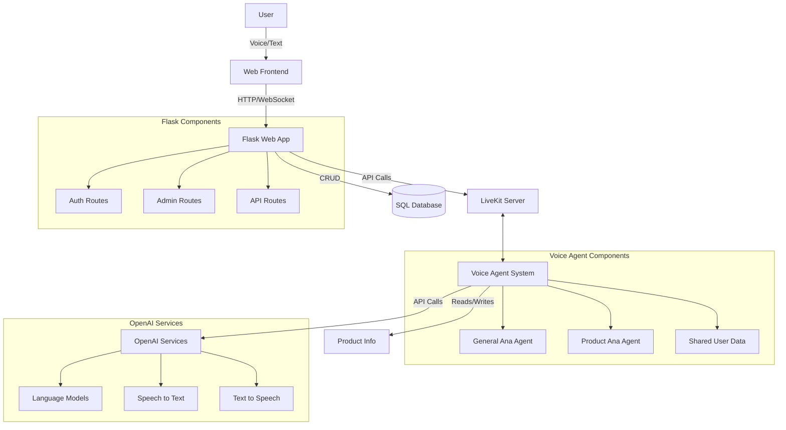
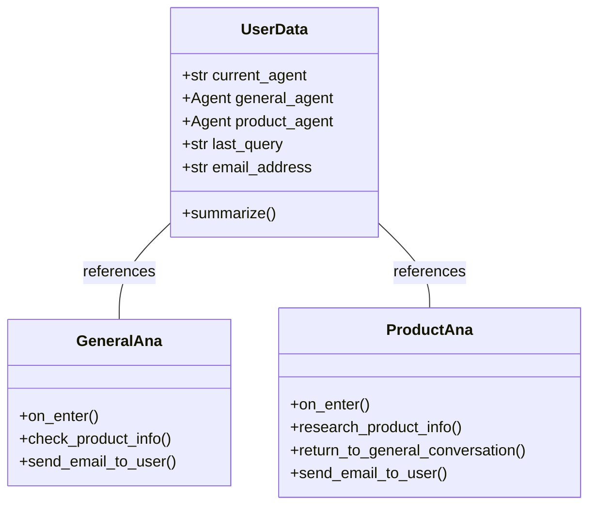
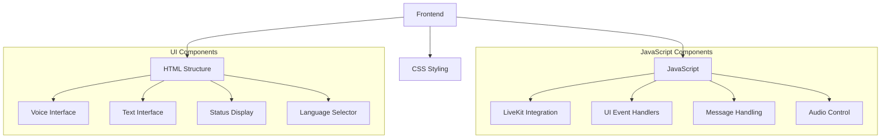
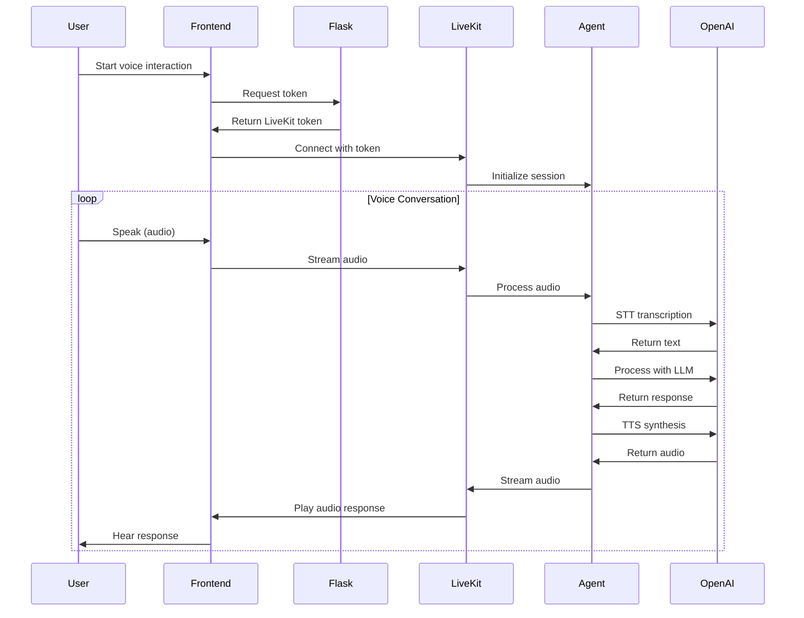
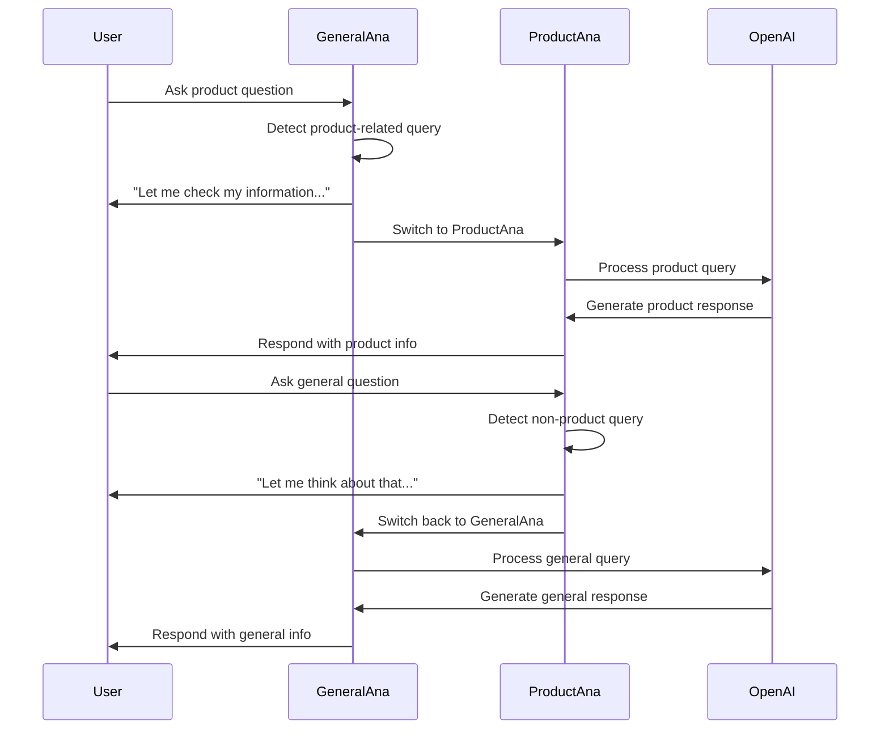
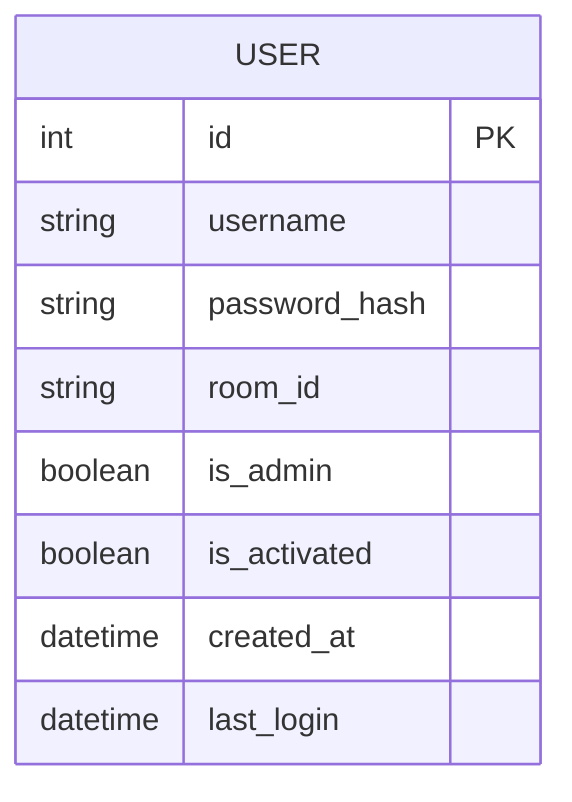

# Voice Agent Architecture Documentation Plan

## 1. System Overview

This document provides a comprehensive architectural overview of the LiveKit Voice Agent application, which consists of a voice-based AI agent system built with LiveKit and a web frontend powered by Flask.

### 1.1 Architecture Diagram



### 1.2 Key Components

- **Voice Agent System**: Core conversational AI system built with LiveKit agents framework
  - Located in `main.py`
  - Implements dual-agent architecture with specialized roles
  - Handles voice processing, NLP, and response generation

- **Web Application**: Flask-based web app providing UI and authentication
  - Located in `app.py` and the `routes/` directory
  - Serves web interface and manages authentication
  - Provides API endpoints for LiveKit token generation

- **Database**: SQLite database for user management
  - Located in `instance/app.db` with schema defined in `database.py`
  - Stores user accounts and authentication data

- **LiveKit Integration**: Real-time audio and communication layer
  - Client implementation in `static/js/interact.js`
  - Server-side token generation and management in API routes

- **OpenAI Services**: AI capabilities for language processing, speech recognition, and synthesis
  - Configured in the agent classes within `main.py`
  - Uses GPT-4 models for language understanding and generation
  - Employs specialized STT and TTS models for voice interaction

## 2. Detailed Component Documentation

### 2.1 Voice Agent System (main.py)

The Voice Agent System is the core of the application, handling all the conversational AI functionality.



#### 2.1.1 Agent Configuration

**System Prompts**
- `GENERAL_ANA_PROMPT`: Defines the personality, knowledge, and behavior for the general sales assistant
- `PRODUCT_ANA_PROMPT`: Extends the general prompt with product-specific information and instructions

**AI Model Configuration**
- **Speech-to-Text (STT)**: Uses Deepgram's Nova-3 model with multilingual support
- **Language Models (LLM)**: Uses OpenAI's GPT-4.1-mini models with appropriate temperature settings
  - General Agent: Temperature 0.5 for more creative responses
  - Product Agent: Temperature 0.2 for more precise product information
- **Text-to-Speech (TTS)**: Uses OpenAI's GPT-4o-mini-tts with the "alloy" voice

**Voice Activity Detection**
- Uses Silero VAD with custom configurations for each agent:
  - Quick response times (reduced silence duration)
  - Enhanced sensitivity for speech detection
  - Optimized buffering parameters

#### 2.1.2 Agent Functionality

**Function Tools**
- `check_product_info()`: Triggers agent switch for product-specific queries
- `research_product_info()`: Simulates looking up detailed product data
- `return_to_general_conversation()`: Switches back to general agent
- `send_email_to_user()`: Sends conversation transcripts or summaries via email

**Agent Switching Logic**
- Keyword-based detection of product-related queries
- Context preservation during agent transitions
- Seamless handoff with transition sounds

**Email Functionality**
- Email validation with regex
- Secure SMTP connection handling
- Formatting of conversation history
- Conversation summarization using OpenAI

### 2.2 Web Application (Flask)

The Flask application provides the web interface and handles authentication and API endpoints.

```mermaid
graph TD
    App[Flask App] --> Routes
    App --> Templates
    App --> StaticFiles
    App --> Database
    
    subgraph "Routes"
        Routes --> Auth[Auth Routes]
        Routes --> Admin[Admin Routes]
        Routes --> API[API Routes]
        Routes --> Main[Main Routes]
    end
    
    subgraph "Templates"
        Templates --> Base[base.html]
        Templates --> Auth[auth.html]
        Templates --> Interact[interact.html]
        Templates --> Admin[Admin Templates]
    end
    
    subgraph "Static Files"
        StaticFiles --> CSS
        StaticFiles --> JS
        StaticFiles --> Assets
    end
```

#### 2.2.1 Route Structure

**Main Routes (`app.py`)**
- `/`: Main entry point, redirects to interaction page or authentication
- `/interact`: Primary interface for voice agent interaction

**Authentication Routes (`routes/auth.py`)**
- `/auth`: Authentication page
- `/login`: User login processing
- `/register`: New user registration
- `/logout`: Session termination

**Admin Routes (`routes/admin.py`)**
- `/admin`: Admin dashboard
- `/admin/users`: User management interface
- `/admin/referrals`: Referral code management

**API Routes (`routes/api.py`)**
- `/api/token`: LiveKit token generation
- `/api/heartbeat`: Session keepalive endpoint

#### 2.2.2 Security and Authentication

**User Model**
- Defined in `database.py`
- Includes username, password hash, and room ID
- Tracks activation status and admin privileges

**Access Control**
- Flask-Login for session management
- Route protection with `@login_required` decorator
- Admin privilege verification

**Session Management**
- Secure cookie-based sessions
- CSRF protection with Flask-WTF
- Automatic session expiration

### 2.3 Frontend Implementation

The frontend provides the user interface for interacting with the voice agent.



#### 2.3.1 LiveKit Integration

**Connection Management**
- Token acquisition via API
- Room connection with error handling
- Event listener configuration
- Reconnection logic for language changes

**Audio Stream Management**
- Microphone activation/deactivation
- Audio track attachment
- Speaking indicators

**Text Stream Handling**
- Registration of text stream handlers
- Processing of transcription events
- Message formatting and display

**Error Handling**
- Connection failure recovery
- Microphone access error handling
- Session keepalive with heartbeat mechanism

#### 2.3.2 User Interface Components

**Voice Control Interface**
- Microphone button with visual feedback
- Voice activity visualization
- Status indicators for connection and recording state

**Text Input Interface**
- Text input field
- Send button
- Enter key support for message submission

**Message Display**
- Display of user and agent messages
- Typing animation for agent responses
- Scrolling and formatting of conversation history

**Language Selection**
- Language dropdown menu
- Support for English, Persian, Arabic, and French
- Dynamic reconnection upon language change

## 3. Data Flow Documentation

### 3.1 Voice Interaction Flow



1. **Initialization**
   - User loads the interact.html page
   - Frontend automatically requests a LiveKit token
   - Flask generates a token with the user's room ID
   - Frontend connects to LiveKit using the token
   - LiveKit initializes an agent session

2. **Voice Conversation Process**
   - User clicks the microphone button to start speaking
   - Audio is streamed to LiveKit in real-time
   - LiveKit routes audio to the voice agent
   - Speech is transcribed using Deepgram's STT
   - Transcribed text is processed by the appropriate agent
   - Agent generates a response using OpenAI's LLM
   - Response is converted to speech using OpenAI's TTS
   - Audio response is streamed back to the user
   - Frontend plays the audio and displays text

3. **Text Input Alternative**
   - User can type a message instead of speaking
   - Text is sent to LiveKit via text stream
   - Agent processes text same as voice transcription
   - Response follows the same path back to user

### 3.2 Agent Switching Flow



1. **Detection Phase**
   - System analyzes user queries for product-related keywords
   - If product keywords are detected in general conversation, trigger switch
   - If non-product topics are detected during product conversation, switch back

2. **Transition Process**
   - Current agent informs user of the knowledge shift
   - Transition sound plays (optional)
   - Context is preserved and passed to the new agent
   - New agent receives the original query

3. **Seamless Experience**
   - User experiences a single continuous conversation
   - No explicit mention of switching between different assistants
   - Personality remains consistent across agents

4. **Context Preservation**
   - Last query is stored in shared UserData
   - Chat history is maintained across agent switches
   - Email address and other user information persists

## 4. Database Schema



The database schema is relatively simple, with just one core table:

**User Table**
- `id`: Primary key, auto-incrementing integer
- `username`: Unique username (80 characters max)
- `password_hash`: Hashed password using Werkzeug security
- `room_id`: Unique room identifier for LiveKit
- `is_admin`: Boolean flag for administrative privileges
- `is_activated`: Boolean flag for account activation status
- `created_at`: Timestamp of account creation
- `last_login`: Timestamp of last successful login

The schema is implemented using SQLAlchemy ORM in `database.py`. The database file is stored in the `instance/` directory as `app.db`.

A helper method `generate_room_id()` creates unique room IDs for new users by combining "room-" with a UUID.

## 5. Configuration and Environment Variables

### 5.1 Core Configuration

The application uses a combination of configuration files and environment variables:

**Flask Configuration (`config.py`)**
- Secret key for session management
- Database URI for SQLAlchemy
- CSRF protection settings
- Session cookie settings

**Environment Variables (`.env`)**
- `OPENAI_API_KEY`: API key for OpenAI services
- `EMAIL_SENDER`: Email address for sending transcripts
- `EMAIL_PASSWORD`: Password for the sender email
- `EMAIL_SENDER_NAME`: Display name for the sender

### 5.2 LiveKit Configuration

**Server Configuration**
- LiveKit server URL
- API key and secret for token generation
- Room configuration settings

**Agent Configuration**
- Voice activity detection parameters
- Model selection for STT, LLM, and TTS
- Temperature and other model parameters

### 5.3 Development vs. Production

**Development Settings**
- Debug mode enabled
- Local SQLite database
- Potentially lower-tier AI models

**Production Settings**
- Debug mode disabled
- Secure cookie settings
- Production database (potentially PostgreSQL)
- Full logging configuration
- Error handling and monitoring

## 6. Deployment Guide

### 6.1 Server Requirements

- Python 3.8+ environment
- LiveKit server instance
- SMTP server access for email functionality
- Sufficient compute resources for AI processing
- Web server (Nginx, Apache, etc.) for production
- HTTPS certificate for secure connections

### 6.2 Installation Process

1. **Clone Repository**
   ```bash
   git clone <repository-url>
   cd livekitorg
   ```

2. **Create Virtual Environment**
   ```bash
   python -m venv venv
   source venv/bin/activate  # On Windows: venv\Scripts\activate
   ```

3. **Install Dependencies**
   ```bash
   pip install -r requirements.txt
   ```

4. **Configure Environment**
   - Create `.env` file with required variables
   - Set up LiveKit server or use LiveKit Cloud

5. **Initialize Database**
   ```bash
   flask db upgrade  # If using migrations
   # Or database will be initialized on first run
   ```

6. **Run Application**
   - Development: `python app.py`
   - Production: Use WSGI server (e.g., Gunicorn)

### 6.3 LiveKit Server Configuration

1. **Setting Up LiveKit Server**
   - Deploy LiveKit server using Docker or Kubernetes
   - Configure API key and secret
   - Set up TURN servers for NAT traversal

2. **LiveKit Cloud Alternative**
   - Register for LiveKit Cloud
   - Create project and obtain credentials
   - Update application configuration

### 6.4 Maintenance Procedures

- Regular database backups
- Log rotation and monitoring
- Security updates for dependencies
- OpenAI API usage monitoring
- Performance monitoring and optimization

## 7. Testing Strategy

### 7.1 Voice Agent Testing

- Unit tests for agent functionality
- Mock STT/TTS services for testing
- Scenario-based conversation testing
- Agent switching validation
- Email functionality testing

### 7.2 Web Application Testing

- Route functionality tests
- Authentication flow testing
- Session management validation
- CSRF protection verification
- Form validation testing

### 7.3 API Testing

- Token generation endpoint testing
- Authentication for protected endpoints
- Error handling validation
- Rate limiting tests

### 7.4 End-to-End Testing

- Complete user flows from login to conversation
- Voice interaction testing with recorded samples
- Cross-browser compatibility testing
- Mobile responsiveness validation
- Multi-language support testing

## 8. Future Development Roadmap

### 8.1 Architecture Extension Points

- **Additional Agents**: Framework supports adding specialized agents
- **Enhanced Context Management**: Potential for long-term memory
- **Integration Capabilities**: APIs for external system connections
- **Authentication Systems**: Support for OAuth and SSO

### 8.2 Potential Enhancements

- **Conversation Analysis**: Add analytics for conversation insights
- **Knowledge Base Integration**: Connect to external knowledge sources
- **Multi-User Conversations**: Support for group interactions
- **Enhanced Security**: Role-based access control
- **Custom Voice Generation**: Brand-specific voice customization

### 8.3 Known Limitations

- **Scalability Constraints**: Current architecture may need optimization for high volumes
- **Dependency on External Services**: Requires OpenAI and LiveKit availability
- **Language Support**: Limited to configured languages
- **Browser Compatibility**: Advanced features may not work in all browsers

## 9. Documentation Deliverables

1. **System Architecture Document**: Overall system design and component interactions
   - This document serves as the foundation
   - Should be kept updated as architecture evolves

2. **Component Documentation**: Detailed documentation of each system component
   - Voice Agent System documentation
   - Web Application documentation
   - Frontend Implementation guide

3. **API Documentation**: Endpoints, parameters, and responses
   - LiveKit integration API
   - Authentication endpoints
   - Internal service APIs

4. **Database Schema Documentation**: Tables, relationships, and indexes
   - Current schema documentation
   - Migration guidelines

5. **Deployment Guide**: Step-by-step instructions for deployment
   - Development environment setup
   - Production deployment instructions
   - Scaling considerations

6. **Developer Guide**: How to extend and modify the system
   - Adding new agent types
   - Extending the web interface
   - Implementing new features

7. **User Guide**: How to use the application
   - End-user documentation
   - Administrator manual
   - Troubleshooting guide